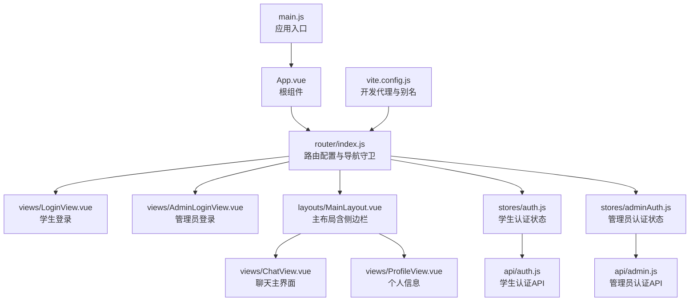
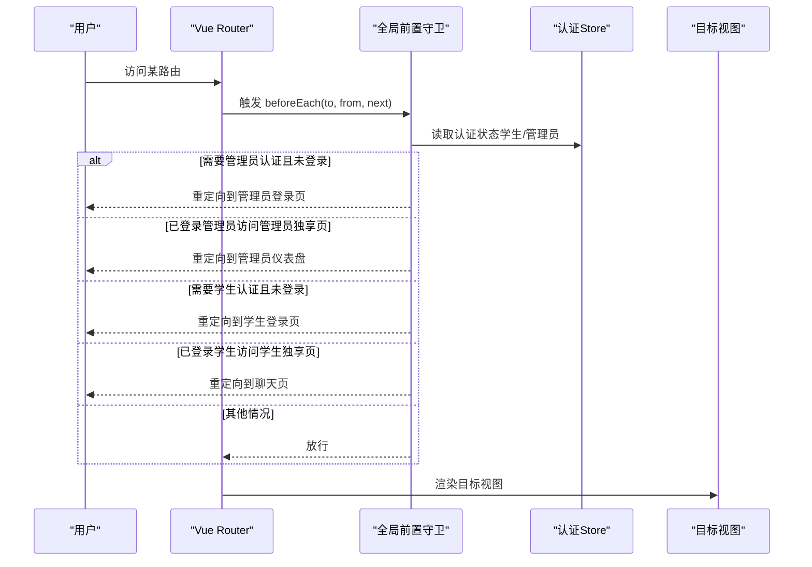
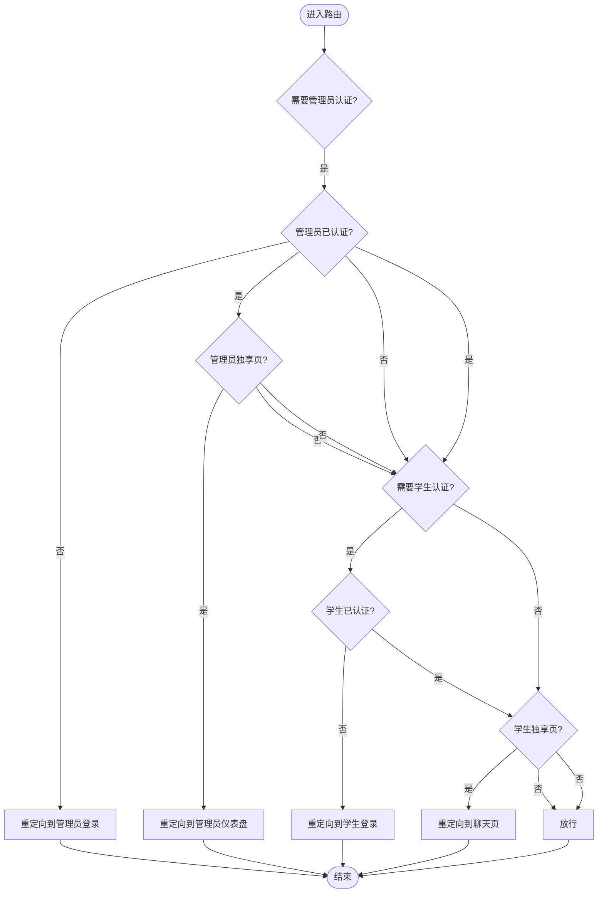
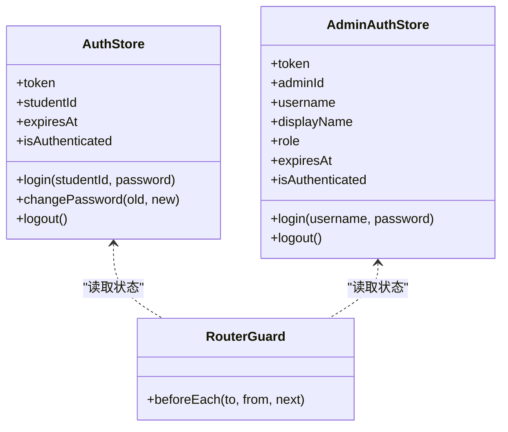
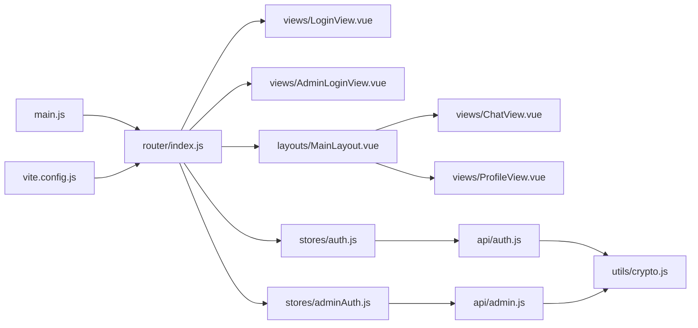

# 路由系统

<cite>
**本文引用的文件**
- [router/index.js](file://frontend/ai_assistant/src/router/index.js)
- [main.js](file://frontend/ai_assistant/src/main.js)
- [App.vue](file://frontend/ai_assistant/src/App.vue)
- [LoginView.vue](file://frontend/ai_assistant/src/views/LoginView.vue)
- [AdminLoginView.vue](file://frontend/ai_assistant/src/views/AdminLoginView.vue)
- [MainLayout.vue](file://frontend/ai_assistant/src/layouts/MainLayout.vue)
- [ChatView.vue](file://frontend/ai_assistant/src/views/ChatView.vue)
- [ProfileView.vue](file://frontend/ai_assistant/src/views/ProfileView.vue)
- [auth.js](file://frontend/ai_assistant/src/stores/auth.js)
- [adminAuth.js](file://frontend/ai_assistant/src/stores/adminAuth.js)
- [auth.js](file://frontend/ai_assistant/src/api/auth.js)
- [admin.js](file://frontend/ai_assistant/src/api/admin.js)
- [crypto.js](file://frontend/ai_assistant/src/utils/crypto.js)
- [vite.config.js](file://frontend/ai_assistant/vite.config.js)
</cite>

## 目录
1. [简介](#简介)
2. [项目结构](#项目结构)
3. [核心组件](#核心组件)
4. [架构总览](#架构总览)
5. [详细组件分析](#详细组件分析)
6. [依赖关系分析](#依赖关系分析)
7. [性能考量](#性能考量)
8. [故障排查指南](#故障排查指南)
9. [结论](#结论)
10. [附录](#附录)

## 简介
本文件面向AI校园助手项目的前端路由系统，系统性梳理Vue Router的配置与使用，涵盖：
- 路由定义、嵌套路由与动态路由
- 导航守卫（全局前置守卫、路由独享守卫、组件内守卫）的实现与作用
- 权限控制机制（基于角色的访问控制与路由级权限验证）
- 路由懒加载与代码分割策略
- 路由参数传递、查询参数处理与路由元信息使用
- 实际应用场景与最佳实践

## 项目结构
前端采用单页应用（SPA）架构，路由通过Vue Router集中管理，配合Pinia状态管理与API封装，实现学生端与管理员端的双入口、双权限体系。

图表来源
- [router/index.js:1-75](file://frontend/ai_assistant/src/router/index.js#L1-L75)
- [main.js:1-10](file://frontend/ai_assistant/src/main.js#L1-L10)
- [App.vue:1-7](file://frontend/ai_assistant/src/App.vue#L1-L7)
- [MainLayout.vue:1-487](file://frontend/ai_assistant/src/layouts/MainLayout.vue#L1-L487)
- [auth.js:1-77](file://frontend/ai_assistant/src/stores/auth.js#L1-L77)
- [adminAuth.js:1-77](file://frontend/ai_assistant/src/stores/adminAuth.js#L1-L77)
- [auth.js:1-36](file://frontend/ai_assistant/src/api/auth.js#L1-L36)
- [admin.js:1-41](file://frontend/ai_assistant/src/api/admin.js#L1-L41)
- [vite.config.js:1-23](file://frontend/ai_assistant/vite.config.js#L1-L23)

章节来源
- [router/index.js:1-75](file://frontend/ai_assistant/src/router/index.js#L1-L75)
- [main.js:1-10](file://frontend/ai_assistant/src/main.js#L1-L10)
- [App.vue:1-7](file://frontend/ai_assistant/src/App.vue#L1-L7)
- [vite.config.js:1-23](file://frontend/ai_assistant/vite.config.js#L1-L23)

## 核心组件
- 路由配置与导航守卫：集中于router/index.js，定义路由表、嵌套路由与全局前置守卫。
- 应用入口：main.js注册Pinia与Vue Router，挂载应用。
- 根组件：App.vue承载router-view，作为路由视图容器。
- 视图组件：LoginView.vue、AdminLoginView.vue、MainLayout.vue、ChatView.vue、ProfileView.vue等。
- 状态管理：auth.js与adminAuth.js分别维护学生与管理员的认证状态与生命周期方法。
- API封装：auth.js与admin.js封装认证相关请求，配合utils/crypto.js进行密码加密。
- 构建配置：vite.config.js提供开发代理与路径别名，便于模块导入。

章节来源
- [router/index.js:1-75](file://frontend/ai_assistant/src/router/index.js#L1-L75)
- [main.js:1-10](file://frontend/ai_assistant/src/main.js#L1-L10)
- [App.vue:1-7](file://frontend/ai_assistant/src/App.vue#L1-L7)
- [auth.js:1-77](file://frontend/ai_assistant/src/stores/auth.js#L1-L77)
- [adminAuth.js:1-77](file://frontend/ai_assistant/src/stores/adminAuth.js#L1-L77)
- [auth.js:1-36](file://frontend/ai_assistant/src/api/auth.js#L1-L36)
- [admin.js:1-41](file://frontend/ai_assistant/src/api/admin.js#L1-L41)
- [crypto.js:1-40](file://frontend/ai_assistant/src/utils/crypto.js#L1-L40)
- [vite.config.js:1-23](file://frontend/ai_assistant/vite.config.js#L1-L23)

## 架构总览
路由系统围绕“双入口、双权限”设计：
- 学生入口：/login、/（嵌套在MainLayout下）、/profile、/change-password
- 管理员入口：/admin/login、/admin（管理员仪表盘）
- 全局守卫统一校验：根据路由元信息与认证状态决定跳转目标
- 懒加载：所有视图组件均通过动态导入实现代码分割
- 权限控制：通过路由元信息与store状态共同实现

图表来源
- [router/index.js:57-73](file://frontend/ai_assistant/src/router/index.js#L57-L73)
- [auth.js:17-77](file://frontend/ai_assistant/src/stores/auth.js#L17-L77)
- [adminAuth.js:16-77](file://frontend/ai_assistant/src/stores/adminAuth.js#L16-L77)

## 详细组件分析

### 路由定义与嵌套路由
- 路由表包含多个静态路由与一个通配符兜底路由，确保未知路径安全回退。
- 主布局路由（/）嵌套子路由，实现侧边栏导航与主内容区的解耦。
- 通配符路由根据路径前缀重定向至对应主入口，避免死胡同。

章节来源
- [router/index.js:5-50](file://frontend/ai_assistant/src/router/index.js#L5-L50)

### 导航守卫详解
- 全局前置守卫：在router/index.js中实现，依据to.meta与两个认证store的状态执行重定向逻辑。
- 路由独享守卫：本项目未使用路由级beforeEnter，权限控制集中在全局守卫。
- 组件内守卫：本项目未使用beforeRouteEnter/Update/Leave，权限控制集中在全局守卫。

图表来源
- [router/index.js:57-73](file://frontend/ai_assistant/src/router/index.js#L57-L73)

章节来源
- [router/index.js:57-73](file://frontend/ai_assistant/src/router/index.js#L57-L73)

### 权限控制机制
- 基于角色的访问控制：通过两个独立的认证store（学生与管理员）维护各自token与过期时间，计算isAuthenticated。
- 路由级权限验证：通过路由元信息（requiresAuth、guest、requiresAdminAuth、adminGuest）与全局守卫联动，实现精确的访问控制。
- 登录流程：登录组件调用对应API，成功后写入localStorage并跳转至目标路由；登出时清理store与localStorage。

图表来源
- [auth.js:17-77](file://frontend/ai_assistant/src/stores/auth.js#L17-L77)
- [adminAuth.js:16-77](file://frontend/ai_assistant/src/stores/adminAuth.js#L16-L77)
- [router/index.js:57-73](file://frontend/ai_assistant/src/router/index.js#L57-L73)

章节来源
- [auth.js:17-77](file://frontend/ai_assistant/src/stores/auth.js#L17-L77)
- [adminAuth.js:16-77](file://frontend/ai_assistant/src/stores/adminAuth.js#L16-L77)
- [router/index.js:57-73](file://frontend/ai_assistant/src/router/index.js#L57-L73)

### 路由懒加载与性能优化
- 动态导入：所有视图组件均通过函数式动态导入实现懒加载，减少首屏体积。
- 代码分割：结合Vite打包器，按需生成chunk，提升加载效率。
- 性能建议：可进一步利用路由级懒加载与webpack魔法注释进行更细粒度的分包与预加载策略。

章节来源
- [router/index.js:9,15,21,32,37,42:9-42](file://frontend/ai_assistant/src/router/index.js#L9-L42)

### 路由参数传递、查询参数与元信息
- 路由参数：本项目未使用动态路由参数（:id），主要通过命名路由与查询参数传递简单数据。
- 查询参数：在视图组件中可通过useRouter/useRoute读取查询参数，用于初始化界面状态或筛选条件。
- 路由元信息：通过meta字段声明路由特性（如requiresAuth、guest、requiresAdminAuth、adminGuest），全局守卫据此决策。

章节来源
- [router/index.js:10,16,22,27,47-49:10-49](file://frontend/ai_assistant/src/router/index.js#L10-L49)

### 实际应用场景
- 学生登录后自动跳转至聊天页，未登录访问受保护路由自动跳转至登录页。
- 管理员登录后自动跳转至管理员仪表盘，已登录管理员访问管理员登录页自动跳转至仪表盘。
- 主布局侧边栏导航与路由状态联动，支持移动端侧栏切换与会话管理。

章节来源
- [LoginView.vue:94-121](file://frontend/ai_assistant/src/views/LoginView.vue#L94-L121)
- [AdminLoginView.vue:75-105](file://frontend/ai_assistant/src/views/AdminLoginView.vue#L75-L105)
- [MainLayout.vue:70-92](file://frontend/ai_assistant/src/layouts/MainLayout.vue#L70-L92)

## 依赖关系分析
- 路由依赖：router/index.js依赖两个认证store与各视图组件的动态导入。
- 视图依赖：各视图组件依赖对应的store与API封装，部分组件依赖布局组件。
- 构建依赖：vite.config.js提供路径别名与开发代理，简化模块导入与跨域调试。

图表来源
- [router/index.js:1-75](file://frontend/ai_assistant/src/router/index.js#L1-L75)
- [main.js:1-10](file://frontend/ai_assistant/src/main.js#L1-L10)
- [vite.config.js:1-23](file://frontend/ai_assistant/vite.config.js#L1-L23)
- [auth.js:1-77](file://frontend/ai_assistant/src/stores/auth.js#L1-L77)
- [adminAuth.js:1-77](file://frontend/ai_assistant/src/stores/adminAuth.js#L1-L77)
- [auth.js:1-36](file://frontend/ai_assistant/src/api/auth.js#L1-L36)
- [admin.js:1-41](file://frontend/ai_assistant/src/api/admin.js#L1-L41)
- [crypto.js:1-40](file://frontend/ai_assistant/src/utils/crypto.js#L1-L40)

章节来源
- [router/index.js:1-75](file://frontend/ai_assistant/src/router/index.js#L1-L75)
- [main.js:1-10](file://frontend/ai_assistant/src/main.js#L1-L10)
- [vite.config.js:1-23](file://frontend/ai_assistant/vite.config.js#L1-L23)

## 性能考量
- 懒加载与代码分割：所有视图组件均采用动态导入，有效降低首屏资源体积。
- 开发代理：Vite代理将/api请求转发至后端，避免CORS与路径前缀问题，提升开发体验。
- 建议优化：可结合路由级懒加载与webpack魔法注释进行更细粒度的分包与预加载策略，进一步优化首屏渲染与交互延迟。

章节来源
- [router/index.js:9,15,21,32,37,42:9-42](file://frontend/ai_assistant/src/router/index.js#L9-L42)
- [vite.config.js:15-21](file://frontend/ai_assistant/vite.config.js#L15-L21)

## 故障排查指南
- 登录后仍被重定向到登录页
  - 检查认证store是否正确写入token与过期时间，并确认localStorage键值是否存在。
  - 确认全局守卫逻辑与路由元信息是否匹配。
- 管理员登录后被重定向到管理员仪表盘
  - 检查管理员store的isAuthenticated计算属性与路由元信息requiresAdminAuth。
- 401/403错误
  - 查看登录组件对错误响应的处理分支，确认后端返回的错误码与提示信息。
- 路由跳转异常
  - 检查通配符兜底路由redirect逻辑，确保根据路径前缀正确回退。

章节来源
- [router/index.js:57-73](file://frontend/ai_assistant/src/router/index.js#L57-L73)
- [LoginView.vue:108-121](file://frontend/ai_assistant/src/views/LoginView.vue#L108-L121)
- [AdminLoginView.vue:87-105](file://frontend/ai_assistant/src/views/AdminLoginView.vue#L87-L105)
- [auth.js:17-77](file://frontend/ai_assistant/src/stores/auth.js#L17-L77)
- [adminAuth.js:16-77](file://frontend/ai_assistant/src/stores/adminAuth.js#L16-L77)

## 结论
本路由系统以简洁清晰的配置实现了双入口、双权限的复杂业务场景，通过全局前置守卫与路由元信息达成路由级权限控制，结合懒加载与构建代理显著提升了性能与开发体验。建议在后续迭代中引入更细粒度的分包策略与组件内守卫，以满足更复杂的权限与交互需求。

## 附录
- 路由配置示例路径
  - [路由表与通配符重定向:5-50](file://frontend/ai_assistant/src/router/index.js#L5-L50)
  - [全局前置守卫:57-73](file://frontend/ai_assistant/src/router/index.js#L57-L73)
- 权限控制示例路径
  - [学生认证store:17-77](file://frontend/ai_assistant/src/stores/auth.js#L17-L77)
  - [管理员认证store:16-77](file://frontend/ai_assistant/src/stores/adminAuth.js#L16-L77)
  - [学生登录API:15-20](file://frontend/ai_assistant/src/api/auth.js#L15-L20)
  - [管理员登录API:7-12](file://frontend/ai_assistant/src/api/admin.js#L7-L12)
- 布局与视图示例路径
  - [主布局与侧边栏导航:1-487](file://frontend/ai_assistant/src/layouts/MainLayout.vue#L1-L487)
  - [聊天视图:1-800](file://frontend/ai_assistant/src/views/ChatView.vue#L1-L800)
  - [个人信息视图:1-380](file://frontend/ai_assistant/src/views/ProfileView.vue#L1-L380)
  - [学生登录视图:1-343](file://frontend/ai_assistant/src/views/LoginView.vue#L1-L343)
  - [管理员登录视图:1-261](file://frontend/ai_assistant/src/views/AdminLoginView.vue#L1-L261)
- 构建与工具
  - [Vite开发代理与别名:1-23](file://frontend/ai_assistant/vite.config.js#L1-L23)
  - [AES-CBC加密工具:1-40](file://frontend/ai_assistant/src/utils/crypto.js#L1-L40)