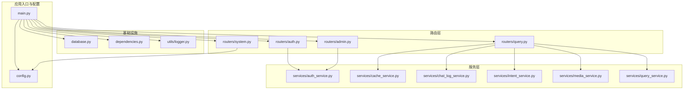
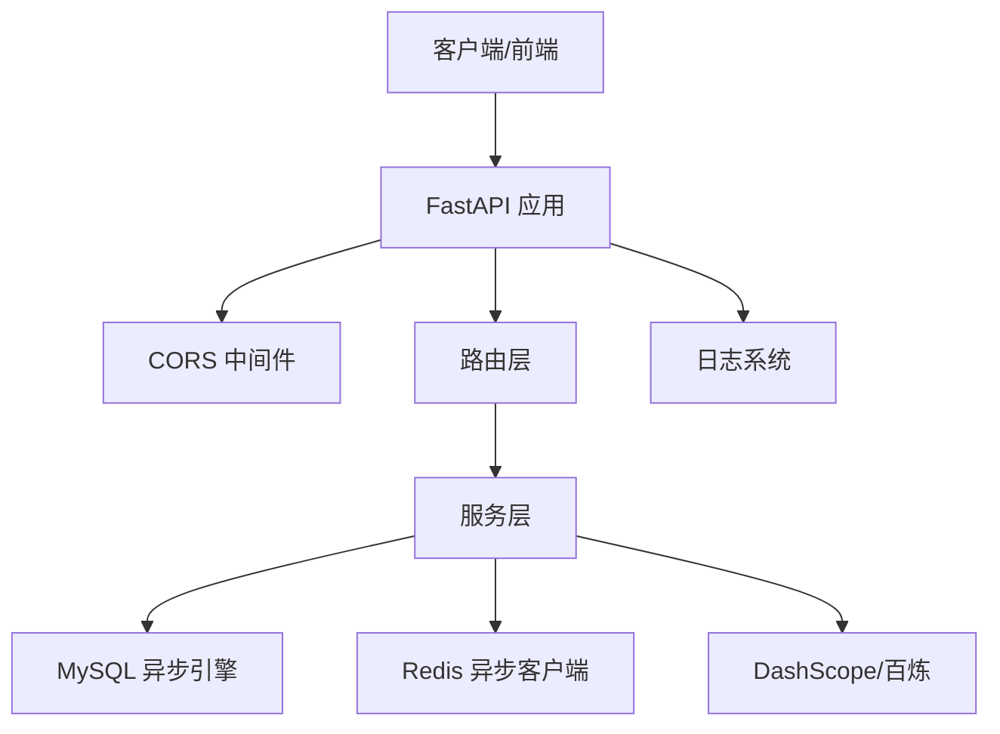
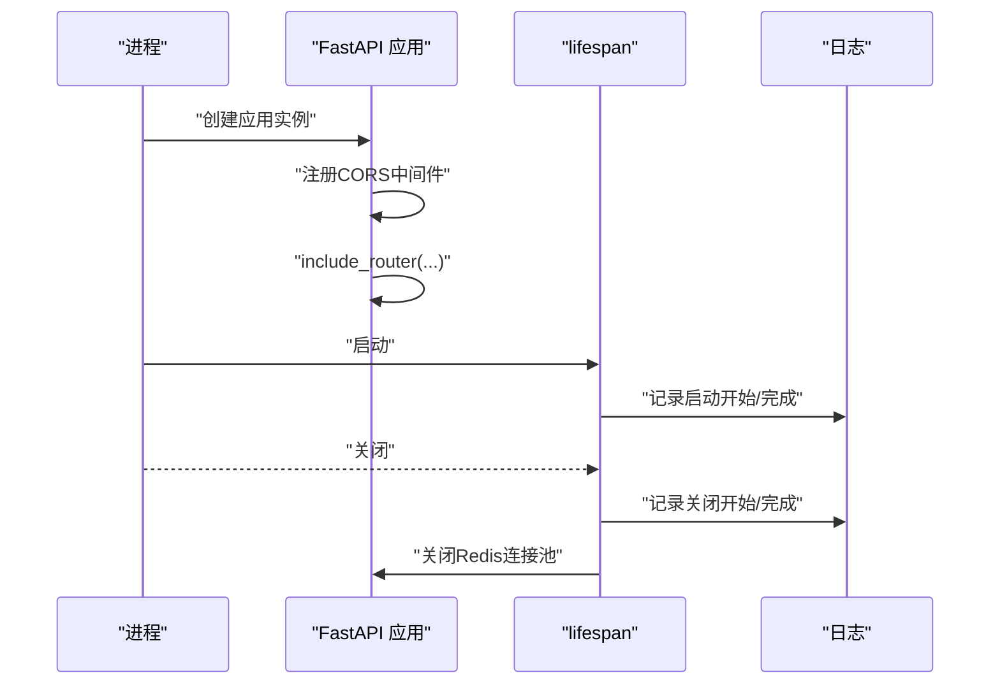
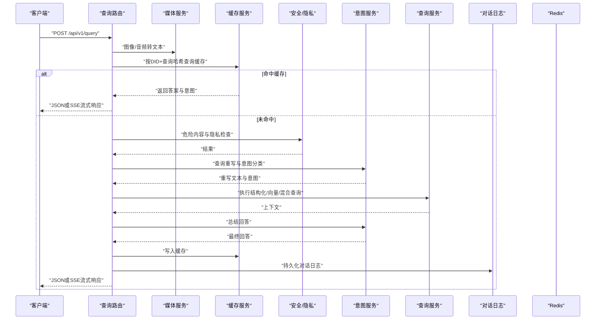
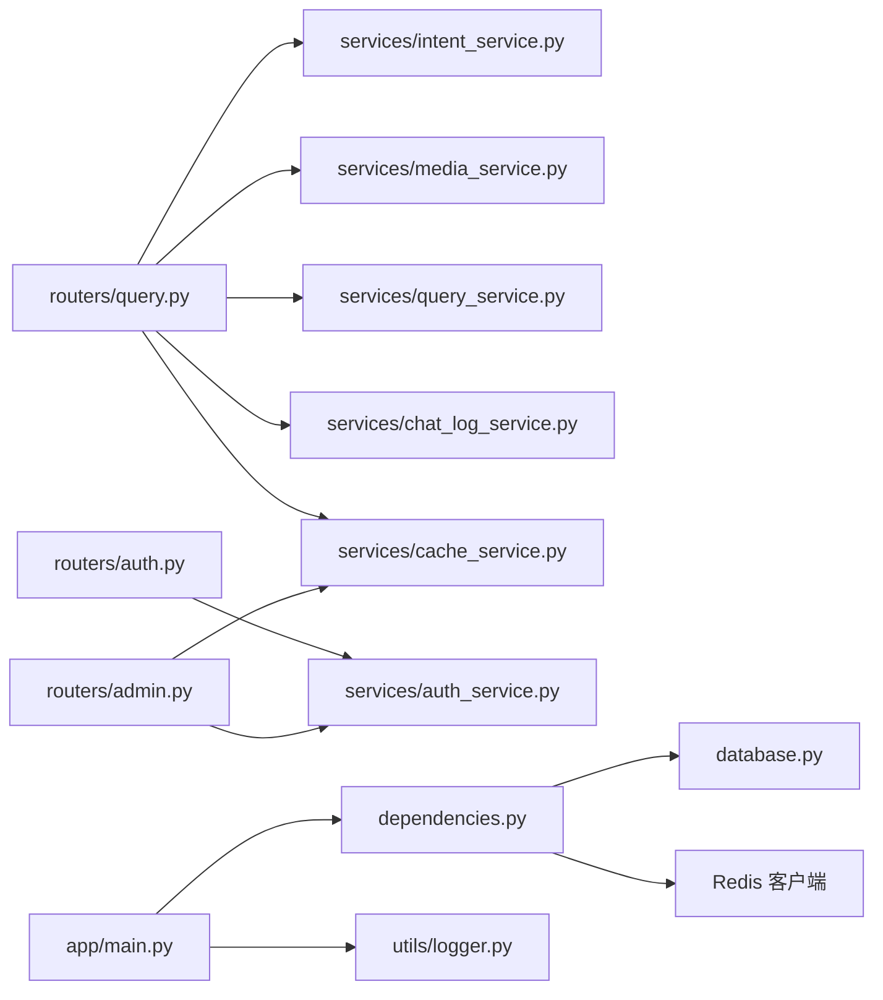

# 后端架构

<cite>
**本文档引用的文件**
- [main.py](file://service/ai_assistant/app/main.py)
- [config.py](file://service/ai_assistant/app/config.py)
- [database.py](file://service/ai_assistant/app/database.py)
- [dependencies.py](file://service/ai_assistant/app/dependencies.py)
- [logger.py](file://service/ai_assistant/app/utils/logger.py)
- [auth.py](file://service/ai_assistant/app/routers/auth.py)
- [admin.py](file://service/ai_assistant/app/routers/admin.py)
- [query.py](file://service/ai_assistant/app/routers/query.py)
- [system.py](file://service/ai_assistant/app/routers/system.py)
- [auth_service.py](file://service/ai_assistant/app/services/auth_service.py)
- [cache_service.py](file://service/ai_assistant/app/services/cache_service.py)
- [chat_log_service.py](file://service/ai_assistant/app/services/chat_log_service.py)
- [intent_service.py](file://service/ai_assistant/app/services/intent_service.py)
- [media_service.py](file://service/ai_assistant/app/services/media_service.py)
- [query_service.py](file://service/ai_assistant/app/services/query_service.py)
</cite>

## 目录
1. [引言](#引言)
2. [项目结构](#项目结构)
3. [核心组件](#核心组件)
4. [架构总览](#架构总览)
5. [详细组件分析](#详细组件分析)
6. [依赖分析](#依赖分析)
7. [性能考量](#性能考量)
8. [故障排查指南](#故障排查指南)
9. [结论](#结论)
10. [附录](#附录)

## 引言
本文件面向AI校园助手项目的后端团队与维护者，系统化梳理基于FastAPI的后端架构设计与实现要点。文档围绕应用入口初始化、中间件与生命周期管理、路由分层、服务层与数据访问层职责、异步编程模式、缓存与数据库连接管理、CORS与错误处理、日志体系等维度展开，辅以架构图与时序图，帮助读者快速理解并高效迭代。

## 项目结构
后端采用典型的分层架构组织：
- 应用入口与生命周期：app/main.py
- 配置中心：app/config.py
- 数据库与ORM：app/database.py
- 依赖注入与认证：app/dependencies.py
- 日志：app/utils/logger.py
- 路由层：app/routers/*
- 服务层：app/services/*
- 模型定义与枚举：app/models/*

**图表来源**
- [main.py:1-86](file://service/ai_assistant/app/main.py#L1-L86)
- [config.py:1-113](file://service/ai_assistant/app/config.py#L1-L113)
- [database.py:1-35](file://service/ai_assistant/app/database.py#L1-L35)
- [dependencies.py:1-109](file://service/ai_assistant/app/dependencies.py#L1-L109)
- [logger.py:1-53](file://service/ai_assistant/app/utils/logger.py#L1-L53)
- [auth.py:1-102](file://service/ai_assistant/app/routers/auth.py#L1-L102)
- [admin.py:1-388](file://service/ai_assistant/app/routers/admin.py#L1-L388)
- [query.py:1-788](file://service/ai_assistant/app/routers/query.py#L1-L788)
- [system.py:1-38](file://service/ai_assistant/app/routers/system.py#L1-L38)
- [auth_service.py:1-253](file://service/ai_assistant/app/services/auth_service.py#L1-L253)
- [cache_service.py:1-177](file://service/ai_assistant/app/services/cache_service.py#L1-L177)
- [chat_log_service.py:1-76](file://service/ai_assistant/app/services/chat_log_service.py#L1-L76)
- [intent_service.py:1-346](file://service/ai_assistant/app/services/intent_service.py#L1-L346)
- [media_service.py:1-246](file://service/ai_assistant/app/services/media_service.py#L1-L246)
- [query_service.py:1-800](file://service/ai_assistant/app/services/query_service.py#L1-L800)

**章节来源**
- [main.py:1-86](file://service/ai_assistant/app/main.py#L1-L86)
- [config.py:1-113](file://service/ai_assistant/app/config.py#L1-L113)

## 核心组件
- 应用入口与生命周期
  - 初始化FastAPI应用，注册CORS中间件，注册路由，定义lifespan启动/关闭钩子（校验不安全默认值、关闭Redis连接池）。
- 配置中心
  - 使用Pydantic Settings集中管理MySQL/Redis/JWT/AES/DashScope/百炼检索等配置项，提供数据库URL与Redis URL工厂方法，CORS允许来源解析。
- 数据库与ORM
  - 基于SQLAlchemy 2.x异步引擎与会话工厂，提供异步上下文生成器，统一基类模型。
- 依赖注入与认证
  - 提供数据库会话依赖、Redis客户端单例依赖、JWT Bearer认证依赖（学生/管理员），并校验令牌有效性与账户状态。
- 日志系统
  - 基于Loguru，控制台与文件双通道输出，自动旋转与保留策略，幂等初始化。
- 路由层
  - 认证路由（登录/改密）、管理员路由（登录/仪表盘/元数据/课表管理）、查询路由（统一多模态输入、意图分类、缓存、LLM总结、SSE流式输出）、系统路由（健康检查/版本）。
- 服务层
  - 认证服务（JWT签发/解码、AES解密、密码哈希验证、管理员登录）、缓存服务（MD5键、TTL、日期/课表版本失效策略）、对话日志服务（隐私脱敏、危险标记）、意图服务（分类/重写/总结/流式）、媒体服务（图像/音频转文本）、查询服务（结构化/向量/混合执行、工具规划、字段翻译、周次计算）。

**章节来源**
- [main.py:36-86](file://service/ai_assistant/app/main.py#L36-L86)
- [config.py:6-113](file://service/ai_assistant/app/config.py#L6-L113)
- [database.py:1-35](file://service/ai_assistant/app/database.py#L1-L35)
- [dependencies.py:1-109](file://service/ai_assistant/app/dependencies.py#L1-L109)
- [logger.py:1-53](file://service/ai_assistant/app/utils/logger.py#L1-L53)
- [auth.py:1-102](file://service/ai_assistant/app/routers/auth.py#L1-L102)
- [admin.py:1-388](file://service/ai_assistant/app/routers/admin.py#L1-L388)
- [query.py:1-788](file://service/ai_assistant/app/routers/query.py#L1-L788)
- [system.py:1-38](file://service/ai_assistant/app/routers/system.py#L1-L38)
- [auth_service.py:1-253](file://service/ai_assistant/app/services/auth_service.py#L1-L253)
- [cache_service.py:1-177](file://service/ai_assistant/app/services/cache_service.py#L1-L177)
- [chat_log_service.py:1-76](file://service/ai_assistant/app/services/chat_log_service.py#L1-L76)
- [intent_service.py:1-346](file://service/ai_assistant/app/services/intent_service.py#L1-L346)
- [media_service.py:1-246](file://service/ai_assistant/app/services/media_service.py#L1-L246)
- [query_service.py:1-800](file://service/ai_assistant/app/services/query_service.py#L1-L800)

## 架构总览
后端采用“路由层-服务层-数据访问层”的清晰分层，配合异步编程与外部服务集成，形成高内聚低耦合的模块化架构。

**图表来源**
- [main.py:52-86](file://service/ai_assistant/app/main.py#L52-L86)
- [config.py:86-110](file://service/ai_assistant/app/config.py#L86-L110)
- [database.py:7-20](file://service/ai_assistant/app/database.py#L7-L20)
- [dependencies.py:36-50](file://service/ai_assistant/app/dependencies.py#L36-L50)
- [logger.py:17-46](file://service/ai_assistant/app/utils/logger.py#L17-L46)

## 详细组件分析

### 应用入口与生命周期
- 初始化与中间件
  - 创建FastAPI实例，设置标题、版本、文档端点，注册CORSMiddleware，允许来源由配置解析。
- 生命周期管理
  - lifespan启动：检查不安全默认配置并告警；完成启动。
  - lifespan关闭：关闭Redis连接池，确保资源释放。
- 路由注册
  - 注册认证、管理员、查询、系统路由，记录注册日志。

**图表来源**
- [main.py:52-86](file://service/ai_assistant/app/main.py#L52-L86)

**章节来源**
- [main.py:36-86](file://service/ai_assistant/app/main.py#L36-L86)

### 配置中心
- 配置项
  - 应用基础、数据库、Redis、JWT、AES、隐私盐、对话上下文长度、DashScope百炼、模型配置、缓存TTL。
- URL工厂
  - database_url与redis_url，支持密码与编码配置。
- CORS解析
  - 支持逗号分隔与通配符，返回列表。

**章节来源**
- [config.py:6-113](file://service/ai_assistant/app/config.py#L6-L113)

### 数据库与ORM
- 异步引擎
  - 基于aiomysql，启用pre_ping与recycle，DEBUG时开启echo。
- 会话工厂
  - AsyncSessionLocal，expire_on_commit=false，autoflush/false，autocommit=false。
- 基类模型
  - Base类，统一ORM基类。
- 会话依赖
  - 异步上下文生成器，确保finally中关闭会话。

**章节来源**
- [database.py:1-35](file://service/ai_assistant/app/database.py#L1-L35)

### 依赖注入与认证
- 数据库会话
  - get_db依赖，异步上下文生成器。
- Redis客户端
  - 单例模式，延迟初始化，from_url工厂。
- JWT认证
  - get_current_user：解码学生令牌，校验角色与主体。
  - get_current_admin：解码管理员令牌，查询账户状态并校验激活。

**章节来源**
- [dependencies.py:27-109](file://service/ai_assistant/app/dependencies.py#L27-L109)

### 日志系统
- 初始化
  - 幂等初始化，移除默认sink，添加stdout与文件sink，设置格式、旋转与保留。
- 使用
  - 所有模块共享logger，统一落盘到logs目录。

**章节来源**
- [logger.py:17-53](file://service/ai_assistant/app/utils/logger.py#L17-L53)

### 路由层设计
- 认证路由
  - 登录：AES解密密码，校验后签发JWT。
  - 修改密码：Bearer校验，旧密码验证，新密码不可与旧密码相同。
- 管理员路由
  - 登录：AES解密密码，校验管理员状态，签发JWT。
  - 仪表盘：统计待处理调课、活跃/取消课表数量等。
  - 元数据：学期/班级列表。
  - 课表管理：筛选/分页/状态变更，变更后写入管理员操作日志并尝试提升缓存版本。
- 查询路由
  - 统一入口，支持文本/图像/音频多模态输入，SSE流式输出。
  - 流程：多模态转文本 → 统一查询 → 缓存命中 → 安全检查/隐私检查 → 意图重写 → 并发执行危险检查与查询重写 → 意图分类 → 查询执行（结构化/向量/混合）→ LLM总结 → 缓存响应 → 写入对话日志与会话历史。
- 系统路由
  - 健康检查与版本查询。

**章节来源**
- [auth.py:1-102](file://service/ai_assistant/app/routers/auth.py#L1-L102)
- [admin.py:1-388](file://service/ai_assistant/app/routers/admin.py#L1-L388)
- [query.py:1-788](file://service/ai_assistant/app/routers/query.py#L1-L788)
- [system.py:1-38](file://service/ai_assistant/app/routers/system.py#L1-L38)

### 服务层详解

#### 认证服务
- JWT签发
  - create_access_token/create_admin_access_token，设置exp与iat。
- JWT解码
  - decode_access_token/decode_admin_access_token，校验角色与主体。
- 登录与改密
  - authenticate_student/authenticate_admin，AES解密与SHA256哈希校验。
  - change_password，旧密码验证、新旧对比、提交更新。

**章节来源**
- [auth_service.py:45-253](file://service/ai_assistant/app/services/auth_service.py#L45-L253)

#### 缓存服务
- 键空间
  - chat_cache:{version}:{did}:{md5(query_text)}，版本v3。
- TTL策略
  - 敏感/隐私查询30分钟，普通查询1天。
- 失效策略
  - 日期敏感查询按“当日桶”校验；课表敏感查询按“课表缓存版本”校验；管理员更改课表后递增版本。
- 写入与读取
  - set_cached_response/get_cached_response，带_meta元信息。

**章节来源**
- [cache_service.py:49-177](file://service/ai_assistant/app/services/cache_service.py#L49-L177)

#### 对话日志服务
- 隐私策略
  - 普通消息仅存储DID，危险消息存储原始student_id。
- 能力
  - log_message持久化，get_recent_messages按DID与时间倒序加载。

**章节来源**
- [chat_log_service.py:14-76](file://service/ai_assistant/app/services/chat_log_service.py#L14-L76)

#### 意图与回答服务
- 意图分类
  - classify_intent，基于提示词模板调用LLM，返回structured/vector/hybrid/smalltalk。
- 查询重写
  - rewrite_query_with_context，结合历史上下文重写，限定长度。
- 回答生成
  - summarize_answer（一次性）与summarize_answer_stream（流式），严格规范输出。
- 上下文截断
  - 针对问题、上下文与历史消息进行头尾截断，避免超限。

**章节来源**
- [intent_service.py:218-346](file://service/ai_assistant/app/services/intent_service.py#L218-L346)

#### 媒体服务
- 图像理解
  - 优化尺寸与体积，调用DashScope多模态对话API，提取描述文本。
- 语音识别
  - ffmpeg转WAV（16kHz/单声道），调用DashScope ASR，提取转录文本。

**章节来源**
- [media_service.py:115-246](file://service/ai_assistant/app/services/media_service.py#L115-L246)

#### 查询服务
- 结构化查询
  - get_my_scores/get_my_schedule/get_my_info/get_my_enrollment/get_my_academic_overview/list_departments_and_majors等工具，严格限制仅返回当前学生数据。
- 向量检索
  - BailianLangChainRetriever封装，异步检索候选文档。
- 混合执行
  - 工具规划（计划器）与重排（rerank），去重筛选，输出纯文本。
- 字段翻译与美化
  - 英文字段名映射为中文，学期ID格式化，布尔值人性化。
- 周次与目标周判定
  - 计算当前/下周/目标周，统计日次分布，支持“仅显示目标周”。

**章节来源**
- [query_service.py:575-800](file://service/ai_assistant/app/services/query_service.py#L575-L800)

### 查询路由处理流程（时序图）

**图表来源**
- [query.py:207-745](file://service/ai_assistant/app/routers/query.py#L207-L745)
- [media_service.py:115-246](file://service/ai_assistant/app/services/media_service.py#L115-L246)
- [cache_service.py:92-177](file://service/ai_assistant/app/services/cache_service.py#L92-L177)
- [intent_service.py:218-346](file://service/ai_assistant/app/services/intent_service.py#L218-L346)
- [query_service.py:575-800](file://service/ai_assistant/app/services/query_service.py#L575-L800)
- [chat_log_service.py:14-76](file://service/ai_assistant/app/services/chat_log_service.py#L14-L76)

## 依赖分析
- 路由到服务
  - 认证路由依赖auth_service；查询路由依赖intent_service、media_service、query_service、chat_log_service、cache_service；管理员路由依赖auth_service与cache_service。
- 服务到基础设施
  - 服务层依赖数据库会话与Redis客户端；部分服务依赖DashScope/百炼；日志服务被广泛使用。
- 依赖注入
  - 通过Depends注入db/redis/current_user/current_admin，确保一致性与可测试性。

**图表来源**
- [query.py:35-42](file://service/ai_assistant/app/routers/query.py#L35-L42)
- [auth.py:14-19](file://service/ai_assistant/app/routers/auth.py#L14-L19)
- [admin.py:41-46](file://service/ai_assistant/app/routers/admin.py#L41-L46)
- [dependencies.py:27-50](file://service/ai_assistant/app/dependencies.py#L27-L50)
- [main.py:12-14](file://service/ai_assistant/app/main.py#L12-L14)

**章节来源**
- [query.py:35-42](file://service/ai_assistant/app/routers/query.py#L35-L42)
- [auth.py:14-19](file://service/ai_assistant/app/routers/auth.py#L14-L19)
- [admin.py:41-46](file://service/ai_assistant/app/routers/admin.py#L41-L46)
- [dependencies.py:27-50](file://service/ai_assistant/app/dependencies.py#L27-L50)
- [main.py:12-14](file://service/ai_assistant/app/main.py#L12-L14)

## 性能考量
- 异步与并发
  - 全链路异步：数据库会话、Redis客户端、LLM调用均在异步上下文中执行；查询路由中对危险检查与查询重写并行执行，缩短端到端延迟。
- 连接池与资源管理
  - SQLAlchemy异步引擎启用pre_ping与recycle；Redis单例延迟初始化；lifespan关闭时主动释放连接池。
- 缓存策略
  - MD5键、TTL、日期桶与课表版本失效，兼顾准确性与性能；敏感查询短TTL降低风险。
- I/O与CPU分离
  - 媒体转文本与LLM调用通过线程池包装，避免阻塞事件循环；SSE流式输出避免长时间持有数据库连接。
- 输入截断
  - 对历史、问题与上下文进行截断，防止LLM输入超限导致失败与性能抖动。

[本节为通用指导，无需特定文件引用]

## 故障排查指南
- CORS相关
  - 检查CORS_ALLOW_ORIGINS配置，确认前端地址与协议一致；生产环境建议精确白名单而非通配符。
- JWT与认证
  - 确认JWT_SECRET_KEY与AES_SECRET_KEY配置正确；检查令牌角色与主体；管理员状态需为active。
- 数据库连接
  - 检查MYSQL_HOST/PORT/USER/PASSWORD与DATABASE；DEBUG=true时可观察SQL日志；pre_ping与recycle有助于连接复用。
- Redis连接
  - 检查REDIS_HOST/PORT/PASSWORD/DB；确认Redis可达；lifespan关闭时会主动关闭连接池。
- 缓存异常
  - Redis不可用时查询路由会降级至DB历史；检查缓存键格式与TTL；敏感查询短TTL属预期。
- 媒体与LLM
  - DashScope API Key与百炼配置需完整；图像过大时自动压缩；音频需ffmpeg可执行文件。
- 日志定位
  - 查看logs目录下的运行日志，结合请求ID与时间戳定位问题。

**章节来源**
- [main.py:64-86](file://service/ai_assistant/app/main.py#L64-L86)
- [config.py:17-110](file://service/ai_assistant/app/config.py#L17-L110)
- [dependencies.py:56-109](file://service/ai_assistant/app/dependencies.py#L56-L109)
- [database.py:7-20](file://service/ai_assistant/app/database.py#L7-L20)
- [cache_service.py:92-177](file://service/ai_assistant/app/services/cache_service.py#L92-L177)
- [media_service.py:115-246](file://service/ai_assistant/app/services/media_service.py#L115-L246)
- [logger.py:17-53](file://service/ai_assistant/app/utils/logger.py#L17-L53)

## 结论
本后端以FastAPI为核心，结合异步编程、分层架构与外部服务集成，实现了从多模态输入到结构化/向量/混合查询的完整闭环。通过严格的隐私与安全策略、完善的缓存与日志体系，系统在保证安全性的同时具备良好的性能与可维护性。建议在生产环境完善密钥管理、监控告警与容量评估，持续优化意图与检索策略。

[本节为总结，无需特定文件引用]

## 附录
- CORS配置
  - 允许来源由配置解析，生产环境建议精确白名单。
- 错误处理机制
  - 路由层统一抛出HTTPException；查询路由对媒体处理与LLM异常进行友好包装；SSE流式输出异常转换为前端可读错误。
- 日志系统
  - 控制台INFO级别与文件DEBUG级别，自动旋转与保留，便于问题追踪。

[本节为概览，无需特定文件引用]