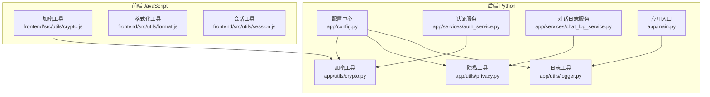
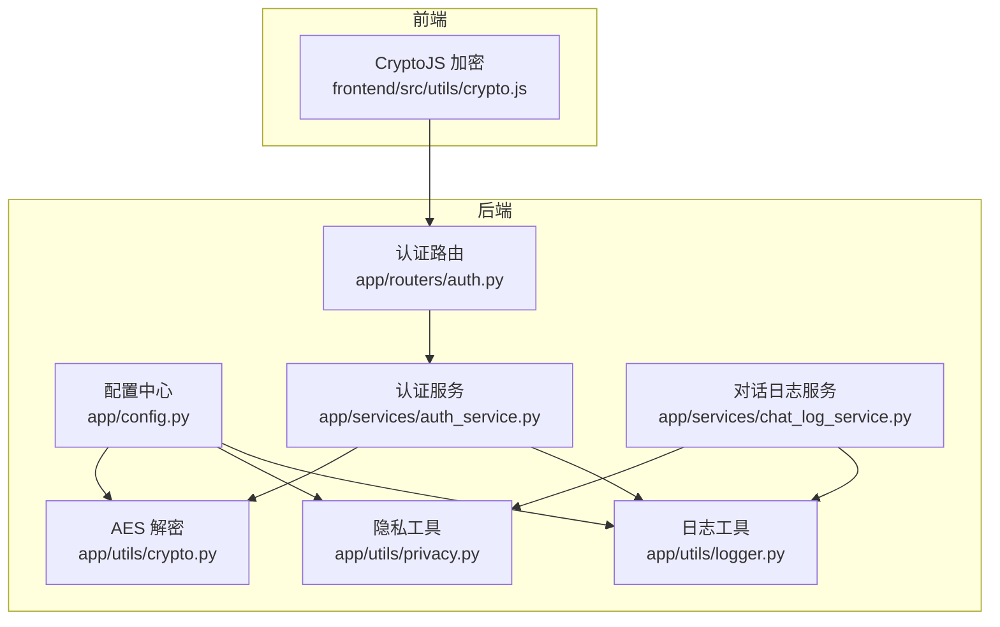
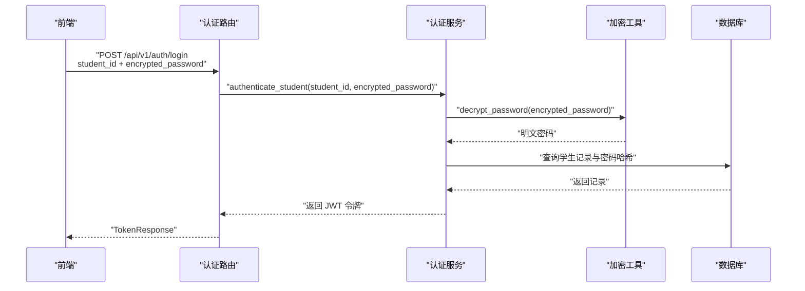
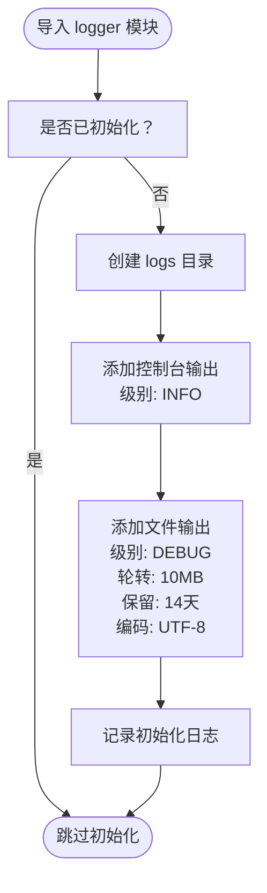
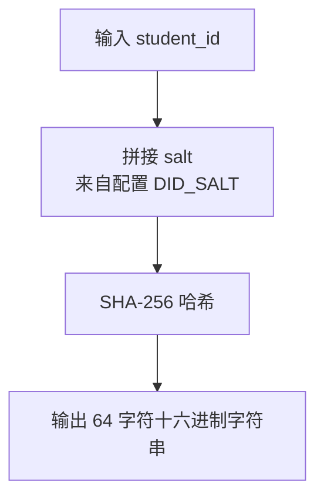
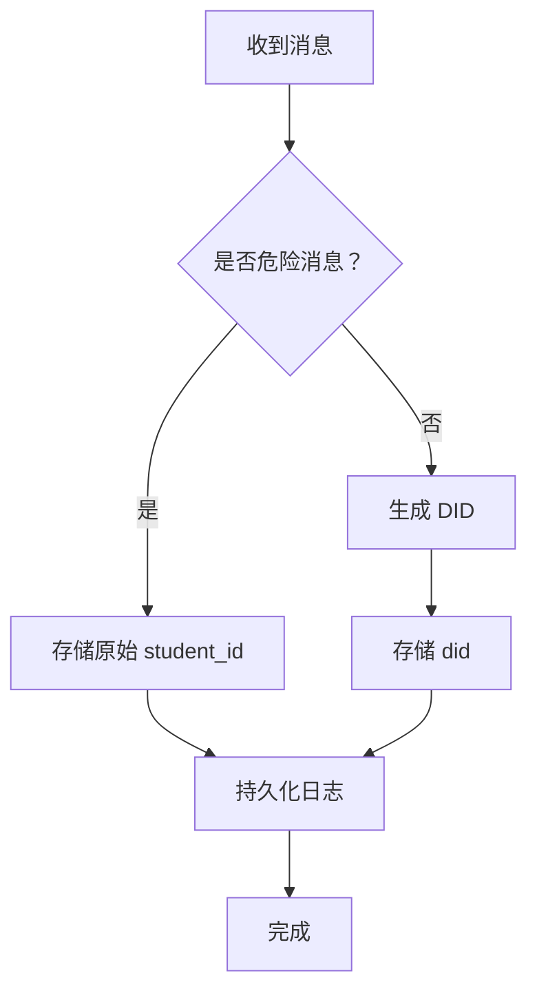
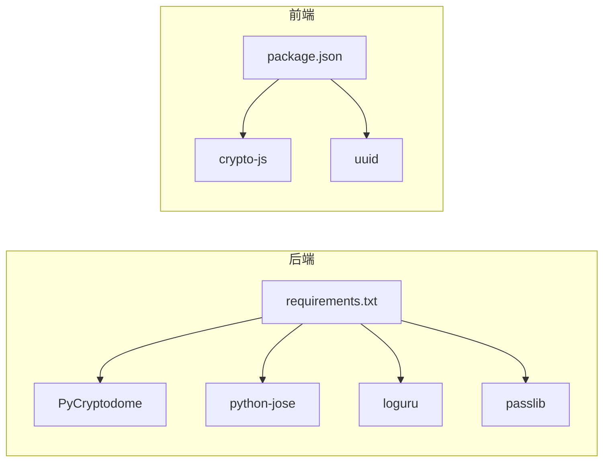

# 工具与实用程序

<cite>
**本文引用的文件**
- [service/ai_assistant/app/utils/crypto.py](file://service/ai_assistant/app/utils/crypto.py)
- [frontend/ai_assistant/src/utils/crypto.js](file://frontend/ai_assistant/src/utils/crypto.js)
- [service/ai_assistant/app/utils/logger.py](file://service/ai_assistant/app/utils/logger.py)
- [service/ai_assistant/app/utils/privacy.py](file://service/ai_assistant/app/utils/privacy.py)
- [service/ai_assistant/app/config.py](file://service/ai_assistant/app/config.py)
- [service/ai_assistant/app/main.py](file://service/ai_assistant/app/main.py)
- [service/ai_assistant/app/services/auth_service.py](file://service/ai_assistant/app/services/auth_service.py)
- [service/ai_assistant/app/routers/auth.py](file://service/ai_assistant/app/routers/auth.py)
- [service/ai_assistant/app/services/chat_log_service.py](file://service/ai_assistant/app/services/chat_log_service.py)
- [frontend/ai_assistant/package.json](file://frontend/ai_assistant/package.json)
- [service/ai_assistant/requirements.txt](file://service/ai_assistant/requirements.txt)
</cite>

## 目录
1. [引言](#引言)
2. [项目结构](#项目结构)
3. [核心组件](#核心组件)
4. [架构总览](#架构总览)
5. [详细组件分析](#详细组件分析)
6. [依赖分析](#依赖分析)
7. [性能考虑](#性能考虑)
8. [故障排查指南](#故障排查指南)
9. [结论](#结论)
10. [附录](#附录)

## 引言
本文件聚焦于“AI校园助手”项目的工具与实用程序模块，系统性阐述以下三类能力的设计目标与实现方式：
- 加密工具：保障密码在传输过程中的机密性与完整性，涵盖前端 AES-CBC 加密与后端解密流程。
- 日志系统：统一日志配置与落盘策略，支持控制台与文件双通道输出、文件轮转与保留策略。
- 隐私保护工具：基于稳定哈希的 DID（去标识化标识）生成，用于在日志与数据处理中替代真实敏感信息。

同时，文档提供各工具的使用示例、配置项说明、最佳实践与安全注意事项，并结合实际代码路径定位关键实现细节。

## 项目结构
工具与实用程序主要分布在后端 Python 服务与前端 JavaScript 工具两部分：
- 后端 Python 工具
  - 加密工具：service/ai_assistant/app/utils/crypto.py
  - 日志工具：service/ai_assistant/app/utils/logger.py
  - 隐私工具：service/ai_assistant/app/utils/privacy.py
  - 配置中心：service/ai_assistant/app/config.py
  - 应用入口与安全检查：service/ai_assistant/app/main.py
  - 业务服务与路由集成：app/services/* 与 app/routers/*
- 前端 JavaScript 工具
  - 加密工具：frontend/ai_assistant/src/utils/crypto.js
  - 通用格式化与会话工具：frontend/ai_assistant/src/utils/format.js、frontend/ai_assistant/src/utils/session.js
  - 依赖声明：frontend/ai_assistant/package.json

**图表来源**
- [service/ai_assistant/app/utils/crypto.py:1-73](file://service/ai_assistant/app/utils/crypto.py#L1-L73)
- [service/ai_assistant/app/utils/logger.py:1-53](file://service/ai_assistant/app/utils/logger.py#L1-L53)
- [service/ai_assistant/app/utils/privacy.py:1-23](file://service/ai_assistant/app/utils/privacy.py#L1-L23)
- [service/ai_assistant/app/config.py:1-113](file://service/ai_assistant/app/config.py#L1-L113)
- [service/ai_assistant/app/main.py:1-86](file://service/ai_assistant/app/main.py#L1-L86)
- [frontend/ai_assistant/src/utils/crypto.js:1-40](file://frontend/ai_assistant/src/utils/crypto.js#L1-L40)
- [service/ai_assistant/app/services/auth_service.py:1-253](file://service/ai_assistant/app/services/auth_service.py#L1-L253)
- [service/ai_assistant/app/services/chat_log_service.py:1-76](file://service/ai_assistant/app/services/chat_log_service.py#L1-L76)

**章节来源**
- [service/ai_assistant/app/utils/crypto.py:1-73](file://service/ai_assistant/app/utils/crypto.py#L1-L73)
- [service/ai_assistant/app/utils/logger.py:1-53](file://service/ai_assistant/app/utils/logger.py#L1-L53)
- [service/ai_assistant/app/utils/privacy.py:1-23](file://service/ai_assistant/app/utils/privacy.py#L1-L23)
- [service/ai_assistant/app/config.py:1-113](file://service/ai_assistant/app/config.py#L1-L113)
- [service/ai_assistant/app/main.py:1-86](file://service/ai_assistant/app/main.py#L1-L86)
- [frontend/ai_assistant/src/utils/crypto.js:1-40](file://frontend/ai_assistant/src/utils/crypto.js#L1-L40)
- [frontend/ai_assistant/src/utils/format.js:1-67](file://frontend/ai_assistant/src/utils/format.js#L1-L67)
- [frontend/ai_assistant/src/utils/session.js:1-70](file://frontend/ai_assistant/src/utils/session.js#L1-L70)
- [frontend/ai_assistant/package.json:1-24](file://frontend/ai_assistant/package.json#L1-L24)

## 核心组件
本节对三大工具模块进行深入解析，覆盖设计动机、实现要点、调用关系与最佳实践。

### 加密工具（AES-CBC 密码传输）
- 设计目的
  - 保障密码在客户端与服务端之间的传输机密性与完整性，避免明文泄露。
  - 前端使用 CryptoJS 执行 AES-CBC 加密，后端使用 PyCryptodome 解密，双方共享密钥且采用 URL 安全 Base64 编解码。
- 关键实现
  - 前端加密格式：iv_base64:ciphertext_base64，URL 安全 Base64 编码；随机 IV 长度固定为 16 字节。
  - 后端解密：从配置读取密钥（16/24/32 字符）、URL 安全 Base64 解码、AES-CBC 解密、PKCS7 去填充。
  - 错误处理：对格式非法、IV 长度不符、解密失败等情况抛出明确异常。
- 集成位置
  - 认证服务在登录与改密流程中调用后端解密函数，随后进行哈希校验。
- 配置要求
  - 后端 AES_SECRET_KEY 必须与前端 VITE_AES_SECRET_KEY 一致，且满足长度约束。
- 使用示例（路径）
  - 前端加密：[encryptPassword:26-40](file://frontend/ai_assistant/src/utils/crypto.js#L26-L40)
  - 后端解密：[decrypt_password:39-73](file://service/ai_assistant/app/utils/crypto.py#L39-L73)
  - 认证服务调用：[authenticate_student:125-170](file://service/ai_assistant/app/services/auth_service.py#L125-L170)、[change_password:173-211](file://service/ai_assistant/app/services/auth_service.py#L173-L211)

**章节来源**
- [service/ai_assistant/app/utils/crypto.py:1-73](file://service/ai_assistant/app/utils/crypto.py#L1-L73)
- [frontend/ai_assistant/src/utils/crypto.js:1-40](file://frontend/ai_assistant/src/utils/crypto.js#L1-L40)
- [service/ai_assistant/app/services/auth_service.py:125-211](file://service/ai_assistant/app/services/auth_service.py#L125-L211)
- [service/ai_assistant/app/config.py:37-41](file://service/ai_assistant/app/config.py#L37-L41)

### 日志系统（Loguru 统一配置）
- 设计目的
  - 提供统一的日志入口，兼顾开发调试与生产监控，支持控制台实时输出与文件落盘。
- 关键实现
  - 初始化：首次导入即执行全局初始化，幂等处理。
  - 输出通道：控制台 INFO 级别；文件 DEBUG 级别，UTF-8 编码。
  - 文件轮转：按大小（10 MB）与时间（14 天）策略轮转，路径位于项目根 logs 目录。
  - 格式化：包含时间、级别、模块名、函数名、行号与消息体。
- 使用示例（路径）
  - 初始化：[setup_logger:17-47](file://service/ai_assistant/app/utils/logger.py#L17-L47)
  - 应用入口使用：[main.py:14-16](file://service/ai_assistant/app/main.py#L14-L16)
  - 业务日志记录：[auth_service.py:45-95](file://service/ai_assistant/app/services/auth_service.py#L45-L95)、[chat_log_service.py:48-55](file://service/ai_assistant/app/services/chat_log_service.py#L48-L55)

**章节来源**
- [service/ai_assistant/app/utils/logger.py:1-53](file://service/ai_assistant/app/utils/logger.py#L1-L53)
- [service/ai_assistant/app/main.py:14-16](file://service/ai_assistant/app/main.py#L14-L16)
- [service/ai_assistant/app/services/auth_service.py:45-95](file://service/ai_assistant/app/services/auth_service.py#L45-L95)
- [service/ai_assistant/app/services/chat_log_service.py:48-55](file://service/ai_assistant/app/services/chat_log_service.py#L48-L55)

### 隐私保护工具（DID 生成）
- 设计目的
  - 在不暴露真实学号的前提下，保持同一用户的稳定标识，便于日志关联与审计。
- 关键实现
  - 输入：student_id + DID_SALT（来自配置）。
  - 算法：SHA-256 哈希，输出 64 字符十六进制字符串。
  - 使用场景：对话日志服务根据是否危险消息决定存储 did 或原始 student_id。
- 配置要求
  - DID_SALT 必须在部署时设置为强盐值，避免可逆推。
- 使用示例（路径）
  - 生成 DID：[generate_did:9-23](file://service/ai_assistant/app/utils/privacy.py#L9-L23)
  - 日志服务集成：[log_message:14-55](file://service/ai_assistant/app/services/chat_log_service.py#L14-L55)

**章节来源**
- [service/ai_assistant/app/utils/privacy.py:1-23](file://service/ai_assistant/app/utils/privacy.py#L1-L23)
- [service/ai_assistant/app/services/chat_log_service.py:14-55](file://service/ai_assistant/app/services/chat_log_service.py#L14-L55)
- [service/ai_assistant/app/config.py:42-44](file://service/ai_assistant/app/config.py#L42-L44)

## 架构总览
下图展示加密、日志与隐私工具在系统中的交互关系及调用链路。

**图表来源**
- [frontend/ai_assistant/src/utils/crypto.js:1-40](file://frontend/ai_assistant/src/utils/crypto.js#L1-L40)
- [service/ai_assistant/app/routers/auth.py:1-102](file://service/ai_assistant/app/routers/auth.py#L1-L102)
- [service/ai_assistant/app/services/auth_service.py:1-253](file://service/ai_assistant/app/services/auth_service.py#L1-L253)
- [service/ai_assistant/app/utils/crypto.py:1-73](file://service/ai_assistant/app/utils/crypto.py#L1-L73)
- [service/ai_assistant/app/utils/privacy.py:1-23](file://service/ai_assistant/app/utils/privacy.py#L1-L23)
- [service/ai_assistant/app/utils/logger.py:1-53](file://service/ai_assistant/app/utils/logger.py#L1-L53)
- [service/ai_assistant/app/config.py:1-113](file://service/ai_assistant/app/config.py#L1-L113)

## 详细组件分析

### 加密工具组件分析
- 类与方法概览
  - 加载密钥：从配置读取密钥并校验长度。
  - URL 安全 Base64 解码：还原编码并补齐填充。
  - 解密函数：拆分 iv 与密文，执行 AES-CBC 解密与去填充。
- 调用序列（登录流程）

**图表来源**
- [service/ai_assistant/app/routers/auth.py:24-52](file://service/ai_assistant/app/routers/auth.py#L24-L52)
- [service/ai_assistant/app/services/auth_service.py:125-170](file://service/ai_assistant/app/services/auth_service.py#L125-L170)
- [service/ai_assistant/app/utils/crypto.py:39-73](file://service/ai_assistant/app/utils/crypto.py#L39-L73)

**章节来源**
- [service/ai_assistant/app/utils/crypto.py:1-73](file://service/ai_assistant/app/utils/crypto.py#L1-L73)
- [service/ai_assistant/app/services/auth_service.py:125-170](file://service/ai_assistant/app/services/auth_service.py#L125-L170)
- [service/ai_assistant/app/routers/auth.py:24-52](file://service/ai_assistant/app/routers/auth.py#L24-L52)

### 日志系统组件分析
- 初始化流程

**图表来源**
- [service/ai_assistant/app/utils/logger.py:17-47](file://service/ai_assistant/app/utils/logger.py#L17-L47)

**章节来源**
- [service/ai_assistant/app/utils/logger.py:1-53](file://service/ai_assistant/app/utils/logger.py#L1-L53)
- [service/ai_assistant/app/main.py:14-16](file://service/ai_assistant/app/main.py#L14-L16)

### 隐私保护组件分析
- DID 生成流程

**图表来源**
- [service/ai_assistant/app/utils/privacy.py:9-23](file://service/ai_assistant/app/utils/privacy.py#L9-L23)

- 日志隐私策略

**图表来源**
- [service/ai_assistant/app/services/chat_log_service.py:14-55](file://service/ai_assistant/app/services/chat_log_service.py#L14-L55)

**章节来源**
- [service/ai_assistant/app/utils/privacy.py:1-23](file://service/ai_assistant/app/utils/privacy.py#L1-L23)
- [service/ai_assistant/app/services/chat_log_service.py:14-55](file://service/ai_assistant/app/services/chat_log_service.py#L14-L55)

## 依赖分析
- 后端依赖
  - 加密：PyCryptodome（AES、Padding）、python-jose（JWT）、passlib（哈希兼容）。
  - 日志：loguru（高性能异步日志）。
  - 其他：FastAPI、SQLAlchemy、Redis、DashScope 等。
- 前端依赖
  - CryptoJS（AES-CBC 加密）、uuid（ID 生成）、marked（Markdown 渲染）等。

**图表来源**
- [service/ai_assistant/requirements.txt:1-22](file://service/ai_assistant/requirements.txt#L1-L22)
- [frontend/ai_assistant/package.json:1-24](file://frontend/ai_assistant/package.json#L1-L24)

**章节来源**
- [service/ai_assistant/requirements.txt:1-22](file://service/ai_assistant/requirements.txt#L1-L22)
- [frontend/ai_assistant/package.json:1-24](file://frontend/ai_assistant/package.json#L1-L24)

## 性能考虑
- 日志性能
  - 使用 enqueue 异步写入，避免阻塞请求线程。
  - 文件轮转按大小与时间触发，减少单文件过大带来的 IO 压力。
- 加密性能
  - AES-CBC 解密为 CPU 密集型操作，建议在高并发场景下配合连接池与缓存策略。
  - 前端加密采用随机 IV 与 URL 安全编码，保证安全性的同时不影响性能。
- 隐私处理
  - DID 生成为纯哈希计算，开销极低；日志存储按危险标记选择不同字段，降低冗余。

[本节为通用性能讨论，无需特定文件引用]

## 故障排查指南
- 加密相关
  - 前端与后端密钥不一致：导致解密失败。请核对 AES_SECRET_KEY 长度与一致性。
  - 加密格式错误：确认 iv_base64:ciphertext_base64 格式与 URL 安全 Base64 编码。
  - IV 长度不符：必须为 16 字节。
- 日志相关
  - 日志未落盘：检查 logs 目录权限与磁盘空间；确认初始化是否执行。
  - 文件未轮转：检查大小阈值与保留策略配置。
- 隐私相关
  - DID 不稳定：确认 DID_SALT 是否变更；同一 salt 下同一 student_id 生成恒定 DID。
  - 危险消息未记录原始 ID：检查 is_dangerous 标记逻辑。

**章节来源**
- [service/ai_assistant/app/utils/crypto.py:17-73](file://service/ai_assistant/app/utils/crypto.py#L17-L73)
- [service/ai_assistant/app/utils/logger.py:17-47](file://service/ai_assistant/app/utils/logger.py#L17-L47)
- [service/ai_assistant/app/utils/privacy.py:9-23](file://service/ai_assistant/app/utils/privacy.py#L9-L23)
- [service/ai_assistant/app/services/chat_log_service.py:14-55](file://service/ai_assistant/app/services/chat_log_service.py#L14-L55)

## 结论
本项目的工具与实用程序围绕“安全传输、可观测性与隐私保护”三大目标构建：
- 加密工具通过前后端一致的 AES-CBC 流程，确保密码在传输阶段的安全。
- 日志系统提供统一、可轮转、可保留的落盘方案，满足调试与审计需求。
- 隐私工具以 DID 为核心，既满足日志关联又避免真实敏感信息外泄。

建议在生产部署前完成密钥与盐值的强配置、严格访问控制与定期轮检，以进一步提升整体安全性与稳定性。

[本节为总结性内容，无需特定文件引用]

## 附录
- 配置项速查
  - JWT：JWT_SECRET_KEY、JWT_ALGORITHM、JWT_EXPIRE_MINUTES
  - AES：AES_SECRET_KEY
  - 隐私：DID_SALT
  - 日志：日志目录自动创建，文件轮转与保留策略内置
- 前端密钥配置
  - VITE_AES_SECRET_KEY（与后端一致）

**章节来源**
- [service/ai_assistant/app/config.py:32-44](file://service/ai_assistant/app/config.py#L32-L44)
- [frontend/ai_assistant/src/utils/crypto.js:9-10](file://frontend/ai_assistant/src/utils/crypto.js#L9-L10)