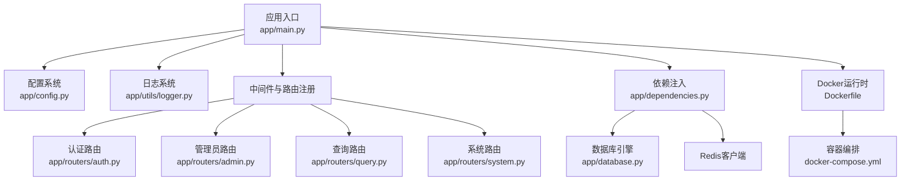
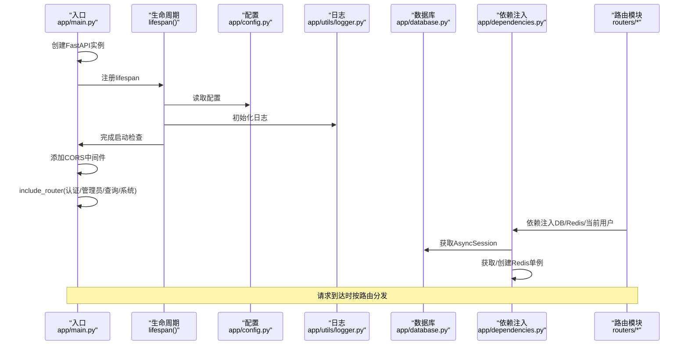
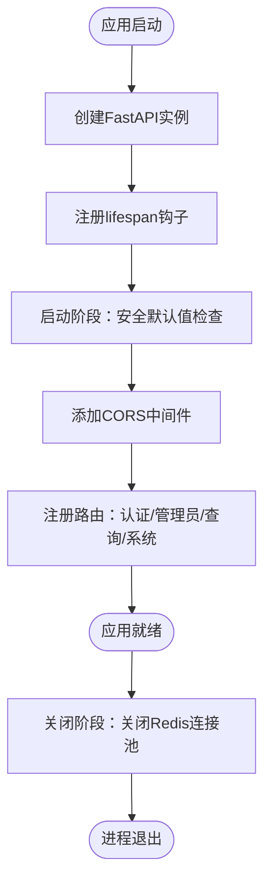
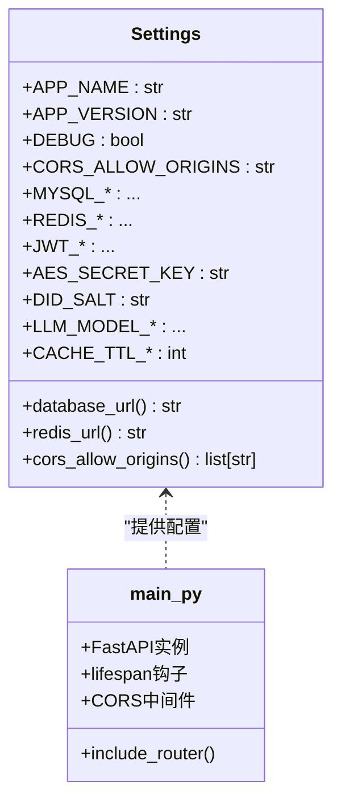
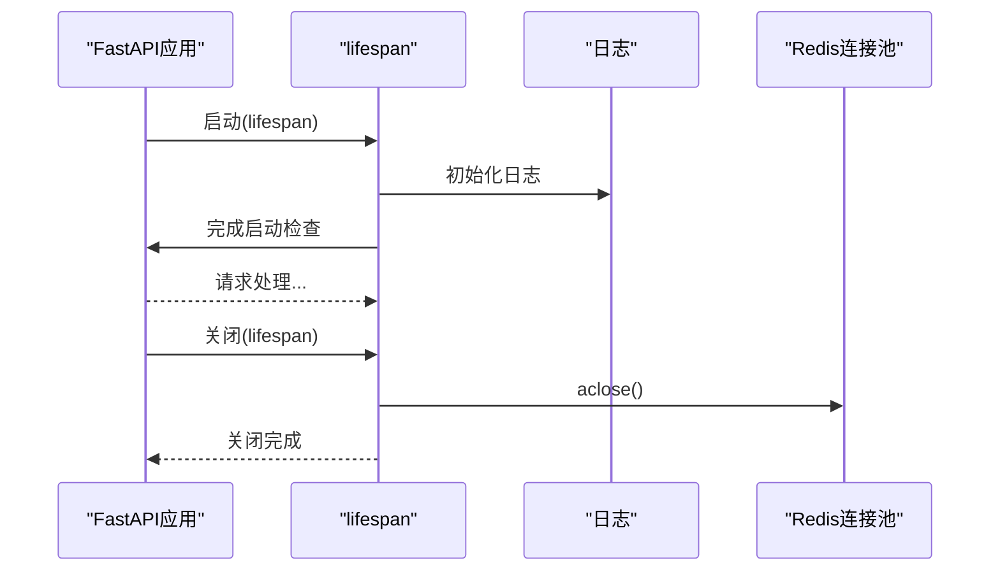
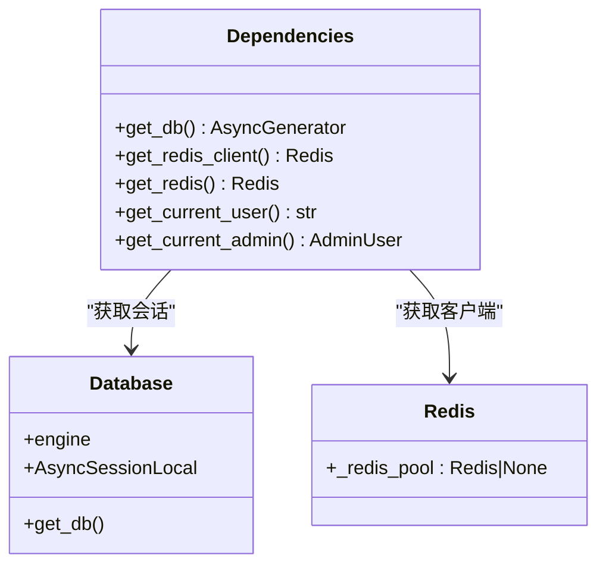
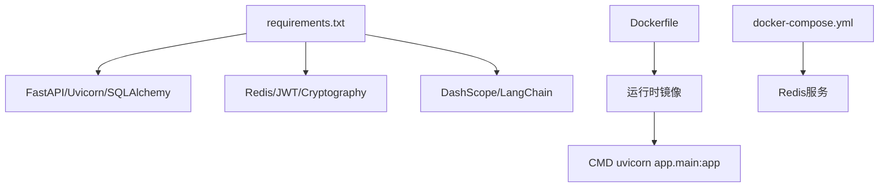

# 应用入口与配置管理

<cite>
**本文档引用的文件**
- [main.py](file://service/ai_assistant/app/main.py)
- [config.py](file://service/ai_assistant/app/config.py)
- [database.py](file://service/ai_assistant/app/database.py)
- [dependencies.py](file://service/ai_assistant/app/dependencies.py)
- [logger.py](file://service/ai_assistant/app/utils/logger.py)
- [auth.py](file://service/ai_assistant/app/routers/auth.py)
- [admin.py](file://service/ai_assistant/app/routers/admin.py)
- [query.py](file://service/ai_assistant/app/routers/query.py)
- [system.py](file://service/ai_assistant/app/routers/system.py)
- [auth_service.py](file://service/ai_assistant/app/services/auth_service.py)
- [crypto.py](file://service/ai_assistant/app/utils/crypto.py)
- [Dockerfile](file://service/ai_assistant/Dockerfile)
- [docker-compose.yml](file://service/ai_assistant/docker-compose.yml)
- [requirements.txt](file://service/ai_assistant/requirements.txt)
</cite>

## 目录
1. [简介](#简介)
2. [项目结构](#项目结构)
3. [核心组件](#核心组件)
4. [架构总览](#架构总览)
5. [详细组件分析](#详细组件分析)
6. [依赖分析](#依赖分析)
7. [性能考虑](#性能考虑)
8. [故障排查指南](#故障排查指南)
9. [结论](#结论)
10. [附录](#附录)

## 简介
本文件聚焦于AI校园助手项目的FastAPI应用入口与配置管理，系统性阐述以下内容：
- FastAPI应用初始化流程：应用实例创建、生命周期管理、中间件配置与路由注册机制
- 配置管理系统：环境变量加载、配置验证、安全默认值检查与运行时配置更新
- 异步生命周期管理：启动时资源初始化与关闭时清理
- CORS中间件安全配置：允许源、方法与头部策略
- 实际代码路径示例与最佳实践建议，帮助开发者快速上手并规避常见问题

## 项目结构
该项目采用“按功能域分层”的组织方式，核心入口位于service/ai_assistant/app/main.py，配置集中于app/config.py，数据库与依赖注入分别在app/database.py与app/dependencies.py中定义，日志统一由app/utils/logger.py管理。路由按业务划分为auth、admin、query、system四个模块。

图表来源
- [main.py:52-86](file://service/ai_assistant/app/main.py#L52-L86)
- [config.py:6-113](file://service/ai_assistant/app/config.py#L6-L113)
- [database.py:7-35](file://service/ai_assistant/app/database.py#L7-L35)
- [dependencies.py:27-51](file://service/ai_assistant/app/dependencies.py#L27-L51)
- [logger.py:17-53](file://service/ai_assistant/app/utils/logger.py#L17-L53)
- [Dockerfile:48](file://service/ai_assistant/Dockerfile#L48)
- [docker-compose.yml:1-31](file://service/ai_assistant/docker-compose.yml#L1-L31)

章节来源
- [main.py:1-86](file://service/ai_assistant/app/main.py#L1-L86)
- [config.py:1-113](file://service/ai_assistant/app/config.py#L1-L113)
- [database.py:1-35](file://service/ai_assistant/app/database.py#L1-L35)
- [dependencies.py:1-109](file://service/ai_assistant/app/dependencies.py#L1-L109)
- [logger.py:1-53](file://service/ai_assistant/app/utils/logger.py#L1-L53)
- [Dockerfile:1-49](file://service/ai_assistant/Dockerfile#L1-L49)
- [docker-compose.yml:1-31](file://service/ai_assistant/docker-compose.yml#L1-L31)

## 核心组件
- 应用入口与生命周期：在main.py中创建FastAPI实例，配置CORS与路由，并通过lifespan实现异步启动/关闭钩子，完成安全默认值检查与Redis连接池清理。
- 配置系统：config.py使用Pydantic Settings加载.env文件，提供应用、数据库、Redis、JWT、AES、隐私、LLM模型、缓存TTL等配置项，并提供数据库URL与Redis URL工厂属性。
- 日志系统：logger.py使用Loguru统一输出至控制台与文件，支持旋转与保留策略。
- 依赖注入：dependencies.py提供数据库会话、Redis客户端、当前用户与管理员解析等依赖，支持全局Redis单例。
- 数据库：database.py创建异步引擎与会话工厂，支持预连接与回收策略。
- 路由模块：auth、admin、query、system分别提供认证、管理员管理、统一查询与系统健康/版本信息接口。

章节来源
- [main.py:36-86](file://service/ai_assistant/app/main.py#L36-L86)
- [config.py:6-113](file://service/ai_assistant/app/config.py#L6-L113)
- [logger.py:17-53](file://service/ai_assistant/app/utils/logger.py#L17-L53)
- [dependencies.py:27-51](file://service/ai_assistant/app/dependencies.py#L27-L51)
- [database.py:7-35](file://service/ai_assistant/app/database.py#L7-L35)
- [auth.py:21-102](file://service/ai_assistant/app/routers/auth.py#L21-L102)
- [admin.py:48-388](file://service/ai_assistant/app/routers/admin.py#L48-388)
- [query.py:46-788](file://service/ai_assistant/app/routers/query.py#L46-788)
- [system.py:9-38](file://service/ai_assistant/app/routers/system.py#L9-L38)

## 架构总览
下图展示了应用启动到请求处理的关键路径：入口初始化、配置加载、中间件与路由装配、依赖注入、数据库与Redis连接，以及请求处理链路。

图表来源
- [main.py:52-86](file://service/ai_assistant/app/main.py#L52-L86)
- [config.py:112](file://service/ai_assistant/app/config.py#L112)
- [logger.py:17-53](file://service/ai_assistant/app/utils/logger.py#L17-L53)
- [database.py:27-35](file://service/ai_assistant/app/database.py#L27-L35)
- [dependencies.py:27-51](file://service/ai_assistant/app/dependencies.py#L27-L51)

## 详细组件分析

### 应用入口与生命周期管理
- 应用实例创建：在main.py中，通过FastAPI构造函数设置标题、版本、文档路径与生命周期回调。
- 生命周期钩子：使用asynccontextmanager定义lifespan，启动时执行安全默认值检查，关闭时关闭Redis连接池。
- 安全默认值检查：对JWT、AES、盐值等关键配置进行不安全默认值告警，防止生产环境误用。
- CORS中间件：根据配置动态设置允许源、凭证、方法与头部；生产环境建议限定具体前端地址。
- 路由注册：include_router按模块注册认证、管理员、查询与系统路由。

图表来源
- [main.py:36-86](file://service/ai_assistant/app/main.py#L36-L86)

章节来源
- [main.py:36-86](file://service/ai_assistant/app/main.py#L36-L86)

### 配置管理系统
- 环境变量加载：Settings继承BaseSettings，通过SettingsConfigDict指定.env文件与编码，忽略未知字段。
- 配置项覆盖：APP_NAME、APP_VERSION、DEBUG、CORS_ALLOW_ORIGINS等作为应用基础配置；数据库、Redis、JWT、AES、隐私、LLM模型、缓存TTL等按领域划分。
- URL工厂属性：database_url与redis_url根据配置动态拼装，支持含/不含密码的Redis连接。
- CORS解析：cors_allow_origins支持逗号分隔、星号通配与空值处理，转换为列表供CORS中间件使用。
- 运行时更新：Settings为单例，启动后配置不可再更改；若需热更新，应在应用重启时重新加载.env。

图表来源
- [config.py:6-113](file://service/ai_assistant/app/config.py#L6-L113)
- [main.py:52-86](file://service/ai_assistant/app/main.py#L52-L86)

章节来源
- [config.py:6-113](file://service/ai_assistant/app/config.py#L6-L113)

### 异步生命周期管理
- 启动阶段：初始化日志、检查不安全默认值，确保生产环境安全基线。
- 关闭阶段：若Redis连接池存在，异步关闭连接池，释放资源。
- 与依赖注入协作：lifespan在应用启动时完成全局资源准备，依赖注入在请求阶段按需获取。

图表来源
- [main.py:36-49](file://service/ai_assistant/app/main.py#L36-L49)
- [dependencies.py:20-45](file://service/ai_assistant/app/dependencies.py#L20-L45)

章节来源
- [main.py:36-49](file://service/ai_assistant/app/main.py#L36-L49)
- [dependencies.py:20-45](file://service/ai_assistant/app/dependencies.py#L20-L45)

### CORS中间件安全配置
- 允许源：从配置读取CORS_ALLOW_ORIGINS，支持逗号分隔与通配；生产环境建议明确指定前端域名。
- 凭证：允许携带Cookie/Credentials，需与前端同源策略匹配。
- 方法与头部：默认允许所有方法与头部，可根据需要收紧。
- 生产建议：将allow_origins限定为Vue前端地址，避免使用通配符。

章节来源
- [main.py:66-76](file://service/ai_assistant/app/main.py#L66-L76)
- [config.py:103-109](file://service/ai_assistant/app/config.py#L103-L109)

### 路由注册机制
- 认证路由：提供学生登录与密码修改接口，依赖当前用户解析与数据库会话。
- 管理员路由：提供登录、个人信息、仪表盘统计、元数据查询、课表列表与状态更新等接口，依赖管理员解析、数据库与Redis。
- 查询路由：统一的多模态查询入口，支持文本、图像、音频，内部集成安全检查、意图分类、查询执行、流式回答与缓存。
- 系统路由：健康检查与版本信息接口，读取配置中的应用名称与版本。

章节来源
- [auth.py:21-102](file://service/ai_assistant/app/routers/auth.py#L21-L102)
- [admin.py:48-388](file://service/ai_assistant/app/routers/admin.py#L48-388)
- [query.py:46-788](file://service/ai_assistant/app/routers/query.py#L46-788)
- [system.py:9-38](file://service/ai_assistant/app/routers/system.py#L9-L38)

### 依赖注入与数据库/Redis
- 数据库会话：通过AsyncSessionLocal创建异步会话，支持自动回滚与提交。
- Redis客户端：全局单例，首次使用时按配置建立连接，后续复用；关闭时由lifespan统一清理。
- 当前用户与管理员：通过Bearer Token解析，结合数据库校验，确保接口安全。

图表来源
- [dependencies.py:27-109](file://service/ai_assistant/app/dependencies.py#L27-L109)
- [database.py:27-35](file://service/ai_assistant/app/database.py#L27-L35)

章节来源
- [dependencies.py:27-109](file://service/ai_assistant/app/dependencies.py#L27-L109)
- [database.py:7-35](file://service/ai_assistant/app/database.py#L7-L35)

### 日志系统
- 初始化：幂等初始化，移除默认sink后添加控制台与文件sink，支持异步写入与格式化。
- 文件策略：按大小旋转、保留14天，UTF-8编码，确保运行时日志可追溯。
- 使用：在main.py中启动时调用setup_logger，确保全局日志生效。

章节来源
- [logger.py:17-53](file://service/ai_assistant/app/utils/logger.py#L17-L53)
- [main.py:16](file://service/ai_assistant/app/main.py#L16)

### 安全与加密要点
- JWT配置：算法、过期时间、密钥均来自配置；解码时严格校验角色与主体。
- AES密码解密：前端使用CryptoJS AES-CBC加密，后端按URL安全编码与PKCS7填充解密。
- 隐私与安全：查询前进行危险内容与隐私违规检查，必要时阻断并记录。

章节来源
- [auth_service.py:16-122](file://service/ai_assistant/app/services/auth_service.py#L16-L122)
- [crypto.py:17-73](file://service/ai_assistant/app/utils/crypto.py#L17-L73)
- [query.py:347-471](file://service/ai_assistant/app/routers/query.py#L347-L471)

## 依赖分析
- 运行时依赖：FastAPI、Uvicorn、SQLAlchemy异步、aiomysql、Redis、JWT、Cryptography、DashScope、LangChain等。
- Docker运行：基于python:3.11-slim，构建阶段安装MySQL客户端与编译依赖，运行阶段安装MariaDB客户端与ffmpeg，暴露8000端口。
- Compose编排：提供Redis服务，设置密码、内存策略与健康检查。

图表来源
- [requirements.txt:1-22](file://service/ai_assistant/requirements.txt#L1-L22)
- [Dockerfile:48](file://service/ai_assistant/Dockerfile#L48)
- [docker-compose.yml:5-24](file://service/ai_assistant/docker-compose.yml#L5-L24)

章节来源
- [requirements.txt:1-22](file://service/ai_assistant/requirements.txt#L1-L22)
- [Dockerfile:1-49](file://service/ai_assistant/Dockerfile#L1-L49)
- [docker-compose.yml:1-31](file://service/ai_assistant/docker-compose.yml#L1-L31)

## 性能考虑
- 连接池与回收：数据库引擎启用pre_ping与pool_recycle，减少失效连接带来的异常。
- Redis单例：全局连接池避免重复握手开销，lifespan统一关闭释放资源。
- 流式响应：查询路由采用SSE流式输出，降低反向代理缓冲风险，提升用户体验。
- 并发任务：安全检查与查询重写并行执行，缩短整体响应时间。
- 缓存策略：敏感与普通缓存TTL区分，结合DID与查询哈希实现高效命中。

章节来源
- [database.py:7-20](file://service/ai_assistant/app/database.py#L7-L20)
- [dependencies.py:36-50](file://service/ai_assistant/app/dependencies.py#L36-L50)
- [query.py:115-125](file://service/ai_assistant/app/routers/query.py#L115-L125)
- [query.py:347-352](file://service/ai_assistant/app/routers/query.py#L347-L352)
- [config.py:82-83](file://service/ai_assistant/app/config.py#L82-L83)

## 故障排查指南
- 启动告警：若出现“不安全默认值”警告，检查.env中JWT_SECRET_KEY、AES_SECRET_KEY、DID_SALT是否已替换为强密钥。
- CORS跨域：浏览器报跨域错误时，确认CORS_ALLOW_ORIGINS是否包含前端地址，生产环境避免使用通配符。
- Redis连接：Redis未启动或密码错误会导致依赖注入失败；检查docker-compose与环境变量。
- 数据库连接：数据库不可达时，检查主机、端口、用户名与密码；开启DEBUG查看SQL日志。
- JWT解码：角色不匹配或过期将导致认证失败，核对密钥与过期时间配置。
- 日志定位：运行日志输出至logs目录下的ai_assistant_runtime.txt，便于问题追踪。

章节来源
- [main.py:25-34](file://service/ai_assistant/app/main.py#L25-L34)
- [main.py:70-76](file://service/ai_assistant/app/main.py#L70-L76)
- [docker-compose.yml:5-24](file://service/ai_assistant/docker-compose.yml#L5-L24)
- [database.py:7-12](file://service/ai_assistant/app/database.py#L7-L12)
- [auth_service.py:78-122](file://service/ai_assistant/app/services/auth_service.py#L78-L122)
- [logger.py:17-46](file://service/ai_assistant/app/utils/logger.py#L17-L46)

## 结论
本项目通过清晰的入口与配置分离、严格的生命周期管理与安全默认值检查、完善的依赖注入与日志体系，构建了稳定可靠的FastAPI后端。生产部署时务必：
- 替换所有不安全默认值
- 明确CORS允许源
- 使用独立的Redis与数据库服务
- 合理设置缓存与超时参数
- 通过日志与监控持续观察运行状态

## 附录
- 应用启动流程示例路径
  - [应用实例创建与生命周期:52-62](file://service/ai_assistant/app/main.py#L52-L62)
  - [CORS中间件配置:70-76](file://service/ai_assistant/app/main.py#L70-L76)
  - [路由注册:81-84](file://service/ai_assistant/app/main.py#L81-L84)
- 配置加载与验证示例路径
  - [Settings定义与URL工厂:6-113](file://service/ai_assistant/app/config.py#L6-L113)
  - [CORS解析逻辑:103-109](file://service/ai_assistant/app/config.py#L103-L109)
- 依赖注入与数据库示例路径
  - [数据库会话与上下文:27-35](file://service/ai_assistant/app/database.py#L27-L35)
  - [Redis单例与依赖:36-50](file://service/ai_assistant/app/dependencies.py#L36-L50)
- 日志初始化示例路径
  - [日志初始化与文件策略:17-46](file://service/ai_assistant/app/utils/logger.py#L17-L46)
- 运行与编排示例路径
  - [Uvicorn启动命令](file://service/ai_assistant/Dockerfile#L48)
  - [Redis服务编排:5-24](file://service/ai_assistant/docker-compose.yml#L5-L24)