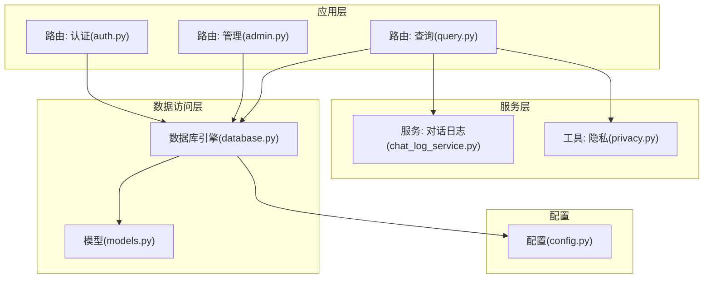
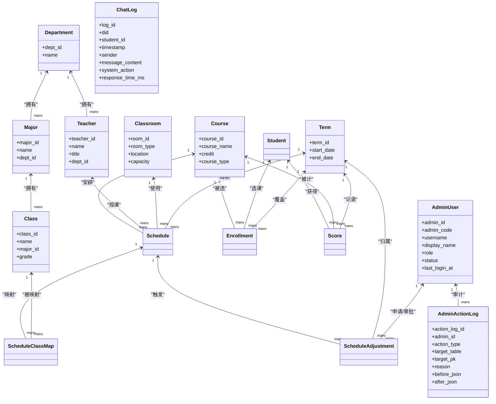
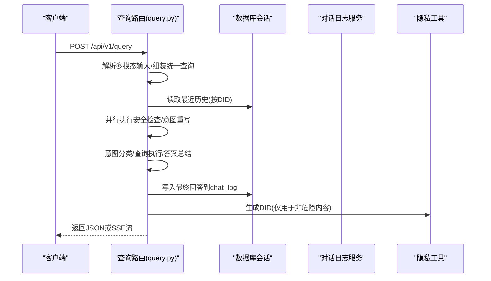
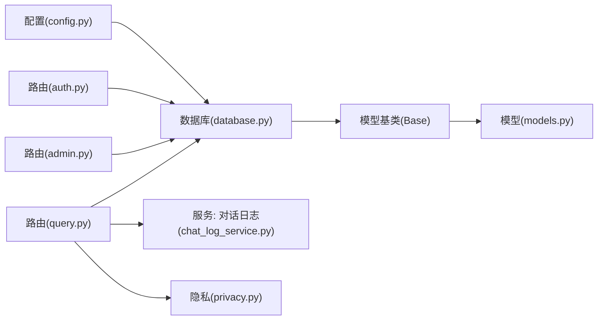

# 数据模型设计

<cite>
**本文引用的文件**
- [models.py](file://service/ai_assistant/app/models/models.py)
- [database.py](file://service/ai_assistant/app/database.py)
- [config.py](file://service/ai_assistant/app/config.py)
- [auth.py](file://service/ai_assistant/app/routers/auth.py)
- [admin.py](file://service/ai_assistant/app/routers/admin.py)
- [query.py](file://service/ai_assistant/app/routers/query.py)
- [chat_log_service.py](file://service/ai_assistant/app/services/chat_log_service.py)
- [privacy.py](file://service/ai_assistant/app/utils/privacy.py)
- [auth.py（schema）](file://service/ai_assistant/app/schemas/auth.py)
- [admin.py（schema）](file://service/ai_assistant/app/schemas/admin.py)
- [query.py（schema）](file://service/ai_assistant/app/schemas/query.py)
</cite>

## 目录
1. [简介](#简介)
2. [项目结构](#项目结构)
3. [核心组件](#核心组件)
4. [架构总览](#架构总览)
5. [详细组件分析](#详细组件分析)
6. [依赖分析](#依赖分析)
7. [性能考量](#性能考量)
8. [故障排查指南](#故障排查指南)
9. [结论](#结论)
10. [附录](#附录)

## 简介
本文件面向“AI校园助手”项目的数据库与ORM模型设计，系统化阐述数据模型的设计原则、表结构定义、字段类型与约束、模型间关系映射、验证规则、序列化配置、索引优化策略，并给出查询优化建议与数据迁移策略。文档同时结合实际路由与服务层调用，帮助读者从“模型—服务—路由”的全链路理解数据模型的业务含义与实现方式。

## 项目结构
后端采用FastAPI + SQLAlchemy Async ORM + MySQL的架构。数据库连接、会话管理与基础模型基类位于数据库模块；各领域模型集中在模型文件；路由层负责对外接口与业务编排；服务层封装查询、缓存、日志等横切能力；配置模块集中管理数据库URL、Redis、JWT、LLM等参数。

图表来源
- [database.py:1-35](file://service/ai_assistant/app/database.py#L1-L35)
- [models.py:1-660](file://service/ai_assistant/app/models/models.py#L1-L660)
- [config.py:1-113](file://service/ai_assistant/app/config.py#L1-L113)
- [auth.py:1-102](file://service/ai_assistant/app/routers/auth.py#L1-L102)
- [admin.py:1-388](file://service/ai_assistant/app/routers/admin.py#L1-L388)
- [query.py:1-788](file://service/ai_assistant/app/routers/query.py#L1-L788)
- [chat_log_service.py:1-76](file://service/ai_assistant/app/services/chat_log_service.py#L1-L76)
- [privacy.py:1-23](file://service/ai_assistant/app/utils/privacy.py#L1-L23)

章节来源
- [database.py:1-35](file://service/ai_assistant/app/database.py#L1-L35)
- [config.py:85-91](file://service/ai_assistant/app/config.py#L85-L91)

## 核心组件
本项目的核心数据模型围绕“用户与权限”“教学与排课”“对话日志”展开，具体如下：
- 用户与权限
  - 学生模型：包含身份信息、性别、出生日期、入学年份、班级外键、状态、密码哈希等，支撑认证与权限校验。
  - 管理员模型：包含管理员编号、用户名、显示名、角色、状态、最后登录时间等，支撑后台管理与审计。
  - 管理员审计日志：记录管理员对关键表的操作、前后状态、原因、IP等，便于审计与回溯。
- 教学与排课
  - 院系、专业、班级、教师、课程、教室、学期等实体模型，构成教学组织与资源的基础。
  - 选课、成绩、课程安排、排课-班级映射、调课单等模型，覆盖教务主业务闭环。
- 对话日志
  - 存储学生与AI助手的对话历史，支持按DID（去标识化学号）检索，兼顾隐私与可追溯性。

章节来源
- [models.py:41-84](file://service/ai_assistant/app/models/models.py#L41-L84)
- [models.py:117-129](file://service/ai_assistant/app/models/models.py#L117-L129)
- [models.py:134-150](file://service/ai_assistant/app/models/models.py#L134-L150)
- [models.py:155-175](file://service/ai_assistant/app/models/models.py#L155-L175)
- [models.py:180-202](file://service/ai_assistant/app/models/models.py#L180-L202)
- [models.py:207-226](file://service/ai_assistant/app/models/models.py#L207-L226)
- [models.py:237-264](file://service/ai_assistant/app/models/models.py#L237-L264)
- [models.py:277-300](file://service/ai_assistant/app/models/models.py#L277-L300)
- [models.py:312-340](file://service/ai_assistant/app/models/models.py#L312-L340)
- [models.py:345-367](file://service/ai_assistant/app/models/models.py#L345-L367)
- [models.py:372-402](file://service/ai_assistant/app/models/models.py#L372-L402)
- [models.py:412-480](file://service/ai_assistant/app/models/models.py#L412-L480)
- [models.py:485-514](file://service/ai_assistant/app/models/models.py#L485-L514)
- [models.py:534-623](file://service/ai_assistant/app/models/models.py#L534-L623)
- [models.py:641-660](file://service/ai_assistant/app/models/models.py#L641-L660)

## 架构总览
下图展示与数据模型直接相关的类与关系，体现一对一、一对多与多对多映射及外键约束。

图表来源
- [models.py:41-84](file://service/ai_assistant/app/models/models.py#L41-L84)
- [models.py:86-112](file://service/ai_assistant/app/models/models.py#L86-L112)
- [models.py:117-129](file://service/ai_assistant/app/models/models.py#L117-L129)
- [models.py:134-150](file://service/ai_assistant/app/models/models.py#L134-L150)
- [models.py:155-175](file://service/ai_assistant/app/models/models.py#L155-L175)
- [models.py:180-202](file://service/ai_assistant/app/models/models.py#L180-L202)
- [models.py:207-226](file://service/ai_assistant/app/models/models.py#L207-L226)
- [models.py:237-264](file://service/ai_assistant/app/models/models.py#L237-L264)
- [models.py:277-300](file://service/ai_assistant/app/models/models.py#L277-L300)
- [models.py:312-340](file://service/ai_assistant/app/models/models.py#L312-L340)
- [models.py:345-367](file://service/ai_assistant/app/models/models.py#L345-L367)
- [models.py:372-402](file://service/ai_assistant/app/models/models.py#L372-L402)
- [models.py:412-480](file://service/ai_assistant/app/models/models.py#L412-L480)
- [models.py:485-514](file://service/ai_assistant/app/models/models.py#L485-L514)
- [models.py:534-623](file://service/ai_assistant/app/models/models.py#L534-L623)
- [models.py:641-660](file://service/ai_assistant/app/models/models.py#L641-L660)

## 详细组件分析

### 管理员模型与审计日志
- 设计要点
  - 角色枚举与状态枚举确保权限与账户生命周期的规范化。
  - 审计日志记录管理员对关键表的变更，包含操作类型、目标表与主键、前后状态快照、原因与时间戳。
  - 索引覆盖管理员维度与目标定位维度，便于审计查询。
- 关系映射
  - 管理员与审计日志为典型的一对多。
  - 管理员还可驱动排课状态变更、调课单的申请与审批等，形成多对多间接关系（通过Schedule、ScheduleAdjustment）。
- 约束与验证
  - 唯一约束保证管理员编号与用户名唯一。
  - 外键级联更新保障主数据变更时的引用一致性。

章节来源
- [models.py:28-39](file://service/ai_assistant/app/models/models.py#L28-L39)
- [models.py:41-84](file://service/ai_assistant/app/models/models.py#L41-L84)
- [models.py:86-112](file://service/ai_assistant/app/models/models.py#L86-L112)
- [models.py:59-63](file://service/ai_assistant/app/models/models.py#L59-L63)
- [models.py:106-109](file://service/ai_assistant/app/models/models.py#L106-L109)

### 教学组织与资源模型
- 院系、专业、班级、教师、课程、教室、学期
  - 主键采用短字符串编码，便于跨系统引用与展示。
  - 外键约束确保组织层级与人员归属的完整性。
  - 索引覆盖常用过滤字段（如系所、专业、班级、学期起止日期等）。
- 关系映射
  - Department → Major → Class：逐级细化组织。
  - Teacher → Department：教师归属系所。
  - Term × Course → Enrollment：选课记录。
  - Student × Course × Term → Score：成绩记录。
  - Course × Teacher × Classroom × Term → Schedule：课程安排。
  - Schedule ↔ Class（多对多，通过ScheduleClassMap）。
- 约束与验证
  - 学期起止日期合法性校验。
  - 课程学分正数校验。
  - 教室容量正数校验。
  - 选课与成绩的复合唯一性约束，避免重复记录。

章节来源
- [models.py:117-129](file://service/ai_assistant/app/models/models.py#L117-L129)
- [models.py:134-150](file://service/ai_assistant/app/models/models.py#L134-L150)
- [models.py:155-175](file://service/ai_assistant/app/models/models.py#L155-L175)
- [models.py:180-202](file://service/ai_assistant/app/models/models.py#L180-L202)
- [models.py:207-226](file://service/ai_assistant/app/models/models.py#L207-L226)
- [models.py:237-264](file://service/ai_assistant/app/models/models.py#L237-L264)
- [models.py:277-300](file://service/ai_assistant/app/models/models.py#L277-L300)
- [models.py:312-340](file://service/ai_assistant/app/models/models.py#L312-L340)
- [models.py:345-367](file://service/ai_assistant/app/models/models.py#L345-L367)
- [models.py:372-402](file://service/ai_assistant/app/models/models.py#L372-L402)
- [models.py:143-146](file://service/ai_assistant/app/models/models.py#L143-L146)
- [models.py:214-216](file://service/ai_assistant/app/models/models.py#L214-L216)
- [models.py:252-255](file://service/ai_assistant/app/models/models.py#L252-L255)
- [models.py:292-295](file://service/ai_assistant/app/models/models.py#L292-L295)
- [models.py:359-362](file://service/ai_assistant/app/models/models.py#L359-L362)
- [models.py:391-397](file://service/ai_assistant/app/models/models.py#L391-L397)

### 课程安排与调课单
- 设计要点
  - 课程安排包含周次、星期、起止节次、周数模式、状态、版本号、更新人与时间等，支持并发控制与审计。
  - 调课单记录变更前/后的完整上下文，支持多种操作类型（移动、换教室、换教师、取消、恢复），并维护冲突快照。
- 关系映射
  - Schedule ←→ ScheduleClassMap ←→ Class：多对多映射，支持一门课对多个班级。
  - Schedule → ScheduleAdjustment：一对多，记录每次调整请求与审批。
- 约束与验证
  - 时间维度的取值范围校验（星期、节次、周次）。
  - 索引覆盖学期-课程、学期-教师-时间、学期-教室-时间、学期-状态-时间等组合，满足高频查询。

章节来源
- [models.py:412-480](file://service/ai_assistant/app/models/models.py#L412-L480)
- [models.py:485-514](file://service/ai_assistant/app/models/models.py#L485-L514)
- [models.py:534-623](file://service/ai_assistant/app/models/models.py#L534-L623)
- [models.py:443-465](file://service/ai_assistant/app/models/models.py#L443-L465)
- [models.py:591-609](file://service/ai_assistant/app/models/models.py#L591-L609)

### 对话日志模型
- 设计要点
  - 使用DID（去标识化学号）替代真实学号，保护隐私；危险内容可保留原始student_id以便干预。
  - 支持按DID+时间戳检索，便于会话历史与缓存键构建。
  - 记录发送方、消息内容、系统动作（如标记危险）、响应耗时等。
- 关系映射
  - 与学生无直接外键关联，通过DID实现弱关联，利于隐私与扩展。
- 约束与验证
  - 索引覆盖DID+时间、系统动作、学生ID，满足常见查询路径。

章节来源
- [models.py:641-660](file://service/ai_assistant/app/models/models.py#L641-L660)
- [chat_log_service.py:14-56](file://service/ai_assistant/app/services/chat_log_service.py#L14-L56)
- [privacy.py:9-22](file://service/ai_assistant/app/utils/privacy.py#L9-L22)

### 序列化与验证规则
- Pydantic模型用于请求/响应的序列化与校验，具备以下特点：
  - 兼容历史字段名（如password与encrypted_password），自动向前兼容。
  - 登录/改密请求对字段名与长度进行约束，确保安全与一致性。
  - 管理员仪表盘、课表列表等响应模型严格定义字段类型与默认值，便于前端消费。
- 与模型的衔接
  - 路由层接收Pydantic模型，服务层与数据库层通过ORM模型进行持久化与查询。

章节来源
- [auth.py（schema）:4-56](file://service/ai_assistant/app/schemas/auth.py#L4-L56)
- [admin.py（schema）:11-105](file://service/ai_assistant/app/schemas/admin.py#L11-L105)
- [query.py（schema）:15-33](file://service/ai_assistant/app/schemas/query.py#L15-L33)

### 查询流程与模型交互

图表来源
- [query.py:207-745](file://service/ai_assistant/app/routers/query.py#L207-L745)
- [chat_log_service.py:14-76](file://service/ai_assistant/app/services/chat_log_service.py#L14-L76)
- [privacy.py:9-22](file://service/ai_assistant/app/utils/privacy.py#L9-L22)

## 依赖分析
- 数据库连接与会话
  - 异步引擎与会话工厂在数据库模块中集中配置，支持连接池预热与回收。
  - 基类继承自DeclarativeBase，所有模型共享同一元数据与命名约定。
- 配置驱动
  - 数据库URL由配置模块拼接，支持环境变量注入，便于不同环境部署。
- 路由与服务
  - 路由层通过依赖注入获取数据库会话与Redis实例，服务层封装复杂业务逻辑，模型层专注数据结构与关系。

图表来源
- [config.py:85-91](file://service/ai_assistant/app/config.py#L85-L91)
- [database.py:1-35](file://service/ai_assistant/app/database.py#L1-L35)
- [models.py:22-24](file://service/ai_assistant/app/models/models.py#L22-L24)
- [auth.py:1-102](file://service/ai_assistant/app/routers/auth.py#L1-L102)
- [admin.py:1-388](file://service/ai_assistant/app/routers/admin.py#L1-L388)
- [query.py:1-788](file://service/ai_assistant/app/routers/query.py#L1-L788)
- [chat_log_service.py:1-76](file://service/ai_assistant/app/services/chat_log_service.py#L1-L76)
- [privacy.py:1-23](file://service/ai_assistant/app/utils/privacy.py#L1-L23)

章节来源
- [database.py:1-35](file://service/ai_assistant/app/database.py#L1-L35)
- [config.py:85-110](file://service/ai_assistant/app/config.py#L85-L110)

## 性能考量
- 索引策略
  - 管理员：索引(role, status)、唯一约束(编号/用户名)。
  - 院系/专业/班级：索引(dept_id)、唯一约束(名称/系所)。
  - 学生：索引(class_id, enroll_year)。
  - 课程：索引(course_name)、check(credit>0)。
  - 教室：索引(location)、check(capacity>0)。
  - 选课/成绩：复合唯一(student_id, course_id, term_id)、索引(course_id, term_id)。
  - 课表：多维索引(学期-课程/教师/教室/状态-时间)、check(时间范围)。
  - 审计日志：索引(admin_id, created_at)、(target_table, target_pk, created_at)。
  - 对话日志：索引(did, timestamp)、(system_action)、(student_id)。
- 查询优化建议
  - 列表查询优先使用复合索引与唯一索引，减少回表与排序成本。
  - 对课表查询，尽量将term_id、week_no、day_of_week、start_period等作为过滤条件，利用多维索引。
  - 对审计与日志查询，按时间倒序分页，避免全表扫描。
- 缓存与隐私
  - 使用DID替代真实学号，既保护隐私又利于缓存键设计。
  - 对敏感查询采用短TTL缓存，避免泄露个人信息。

章节来源
- [models.py:59-63](file://service/ai_assistant/app/models/models.py#L59-L63)
- [models.py:143-146](file://service/ai_assistant/app/models/models.py#L143-L146)
- [models.py:252-255](file://service/ai_assistant/app/models/models.py#L252-L255)
- [models.py:292-295](file://service/ai_assistant/app/models/models.py#L292-L295)
- [models.py:359-362](file://service/ai_assistant/app/models/models.py#L359-L362)
- [models.py:391-397](file://service/ai_assistant/app/models/models.py#L391-L397)
- [models.py:443-465](file://service/ai_assistant/app/models/models.py#L443-L465)
- [models.py:106-109](file://service/ai_assistant/app/models/models.py#L106-L109)
- [models.py:655-659](file://service/ai_assistant/app/models/models.py#L655-L659)
- [privacy.py:9-22](file://service/ai_assistant/app/utils/privacy.py#L9-L22)

## 故障排查指南
- 认证与权限
  - 学生登录失败：确认student_id与加密密码格式，检查密码哈希是否匹配。
  - 管理员登录失败/禁用：检查管理员状态与角色，确认未被锁定或禁用。
- 课表与调课
  - 更新课表状态失败：确认schedule_id存在、状态未重复更新、版本号递增。
  - 调课单冲突：查看冲突快照，核对时间冲突与资源占用。
- 对话日志
  - 日志缺失：确认DID生成与student_id映射逻辑，危险内容会保留原始ID。
  - 历史加载异常：检查DID与时间戳索引是否生效，确认会话历史键空间清理策略。
- 数据库连接
  - 连接池耗尽：检查连接池参数与请求生命周期，避免长时间持有连接。
  - SQL约束错误：核对唯一约束与check约束，修正输入数据。

章节来源
- [auth.py:24-52](file://service/ai_assistant/app/routers/auth.py#L24-L52)
- [admin.py:57-82](file://service/ai_assistant/app/routers/admin.py#L57-L82)
- [admin.py:309-387](file://service/ai_assistant/app/routers/admin.py#L309-L387)
- [chat_log_service.py:14-76](file://service/ai_assistant/app/services/chat_log_service.py#L14-L76)
- [database.py:7-20](file://service/ai_assistant/app/database.py#L7-L20)

## 结论
本数据模型设计遵循“清晰的业务语义、严格的约束与索引、完善的审计与隐私保护”的原则，通过ORM模型与路由/服务层的协同，实现了从认证、教学管理到智能问答的全链路数据支撑。建议在后续演进中持续优化热点查询的索引组合，完善数据迁移脚本与版本兼容策略，确保系统在高并发与大数据量下的稳定性与可维护性。

## 附录
- 数据库URL生成与连接池参数
  - 数据库URL由配置模块拼接，支持MySQL与aiomysql驱动。
  - 连接池启用pool_pre_ping与pool_recycle，提升连接可靠性。
- 路由与模型的对应关系
  - 认证路由依赖学生模型与密码服务。
  - 管理路由依赖管理员、课表、调课单等模型。
  - 查询路由依赖对话日志、隐私工具与缓存服务。

章节来源
- [config.py:85-91](file://service/ai_assistant/app/config.py#L85-L91)
- [database.py:7-20](file://service/ai_assistant/app/database.py#L7-L20)
- [auth.py:1-102](file://service/ai_assistant/app/routers/auth.py#L1-L102)
- [admin.py:1-388](file://service/ai_assistant/app/routers/admin.py#L1-L388)
- [query.py:1-788](file://service/ai_assistant/app/routers/query.py#L1-L788)