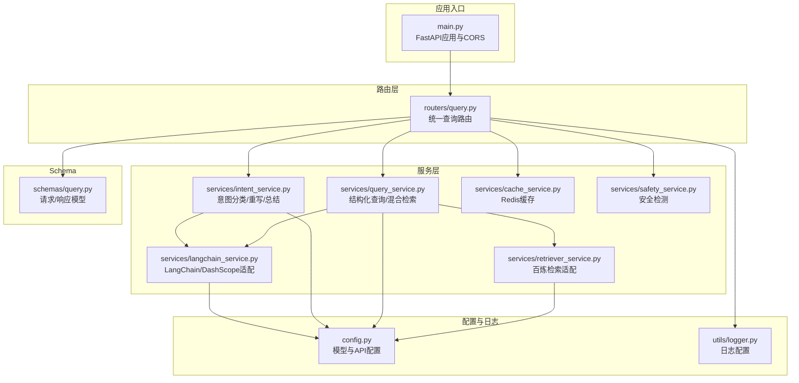
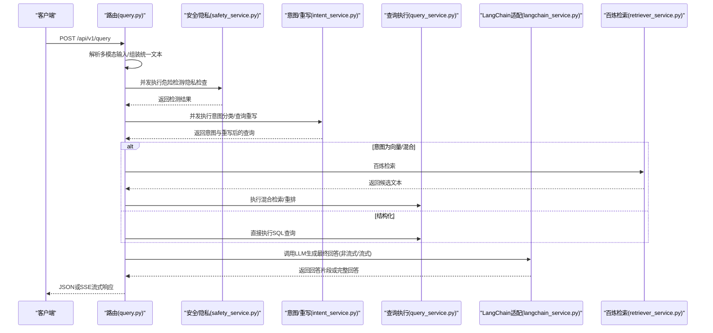
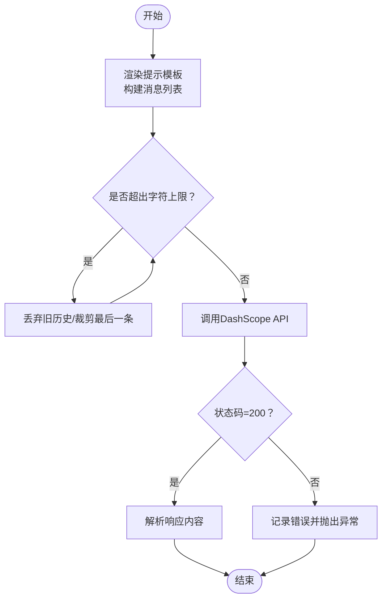
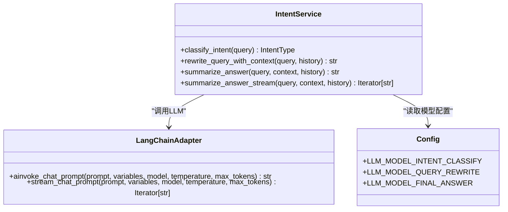
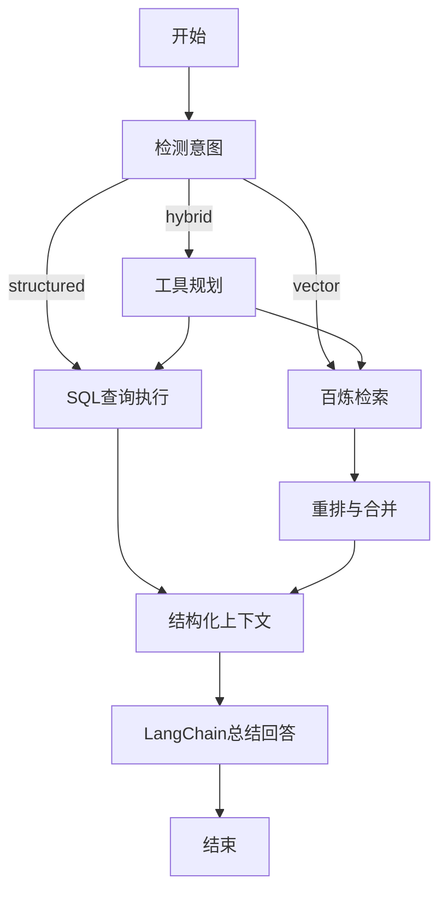
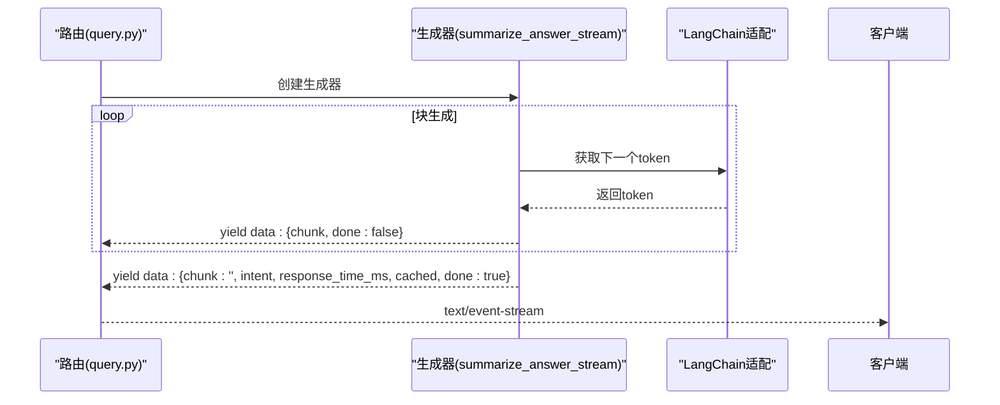
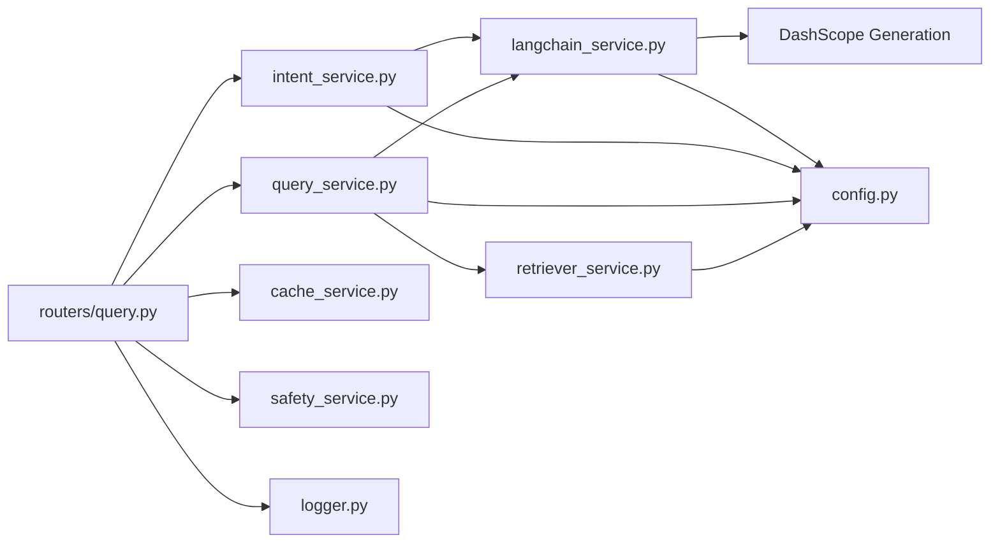

# LangChain集成服务

<cite>
**本文档引用的文件**
- [langchain_service.py](file://service/ai_assistant/app/services/langchain_service.py)
- [intent_service.py](file://service/ai_assistant/app/services/intent_service.py)
- [query_service.py](file://service/ai_assistant/app/services/query_service.py)
- [query.py](file://service/ai_assistant/app/routers/query.py)
- [config.py](file://service/ai_assistant/app/config.py)
- [logger.py](file://service/ai_assistant/app/utils/logger.py)
- [cache_service.py](file://service/ai_assistant/app/services/cache_service.py)
- [safety_service.py](file://service/ai_assistant/app/services/safety_service.py)
- [retriever_service.py](file://service/ai_assistant/app/services/retriever_service.py)
- [main.py](file://service/ai_assistant/app/main.py)
- [query.py](file://service/ai_assistant/app/schemas/query.py)
</cite>

## 目录
1. [简介](#简介)
2. [项目结构](#项目结构)
3. [核心组件](#核心组件)
4. [架构总览](#架构总览)
5. [详细组件分析](#详细组件分析)
6. [依赖关系分析](#依赖关系分析)
7. [性能考虑](#性能考虑)
8. [故障排查指南](#故障排查指南)
9. [结论](#结论)
10. [附录](#附录)

## 简介
本文件面向AI校园助手项目的LangChain集成服务，系统化阐述框架集成架构、提示词模板管理、链式调用机制、异步与流式响应处理、模型参数配置、错误处理与重试策略，并提供模型切换、成本控制与监控告警的实践指南。文档以代码为依据，配合可视化图表帮助读者快速理解系统工作流。

## 项目结构
后端采用FastAPI应用，LangChain集成主要分布在服务层，路由层负责请求编排与流式输出。核心文件组织如下：
- 应用入口与中间件：[main.py](file://service/ai_assistant/app/main.py)
- 配置中心：[config.py](file://service/ai_assistant/app/config.py)
- 日志工具：[logger.py](file://service/ai_assistant/app/utils/logger.py)
- 路由与业务编排：[query.py](file://service/ai_assistant/app/routers/query.py)
- LangChain集成适配：[langchain_service.py](file://service/ai_assistant/app/services/langchain_service.py)
- 意图与回答生成：[intent_service.py](file://service/ai_assistant/app/services/intent_service.py)
- 结构化查询与检索：[query_service.py](file://service/ai_assistant/app/services/query_service.py)
- 百炼检索适配：[retriever_service.py](file://service/ai_assistant/app/services/retriever_service.py)
- 缓存与安全：[cache_service.py](file://service/ai_assistant/app/services/cache_service.py)、[safety_service.py](file://service/ai_assistant/app/services/safety_service.py)
- 请求/响应模型：[query.py](file://service/ai_assistant/app/schemas/query.py)

**图表来源**
- [main.py:1-86](file://service/ai_assistant/app/main.py#L1-L86)
- [query.py:1-788](file://service/ai_assistant/app/routers/query.py#L1-L788)
- [langchain_service.py:1-278](file://service/ai_assistant/app/services/langchain_service.py#L1-L278)
- [intent_service.py:1-346](file://service/ai_assistant/app/services/intent_service.py#L1-L346)
- [query_service.py:1-800](file://service/ai_assistant/app/services/query_service.py#L1-L800)
- [retriever_service.py:1-168](file://service/ai_assistant/app/services/retriever_service.py#L1-L168)
- [cache_service.py:1-177](file://service/ai_assistant/app/services/cache_service.py#L1-L177)
- [safety_service.py:1-163](file://service/ai_assistant/app/services/safety_service.py#L1-L163)
- [config.py:1-113](file://service/ai_assistant/app/config.py#L1-L113)
- [logger.py:1-53](file://service/ai_assistant/app/utils/logger.py#L1-L53)
- [query.py:1-33](file://service/ai_assistant/app/schemas/query.py#L1-L33)

**章节来源**
- [main.py:1-86](file://service/ai_assistant/app/main.py#L1-L86)
- [config.py:1-113](file://service/ai_assistant/app/config.py#L1-L113)

## 核心组件
- LangChain适配与DashScope集成：提供提示模板渲染、消息格式转换、非流式与流式调用、输入裁剪与代理控制。
- 意图分类与回答生成：基于ChatPromptTemplate与Runnable链，完成意图分类、查询重写、最终回答生成与流式输出。
- 查询执行与检索：结构化SQL查询、百炼检索、混合检索与重排、工具规划与执行。
- 流式响应与SSE：统一SSE响应构造、进度日志、错误包装与前端兼容。
- 缓存与安全：Redis缓存、敏感度与时间窗口控制、隐私与危险内容检测。
- 配置中心：模型名称、API密钥、输入长度限制、缓存TTL等集中管理。

**章节来源**
- [langchain_service.py:139-278](file://service/ai_assistant/app/services/langchain_service.py#L139-L278)
- [intent_service.py:218-346](file://service/ai_assistant/app/services/intent_service.py#L218-L346)
- [query_service.py:150-238](file://service/ai_assistant/app/services/query_service.py#L150-L238)
- [query.py:115-126](file://service/ai_assistant/app/routers/query.py#L115-L126)
- [cache_service.py:92-177](file://service/ai_assistant/app/services/cache_service.py#L92-L177)
- [safety_service.py:84-163](file://service/ai_assistant/app/services/safety_service.py#L84-L163)

## 架构总览
系统围绕统一查询路由展开，按多模态输入构建统一文本，进行安全与隐私检查，随后并发执行意图分类与查询重写，再根据意图选择结构化查询、向量检索或混合路径，最终通过LangChain链生成自然语言回答。回答既可返回JSON，也可通过SSE流式传输。

**图表来源**
- [query.py:207-745](file://service/ai_assistant/app/routers/query.py#L207-L745)
- [intent_service.py:218-346](file://service/ai_assistant/app/services/intent_service.py#L218-L346)
- [query_service.py:150-238](file://service/ai_assistant/app/services/query_service.py#L150-L238)
- [retriever_service.py:46-135](file://service/ai_assistant/app/services/retriever_service.py#L46-L135)
- [langchain_service.py:139-278](file://service/ai_assistant/app/services/langchain_service.py#L139-L278)

## 详细组件分析

### LangChain适配与DashScope集成
- 提示模板渲染与消息格式转换：将LangChain消息对象转换为DashScope所需格式，支持system、user、assistant角色映射。
- 输入裁剪策略：按总字符上限优先丢弃历史、再裁剪最后一条消息，确保模型输入在限制内。
- 非流式调用：在独立线程中执行HTTP调用，避免阻塞事件循环，统一错误处理与日志记录。
- 流式调用：基于增量输出迭代返回，按块计数记录进度，异常时统一抛出并记录。
- 代理控制：可禁用环境代理变量，避免意外代理转发。

**图表来源**
- [langchain_service.py:128-278](file://service/ai_assistant/app/services/langchain_service.py#L128-L278)

**章节来源**
- [langchain_service.py:19-278](file://service/ai_assistant/app/services/langchain_service.py#L19-L278)

### 意图分类与回答生成（链式调用）
- 意图分类：使用ChatPromptTemplate与RunnableLambda，温度设为0以稳定输出，解析枚举值。
- 查询重写：结合历史上下文，将最新问题补全为独立完整查询，限制长度并回退原查询。
- 最终回答：构建系统提示与历史/上下文，调用LLM生成自然语言回答；提供非流式与流式两种输出。

**图表来源**
- [intent_service.py:218-346](file://service/ai_assistant/app/services/intent_service.py#L218-L346)
- [langchain_service.py:139-278](file://service/ai_assistant/app/services/langchain_service.py#L139-L278)
- [config.py:54-73](file://service/ai_assistant/app/config.py#L54-L73)

**章节来源**
- [intent_service.py:218-346](file://service/ai_assistant/app/services/intent_service.py#L218-L346)

### 查询执行与检索（结构化/向量/混合）
- 结构化查询：针对学生成绩、课表、选课、个人信息等，基于SQL查询并字段名翻译。
- 百炼检索：封装阿里云百炼检索API，支持稠密/稀疏检索与重排，返回候选文本块。
- 混合检索：结合结构化结果与检索候选，通过重排提示进行去重与筛选。
- 工具规划：根据意图与显式学期ID，规划SQL工具调用序列，避免SQL注入与越权。

**图表来源**
- [query_service.py:150-238](file://service/ai_assistant/app/services/query_service.py#L150-L238)
- [retriever_service.py:46-135](file://service/ai_assistant/app/services/retriever_service.py#L46-L135)
- [intent_service.py:298-346](file://service/ai_assistant/app/services/intent_service.py#L298-L346)

**章节来源**
- [query_service.py:150-800](file://service/ai_assistant/app/services/query_service.py#L150-L800)
- [retriever_service.py:23-168](file://service/ai_assistant/app/services/retriever_service.py#L23-L168)

### 流式响应与SSE
- SSE构造：统一SSE响应头，避免反向代理缓冲与改写，保持长连接。
- 流式生成：将LLM生成器包装为同步迭代器，异步线程中消费，按块推送，最后发送完成包。
- 错误处理：捕获异常并转换为前端可读错误消息，标记done=true结束流。

**图表来源**
- [query.py:659-745](file://service/ai_assistant/app/routers/query.py#L659-L745)
- [intent_service.py:326-346](file://service/ai_assistant/app/services/intent_service.py#L326-L346)
- [langchain_service.py:206-278](file://service/ai_assistant/app/services/langchain_service.py#L206-L278)

**章节来源**
- [query.py:115-126](file://service/ai_assistant/app/routers/query.py#L115-L126)
- [query.py:659-745](file://service/ai_assistant/app/routers/query.py#L659-L745)

### 缓存与安全
- 缓存策略：基于DID与查询MD5生成键，区分敏感与普通查询TTL，支持日期敏感与课表版本失效。
- 安全检测：危险内容检测（自杀/暴力倾向），隐私检查（禁止查询他人学号），公共服务联系方式查询放行。
- 隐私保护：会话历史隔离存储，避免并发会话串话。

**章节来源**
- [cache_service.py:92-177](file://service/ai_assistant/app/services/cache_service.py#L92-L177)
- [safety_service.py:84-163](file://service/ai_assistant/app/services/safety_service.py#L84-L163)
- [query.py:157-196](file://service/ai_assistant/app/routers/query.py#L157-L196)

## 依赖关系分析
- LangChain核心：ChatPromptTemplate、MessagesPlaceholder、RunnableLambda、StrOutputParser。
- DashScope：Generation调用，支持非流式与流式增量输出。
- 百炼检索：BailianClient检索API，支持稠密/稀疏检索与重排。
- Redis：异步客户端aioredis，用于缓存与会话历史。
- FastAPI：路由注册、CORS、StreamingResponse。

**图表来源**
- [langchain_service.py:12-17](file://service/ai_assistant/app/services/langchain_service.py#L12-L17)
- [intent_service.py:13-21](file://service/ai_assistant/app/services/intent_service.py#L13-L21)
- [query_service.py:18-47](file://service/ai_assistant/app/services/query_service.py#L18-L47)
- [retriever_service.py:11-44](file://service/ai_assistant/app/services/retriever_service.py#L11-L44)
- [query.py:35-44](file://service/ai_assistant/app/routers/query.py#L35-L44)
- [config.py:48-113](file://service/ai_assistant/app/config.py#L48-L113)

**章节来源**
- [langchain_service.py:12-17](file://service/ai_assistant/app/services/langchain_service.py#L12-L17)
- [intent_service.py:13-21](file://service/ai_assistant/app/services/intent_service.py#L13-L21)
- [query_service.py:18-47](file://service/ai_assistant/app/services/query_service.py#L18-L47)
- [retriever_service.py:11-44](file://service/ai_assistant/app/services/retriever_service.py#L11-L44)
- [query.py:35-44](file://service/ai_assistant/app/routers/query.py#L35-L44)

## 性能考虑
- 异步与并发
  - 使用asyncio.to_thread在独立线程中执行阻塞调用，避免阻塞事件循环。
  - 路由层并发执行安全检查与查询重写，缩短端到端延迟。
- 输入裁剪与上下文截断
  - 消息总字符上限与历史丢弃策略，减少模型调用成本与延迟。
  - 历史与上下文按最大长度截断，保留关键信息。
- 缓存策略
  - Redis缓存命中可显著降低LLM调用次数；敏感与日期敏感查询按策略失效。
- 流式输出
  - SSE分块推送，前端可即时显示，提升感知性能。
- 模型选择
  - 不同任务选用不同模型：意图分类与重写使用轻量模型，最终回答使用更强模型。

**章节来源**
- [query.py:347-352](file://service/ai_assistant/app/routers/query.py#L347-L352)
- [langchain_service.py:46-96](file://service/ai_assistant/app/services/langchain_service.py#L46-L96)
- [intent_service.py:163-210](file://service/ai_assistant/app/services/intent_service.py#L163-L210)
- [cache_service.py:85-177](file://service/ai_assistant/app/services/cache_service.py#L85-L177)

## 故障排查指南
- LLM调用失败
  - 非流式：状态码非200时记录错误并抛出运行时异常；检查API密钥与模型名称。
  - 流式：遇到非200状态码时记录错误并抛出异常；前端收到错误块后结束流。
- 网络异常与超时
  - DashScope会话可禁用环境代理，避免代理导致的超时或路由错误。
- 输入过长
  - 超出字符上限时会记录警告并进行裁剪；必要时调整模型或提示模板。
- SSE异常
  - 捕获异常并转换为前端可读错误消息，标记done=true结束流。
- 安全与隐私
  - 危险内容检测失败时回退正则；隐私检查发现查询他人学号直接拦截并返回提示。

**章节来源**
- [langchain_service.py:169-203](file://service/ai_assistant/app/services/langchain_service.py#L169-L203)
- [langchain_service.py:252-277](file://service/ai_assistant/app/services/langchain_service.py#L252-L277)
- [query.py:142-151](file://service/ai_assistant/app/routers/query.py#L142-L151)
- [safety_service.py:134-144](file://service/ai_assistant/app/services/safety_service.py#L134-L144)

## 结论
本项目通过LangChain与DashScope的深度集成，实现了从多模态输入到结构化/向量/混合检索再到自然语言总结的完整链路。通过异步并发、流式SSE、输入裁剪与缓存策略，系统在性能与用户体验之间取得平衡。完善的错误处理与安全检测保障了服务稳定性与合规性。建议在生产环境中持续监控模型调用成本与延迟，并根据业务增长动态调整模型与缓存策略。

## 附录

### LangChain使用示例与最佳实践
- 提示词模板构建
  - 意图分类：使用系统提示限定输出词汇集合，温度设为0。
  - 查询重写：使用MessagesPlaceholder携带历史，确保上下文连贯。
  - 最终回答：系统提示强调数据来源与输出规范，避免泄露内部字段。
- 链式调用组合
  - 使用RunnableLambda包装LLM调用，配合StrOutputParser解析输出。
  - 对于复杂流程，将多个Runnable串联，必要时使用分支与工具规划。
- 性能优化技巧
  - 将长耗时操作放入异步线程池，避免阻塞事件循环。
  - 合理设置max_tokens与temperature，兼顾质量与成本。
  - 利用缓存与输入裁剪减少重复调用与上下文长度。

**章节来源**
- [intent_service.py:23-101](file://service/ai_assistant/app/services/intent_service.py#L23-L101)
- [intent_service.py:218-346](file://service/ai_assistant/app/services/intent_service.py#L218-L346)
- [query_service.py:150-238](file://service/ai_assistant/app/services/query_service.py#L150-L238)

### 模型切换指南
- 配置项
  - 意图分类：LLM_MODEL_INTENT_CLASSIFY
  - 查询重写：LLM_MODEL_QUERY_REWRITE
  - 最终回答：LLM_MODEL_FINAL_ANSWER
  - 工具规划：LLM_MODEL_TOOL_PLANNER
  - 向量检索拆解：LLM_MODEL_VECTOR_DECOMPOSE
  - 混合重排：LLM_MODEL_HYBRID_RERANK
  - 安全检测：LLM_MODEL_SAFETY_CHECK
  - 图像理解：LLM_MODEL_IMAGE_UNDERSTANDING
  - 语音识别：LLM_MODEL_SPEECH_RECOGNITION
- 切换步骤
  - 在配置文件中修改对应模型名称。
  - 验证模型可用性与输出稳定性。
  - 根据任务特性调整温度与最大令牌数。

**章节来源**
- [config.py:54-73](file://service/ai_assistant/app/config.py#L54-L73)

### 成本控制策略
- 模型选择与参数
  - 低复杂度任务使用轻量模型，提高吞吐并降低成本。
  - 合理设置temperature与max_tokens，避免过度生成。
- 缓存与去重
  - 利用Redis缓存高频查询，敏感与日期敏感查询按策略失效。
  - 输入裁剪与上下文截断减少token消耗。
- 监控与告警
  - 记录LLM调用次数、平均耗时与错误率。
  - 设置阈值告警，及时发现异常波动。

**章节来源**
- [cache_service.py:85-177](file://service/ai_assistant/app/services/cache_service.py#L85-L177)
- [langchain_service.py:46-96](file://service/ai_assistant/app/services/langchain_service.py#L46-L96)
- [logger.py:17-53](file://service/ai_assistant/app/utils/logger.py#L17-L53)