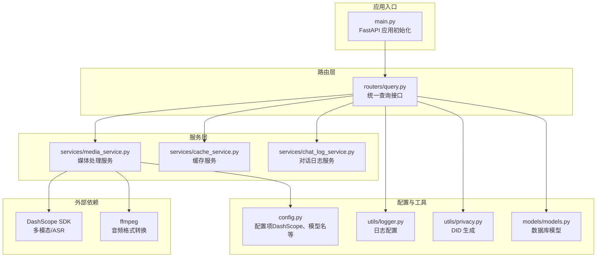
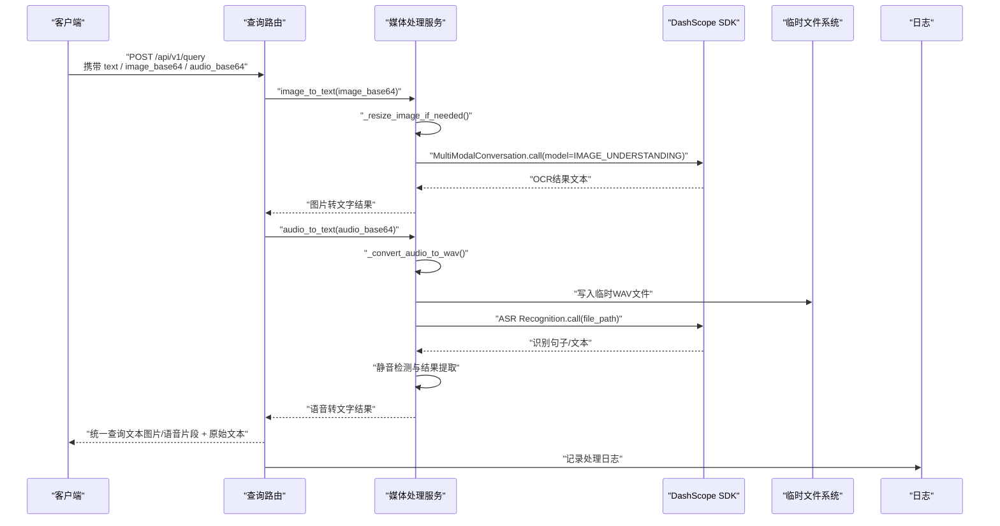
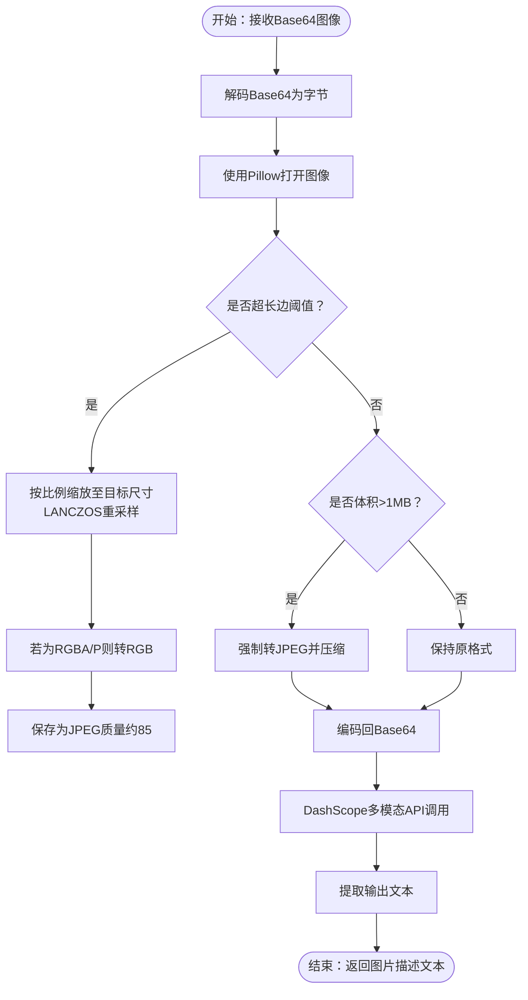
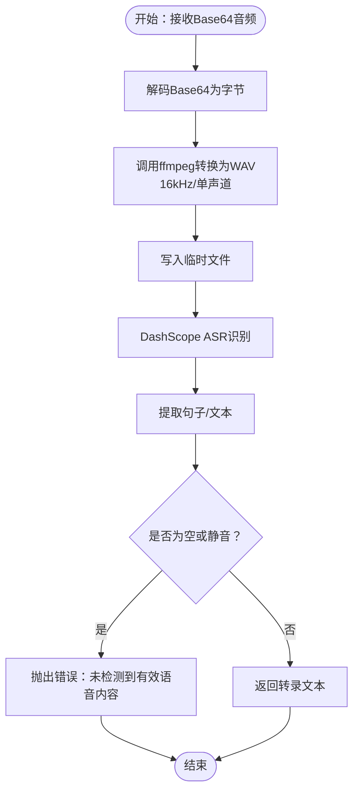
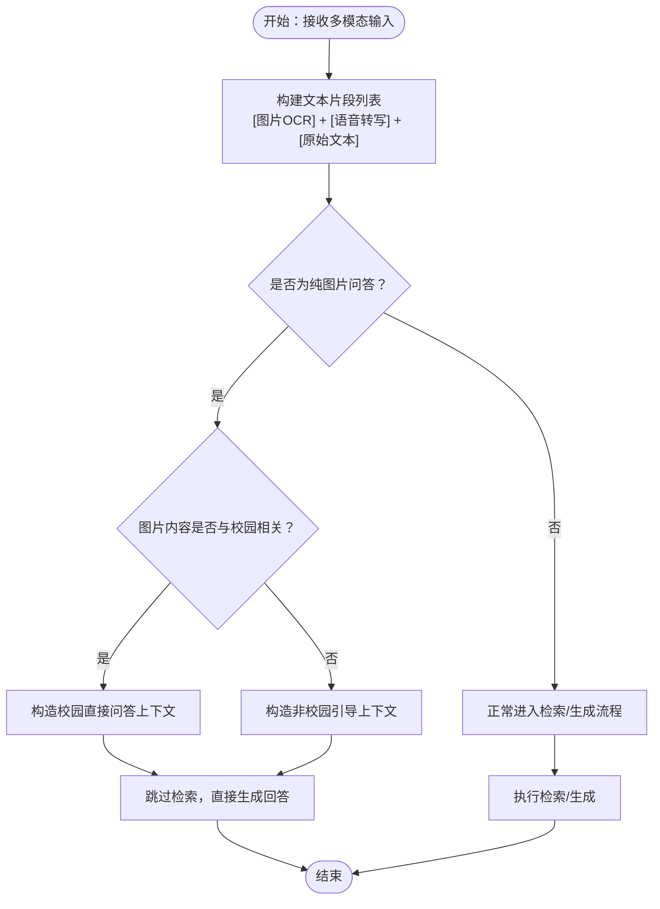
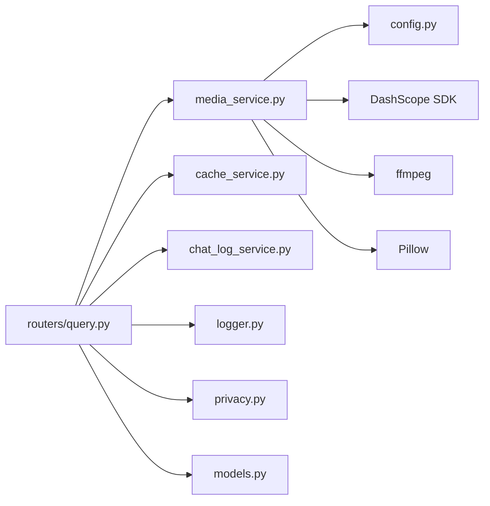

# 媒体处理服务

<cite>
**本文档引用的文件**
- [media_service.py](file://service/ai_assistant/app/services/media_service.py)
- [query.py](file://service/ai_assistant/app/routers/query.py)
- [config.py](file://service/ai_assistant/app/config.py)
- [logger.py](file://service/ai_assistant/app/utils/logger.py)
- [requirements.txt](file://service/ai_assistant/requirements.txt)
- [query.py（schemas）](file://service/ai_assistant/app/schemas/query.py)
- [cache_service.py](file://service/ai_assistant/app/services/cache_service.py)
- [chat_log_service.py](file://service/ai_assistant/app/services/chat_log_service.py)
- [privacy.py](file://service/ai_assistant/app/utils/privacy.py)
- [models.py](file://service/ai_assistant/app/models/models.py)
- [main.py](file://service/ai_assistant/app/main.py)
</cite>

## 目录
1. [简介](#简介)
2. [项目结构](#项目结构)
3. [核心组件](#核心组件)
4. [架构总览](#架构总览)
5. [详细组件分析](#详细组件分析)
6. [依赖分析](#依赖分析)
7. [性能考虑](#性能考虑)
8. [故障排查指南](#故障排查指南)
9. [结论](#结论)
10. [附录](#附录)

## 简介
本文件面向“AI校园助手”项目的媒体处理服务，聚焦以下能力：
- 图片处理：图像格式转换、尺寸调整、OCR引擎集成与文字提取
- 语音处理：音频格式支持、语音识别API集成、转录结果优化与静音检测
- 多模态融合：文本、图片、语音信息的统一表示、特征对齐与上下文构建
- 存储与管理：文件上传、临时存储、清理策略与访问控制
- 示例与实践：典型处理流程、质量控制标准与性能优化建议
- 错误处理、资源监控与扩展集成指南

媒体处理服务通过统一的查询接口接收多模态输入，将图片与音频转换为文本，再与原始文本合并为统一查询，进入后续的安全检查、意图分类、检索与生成流程。

## 项目结构
媒体处理服务位于后端应用的“服务层”，与路由层、配置层、日志与工具模块协同工作，形成完整的多模态处理链路。

图表来源
- [main.py:1-86](file://service/ai_assistant/app/main.py#L1-L86)
- [query.py:1-788](file://service/ai_assistant/app/routers/query.py#L1-L788)
- [media_service.py:1-246](file://service/ai_assistant/app/services/media_service.py#L1-L246)
- [config.py:1-113](file://service/ai_assistant/app/config.py#L1-L113)
- [logger.py:1-53](file://service/ai_assistant/app/utils/logger.py#L1-L53)
- [privacy.py:1-23](file://service/ai_assistant/app/utils/privacy.py#L1-L23)
- [models.py:625-660](file://service/ai_assistant/app/models/models.py#L625-L660)

章节来源
- [main.py:1-86](file://service/ai_assistant/app/main.py#L1-L86)
- [query.py:1-788](file://service/ai_assistant/app/routers/query.py#L1-L788)

## 核心组件
- 媒体处理服务（media_service.py）
  - 图片处理：图像尺寸优化、格式转换（JPEG）、OCR调用
  - 语音处理：音频解码、ffmpeg转换为WAV、ASR识别、静音检测与结果提取
- 查询路由（routers/query.py）
  - 统一入口，按需调用媒体处理服务，拼装统一查询文本
  - 图片纯问答分支与校园相关性判断
- 配置（config.py）
  - DashScope API Key、模型名称（图像理解、语音识别）、CORS、缓存TTL等
- 日志（utils/logger.py）
  - 控制台与文件双通道输出，便于定位媒体处理问题
- 缓存（services/cache_service.py）
  - 基于Redis的查询缓存，含敏感度与时间维度的失效策略
- 对话日志（services/chat_log_service.py）
  - 保存学生与助手的对话，隐私字段采用DID脱敏
- 隐私（utils/privacy.py）
  - 生成稳定、单向的DID，用于日志与会话历史关联
- 数据模型（models/models.py）
  - ChatLog等模型支撑日志与历史记录

章节来源
- [media_service.py:1-246](file://service/ai_assistant/app/services/media_service.py#L1-L246)
- [query.py:1-788](file://service/ai_assistant/app/routers/query.py#L1-L788)
- [config.py:1-113](file://service/ai_assistant/app/config.py#L1-L113)
- [logger.py:1-53](file://service/ai_assistant/app/utils/logger.py#L1-L53)
- [cache_service.py:1-177](file://service/ai_assistant/app/services/cache_service.py#L1-L177)
- [chat_log_service.py:1-76](file://service/ai_assistant/app/services/chat_log_service.py#L1-L76)
- [privacy.py:1-23](file://service/ai_assistant/app/utils/privacy.py#L1-L23)
- [models.py:625-660](file://service/ai_assistant/app/models/models.py#L625-L660)

## 架构总览
媒体处理服务在统一查询接口中被调用，其核心流程如下：

图表来源
- [query.py:207-273](file://service/ai_assistant/app/routers/query.py#L207-L273)
- [media_service.py:115-156](file://service/ai_assistant/app/services/media_service.py#L115-L156)
- [media_service.py:159-245](file://service/ai_assistant/app/services/media_service.py#L159-L245)

## 详细组件分析

### 图片处理流程（OCR）
- 输入：Base64编码的图像（支持PNG/JPEG）
- 预处理：
  - 若最长边超过阈值，按比例缩放至目标尺寸
  - 若体积超过阈值，强制转换为JPEG并压缩
- OCR调用：
  - 通过DashScope多模态对话API，传入data URL形式的图像与提示词
  - 提取返回的文本作为图片内容描述与关键信息
- 输出：自然语言描述文本

图表来源
- [media_service.py:23-63](file://service/ai_assistant/app/services/media_service.py#L23-L63)
- [media_service.py:115-156](file://service/ai_assistant/app/services/media_service.py#L115-L156)

章节来源
- [media_service.py:23-63](file://service/ai_assistant/app/services/media_service.py#L23-L63)
- [media_service.py:115-156](file://service/ai_assistant/app/services/media_service.py#L115-L156)
- [config.py:69-72](file://service/ai_assistant/app/config.py#L69-L72)

### 语音处理机制（ASR）
- 输入：Base64编码的音频（WAV/MP3等）
- 预处理：
  - 使用ffmpeg将音频转换为WAV格式，单声道、16kHz采样率
  - 将转换后的WAV数据写入临时文件
- ASR调用：
  - 基于DashScope ASR Recognition实例，传入临时文件路径
  - 支持回调参数（当前未启用）
- 结果提取与优化：
  - 从SDK返回的不同结构中尝试提取句子/文本
  - 对空文本或静音场景进行显式拦截，避免无效输出
- 输出：标准化后的转录文本

图表来源
- [media_service.py:66-113](file://service/ai_assistant/app/services/media_service.py#L66-L113)
- [media_service.py:159-245](file://service/ai_assistant/app/services/media_service.py#L159-L245)

章节来源
- [media_service.py:66-113](file://service/ai_assistant/app/services/media_service.py#L66-L113)
- [media_service.py:159-245](file://service/ai_assistant/app/services/media_service.py#L159-L245)
- [config.py:70-72](file://service/ai_assistant/app/config.py#L70-L72)

### 多模态数据融合策略
- 统一表示：
  - 将图片OCR得到的文本与语音转写文本，统一加入查询文本列表
  - 原始文本直接拼接，形成“多段落”的统一查询
- 特征对齐：
  - 通过后续的意图分类与检索执行，将多模态信息整合到同一上下文
- 上下文构建：
  - 会话级历史（Redis）与数据库历史（降级）共同参与
  - 图片纯问答场景下，根据图片内容与校园相关性，决定是否跳过检索直接回答

图表来源
- [query.py:228-273](file://service/ai_assistant/app/routers/query.py#L228-L273)
- [query.py:505-524](file://service/ai_assistant/app/routers/query.py#L505-L524)

章节来源
- [query.py:228-273](file://service/ai_assistant/app/routers/query.py#L228-L273)
- [query.py:505-524](file://service/ai_assistant/app/routers/query.py#L505-L524)

### 媒体文件存储与管理
- 上传与接收
  - 前端以Base64形式提交图片与音频，后端直接在内存中处理，无需落地
- 临时存储
  - 语音处理过程中将WAV写入临时文件，完成后立即删除
- 清理策略
  - 临时文件在finally块中删除，避免磁盘泄漏
- 访问控制
  - 所有接口均需JWT认证；日志与历史记录采用DID脱敏，保护隐私

章节来源
- [media_service.py:188-214](file://service/ai_assistant/app/services/media_service.py#L188-L214)
- [query.py:207-273](file://service/ai_assistant/app/routers/query.py#L207-L273)
- [chat_log_service.py:14-55](file://service/ai_assistant/app/services/chat_log_service.py#L14-L55)
- [privacy.py:9-22](file://service/ai_assistant/app/utils/privacy.py#L9-L22)

### 具体处理示例与质量控制
- 图片示例
  - 输入：高分辨率PNG（体积>1MB）
  - 处理：自动转JPEG并压缩，避免DashScope负载过大
  - 输出：包含图片内容描述与关键信息的文本
- 语音示例
  - 输入：MP3音频
  - 处理：ffmpeg转换为16kHz单声道WAV
  - 输出：逐句转录文本，静音场景显式报错
- 质量控制
  - 图像尺寸阈值与体积阈值双重保障
  - ASR静音检测避免无效输出
  - 日志记录关键步骤与错误信息，便于回溯

章节来源
- [media_service.py:23-63](file://service/ai_assistant/app/services/media_service.py#L23-L63)
- [media_service.py:66-113](file://service/ai_assistant/app/services/media_service.py#L66-L113)
- [media_service.py:159-245](file://service/ai_assistant/app/services/media_service.py#L159-L245)

## 依赖分析
- 外部依赖
  - DashScope SDK：多模态对话与ASR识别
  - ffmpeg：音频格式转换
  - Pillow：图像解码与重采样
- 内部依赖
  - 配置：模型名称、API Key、CORS、缓存TTL
  - 日志：统一输出与落盘
  - 缓存：Redis键空间与TTL策略
  - 隐私：DID生成与日志脱敏

图表来源
- [media_service.py:1-246](file://service/ai_assistant/app/services/media_service.py#L1-L246)
- [query.py:1-788](file://service/ai_assistant/app/routers/query.py#L1-L788)
- [config.py:1-113](file://service/ai_assistant/app/config.py#L1-L113)
- [logger.py:1-53](file://service/ai_assistant/app/utils/logger.py#L1-L53)
- [cache_service.py:1-177](file://service/ai_assistant/app/services/cache_service.py#L1-L177)
- [chat_log_service.py:1-76](file://service/ai_assistant/app/services/chat_log_service.py#L1-L76)
- [privacy.py:1-23](file://service/ai_assistant/app/utils/privacy.py#L1-L23)
- [models.py:625-660](file://service/ai_assistant/app/models/models.py#L625-L660)

章节来源
- [requirements.txt:1-22](file://service/ai_assistant/requirements.txt#L1-L22)
- [config.py:1-113](file://service/ai_assistant/app/config.py#L1-L113)

## 性能考虑
- I/O与CPU分离
  - 图片处理与ASR调用通过线程池异步执行，避免阻塞事件循环
- 体积与尺寸优化
  - 图像自动压缩与尺寸缩放，减少DashScope调用成本
- 临时文件管理
  - 语音处理完成后立即删除临时文件，降低磁盘压力
- 缓存策略
  - 基于查询哈希与DID的键空间，结合敏感度与时间维度TTL，提升命中率与新鲜度

章节来源
- [media_service.py:141-148](file://service/ai_assistant/app/services/media_service.py#L141-L148)
- [media_service.py:204-205](file://service/ai_assistant/app/services/media_service.py#L204-L205)
- [cache_service.py:85-89](file://service/ai_assistant/app/services/cache_service.py#L85-L89)

## 故障排查指南
- 常见错误与定位
  - 图片处理失败：检查图像尺寸与体积阈值、DashScope返回状态码
  - 语音转换失败：检查ffmpeg安装与权限、输入音频格式
  - ASR静音：确认麦克风与环境噪声、采样率与声道设置
- 日志与监控
  - 使用统一日志模块输出关键步骤与错误摘要
  - 建议在网关或反向代理层开启访问日志与错误统计
- 安全与合规
  - 所有学生信息以DID脱敏存储，避免泄露真实学号
  - 危险内容检测与干预流程已在查询路由中实现

章节来源
- [media_service.py:60-63](file://service/ai_assistant/app/services/media_service.py#L60-L63)
- [media_service.py:100-104](file://service/ai_assistant/app/services/media_service.py#L100-L104)
- [media_service.py:215-219](file://service/ai_assistant/app/services/media_service.py#L215-L219)
- [logger.py:17-46](file://service/ai_assistant/app/utils/logger.py#L17-L46)
- [chat_log_service.py:14-55](file://service/ai_assistant/app/services/chat_log_service.py#L14-L55)

## 结论
媒体处理服务通过轻量的预处理与稳定的外部API集成，实现了图片OCR与语音ASR的高效融合。配合统一的查询接口、缓存与日志体系，系统在准确性、性能与隐私安全方面达到平衡。建议在生产环境中强化ffmpeg与DashScope的健康检查、引入速率限制与重试策略，并持续优化静音检测阈值以提升语音识别稳定性。

## 附录
- 配置项速览
  - DashScope API Key、图像理解模型、语音识别模型、CORS白名单、缓存TTL
- 请求体字段
  - text、image_base64、audio_base64、session_id、output_type
- 数据模型
  - ChatLog用于对话日志持久化，索引覆盖DID与时间戳

章节来源
- [config.py:48-80](file://service/ai_assistant/app/config.py#L48-L80)
- [query.py（schemas）:15-32](file://service/ai_assistant/app/schemas/query.py#L15-L32)
- [models.py:641-660](file://service/ai_assistant/app/models/models.py#L641-L660)