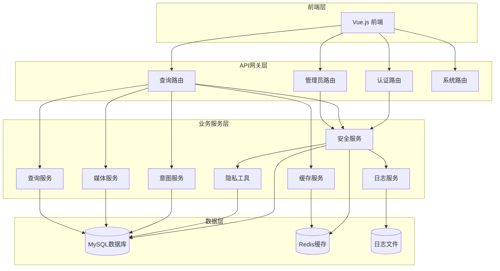
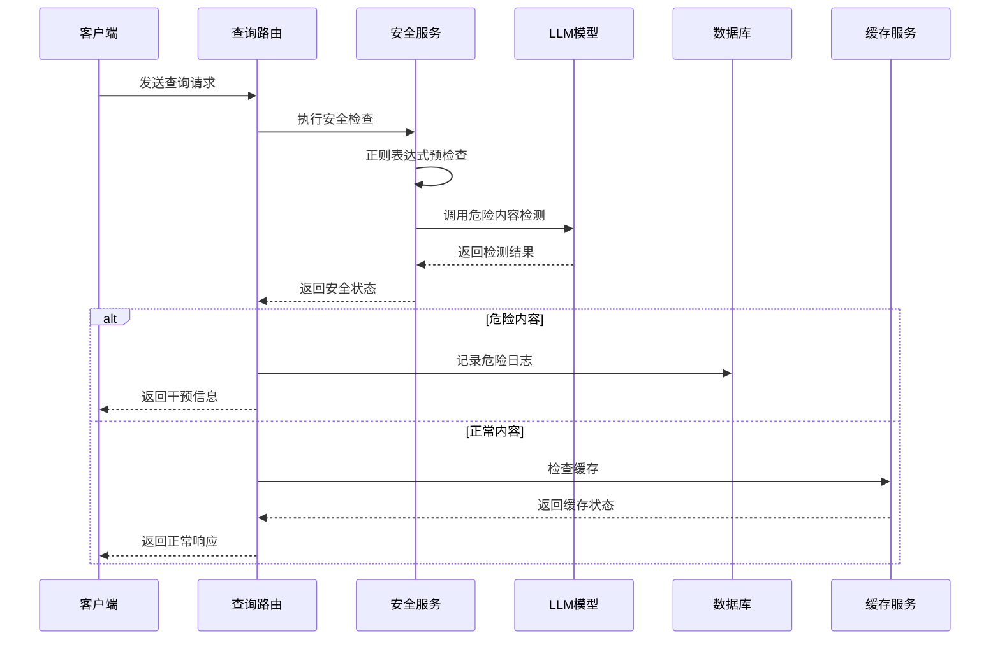
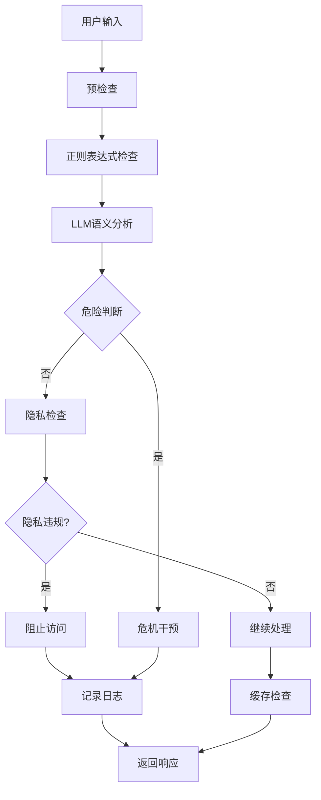
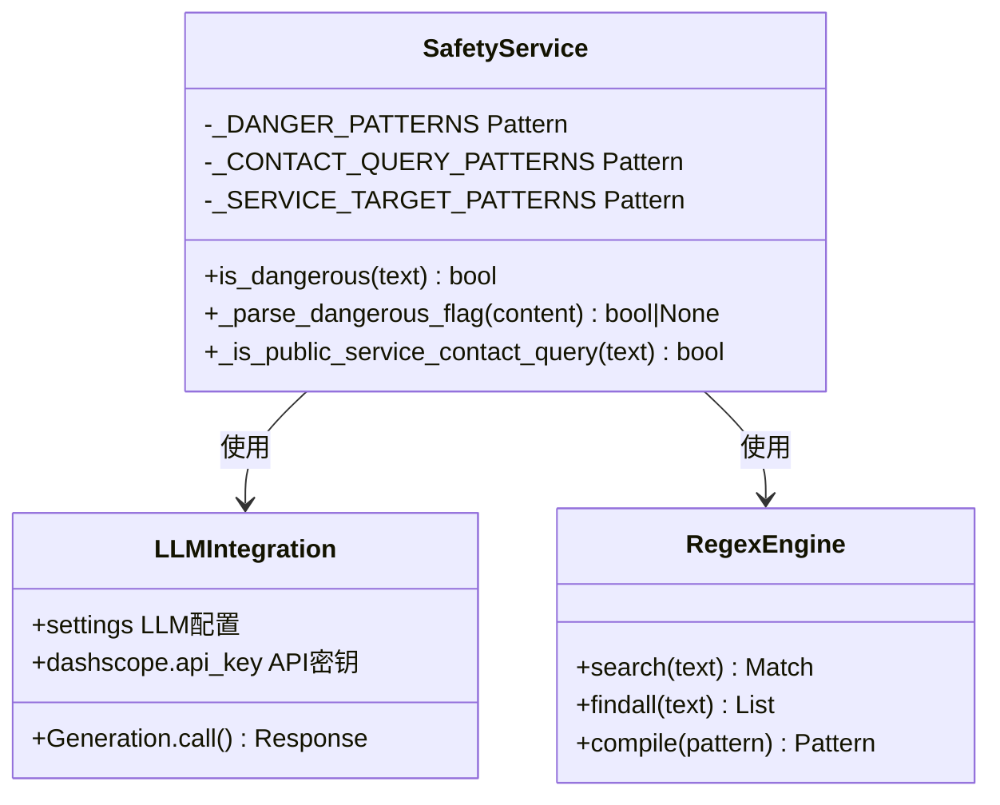
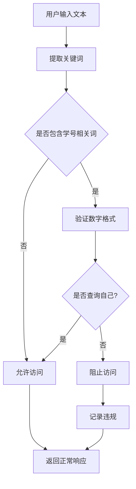
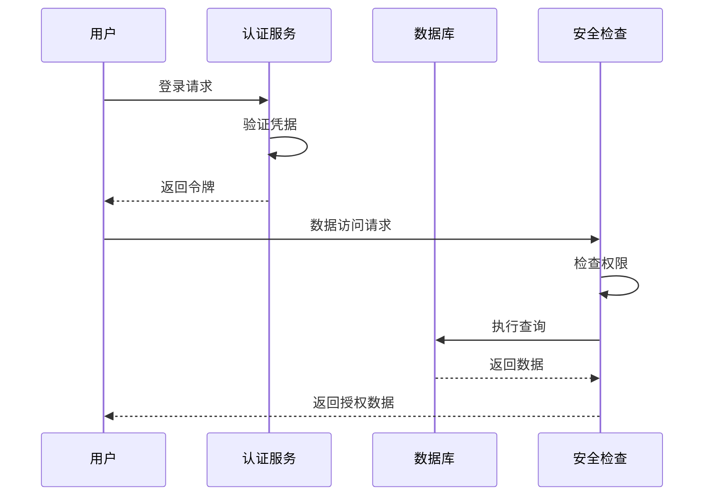
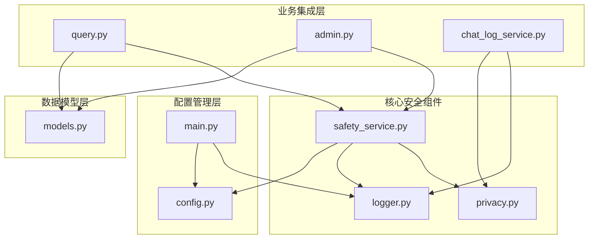
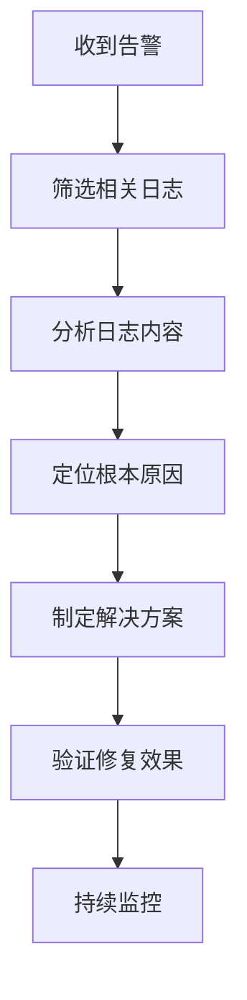

# 安全服务

<cite>
**本文档引用的文件**
- [safety_service.py](file://service/ai_assistant/app/services/safety_service.py)
- [privacy.py](file://service/ai_assistant/app/utils/privacy.py)
- [logger.py](file://service/ai_assistant/app/utils/logger.py)
- [models.py](file://service/ai_assistant/app/models/models.py)
- [config.py](file://service/ai_assistant/app/config.py)
- [query.py](file://service/ai_assistant/app/routers/query.py)
- [chat_log_service.py](file://service/ai_assistant/app/services/chat_log_service.py)
- [admin.py](file://service/ai_assistant/app/routers/admin.py)
- [main.py](file://service/ai_assistant/app/main.py)
</cite>

## 目录
1. [简介](#简介)
2. [项目结构](#项目结构)
3. [核心组件](#核心组件)
4. [架构概览](#架构概览)
5. [详细组件分析](#详细组件分析)
6. [依赖关系分析](#依赖关系分析)
7. [性能考虑](#性能考虑)
8. [故障排除指南](#故障排除指南)
9. [结论](#结论)

## 简介

AI校园助手项目的安全服务是一个综合性的安全防护系统，专门设计用于保护校园AI助手平台免受各种安全威胁。该系统实现了多层次的安全防护机制，包括内容安全检查、隐私数据保护、危险内容检测和行级数据安全保证。

安全服务的核心职责包括：
- **内容安全检查**：检测和过滤不当内容，防止危险信息传播
- **隐私数据过滤**：保护学生个人信息，防止数据泄露
- **危险内容检测**：识别潜在的自杀、自残或暴力倾向
- **访问权限控制**：确保数据访问的最小权限原则
- **审计日志记录**：完整记录所有安全相关事件

## 项目结构

AI校园助手项目的整体架构采用分层设计，安全服务位于应用的核心层，与业务逻辑紧密集成：

**图表来源**
- [main.py:52-86](file://service/ai_assistant/app/main.py#L52-L86)
- [query.py:46-46](file://service/ai_assistant/app/routers/query.py#L46-L46)

**章节来源**
- [main.py:1-86](file://service/ai_assistant/app/main.py#L1-L86)
- [config.py:1-113](file://service/ai_assistant/app/config.py#L1-L113)

## 核心组件

### 安全服务核心功能

安全服务主要包含三个核心功能模块：

#### 1. 危险内容检测
- **LLM驱动的危险检测**：使用阿里云DashScope的Qwen模型进行语义分析
- **正则表达式回退机制**：在LLM调用失败时自动降级
- **上下文理解能力**：能够区分玩笑、比喻和真实危险意图

#### 2. 隐私数据保护
- **学号查询拦截**：防止学生查询他人的学号信息
- **DID脱敏机制**：使用稳定的哈希值替代真实学号
- **访问权限控制**：确保只能访问自己的个人信息

#### 3. 公共服务查询放行
- **智能识别机制**：区分真正的求助信息和公共服务查询
- **危机干预保护**：避免误伤需要帮助的学生

**章节来源**
- [safety_service.py:14-163](file://service/ai_assistant/app/services/safety_service.py#L14-L163)
- [privacy.py:9-23](file://service/ai_assistant/app/utils/privacy.py#L9-L23)

## 架构概览

安全服务在整个系统中的位置和交互关系如下：

**图表来源**
- [query.py:347-471](file://service/ai_assistant/app/routers/query.py#L347-L471)
- [safety_service.py:84-144](file://service/ai_assistant/app/services/safety_service.py#L84-L144)

### 数据流分析

**图表来源**
- [safety_service.py:36-163](file://service/ai_assistant/app/services/safety_service.py#L36-L163)
- [query.py:347-414](file://service/ai_assistant/app/routers/query.py#L347-L414)

## 详细组件分析

### 危险内容检测机制

#### LLM驱动的危险检测

安全服务使用阿里云DashScope的Qwen模型进行危险内容检测，实现了以下特性：

**检测算法原理**：
- **语义理解**：通过上下文感知的Prompt工程，让模型理解语境
- **多层过滤**：结合正则表达式和LLM双重检测
- **温度控制**：使用temperature=0确保结果确定性

**检测范围**：
- 自杀/自残倾向
- 暴力伤害他人意图
- 危险物品使用方法
- 自我伤害行为

**图表来源**
- [safety_service.py:14-144](file://service/ai_assistant/app/services/safety_service.py#L14-L144)

#### 正则表达式回退机制

当LLM调用失败时，系统自动降级到正则表达式检测：

**回退策略**：
- **异常捕获**：捕获LLM调用异常
- **格式解析**：尝试解析非标准JSON格式
- **正则匹配**：作为最终兜底方案

**章节来源**
- [safety_service.py:109-144](file://service/ai_assistant/app/services/safety_service.py#L109-L144)

### 隐私数据保护策略

#### 学号查询拦截机制

系统实现了精确的学号查询拦截，防止学生查询他人的个人信息：

**检测算法**：
- **模式匹配**：识别"学号"、"工号"、"student id"等关键词
- **数字验证**：确保匹配到5位以上的连续数字
- **上下文过滤**：排除正常的自我查询场景

**保护范围**：
- 学生个人信息（学号、姓名、联系方式）
- 教师个人信息（工号、联系方式）
- 教室使用情况
- 课程安排详情

**图表来源**
- [safety_service.py:147-163](file://service/ai_assistant/app/services/safety_service.py#L147-L163)

#### DID脱敏机制

系统使用稳定的哈希值替代真实的学号，实现数据脱敏：

**DID生成算法**：
- **输入组合**：student_id + DID_SALT
- **哈希计算**：使用SHA-256算法
- **输出格式**：64字符十六进制字符串

**应用场景**：
- 对话日志记录
- 用户行为追踪
- 数据分析统计
- 审计日志生成

**章节来源**
- [privacy.py:9-23](file://service/ai_assistant/app/utils/privacy.py#L9-L23)
- [chat_log_service.py:14-56](file://service/ai_assistant/app/services/chat_log_service.py#L14-L56)

### 公共服务查询放行机制

#### 智能识别系统

系统能够智能区分真正的求助信息和公共服务查询：

**识别规则**：
- **关键词匹配**：识别"电话"、"号码"、"联系方式"等关键词
- **目标识别**：识别"急诊"、"医院"、"心理健康中心"等目标
- **上下文过滤**：避免误伤真正的求助信息

**放行条件**：
- 同时包含联系方式查询和医疗服务目标
- 不包含明显的危险意图词汇
- 符合公共服务查询的语境

**章节来源**
- [safety_service.py:68-82](file://service/ai_assistant/app/services/safety_service.py#L68-L82)

### 行级数据安全保证

#### 数据访问控制

系统实现了严格的行级数据访问控制：

**访问控制矩阵**：
- **学生**：只能访问自己的数据
- **教师**：可以访问自己教授课程的数据
- **管理员**：根据角色权限访问相应数据

**权限验证流程**：

**图表来源**
- [admin.py:13-46](file://service/ai_assistant/app/routers/admin.py#L13-L46)

#### 审计日志记录

系统完整记录所有安全相关事件：

**日志记录内容**：
- 用户身份信息（使用DID）
- 操作类型和时间
- 请求内容和响应结果
- 安全事件状态

**日志存储策略**：
- **文件落盘**：所有日志同时输出到文件
- **级别控制**：INFO级别输出到控制台，DEBUG级别输出到文件
- **轮转管理**：10MB大小轮转，14天保留期

**章节来源**
- [logger.py:17-53](file://service/ai_assistant/app/utils/logger.py#L17-L53)
- [chat_log_service.py:14-56](file://service/ai_assistant/app/services/chat_log_service.py#L14-L56)

## 依赖关系分析

### 组件耦合度分析

**图表来源**
- [safety_service.py:9-12](file://service/ai_assistant/app/services/safety_service.py#L9-L12)
- [query.py:35-44](file://service/ai_assistant/app/routers/query.py#L35-L44)

### 外部依赖分析

**主要外部依赖**：
- **DashScope API**：阿里云大模型服务
- **Redis**：缓存和会话管理
- **MySQL**：数据持久化存储
- **Loguru**：日志管理

**依赖关系特点**：
- **弱耦合设计**：各组件通过接口通信
- **可替换性**：外部服务可替换实现
- **错误隔离**：单点故障不影响整体系统

**章节来源**
- [config.py:48-80](file://service/ai_assistant/app/config.py#L48-L80)
- [main.py:16-34](file://service/ai_assistant/app/main.py#L16-L34)

## 性能考虑

### 并发处理优化

系统采用了多种并发处理策略来提升性能：

**异步处理**：
- **并行任务**：安全检查和查询重写同时执行
- **线程池**：LLM调用使用线程池避免阻塞
- **流式响应**：支持SSE流式输出

**缓存策略**：
- **多级缓存**：Redis缓存 + 内存缓存
- **智能失效**：基于查询内容的缓存键生成
- **敏感数据保护**：不同敏感级别的缓存策略

**性能监控**：
- **响应时间统计**：记录每个环节的处理时间
- **资源使用监控**：监控内存和CPU使用情况
- **错误率统计**：跟踪系统稳定性

### 安全配置参数

系统提供了丰富的安全配置选项：

**基础安全配置**：
- **JWT密钥**：用于用户身份认证
- **AES密钥**：用于密码传输加密
- **DID盐值**：用于脱敏算法

**模型配置**：
- **LLM模型选择**：不同场景使用不同的模型
- **温度参数**：控制模型输出的确定性
- **输入长度限制**：防止过长输入影响性能

**章节来源**
- [config.py:6-113](file://service/ai_assistant/app/config.py#L6-L113)
- [main.py:18-34](file://service/ai_assistant/app/main.py#L18-L34)

## 故障排除指南

### 常见问题诊断

**LLM调用失败**：
- **症状**：安全检查降级到正则匹配
- **原因**：网络连接问题、API密钥错误、模型服务不可用
- **解决方案**：检查网络连接、验证API密钥、查看服务状态

**隐私检查误报**：
- **症状**：正常查询被误判为隐私违规
- **原因**：正则表达式过于严格
- **解决方案**：调整正则表达式模式、增加上下文过滤

**缓存失效问题**：
- **症状**：缓存数据不准确
- **原因**：缓存键生成冲突、缓存清理策略不当
- **解决方案**：优化缓存键生成算法、调整缓存策略

### 日志分析技巧

**关键日志字段**：
- **时间戳**：定位问题发生时间
- **级别**：区分问题严重程度
- **模块名**：识别问题发生位置
- **消息内容**：理解问题具体内容

**日志分析流程**：

**章节来源**
- [logger.py:17-53](file://service/ai_assistant/app/utils/logger.py#L17-L53)
- [safety_service.py:134-144](file://service/ai_assistant/app/services/safety_service.py#L134-L144)

### 应急响应流程

**安全事件响应**：
1. **事件发现**：监控系统检测到异常
2. **初步评估**：判断事件严重程度
3. **隔离措施**：暂停相关功能
4. **调查取证**：收集相关日志和证据
5. **修复处理**：实施修复措施
6. **恢复运行**：验证修复效果
7. **总结改进**：完善安全策略

**数据泄露应急**：
1. **立即封禁**：停止数据访问
2. **溯源分析**：确定泄露范围和原因
3. **用户通知**：及时通知受影响用户
4. **系统加固**：加强安全防护措施
5. **法律合规**：满足相关法规要求

## 结论

AI校园助手项目的安全服务通过多层次的设计实现了全面的安全防护。系统不仅能够有效检测和阻止危险内容，还能保护用户的隐私数据，确保数据访问的最小权限原则。

**主要优势**：
- **多层次防护**：正则表达式 + LLM的双重检测机制
- **智能放行**：能够区分真正的求助信息和公共服务查询
- **隐私保护**：完整的DID脱敏机制和访问控制
- **审计完整**：详细的安全事件记录和分析能力

**未来改进方向**：
- **机器学习增强**：引入更先进的ML模型提升检测准确性
- **实时监控**：建立更完善的实时安全监控体系
- **自动化响应**：实现更快速的自动化安全响应机制
- **合规增强**：满足更严格的数据保护法规要求

通过持续的优化和完善，AI校园助手的安全服务将成为校园数字化转型的重要安全保障。