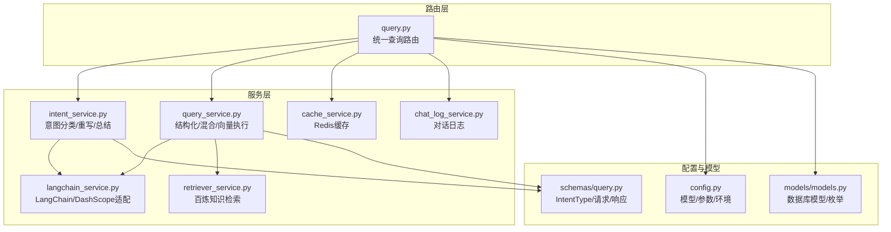
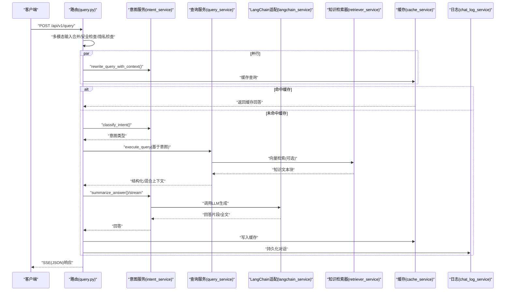
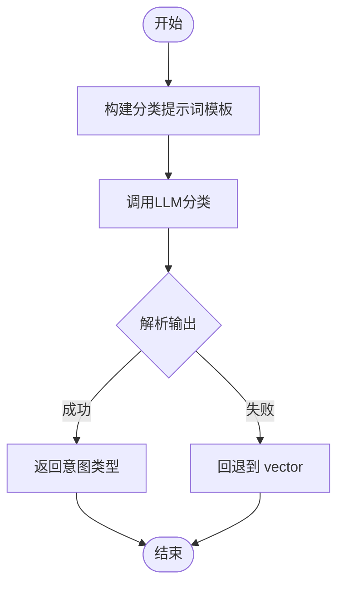
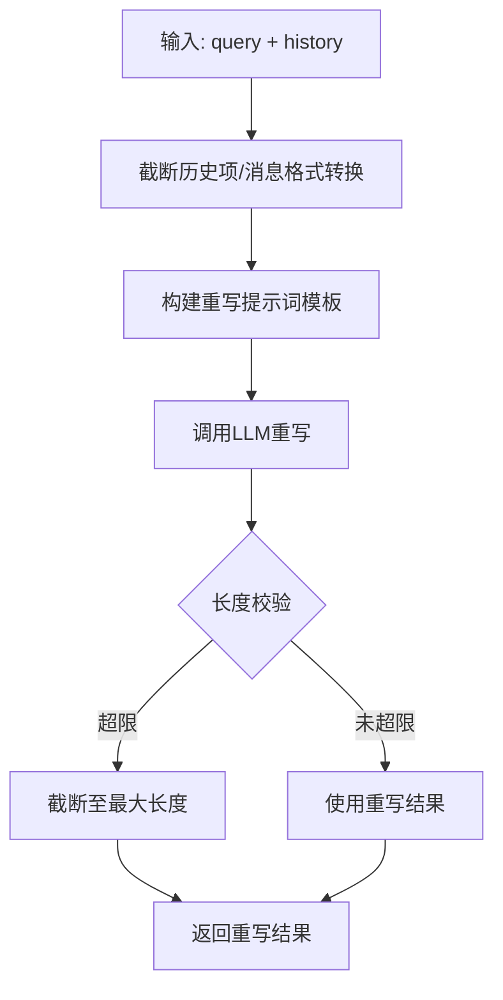
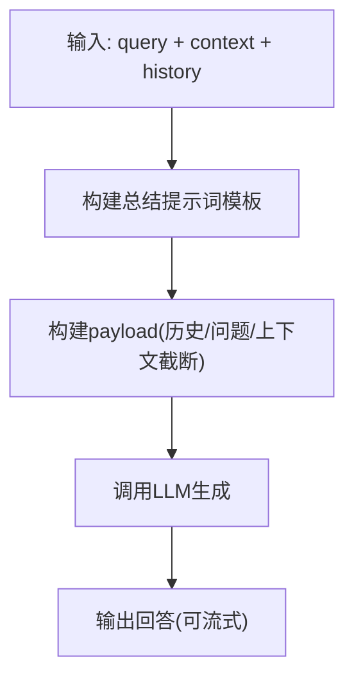
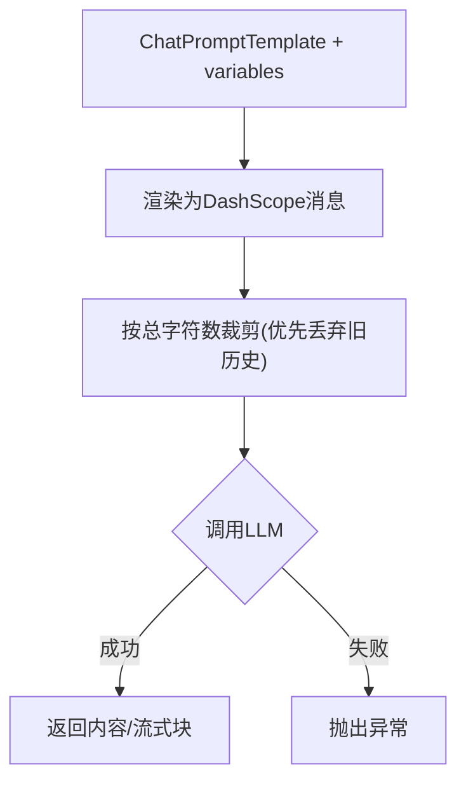
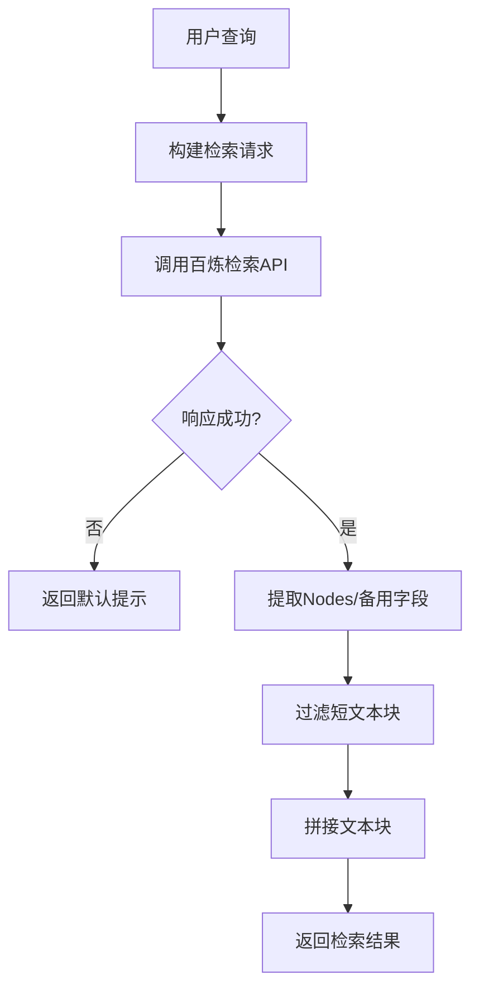
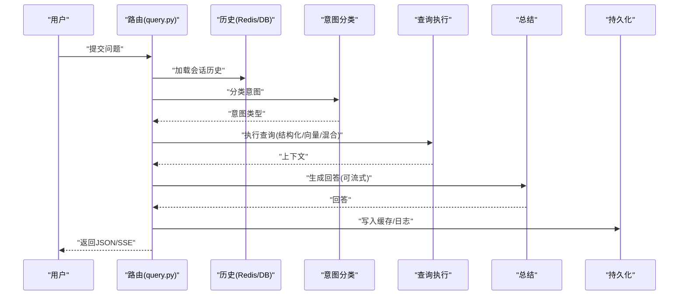
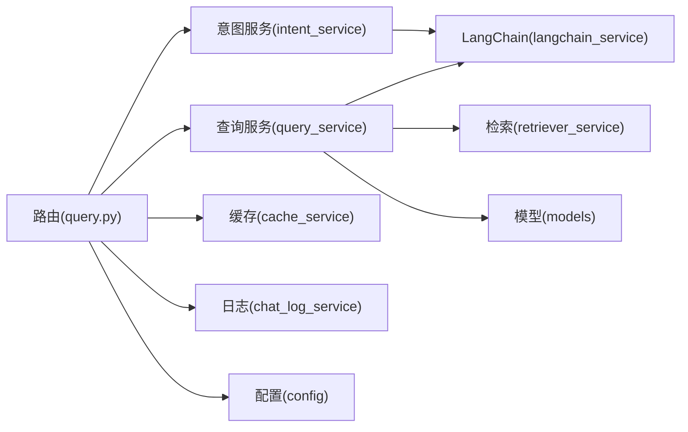

# 意图分类服务

<cite>
**本文档引用的文件**
- [intent_service.py](file://service/ai_assistant/app/services/intent_service.py)
- [query_service.py](file://service/ai_assistant/app/services/query_service.py)
- [langchain_service.py](file://service/ai_assistant/app/services/langchain_service.py)
- [query.py](file://service/ai_assistant/app/routers/query.py)
- [query.py](file://service/ai_assistant/app/schemas/query.py)
- [config.py](file://service/ai_assistant/app/config.py)
- [models.py](file://service/ai_assistant/app/models/models.py)
- [retriever_service.py](file://service/ai_assistant/app/services/retriever_service.py)
- [cache_service.py](file://service/ai_assistant/app/services/cache_service.py)
- [chat_log_service.py](file://service/ai_assistant/app/services/chat_log_service.py)
</cite>

## 目录
1. [简介](#简介)
2. [项目结构](#项目结构)
3. [核心组件](#核心组件)
4. [架构总览](#架构总览)
5. [详细组件分析](#详细组件分析)
6. [依赖分析](#依赖分析)
7. [性能考量](#性能考量)
8. [故障排查指南](#故障排查指南)
9. [结论](#结论)
10. [附录](#附录)

## 简介
本文件面向AI校园助手项目的“意图分类服务”，系统性阐述以下能力：
- 意图类型：structured（结构化查询）、vector（向量检索）、hybrid（混合查询）、smalltalk（闲聊）
- 意图分类算法：基于LangChain提示词模板的分类器构建与鲁棒性回退
- 查询重写机制：结合上下文历史补全缺失信息
- 上下文历史处理：截断策略、消息格式转换与长度限制
- 最终答案总结：自然语言生成规则与流式输出
- 服务调用方式、错误处理策略与性能优化技巧
- 配置参数说明与调试指南

## 项目结构
围绕意图分类服务的关键模块如下：
- 路由层：统一入口负责多模态输入、安全检查、缓存、意图分类、查询执行、总结与持久化
- 服务层：意图分类、查询执行、LangChain适配、知识检索、缓存、对话日志
- 模型与Schema：意图类型枚举、数据库模型与对话日志结构
- 配置：模型与外部服务参数、缓存策略、上下文长度限制

**图表来源**
- [query.py:1-788](file://service/ai_assistant/app/routers/query.py#L1-L788)
- [intent_service.py:1-346](file://service/ai_assistant/app/services/intent_service.py#L1-L346)
- [query_service.py:1-800](file://service/ai_assistant/app/services/query_service.py#L1-L800)
- [langchain_service.py:1-278](file://service/ai_assistant/app/services/langchain_service.py#L1-L278)
- [retriever_service.py:1-168](file://service/ai_assistant/app/services/retriever_service.py#L1-L168)
- [cache_service.py:1-177](file://service/ai_assistant/app/services/cache_service.py#L1-L177)
- [chat_log_service.py:1-76](file://service/ai_assistant/app/services/chat_log_service.py#L1-L76)
- [config.py:1-113](file://service/ai_assistant/app/config.py#L1-L113)
- [query.py:1-33](file://service/ai_assistant/app/schemas/query.py#L1-L33)
- [models.py:625-660](file://service/ai_assistant/app/models/models.py#L625-L660)

**章节来源**
- [query.py:1-788](file://service/ai_assistant/app/routers/query.py#L1-L788)
- [config.py:1-113](file://service/ai_assistant/app/config.py#L1-L113)

## 核心组件
- 意图分类器：基于系统提示词模板，将用户查询映射到structured/vector/hybrid/smalltalk四类之一
- 查询重写器：结合最近N轮历史，将用户最新问题重写为完整、独立的查询句
- 最终答案总结器：在结构化数据与向量上下文基础上，生成自然、合规的人类可读回答
- LangChain适配器：统一消息格式、裁剪输入、调用DashScope模型、支持流式输出
- 知识检索器：对接阿里云百炼检索API，返回可直接用于总结的文本块
- 缓存与历史：基于Redis的会话隔离历史与缓存，保障性能与隐私
- 路由编排：并发执行安全检查与查询重写，按意图路由到对应执行路径

**章节来源**
- [intent_service.py:218-346](file://service/ai_assistant/app/services/intent_service.py#L218-L346)
- [langchain_service.py:139-278](file://service/ai_assistant/app/services/langchain_service.py#L139-L278)
- [retriever_service.py:46-135](file://service/ai_assistant/app/services/retriever_service.py#L46-L135)
- [query.py:198-745](file://service/ai_assistant/app/routers/query.py#L198-L745)

## 架构总览
意图分类服务贯穿“输入→分类→重写→执行→总结→缓存→持久化”的完整链路。

**图表来源**
- [query.py:198-745](file://service/ai_assistant/app/routers/query.py#L198-L745)
- [intent_service.py:218-346](file://service/ai_assistant/app/services/intent_service.py#L218-L346)
- [query_service.py:1-800](file://service/ai_assistant/app/services/query_service.py#L1-L800)
- [langchain_service.py:139-278](file://service/ai_assistant/app/services/langchain_service.py#L139-L278)
- [retriever_service.py:46-135](file://service/ai_assistant/app/services/retriever_service.py#L46-L135)
- [cache_service.py:92-177](file://service/ai_assistant/app/services/cache_service.py#L92-L177)
- [chat_log_service.py:14-76](file://service/ai_assistant/app/services/chat_log_service.py#L14-L76)

## 详细组件分析

### 意图分类器
- 分类目标：将用户查询映射到structured/vector/hybrid/smalltalk之一
- 设计要点：
  - 系统提示词模板明确四类意图的边界与示例
  - 使用LangChain Runnable链路，StrOutputParser解析LLM输出
  - 强鲁棒性：分类失败或解析异常时回退到vector
- 关键实现位置：
  - 分类提示词模板与链路构建
  - 分类主函数与回退策略
  - 温度与最大token限制

**图表来源**
- [intent_service.py:218-248](file://service/ai_assistant/app/services/intent_service.py#L218-L248)

**章节来源**
- [intent_service.py:218-248](file://service/ai_assistant/app/services/intent_service.py#L218-L248)

### 查询重写器
- 目标：结合最近N轮历史，将用户最新问题重写为完整、独立的查询句
- 设计要点：
  - 限定历史轮数（默认最近3轮）
  - 截断与告警：对过长重写结果进行长度限制
  - 保持可读性：直接输出重写结果，不含解释
- 关键实现位置：
  - 重写提示词模板
  - 历史截断与消息格式转换
  - 重写主函数与回退策略

**图表来源**
- [intent_service.py:251-295](file://service/ai_assistant/app/services/intent_service.py#L251-L295)

**章节来源**
- [intent_service.py:251-295](file://service/ai_assistant/app/services/intent_service.py#L251-L295)

### 最终答案总结器
- 目标：在结构化数据与向量上下文基础上，生成自然、合规的人类可读回答
- 设计要点：
  - 系统提示词模板包含严格的回答规范（如不可输出英文字段名、必须使用中文学期格式等）
  - 上下文与历史长度限制：分别对历史项、问题、上下文、整体进行截断
  - 支持流式与非流式两种输出
- 关键实现位置：
  - 总结提示词模板构建
  - 上下文与历史截断策略
  - 总结主函数与流式生成器

**图表来源**
- [intent_service.py:298-346](file://service/ai_assistant/app/services/intent_service.py#L298-L346)

**章节来源**
- [intent_service.py:71-209](file://service/ai_assistant/app/services/intent_service.py#L71-L209)
- [intent_service.py:298-346](file://service/ai_assistant/app/services/intent_service.py#L298-L346)

### LangChain适配器
- 目标：统一消息格式、裁剪输入、调用DashScope模型、支持流式输出
- 设计要点：
  - 消息格式转换：System/Human/AI消息角色映射
  - 输入裁剪：优先丢弃旧历史，再裁剪最后一条，极端情况再裁剪首条
  - 错误处理：状态码非200时抛出异常
  - 流式输出：增量输出块，支持进度日志
- 关键实现位置：
  - 消息构建与裁剪
  - 非流式与流式调用

**图表来源**
- [langchain_service.py:128-203](file://service/ai_assistant/app/services/langchain_service.py#L128-L203)
- [langchain_service.py:206-278](file://service/ai_assistant/app/services/langchain_service.py#L206-L278)

**章节来源**
- [langchain_service.py:128-203](file://service/ai_assistant/app/services/langchain_service.py#L128-L203)
- [langchain_service.py:206-278](file://service/ai_assistant/app/services/langchain_service.py#L206-L278)

### 知识检索器
- 目标：对接阿里云百炼检索API，返回可直接用于总结的文本块
- 设计要点：
  - 请求参数：稠密/稀疏相似度TopK、重排模型与阈值
  - 响应规范化：优先Nodes结构，回退旧逻辑
  - 过滤短文本块（最小长度阈值）
- 关键实现位置：
  - 检索请求与响应处理
  - 文本块提取与拼接

**图表来源**
- [retriever_service.py:46-135](file://service/ai_assistant/app/services/retriever_service.py#L46-L135)

**章节来源**
- [retriever_service.py:46-135](file://service/ai_assistant/app/services/retriever_service.py#L46-L135)

### 路由编排与上下文历史
- 目标：统一入口处理多模态输入、安全检查、缓存、意图分类、查询执行、总结与持久化
- 设计要点：
  - 并发执行：安全检查与查询重写
  - 会话隔离：Redis按DID+会话ID存储历史，避免并发串话
  - 意图修正：根据执行后上下文动态调整意图（如vector→structured或hybrid）
  - 小聊屏蔽：smalltalk意图不对外暴露
- 关键实现位置：
  - 多模态输入合并与图片/音频处理
  - 历史加载与会话历史写入
  - 意图分类与修正
  - JSON与SSE两种输出

**图表来源**
- [query.py:198-745](file://service/ai_assistant/app/routers/query.py#L198-L745)

**章节来源**
- [query.py:198-745](file://service/ai_assistant/app/routers/query.py#L198-L745)

## 依赖分析
- 组件耦合：
  - 路由层依赖意图服务、查询服务、缓存与日志服务
  - 意图与查询服务依赖LangChain适配器与知识检索器
  - 查询服务依赖数据库模型与枚举
- 外部依赖：
  - DashScope（LLM推理）
  - 百炼检索API（向量检索）
  - Redis（缓存与会话历史）
  - MySQL（对话日志与结构化数据）

**图表来源**
- [query.py:1-788](file://service/ai_assistant/app/routers/query.py#L1-L788)
- [intent_service.py:1-346](file://service/ai_assistant/app/services/intent_service.py#L1-L346)
- [query_service.py:1-800](file://service/ai_assistant/app/services/query_service.py#L1-L800)
- [langchain_service.py:1-278](file://service/ai_assistant/app/services/langchain_service.py#L1-L278)
- [retriever_service.py:1-168](file://service/ai_assistant/app/services/retriever_service.py#L1-L168)
- [cache_service.py:1-177](file://service/ai_assistant/app/services/cache_service.py#L1-L177)
- [chat_log_service.py:1-76](file://service/ai_assistant/app/services/chat_log_service.py#L1-L76)
- [config.py:1-113](file://service/ai_assistant/app/config.py#L1-L113)
- [models.py:625-660](file://service/ai_assistant/app/models/models.py#L625-L660)

**章节来源**
- [query.py:1-788](file://service/ai_assistant/app/routers/query.py#L1-L788)
- [config.py:1-113](file://service/ai_assistant/app/config.py#L1-L113)

## 性能考量
- 并发优化：
  - 路由层并发执行安全检查与查询重写，缩短端到端延迟
- 输入裁剪：
  - LangChain适配器按总字符上限裁剪消息，优先丢弃旧历史，避免超限
- 缓存策略：
  - 基于DID+查询哈希的Redis缓存，区分敏感与普通查询TTL
  - 课表相关查询支持版本号失效，管理员改课后主动刷新
- 输出控制：
  - 总结器对历史、问题、上下文分别设置长度上限，必要时采用中间截断保留头尾
- 模型参数：
  - 分类与重写使用低温度与较小max_tokens，提高稳定性与可控性
  - 最终回答生成适度提高温度与较大max_tokens，提升创造性

[本节为通用性能指导，不直接分析具体文件]

## 故障排查指南
- 意图分类失败：
  - 现象：分类异常或解析不确定，回退到vector
  - 排查：查看LLM调用日志与异常栈，确认模型参数与输入长度
  - 参考位置：[intent_service.py:233-248](file://service/ai_assistant/app/services/intent_service.py#L233-L248)
- 查询重写失败：
  - 现象：重写异常，回退到原始查询
  - 排查：检查历史消息格式与长度限制，确认模型可用性
  - 参考位置：[intent_service.py:289-295](file://service/ai_assistant/app/services/intent_service.py#L289-L295)
- LLM调用失败：
  - 现象：状态码非200，抛出运行时错误
  - 排查：检查API Key、代理配置、模型名称与输入长度
  - 参考位置：[langchain_service.py:189-203](file://service/ai_assistant/app/services/langchain_service.py#L189-L203)
- 缓存异常：
  - 现象：Redis不可用或键解析失败
  - 排查：确认Redis连接、键格式与TTL设置
  - 参考位置：[cache_service.py:92-177](file://service/ai_assistant/app/services/cache_service.py#L92-L177)
- 意图修正异常：
  - 现象：执行后上下文与预期不符导致意图修正
  - 排查：检查查询执行返回的上下文标识（结构化/向量）
  - 参考位置：[query.py:551-573](file://service/ai_assistant/app/routers/query.py#L551-L573)

**章节来源**
- [intent_service.py:233-248](file://service/ai_assistant/app/services/intent_service.py#L233-L248)
- [intent_service.py:289-295](file://service/ai_assistant/app/services/intent_service.py#L289-L295)
- [langchain_service.py:189-203](file://service/ai_assistant/app/services/langchain_service.py#L189-L203)
- [cache_service.py:92-177](file://service/ai_assistant/app/services/cache_service.py#L92-L177)
- [query.py:551-573](file://service/ai_assistant/app/routers/query.py#L551-L573)

## 结论
意图分类服务通过“提示词模板+LangChain链路+外部模型调用”的组合，实现了稳定可靠的意图识别与查询重写；配合严格的上下文截断、会话隔离历史与缓存策略，兼顾了性能与隐私；最终的答案总结器在结构化数据与向量上下文之上，遵循严格的自然语言生成规范，确保回答质量与合规性。整体设计具备良好的扩展性与可维护性。

[本节为总结性内容，不直接分析具体文件]

## 附录

### 服务配置参数说明
- 模型配置（config.py）
  - LLM_MODEL_INTENT_CLASSIFY：意图分类模型
  - LLM_MODEL_QUERY_REWRITE：查询重写模型
  - LLM_MODEL_FINAL_ANSWER：最终回答生成模型
  - LLM_MODEL_TOOL_PLANNER：工具规划模型
  - LLM_MODEL_VECTOR_DECOMPOSE：向量检索query拆解模型
  - LLM_MODEL_HYBRID_RERANK：混合检索重排模型
  - LLM_MODEL_SAFETY_CHECK：安全检测模型
  - LLM_MODEL_IMAGE_UNDERSTANDING：图像理解模型
  - LLM_MODEL_SPEECH_RECOGNITION：语音识别模型
- DashScope与百炼配置
  - ALI_API_KEY、DASHSCOPE_TRUST_ENV_PROXY、DASHSCOPE_MAX_INPUT_CHARS
  - BAILIAN_WORKSPACE_ID、BAILIAN_INDEX_ID、ALIBABA_CLOUD_ACCESS_KEY_ID、ALIBABA_CLOUD_ACCESS_KEY_SECRET
- 缓存与历史
  - CACHE_TTL_SENSITIVE/CACHE_TTL_NORMAL：敏感/普通查询TTL
  - MAX_HISTORY_COUNT：最大历史轮数

**章节来源**
- [config.py:48-84](file://service/ai_assistant/app/config.py#L48-L84)

### 服务调用方式与示例路径
- 路由端点：POST /api/v1/query
  - JSON输出：response_model=QueryResponse
  - 流式输出：SSE，chunk增量返回
  - 示例路径：[query.py:198-745](file://service/ai_assistant/app/routers/query.py#L198-L745)
- 意图分类：classify_intent(query)
  - 示例路径：[intent_service.py:218-248](file://service/ai_assistant/app/services/intent_service.py#L218-L248)
- 查询重写：rewrite_query_with_context(query, history)
  - 示例路径：[intent_service.py:251-295](file://service/ai_assistant/app/services/intent_service.py#L251-L295)
- 最终总结：summarize_answer(query, context, history)
  - 示例路径：[intent_service.py:298-323](file://service/ai_assistant/app/services/intent_service.py#L298-L323)
- 流式总结：summarize_answer_stream(query, context, history)
  - 示例路径：[intent_service.py:326-346](file://service/ai_assistant/app/services/intent_service.py#L326-L346)

**章节来源**
- [query.py:198-745](file://service/ai_assistant/app/routers/query.py#L198-L745)
- [intent_service.py:218-346](file://service/ai_assistant/app/services/intent_service.py#L218-L346)

### 上下文历史处理细节
- 历史截断策略：
  - 限制历史轮数（默认6轮）
  - 历史项、问题、上下文分别设置字符上限
  - 采用“尾部截断”与“中间截断（保留头尾）”策略
- 消息格式转换：
  - 将ChatLog转换为LangChain消息格式（human/ai/system）
- 长度限制机制：
  - 历史项字符上限、问题字符上限、上下文字符上限、整体字符上限
  - 超限时记录告警日志

**章节来源**
- [intent_service.py:104-209](file://service/ai_assistant/app/services/intent_service.py#L104-L209)

### 查询重写与意图修正流程
- 查询重写：
  - 结合最近3轮历史，将用户最新问题重写为完整、独立的查询句
  - 对过长重写结果进行长度限制
- 意图修正：
  - 执行后根据上下文标识（结构化/向量）动态调整意图
  - smalltalk意图不对外暴露

**章节来源**
- [intent_service.py:251-295](file://service/ai_assistant/app/services/intent_service.py#L251-L295)
- [query.py:551-573](file://service/ai_assistant/app/routers/query.py#L551-L573)

### 自然语言生成规则摘要
- 严格禁止输出英文字段名、内部过程说明、技术术语
- 学期必须使用中文可读格式
- 课表回答必须包含时间、地点、教师，严禁只列课程名
- 周次判定以结构化数据为准，不得自行推断
- 涉及联系方式时，按规则提供或提示合规建议

**章节来源**
- [intent_service.py:71-101](file://service/ai_assistant/app/services/intent_service.py#L71-L101)