# 服务层架构

<cite>
**本文档引用的文件**
- [main.py](file://service/ai_assistant/app/main.py)
- [dependencies.py](file://service/ai_assistant/app/dependencies.py)
- [config.py](file://service/ai_assistant/app/config.py)
- [models.py](file://service/ai_assistant/app/models/models.py)
- [auth.py](file://service/ai_assistant/app/routers/auth.py)
- [query.py](file://service/ai_assistant/app/routers/query.py)
- [auth_service.py](file://service/ai_assistant/app/services/auth_service.py)
- [intent_service.py](file://service/ai_assistant/app/services/intent_service.py)
- [query_service.py](file://service/ai_assistant/app/services/query_service.py)
- [cache_service.py](file://service/ai_assistant/app/services/cache_service.py)
- [media_service.py](file://service/ai_assistant/app/services/media_service.py)
- [safety_service.py](file://service/ai_assistant/app/services/safety_service.py)
- [langchain_service.py](file://service/ai_assistant/app/services/langchain_service.py)
- [retriever_service.py](file://service/ai_assistant/app/services/retriever_service.py)
- [chat_log_service.py](file://service/ai_assistant/app/services/chat_log_service.py)
</cite>

## 目录
1. [简介](#简介)
2. [项目结构](#项目结构)
3. [核心组件](#核心组件)
4. [架构总览](#架构总览)
5. [详细组件分析](#详细组件分析)
6. [依赖分析](#依赖分析)
7. [性能考虑](#性能考虑)
8. [故障排查指南](#故障排查指南)
9. [结论](#结论)
10. [附录](#附录)

## 简介
本文件面向“AI校园助手”项目的后端服务层，系统化梳理服务层的分层设计、接口定义、业务逻辑封装与依赖注入机制。重点覆盖以下核心服务模块：
- 意图分类服务：识别用户查询类型（结构化/向量/混合/闲聊）
- 查询执行服务：SQL结构化查询、知识库向量检索、混合检索与重排
- 缓存服务：基于Redis的查询缓存与敏感度控制
- 媒体处理服务：图像与音频的多模态转文本
- 安全服务：内容危险性检测与隐私保护
- LangChain服务：统一的提示模板渲染与DashScope调用适配
- 知识检索服务：阿里云百炼检索API封装
- 认证与会话服务：JWT签发与校验、密码变更、会话历史
- 日志与审计：对话日志与系统动作记录

文档同时阐述服务间的协作关系与数据流转，异步调用模式与错误处理策略，并提供测试策略与监控指标建议。

## 项目结构
服务层位于FastAPI应用中，采用“路由-服务-工具”的分层组织：
- 路由层：定义REST接口，接收请求并协调各服务
- 服务层：封装业务逻辑，组合底层能力（数据库、缓存、外部模型）
- 工具层：配置、依赖注入、日志与隐私工具
- 模型层：SQLAlchemy ORM模型，定义数据结构与关系

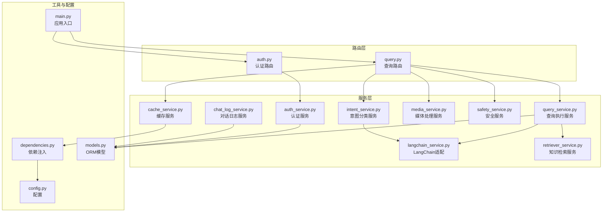

图表来源
- [main.py:1-86](file://service/ai_assistant/app/main.py#L1-L86)
- [dependencies.py:1-109](file://service/ai_assistant/app/dependencies.py#L1-L109)
- [config.py:1-113](file://service/ai_assistant/app/config.py#L1-L113)
- [models.py:1-660](file://service/ai_assistant/app/models/models.py#L1-L660)
- [auth.py:1-102](file://service/ai_assistant/app/routers/auth.py#L1-L102)
- [query.py:1-788](file://service/ai_assistant/app/routers/query.py#L1-L788)
- [auth_service.py:1-253](file://service/ai_assistant/app/services/auth_service.py#L1-L253)
- [intent_service.py:1-346](file://service/ai_assistant/app/services/intent_service.py#L1-L346)
- [query_service.py:1-800](file://service/ai_assistant/app/services/query_service.py#L1-L800)
- [cache_service.py:1-177](file://service/ai_assistant/app/services/cache_service.py#L1-L177)
- [media_service.py:1-246](file://service/ai_assistant/app/services/media_service.py#L1-L246)
- [safety_service.py:1-163](file://service/ai_assistant/app/services/safety_service.py#L1-L163)
- [langchain_service.py:1-278](file://service/ai_assistant/app/services/langchain_service.py#L1-L278)
- [retriever_service.py:1-168](file://service/ai_assistant/app/services/retriever_service.py#L1-L168)
- [chat_log_service.py:1-76](file://service/ai_assistant/app/services/chat_log_service.py#L1-L76)

章节来源
- [main.py:1-86](file://service/ai_assistant/app/main.py#L1-L86)
- [dependencies.py:1-109](file://service/ai_assistant/app/dependencies.py#L1-L109)
- [config.py:1-113](file://service/ai_assistant/app/config.py#L1-L113)
- [models.py:1-660](file://service/ai_assistant/app/models/models.py#L1-L660)

## 核心组件
本节聚焦服务层的关键模块及其职责与实现要点。

- 意图分类服务
  - 职责：将用户查询分类为structured/vector/hybrid/smalltalk；提供查询重写与最终回答总结
  - 关键实现：LangChain提示模板、链式调用、温度与最大token控制、历史截断与上下文拼装
  - 依赖：LangChain适配器、配置项、日志

- 查询执行服务
  - 职责：结构化SQL查询（成绩、课表、个人信息、选课、学术概览）、知识库向量检索、混合检索与重排
  - 关键实现：SQLAlchemy异步查询、学期ID解析与推断、周次与课表统计、字段名中文化、LangChain工具规划
  - 依赖：数据库会话、LangChain适配器、百炼检索器

- 缓存服务
  - 职责：基于Redis的查询缓存，按敏感度设定TTL，支持日期敏感与课表版本失效
  - 关键实现：MD5键生成、元数据写入、跨天与版本校验、敏感词检测
  - 依赖：配置项、Redis客户端

- 媒体处理服务
  - 职责：图像理解（QwenVL）、语音识别（ASR），图像尺寸与体积优化，音频转WAV
  - 关键实现：DashScope多模态与ASR调用、ffmpeg音频转换、错误处理与降级
  - 依赖：配置项、第三方SDK

- 安全服务
  - 职责：危险内容检测（自杀/暴力倾向）、公共服务联系方式查询放行、隐私违规检测（禁止查询他人学号）
  - 关键实现：LLM结构化输出解析、正则回退、关键词匹配
  - 依赖：配置项、DashScope Generation

- LangChain服务
  - 职责：统一提示模板渲染、消息格式转换、DashScope调用与流式输出
  - 关键实现：消息裁剪、会话构建、异步调用、流式分块
  - 依赖：配置项、requests会话

- 知识检索服务
  - 职责：阿里云百炼检索API封装，返回规范化文本块
  - 关键实现：客户端懒加载、请求构建、响应解析与回退
  - 依赖：配置项、SDK

- 认证与会话服务
  - 职责：JWT签发与校验、密码变更、当前用户与管理员依赖注入
  - 关键实现：JWT负载、角色校验、密码哈希验证、AES解密
  - 依赖：配置项、数据库会话

- 对话日志服务
  - 职责：保存对话记录，隐私脱敏（DID），会话历史管理
  - 关键实现：DID生成、历史加载与追加、系统动作标记
  - 依赖：模型、隐私工具

章节来源
- [intent_service.py:1-346](file://service/ai_assistant/app/services/intent_service.py#L1-L346)
- [query_service.py:1-800](file://service/ai_assistant/app/services/query_service.py#L1-L800)
- [cache_service.py:1-177](file://service/ai_assistant/app/services/cache_service.py#L1-L177)
- [media_service.py:1-246](file://service/ai_assistant/app/services/media_service.py#L1-L246)
- [safety_service.py:1-163](file://service/ai_assistant/app/services/safety_service.py#L1-L163)
- [langchain_service.py:1-278](file://service/ai_assistant/app/services/langchain_service.py#L1-L278)
- [retriever_service.py:1-168](file://service/ai_assistant/app/services/retriever_service.py#L1-L168)
- [auth_service.py:1-253](file://service/ai_assistant/app/services/auth_service.py#L1-L253)
- [chat_log_service.py:1-76](file://service/ai_assistant/app/services/chat_log_service.py#L1-L76)

## 架构总览
服务层围绕“查询路由”展开，形成如下典型流程：
- 输入预处理：多模态转文本、统一查询文本构建
- 缓存命中：优先返回缓存，避免重复计算
- 上下文准备：会话隔离历史加载
- 并发执行：安全检查、隐私检查、查询重写
- 意图分类：基于重写后的查询
- 查询执行：SQL/向量/混合
- 回答总结：LangChain总结与流式输出
- 缓存与日志：写入缓存与对话日志

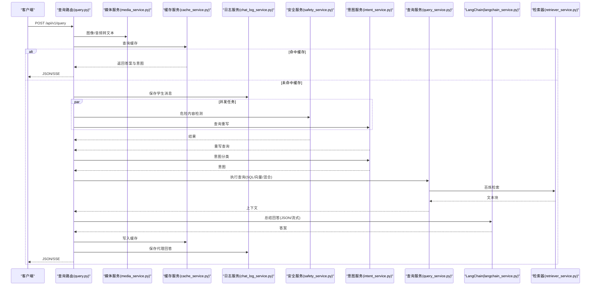

图表来源
- [query.py:198-745](file://service/ai_assistant/app/routers/query.py#L198-L745)
- [media_service.py:115-246](file://service/ai_assistant/app/services/media_service.py#L115-L246)
- [cache_service.py:92-177](file://service/ai_assistant/app/services/cache_service.py#L92-L177)
- [chat_log_service.py:14-76](file://service/ai_assistant/app/services/chat_log_service.py#L14-L76)
- [safety_service.py:84-163](file://service/ai_assistant/app/services/safety_service.py#L84-L163)
- [intent_service.py:218-346](file://service/ai_assistant/app/services/intent_service.py#L218-L346)
- [query_service.py:575-800](file://service/ai_assistant/app/services/query_service.py#L575-L800)
- [langchain_service.py:139-278](file://service/ai_assistant/app/services/langchain_service.py#L139-L278)
- [retriever_service.py:46-168](file://service/ai_assistant/app/services/retriever_service.py#L46-L168)

## 详细组件分析

### 意图分类服务
- 设计要点
  - 使用LangChain链式调用与提示模板，分别完成意图分类、查询重写与最终总结
  - 历史消息截断与上下文拼装，保障LLM输入长度与质量
  - 失败回退策略：分类失败回退为向量、重写失败回退原查询
- 关键流程

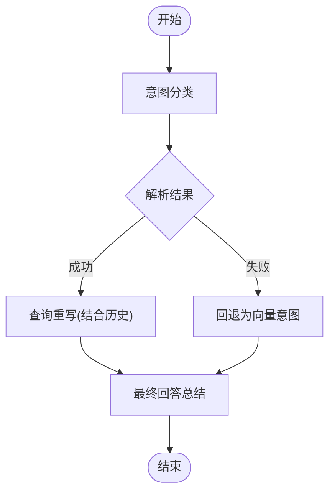

图表来源
- [intent_service.py:218-346](file://service/ai_assistant/app/services/intent_service.py#L218-L346)

章节来源
- [intent_service.py:1-346](file://service/ai_assistant/app/services/intent_service.py#L1-L346)

### 查询执行服务
- 设计要点
  - 支持结构化查询（SQL）、向量检索、混合检索与重排
  - 学期ID解析与推断、周次统计、字段名中文化、课表状态处理
  - LangChain工具规划与去重重排，提升检索质量
- 关键流程

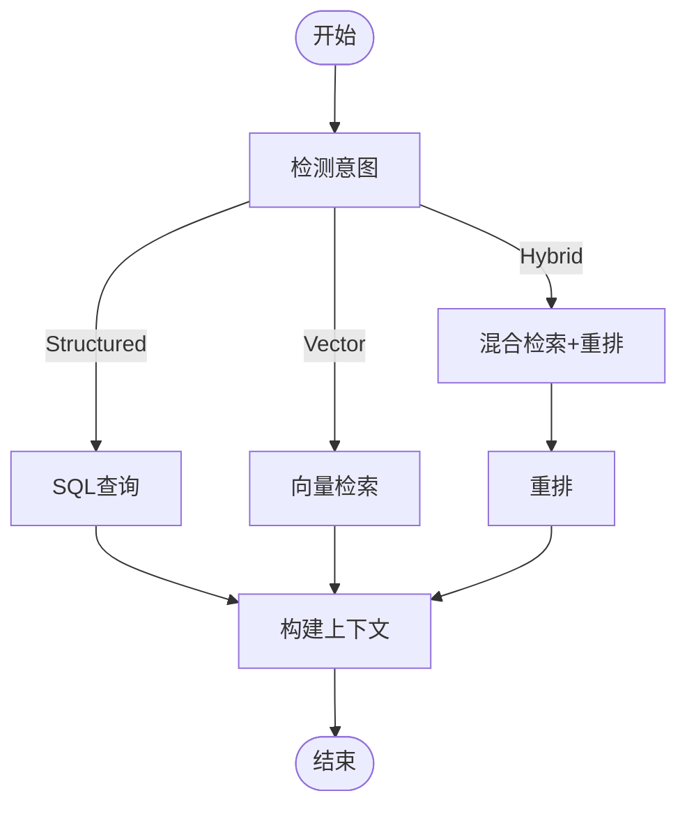

图表来源
- [query_service.py:575-800](file://service/ai_assistant/app/services/query_service.py#L575-L800)
- [retriever_service.py:46-168](file://service/ai_assistant/app/services/retriever_service.py#L46-L168)

章节来源
- [query_service.py:1-800](file://service/ai_assistant/app/services/query_service.py#L1-L800)
- [retriever_service.py:1-168](file://service/ai_assistant/app/services/retriever_service.py#L1-L168)

### 缓存服务
- 设计要点
  - 基于Redis的键空间隔离（DID+查询哈希），按敏感度设置TTL
  - 日期敏感与课表版本失效，避免过期语义与脏数据
  - 元数据写入与校验，异常时自动清理
- 关键流程

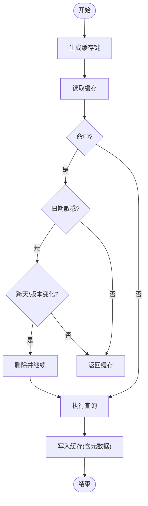

图表来源
- [cache_service.py:92-177](file://service/ai_assistant/app/services/cache_service.py#L92-L177)

章节来源
- [cache_service.py:1-177](file://service/ai_assistant/app/services/cache_service.py#L1-L177)

### 媒体处理服务
- 设计要点
  - 图像：尺寸与体积优化，JPEG压缩，DashScope多模态调用
  - 音频：ffmpeg转WAV（16kHz/单声道），ASR识别，静音检测与错误处理
- 关键流程

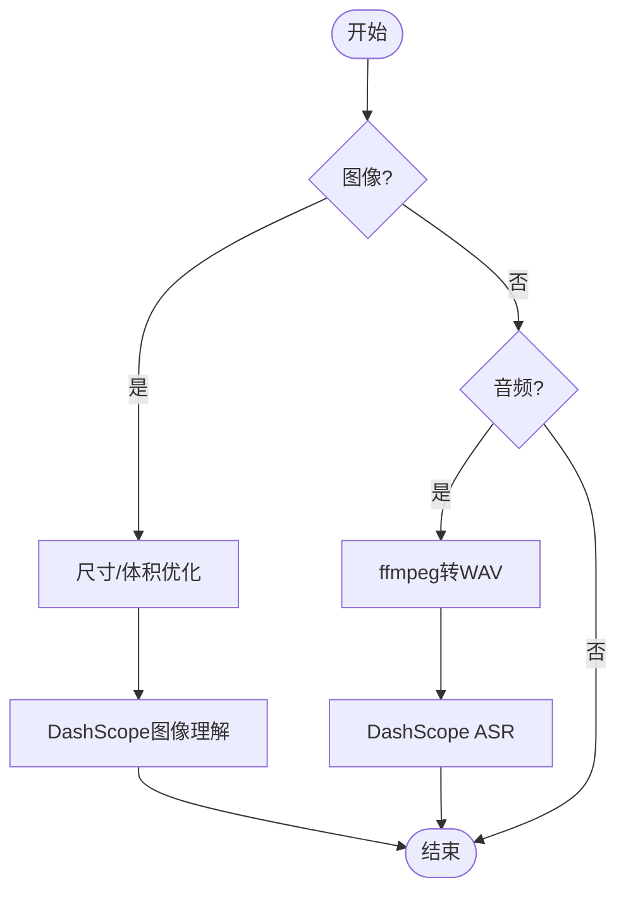

图表来源
- [media_service.py:115-246](file://service/ai_assistant/app/services/media_service.py#L115-L246)

章节来源
- [media_service.py:1-246](file://service/ai_assistant/app/services/media_service.py#L1-L246)

### 安全服务
- 设计要点
  - LLM结构化输出解析，正则回退与异常降级
  - 公共服务联系方式放行，隐私违规检测（禁止查询他人学号）
- 关键流程

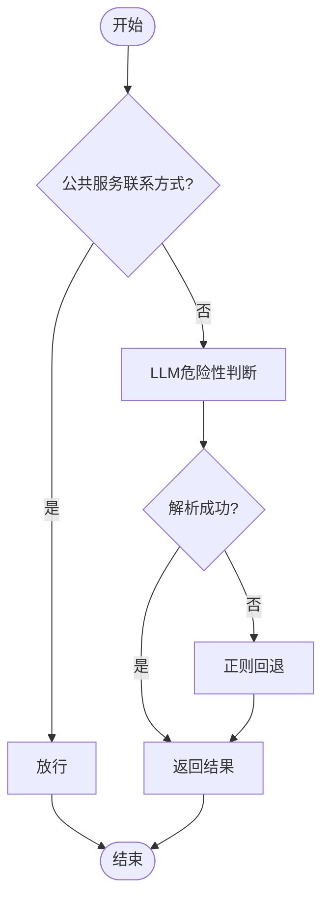

图表来源
- [safety_service.py:84-163](file://service/ai_assistant/app/services/safety_service.py#L84-L163)

章节来源
- [safety_service.py:1-163](file://service/ai_assistant/app/services/safety_service.py#L1-L163)

### LangChain服务
- 设计要点
  - 提示模板渲染与消息格式转换，输入长度裁剪
  - DashScope调用与流式输出，增量块与进度日志
- 关键流程

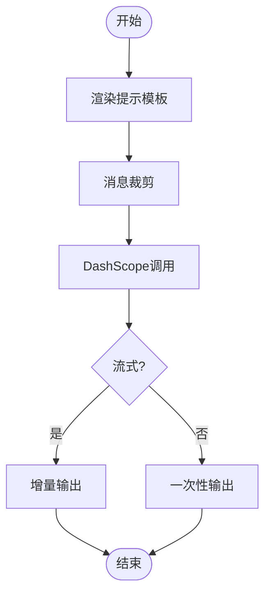

图表来源
- [langchain_service.py:139-278](file://service/ai_assistant/app/services/langchain_service.py#L139-L278)

章节来源
- [langchain_service.py:1-278](file://service/ai_assistant/app/services/langchain_service.py#L1-L278)

### 知识检索服务
- 设计要点
  - 客户端懒加载，请求构建与响应解析
  - 多种响应结构兼容与最小块长度过滤
- 关键流程

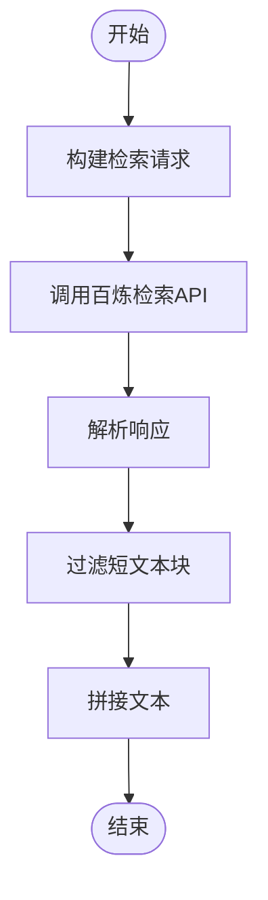

图表来源
- [retriever_service.py:46-168](file://service/ai_assistant/app/services/retriever_service.py#L46-L168)

章节来源
- [retriever_service.py:1-168](file://service/ai_assistant/app/services/retriever_service.py#L1-L168)

### 认证与会话服务
- 设计要点
  - JWT签发与校验，角色与过期时间控制
  - 密码变更流程与错误分类
  - 依赖注入：数据库会话、Redis客户端、当前用户与管理员
- 关键流程

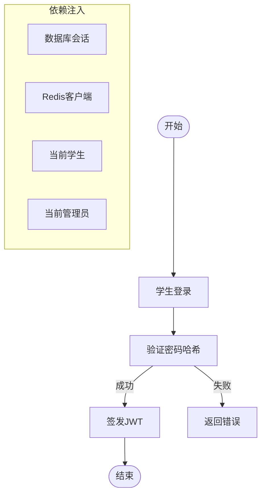

图表来源
- [auth_service.py:125-253](file://service/ai_assistant/app/services/auth_service.py#L125-L253)
- [dependencies.py:27-109](file://service/ai_assistant/app/dependencies.py#L27-L109)

章节来源
- [auth_service.py:1-253](file://service/ai_assistant/app/services/auth_service.py#L1-L253)
- [dependencies.py:1-109](file://service/ai_assistant/app/dependencies.py#L1-L109)

### 对话日志服务
- 设计要点
  - DID脱敏存储，危险消息保留原始学号
  - 会话历史加载与追加，Redis隔离与DB回退
- 关键流程

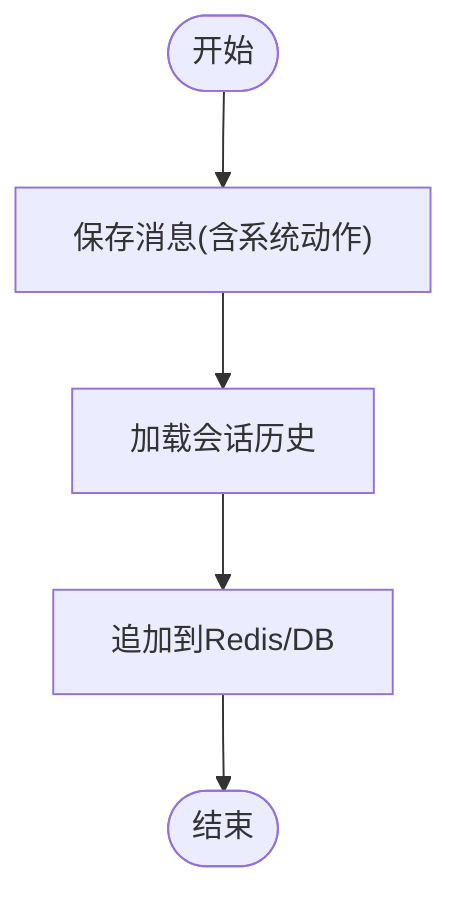

图表来源
- [chat_log_service.py:14-76](file://service/ai_assistant/app/services/chat_log_service.py#L14-L76)

章节来源
- [chat_log_service.py:1-76](file://service/ai_assistant/app/services/chat_log_service.py#L1-L76)

## 依赖分析
- 依赖注入
  - 数据库会话：异步上下文管理，路由中按需注入
  - Redis客户端：单例懒加载，全局共享
  - 当前用户与管理员：Bearer Token解码，路由依赖
- 配置管理
  - Settings集中管理数据库、Redis、JWT、DashScope、百炼、模型与缓存TTL
- 服务间耦合
  - 路由层聚合服务，服务层内聚业务逻辑
  - LangChain适配器作为统一外部调用入口，降低供应商绑定
  - 缓存与日志贯穿主要流程，提升可用性与可观测性

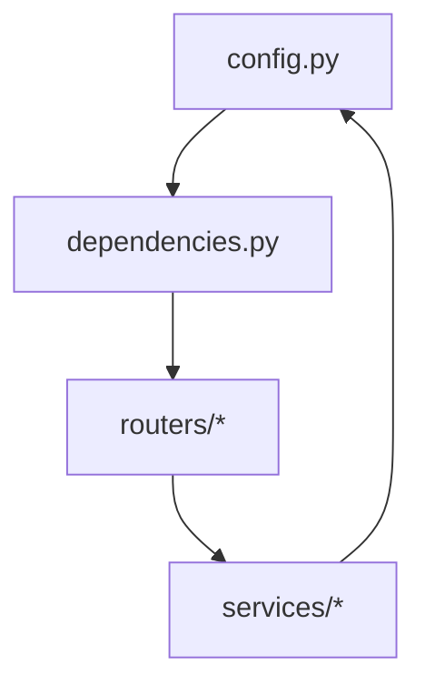

图表来源
- [config.py:1-113](file://service/ai_assistant/app/config.py#L1-L113)
- [dependencies.py:1-109](file://service/ai_assistant/app/dependencies.py#L1-L109)
- [query.py:1-788](file://service/ai_assistant/app/routers/query.py#L1-L788)
- [auth.py:1-102](file://service/ai_assistant/app/routers/auth.py#L1-L102)

章节来源
- [config.py:1-113](file://service/ai_assistant/app/config.py#L1-L113)
- [dependencies.py:1-109](file://service/ai_assistant/app/dependencies.py#L1-L109)
- [query.py:1-788](file://service/ai_assistant/app/routers/query.py#L1-L788)
- [auth.py:1-102](file://service/ai_assistant/app/routers/auth.py#L1-L102)

## 性能考虑
- 异步与并发
  - 多任务并发：安全检查、查询重写并行，缩短端到端延迟
  - 流式输出：LangChain总结与SSE，降低首字节延迟
  - 数据库连接池：尽快回滚，避免长事务占用连接
- 缓存策略
  - 敏感查询短TTL，普通查询长TTL；日期敏感与课表版本失效
  - 键空间隔离与元数据写入，避免脏读
- 输入裁剪与截断
  - LangChain消息裁剪与提示截断，控制成本与长度
- I/O优化
  - 媒体处理前图像压缩与音频转码，减少API负载
- 监控与告警
  - 关键指标：请求延迟、缓存命中率、错误率、LLM调用耗时、Redis命中/失效事件

## 故障排查指南
- 常见问题与定位
  - 缓存异常：Redis连接失败时自动降级，检查连接URL与凭据
  - LLM调用失败：查看DashScope状态码与消息，检查API Key与模型配置
  - 媒体处理失败：图像/音频体积过大或格式不支持，检查ffmpeg与SDK版本
  - 安全检测异常：LLM输出格式不符时回退正则，确认提示模板与模型能力
  - 查询执行异常：SQL语法或权限问题，检查数据库连接与权限
- 日志与审计
  - 路由层记录请求与响应元数据，服务层记录关键步骤与异常
  - 危险消息与隐私违规记录系统动作，便于审计与干预

章节来源
- [query.py:280-745](file://service/ai_assistant/app/routers/query.py#L280-L745)
- [langchain_service.py:139-278](file://service/ai_assistant/app/services/langchain_service.py#L139-L278)
- [media_service.py:115-246](file://service/ai_assistant/app/services/media_service.py#L115-L246)
- [safety_service.py:84-163](file://service/ai_assistant/app/services/safety_service.py#L84-L163)
- [cache_service.py:92-177](file://service/ai_assistant/app/services/cache_service.py#L92-L177)

## 结论
本服务层通过清晰的分层设计与依赖注入，实现了意图识别、查询执行、缓存、媒体处理、安全与日志等核心能力的模块化与可扩展。路由层统一编排，服务层专注业务，工具层提供支撑，整体具备良好的可维护性、可测试性与可扩展性。建议持续完善监控指标与自动化测试，保障生产环境稳定运行。

## 附录
- 服务测试策略
  - 单元测试：针对服务函数（如意图分类、查询执行、缓存读写）编写独立测试
  - 集成测试：模拟路由调用，覆盖多模态输入、并发任务与错误分支
  - 性能测试：缓存命中率、流式输出延迟、LLM调用吞吐
- 监控指标设计
  - 请求级：QPS、P95/P99延迟、错误率、缓存命中率
  - 服务级：LLM调用次数与耗时、Redis读写耗时、数据库查询耗时
  - 业务级：危险内容拦截率、隐私违规阻断率、会话历史加载成功率