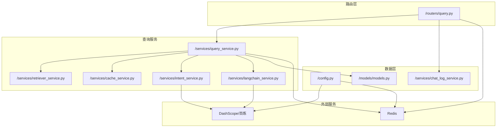
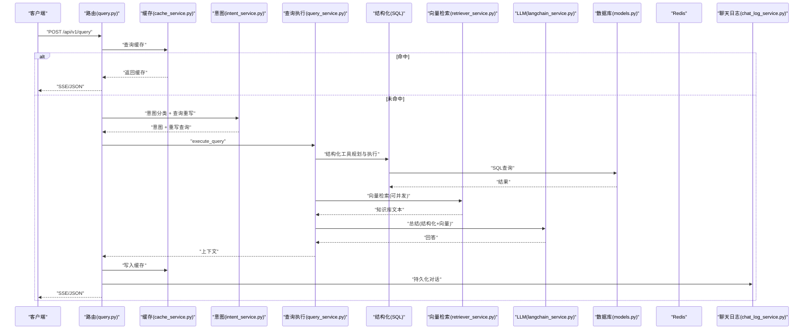
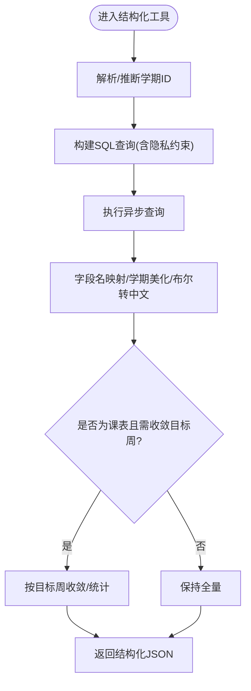
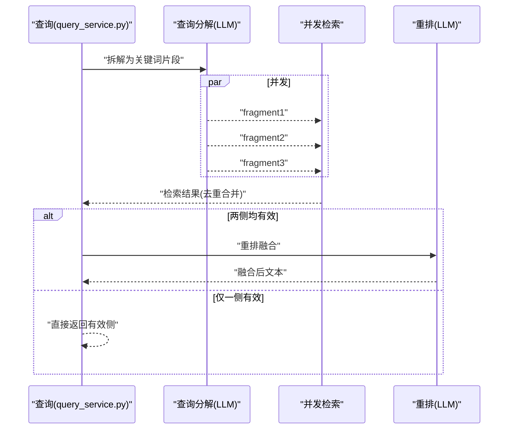
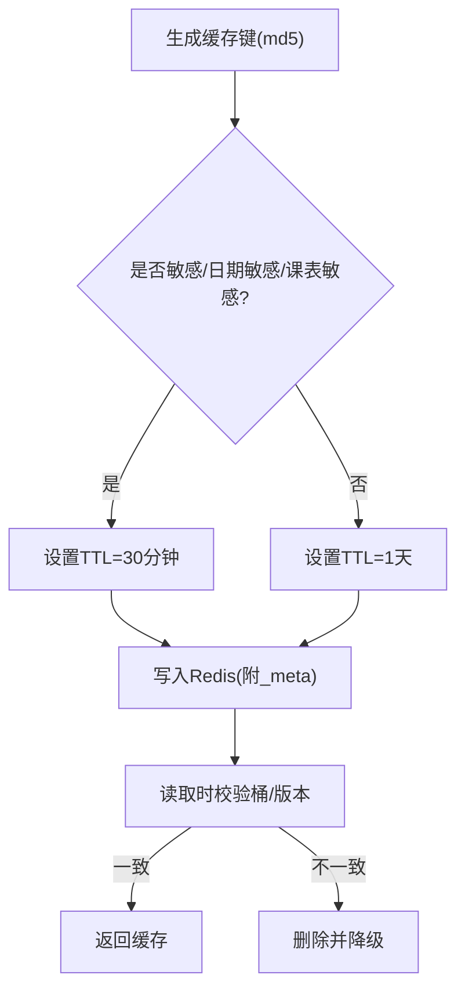
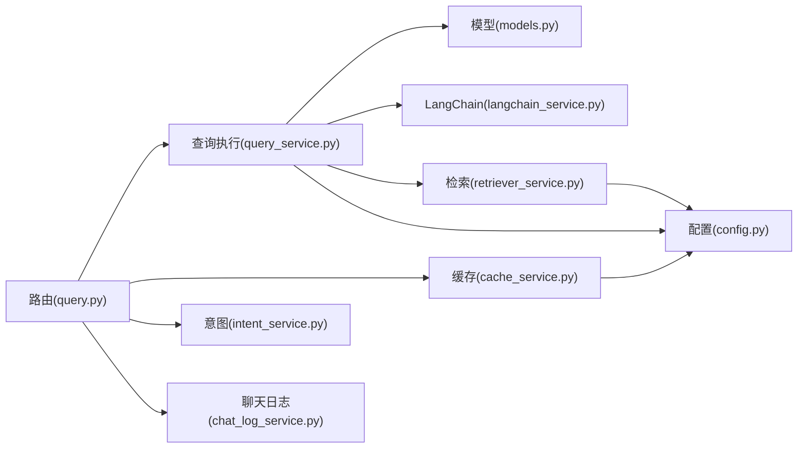

# 查询执行服务

<cite>
**本文档引用的文件**
- [query_service.py](file://service/ai_assistant/app/services/query_service.py)
- [query.py](file://service/ai_assistant/app/routers/query.py)
- [retriever_service.py](file://service/ai_assistant/app/services/retriever_service.py)
- [cache_service.py](file://service/ai_assistant/app/services/cache_service.py)
- [query.py](file://service/ai_assistant/app/schemas/query.py)
- [config.py](file://service/ai_assistant/app/config.py)
- [models.py](file://service/ai_assistant/app/models/models.py)
- [langchain_service.py](file://service/ai_assistant/app/services/langchain_service.py)
- [intent_service.py](file://service/ai_assistant/app/services/intent_service.py)
- [chat_log_service.py](file://service/ai_assistant/app/services/chat_log_service.py)
- [logger.py](file://service/ai_assistant/app/utils/logger.py)
</cite>

## 目录
1. [简介](#简介)
2. [项目结构](#项目结构)
3. [核心组件](#核心组件)
4. [架构总览](#架构总览)
5. [详细组件分析](#详细组件分析)
6. [依赖分析](#依赖分析)
7. [性能考量](#性能考量)
8. [故障排查指南](#故障排查指南)
9. [结论](#结论)
10. [附录](#附录)

## 简介
本文件面向AI校园助手项目的“查询执行服务”，系统性阐述其职责与实现：结构化SQL查询处理、向量检索查询执行、混合查询优化策略、查询缓存机制、监控与调试工具，并提供典型查询示例与性能优化建议。

## 项目结构
查询执行服务位于后端服务目录 service/ai_assistant 下，核心文件如下：
- 路由层：/routers/query.py
- 查询服务：/services/query_service.py
- 向量检索：/services/retriever_service.py
- 缓存服务：/services/cache_service.py
- 模型与配置：/models/models.py、/config.py
- LLM适配：/services/langchain_service.py
- 意图与总结：/services/intent_service.py
- 日志与聊天记录：/services/chat_log_service.py、/utils/logger.py

图表来源
- [query.py](file://service/ai_assistant/app/routers/query.py)
- [query_service.py](file://service/ai_assistant/app/services/query_service.py)
- [retriever_service.py](file://service/ai_assistant/app/services/retriever_service.py)
- [cache_service.py](file://service/ai_assistant/app/services/cache_service.py)
- [intent_service.py](file://service/ai_assistant/app/services/intent_service.py)
- [langchain_service.py](file://service/ai_assistant/app/services/langchain_service.py)
- [config.py](file://service/ai_assistant/app/config.py)
- [models.py](file://service/ai_assistant/app/models/models.py)
- [chat_log_service.py](file://service/ai_assistant/app/services/chat_log_service.py)

章节来源
- [query.py](file://service/ai_assistant/app/routers/query.py)
- [query_service.py](file://service/ai_assistant/app/services/query_service.py)

## 核心组件
- 结构化查询执行器：负责SQL构建、参数绑定、结果集处理与隐私校验。
- 向量检索执行器：基于百炼检索API与应用模式，支持查询分解、并发检索与重排融合。
- 混合查询调度器：根据配置与意图动态选择执行路径，合并结构化与向量结果。
- 查询缓存：基于Redis的键空间隔离、TTL与一致性控制。
- LLM适配层：统一DashScope调用、消息裁剪与流式输出。
- 意图分类与总结：对用户问题进行意图分类、查询重写与最终回答生成。

章节来源
- [query_service.py](file://service/ai_assistant/app/services/query_service.py)
- [retriever_service.py](file://service/ai_assistant/app/services/retriever_service.py)
- [cache_service.py](file://service/ai_assistant/app/services/cache_service.py)
- [langchain_service.py](file://service/ai_assistant/app/services/langchain_service.py)
- [intent_service.py](file://service/ai_assistant/app/services/intent_service.py)

## 架构总览
查询执行服务采用“路由-意图-执行-缓存-总结”的流水线式架构。路由层接收多模态输入，进行安全与隐私检查、缓存命中、意图分类与查询重写；随后根据意图与配置选择结构化、向量或混合执行路径；执行完成后进行总结与缓存，并持久化对话日志。

图表来源
- [query.py](file://service/ai_assistant/app/routers/query.py)
- [cache_service.py](file://service/ai_assistant/app/services/cache_service.py)
- [intent_service.py](file://service/ai_assistant/app/services/intent_service.py)
- [query_service.py](file://service/ai_assistant/app/services/query_service.py)
- [retriever_service.py](file://service/ai_assistant/app/services/retriever_service.py)
- [langchain_service.py](file://service/ai_assistant/app/services/langchain_service.py)
- [models.py](file://service/ai_assistant/app/models/models.py)
- [chat_log_service.py](file://service/ai_assistant/app/services/chat_log_service.py)

## 详细组件分析

### 结构化SQL查询处理
- SQL构建器
  - 基于SQLAlchemy异步查询，围绕学生视角进行隐私约束（仅查询自身数据）。
  - 支持学期ID解析与自动推断，避免越权与无效查询。
  - 关键工具函数：
    - get_my_scores：按学期过滤成绩，返回课程名、学期、分数、学分等。
    - get_my_schedule：按班级映射查询课表，支持目标周收敛与停课标注。
    - get_my_enrollment：查询选课记录，含课程类型与学分。
    - get_my_info/get_my_academic_overview：个人信息与学术概览。
    - list_departments_and_majors/list_teacher_directory：全量/筛选目录。
- 参数绑定与结果集处理
  - 通过select + join组合多表，按需添加where条件。
  - 结果集统一映射为中文字段名、学期ID美化、布尔值转中文。
  - 课表结果支持按周次收敛与目标周统计，避免信息过载。

图表来源
- [query_service.py](file://service/ai_assistant/app/services/query_service.py)
- [models.py](file://service/ai_assistant/app/models/models.py)

章节来源
- [query_service.py](file://service/ai_assistant/app/services/query_service.py)
- [models.py](file://service/ai_assistant/app/models/models.py)

### 向量检索服务
- 百炼检索API封装
  - 支持稠密/稀疏相似度TopK、重排与最小阈值过滤。
  - 自动降级为“未找到相关信息”，避免异常中断。
- 应用模式回退
  - 当检索不可用时，调用百炼应用模式获取文本。
- 查询分解与并发
  - 使用LLM将复杂问题拆分为1-3个关键词短语。
  - 并发检索各片段，去重合并为上下文。
- 重排融合
  - 当两侧均有结果时，使用LLM对检索结果进行去重、筛选与重排。

图表来源
- [query_service.py](file://service/ai_assistant/app/services/query_service.py)
- [retriever_service.py](file://service/ai_assistant/app/services/retriever_service.py)
- [langchain_service.py](file://service/ai_assistant/app/services/langchain_service.py)

章节来源
- [retriever_service.py](file://service/ai_assistant/app/services/retriever_service.py)
- [query_service.py](file://service/ai_assistant/app/services/query_service.py)

### 混合查询执行策略
- 路由选择
  - 根据配置决定使用“检索+应用+重排”、“仅检索”或“仅应用”。
- 执行顺序
  - 结构化工具先行，失败或无结果时再执行向量检索。
  - 若结构化与向量均产生结果，进行意图修正与上下文融合。
- 结果融合
  - 结构化判定文本与向量文本合并，形成最终上下文供LLM总结。

章节来源
- [query_service.py](file://service/ai_assistant/app/services/query_service.py)

### 查询缓存机制
- 键空间与版本
  - 格式：chat_cache:{version}:{did}:{query_md5}，版本v3。
  - 课表缓存版本键：chat_cache:schedule_version，管理员改课后递增版本。
- 过期策略
  - 敏感查询：30分钟；普通查询：1天。
  - 相对日期敏感查询按“当日桶”校验，跨日失效。
  - 课表敏感查询按版本号校验，管理员改课后失效。
- 一致性保证
  - 写入时附带_meta：date_sensitive/date_bucket/schedule_sensitive/version。
  - 读取时校验桶与版本，不一致则删除并降级。

图表来源
- [cache_service.py](file://service/ai_assistant/app/services/cache_service.py)

章节来源
- [cache_service.py](file://service/ai_assistant/app/services/cache_service.py)

### 查询执行监控与调试
- 路由指标
  - 向量检索路由记录：route、fragment_count、latency_ms。
- 日志与告警
  - 统一日志落盘，包含查询链路关键节点与耗时。
  - 对LLM调用失败、缓存异常、检索异常进行记录与降级处理。
- 调试建议
  - 使用日志文件定位异常节点。
  - 通过路由端点清理缓存与会话历史，验证一致性。

章节来源
- [query_service.py](file://service/ai_assistant/app/services/query_service.py)
- [logger.py](file://service/ai_assistant/app/utils/logger.py)
- [query.py](file://service/ai_assistant/app/routers/query.py)

## 依赖分析
- 组件耦合
  - 路由层依赖查询服务、缓存服务、意图服务、聊天日志服务与Redis。
  - 查询服务依赖模型定义、LangChain适配、检索服务与配置。
  - 检索服务依赖百炼SDK与配置。
  - 缓存服务依赖Redis与配置。
- 外部依赖
  - DashScope/百炼：LLM推理与检索API。
  - Redis：缓存与会话历史。
  - MySQL：结构化数据源。

图表来源
- [query.py](file://service/ai_assistant/app/routers/query.py)
- [query_service.py](file://service/ai_assistant/app/services/query_service.py)
- [cache_service.py](file://service/ai_assistant/app/services/cache_service.py)
- [intent_service.py](file://service/ai_assistant/app/services/intent_service.py)
- [langchain_service.py](file://service/ai_assistant/app/services/langchain_service.py)
- [retriever_service.py](file://service/ai_assistant/app/services/retriever_service.py)
- [models.py](file://service/ai_assistant/app/models/models.py)
- [config.py](file://service/ai_assistant/app/config.py)
- [chat_log_service.py](file://service/ai_assistant/app/services/chat_log_service.py)

章节来源
- [query.py](file://service/ai_assistant/app/routers/query.py)
- [query_service.py](file://service/ai_assistant/app/services/query_service.py)
- [retriever_service.py](file://service/ai_assistant/app/services/retriever_service.py)
- [cache_service.py](file://service/ai_assistant/app/services/cache_service.py)
- [intent_service.py](file://service/ai_assistant/app/services/intent_service.py)
- [langchain_service.py](file://service/ai_assistant/app/services/langchain_service.py)
- [models.py](file://service/ai_assistant/app/models/models.py)
- [config.py](file://service/ai_assistant/app/config.py)
- [chat_log_service.py](file://service/ai_assistant/app/services/chat_log_service.py)

## 性能考量
- 并发与异步
  - 意图分类、查询重写、安全检查与会话历史加载并发执行，缩短端到端延迟。
  - 向量检索与应用模式并发执行，提升召回质量与吞吐。
- 缓存策略
  - 针对敏感与日期敏感查询采用短TTL，避免过期语义不一致。
  - 课表缓存版本机制确保管理员变更后及时失效。
- 输入裁剪
  - LLM调用前对消息与上下文进行裁剪，避免超长输入导致失败。
- I/O优化
  - 流式输出与数据库连接及时释放，避免长连接阻塞。

[本节为通用指导，无需特定文件引用]

## 故障排查指南
- 常见问题定位
  - 缓存异常：检查Redis连通性与键空间，确认TTL与_meta一致性。
  - LLM调用失败：查看DashScope状态码与消息，确认API Key与模型配置。
  - 检索无结果：确认百炼索引ID、工作区ID与鉴权配置。
  - 结构化查询越权：核对学生ID与隐私约束，检查学期ID解析。
- 调试工具
  - 清理会话缓存与历史：调用路由端点删除对应键。
  - 查看日志：定位异常节点与耗时瓶颈。
  - 会话隔离：基于DID与会话ID区分不同学生的历史。

章节来源
- [query.py](file://service/ai_assistant/app/routers/query.py)
- [cache_service.py](file://service/ai_assistant/app/services/cache_service.py)
- [langchain_service.py](file://service/ai_assistant/app/services/langchain_service.py)
- [retriever_service.py](file://service/ai_assistant/app/services/retriever_service.py)
- [logger.py](file://service/ai_assistant/app/utils/logger.py)

## 结论
查询执行服务通过“结构化+向量+混合”的多路径执行与完善的缓存、监控与调试机制，实现了高可用、可扩展、可维护的校园知识问答能力。建议在生产环境中持续优化缓存版本与输入裁剪策略，强化异常降级与可观测性，以进一步提升用户体验与稳定性。

[本节为总结性内容，无需特定文件引用]

## 附录

### 查询示例与处理流程
- 示例1：查询“我的上学期成绩”
  - 解析：从原始输入提取“上学期”相对描述，解析为学期ID。
  - 执行：结构化工具get_my_scores按学期过滤。
  - 结果：返回课程名、分数、学分等中文字段。
- 示例2：查询“这周课表”
  - 解析：识别“这周”相对描述，计算目标周次。
  - 执行：结构化工具get_my_schedule，按目标周收敛。
  - 结果：返回目标周条目与按日分布统计。
- 示例3：查询“教师联系方式”
  - 解析：识别“教师”关键词与联系需求。
  - 执行：结构化工具search_teachers，过滤教师目录。
  - 结果：返回公开联系方式或隐私提示。

章节来源
- [query_service.py](file://service/ai_assistant/app/services/query_service.py)

### 性能优化技巧
- 合理使用缓存：对高频查询启用缓存，敏感查询缩短TTL。
- 并发执行：在路由层并发启动多项异步任务，缩短端到端延迟。
- 输入裁剪：在LLM调用前对历史与上下文进行裁剪，避免超长输入。
- 连接管理：在流式输出阶段及时释放数据库连接，避免阻塞。

[本节为通用指导，无需特定文件引用]