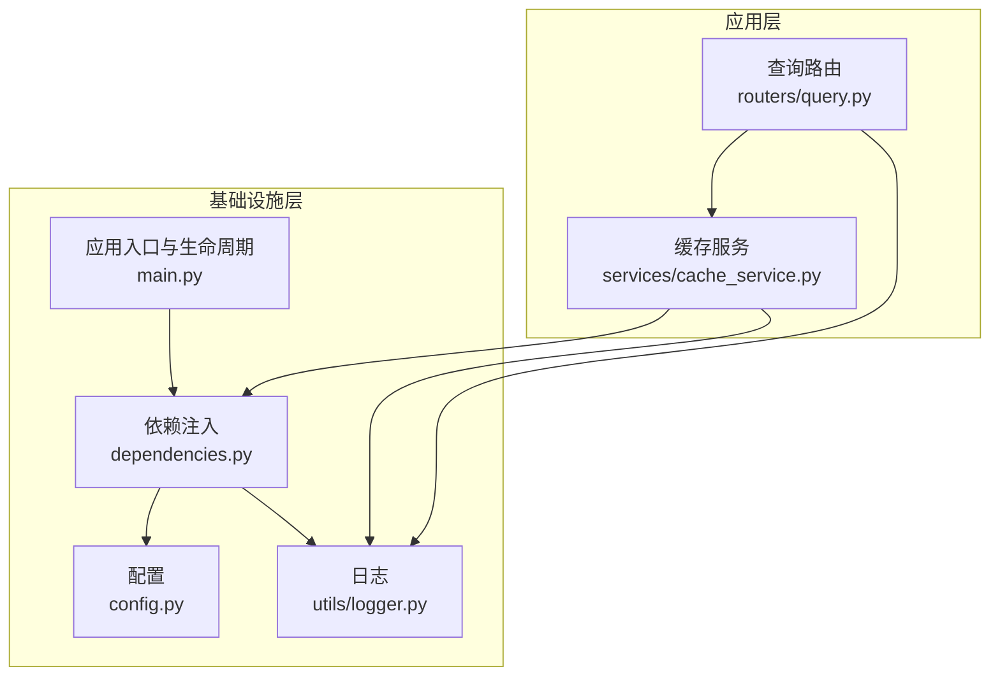
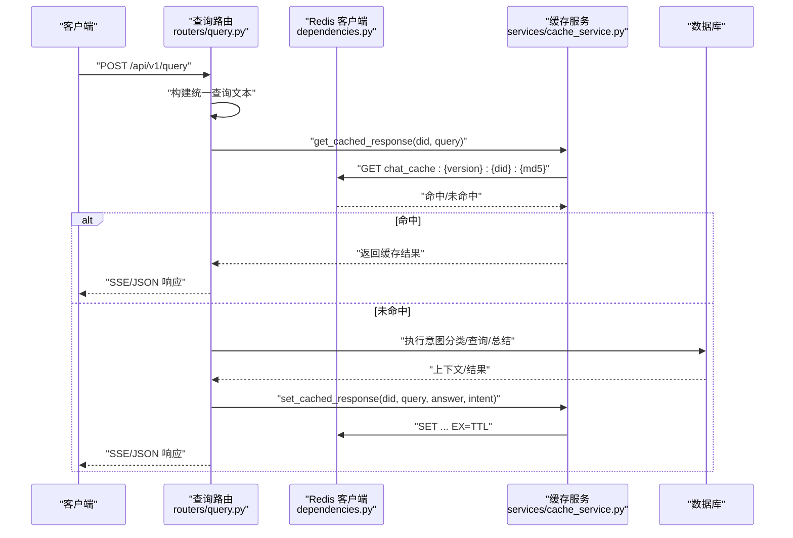
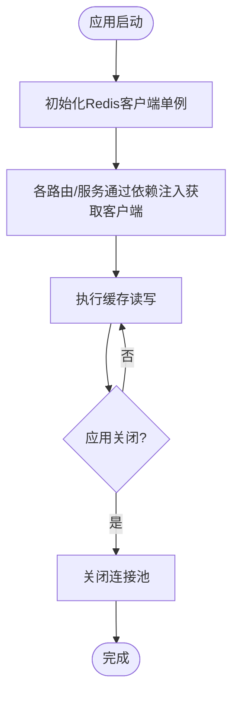
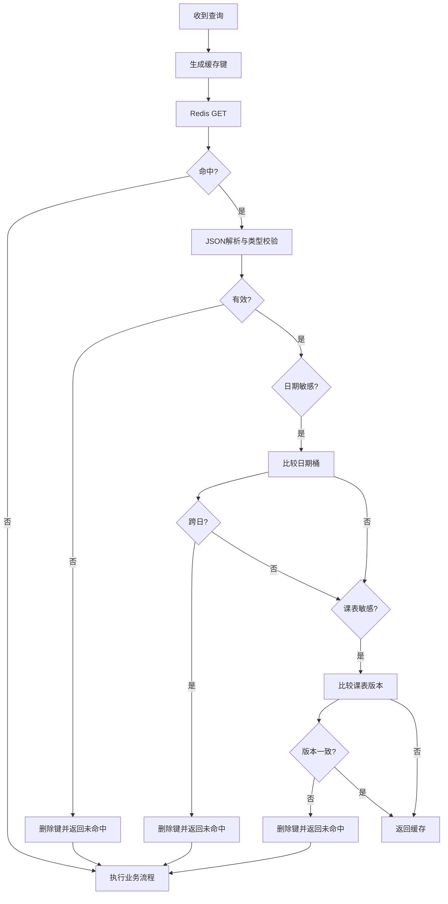
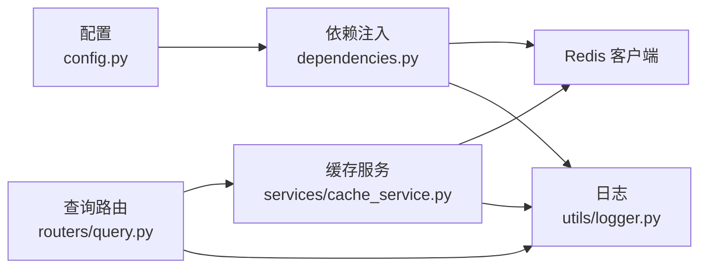

# 缓存服务

<cite>
**本文引用的文件**
- [cache_service.py](file://service/ai_assistant/app/services/cache_service.py)
- [config.py](file://service/ai_assistant/app/config.py)
- [dependencies.py](file://service/ai_assistant/app/dependencies.py)
- [query.py](file://service/ai_assistant/app/routers/query.py)
- [main.py](file://service/ai_assistant/app/main.py)
- [logger.py](file://service/ai_assistant/app/utils/logger.py)
</cite>

## 目录
1. [简介](#简介)
2. [项目结构](#项目结构)
3. [核心组件](#核心组件)
4. [架构总览](#架构总览)
5. [详细组件分析](#详细组件分析)
6. [依赖分析](#依赖分析)
7. [性能考虑](#性能考虑)
8. [故障排查指南](#故障排查指南)
9. [结论](#结论)
10. [附录](#附录)

## 简介
本文件面向AI校园助手项目的缓存服务，系统化阐述其设计与实现要点，包括：
- Redis连接池管理与客户端复用
- 缓存键命名规范与数据序列化机制
- 缓存策略：TTL过期控制、日期敏感与课表版本控制
- 不同类型数据的缓存策略：查询结果缓存、会话历史缓存
- 缓存一致性保障：写穿透防护、缓存失效与版本控制
- 性能优化：连接复用、批量删除、日志与可观测性
- 使用示例、错误处理与容量规划建议

## 项目结构
缓存服务主要涉及以下模块：
- 配置层：集中管理Redis地址、TTL等参数
- 依赖注入层：提供Redis客户端单例与生命周期管理
- 缓存服务层：封装键生成、TTL策略、序列化与一致性校验
- 路由层：在查询流程中集成缓存读写
- 日志层：统一日志输出，便于监控与排障

图表来源
- [query.py](file://service/ai_assistant/app/routers/query.py)
- [cache_service.py](file://service/ai_assistant/app/services/cache_service.py)
- [dependencies.py](file://service/ai_assistant/app/dependencies.py)
- [config.py](file://service/ai_assistant/app/config.py)
- [main.py](file://service/ai_assistant/app/main.py)
- [logger.py](file://service/ai_assistant/app/utils/logger.py)

章节来源
- [query.py](file://service/ai_assistant/app/routers/query.py)
- [cache_service.py](file://service/ai_assistant/app/services/cache_service.py)
- [dependencies.py](file://service/ai_assistant/app/dependencies.py)
- [config.py](file://service/ai_assistant/app/config.py)
- [main.py](file://service/ai_assistant/app/main.py)
- [logger.py](file://service/ai_assistant/app/utils/logger.py)

## 核心组件
- Redis连接池与客户端单例：通过依赖注入提供全局唯一的aioredis.Redis实例，避免重复创建连接，减少资源消耗。
- 缓存键生成：采用“chat_cache:{version}:{did}:{query_md5}”的命名规范，结合查询文本标准化与MD5哈希，确保键稳定且唯一。
- TTL策略：区分敏感/非敏感查询，分别采用不同的过期时间；对日期敏感与课表敏感查询，增加额外的运行时校验，确保语义新鲜度。
- 序列化机制：统一使用JSON序列化/反序列化，写入时携带元信息（如日期桶、课表版本），读取时进行类型校验与失效处理。
- 会话历史缓存：使用Redis列表维护会话上下文，限定长度并设置TTL，避免跨会话污染。

章节来源
- [dependencies.py](file://service/ai_assistant/app/dependencies.py)
- [cache_service.py](file://service/ai_assistant/app/services/cache_service.py)
- [config.py](file://service/ai_assistant/app/config.py)
- [query.py](file://service/ai_assistant/app/routers/query.py)

## 架构总览
缓存服务在查询流程中的位置如下：

图表来源
- [query.py](file://service/ai_assistant/app/routers/query.py)
- [cache_service.py](file://service/ai_assistant/app/services/cache_service.py)
- [dependencies.py](file://service/ai_assistant/app/dependencies.py)

## 详细组件分析

### Redis连接池与生命周期管理
- 客户端单例：通过全局变量持有aioredis.Redis实例，首次使用时按配置URL创建，后续复用。
- 生命周期：应用启动时初始化，关闭时主动关闭连接池，避免资源泄漏。
- 连接参数：编码与解码设置为UTF-8，确保中文与JSON正常处理。

图表来源
- [dependencies.py](file://service/ai_assistant/app/dependencies.py)
- [main.py](file://service/ai_assistant/app/main.py)

章节来源
- [dependencies.py](file://service/ai_assistant/app/dependencies.py)
- [main.py](file://service/ai_assistant/app/main.py)

### 缓存键命名规范与数据序列化
- 键格式：chat_cache:{version}:{did}:{query_md5}
  - version：用于强制隔离不同版本的缓存，升级查询/总结逻辑时可快速失效旧缓存。
  - did：基于学生ID的去标识化ID，确保同一用户在不同会话间共享缓存。
  - query_md5：对标准化后的查询文本进行MD5，保证键稳定且可复用。
- 序列化：写入时使用JSON序列化，读取时进行类型校验；若解析失败或类型不符，自动删除键并返回未命中。
- 元信息：写入时附加元信息，包括日期敏感标记、日期桶、课表敏感标记与当前课表版本号。

章节来源
- [cache_service.py](file://service/ai_assistant/app/services/cache_service.py)

### TTL过期控制与一致性保障
- TTL策略：
  - 敏感/隐私查询：30分钟
  - 普通查询：1天
- 日期敏感校验：对包含“今天/明天/本周/本学期”等相对时间语义的查询，按“日期桶”（当日日期）校验缓存新鲜度，跨日自动失效。
- 课表敏感校验：管理员调整课表后，递增“课表版本号”，查询命中时对比版本，不一致则失效并拒绝缓存。

图表来源
- [cache_service.py](file://service/ai_assistant/app/services/cache_service.py)

章节来源
- [cache_service.py](file://service/ai_assistant/app/services/cache_service.py)

### 不同类型数据的缓存策略
- 查询结果缓存（chat_cache:*）：
  - 键：chat_cache:{version}:{did}:{md5}
  - TTL：按敏感性选择
  - 元信息：日期桶、课表版本
- 会话历史缓存（chat:session_history:{did}:{session_id}）：
  - 类型：Redis列表
  - 行为：右侧追加、左侧裁剪至最大历史条数，设置7天TTL
  - 作用：隔离不同会话的历史，避免并发污染

章节来源
- [query.py](file://service/ai_assistant/app/routers/query.py)
- [cache_service.py](file://service/ai_assistant/app/services/cache_service.py)

### 缓存API使用示例与错误处理
- 读取缓存：get_cached_response(redis, did, query_text)
  - 返回字典或None；异常时捕获并降级为未命中
- 写入缓存：set_cached_response(redis, did, query_text, response, sensitive=None)
  - 自动推断敏感性，写入JSON并设置TTL
- 批量清理：clear_cache_endpoint
  - 支持按模式扫描与批量删除，避免阻塞

章节来源
- [query.py](file://service/ai_assistant/app/routers/query.py)
- [cache_service.py](file://service/ai_assistant/app/services/cache_service.py)

## 依赖分析
- 配置依赖：Redis地址、TTL参数由配置模块集中管理，便于环境切换与热更新。
- 服务依赖：路由层依赖缓存服务；缓存服务依赖Redis客户端；Redis客户端由依赖注入提供。
- 日志依赖：统一使用日志模块，便于追踪缓存命中/未命中、解析失败、版本不一致等情况。

图表来源
- [config.py](file://service/ai_assistant/app/config.py)
- [dependencies.py](file://service/ai_assistant/app/dependencies.py)
- [query.py](file://service/ai_assistant/app/routers/query.py)
- [cache_service.py](file://service/ai_assistant/app/services/cache_service.py)
- [logger.py](file://service/ai_assistant/app/utils/logger.py)

章节来源
- [config.py](file://service/ai_assistant/app/config.py)
- [dependencies.py](file://service/ai_assistant/app/dependencies.py)
- [query.py](file://service/ai_assistant/app/routers/query.py)
- [cache_service.py](file://service/ai_assistant/app/services/cache_service.py)
- [logger.py](file://service/ai_assistant/app/utils/logger.py)

## 性能考虑
- 连接复用：通过单例客户端避免频繁创建连接，降低握手与资源开销。
- 批量删除：清理缓存时使用scan_iter与批量delete，避免阻塞主流程。
- 流式输出：在SSE生成器结束后再写入缓存，避免长时间持有数据库连接。
- 日志降噪：对高频事件（如缓存命中/未命中）使用DEBUG级别，生产环境按需调整。

章节来源
- [query.py](file://service/ai_assistant/app/routers/query.py)
- [cache_service.py](file://service/ai_assistant/app/services/cache_service.py)
- [logger.py](file://service/ai_assistant/app/utils/logger.py)

## 故障排查指南
- 缓存未命中/命中异常
  - 检查键格式与did生成是否一致
  - 确认敏感性判断与TTL设置
  - 查看日志中“Cache miss/Cache hit/Cache payload parse failed”等信息
- 日期敏感/课表敏感误判
  - 核对查询文本是否包含相对时间/课表相关关键词
  - 确认日期桶与课表版本号是否按预期更新
- Redis连接异常
  - 检查Redis地址/密码/端口配置
  - 关注应用生命周期中连接池关闭日志
- 清理缓存失败
  - 使用批量删除接口，确认模式匹配正确

章节来源
- [cache_service.py](file://service/ai_assistant/app/services/cache_service.py)
- [query.py](file://service/ai_assistant/app/routers/query.py)
- [dependencies.py](file://service/ai_assistant/app/dependencies.py)
- [main.py](file://service/ai_assistant/app/main.py)
- [logger.py](file://service/ai_assistant/app/utils/logger.py)

## 结论
本缓存服务通过明确的键命名、TTL策略与一致性校验，实现了对查询结果与会话历史的高效缓存。配合连接池复用与批量清理能力，满足了高并发场景下的性能与稳定性需求。建议在生产环境持续关注日志指标与Redis内存使用情况，结合容量规划与版本升级策略，确保缓存系统的长期健康运行。

## 附录

### 缓存键与元信息字段说明
- 键格式：chat_cache:{version}:{did}:{query_md5}
- 元信息字段：
  - date_sensitive：是否日期敏感
  - date_bucket：缓存创建的日期桶
  - schedule_sensitive：是否课表敏感
  - schedule_cache_version：当前课表版本号

章节来源
- [cache_service.py](file://service/ai_assistant/app/services/cache_service.py)

### 配置项摘要
- Redis地址与认证：REDIS_HOST、REDIS_PORT、REDIS_PASSWORD、REDIS_DB
- 缓存TTL（秒）：CACHE_TTL_SENSITIVE、CACHE_TTL_NORMAL
- 其他：MAX_HISTORY_COUNT（会话历史长度）

章节来源
- [config.py](file://service/ai_assistant/app/config.py)