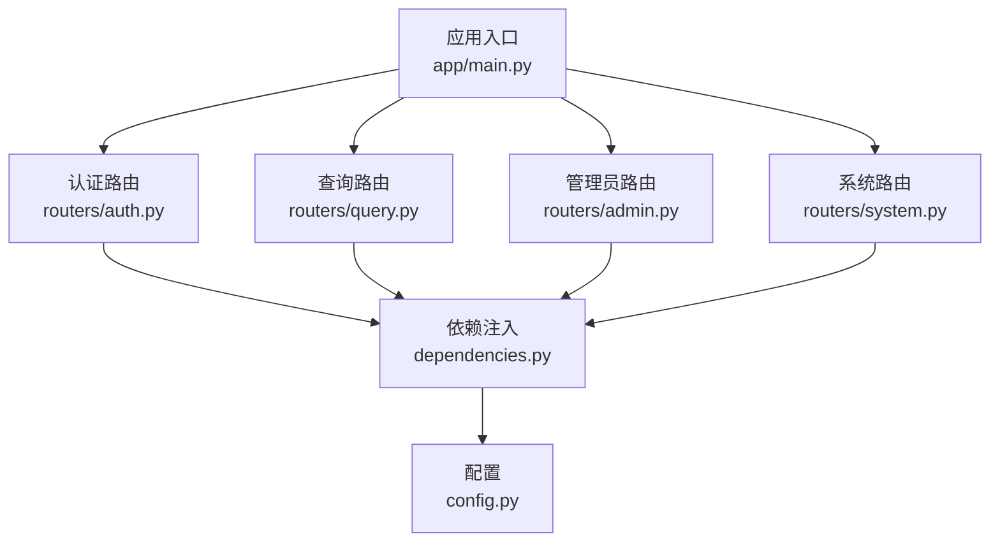
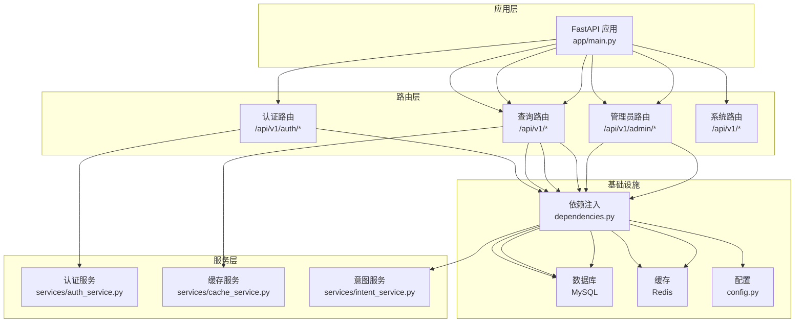
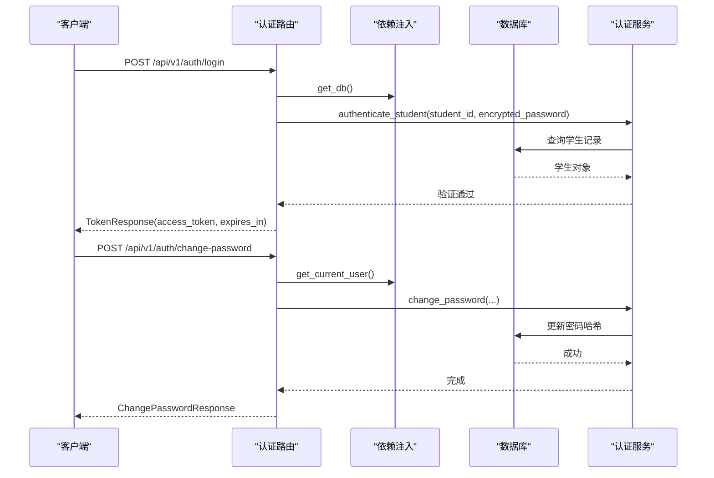
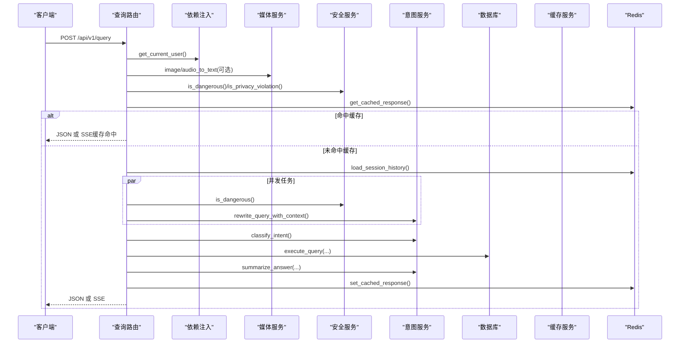
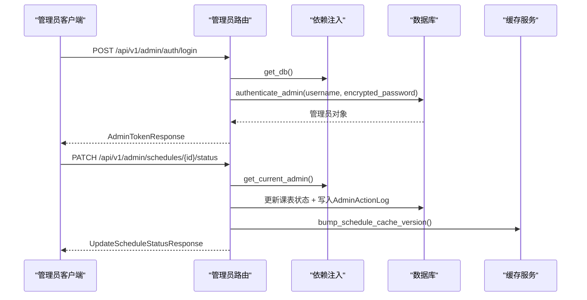
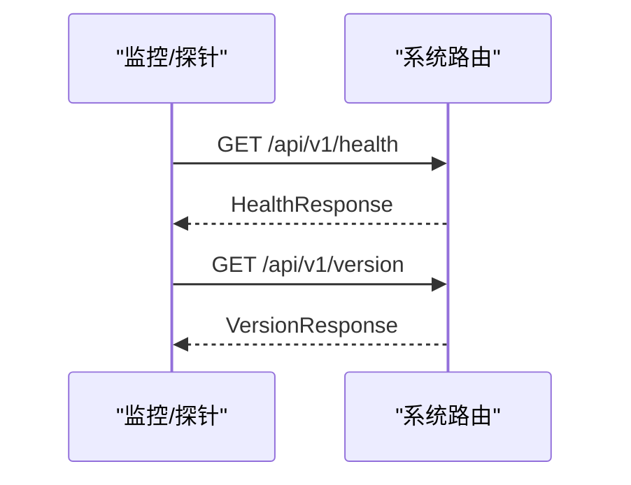
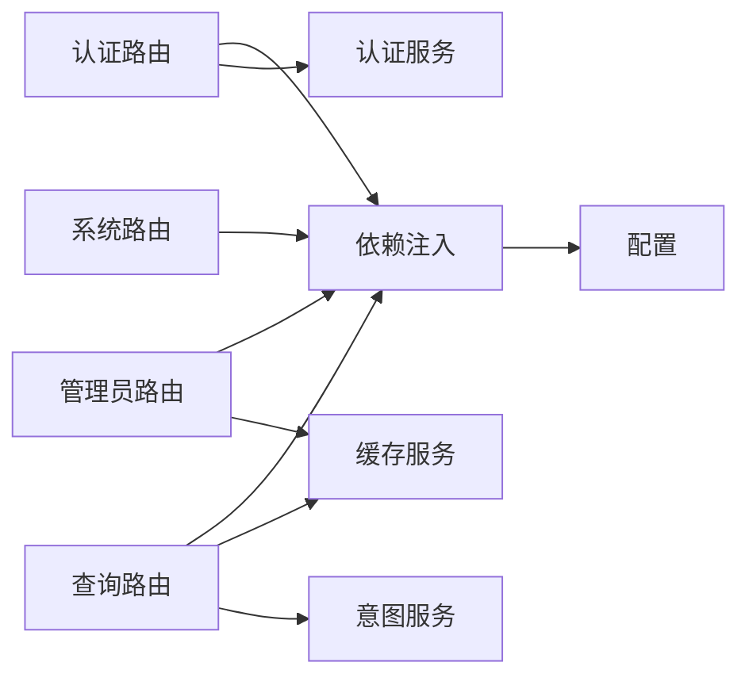

# 路由系统设计

<cite>
**本文档引用的文件**
- [main.py](file://service/ai_assistant/app/main.py)
- [auth.py](file://service/ai_assistant/app/routers/auth.py)
- [query.py](file://service/ai_assistant/app/routers/query.py)
- [admin.py](file://service/ai_assistant/app/routers/admin.py)
- [system.py](file://service/ai_assistant/app/routers/system.py)
- [dependencies.py](file://service/ai_assistant/app/dependencies.py)
- [config.py](file://service/ai_assistant/app/config.py)
- [auth.py（schemas）](file://service/ai_assistant/app/schemas/auth.py)
- [query.py（schemas）](file://service/ai_assistant/app/schemas/query.py)
- [admin.py（schemas）](file://service/ai_assistant/app/schemas/admin.py)
- [auth_service.py](file://service/ai_assistant/app/services/auth_service.py)
- [cache_service.py](file://service/ai_assistant/app/services/cache_service.py)
- [intent_service.py](file://service/ai_assistant/app/services/intent_service.py)
</cite>

## 目录
1. [引言](#引言)
2. [项目结构](#项目结构)
3. [核心组件](#核心组件)
4. [架构总览](#架构总览)
5. [详细组件分析](#详细组件分析)
6. [依赖关系分析](#依赖关系分析)
7. [性能考量](#性能考量)
8. [故障排查指南](#故障排查指南)
9. [结论](#结论)
10. [附录](#附录)

## 引言
本文件面向AI校园助手项目的FastAPI路由系统，系统性梳理路由模块的组织结构、URL模式与HTTP方法映射，详解各模块职责边界（认证、查询、管理员、系统），并深入解析路由装饰器的使用模式（依赖注入、异常处理、响应模型定义）、模块间依赖与数据传递机制。文档同时提供路由定义示例路径、请求/响应模式与错误处理策略，并给出性能优化建议与安全注意事项，帮助开发者快速理解与扩展系统。

## 项目结构
后端采用FastAPI应用入口集中注册路由，路由模块按功能域拆分，配合依赖注入与配置模块，形成清晰的分层架构。路由注册集中在应用入口，统一挂载四个子路由：认证、查询、管理员、系统。

图表来源
- [main.py:81-84](file://service/ai_assistant/app/main.py#L81-L84)
- [auth.py:21](file://service/ai_assistant/app/routers/auth.py#L21)
- [query.py:46](file://service/ai_assistant/app/routers/query.py#L46)
- [admin.py:48](file://service/ai_assistant/app/routers/admin.py#L48)
- [system.py:9](file://service/ai_assistant/app/routers/system.py#L9)
- [dependencies.py:1-109](file://service/ai_assistant/app/dependencies.py#L1-L109)
- [config.py:1-113](file://service/ai_assistant/app/config.py#L1-L113)

章节来源
- [main.py:81-84](file://service/ai_assistant/app/main.py#L81-L84)
- [main.py:52-62](file://service/ai_assistant/app/main.py#L52-L62)

## 核心组件
- 应用入口与生命周期：集中初始化FastAPI实例、CORS中间件、安全检查与路由注册，统一管理应用生命周期事件。
- 路由模块：按功能域划分，每个模块以APIRouter定义前缀与标签，统一暴露REST接口。
- 依赖注入：数据库会话、Redis客户端、当前用户/管理员解析、Bearer Token校验。
- 配置中心：集中管理数据库、Redis、LLM模型、缓存TTL、CORS白名单等运行参数。
- 响应模型：各模块定义专用Pydantic模型，确保请求/响应契约清晰。

章节来源
- [main.py:36-49](file://service/ai_assistant/app/main.py#L36-L49)
- [dependencies.py:27-50](file://service/ai_assistant/app/dependencies.py#L27-L50)
- [config.py:6-113](file://service/ai_assistant/app/config.py#L6-L113)

## 架构总览
路由系统围绕“统一入口 + 功能域路由 + 依赖注入 + 配置中心”的模式构建，认证与查询路由对JWT进行严格校验，管理员路由提供后台管理能力，系统路由提供健康检查与版本信息。

图表来源
- [main.py:81-84](file://service/ai_assistant/app/main.py#L81-L84)
- [auth.py:14-19](file://service/ai_assistant/app/routers/auth.py#L14-L19)
- [query.py:35-42](file://service/ai_assistant/app/routers/query.py#L35-L42)
- [admin.py:45](file://service/ai_assistant/app/routers/admin.py#L45)
- [dependencies.py:27-50](file://service/ai_assistant/app/dependencies.py#L27-L50)
- [config.py:86-110](file://service/ai_assistant/app/config.py#L86-L110)

## 详细组件分析

### 认证路由（/api/v1/auth）
- 职责：提供学生登录、修改密码接口；返回JWT Bearer令牌；对旧密码与新密码进行AES解密与哈希校验。
- URL与方法：
  - POST /api/v1/auth/login
  - POST /api/v1/auth/change-password
- 关键点：
  - 登录：接收加密密码，调用认证服务验证，签发JWT。
  - 修改密码：依赖当前用户解析，校验旧密码哈希，更新为新密码哈希。
- 依赖与异常：
  - 依赖数据库会话与当前用户解析；异常映射为HTTP 401/403/400。
- 响应模型：TokenResponse、ChangePasswordResponse。

图表来源
- [auth.py:24-52](file://service/ai_assistant/app/routers/auth.py#L24-L52)
- [auth.py:55-101](file://service/ai_assistant/app/routers/auth.py#L55-L101)
- [dependencies.py:56-72](file://service/ai_assistant/app/dependencies.py#L56-L72)
- [auth_service.py:125-169](file://service/ai_assistant/app/services/auth_service.py#L125-L169)
- [auth_service.py:173-209](file://service/ai_assistant/app/services/auth_service.py#L173-L209)

章节来源
- [auth.py:21-101](file://service/ai_assistant/app/routers/auth.py#L21-L101)
- [auth.py（schemas）:4-56](file://service/ai_assistant/app/schemas/auth.py#L4-L56)
- [auth_service.py:125-209](file://service/ai_assistant/app/services/auth_service.py#L125-L209)
- [dependencies.py:56-72](file://service/ai_assistant/app/dependencies.py#L56-L72)

### 查询路由（/api/v1）
- 职责：统一的多模态问答入口，支持文本、图像、音频输入；内置安全检查、缓存、意图分类、查询执行、流式回答与历史会话管理。
- URL与方法：
  - POST /api/v1/query
  - DELETE /api/v1/sessions
- 关键点：
  - 多模态输入解码与统一文本构建；安全检查与隐私拦截；缓存命中直接返回；并发执行危险检查与查询重写；意图修正；流式SSE输出。
  - 支持JSON与SSE两种输出模式；会话隔离历史存储于Redis。
- 依赖与异常：
  - 依赖数据库、Redis、当前用户解析；异常映射为HTTP 400/401/403/502。
- 响应模型：QueryResponse；流式返回为SSE。

图表来源
- [query.py:198-745](file://service/ai_assistant/app/routers/query.py#L198-L745)
- [query.py（schemas）:8-33](file://service/ai_assistant/app/schemas/query.py#L8-L33)
- [dependencies.py:48-50](file://service/ai_assistant/app/dependencies.py#L48-L50)
- [cache_service.py:92-176](file://service/ai_assistant/app/services/cache_service.py#L92-L176)
- [intent_service.py:218-346](file://service/ai_assistant/app/services/intent_service.py#L218-L346)

章节来源
- [query.py:46-788](file://service/ai_assistant/app/routers/query.py#L46-L788)
- [query.py（schemas）:8-33](file://service/ai_assistant/app/schemas/query.py#L8-L33)
- [cache_service.py:1-177](file://service/ai_assistant/app/services/cache_service.py#L1-L177)
- [intent_service.py:1-346](file://service/ai_assistant/app/services/intent_service.py#L1-L346)
- [dependencies.py:48-50](file://service/ai_assistant/app/dependencies.py#L48-L50)

### 管理员路由（/api/v1/admin）
- 职责：管理员登录、获取当前管理员信息、仪表盘统计、元数据查询、课表列表与状态更新。
- URL与方法：
  - POST /api/v1/admin/auth/login
  - GET /api/v1/admin/auth/me
  - GET /api/v1/admin/dashboard/summary
  - GET /api/v1/admin/meta/terms
  - GET /api/v1/admin/meta/classes
  - GET /api/v1/admin/schedules
  - PATCH /api/v1/admin/schedules/{schedule_id}/status
- 关键点：
  - 管理员登录签发专用JWT；状态更新后记录操作日志并提升课表缓存版本。
- 依赖与异常：
  - 依赖数据库、Redis、当前管理员解析；异常映射为HTTP 401/403/404。
- 响应模型：AdminTokenResponse、AdminMeResponse、AdminDashboardSummaryResponse、AdminTermItem、AdminClassItem、AdminScheduleItem、UpdateScheduleStatusResponse。

图表来源
- [admin.py:51-82](file://service/ai_assistant/app/routers/admin.py#L51-L82)
- [admin.py:304-387](file://service/ai_assistant/app/routers/admin.py#L304-L387)
- [dependencies.py:75-107](file://service/ai_assistant/app/dependencies.py#L75-L107)
- [cache_service.py:78-82](file://service/ai_assistant/app/services/cache_service.py#L78-L82)

章节来源
- [admin.py:48-388](file://service/ai_assistant/app/routers/admin.py#L48-L388)
- [admin.py（schemas）:11-105](file://service/ai_assistant/app/schemas/admin.py#L11-L105)
- [dependencies.py:75-107](file://service/ai_assistant/app/dependencies.py#L75-L107)
- [cache_service.py:70-82](file://service/ai_assistant/app/services/cache_service.py#L70-L82)

### 系统路由（/api/v1）
- 职责：健康检查与版本信息。
- URL与方法：
  - GET /api/v1/health
  - GET /api/v1/version
- 关键点：轻量接口，返回服务状态与版本信息。
- 响应模型：HealthResponse、VersionResponse。

图表来源
- [system.py:22-37](file://service/ai_assistant/app/routers/system.py#L22-L37)

章节来源
- [system.py:9-38](file://service/ai_assistant/app/routers/system.py#L9-L38)

## 依赖关系分析
- 路由到依赖注入：各路由均通过Depends注入数据库会话、Redis客户端、当前用户/管理员解析。
- 依赖注入到配置：依赖注入模块读取配置中心参数，构造数据库与Redis连接。
- 路由到服务：查询路由串联安全、缓存、意图、数据库等服务；认证路由调用认证服务；管理员路由调用缓存服务以维护课表缓存版本。
- 路由到模型：各路由使用对应Pydantic模型作为请求/响应契约。

图表来源
- [dependencies.py:27-50](file://service/ai_assistant/app/dependencies.py#L27-L50)
- [config.py:86-110](file://service/ai_assistant/app/config.py#L86-L110)
- [auth_service.py:125-209](file://service/ai_assistant/app/services/auth_service.py#L125-L209)
- [cache_service.py:92-176](file://service/ai_assistant/app/services/cache_service.py#L92-L176)
- [intent_service.py:218-346](file://service/ai_assistant/app/services/intent_service.py#L218-L346)

章节来源
- [dependencies.py:1-109](file://service/ai_assistant/app/dependencies.py#L1-L109)
- [config.py:1-113](file://service/ai_assistant/app/config.py#L1-L113)

## 性能考量
- 连接池与会话管理
  - 数据库会话按请求作用域创建与释放，避免长连接占用；流式SSE场景提前回滚数据库会话，缩短连接占用时间。
  - Redis客户端单例化，减少连接开销。
- 缓存策略
  - 基于DID与查询哈希的缓存键设计，区分敏感与普通查询的TTL；对课表相关查询维护版本号，管理员变更后主动失效。
- 并发优化
  - 危险检查与查询重写并行执行，缩短端到端延迟。
  - 流式生成采用线程池包装同步生成器，避免阻塞事件循环。
- 输入裁剪与截断
  - 对历史、问题、上下文进行长度裁剪，防止LLM输入超限导致失败。
- 输出模式选择
  - JSON模式适合一次性响应，SSE模式适合长文本生成与实时反馈。

章节来源
- [query.py:654-657](file://service/ai_assistant/app/routers/query.py#L654-L657)
- [query.py:347-352](file://service/ai_assistant/app/routers/query.py#L347-L352)
- [query.py:664-689](file://service/ai_assistant/app/routers/query.py#L664-L689)
- [cache_service.py:85-89](file://service/ai_assistant/app/services/cache_service.py#L85-L89)
- [cache_service.py:129-142](file://service/ai_assistant/app/services/cache_service.py#L129-L142)
- [intent_service.py:116-160](file://service/ai_assistant/app/services/intent_service.py#L116-L160)

## 故障排查指南
- 认证失败
  - 现象：登录/修改密码返回401/403/400。
  - 排查：确认Bearer Token格式与角色匹配；检查加密密码解密与哈希验证；核对数据库中学生/管理员记录是否存在。
- 查询异常
  - 现象：SSE/JSON返回502或空回答。
  - 排查：检查媒体转文本服务、意图分类、查询执行链路；查看缓存读写异常；确认会话历史加载与写入是否成功。
- 管理员状态更新失败
  - 现象：状态更新404或权限不足。
  - 排查：确认课表记录存在；检查管理员账户状态；核对缓存版本提升是否成功。
- 健康检查与版本信息
  - 现象：探针无法访问。
  - 排查：确认CORS配置与路由注册；检查应用生命周期钩子。

章节来源
- [auth.py:41-45](file://service/ai_assistant/app/routers/auth.py#L41-L45)
- [auth.py:79-99](file://service/ai_assistant/app/routers/auth.py#L79-L99)
- [query.py:237-260](file://service/ai_assistant/app/routers/query.py#L237-L260)
- [query.py:544-549](file://service/ai_assistant/app/routers/query.py#L544-L549)
- [admin.py:322-326](file://service/ai_assistant/app/routers/admin.py#L322-L326)
- [admin.py:103-106](file://service/ai_assistant/app/routers/admin.py#L103-L106)
- [system.py:27-37](file://service/ai_assistant/app/routers/system.py#L27-L37)

## 结论
本路由系统以清晰的模块化设计实现统一入口与功能域分离，通过依赖注入与配置中心实现横切关注点的集中管理。认证与查询路由对JWT与多模态输入进行了严谨处理，管理员路由提供完善的后台管理能力，系统路由保障可观测性。整体具备良好的扩展性与可维护性，建议在生产环境完善CORS白名单、密钥与敏感配置的安全加固，并持续优化缓存与LLM调用策略以提升吞吐与稳定性。

## 附录
- 路由定义示例路径
  - [登录接口定义:24-52](file://service/ai_assistant/app/routers/auth.py#L24-L52)
  - [修改密码接口定义:55-101](file://service/ai_assistant/app/routers/auth.py#L55-L101)
  - [统一查询接口定义:198-212](file://service/ai_assistant/app/routers/query.py#L198-L212)
  - [清除会话缓存接口定义:748-787](file://service/ai_assistant/app/routers/query.py#L748-L787)
  - [管理员登录接口定义:51-82](file://service/ai_assistant/app/routers/admin.py#L51-L82)
  - [课表状态更新接口定义:304-387](file://service/ai_assistant/app/routers/admin.py#L304-L387)
  - [健康检查接口定义:22-28](file://service/ai_assistant/app/routers/system.py#L22-L28)
  - [版本信息接口定义:31-37](file://service/ai_assistant/app/routers/system.py#L31-L37)
- 请求/响应模式
  - [认证请求/响应模型:4-56](file://service/ai_assistant/app/schemas/auth.py#L4-L56)
  - [查询请求/响应模型:8-33](file://service/ai_assistant/app/schemas/query.py#L8-L33)
  - [管理员请求/响应模型:11-105](file://service/ai_assistant/app/schemas/admin.py#L11-L105)
- 错误处理策略
  - [认证路由异常映射:41-45](file://service/ai_assistant/app/routers/auth.py#L41-L45)
  - [查询路由异常映射:237-260](file://service/ai_assistant/app/routers/query.py#L237-260)
  - [管理员路由异常映射:63-72](file://service/ai_assistant/app/routers/admin.py#L63-72)
- 安全与合规
  - [依赖注入中的Bearer校验:56-72](file://service/ai_assistant/app/dependencies.py#L56-72)
  - [管理员JWT校验:75-107](file://service/ai_assistant/app/dependencies.py#L75-107)
  - [隐私拦截与危险内容检测:354-413](file://service/ai_assistant/app/routers/query.py#L354-413)