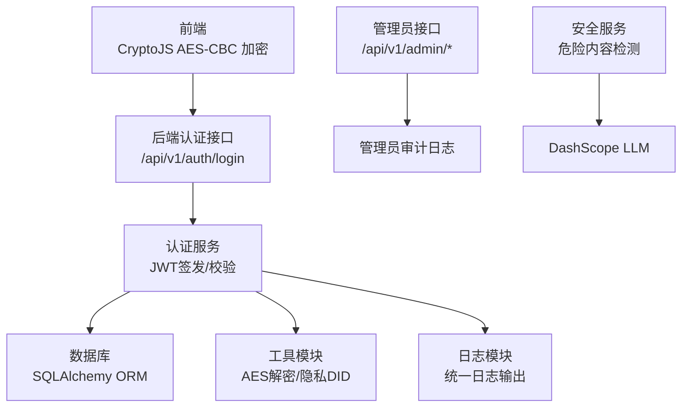
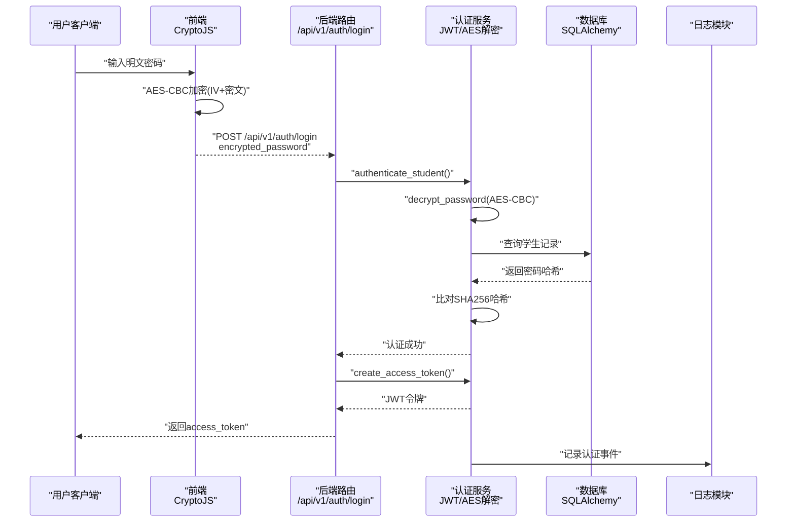
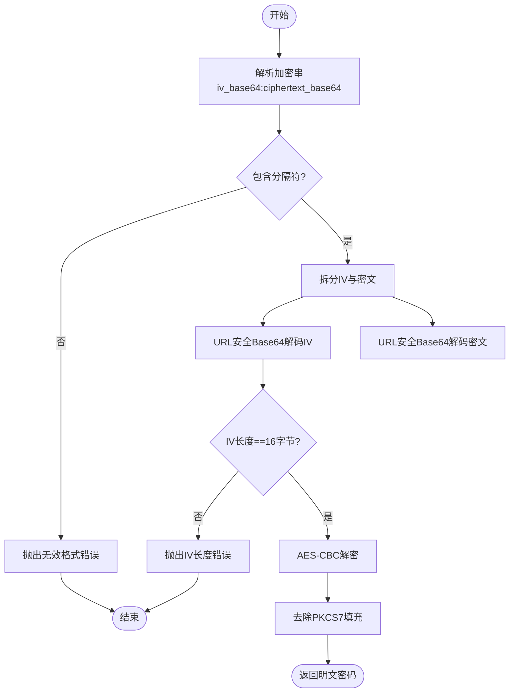
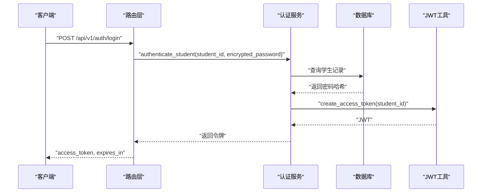
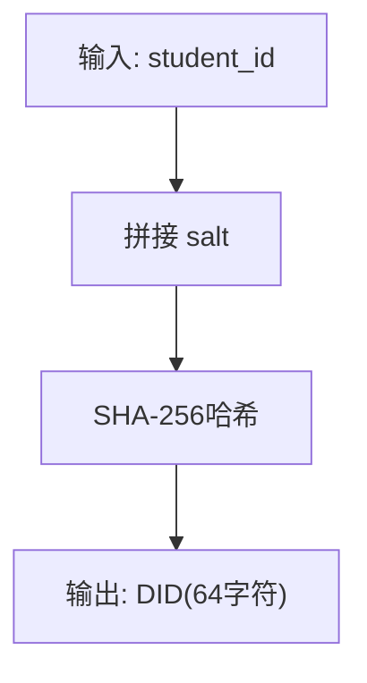
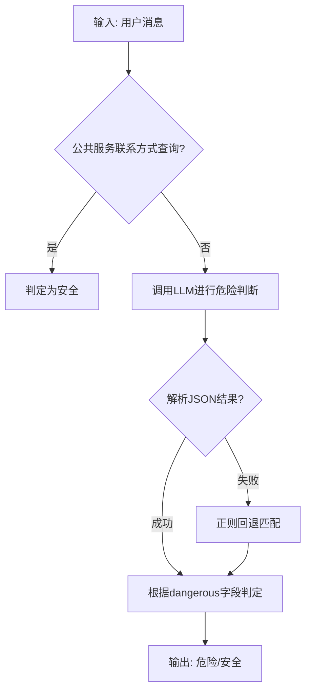
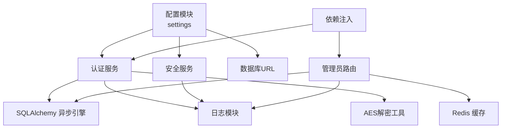

# 数据安全与隐私

<cite>
**本文引用的文件**
- [service/ai_assistant/app/utils/crypto.py](file://service/ai_assistant/app/utils/crypto.py)
- [frontend/ai_assistant/src/utils/crypto.js](file://frontend/ai_assistant/src/utils/crypto.js)
- [service/ai_assistant/app/schemas/auth.py](file://service/ai_assistant/app/schemas/auth.py)
- [service/ai_assistant/app/services/auth_service.py](file://service/ai_assistant/app/services/auth_service.py)
- [service/ai_assistant/app/routers/auth.py](file://service/ai_assistant/app/routers/auth.py)
- [service/ai_assistant/app/dependencies.py](file://service/ai_assistant/app/dependencies.py)
- [service/ai_assistant/app/utils/privacy.py](file://service/ai_assistant/app/utils/privacy.py)
- [service/ai_assistant/app/models/models.py](file://service/ai_assistant/app/models/models.py)
- [service/ai_assistant/app/services/safety_service.py](file://service/ai_assistant/app/services/safety_service.py)
- [service/ai_assistant/app/routers/admin.py](file://service/ai_assistant/app/routers/admin.py)
- [service/ai_assistant/app/utils/logger.py](file://service/ai_assistant/app/utils/logger.py)
- [service/ai_assistant/app/config.py](file://service/ai_assistant/app/config.py)
- [service/ai_assistant/app/database.py](file://service/ai_assistant/app/database.py)
</cite>

## 目录
1. [引言](#引言)
2. [项目结构](#项目结构)
3. [核心组件](#核心组件)
4. [架构总览](#架构总览)
5. [详细组件分析](#详细组件分析)
6. [依赖分析](#依赖分析)
7. [性能考虑](#性能考虑)
8. [故障排查指南](#故障排查指南)
9. [结论](#结论)
10. [附录](#附录)

## 引言
本文件面向AI校园助手项目，系统化梳理数据安全与隐私保护的设计与实现，覆盖敏感数据加密、访问控制、数据脱敏、隐私保护、数据传输安全、数据存储安全、安全审计与应急响应，并提供安全配置指南与合规建议。文档以代码为依据，辅以可视化图示，帮助开发者构建安全可靠的数据处理系统。

## 项目结构
项目采用前后端分离架构，后端基于FastAPI + SQLAlchemy异步ORM，前端基于Vue 3 + Vite。安全相关的关键位置如下：
- 前端：密码加密工具与认证API调用
- 后端：配置与密钥管理、JWT令牌签发与校验、AES-CBC密码解密、安全检测与日志、模型与数据脱敏、管理员审计

图表来源
- [frontend/ai_assistant/src/utils/crypto.js:1-40](file://frontend/ai_assistant/src/utils/crypto.js#L1-L40)
- [service/ai_assistant/app/routers/auth.py:1-102](file://service/ai_assistant/app/routers/auth.py#L1-L102)
- [service/ai_assistant/app/services/auth_service.py:1-253](file://service/ai_assistant/app/services/auth_service.py#L1-L253)
- [service/ai_assistant/app/utils/crypto.py:1-73](file://service/ai_assistant/app/utils/crypto.py#L1-L73)
- [service/ai_assistant/app/utils/logger.py:1-53](file://service/ai_assistant/app/utils/logger.py#L1-L53)
- [service/ai_assistant/app/routers/admin.py:1-388](file://service/ai_assistant/app/routers/admin.py#L1-L388)
- [service/ai_assistant/app/services/safety_service.py:1-163](file://service/ai_assistant/app/services/safety_service.py#L1-L163)

章节来源
- [service/ai_assistant/app/config.py:1-113](file://service/ai_assistant/app/config.py#L1-L113)
- [service/ai_assistant/app/database.py:1-35](file://service/ai_assistant/app/database.py#L1-L35)

## 核心组件
- 密码传输加密与解密
  - 前端使用CryptoJS对明文密码进行AES-CBC加密，格式为“iv_base64:ciphertext_base64”，并进行URL安全编码。
  - 后端使用共享密钥对前端传入的加密串进行解密，再与数据库中存储的密码哈希进行比对。
- 认证与访问控制
  - 登录成功后签发JWT，支持角色校验（学生/管理员），并限制令牌有效期。
  - 通过依赖注入在路由层强制校验Bearer Token，未通过校验返回401。
- 数据脱敏与隐私保护
  - 使用DID（派生标识符）替代真实学号，保证日志与审计中不直接暴露个人敏感信息。
- 安全检测与审计
  - 危险内容检测（LLM + 正则回退），隐私违规检测（学号查询）。
  - 管理员操作审计日志记录，包含变更前后状态、目标表与主键、时间戳等。
- 日志与监控
  - 统一日志输出至控制台与文件，按大小轮转与保留期限管理。

章节来源
- [service/ai_assistant/app/utils/crypto.py:1-73](file://service/ai_assistant/app/utils/crypto.py#L1-L73)
- [frontend/ai_assistant/src/utils/crypto.js:1-40](file://frontend/ai_assistant/src/utils/crypto.js#L1-L40)
- [service/ai_assistant/app/services/auth_service.py:1-253](file://service/ai_assistant/app/services/auth_service.py#L1-L253)
- [service/ai_assistant/app/routers/auth.py:1-102](file://service/ai_assistant/app/routers/auth.py#L1-L102)
- [service/ai_assistant/app/dependencies.py:1-109](file://service/ai_assistant/app/dependencies.py#L1-L109)
- [service/ai_assistant/app/utils/privacy.py:1-23](file://service/ai_assistant/app/utils/privacy.py#L1-L23)
- [service/ai_assistant/app/services/safety_service.py:1-163](file://service/ai_assistant/app/services/safety_service.py#L1-L163)
- [service/ai_assistant/app/routers/admin.py:1-388](file://service/ai_assistant/app/routers/admin.py#L1-L388)
- [service/ai_assistant/app/utils/logger.py:1-53](file://service/ai_assistant/app/utils/logger.py#L1-L53)

## 架构总览
下图展示认证与安全相关的关键交互路径，包括密码加密、JWT签发、权限校验、日志与审计。

图表来源
- [frontend/ai_assistant/src/utils/crypto.js:1-40](file://frontend/ai_assistant/src/utils/crypto.js#L1-L40)
- [service/ai_assistant/app/routers/auth.py:1-102](file://service/ai_assistant/app/routers/auth.py#L1-L102)
- [service/ai_assistant/app/services/auth_service.py:1-253](file://service/ai_assistant/app/services/auth_service.py#L1-L253)
- [service/ai_assistant/app/utils/crypto.py:1-73](file://service/ai_assistant/app/utils/crypto.py#L1-L73)
- [service/ai_assistant/app/utils/logger.py:1-53](file://service/ai_assistant/app/utils/logger.py#L1-L53)

## 详细组件分析

### 密码传输加密与解密
- 前端加密
  - 使用CryptoJS对明文密码进行AES-CBC加密，PKCS7填充，IV长度固定为16字节。
  - 输出格式为“iv_base64:ciphertext_base64”，并对Base64进行URL安全替换与补齐。
- 后端解密
  - 从配置读取共享密钥，长度支持16/24/32字节（对应AES-128/192/256）。
  - 解析前端加密串，校验IV长度与分隔符，执行AES-CBC解密并去除PKCS7填充。
  - 解密失败或格式异常时抛出错误，避免将密文误用。
- 安全要点
  - 密钥长度校验与异常处理，防止弱密钥与格式错误导致的解密失败。
  - 前后端密钥需保持一致，且仅在传输阶段使用，数据库存储为密码哈希。

图表来源
- [service/ai_assistant/app/utils/crypto.py:1-73](file://service/ai_assistant/app/utils/crypto.py#L1-L73)
- [frontend/ai_assistant/src/utils/crypto.js:1-40](file://frontend/ai_assistant/src/utils/crypto.js#L1-L40)

章节来源
- [service/ai_assistant/app/utils/crypto.py:1-73](file://service/ai_assistant/app/utils/crypto.py#L1-L73)
- [frontend/ai_assistant/src/utils/crypto.js:1-40](file://frontend/ai_assistant/src/utils/crypto.js#L1-L40)

### 认证与访问控制
- 登录流程
  - 路由接收student_id与encrypted_password，调用认证服务。
  - 认证服务解密密码并与数据库中存储的哈希比对，成功后签发JWT。
- 令牌签发与校验
  - 支持两种令牌：学生令牌（role=student）与管理员令牌（role=admin）。
  - 令牌包含签发时间、过期时间与主体标识，后端严格校验角色与过期时间。
- 权限校验
  - 通过依赖注入在路由层强制校验Bearer Token，未携带或无效返回401。
  - 管理员端点进一步校验账户状态（active）。

图表来源
- [service/ai_assistant/app/routers/auth.py:1-102](file://service/ai_assistant/app/routers/auth.py#L1-L102)
- [service/ai_assistant/app/services/auth_service.py:1-253](file://service/ai_assistant/app/services/auth_service.py#L1-L253)
- [service/ai_assistant/app/dependencies.py:1-109](file://service/ai_assistant/app/dependencies.py#L1-L109)

章节来源
- [service/ai_assistant/app/routers/auth.py:1-102](file://service/ai_assistant/app/routers/auth.py#L1-L102)
- [service/ai_assistant/app/services/auth_service.py:1-253](file://service/ai_assistant/app/services/auth_service.py#L1-L253)
- [service/ai_assistant/app/dependencies.py:1-109](file://service/ai_assistant/app/dependencies.py#L1-L109)
- [service/ai_assistant/app/schemas/auth.py:1-56](file://service/ai_assistant/app/schemas/auth.py#L1-L56)

### 数据脱敏与隐私保护
- DID生成
  - 基于真实学号与盐值生成稳定的SHA-256哈希，作为DID存储于对话日志中。
  - 同一学号始终生成相同DID，便于历史关联但不暴露真实ID。
- 隐私违规检测
  - 检测用户是否试图查询他人学号，若命中且与当前用户不同，视为隐私违规并记录告警。

图表来源
- [service/ai_assistant/app/utils/privacy.py:1-23](file://service/ai_assistant/app/utils/privacy.py#L1-L23)

章节来源
- [service/ai_assistant/app/utils/privacy.py:1-23](file://service/ai_assistant/app/utils/privacy.py#L1-L23)
- [service/ai_assistant/app/services/safety_service.py:147-163](file://service/ai_assistant/app/services/safety_service.py#L147-L163)
- [service/ai_assistant/app/models/models.py:641-660](file://service/ai_assistant/app/models/models.py#L641-L660)

### 安全检测与审计
- 危险内容检测
  - 使用LLM进行语义判断，优先解析JSON格式结果，失败时回退正则匹配。
  - 对公共服务联系方式查询进行放行，避免误报。
- 管理员审计
  - 管理员更新课表状态时，记录AdminActionLog，包含变更前后状态、原因、时间等。
  - 更新后尝试提升缓存版本，失败时记录异常日志。

图表来源
- [service/ai_assistant/app/services/safety_service.py:1-163](file://service/ai_assistant/app/services/safety_service.py#L1-L163)

章节来源
- [service/ai_assistant/app/services/safety_service.py:1-163](file://service/ai_assistant/app/services/safety_service.py#L1-L163)
- [service/ai_assistant/app/routers/admin.py:304-388](file://service/ai_assistant/app/routers/admin.py#L304-L388)
- [service/ai_assistant/app/models/models.py:86-112](file://service/ai_assistant/app/models/models.py#L86-L112)

### 日志与监控
- 日志配置
  - 初始化统一日志器，同时输出至控制台与文件。
  - 文件按10MB轮转，保留14天，编码为UTF-8。
- 使用范围
  - 认证、安全检测、管理员操作等关键路径均记录INFO/DEBUG级别日志，便于审计与问题定位。

章节来源
- [service/ai_assistant/app/utils/logger.py:1-53](file://service/ai_assistant/app/utils/logger.py#L1-L53)

## 依赖分析
- 组件耦合
  - 认证服务依赖配置与日志模块，使用AES解密工具与数据库ORM。
  - 路由层依赖认证服务与依赖注入，实现统一的权限校验。
  - 安全服务依赖配置与日志，调用外部LLM服务。
  - 管理员路由依赖数据库与Redis缓存服务，记录审计日志。
- 外部依赖
  - JWT库用于令牌签发与校验。
  - SQLAlchemy异步引擎与ORM模型用于数据库访问。
  - Loguru用于日志输出与文件落盘。
  - CryptoJS用于前端密码加密。

图表来源
- [service/ai_assistant/app/config.py:1-113](file://service/ai_assistant/app/config.py#L1-L113)
- [service/ai_assistant/app/database.py:1-35](file://service/ai_assistant/app/database.py#L1-L35)
- [service/ai_assistant/app/services/auth_service.py:1-253](file://service/ai_assistant/app/services/auth_service.py#L1-L253)
- [service/ai_assistant/app/services/safety_service.py:1-163](file://service/ai_assistant/app/services/safety_service.py#L1-L163)
- [service/ai_assistant/app/routers/admin.py:1-388](file://service/ai_assistant/app/routers/admin.py#L1-L388)
- [service/ai_assistant/app/dependencies.py:1-109](file://service/ai_assistant/app/dependencies.py#L1-L109)

章节来源
- [service/ai_assistant/app/config.py:1-113](file://service/ai_assistant/app/config.py#L1-L113)
- [service/ai_assistant/app/database.py:1-35](file://service/ai_assistant/app/database.py#L1-L35)
- [service/ai_assistant/app/dependencies.py:1-109](file://service/ai_assistant/app/dependencies.py#L1-L109)

## 性能考虑
- 令牌有效期
  - JWT默认有效期为1天，建议结合业务场景调整，避免频繁刷新带来的开销。
- 缓存策略
  - 配置中提供敏感与普通缓存TTL，合理利用Redis缓存减少数据库压力。
- 日志轮转
  - 文件大小轮转与保留策略平衡磁盘占用与审计需求。

[本节为通用指导，无需列出具体文件来源]

## 故障排查指南
- 认证失败
  - 检查前端加密密钥与后端配置是否一致；确认加密串格式与IV长度。
  - 核对数据库中密码哈希格式（兼容sha256$前缀与纯哈希）。
- 令牌无效
  - 确认请求头携带Bearer Token且未过期；检查角色与主体标识。
- 安全检测异常
  - LLM调用失败时自动回退正则，若仍判定为危险，检查正则规则与输入文本。
- 审计日志缺失
  - 确认日志模块初始化与文件路径；检查管理员操作是否触发记录。

章节来源
- [service/ai_assistant/app/services/auth_service.py:125-253](file://service/ai_assistant/app/services/auth_service.py#L125-L253)
- [service/ai_assistant/app/utils/crypto.py:17-73](file://service/ai_assistant/app/utils/crypto.py#L17-L73)
- [service/ai_assistant/app/services/safety_service.py:84-144](file://service/ai_assistant/app/services/safety_service.py#L84-L144)
- [service/ai_assistant/app/utils/logger.py:17-53](file://service/ai_assistant/app/utils/logger.py#L17-L53)

## 结论
本项目在数据安全与隐私方面建立了较为完善的体系：前端密码加密、后端哈希比对、JWT访问控制、DID脱敏、安全检测与审计日志。建议在生产环境中进一步强化密钥管理、TLS传输、数据库与备份加密、访问日志留存与合规审查，持续完善安全运营与应急响应流程。

[本节为总结性内容，无需列出具体文件来源]

## 附录

### 数据传输安全
- HTTPS与CORS
  - CORS允许来源可在配置中集中管理，建议在生产环境限定具体域名。
- API认证
  - 所有受保护接口均需Bearer Token，路由层统一校验。
- 传输加密
  - 建议在网关或反向代理层启用TLS终止，确保端到端加密。

章节来源
- [service/ai_assistant/app/config.py:17](file://service/ai_assistant/app/config.py#L17)
- [service/ai_assistant/app/dependencies.py:56-109](file://service/ai_assistant/app/dependencies.py#L56-L109)

### 数据存储安全
- 数据库连接
  - 使用异步引擎与连接池，开启pre_ping与recycle，增强连接稳定性。
- 密码存储
  - 数据库仅存储密码哈希，不保存明文或可逆加密结果。
- 审计日志
  - 管理员操作日志包含变更前后状态与时间戳，便于追溯。

章节来源
- [service/ai_assistant/app/database.py:1-35](file://service/ai_assistant/app/database.py#L1-L35)
- [service/ai_assistant/app/services/auth_service.py:29-43](file://service/ai_assistant/app/services/auth_service.py#L29-L43)
- [service/ai_assistant/app/routers/admin.py:352-364](file://service/ai_assistant/app/routers/admin.py#L352-L364)

### 隐私保护与合规
- 个人信息处理
  - 使用DID替代真实学号，对话日志索引中避免直接暴露个人标识。
- 数据最小化
  - 仅在必要时采集与存储敏感信息，例如密码仅用于认证。
- 用户同意管理
  - 建议在前端界面明确隐私政策与数据使用范围，并提供同意撤回机制（扩展点）。

章节来源
- [service/ai_assistant/app/utils/privacy.py:9-23](file://service/ai_assistant/app/utils/privacy.py#L9-L23)
- [service/ai_assistant/app/models/models.py:641-660](file://service/ai_assistant/app/models/models.py#L641-L660)

### 安全审计与应急响应
- 审计机制
  - 管理员操作日志记录完整，建议定期导出与归档。
- 违规检测
  - 危险内容与隐私违规检测结合LLM与正则，异常时记录警告日志。
- 应急响应
  - 建议制定密钥轮换、令牌吊销、日志取证与系统隔离流程（扩展点）。

章节来源
- [service/ai_assistant/app/services/safety_service.py:84-144](file://service/ai_assistant/app/services/safety_service.py#L84-L144)
- [service/ai_assistant/app/routers/admin.py:352-364](file://service/ai_assistant/app/routers/admin.py#L352-L364)
- [service/ai_assistant/app/utils/logger.py:17-53](file://service/ai_assistant/app/utils/logger.py#L17-L53)

### 安全配置清单
- 密钥与算法
  - AES密钥长度：16/24/32字节；JWT算法：HS256；令牌有效期：1天。
- 数据库与缓存
  - 数据库URL与Redis URL配置；连接池参数与TTL设置。
- 日志与审计
  - 日志文件路径、轮转大小与保留天数；管理员审计字段完整性。

章节来源
- [service/ai_assistant/app/config.py:37-43](file://service/ai_assistant/app/config.py#L37-L43)
- [service/ai_assistant/app/config.py:85-110](file://service/ai_assistant/app/config.py#L85-L110)
- [service/ai_assistant/app/utils/logger.py:23-46](file://service/ai_assistant/app/utils/logger.py#L23-L46)