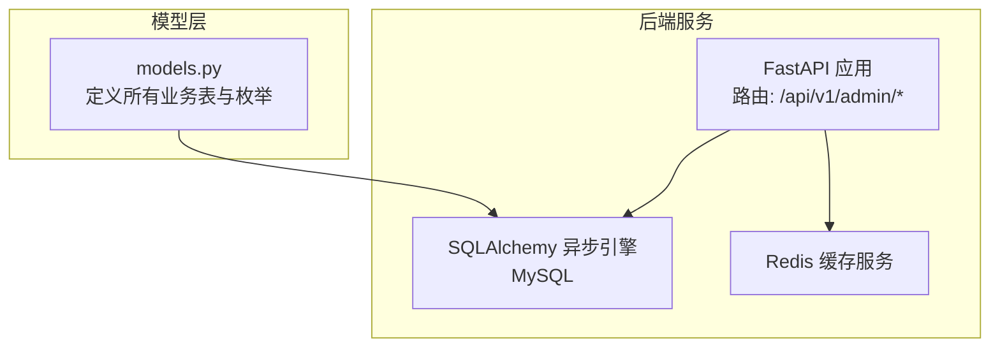
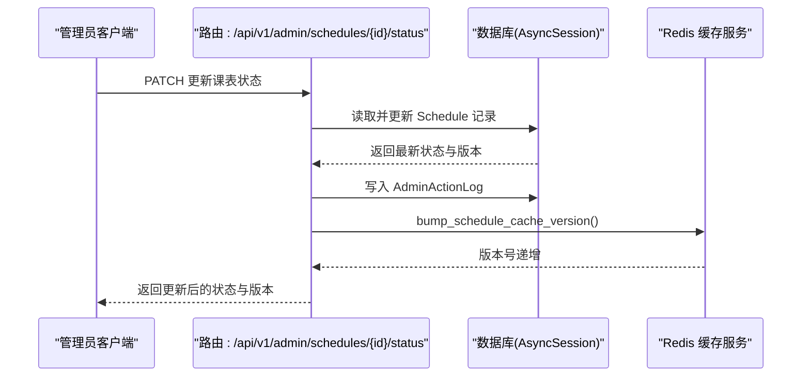
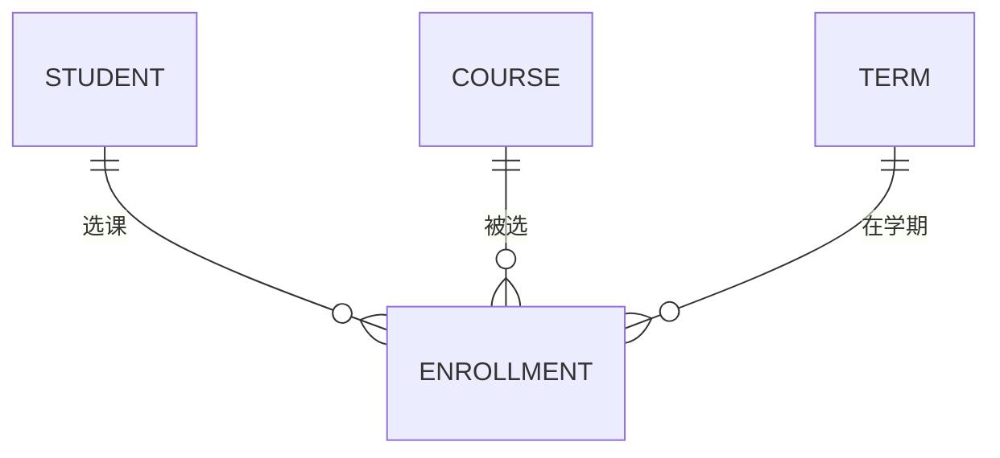
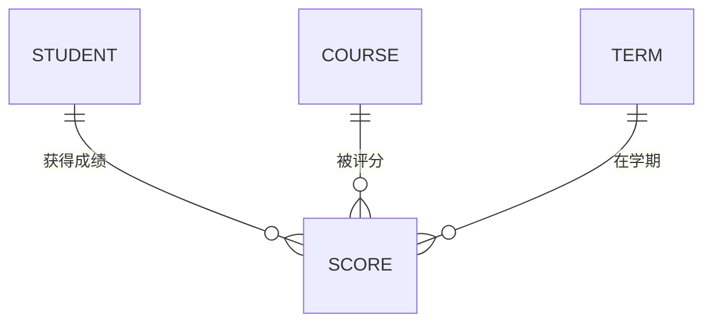
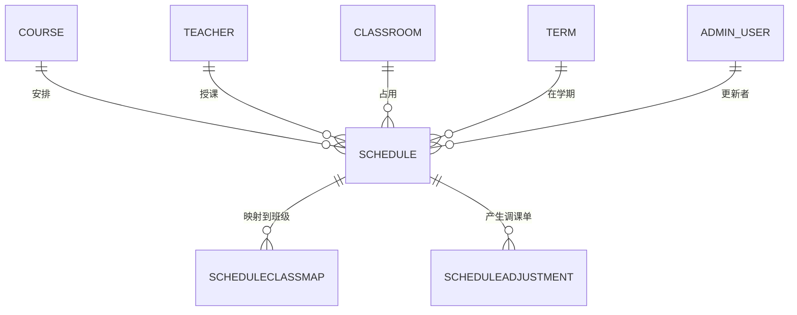
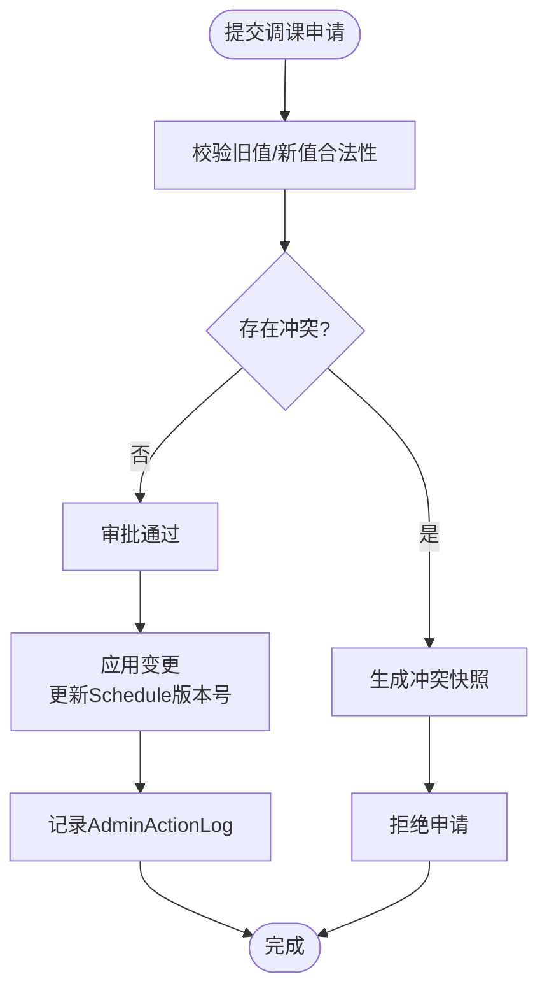
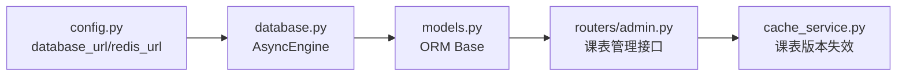

# 教务管理表

<cite>
**本文引用的文件**
- [models.py](file://service/ai_assistant/app/models/models.py)
- [database.py](file://service/ai_assistant/app/database.py)
- [admin.py](file://service/ai_assistant/app/routers/admin.py)
- [cache_service.py](file://service/ai_assistant/app/services/cache_service.py)
- [config.py](file://service/ai_assistant/app/config.py)
</cite>

## 目录
1. [引言](#引言)
2. [项目结构](#项目结构)
3. [核心组件](#核心组件)
4. [架构总览](#架构总览)
5. [详细组件分析](#详细组件分析)
6. [依赖分析](#依赖分析)
7. [性能考虑](#性能考虑)
8. [故障排查指南](#故障排查指南)
9. [结论](#结论)
10. [附录](#附录)

## 引言
本文件面向AI校园助手项目的教务管理模块，系统化梳理并解释以下核心表的设计与业务支撑能力：
- 选课表（Enrollment）
- 成绩表（Score）
- 课程安排表（Schedule）
- 排课-班级映射表（ScheduleClassMap）
- 调课单表（ScheduleAdjustment）

重点覆盖：
- 多对多关系的实现（学生-课程、课程安排-班级）
- 关键业务流程（选课、成绩录入与查询、课程时间安排、教室分配、调课申请与审批、冲突检测、版本控制）
- 字段说明、业务规则与约束条件
- 前后端交互与缓存策略在教务场景中的应用

## 项目结构
后端采用FastAPI + SQLAlchemy ORM + MySQL + Redis的组合，数据库通过异步引擎访问，模型定义集中在统一的ORM基类中，路由层提供管理员端的课表管理接口，缓存服务负责课表相关查询的版本化失效。



图表来源
- [admin.py:1-388](file://service/ai_assistant/app/routers/admin.py#L1-L388)
- [models.py:1-660](file://service/ai_assistant/app/models/models.py#L1-L660)
- [database.py:1-35](file://service/ai_assistant/app/database.py#L1-L35)
- [cache_service.py:1-177](file://service/ai_assistant/app/services/cache_service.py#L1-L177)

章节来源
- [admin.py:1-388](file://service/ai_assistant/app/routers/admin.py#L1-L388)
- [models.py:1-660](file://service/ai_assistant/app/models/models.py#L1-L660)
- [database.py:1-35](file://service/ai_assistant/app/database.py#L1-L35)
- [cache_service.py:1-177](file://service/ai_assistant/app/services/cache_service.py#L1-L177)
- [config.py:1-113](file://service/ai_assistant/app/config.py#L1-L113)

## 核心组件
- 选课表（Enrollment）：记录学生在特定学期选择某门课程的记录，支持唯一性约束防止重复选课。
- 成绩表（Score）：记录学生某学期某课程的成绩、是否获得学分、是否存在作弊等状态。
- 课程安排表（Schedule）：记录课程在具体时间、地点、教师的安排，并支持状态与版本控制。
- 排课-班级映射表（ScheduleClassMap）：实现“课程安排”与“班级”的多对多映射。
- 调课单表（ScheduleAdjustment）：记录调课申请、审批、执行与回滚的完整生命周期，包含冲突快照与预期版本控制。

章节来源
- [models.py:342-480](file://service/ai_assistant/app/models/models.py#L342-L480)
- [models.py:482-514](file://service/ai_assistant/app/models/models.py#L482-L514)
- [models.py:516-623](file://service/ai_assistant/app/models/models.py#L516-L623)

## 架构总览
教务管理的数据流围绕“学生-课程-安排-班级-教师-教室-学期”展开，管理员通过路由接口对课表进行状态变更与查询，系统通过索引与约束保障并发一致性，同时利用Redis版本号实现课表查询缓存的即时失效。



图表来源
- [admin.py:304-387](file://service/ai_assistant/app/routers/admin.py#L304-L387)
- [cache_service.py:78-82](file://service/ai_assistant/app/services/cache_service.py#L78-L82)

章节来源
- [admin.py:304-387](file://service/ai_assistant/app/routers/admin.py#L304-L387)
- [cache_service.py:70-82](file://service/ai_assistant/app/services/cache_service.py#L70-L82)

## 详细组件分析

### 选课表（Enrollment）
- 设计要点
  - 主键自增，外键关联学生、课程、学期。
  - 唯一约束保证“同一学生在同学期不能重复选择同一课程”，避免重复选课。
  - 提供按课程+学期的复合索引，便于筛选与统计。
- 业务支撑
  - 支撑学生选课、退课、查询已选课程。
  - 与成绩表配合，确保成绩仅对应有效选课记录。
- 字段与约束
  - 唯一性：student_id + course_id + term_id
  - 索引：course_id + term_id
- 复杂度
  - 查询复杂度受索引影响，典型按课程/学期过滤为O(logN)+扫描结果集。
  - 插入/删除受唯一约束限制，需注意并发冲突处理。



图表来源
- [models.py:342-367](file://service/ai_assistant/app/models/models.py#L342-L367)

章节来源
- [models.py:342-367](file://service/ai_assistant/app/models/models.py#L342-L367)

### 成绩表（Score）
- 设计要点
  - 记录学生某学期某课程的分数、是否获得学分、是否存在作弊标记。
  - 唯一约束保证“同一学生在同学期同课程仅有一条成绩记录”。
  - 分数范围校验（0~100），确保数据质量。
- 业务支撑
  - 支撑成绩录入、修改、查询、统计与学分判定。
  - 与选课表关联，确保仅对有效选课记录产生成绩。
- 字段与约束
  - 唯一性：student_id + course_id + term_id
  - 分数范围：0~100
  - 索引：course_id + term_id
- 复杂度
  - 查询与更新均受唯一约束与索引保护，插入/更新冲突概率低。



图表来源
- [models.py:370-402](file://service/ai_assistant/app/models/models.py#L370-L402)

章节来源
- [models.py:370-402](file://service/ai_assistant/app/models/models.py#L370-L402)

### 课程安排表（Schedule）
- 设计要点
  - 标识课程在某学期的具体时间、地点、教师安排。
  - 状态字段支持“启用/停用”，版本字段用于并发控制与审计。
  - 多处复合索引覆盖学期+课程、教师+时间、教室+时间、状态+时间等高频查询维度。
  - 多个CheckConstraint保障时间与周次的有效性。
- 业务支撑
  - 支撑课程时间安排、教室分配、教师排课。
  - 与调课单表配合，实现调课申请与审批。
- 字段与约束
  - 索引：term+course、term+teacher+周+日+起始节、term+room+周+日+起始节、term+status+周+日+起始节
  - 约束：周次范围、星期范围、起止节次合法性
- 复杂度
  - 查询复杂度由索引决定；更新涉及版本号递增与状态切换，需注意并发冲突。



图表来源
- [models.py:404-480](file://service/ai_assistant/app/models/models.py#L404-L480)

章节来源
- [models.py:404-480](file://service/ai_assistant/app/models/models.py#L404-L480)

### 排课-班级映射表（ScheduleClassMap）
- 设计要点
  - 复合主键（schedule_id, class_id），实现课程安排与班级的多对多映射。
  - 记录创建时间与创建人，便于审计。
  - 索引优化按班级查询与按班级+安排查询。
- 业务支撑
  - 支撑“某课程安排覆盖哪些班级”、“某班级在某周的课表”等查询。
- 字段与约束
  - 索引：class_id、class_id+schedule_id
- 复杂度
  - 查询按班级过滤高效；批量同步时注意外键级联删除策略。

```mermaid
erDiagram
SCHEDULE ||--o{ SCHEDULECLASSMAP : "映射"
CLASS ||--o{ SCHEDULECLASSMAP : "被映射"
ADMIN_USER ||--o{ SCHEDULECLASSMAP : "创建者"
```

图表来源
- [models.py:482-514](file://service/ai_assistant/app/models/models.py#L482-L514)

章节来源
- [models.py:482-514](file://service/ai_assistant/app/models/models.py#L482-L514)

### 调课单表（ScheduleAdjustment）
- 设计要点
  - 记录调课申请的完整生命周期：待处理、已应用、已拒绝、已回滚。
  - 支持多种操作类型：调课、换教室、换教师、取消、恢复。
  - 保存“旧值”与“新值”，并记录预期版本号，用于并发冲突检测。
  - 冲突快照字段用于记录冲突时的上下文信息。
  - 多个索引覆盖按学期状态、按安排时间、按申请人时间的查询。
  - 多个CheckConstraint保障旧值与新值的时间/空间合法性。
- 业务支撑
  - 支撑调课申请提交、审批、执行与回滚。
  - 支撑冲突检测与版本控制，避免并发修改导致的数据不一致。
- 字段与约束
  - 索引：term+status+requested_at、schedule_id+requested_at、requested_by_admin_id+requested_at
  - 约束：旧值/新值的星期、起止节次、周次范围合法性
- 复杂度
  - 审批流程涉及状态机转换与版本号比对，需谨慎处理并发。



图表来源
- [models.py:516-623](file://service/ai_assistant/app/models/models.py#L516-L623)

章节来源
- [models.py:516-623](file://service/ai_assistant/app/models/models.py#L516-L623)

## 依赖分析
- 数据库连接
  - 异步MySQL引擎通过配置类拼接URL，支持池化与预检。
- 模型依赖
  - 所有业务表继承统一的ORM基类，共享元数据与命名约定。
- 路由依赖
  - 管理员路由依赖模型与Schema，提供课表列表、状态更新等接口。
- 缓存依赖
  - 管理员更新课表状态后，递增课表缓存版本号，使后续课表相关查询命中失效。



图表来源
- [config.py:85-100](file://service/ai_assistant/app/config.py#L85-L100)
- [database.py:7-20](file://service/ai_assistant/app/database.py#L7-L20)
- [models.py:23](file://service/ai_assistant/app/models/models.py#L23)
- [admin.py:12-46](file://service/ai_assistant/app/routers/admin.py#L12-L46)
- [cache_service.py:78-82](file://service/ai_assistant/app/services/cache_service.py#L78-L82)

章节来源
- [config.py:85-100](file://service/ai_assistant/app/config.py#L85-L100)
- [database.py:7-20](file://service/ai_assistant/app/database.py#L7-L20)
- [models.py:23](file://service/ai_assistant/app/models/models.py#L23)
- [admin.py:12-46](file://service/ai_assistant/app/routers/admin.py#L12-L46)
- [cache_service.py:78-82](file://service/ai_assistant/app/services/cache_service.py#L78-L82)

## 性能考虑
- 索引策略
  - 课程安排表在多个高频查询维度建立复合索引，显著降低过滤成本。
  - 选课表与成绩表在“课程+学期”维度建立索引，提升统计与查询效率。
- 并发控制
  - 课程安排表使用版本号与状态字段，结合管理员操作日志，实现可审计的并发更新。
- 缓存策略
  - 课表相关查询命中Redis缓存，管理员更新课表后递增版本号，确保查询结果实时性。
- 数据约束
  - 多处CheckConstraint在入库阶段拦截非法数据，减少后续修复成本。

[本节为通用性能建议，无需列出具体文件来源]

## 故障排查指南
- 选课重复
  - 现象：插入选课记录时报唯一约束冲突。
  - 排查：确认student_id+course_id+term_id是否已存在；检查学期是否正确。
- 成绩异常
  - 现象：插入/更新成绩失败或分数越界。
  - 排查：确认分数范围是否在0~100；检查是否已有该记录。
- 课表状态更新失败
  - 现象：更新课表状态无变化或报错。
  - 排查：确认schedule_id是否存在；检查版本号是否被其他管理员更新；查看AdminActionLog。
- 调课申请冲突
  - 现象：调课申请被拒绝或提示冲突。
  - 排查：查看冲突快照字段；核对教师/教室在同一时间的占用情况；确认expected_schedule_version是否匹配。
- 缓存命中异常
  - 现象：课表查询结果未随管理员调整而更新。
  - 排查：确认管理员是否成功更新课表并触发版本号递增；检查Redis键空间与版本号。

章节来源
- [models.py:359-362](file://service/ai_assistant/app/models/models.py#L359-L362)
- [models.py:391-397](file://service/ai_assistant/app/models/models.py#L391-L397)
- [models.py:443-465](file://service/ai_assistant/app/models/models.py#L443-L465)
- [models.py:591-609](file://service/ai_assistant/app/models/models.py#L591-L609)
- [cache_service.py:78-82](file://service/ai_assistant/app/services/cache_service.py#L78-L82)

## 结论
本设计通过清晰的实体关系、完善的索引与约束、以及版本化与审计机制，有效支撑了AI校园助手的教务管理需求。选课、成绩、排课、调课等关键流程均有明确的数据结构与业务规则保障，同时结合缓存版本控制确保查询结果的实时性与一致性。建议在生产环境中持续监控索引命中率与并发冲突率，适时优化索引与查询策略。

[本节为总结性内容，无需列出具体文件来源]

## 附录

### 字段与业务规则速查
- 选课表（Enrollment）
  - 唯一性：student_id + course_id + term_id
  - 索引：course_id + term_id
- 成绩表（Score）
  - 唯一性：student_id + course_id + term_id
  - 分数范围：0~100
  - 索引：course_id + term_id
- 课程安排表（Schedule）
  - 索引：term+course、term+teacher+周+日+起始节、term+room+周+日+起始节、term+status+周+日+起始节
  - 约束：day_of_week∈[1,7]、week_no∈[1,30]、start_period≤end_period
- 排课-班级映射表（ScheduleClassMap）
  - 索引：class_id、class_id+schedule_id
- 调课单表（ScheduleAdjustment）
  - 索引：term+status+requested_at、schedule_id+requested_at、requested_by_admin_id+requested_at
  - 约束：old/new的day_of_week与period合法性

章节来源
- [models.py:359-362](file://service/ai_assistant/app/models/models.py#L359-L362)
- [models.py:391-397](file://service/ai_assistant/app/models/models.py#L391-L397)
- [models.py:443-465](file://service/ai_assistant/app/models/models.py#L443-L465)
- [models.py:591-609](file://service/ai_assistant/app/models/models.py#L591-L609)