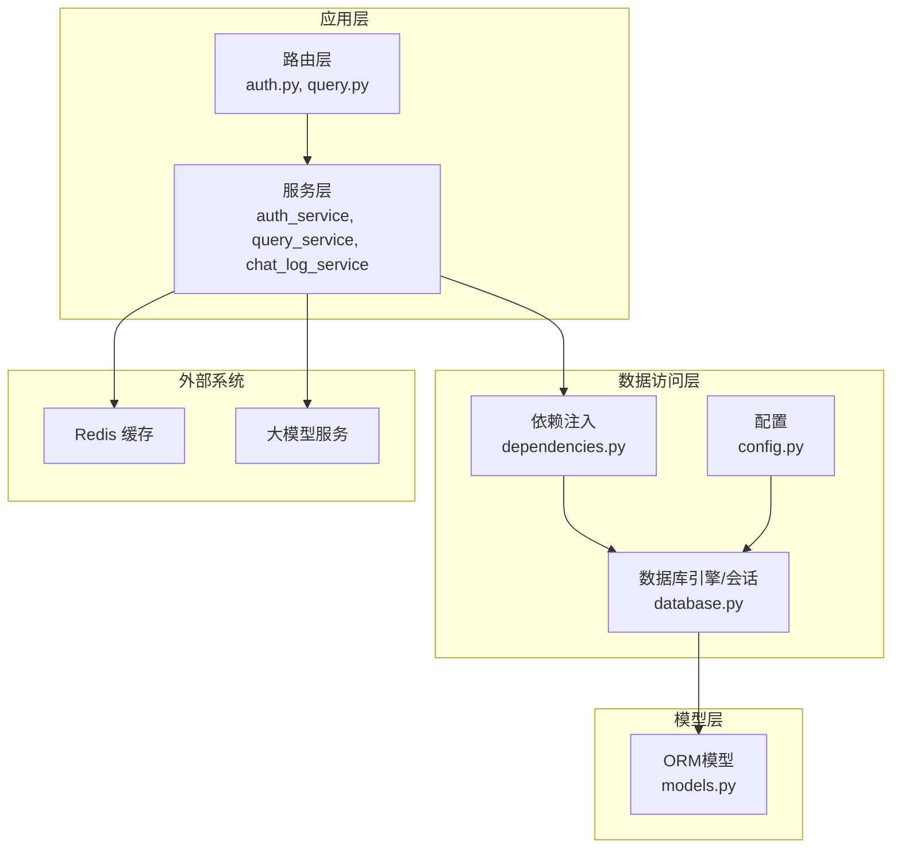
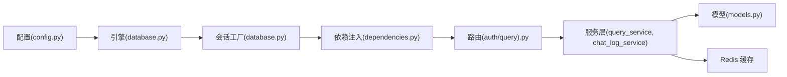

# 数据库约束与索引

<cite>
**本文档引用的文件**
- [models.py](file://service/ai_assistant/app/models/models.py)
- [database.py](file://service/ai_assistant/app/database.py)
- [config.py](file://service/ai_assistant/app/config.py)
- [dependencies.py](file://service/ai_assistant/app/dependencies.py)
- [auth.py](file://service/ai_assistant/app/routers/auth.py)
- [query.py](file://service/ai_assistant/app/routers/query.py)
- [chat_log_service.py](file://service/ai_assistant/app/services/chat_log_service.py)
- [query_service.py](file://service/ai_assistant/app/services/query_service.py)
</cite>

## 目录
1. [简介](#简介)
2. [项目结构](#项目结构)
3. [核心组件](#核心组件)
4. [架构总览](#架构总览)
5. [详细组件分析](#详细组件分析)
6. [依赖分析](#依赖分析)
7. [性能考量](#性能考量)
8. [故障排查指南](#故障排查指南)
9. [结论](#结论)
10. [附录](#附录)

## 简介
本文件面向AI校园助手项目的数据库约束与索引设计，系统梳理项目中使用的各类约束（唯一约束、检查约束、外键约束）与索引（单列索引、复合索引）的设计理念、应用场景与性能影响。通过对模型定义与查询路径的分析，帮助开发者理解如何在保证数据完整性的同时，优化查询性能并应对高并发场景。

## 项目结构
项目采用FastAPI + SQLAlchemy Async + MySQL的后端架构，数据库层通过Declarative Base定义实体模型，配合多种约束与索引保障数据一致性与查询效率。



图表来源
- [auth.py:1-102](file://service/ai_assistant/app/routers/auth.py#L1-L102)
- [query.py:1-788](file://service/ai_assistant/app/routers/query.py#L1-L788)
- [dependencies.py:1-109](file://service/ai_assistant/app/dependencies.py#L1-L109)
- [database.py:1-35](file://service/ai_assistant/app/database.py#L1-L35)
- [config.py:1-113](file://service/ai_assistant/app/config.py#L1-L113)
- [models.py:1-660](file://service/ai_assistant/app/models/models.py#L1-L660)

章节来源
- [database.py:1-35](file://service/ai_assistant/app/database.py#L1-L35)
- [config.py:85-91](file://service/ai_assistant/app/config.py#L85-L91)

## 核心组件
本项目数据库约束与索引主要集中在模型定义文件中，覆盖以下关键实体：
- 管理员与审计：AdminUser、AdminActionLog
- 机构与人员：Department、Major、Class、Teacher、Student
- 学期与课程：Term、Course、Classroom
- 选课与成绩：Enrollment、Score
- 课表与调课：Schedule、ScheduleClassMap、ScheduleAdjustment
- 对话日志：ChatLog

章节来源
- [models.py:41-660](file://service/ai_assistant/app/models/models.py#L41-L660)

## 架构总览
数据库约束与索引贯穿于实体模型定义与查询路径，确保：
- 数据完整性：通过唯一约束、检查约束、外键约束防止脏数据与不一致。
- 查询性能：通过单列/复合索引优化常见查询条件，减少全表扫描。
- 并发安全：结合外键级联与索引覆盖，降低锁竞争与死锁风险。

```mermaid
classDiagram
class AdminUser {
+admin_id
+admin_code
+username
+role
+status
+created_at
+updated_at
}
class AdminActionLog {
+action_log_id
+admin_id
+action_type
+target_table
+target_pk
+created_at
}
class Department {
+dept_id
+name
}
class Major {
+major_id
+name
+dept_id
}
class Class {
+class_id
+name
+major_id
+grade
}
class Teacher {
+teacher_id
+name
+dept_id
}
class Student {
+student_id
+name
+class_id
+enroll_year
+status
}
class Term {
+term_id
+start_date
+end_date
}
class Course {
+course_id
+course_name
+credit
+course_type
}
class Classroom {
+room_id
+location
+capacity
+room_type
}
class Enrollment {
+enrollment_id
+student_id
+course_id
+term_id
}
class Score {
+score_id
+student_id
+course_id
+term_id
+score
+credit_earned
+cheating
}
class Schedule {
+schedule_id
+course_id
+teacher_id
+room_id
+term_id
+week_no
+day_of_week
+start_period
+end_period
+schedule_status
+version
+updated_by_admin_id
+updated_at
}
class ScheduleClassMap {
+schedule_id
+class_id
+created_at
+created_by_admin_id
}
class ScheduleAdjustment {
+adjustment_id
+schedule_id
+term_id
+operation_type
+status
+expected_schedule_version
+requested_by_admin_id
+approved_by_admin_id
+requested_at
+approved_at
+applied_at
+conflict_snapshot
}
class ChatLog {
+log_id
+did
+student_id
+timestamp
+sender
+message_content
+system_action
+response_time_ms
}
AdminUser "1" <-- "many" AdminActionLog : "外键"
Department "1" <-- "many" Major : "外键"
Major "1" <-- "many" Class : "外键"
Department "1" <-- "many" Teacher : "外键"
Class "1" <-- "many" Student : "外键"
Student "1" <-- "many" Enrollment : "外键"
Course "1" <-- "many" Enrollment : "外键"
Term "1" <-- "many" Enrollment : "外键"
Student "1" <-- "many" Score : "外键"
Course "1" <-- "many" Score : "外键"
Term "1" <-- "many" Score : "外键"
Course "1" <-- "many" Schedule : "外键"
Teacher "1" <-- "many" Schedule : "外键"
Classroom "1" <-- "many" Schedule : "外键"
Term "1" <-- "many" Schedule : "外键"
AdminUser "1" <-- "many" Schedule "外键(可空)"
Schedule "1" <-- "many" ScheduleClassMap : "外键(级联)"
Class "1" <-- "many" ScheduleClassMap : "外键"
AdminUser "1" <-- "many" ScheduleClassMap "外键(可空)"
Schedule "1" <-- "many" ScheduleAdjustment : "外键"
Term "1" <-- "many" ScheduleAdjustment : "外键"
AdminUser "1" <-- "many" ScheduleAdjustment "外键(可空)"
AdminUser "1" <-- "many" ScheduleAdjustment "外键(可空)"
```

图表来源
- [models.py:41-660](file://service/ai_assistant/app/models/models.py#L41-L660)

## 详细组件分析

### 约束类型与应用场景

#### 唯一约束（UniqueConstraint）
- 设计目的：保证业务主键或组合键的唯一性，避免重复数据。
- 典型场景：
  - 管理员：admin_code、username 唯一
  - 院系：name 唯一
  - 专业：(dept_id, name) 唯一
  - 班级：(major_id, grade, name) 唯一
  - 选课：(student_id, course_id, term_id) 唯一
  - 成绩：(student_id, course_id, term_id) 唯一
- 影响与收益：
  - 防止重复注册/重复记录
  - 作为查询的强过滤条件，提升定位效率
  - 与索引协同，避免重复索引

章节来源
- [models.py:59-63](file://service/ai_assistant/app/models/models.py#L59-L63)
- [models.py:123-123](file://service/ai_assistant/app/models/models.py#L123-L123)
- [models.py:143-146](file://service/ai_assistant/app/models/models.py#L143-L146)
- [models.py:165-168](file://service/ai_assistant/app/models/models.py#L165-L168)
- [models.py:359-362](file://service/ai_assistant/app/models/models.py#L359-L362)
- [models.py:391-397](file://service/ai_assistant/app/models/models.py#L391-L397)

#### 检查约束（CheckConstraint）
- 设计目的：在数据库层面强制业务规则，确保数据合法性。
- 典型场景：
  - 学期：start_date < end_date
  - 课程：credit > 0
  - 教室：capacity > 0
  - 成绩：0 <= score <= 100
  - 课表：day_of_week ∈ [1,7]、start_period <= end_period、week_no ∈ [1,30]
  - 调课：old/new 时间区间合法性
- 影响与收益：
  - 提升数据质量，减少应用层校验负担
  - 在批量导入或直接SQL插入时提供强约束
  - 注意：检查约束可能影响写入性能，需权衡

章节来源
- [models.py:214-216](file://service/ai_assistant/app/models/models.py#L214-L216)
- [models.py:252-255](file://service/ai_assistant/app/models/models.py#L252-L255)
- [models.py:292-295](file://service/ai_assistant/app/models/models.py#L292-L295)
- [models.py:396-396](file://service/ai_assistant/app/models/models.py#L396-L396)
- [models.py:457-465](file://service/ai_assistant/app/models/models.py#L457-L465)
- [models.py:595-609](file://service/ai_assistant/app/models/models.py#L595-L609)

#### 外键约束（ForeignKey）
- 设计目的：维护实体间引用完整性，确保删除/更新的一致性。
- 典型场景：
  - 学生 -> 班级、选课 -> 学生/课程/学期、成绩 -> 学生/课程/学期
  - 课表 -> 课程/教师/教室/学期、调课 -> 课表/学期、调课映射 -> 管理员
  - 管理员审计 -> 管理员
- 级联策略：
  - ON UPDATE CASCADE：主键变更时自动同步
  - ON DELETE SET NULL：删除主表记录时允许从表字段置空（如调课审批人）
  - CASCADE：删除主表记录时级联删除从表（如课表-班级映射）

章节来源
- [models.py:93-96](file://service/ai_assistant/app/models/models.py#L93-L96)
- [models.py:139-141](file://service/ai_assistant/app/models/models.py#L139-L141)
- [models.py:160-162](file://service/ai_assistant/app/models/models.py#L160-L162)
- [models.py:186-188](file://service/ai_assistant/app/models/models.py#L186-L188)
- [models.py:349-357](file://service/ai_assistant/app/models/models.py#L349-L357)
- [models.py:376-384](file://service/ai_assistant/app/models/models.py#L376-L384)
- [models.py:416-427](file://service/ai_assistant/app/models/models.py#L416-L427)
- [models.py:437-440](file://service/ai_assistant/app/models/models.py#L437-L440)
- [models.py:489-496](file://service/ai_assistant/app/models/models.py#L489-L496)
- [models.py:537-549](file://service/ai_assistant/app/models/models.py#L537-L549)
- [models.py:573-581](file://service/ai_assistant/app/models/models.py#L573-L581)

### 索引策略与设计原则

#### 单列索引
- 设计原则：针对高频过滤、排序、连接的单列建立索引。
- 典型列：
  - 管理员：role、status（复合索引 idx_admin_role_status）
  - 院系：dept_id（教师、专业）
  - 学生：class_id、enroll_year
  - 课程：course_name
  - 教室：location
  - 选课/成绩：course_id、term_id（复合索引）
  - 课表：term_id、course_id（复合索引）
  - 调课：term_id、status、requested_at（复合索引）
  - 审计：admin_id、created_at（复合索引）
  - 对话：did、timestamp、system_action、student_id
- 性能考虑：
  - 单列索引简单高效，适合等值/范围查询
  - 需避免过度索引导致写入放大

章节来源
- [models.py:62-62](file://service/ai_assistant/app/models/models.py#L62-L62)
- [models.py:145-145](file://service/ai_assistant/app/models/models.py#L145-L145)
- [models.py:194-194](file://service/ai_assistant/app/models/models.py#L194-L194)
- [models.py:331-333](file://service/ai_assistant/app/models/models.py#L331-L333)
- [models.py:253-253](file://service/ai_assistant/app/models/models.py#L253-L253)
- [models.py:293-293](file://service/ai_assistant/app/models/models.py#L293-L293)
- [models.py:361-361](file://service/ai_assistant/app/models/models.py#L361-L361)
- [models.py:395-395](file://service/ai_assistant/app/models/models.py#L395-L395)
- [models.py:444-444](file://service/ai_assistant/app/models/models.py#L444-L444)
- [models.py:591-591](file://service/ai_assistant/app/models/models.py#L591-L591)
- [models.py:107-108](file://service/ai_assistant/app/models/models.py#L107-L108)
- [models.py:655-659](file://service/ai_assistant/app/models/models.py#L655-L659)

#### 复合索引
- 设计原则：将经常共同出现在WHERE/JOIN/ORDER BY的列组合成复合索引，遵循“左前缀原则”。
- 典型组合：
  - 管理员：role、status
  - 课表：term_id、course_id
  - 课表：term_id、teacher_id、week_no、day_of_week、start_period
  - 课表：term_id、room_id、week_no、day_of_week、start_period
  - 课表：term_id、schedule_status、week_no、day_of_week、start_period
  - 选课：course_id、term_id
  - 成绩：course_id、term_id
  - 调课：term_id、status、requested_at
  - 调课：schedule_id、requested_at
  - 调课：requested_by_admin_id、requested_at
  - 课表-班级映射：class_id、schedule_id
  - 审计：admin_id、created_at
  - 审计：target_table、target_pk、created_at
  - 对话：did、timestamp
  - 对话：system_action
  - 对话：student_id
- 性能考虑：
  - 复合索引显著提升多条件查询效率
  - 注意索引顺序与查询谓词匹配度，避免回表过多

章节来源
- [models.py:62-62](file://service/ai_assistant/app/models/models.py#L62-L62)
- [models.py:444-456](file://service/ai_assistant/app/models/models.py#L444-L456)
- [models.py:361-361](file://service/ai_assistant/app/models/models.py#L361-L361)
- [models.py:395-395](file://service/ai_assistant/app/models/models.py#L395-L395)
- [models.py:591-595](file://service/ai_assistant/app/models/models.py#L591-L595)
- [models.py:107-109](file://service/ai_assistant/app/models/models.py#L107-L109)
- [models.py:655-659](file://service/ai_assistant/app/models/models.py#L655-L659)

#### 部分索引（部分满足）
- 设计原则：对具有明确过滤范围或高选择性的列组合建立索引，减少索引体积与维护成本。
- 典型场景：
  - 课表按学期、状态、时间维度建立复合索引，便于快速筛选活跃课表
  - 成绩按课程+学期建立索引，便于查询某课程某学期的成绩分布
  - 审计按管理员+时间建立索引，便于审计追踪
- 性能考虑：
  - 部分索引可降低索引大小，提高写入吞吐
  - 需结合查询模式评估选择性与覆盖度

章节来源
- [models.py:444-465](file://service/ai_assistant/app/models/models.py#L444-L465)
- [models.py:391-397](file://service/ai_assistant/app/models/models.py#L391-L397)
- [models.py:106-109](file://service/ai_assistant/app/models/models.py#L106-L109)
- [models.py:655-659](file://service/ai_assistant/app/models/models.py#L655-L659)

### 查询路径与约束/索引协同

#### 登录与密码修改（认证）
- 关键路径：路由 -> 依赖注入 -> 服务 -> 数据库
- 约束/索引作用：
  - 管理员唯一约束（admin_code、username）保障登录凭据唯一
  - 学生唯一约束（主键）保障身份标识唯一
  - 索引覆盖常用查询条件（如按用户名/学号查询）
- 并发与性能：
  - 登录/密码修改属于高并发场景，建议结合连接池与索引优化

章节来源
- [auth.py:1-102](file://service/ai_assistant/app/routers/auth.py#L1-L102)
- [dependencies.py:27-31](file://service/ai_assistant/app/dependencies.py#L27-L31)
- [models.py:59-63](file://service/ai_assistant/app/models/models.py#L59-L63)

#### 查询执行（结构化/向量/混合）
- 关键路径：路由 -> 依赖注入 -> 安全/意图/检索 -> 数据库 -> 缓存 -> 日志
- 约束/索引作用：
  - 外键保证跨表关联的完整性（如课表-教师/教室/学期）
  - 唯一约束避免重复记录（选课、成绩）
  - 检查约束确保数值范围合法（成绩、课表时间）
  - 复合索引加速常见查询（课表按学期+时间、成绩按课程+学期）
- 并发与性能：
  - 查询端并发较高，建议：
    - 使用连接池与事务管理
    - 将非关键写入延迟至流式结束后
    - 利用索引覆盖减少回表

章节来源
- [query.py:1-788](file://service/ai_assistant/app/routers/query.py#L1-L788)
- [chat_log_service.py:1-76](file://service/ai_assistant/app/services/chat_log_service.py#L1-L76)
- [query_service.py:1-200](file://service/ai_assistant/app/services/query_service.py#L1-L200)
- [models.py:444-465](file://service/ai_assistant/app/models/models.py#L444-L465)
- [models.py:391-397](file://service/ai_assistant/app/models/models.py#L391-L397)

## 依赖分析
- 数据库引擎与会话：通过异步引擎与会话工厂提供连接池能力，支持预检与回收策略。
- 配置驱动：数据库URL由配置类动态拼接，便于环境切换。
- 依赖注入：统一的数据库会话依赖，确保路由与服务层一致的事务边界。
- 外部系统：Redis用于缓存与会话历史，减轻数据库压力；大模型服务用于意图与回答生成。



图表来源
- [config.py:85-91](file://service/ai_assistant/app/config.py#L85-L91)
- [database.py:7-20](file://service/ai_assistant/app/database.py#L7-L20)
- [dependencies.py:27-31](file://service/ai_assistant/app/dependencies.py#L27-L31)
- [auth.py:1-102](file://service/ai_assistant/app/routers/auth.py#L1-L102)
- [query.py:1-788](file://service/ai_assistant/app/routers/query.py#L1-L788)
- [chat_log_service.py:1-76](file://service/ai_assistant/app/services/chat_log_service.py#L1-L76)
- [query_service.py:1-200](file://service/ai_assistant/app/services/query_service.py#L1-L200)
- [models.py:1-660](file://service/ai_assistant/app/models/models.py#L1-L660)

章节来源
- [config.py:85-91](file://service/ai_assistant/app/config.py#L85-L91)
- [database.py:1-35](file://service/ai_assistant/app/database.py#L1-L35)
- [dependencies.py:1-109](file://service/ai_assistant/app/dependencies.py#L1-L109)

## 性能考量
- 写入性能
  - 唯一约束与检查约束会在写入时增加校验开销，建议在批量导入时临时禁用约束或使用批量插入策略
  - 复合索引数量与顺序需平衡，避免过度索引导致写入放大
- 读取性能
  - 复合索引优先匹配查询谓词的最左前缀，确保查询计划命中索引
  - 对高选择性列组合建立索引，减少回表与排序
- 并发与锁
  - 外键级联更新/删除可能引发锁竞争，建议在高并发场景下控制批量操作粒度
  - 使用连接池与事务管理，避免长时间持有连接
- 缓存与降级
  - Redis缓存可显著降低数据库压力，建议对热点查询进行缓存
  - 当Redis不可用时，路由层具备降级到数据库的历史加载能力

[本节为通用指导，不直接分析特定文件]

## 故障排查指南
- 唯一约束冲突
  - 现象：插入/更新时报唯一约束冲突
  - 排查：确认唯一键组合是否重复，检查业务逻辑是否允许重复
  - 参考：管理员、院系、专业、班级、选课、成绩等唯一约束
- 检查约束失败
  - 现象：插入/更新时报检查约束失败
  - 排查：核对数值范围与业务规则（如成绩、课表时间、学期日期）
  - 参考：学期日期、课程学分、教室容量、成绩范围、课表时间区间
- 外键约束失败
  - 现象：删除/更新主表记录时报外键约束失败
  - 排查：确认从表是否存在引用；必要时调整级联策略或先清理从表
  - 参考：课表-班级映射、调课-课表/学期、审计-管理员等
- 查询性能问题
  - 现象：查询慢或回表频繁
  - 排查：确认查询条件是否命中复合索引最左前缀；评估索引选择性
  - 参考：课表、选课、成绩、审计、对话等复合索引
- 并发与锁问题
  - 现象：高并发下出现锁等待或死锁
  - 排查：减少长事务、控制批量操作粒度、合理使用连接池
  - 参考：依赖注入与会话管理

章节来源
- [models.py:59-63](file://service/ai_assistant/app/models/models.py#L59-L63)
- [models.py:214-216](file://service/ai_assistant/app/models/models.py#L214-L216)
- [models.py:252-255](file://service/ai_assistant/app/models/models.py#L252-L255)
- [models.py:292-295](file://service/ai_assistant/app/models/models.py#L292-L295)
- [models.py:396-396](file://service/ai_assistant/app/models/models.py#L396-L396)
- [models.py:457-465](file://service/ai_assistant/app/models/models.py#L457-L465)
- [models.py:595-609](file://service/ai_assistant/app/models/models.py#L595-L609)
- [dependencies.py:27-31](file://service/ai_assistant/app/dependencies.py#L27-L31)

## 结论
本项目通过完善的约束与索引设计，在保证数据完整性与业务规则的前提下，兼顾了查询性能与并发稳定性。建议在后续演进中：
- 持续监控查询计划与索引使用情况，定期优化低效索引
- 在批量导入场景下评估约束与索引的启用策略
- 结合业务增长趋势，动态调整索引组合与外键级联策略

[本节为总结性内容，不直接分析特定文件]

## 附录

### 约束与索引清单（按实体）
- 管理员与审计
  - 唯一约束：admin_code、username
  - 复合索引：role、status；admin_id、created_at；target_table、target_pk、created_at
- 院系与专业
  - 唯一约束：department.name；major(dept_id, name)
  - 单列索引：dept_id（教师、专业）
- 班级与学生
  - 唯一约束：(major_id, grade, name)
  - 单列索引：class_id、enroll_year
- 课程与教室
  - 单列索引：course_name、location
  - 检查约束：credit > 0；capacity > 0
- 选课与成绩
  - 唯一约束：(student_id, course_id, term_id)
  - 复合索引：course_id、term_id
  - 检查约束：0 <= score <= 100
- 课表与调课
  - 复合索引：term_id、course_id；term_id、teacher_id、week_no、day_of_week、start_period；term_id、room_id、week_no、day_of_week、start_period；term_id、schedule_status、week_no、day_of_week、start_period
  - 检查约束：day_of_week ∈ [1,7]、start_period <= end_period、week_no ∈ [1,30]；old/new 时间区间合法性
- 对话日志
  - 复合索引：did、timestamp；system_action；student_id

章节来源
- [models.py:59-63](file://service/ai_assistant/app/models/models.py#L59-L63)
- [models.py:123-123](file://service/ai_assistant/app/models/models.py#L123-L123)
- [models.py:143-146](file://service/ai_assistant/app/models/models.py#L143-L146)
- [models.py:165-168](file://service/ai_assistant/app/models/models.py#L165-L168)
- [models.py:252-255](file://service/ai_assistant/app/models/models.py#L252-L255)
- [models.py:292-295](file://service/ai_assistant/app/models/models.py#L292-L295)
- [models.py:359-362](file://service/ai_assistant/app/models/models.py#L359-L362)
- [models.py:391-397](file://service/ai_assistant/app/models/models.py#L391-L397)
- [models.py:444-465](file://service/ai_assistant/app/models/models.py#L444-L465)
- [models.py:591-609](file://service/ai_assistant/app/models/models.py#L591-L609)
- [models.py:655-659](file://service/ai_assistant/app/models/models.py#L655-L659)