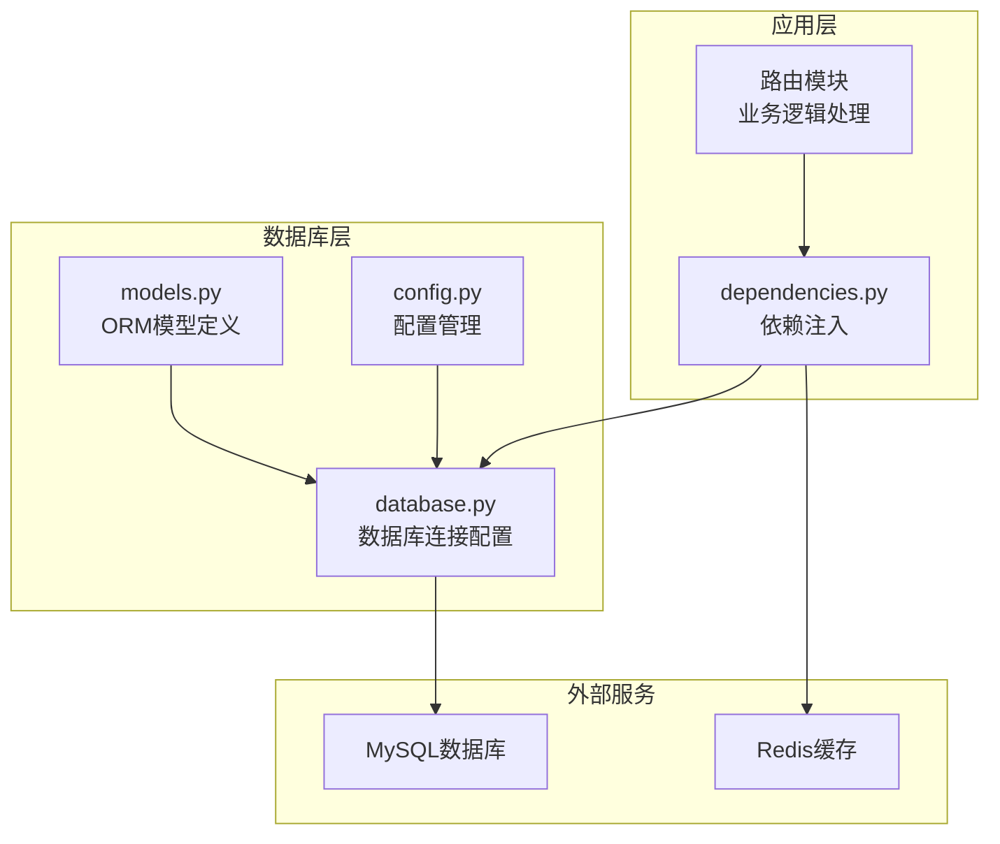
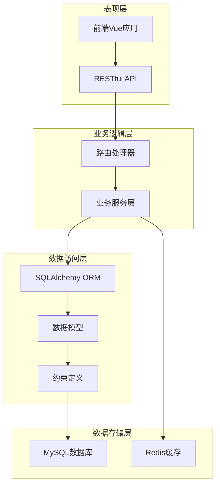
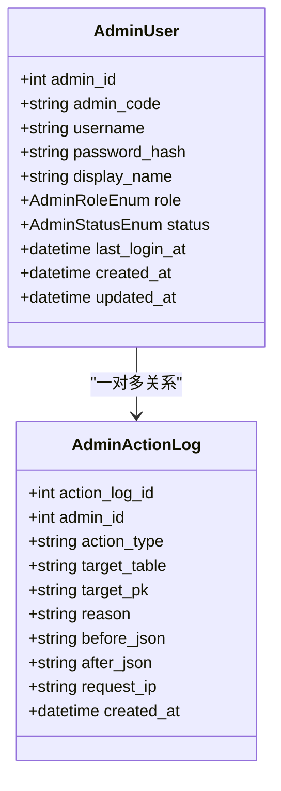
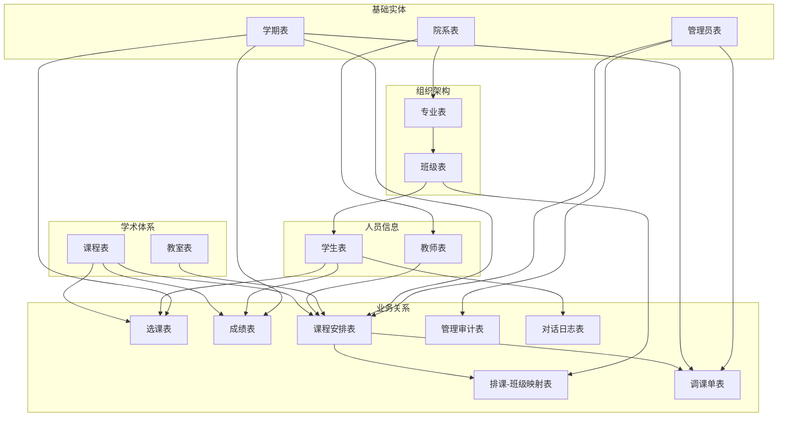

# 数据库设计

<cite>
**本文档引用的文件**
- [models.py](file://service/ai_assistant/app/models/models.py)
- [database.py](file://service/ai_assistant/app/database.py)
- [config.py](file://service/ai_assistant/app/config.py)
- [dependencies.py](file://service/ai_assistant/app/dependencies.py)
</cite>

## 目录
1. [简介](#简介)
2. [项目结构](#项目结构)
3. [核心组件](#核心组件)
4. [架构概览](#架构概览)
5. [详细组件分析](#详细组件分析)
6. [依赖关系分析](#依赖关系分析)
7. [性能考虑](#性能考虑)
8. [故障排除指南](#故障排除指南)
9. [结论](#结论)

## 简介

AI校园助手项目采用基于SQLAlchemy ORM的数据库设计方案，使用MySQL作为主要存储引擎，通过异步数据库连接提供高性能的数据访问能力。该数据库设计围绕校园管理的核心业务需求，构建了一个完整的教育管理系统数据模型，涵盖了管理员管理、院系组织、专业设置、班级管理、教师信息、学生档案、课程体系、成绩管理和课表调度等多个核心业务领域。

## 项目结构

项目采用分层架构设计，数据库相关的核心文件分布如下：



**图表来源**
- [models.py:1-660](file://service/ai_assistant/app/models/models.py#L1-L660)
- [database.py:1-35](file://service/ai_assistant/app/database.py#L1-L35)
- [config.py:1-113](file://service/ai_assistant/app/config.py#L1-L113)

**章节来源**
- [models.py:1-660](file://service/ai_assistant/app/models/models.py#L1-L660)
- [database.py:1-35](file://service/ai_assistant/app/database.py#L1-L35)
- [config.py:1-113](file://service/ai_assistant/app/config.py#L1-L113)

## 核心组件

### 数据库连接配置

系统使用SQLAlchemy异步引擎进行数据库连接管理，支持连接池预检查和自动回收机制：

- **异步引擎配置**：使用`aiomysql`驱动程序，支持异步数据库操作
- **连接池参数**：启用`pool_pre_ping`确保连接有效性，`pool_recycle=3600`防止连接过期
- **调试模式**：根据`DEBUG`设置控制SQL语句输出
- **字符集**：使用`utf8mb4`支持完整的Unicode字符

### ORM基类设计

通过继承`DeclarativeBase`创建统一的ORM基类，所有模型共享相同的元数据管理和表结构定义能力。

**章节来源**
- [database.py:7-24](file://service/ai_assistant/app/database.py#L7-L24)
- [config.py:85-91](file://service/ai_assistant/app/config.py#L85-L91)

## 架构概览

系统采用三层架构设计，从底层的数据库层到上层的应用逻辑层形成清晰的层次结构：



**图表来源**
- [models.py:22-22](file://service/ai_assistant/app/models/models.py#L22-L22)
- [database.py:1-35](file://service/ai_assistant/app/database.py#L1-L35)
- [dependencies.py:27-30](file://service/ai_assistant/app/dependencies.py#L27-L30)

## 详细组件分析

### 管理员管理系统

管理员系统是整个校园管理的核心，负责权限控制和系统维护。

#### 管理员表 (AdminUser)

管理员表定义了系统的超级管理员、排课管理员、安全管理员和只读管理员四种角色：



**图表来源**
- [models.py:41-84](file://service/ai_assistant/app/models/models.py#L41-L84)
- [models.py:86-112](file://service/ai_assistant/app/models/models.py#L86-L112)

**字段定义**：
- `admin_id`：自增主键，使用`BigInteger`类型确保足够的ID空间
- `admin_code`：管理员工号，唯一约束确保编号唯一性
- `username`：用户名，唯一约束保证用户标识唯一
- `password_hash`：密码哈希值，存储加密后的密码
- `display_name`：显示名称，用于界面展示
- `role`：管理员角色枚举，支持四种不同权限级别
- `status`：账户状态枚举，支持激活、禁用、锁定状态

**约束策略**：
- 唯一约束：`uk_admin_code`、`uk_admin_username`
- 索引优化：复合索引`idx_admin_role_status`用于角色和状态查询

#### 管理审计表 (AdminActionLog)

审计表记录管理员的所有操作历史，支持数据变更追踪和合规审计：

**字段定义**：
- `action_log_id`：审计日志ID，自增主键
- `admin_id`：关联管理员ID，外键约束确保数据完整性
- `action_type`：操作类型，记录具体执行的操作
- `target_table`：目标表名，记录受影响的数据表
- `target_pk`：目标主键值，记录被操作的具体记录
- `reason`：操作原因，支持审计追踪
- `before_json`：操作前数据快照
- `after_json`：操作后数据快照
- `request_ip`：请求IP地址，用于安全审计

**索引策略**：
- `idx_action_admin_time`：管理员ID和时间的复合索引
- `idx_action_target`：目标表和主键的复合索引

**章节来源**
- [models.py:41-112](file://service/ai_assistant/app/models/models.py#L41-L112)

### 组织架构管理

校园组织架构采用三级管理体系：院系-专业-班级，形成清晰的层级关系。

#### 院系表 (Department)

```mermaid
erDiagram
DEPARTMENT {
string dept_id PK
string name UK
}
MAJOR {
string major_id PK
string name
string dept_id FK
}
CLASS {
string class_id PK
string name
string major_id FK
int grade
}
DEPARTMENT ||--o{ MAJOR : "拥有"
MAJOR ||--o{ CLASS : "包含"
```

**图表来源**
- [models.py:117-129](file://service/ai_assistant/app/models/models.py#L117-L129)
- [models.py:134-149](file://service/ai_assistant/app/models/models.py#L134-L149)
- [models.py:155-174](file://service/ai_assistant/app/models/models.py#L155-L174)

**字段定义**：
- `dept_id`：院系ID，使用字符串类型便于扩展
- `name`：院系名称，唯一约束确保名称唯一性

**约束策略**：
- 唯一约束：`uk_department_name`确保院系名称唯一

#### 专业表 (Major)

**字段定义**：
- `major_id`：专业ID，主键
- `name`：专业名称
- `dept_id`：所属院系ID，外键关联

**约束策略**：
- 唯一约束：`uk_major_dept_name`确保同一院系下专业名称唯一
- 索引：`idx_major_dept_id`优化院系查询

#### 班级表 (Class)

**字段定义**：
- `class_id`：班级ID，主键
- `name`：班级名称
- `major_id`：所属专业ID，外键关联
- `grade`：年级信息

**约束策略**：
- 唯一约束：`uk_class_major_grade_name`确保同专业同年级同名称的班级唯一
- 索引：`idx_class_major_id`优化专业查询

**章节来源**
- [models.py:117-174](file://service/ai_assistant/app/models/models.py#L117-L174)

### 师生信息管理

#### 教师表 (Teacher)

教师信息管理涵盖基本资料、联系方式和教学相关信息：

**字段定义**：
- `teacher_id`：教师工号，主键
- `name`：姓名
- `title`：职称
- `dept_id`：所属院系
- `phone`：联系电话
- `email`：电子邮箱
- `office_hours`：办公时间
- `office_room`：办公室房间号

**索引策略**：
- `idx_teacher_dept_id`：优化院系查询效率

#### 学生表 (Student)

学生信息管理包含基本信息、学籍状态和身份认证：

**字段定义**：
- `student_id`：学号，主键
- `name`：姓名
- `gender`：性别
- `date_of_birth`：出生日期
- `enroll_year`：入学年份
- `class_id`：所属班级
- `phone`：联系电话
- `email`：电子邮箱
- `status`：学籍状态枚举
- `password_hash`：密码哈希值

**索引策略**：
- `idx_student_class_id`：优化班级查询
- `idx_student_enroll_year`：优化按入学年份查询

**章节来源**
- [models.py:180-202](file://service/ai_assistant/app/models/models.py#L180-L202)
- [models.py:312-340](file://service/ai_assistant/app/models/models.py#L312-L340)

### 学术体系管理

#### 学期表 (Term)

学期管理定义了学年的起止时间和学术周期：

**字段定义**：
- `term_id`：学期ID，主键
- `start_date`：学期开始日期
- `end_date`：学期结束日期

**约束策略**：
- 检查约束：`ck_term_dates`确保开始日期早于结束日期

#### 课程表 (Course)

课程体系管理涵盖课程基本信息、学分和课程类型：

**字段定义**：
- `course_id`：课程ID，主键
- `course_name`：课程名称
- `credit`：学分数
- `course_type`：课程类型枚举（公共必修、专业必修、专业选修）

**约束策略**：
- 检查约束：`ck_course_credit`确保学分大于0
- 索引：`idx_course_course_name`优化课程名称查询

#### 教室表 (Classroom)

教室资源管理包含教室基本信息和容量限制：

**字段定义**：
- `room_id`：教室ID，主键
- `room_type`：教室类型枚举（普通教室、计算机机房、实验室等）
- `location`：教室位置
- `capacity`：容纳人数

**约束策略**：
- 检查约束：`ck_classroom_capacity`确保容量大于0
- 索引：`idx_classroom_location`优化位置查询

**章节来源**
- [models.py:207-226](file://service/ai_assistant/app/models/models.py#L207-L226)
- [models.py:237-264](file://service/ai_assistant/app/models/models.py#L237-L264)
- [models.py:277-300](file://service/ai_assistant/app/models/models.py#L277-L300)

### 成绩与选课管理

#### 选课表 (Enrollment)

选课管理实现了学生与课程的一对多关系，支持跨学期选课：

**字段定义**：
- `enrollment_id`：选课记录ID，自增主键
- `student_id`：学生ID
- `course_id`：课程ID
- `term_id`：学期ID

**约束策略**：
- 唯一约束：`uk_enrollment`确保同一学生在同一学期不能重复选择同一课程
- 索引：`idx_enrollment_course_term`优化课程和学期组合查询

#### 成绩表 (Score)

成绩管理支持多学期、多课程的成绩记录和统计：

**字段定义**：
- `score_id`：成绩记录ID，自增主键
- `student_id`：学生ID
- `course_id`：课程ID
- `term_id`：学期ID
- `score`：成绩数值，默认0分
- `credit_earned`：是否获得学分（布尔值）
- `cheating`：是否存在作弊行为（布尔值）

**约束策略**：
- 唯一约束：`uk_score_student_course_term`确保同一学生在特定课程和学期的成绩唯一性
- 检查约束：`ck_score_range`确保成绩在0-100分范围内
- 索引：`idx_score_course_term`优化课程和学期查询

**章节来源**
- [models.py:345-367](file://service/ai_assistant/app/models/models.py#L345-L367)
- [models.py:372-402](file://service/ai_assistant/app/models/models.py#L372-L402)

### 课表调度系统

#### 课程安排表 (Schedule)

课表调度系统是整个数据库的核心，管理课程的时间、地点和人员安排：

**字段定义**：
- `schedule_id`：课表ID，主键
- `course_id`：课程ID
- `teacher_id`：授课教师ID
- `room_id`：教室ID
- `term_id`：学期ID
- `week_no`：周次（1-30周）
- `day_of_week`：星期几（1-7）
- `start_period`：开始节次
- `end_period`：结束节次
- `week_pattern`：周次模式
- `schedule_status`：课表状态枚举（有效、取消）
- `version`：版本号，支持并发控制
- `updated_by_admin_id`：最后更新管理员ID
- `updated_at`：更新时间

**约束策略**：
- 检查约束：`ck_schedule_day_of_week`确保星期数在1-7范围内
- 检查约束：`ck_schedule_periods`确保节次顺序正确且有效
- 检查约束：`ck_schedule_week_no`确保周次在合理范围内
- 复合索引：多个复合索引优化不同维度的查询需求

#### 排课-班级映射表 (ScheduleClassMap)

实现课程与班级之间的多对多关系，支持一门课程同时面向多个班级的情况：

**字段定义**：
- `schedule_id`：课表ID，主键的一部分
- `class_id`：班级ID，主键的一部分
- `created_at`：创建时间
- `created_by_admin_id`：创建管理员ID

**约束策略**：
- 索引：`idx_scm_class`和`idx_scm_class_schedule`优化查询性能

#### 调课单表 (ScheduleAdjustment)

调课管理系统支持课表调整申请、审批和执行的完整流程：

**字段定义**：
- `adjustment_id`：调课单ID，自增主键
- `schedule_id`：关联的课表ID
- `term_id`：学期ID
- `operation_type`：操作类型枚举（移动、换教室、换教师、取消、恢复）
- `reason`：调整原因
- `status`：状态枚举（待处理、已应用、已拒绝、已回滚）
- `expected_schedule_version`：期望的版本号
- `old_*`：旧状态字段（周次、星期、节次、教室、教师）
- `new_*`：新状态字段（可为空表示取消）
- `requested_by_admin_id`：申请人ID
- `approved_by_admin_id`：审批人ID
- `requested_at`：申请时间
- `approved_at`：审批时间
- `applied_at`：执行时间
- `rollback_of_adjustment_id`：回滚关联ID
- `conflict_snapshot`：冲突快照

**约束策略**：
- 复合索引：多个索引优化不同查询场景
- 检查约束：严格的约束确保数据一致性

**章节来源**
- [models.py:412-480](file://service/ai_assistant/app/models/models.py#L412-L480)
- [models.py:485-514](file://service/ai_assistant/app/models/models.py#L485-L514)
- [models.py:534-623](file://service/ai_assistant/app/models/models.py#L534-L623)

### 对话日志系统

#### 对话日志表 (ChatLog)

对话日志系统记录AI助手与用户之间的交互历史：

**字段定义**：
- `log_id`：日志ID，自增主键
- `did`：设备ID
- `student_id`：学生ID（可为空）
- `timestamp`：时间戳
- `sender`：发送者枚举（学生、代理、系统）
- `message_content`：消息内容
- `system_action`：系统动作枚举（无、标记危险、举报、屏蔽）
- `response_time_ms`：响应时间（毫秒）

**约束策略**：
- 多个索引优化不同维度的查询需求

**章节来源**
- [models.py:641-660](file://service/ai_assistant/app/models/models.py#L641-L660)

## 依赖关系分析

系统中的数据模型之间形成了复杂而有序的依赖关系网络：



**图表来源**
- [models.py:41-660](file://service/ai_assistant/app/models/models.py#L41-L660)

### 外键关系分析

系统中的外键关系遵循以下设计原则：

1. **级联更新**：大部分外键使用`onupdate="CASCADE"`确保数据一致性
2. **级联删除**：部分关系使用`ondelete="SET NULL"`避免数据丢失
3. **业务约束**：关键关系强制要求非空约束

### 约束完整性分析

系统实现了多层次的数据完整性约束：

1. **实体完整性**：所有主键字段都设置了非空约束
2. **参照完整性**：通过外键约束确保引用关系的有效性
3. **域完整性**：通过检查约束和数据类型限制确保数据范围合理
4. **用户定义完整性**：通过唯一约束和业务规则约束确保业务逻辑正确

**章节来源**
- [models.py:59-63](file://service/ai_assistant/app/models/models.py#L59-L63)
- [models.py:139-146](file://service/ai_assistant/app/models/models.py#L139-L146)
- [models.py:359-362](file://service/ai_assistant/app/models/models.py#L359-L362)

## 性能考虑

### 索引策略

系统采用了精心设计的索引策略来优化查询性能：

1. **主键索引**：所有主键字段自动创建聚簇索引
2. **唯一索引**：用于保证业务唯一性的字段创建唯一索引
3. **复合索引**：针对常用查询组合创建复合索引
4. **部分索引**：针对特定条件的查询创建条件索引

### 查询优化

1. **连接查询优化**：通过合理的表连接顺序减少查询成本
2. **子查询优化**：使用EXISTS替代IN提高查询效率
3. **批量操作**：支持批量插入和更新操作
4. **缓存策略**：结合Redis实现热点数据缓存

### 数据类型选择

1. **ID字段**：使用`BigInteger`确保足够大的ID空间
2. **枚举字段**：使用`Enum`类型确保数据一致性
3. **时间字段**：使用`DateTime`精确记录时间信息
4. **文本字段**：使用`Text`类型支持长文本存储

## 故障排除指南

### 常见问题诊断

1. **连接超时问题**：检查`pool_recycle`参数设置和网络连接状态
2. **死锁问题**：分析事务锁等待情况，优化事务提交顺序
3. **索引失效**：检查查询条件是否匹配现有索引
4. **内存溢出**：监控大结果集查询，使用分页查询

### 数据一致性检查

1. **外键约束检查**：定期验证外键关系的完整性
2. **唯一约束检查**：验证业务唯一性约束的有效性
3. **检查约束验证**：确保数据范围约束得到遵守
4. **数据类型验证**：检查字段类型转换的正确性

### 性能监控指标

1. **查询响应时间**：监控慢查询的执行时间
2. **连接池利用率**：跟踪连接池的使用情况
3. **索引命中率**：评估索引使用的有效性
4. **磁盘IO性能**：监控数据库文件的读写性能

**章节来源**
- [database.py:7-20](file://service/ai_assistant/app/database.py#L7-L20)
- [config.py:85-91](file://service/ai_assistant/app/config.py#L85-L91)

## 结论

AI校园助手项目的数据库设计体现了现代企业级应用的最佳实践，通过合理的实体关系设计、完善的约束机制和优化的索引策略，构建了一个功能完整、性能优良、易于维护的教育管理系统数据模型。

该设计的主要特点包括：

1. **完整的业务覆盖**：涵盖了从基础信息管理到高级调度功能的完整业务流程
2. **严格的数据完整性**：通过多层次的约束确保数据质量和业务逻辑正确性
3. **优秀的性能设计**：精心设计的索引策略和查询优化方案
4. **良好的扩展性**：模块化的表结构设计便于未来功能扩展
5. **完善的审计机制**：完整的操作日志和数据变更追踪功能

通过这个数据库设计，系统能够高效地支持校园管理的各项业务需求，为AI校园助手提供了坚实的数据基础。