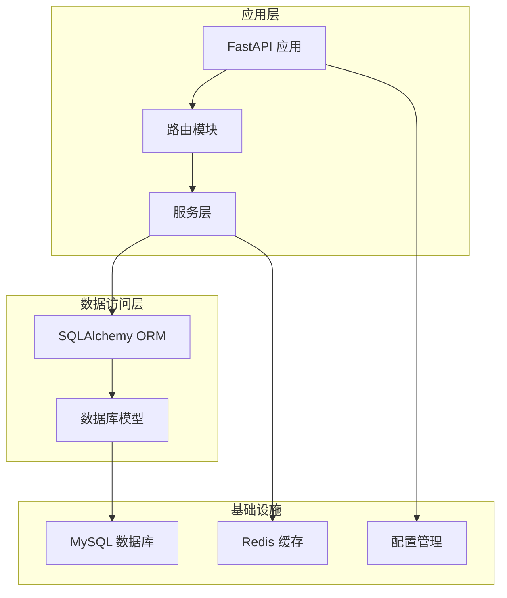
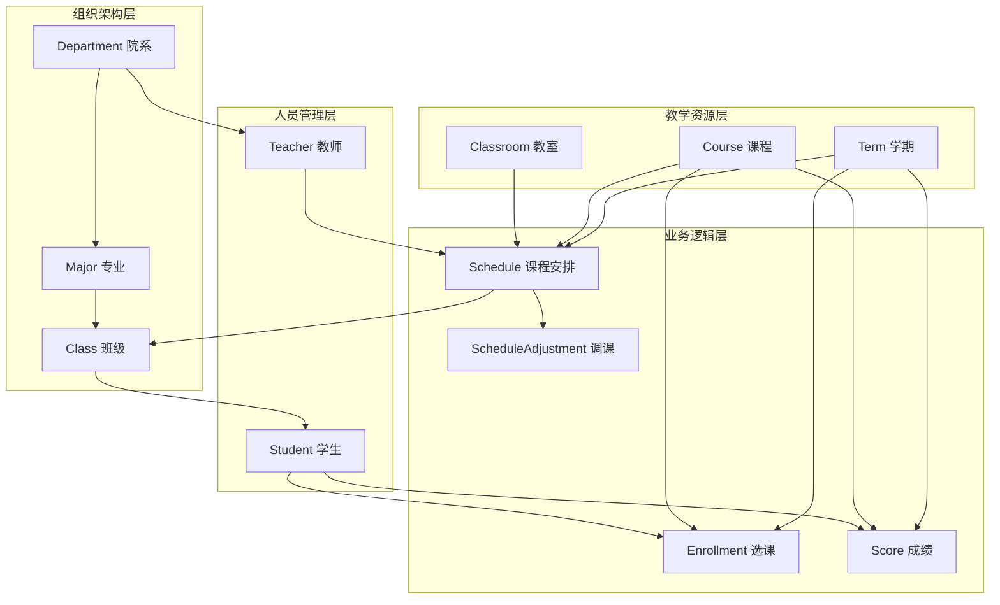

# 核心业务实体表

<cite>
**本文档引用的文件**
- [models.py](file://service/ai_assistant/app/models/models.py)
- [database.py](file://service/ai_assistant/app/database.py)
- [config.py](file://service/ai_assistant/app/config.py)
- [admin.py](file://service/ai_assistant/app/routers/admin.py)
- [auth_service.py](file://service/ai_assistant/app/services/auth_service.py)
</cite>

## 目录
1. [简介](#简介)
2. [项目结构概述](#项目结构概述)
3. [核心业务实体总览](#核心业务实体总览)
4. [数据库架构设计](#数据库架构设计)
5. [详细实体设计](#详细实体设计)
6. [实体关系分析](#实体关系分析)
7. [索引与性能优化](#索引与性能优化)
8. [业务规则与约束](#业务规则与约束)
9. [数据完整性保障](#数据完整性保障)
10. [总结](#总结)

## 简介

AI校园助手项目是一个基于FastAPI和SQLAlchemy构建的现代化校园管理系统。该系统通过精心设计的数据库实体表，实现了对校园核心业务的完整覆盖，包括管理员管理、院系专业班级组织结构、教师管理、学生管理、课程体系、学期管理以及智能排课等功能。

本设计文档深入解析了系统的核心业务实体表，详细说明了每个表的字段定义、数据类型选择、主键外键约束和业务逻辑，为开发者提供了完整的数据库设计参考。

## 项目结构概述

系统采用分层架构设计，核心业务逻辑集中在`app/models/models.py`文件中，通过SQLAlchemy ORM映射到MySQL数据库。整个项目结构清晰，职责分离明确：



**图表来源**
- [main.py:52-86](file://service/ai_assistant/app/main.py#L52-L86)
- [database.py:7-25](file://service/ai_assistant/app/database.py#L7-L25)

**章节来源**
- [main.py:1-86](file://service/ai_assistant/app/main.py#L1-L86)
- [database.py:1-35](file://service/ai_assistant/app/database.py#L1-L35)

## 核心业务实体总览

系统包含12个核心业务实体表，按照功能域分为以下几类：

### 管理员与权限控制
- **管理员表** (AdminUser): 系统管理员用户管理
- **管理员操作日志表** (AdminActionLog): 管理员操作审计

### 组织架构管理
- **院系表** (Department): 学院/系部组织管理
- **专业表** (Major): 专业学科管理
- **班级表** (Class): 教学班管理

### 师生人员管理
- **教师表** (Teacher): 教师信息管理
- **学生表** (Student): 学生信息管理

### 教学资源管理
- **课程表** (Course): 课程信息管理
- **学期表** (Term): 学期周期管理
- **教室表** (Classroom): 教学场所管理

### 选课与成绩管理
- **选课表** (Enrollment): 学生选课记录
- **成绩表** (Score): 学生成绩管理

### 排课与调度管理
- **课程安排表** (Schedule): 课程时间安排
- **排课-班级映射表** (ScheduleClassMap): 课程与班级关联
- **调课申请表** (ScheduleAdjustment): 课程调度变更

**章节来源**
- [models.py:41-660](file://service/ai_assistant/app/models/models.py#L41-L660)

## 数据库架构设计

系统采用异步MySQL数据库连接，使用SQLAlchemy 2.0的现代化ORM特性：

```mermaid
erDiagram
ADMIN_USER ||--o{ ADMIN_ACTION_LOG : "记录"
DEPARTMENT ||--o{ MAJOR : "包含"
MAJOR ||--o{ CLASS : "包含"
CLASS ||--o{ STUDENT : "包含"
DEPARTMENT ||--o{ TEACHER : "包含"
TERM ||--o{ ENROLLMENT : "管理"
COURSE ||--o{ ENROLLMENT : "被选修"
STUDENT ||--o{ ENROLLMENT : "选修"
TERM ||--o{ SCORE : "记录"
COURSE ||--o{ SCORE : "产生"
STUDENT ||--o{ SCORE : "获得"
TERM ||--o{ SCHEDULE : "管理"
COURSE ||--o{ SCHEDULE : "安排"
TEACHER ||--o{ SCHEDULE : "教授"
ROOM ||--o{ SCHEDULE : "使用"
CLASS ||--o{ SCHEDULE_CLASS_MAP : "关联"
SCHEDULE ||--o{ SCHEDULE_CLASS_MAP : "映射"
SCHEDULE ||--o{ SCHEDULE_ADJUSTMENT : "变更"
```

**图表来源**
- [models.py:117-660](file://service/ai_assistant/app/models/models.py#L117-L660)

### 数据库连接配置

系统使用异步MySQL连接池，支持连接预检查和自动回收：

- **驱动**: mysql+aiomysql
- **字符集**: utf8mb4
- **连接池**: 预检查启用，回收时间3600秒
- **调试模式**: 可通过DEBUG环境变量控制

**章节来源**
- [config.py:85-91](file://service/ai_assistant/app/config.py#L85-L91)
- [database.py:7-20](file://service/ai_assistant/app/database.py#L7-L20)

## 详细实体设计

### 管理员表 (AdminUser)

管理员表是系统权限控制的核心，负责存储管理员用户的基本信息和权限状态。

#### 字段定义

| 字段名 | 类型 | 约束 | 描述 |
|--------|------|------|------|
| admin_id | BigInteger | 主键, 自增 | 管理员唯一标识 |
| admin_code | String(32) | 非空, 唯一 | 管理员工号 |
| username | String(64) | 非空, 唯一 | 登录用户名 |
| password_hash | String(255) | 非空 | 密码哈希值 |
| display_name | String(100) | 非空 | 显示名称 |
| role | Enum | 非空, 默认scheduler_admin | 管理员角色 |
| status | Enum | 非空, 默认active | 账户状态 |
| last_login_at | DateTime | 可空 | 最后登录时间 |
| created_at | DateTime | 非空 | 创建时间 |
| updated_at | DateTime | 非空 | 更新时间 |

#### 角色枚举
- **super_admin**: 超级管理员
- **scheduler_admin**: 排课管理员
- **security_admin**: 安全管理员
- **readonly_admin**: 只读管理员

#### 状态枚举
- **active**: 激活
- **disabled**: 禁用
- **locked**: 锁定

#### 约束与索引
- 唯一约束: admin_code, username
- 复合索引: (role, status)

**章节来源**
- [models.py:41-84](file://service/ai_assistant/app/models/models.py#L41-L84)

### 院系表 (Department)

院系表管理学校的所有教学单位，支持多层级的组织架构。

#### 字段定义

| 字段名 | 类型 | 约束 | 描述 |
|--------|------|------|------|
| dept_id | String(32) | 主键 | 院系唯一标识 |
| name | String(100) | 非空, 唯一 | 院系名称 |

#### 关联关系
- 一对多: Department → Major (department.majors)
- 一对多: Department → Teacher (department.teachers)

#### 约束与索引
- 唯一约束: name
- 关系: 与Major、Teacher双向关联

**章节来源**
- [models.py:117-129](file://service/ai_assistant/app/models/models.py#L117-L129)

### 专业表 (Major)

专业表管理各个院系下的专业设置，支持专业的层次化管理。

#### 字段定义

| 字段名 | 类型 | 约束 | 描述 |
|--------|------|------|------|
| major_id | String(32) | 主键 | 专业唯一标识 |
| name | String(100) | 非空 | 专业名称 |
| dept_id | String(32) | 非空, 外键 | 所属院系ID |

#### 约束与索引
- 唯一约束: (dept_id, name)
- 索引: dept_id
- 外键: dept_id → department.dept_id (CASCADE)

#### 关联关系
- 多对一: Major → Department (major.department)
- 一对多: Major → Class (major.classes)

**章节来源**
- [models.py:134-149](file://service/ai_assistant/app/models/models.py#L134-L149)

### 班级表 (Class)

班级表管理具体的教学班级，是学生管理的基础单位。

#### 字段定义

| 字段名 | 类型 | 约束 | 描述 |
|--------|------|------|------|
| class_id | String(32) | 主键 | 班级唯一标识 |
| name | String(100) | 非空 | 班级名称 |
| major_id | String(32) | 非空, 外键 | 所属专业ID |
| grade | Integer | 非空 | 入学年级 |

#### 约束与索引
- 唯一约束: (major_id, grade, name)
- 索引: major_id
- 外键: major_id → major.major_id (CASCADE)

#### 关联关系
- 多对一: Class → Major (class.major)
- 一对多: Class → Student (class.students)
- 一对多: Class → ScheduleClassMap (class.schedule_mappings)

**章节来源**
- [models.py:155-174](file://service/ai_assistant/app/models/models.py#L155-L174)

### 教师表 (Teacher)

教师表管理所有任课教师的基本信息和联系方式。

#### 字段定义

| 字段名 | 类型 | 约束 | 描述 |
|--------|------|------|------|
| teacher_id | String(32) | 主键 | 教师唯一标识 |
| name | String(100) | 非空 | 教师姓名 |
| title | String(50) | 可空 | 职称 |
| dept_id | String(32) | 非空, 外键 | 所属院系ID |
| phone | String(20) | 可空 | 联系电话 |
| email | String(255) | 可空 | 电子邮箱 |
| office_hours | String(255) | 可空 | 办公时间 |
| office_room | String(100) | 可空 | 办公地点 |

#### 约束与索引
- 索引: dept_id
- 外键: dept_id → department.dept_id (CASCADE)

#### 关联关系
- 多对一: Teacher → Department (teacher.department)
- 一对多: Teacher → Schedule (teacher.schedules)

**章节来源**
- [models.py:180-202](file://service/ai_assistant/app/models/models.py#L180-L202)

### 学生表 (Student)

学生表管理在校学生的完整信息，支持多种状态管理和统计分析。

#### 字段定义

| 字段名 | 类型 | 约束 | 描述 |
|--------|------|------|------|
| student_id | String(32) | 主键 | 学生学号 |
| name | String(100) | 非空 | 学生姓名 |
| gender | String(10) | 非空 | 性别 |
| date_of_birth | Date | 可空 | 出生日期 |
| enroll_year | SmallInteger | 非空 | 入学年份 |
| class_id | String(32) | 非空, 外键 | 所属班级ID |
| phone | String(20) | 可空 | 联系电话 |
| email | String(255) | 可空 | 电子邮箱 |
| status | Enum | 非空, 默认active | 学生状态 |
| password_hash | String(255) | 非空 | 密码哈希值 |

#### 状态枚举
- **active**: 在读
- **suspended**: 停学
- **withdrawn**: 退学
- **graduated**: 毕业

#### 约束与索引
- 索引: class_id
- 索引: enroll_year
- 外键: class_id → class.class_id (CASCADE)

#### 关联关系
- 多对一: Student → Class (student.class_)
- 一对多: Student → Enrollment (student.enrollments)
- 一对多: Student → Score (student.scores)

**章节来源**
- [models.py:312-340](file://service/ai_assistant/app/models/models.py#L312-L340)

### 课程表 (Course)

课程表管理所有开设的课程信息，支持不同类型的课程分类。

#### 字段定义

| 字段名 | 类型 | 约束 | 描述 |
|--------|------|------|------|
| course_id | String(32) | 主键 | 课程唯一标识 |
| course_name | String(255) | 非空 | 课程名称 |
| credit | Integer | 非空 | 学分 |
| course_type | Enum | 非空, 默认专业必修课 | 课程类型 |

#### 课程类型枚举
- **public_required**: 公共必修课
- **major_required**: 专业必修课
- **major_elective**: 专业选修课

#### 约束与索引
- 索引: course_name
- 检查约束: credit > 0

#### 关联关系
- 一对多: Course → Enrollment (course.enrollments)
- 一对多: Course → Score (course.scores)
- 一对多: Course → Schedule (course.schedules)

**章节来源**
- [models.py:237-264](file://service/ai_assistant/app/models/models.py#L237-L264)

### 学期表 (Term)

学期表管理学年的学期周期，是选课和排课的时间基准。

#### 字段定义

| 字段名 | 类型 | 约束 | 描述 |
|--------|------|------|------|
| term_id | String(32) | 主键 | 学期唯一标识 |
| start_date | Date | 非空 | 学期开始日期 |
| end_date | Date | 非空 | 学期结束日期 |

#### 约束与索引
- 检查约束: start_date < end_date

#### 关联关系
- 一对多: Term → Enrollment (term.enrollments)
- 一对多: Term → Score (term.scores)
- 一对多: Term → Schedule (term.schedules)
- 一对多: Term → ScheduleAdjustment (term.adjustments)

**章节来源**
- [models.py:207-226](file://service/ai_assistant/app/models/models.py#L207-L226)

### 教室表 (Classroom)

教室表管理教学场所资源，支持不同类型的教学空间。

#### 字段定义

| 字段名 | 类型 | 约束 | 描述 |
|--------|------|------|------|
| room_id | String(32) | 主键 | 教室唯一标识 |
| room_type | Enum | 非空, 默认普通教室 | 教室类型 |
| location | String(255) | 非空 | 教室位置 |
| capacity | Integer | 非空 | 容纳人数 |

#### 教室类型枚举
- **normal**: 普通教室
- **computer**: 计算机机房
- **lab**: 实验室
- **auditorium**: 阶梯教室
- **other**: 其他

#### 约束与索引
- 索引: location
- 检查约束: capacity > 0

#### 关联关系
- 一对多: Classroom → Schedule (classroom.schedules)

**章节来源**
- [models.py:277-299](file://service/ai_assistant/app/models/models.py#L277-L299)

### 选课表 (Enrollment)

选课表记录学生选课的具体情况，是选课系统的数据核心。

#### 字段定义

| 字段名 | 类型 | 约束 | 描述 |
|--------|------|------|------|
| enrollment_id | Integer | 主键, 自增 | 选课记录ID |
| student_id | String(32) | 非空, 外键 | 学生ID |
| course_id | String(32) | 非空, 外键 | 课程ID |
| term_id | String(32) | 非空, 外键 | 学期ID |

#### 约束与索引
- 唯一约束: (student_id, course_id, term_id)
- 索引: (course_id, term_id)

#### 关联关系
- 多对一: Enrollment → Student (enrollment.student)
- 多对一: Enrollment → Course (enrollment.course)
- 多对一: Enrollment → Term (enrollment.term)

**章节来源**
- [models.py:345-367](file://service/ai_assistant/app/models/models.py#L345-L367)

### 成绩表 (Score)

成绩表管理学生成绩记录，支持成绩的统计和分析。

#### 字段定义

| 字段名 | 类型 | 约束 | 描述 |
|--------|------|------|------|
| score_id | Integer | 主键, 自增 | 成绩记录ID |
| student_id | String(32) | 非空, 外键 | 学生ID |
| course_id | String(32) | 非空, 外键 | 课程ID |
| term_id | String(32) | 非空, 外键 | 学期ID |
| score | Integer | 非空, 默认0 | 成绩分数 (0-100) |
| credit_earned | SmallInteger | 非空, 默认false | 是否获得学分 |
| cheating | SmallInteger | 非空, 默认false | 是否作弊标记 |

#### 约束与索引
- 唯一约束: (student_id, course_id, term_id)
- 索引: (course_id, term_id)
- 检查约束: 0 ≤ score ≤ 100

#### 关联关系
- 多对一: Score → Student (score.student)
- 多对一: Score → Course (score.course)
- 多对一: Score → Term (score.term)

**章节来源**
- [models.py:372-402](file://service/ai_assistant/app/models/models.py#L372-L402)

### 课程安排表 (Schedule)

课程安排表是排课系统的核心，记录具体的课程时间安排。

#### 字段定义

| 字段名 | 类型 | 约束 | 描述 |
|--------|------|------|------|
| schedule_id | String(32) | 主键 | 课程安排ID |
| course_id | String(32) | 非空, 外键 | 课程ID |
| teacher_id | String(32) | 非空, 外键 | 教师ID |
| room_id | String(32) | 非空, 外键 | 教室ID |
| term_id | String(32) | 非空, 外键 | 学期ID |
| week_no | Integer | 非空 | 第几周 (1-30) |
| day_of_week | SmallInteger | 非空 | 星期几 (1-7) |
| start_period | Integer | 非空 | 开始节次 |
| end_period | Integer | 非空 | 结束节次 |
| week_pattern | String(255) | 可空 | 周次模式 |
| schedule_status | Enum | 非空, 默认active | 课表状态 |
| version | Integer | 非空, 默认0 | 版本号 |
| updated_by_admin_id | BigInteger | 可空, 外键 | 更新管理员ID |
| updated_at | DateTime | 非空 | 更新时间 |

#### 状态枚举
- **active**: 正常
- **cancelled**: 取消

#### 约束与索引
- 复合索引: (term_id, course_id)
- 复合索引: (term_id, teacher_id, week_no, day_of_week, start_period)
- 复合索引: (term_id, room_id, week_no, day_of_week, start_period)
- 复合索引: (term_id, schedule_status, week_no, day_of_week, start_period)
- 检查约束: 1 ≤ day_of_week ≤ 7
- 检查约束: start_period ≤ end_period
- 检查约束: 1 ≤ week_no ≤ 30

#### 关联关系
- 多对一: Schedule → Course (schedule.course)
- 多对一: Schedule → Teacher (schedule.teacher)
- 多对一: Schedule → Classroom (schedule.classroom)
- 多对一: Schedule → Term (schedule.term)
- 多对一: Schedule → AdminUser (schedule.updated_by_admin)
- 一对多: Schedule → ScheduleClassMap (schedule.class_mappings)
- 一对多: Schedule → ScheduleAdjustment (schedule.adjustments)

**章节来源**
- [models.py:412-480](file://service/ai_assistant/app/models/models.py#L412-L480)

### 排课-班级映射表 (ScheduleClassMap)

排课-班级映射表建立课程安排与班级之间的多对多关系。

#### 字段定义

| 字段名 | 类型 | 约束 | 描述 |
|--------|------|------|------|
| schedule_id | String(32) | 主键, 外键 | 课程安排ID |
| class_id | String(32) | 主键, 外键 | 班级ID |
| created_at | DateTime | 非空 | 创建时间 |
| created_by_admin_id | BigInteger | 可空, 外键 | 创建管理员ID |

#### 约束与索引
- 索引: class_id
- 索引: (class_id, schedule_id)

#### 关联关系
- 多对一: ScheduleClassMap → Schedule (scheduleClassMap.schedule)
- 多对一: ScheduleClassMap → Class (scheduleClassMap.class_)
- 多对一: ScheduleClassMap → AdminUser (scheduleClassMap.created_by_admin)

**章节来源**
- [models.py:485-514](file://service/ai_assistant/app/models/models.py#L485-L514)

### 调课申请表 (ScheduleAdjustment)

调课申请表管理课程调度的变更申请流程。

#### 字段定义

| 字段名 | 类型 | 约束 | 描述 |
|--------|------|------|------|
| adjustment_id | BigInteger | 主键, 自增 | 调整申请ID |
| schedule_id | String(32) | 非空, 外键 | 课程安排ID |
| term_id | String(32) | 非空, 外键 | 学期ID |
| operation_type | Enum | 非空 | 操作类型 |
| reason | String(255) | 非空 | 申请原因 |
| status | Enum | 非空, 默认pending | 申请状态 |
| expected_schedule_version | Integer | 非空, 默认0 | 期望版本号 |
| old_week_no | Integer | 非空 | 原计划周次 |
| old_day_of_week | SmallInteger | 非空 | 原星期 |
| old_start_period | Integer | 非空 | 原开始节次 |
| old_end_period | Integer | 非空 | 原结束节次 |
| old_room_id | String(32) | 非空 | 原教室ID |
| old_teacher_id | String(32) | 非空 | 原教师ID |
| new_week_no | Integer | 可空 | 新计划周次 |
| new_day_of_week | SmallInteger | 可空 | 新星期 |
| new_start_period | Integer | 可空 | 新开始节次 |
| new_end_period | Integer | 可空 | 新结束节次 |
| new_room_id | String(32) | 可空 | 新教室ID |
| new_teacher_id | String(32) | 可空 | 新教师ID |
| requested_by_admin_id | BigInteger | 非空, 外键 | 申请人ID |
| approved_by_admin_id | BigInteger | 可空, 外键 | 审批人ID |
| requested_at | DateTime | 非空 | 申请时间 |
| approved_at | DateTime | 可空 | 审批时间 |
| applied_at | DateTime | 可空 | 执行时间 |
| rollback_of_adjustment_id | BigInteger | 可空, 外键 | 回滚来源ID |
| conflict_snapshot | Text | 可空 | 冲突快照 |

#### 操作类型枚举
- **move**: 调整时间
- **change_room**: 更换教室
- **change_teacher**: 更换教师
- **cancel**: 取消课程
- **recover**: 恢复课程

#### 状态枚举
- **pending**: 待处理
- **applied**: 已执行
- **rejected**: 已拒绝
- **rolled_back**: 已回滚

#### 约束与索引
- 索引: (term_id, status, requested_at)
- 索引: (schedule_id, requested_at)
- 索引: (requested_by_admin_id, requested_at)
- 检查约束: 1 ≤ old_day_of_week ≤ 7
- 检查约束: start_period ≤ end_period
- 检查约束: new_day_of_week 条件检查

#### 关联关系
- 多对一: ScheduleAdjustment → Schedule (scheduleAdjustment.schedule)
- 多对一: ScheduleAdjustment → Term (scheduleAdjustment.term)
- 多对一: ScheduleAdjustment → AdminUser (scheduleAdjustment.requested_by_admin)
- 多对一: ScheduleAdjustment → AdminUser (scheduleAdjustment.approved_by_admin)

**章节来源**
- [models.py:534-623](file://service/ai_assistant/app/models/models.py#L534-L623)

## 实体关系分析

系统中的实体关系呈现典型的树形组织结构和复杂的多对多关联：



**图表来源**
- [models.py:117-660](file://service/ai_assistant/app/models/models.py#L117-L660)

### 层级关系特点

1. **组织架构层级**: Department → Major → Class (1:N关系)
2. **人员归属关系**: Department → Teacher (1:N), Class → Student (1:N)
3. **教学业务关系**: Term → Course → Enrollment → Student (N:N)
4. **资源调度关系**: Course → Schedule, Teacher → Schedule, Classroom → Schedule

### 复杂关联分析

#### 课程-班级多对多关系
通过ScheduleClassMap表实现课程与班级的多对多关联，支持一门课程同时面向多个班级的情况。

#### 调课流程管理
ScheduleAdjustment表完整记录了调课申请的生命周期，从申请、审批到执行和回滚的完整流程。

**章节来源**
- [models.py:485-514](file://service/ai_assistant/app/models/models.py#L485-L514)
- [models.py:534-623](file://service/ai_assistant/app/models/models.py#L534-L623)

## 索引与性能优化

系统针对高频查询场景设计了专门的索引策略：

### 核心索引设计

| 表名 | 索引类型 | 索引列 | 查询场景 |
|------|----------|--------|----------|
| AdminUser | 唯一索引 | admin_code | 管理员工号查询 |
| AdminUser | 唯一索引 | username | 用户名登录 |
| AdminUser | 复合索引 | (role, status) | 角色筛选 |
| Department | 唯一索引 | name | 院系名称查询 |
| Major | 唯有索引 | (dept_id, name) | 专业唯一性 |
| Class | 唯一索引 | (major_id, grade, name) | 班级唯一性 |
| Student | 普通索引 | class_id | 班级学生查询 |
| Student | 普通索引 | enroll_year | 年级统计 |
| Course | 普通索引 | course_name | 课程名称搜索 |
| Classroom | 普通索引 | location | 教室位置查询 |
| Schedule | 复合索引 | (term_id, course_id) | 学期课程查询 |
| Schedule | 复合索引 | (term_id, teacher_id, week_no, day_of_week, start_period) | 教师时间冲突检测 |
| Schedule | 复合索引 | (term_id, room_id, week_no, day_of_week, start_period) | 教室资源冲突检测 |
| Schedule | 复合索引 | (term_id, schedule_status, week_no, day_of_week, start_period) | 课表状态查询 |
| Enrollment | 唯一索引 | (student_id, course_id, term_id) | 选课唯一性 |
| Score | 唯一索引 | (student_id, course_id, term_id) | 成绩唯一性 |
| ScheduleClassMap | 普通索引 | class_id | 班级课程映射 |
| ScheduleClassMap | 复合索引 | (class_id, schedule_id) | 课程班级关联查询 |
| ScheduleAdjustment | 普通索引 | (term_id, status, requested_at) | 申请状态统计 |
| ScheduleAdjustment | 普通索引 | (schedule_id, requested_at) | 课程调整历史 |
| ScheduleAdjustment | 普通索引 | (requested_by_admin_id, requested_at) | 管理员工作量统计 |

### 性能优化策略

1. **异步数据库连接**: 使用aiomysql驱动支持高并发
2. **连接池管理**: 预检查和自动回收机制
3. **查询优化**: 针对高频查询建立复合索引
4. **缓存集成**: Redis缓存热点数据
5. **分页查询**: 支持大数据量的分页展示

**章节来源**
- [models.py:59-660](file://service/ai_assistant/app/models/models.py#L59-L660)
- [database.py:7-20](file://service/ai_assistant/app/database.py#L7-L20)

## 业务规则与约束

系统通过数据库层面的约束确保数据的完整性和一致性：

### 数据完整性约束

#### 唯一性约束
- 管理员工号唯一
- 管理员用户名唯一
- 院系名称唯一
- 专业名称在院系内唯一
- 班级名称在专业和年级内唯一
- 学生学号唯一
- 选课记录唯一
- 成绩记录唯一

#### 外键约束
- 所有外键均设置CASCADE更新
- 管理员对调课申请的删除设置SET NULL
- 课程安排对管理员的删除设置SET NULL

#### 检查约束
- 学期开始日期必须早于结束日期
- 课程学分必须大于0
- 教室容量必须大于0
- 成绩必须在0-100范围内
- 星期数必须在1-7范围内
- 周次必须在1-30范围内
- 节数次必须满足start_period ≤ end_period

### 业务逻辑约束

#### 时间冲突检测
系统通过复合索引和检查约束防止时间冲突：
- 教师在同一时间不能有多个课程
- 教室在同一时间不能被多个课程占用
- 学生不能同时参加冲突的课程

#### 状态流转控制
- 课程安排状态只能在active和cancelled之间切换
- 调课申请状态按固定流程流转
- 学生状态变化遵循教育管理规范

#### 数据有效性验证
- 所有非空字段必须提供有效值
- 枚举类型值必须在允许范围内
- 外键引用必须存在且有效

**章节来源**
- [models.py:214-465](file://service/ai_assistant/app/models/models.py#L214-L465)
- [models.py:591-609](file://service/ai_assistant/app/models/models.py#L591-L609)

## 数据完整性保障

系统通过多层次的设计确保数据的完整性和安全性：

### 数据验证机制

1. **数据库层面验证**: 使用SQLAlchemy的约束定义
2. **应用层面验证**: Pydantic模型验证
3. **业务逻辑验证**: 服务层业务规则检查

### 审计追踪机制

管理员操作通过AdminActionLog表完整记录：
- 操作类型和目标
- 操作前后状态对比
- 操作时间和IP地址
- 操作原因说明

### 安全保障措施

1. **密码安全**: 使用SHA256哈希存储
2. **传输安全**: AES加密密码传输
3. **访问控制**: JWT令牌权限验证
4. **敏感数据**: 隐私保护配置

**章节来源**
- [models.py:86-112](file://service/ai_assistant/app/models/models.py#L86-L112)
- [auth_service.py:29-43](file://service/ai_assistant/app/services/auth_service.py#L29-L43)

## 总结

AI校园助手项目的核心业务实体表设计体现了现代数据库设计的最佳实践：

### 设计亮点

1. **清晰的层次结构**: 从院系到班级的完整组织架构
2. **完善的约束机制**: 多层次的数据完整性保障
3. **高效的查询设计**: 针对业务场景的索引优化
4. **灵活的扩展性**: 支持未来业务需求的变化
5. **严格的安全控制**: 多维度的数据安全保障

### 技术优势

- **异步架构**: 支持高并发的现代Web应用
- **ORM抽象**: SQLAlchemy提供强大的数据映射能力
- **类型安全**: Python类型注解确保代码质量
- **测试友好**: 清晰的模块划分便于单元测试

### 应用价值

这些核心业务实体表为AI校园助手提供了坚实的数据基础，支持：
- 智能排课和时间冲突检测
- 学生选课和成绩管理
- 教师工作量统计
- 教学资源优化配置
- 管理决策的数据支撑

通过精心设计的数据库架构，系统能够高效地处理复杂的校园管理业务，为用户提供优质的智能化服务体验。