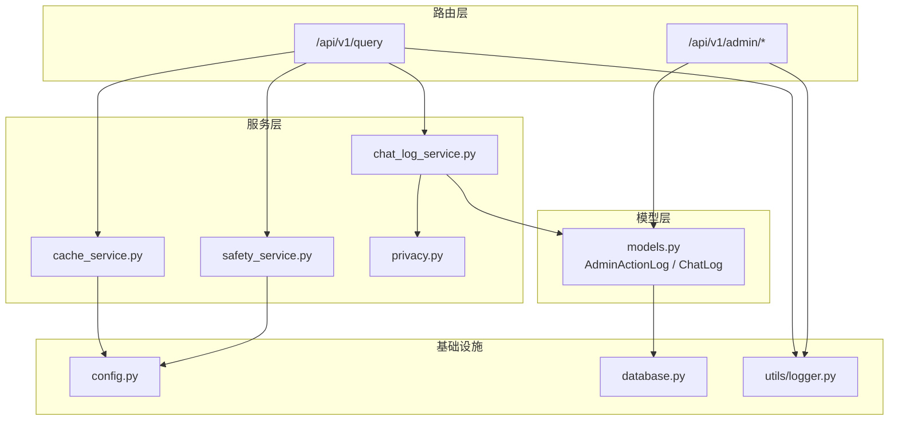
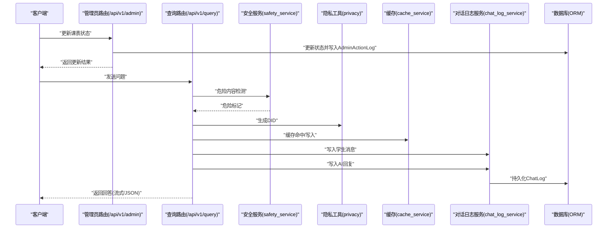
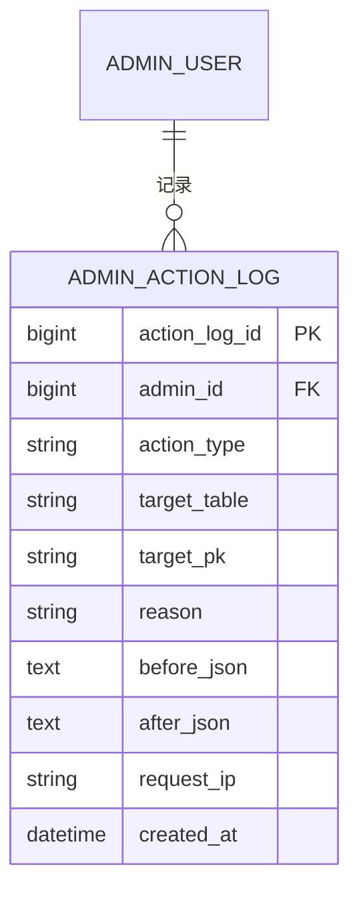
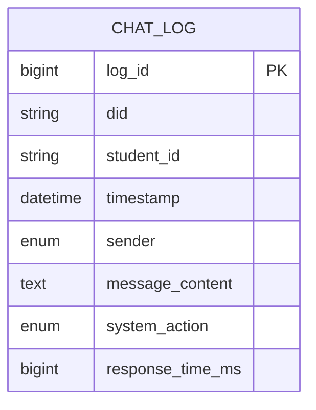
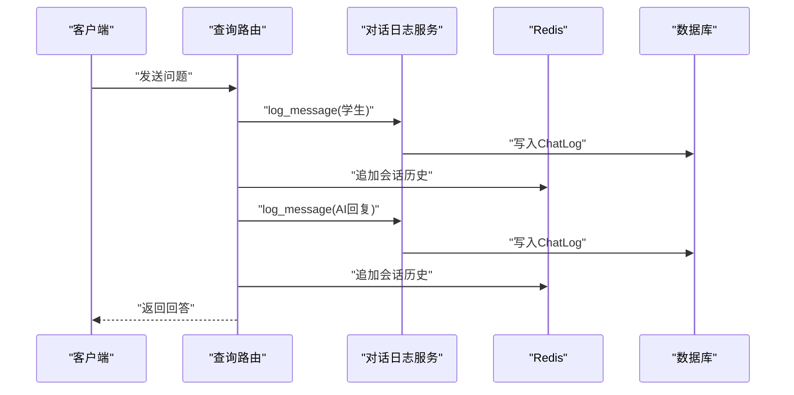
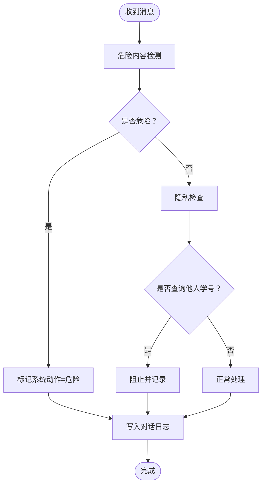
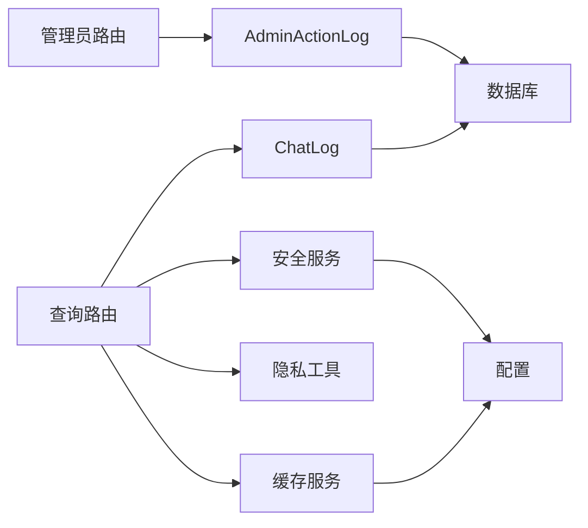

# 通信与日志表

<cite>
**本文引用的文件**
- [models.py](file://service/ai_assistant/app/models/models.py)
- [chat_log_service.py](file://service/ai_assistant/app/services/chat_log_service.py)
- [logger.py](file://service/ai_assistant/app/utils/logger.py)
- [privacy.py](file://service/ai_assistant/app/utils/privacy.py)
- [admin.py（路由）](file://service/ai_assistant/app/routers/admin.py)
- [query.py（路由）](file://service/ai_assistant/app/routers/query.py)
- [safety_service.py](file://service/ai_assistant/app/services/safety_service.py)
- [cache_service.py](file://service/ai_assistant/app/services/cache_service.py)
- [config.py](file://service/ai_assistant/app/config.py)
- [database.py](file://service/ai_assistant/app/database.py)
</cite>

## 目录
1. [简介](#简介)
2. [项目结构](#项目结构)
3. [核心组件](#核心组件)
4. [架构总览](#架构总览)
5. [详细组件分析](#详细组件分析)
6. [依赖分析](#依赖分析)
7. [性能考虑](#性能考虑)
8. [故障排查指南](#故障排查指南)
9. [结论](#结论)
10. [附录](#附录)

## 简介
本设计文档聚焦于AI校园助手项目的通信与日志相关表，重点阐述两类日志表的设计与实现：
- 管理员操作日志表（AdminActionLog）：记录管理员在系统内的关键操作行为，用于审计与追踪。
- 对话日志表（ChatLog）：记录学生与AI助手的交互过程，包含消息内容、发送者类型、系统响应时间、安全处理结果等。

文档将从数据结构、索引与搜索优化、数据保留策略、查询最佳实践与性能优化等方面进行深入说明，并给出可视化图示帮助理解。

## 项目结构
围绕日志与通信的关键文件组织如下：
- 数据模型层：定义数据库表结构与索引
- 服务层：封装日志写入、隐私处理、安全检查、缓存等业务逻辑
- 路由层：对外提供API，触发日志写入与安全检查
- 工具与配置：统一日志配置、隐私DID生成、系统参数

图表来源
- [models.py:86-112](file://service/ai_assistant/app/models/models.py#L86-L112)
- [models.py:641-660](file://service/ai_assistant/app/models/models.py#L641-L660)
- [chat_log_service.py:14-56](file://service/ai_assistant/app/services/chat_log_service.py#L14-L56)
- [safety_service.py:84-144](file://service/ai_assistant/app/services/safety_service.py#L84-L144)
- [cache_service.py:92-176](file://service/ai_assistant/app/services/cache_service.py#L92-L176)
- [privacy.py:9-22](file://service/ai_assistant/app/utils/privacy.py#L9-L22)
- [admin.py（路由）:309-387](file://service/ai_assistant/app/routers/admin.py#L309-L387)
- [query.py（路由）:207-745](file://service/ai_assistant/app/routers/query.py#L207-L745)
- [config.py:85-112](file://service/ai_assistant/app/config.py#L85-L112)
- [database.py:7-20](file://service/ai_assistant/app/database.py#L7-L20)
- [logger.py:17-46](file://service/ai_assistant/app/utils/logger.py#L17-L46)

章节来源
- [models.py:86-112](file://service/ai_assistant/app/models/models.py#L86-L112)
- [models.py:641-660](file://service/ai_assistant/app/models/models.py#L641-L660)
- [chat_log_service.py:14-56](file://service/ai_assistant/app/services/chat_log_service.py#L14-L56)
- [admin.py（路由）:309-387](file://service/ai_assistant/app/routers/admin.py#L309-L387)
- [query.py（路由）:207-745](file://service/ai_assistant/app/routers/query.py#L207-L745)
- [privacy.py:9-22](file://service/ai_assistant/app/utils/privacy.py#L9-L22)
- [safety_service.py:84-144](file://service/ai_assistant/app/services/safety_service.py#L84-L144)
- [cache_service.py:92-176](file://service/ai_assistant/app/services/cache_service.py#L92-L176)
- [config.py:85-112](file://service/ai_assistant/app/config.py#L85-L112)
- [database.py:7-20](file://service/ai_assistant/app/database.py#L7-L20)
- [logger.py:17-46](file://service/ai_assistant/app/utils/logger.py#L17-L46)

## 核心组件
- 管理员操作日志表（AdminActionLog）
  - 记录管理员操作类型、目标对象、前后状态对比、请求IP、时间戳等，用于审计与追踪。
  - 关键字段：动作类型、目标表、目标主键、原因、前后状态JSON、请求IP、创建时间。
  - 索引：按管理员+时间、目标表+主键+时间，便于快速审计与定位。
- 对话日志表（ChatLog）
  - 记录学生与AI助手的交互，包含消息内容、发送者类型、系统动作标记、响应时间、时间戳等。
  - 隐私设计：使用DID替代真实学号，危险消息保留原始学号以便干预。
  - 索引：按会话+时间、系统动作、学生标识，支持高效查询与统计。

章节来源
- [models.py:86-112](file://service/ai_assistant/app/models/models.py#L86-L112)
- [models.py:641-660](file://service/ai_assistant/app/models/models.py#L641-L660)
- [chat_log_service.py:14-56](file://service/ai_assistant/app/services/chat_log_service.py#L14-L56)
- [privacy.py:9-22](file://service/ai_assistant/app/utils/privacy.py#L9-L22)

## 架构总览
下图展示管理员操作日志与对话日志在系统中的产生与落库路径，以及与安全检查、缓存、隐私处理的关系。

图表来源
- [admin.py（路由）:309-387](file://service/ai_assistant/app/routers/admin.py#L309-L387)
- [query.py（路由）:207-745](file://service/ai_assistant/app/routers/query.py#L207-L745)
- [safety_service.py:84-144](file://service/ai_assistant/app/services/safety_service.py#L84-L144)
- [privacy.py:9-22](file://service/ai_assistant/app/utils/privacy.py#L9-L22)
- [cache_service.py:92-176](file://service/ai_assistant/app/services/cache_service.py#L92-L176)
- [chat_log_service.py:14-56](file://service/ai_assistant/app/services/chat_log_service.py#L14-L56)
- [models.py:641-660](file://service/ai_assistant/app/models/models.py#L641-L660)

## 详细组件分析

### 管理员操作日志表（AdminActionLog）设计
- 表结构要点
  - 主键：自增整数
  - 外键：关联管理员表
  - 动作类型：字符串，如“schedule_status_update”
  - 目标对象：目标表名与主键，支持跨表审计
  - 前后状态：JSON字符串，记录变更前后字段快照
  - 请求IP：可空，便于追踪来源
  - 时间戳：记录操作发生时间
- 索引设计
  - 管理员+时间：快速定位某管理员的审计轨迹
  - 目标表+主键+时间：快速定位特定对象的变更历史
- 审计流程
  - 在管理员修改课表状态时，构造前后状态JSON，写入AdminActionLog
  - 通过路由层统一记录，确保一致性与完整性

图表来源
- [models.py:86-112](file://service/ai_assistant/app/models/models.py#L86-L112)

章节来源
- [models.py:86-112](file://service/ai_assistant/app/models/models.py#L86-L112)
- [admin.py（路由）:337-364](file://service/ai_assistant/app/routers/admin.py#L337-L364)

### 对话日志表（ChatLog）设计
- 表结构要点
  - 主键：自增整数
  - 会话标识：DID（脱敏学号），用于关联同一学生的多次对话
  - 学生标识：仅在危险消息时保留原始学号
  - 时间戳：消息发生时间
  - 发送者：枚举（学生/智能体/系统）
  - 消息内容：Text，存储原始消息或回复
  - 系统动作：枚举（无/标记危险/上报/屏蔽）
  - 响应时间：毫秒，记录生成回答耗时
- 隐私与安全
  - 使用DID替代真实学号，保障匿名性
  - 危险内容（如自杀/暴力倾向）时保留原始学号，便于干预
- 索引设计
  - 会话+时间：快速加载最近对话
  - 系统动作：支持按安全状态筛选
  - 学生标识：支持按学生维度查询

图表来源
- [models.py:641-660](file://service/ai_assistant/app/models/models.py#L641-L660)

章节来源
- [models.py:641-660](file://service/ai_assistant/app/models/models.py#L641-L660)
- [chat_log_service.py:14-56](file://service/ai_assistant/app/services/chat_log_service.py#L14-L56)
- [privacy.py:9-22](file://service/ai_assistant/app/utils/privacy.py#L9-L22)

### 日志写入流程（对话日志）
- 写入时机
  - 学生消息：每次学生发送问题后写入一条
  - AI回复：在JSON模式与流式模式结束后分别写入一条
- 写入内容
  - DID、发送者、消息内容、系统动作、响应时间、时间戳
  - 危险消息时保留原始学号
- 会话历史
  - 同时写入Redis会话历史，避免并发会话串话
  - 支持按会话ID隔离历史，提高上下文质量

图表来源
- [query.py（路由）:370-446](file://service/ai_assistant/app/routers/query.py#L370-L446)
- [query.py（路由）:618-628](file://service/ai_assistant/app/routers/query.py#L618-L628)
- [query.py（路由）:718-728](file://service/ai_assistant/app/routers/query.py#L718-L728)
- [chat_log_service.py:14-56](file://service/ai_assistant/app/services/chat_log_service.py#L14-L56)

章节来源
- [query.py（路由）:370-446](file://service/ai_assistant/app/routers/query.py#L370-L446)
- [query.py（路由）:618-628](file://service/ai_assistant/app/routers/query.py#L618-L628)
- [query.py（路由）:718-728](file://service/ai_assistant/app/routers/query.py#L718-L728)
- [chat_log_service.py:14-56](file://service/ai_assistant/app/services/chat_log_service.py#L14-L56)

### 安全检查与系统动作标记
- 危险内容检测
  - 使用大模型进行危险倾向判断，若判定为危险，则标记系统动作为“标记危险”
- 隐私检查
  - 检测是否试图查询他人学号，若发现则阻止并记录
- 日志记录
  - 危险消息与隐私违规均会写入对话日志，保留原始学号以便干预

图表来源
- [safety_service.py:84-144](file://service/ai_assistant/app/services/safety_service.py#L84-L144)
- [query.py（路由）:350-417](file://service/ai_assistant/app/routers/query.py#L350-L417)
- [chat_log_service.py:14-56](file://service/ai_assistant/app/services/chat_log_service.py#L14-L56)

章节来源
- [safety_service.py:84-144](file://service/ai_assistant/app/services/safety_service.py#L84-L144)
- [query.py（路由）:350-417](file://service/ai_assistant/app/routers/query.py#L350-L417)
- [chat_log_service.py:14-56](file://service/ai_assistant/app/services/chat_log_service.py#L14-L56)

## 依赖分析
- 数据模型依赖
  - AdminActionLog与AdminUser建立一对多关系，便于按管理员审计
  - ChatLog依赖DID与学生ID，支持隐私与非隐私两种场景
- 服务依赖
  - 对话日志服务依赖隐私工具生成DID、依赖数据库会话持久化
  - 安全服务依赖外部大模型API，提供危险内容检测
  - 缓存服务依赖Redis，提供查询结果缓存与版本控制
- 路由依赖
  - 管理员路由在修改课表状态时写入AdminActionLog
  - 查询路由在处理问题时写入对话日志并更新Redis会话历史

图表来源
- [admin.py（路由）:309-387](file://service/ai_assistant/app/routers/admin.py#L309-L387)
- [query.py（路由）:207-745](file://service/ai_assistant/app/routers/query.py#L207-L745)
- [chat_log_service.py:14-56](file://service/ai_assistant/app/services/chat_log_service.py#L14-L56)
- [safety_service.py:84-144](file://service/ai_assistant/app/services/safety_service.py#L84-L144)
- [cache_service.py:92-176](file://service/ai_assistant/app/services/cache_service.py#L92-L176)
- [privacy.py:9-22](file://service/ai_assistant/app/utils/privacy.py#L9-L22)
- [config.py:85-112](file://service/ai_assistant/app/config.py#L85-L112)

章节来源
- [admin.py（路由）:309-387](file://service/ai_assistant/app/routers/admin.py#L309-L387)
- [query.py（路由）:207-745](file://service/ai_assistant/app/routers/query.py#L207-L745)
- [chat_log_service.py:14-56](file://service/ai_assistant/app/services/chat_log_service.py#L14-L56)
- [safety_service.py:84-144](file://service/ai_assistant/app/services/safety_service.py#L84-L144)
- [cache_service.py:92-176](file://service/ai_assistant/app/services/cache_service.py#L92-L176)
- [privacy.py:9-22](file://service/ai_assistant/app/utils/privacy.py#L9-L22)
- [config.py:85-112](file://service/ai_assistant/app/config.py#L85-L112)

## 性能考虑
- 索引与查询优化
  - AdminActionLog：管理员+时间、目标表+主键+时间，满足审计与定位需求
  - ChatLog：会话+时间、系统动作、学生标识，支持高效检索与统计
- 缓存策略
  - Redis缓存查询结果，敏感查询TTL较短，普通查询TTL较长
  - 课表相关查询支持版本控制，管理员调整课表后主动失效
- 日志落库策略
  - 流式输出场景下，先回滚数据库会话，释放连接，再异步写入最终回复日志
  - JSON模式下使用独立短生命周期会话写入日志，避免长连接占用
- 日志文件管理
  - 使用统一日志配置，文件大小滚动与保留策略，便于运维与审计

章节来源
- [models.py:106-109](file://service/ai_assistant/app/models/models.py#L106-L109)
- [models.py:655-659](file://service/ai_assistant/app/models/models.py#L655-L659)
- [cache_service.py:85-90](file://service/ai_assistant/app/services/cache_service.py#L85-L90)
- [cache_service.py:129-142](file://service/ai_assistant/app/services/cache_service.py#L129-L142)
- [query.py（路由）:654-658](file://service/ai_assistant/app/routers/query.py#L654-L658)
- [query.py（路由）:717-728](file://service/ai_assistant/app/routers/query.py#L717-L728)
- [logger.py:35-43](file://service/ai_assistant/app/utils/logger.py#L35-L43)

## 故障排查指南
- 安全检测异常
  - 现象：安全检测失败或返回格式异常
  - 排查：查看安全服务日志，确认外部模型调用是否成功，必要时回退到正则匹配
- 缓存命中异常
  - 现象：缓存未命中或命中后过期
  - 排查：检查敏感关键词匹配、日期敏感与课表版本控制逻辑
- 日志写入异常
  - 现象：对话日志未写入或DID不一致
  - 排查：确认隐私工具生成的DID与会话历史键一致，检查数据库连接与事务提交
- 审计日志缺失
  - 现象：管理员操作未记录
  - 排查：确认路由层在修改状态时是否正确构造前后状态JSON并写入AdminActionLog

章节来源
- [safety_service.py:134-144](file://service/ai_assistant/app/services/safety_service.py#L134-L144)
- [cache_service.py:102-112](file://service/ai_assistant/app/services/cache_service.py#L102-L112)
- [chat_log_service.py:48-54](file://service/ai_assistant/app/services/chat_log_service.py#L48-L54)
- [admin.py（路由）:352-364](file://service/ai_assistant/app/routers/admin.py#L352-L364)

## 结论
本设计通过AdminActionLog与ChatLog两张日志表，实现了管理员操作审计与学生对话追踪的双轨机制。配合隐私DID、安全检测、缓存与统一日志配置，系统在保障隐私与安全的同时，提供了高效的查询与可观测性。合理的索引与缓存策略进一步提升了性能与可维护性。

## 附录
- 数据保留策略建议
  - 管理员操作日志：按法规要求定期归档与清理
  - 对话日志：按隐私政策设定保留期限，危险记录可适当延长
- 查询最佳实践
  - 审计查询优先使用管理员+时间索引
  - 对话查询优先使用会话+时间索引，结合系统动作过滤
  - 高频统计可通过缓存与物化视图实现