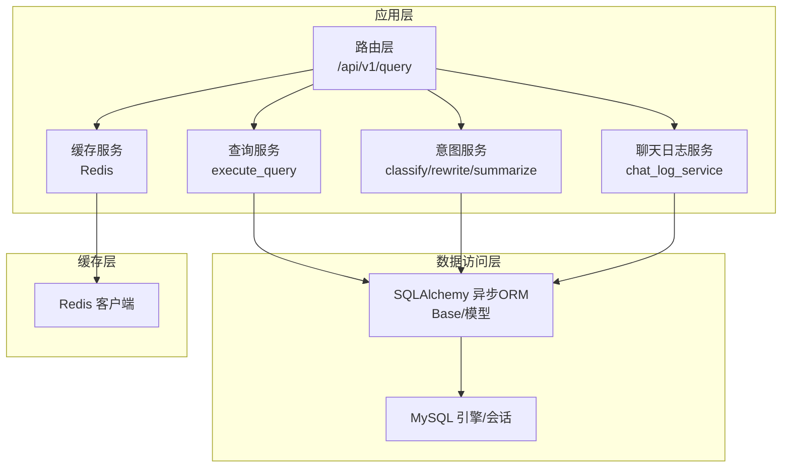
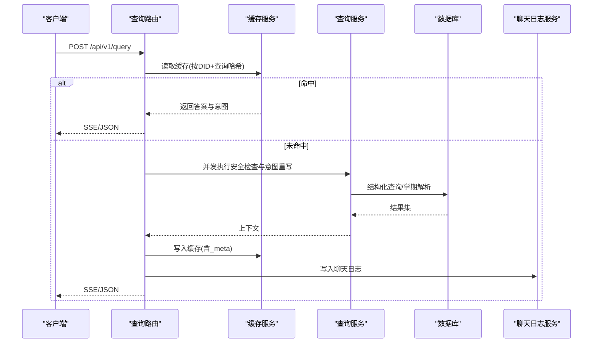
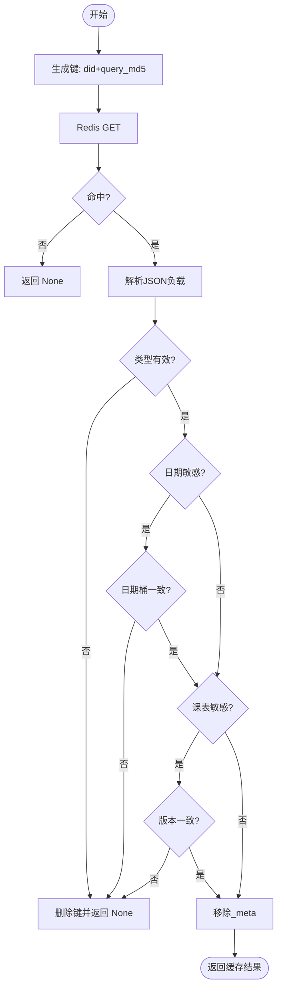
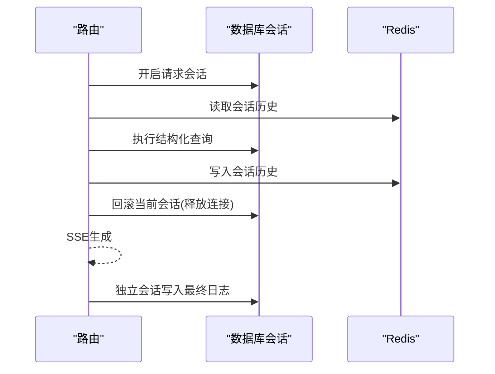
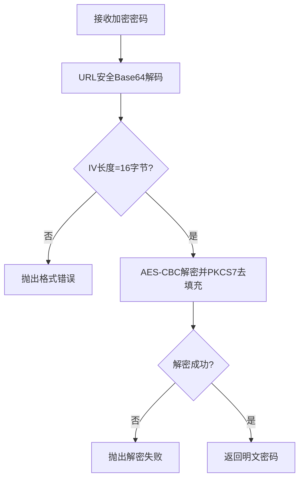
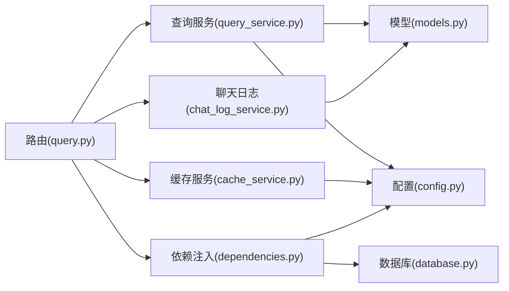

# 数据架构

<cite>
**本文引用的文件**
- [models.py](file://service/ai_assistant/app/models/models.py)
- [database.py](file://service/ai_assistant/app/database.py)
- [config.py](file://service/ai_assistant/app/config.py)
- [cache_service.py](file://service/ai_assistant/app/services/cache_service.py)
- [privacy.py](file://service/ai_assistant/app/utils/privacy.py)
- [query.py](file://service/ai_assistant/app/routers/query.py)
- [query_service.py](file://service/ai_assistant/app/services/query_service.py)
- [chat_log_service.py](file://service/ai_assistant/app/services/chat_log_service.py)
- [dependencies.py](file://service/ai_assistant/app/dependencies.py)
- [crypto.py](file://service/ai_assistant/app/utils/crypto.py)
- [query.py](file://service/ai_assistant/app/schemas/query.py)
- [docker-compose.yml](file://service/ai_assistant/docker-compose.yml)
- [Dockerfile](file://service/ai_assistant/Dockerfile)
</cite>

## 目录
1. [简介](#简介)
2. [项目结构](#项目结构)
3. [核心组件](#核心组件)
4. [架构总览](#架构总览)
5. [详细组件分析](#详细组件分析)
6. [依赖关系分析](#依赖关系分析)
7. [性能考量](#性能考量)
8. [故障排查指南](#故障排查指南)
9. [结论](#结论)
10. [附录](#附录)

## 简介
本文件面向AI校园助手项目的后端数据层，系统化梳理数据库设计、ORM模型、缓存策略、数据访问层、安全与隐私保护、迁移与备份、一致性保障等主题。文档以代码为依据，结合可视化图表帮助开发者快速理解整体设计与实现细节。

## 项目结构
后端采用FastAPI + SQLAlchemy Async + Redis的组合：
- 数据库：MySQL（通过aiomysql驱动），使用异步ORM（SQLAlchemy 2.x）。
- 缓存：Redis（异步客户端），用于对话缓存、会话历史、课表版本控制。
- 服务：查询路由、意图分类、向量检索、安全检查、聊天日志、缓存服务等。
- 配置：集中于Settings，统一管理数据库URL、Redis连接、LLM模型参数、缓存TTL等。



**图表来源**
- [query.py:198-745](file://service/ai_assistant/app/routers/query.py#L198-L745)
- [query_service.py:1-800](file://service/ai_assistant/app/services/query_service.py#L1-L800)
- [cache_service.py:1-177](file://service/ai_assistant/app/services/cache_service.py#L1-L177)
- [chat_log_service.py:1-76](file://service/ai_assistant/app/services/chat_log_service.py#L1-L76)
- [database.py:1-35](file://service/ai_assistant/app/database.py#L1-L35)

**章节来源**
- [config.py:85-110](file://service/ai_assistant/app/config.py#L85-L110)
- [database.py:1-35](file://service/ai_assistant/app/database.py#L1-L35)
- [dependencies.py:1-109](file://service/ai_assistant/app/dependencies.py#L1-L109)

## 核心组件
- 数据库与ORM
  - 使用异步引擎与会话工厂，开启pool_pre_ping与回收策略，关闭自动提交与过期回滚，确保连接池健康与一致性。
  - 所有模型继承自Base，统一表结构与索引策略。
- 缓存服务
  - 基于Redis的异步客户端，采用MD5(query)作为查询哈希，版本化键空间，支持敏感/日期敏感/课表敏感的失效策略。
  - 提供会话历史的Redis存储，避免并发会话串话。
- 数据访问层
  - 通过依赖注入获取AsyncSession；查询服务封装结构化SQL、学期解析、周次推断、结果字段翻译等。
  - 聊天日志服务负责隐私化存储（DID脱敏）、危险内容保留原始student_id。
- 安全与隐私
  - DID生成：基于student_id与盐值的单向哈希，保证同一用户稳定映射。
  - AES密码解密：前端使用CryptoJS加密，后端按URL安全编码与PKCS7去填充解密。
  - JWT校验：路由依赖校验令牌，获取当前学生ID或管理员身份。
- 配置与部署
  - Settings集中管理数据库URL、Redis连接、缓存TTL、LLM模型等。
  - Docker Compose提供Redis服务与健康检查。

**章节来源**
- [database.py:1-35](file://service/ai_assistant/app/database.py#L1-L35)
- [models.py:1-660](file://service/ai_assistant/app/models/models.py#L1-L660)
- [cache_service.py:1-177](file://service/ai_assistant/app/services/cache_service.py#L1-L177)
- [chat_log_service.py:1-76](file://service/ai_assistant/app/services/chat_log_service.py#L1-L76)
- [privacy.py:1-23](file://service/ai_assistant/app/utils/privacy.py#L1-L23)
- [crypto.py:1-73](file://service/ai_assistant/app/utils/crypto.py#L1-L73)
- [dependencies.py:1-109](file://service/ai_assistant/app/dependencies.py#L1-L109)
- [config.py:1-113](file://service/ai_assistant/app/config.py#L1-L113)
- [docker-compose.yml:1-31](file://service/ai_assistant/docker-compose.yml#L1-L31)

## 架构总览
数据层由“模型-服务-路由-缓存-数据库”五层构成，遵循以下原则：
- 模型层：强约束（主键、唯一、检查约束、索引）与清晰的关系映射。
- 服务层：封装业务逻辑（意图分类、结构化查询、向量检索、混合检索、结果翻译）。
- 路由层：统一入口，多任务并发（安全检查、意图重写），缓存优先，SSE流式输出。
- 缓存层：按敏感度与语义时效控制TTL，版本化隔离旧缓存。
- 数据库层：异步连接池、事务控制、并发安全。



**图表来源**
- [query.py:207-745](file://service/ai_assistant/app/routers/query.py#L207-L745)
- [cache_service.py:92-177](file://service/ai_assistant/app/services/cache_service.py#L92-L177)
- [query_service.py:1-800](file://service/ai_assistant/app/services/query_service.py#L1-L800)
- [chat_log_service.py:14-56](file://service/ai_assistant/app/services/chat_log_service.py#L14-L56)

## 详细组件分析

### 数据库与ORM模型设计
- 设计要点
  - 主键与自增：多数表使用BigInteger主键并自增，便于扩展与分布式ID兼容。
  - 唯一约束：如管理员工号、用户名、部门名称、课程名等，防止重复。
  - 检查约束：学期起止日期、学分、成绩范围、周次与节次范围、星期范围等，保证数据合法性。
  - 索引策略：对常用查询维度建立复合索引（如term+course、term+teacher+时间、term+status+时间等），显著降低查询成本。
  - 关系映射：使用relationship建立双向关联，如Schedule与Class、Teacher、Classroom、Term；AdminUser与ActionLog、ScheduleAdjustment等。
- 关键实体与关系
  - 学生、班级、专业、学院：逐级关联，支撑学籍信息链路。
  - 课程、成绩、选课：三者通过外键关联，支持按学期聚合。
  - 课表：与课程、教师、教室、学期、管理员更新记录关联，支持状态与版本控制。
  - 管理员与审计：管理员操作日志记录变更前后快照，便于追踪。
  - 对话日志：以DID替代真实学号，危险内容保留原始student_id。

```mermaid
erDiagram
ADMIN_USER {
bigint admin_id PK
string admin_code UK
string username UK
string password_hash
string display_name
enum role
enum status
datetime last_login_at
datetime created_at
datetime updated_at
}
ADMIN_ACTION_LOG {
bigint action_log_id PK
bigint admin_id FK
string action_type
string target_table
string target_pk
string reason
text before_json
text after_json
string request_ip
datetime created_at
}
DEPARTMENT {
string dept_id PK
string name UK
}
MAJOR {
string major_id PK
string name
string dept_id FK
}
CLASS {
string class_id PK
string name
string major_id FK
int grade
}
TEACHER {
string teacher_id PK
string name
string title
string dept_id FK
string phone
string email
string office_hours
string office_room
}
TERM {
string term_id PK
date start_date
date end_date
}
COURSE {
string course_id PK
string course_name
int credit
enum course_type
}
CLASSROOM {
string room_id PK
enum room_type
string location
int capacity
}
STUDENT {
string student_id PK
string name
string gender
date date_of_birth
smallint enroll_year
string class_id FK
string phone
string email
enum status
string password_hash
}
ENROLLMENT {
int enrollment_id PK
string student_id FK
string course_id FK
string term_id FK
}
SCORE {
int score_id PK
string student_id FK
string course_id FK
string term_id FK
int score
smallint credit_earned
smallint cheating
}
SCHEDULE {
string schedule_id PK
string course_id FK
string teacher_id FK
string room_id FK
string term_id FK
int week_no
smallint day_of_week
int start_period
int end_period
string week_pattern
enum schedule_status
int version
bigint updated_by_admin_id FK
datetime updated_at
}
SCHEDULE_CLASS_MAP {
string schedule_id FK
string class_id FK
datetime created_at
bigint created_by_admin_id FK
}
SCHEDULE_ADJUSTMENT {
bigint adjustment_id PK
string schedule_id FK
string term_id FK
enum operation_type
string reason
enum status
int expected_schedule_version
int old_week_no
smallint old_day_of_week
int old_start_period
int old_end_period
string old_room_id
string old_teacher_id
int new_week_no
smallint new_day_of_week
int new_start_period
int new_end_period
string new_room_id
string new_teacher_id
bigint requested_by_admin_id FK
bigint approved_by_admin_id FK
datetime requested_at
datetime approved_at
datetime applied_at
bigint rollback_of_adjustment_id FK
text conflict_snapshot
}
CHAT_LOG {
bigint log_id PK
string did
string student_id
datetime timestamp
enum sender
text message_content
enum system_action
bigint response_time_ms
}
ADMIN_USER ||--o{ ADMIN_ACTION_LOG : "创建"
DEPARTMENT ||--o{ MAJOR : "拥有"
MAJOR ||--o{ CLASS : "拥有"
CLASS ||--o{ STUDENT : "拥有"
TEACHER ||--o{ SCHEDULE : "授课"
CLASSROOM ||--o{ SCHEDULE : "使用"
TERM ||--o{ ENROLLMENT : "包含"
TERM ||--o{ SCORE : "包含"
TERM ||--o{ SCHEDULE : "包含"
COURSE ||--o{ ENROLLMENT : "被选"
COURSE ||--o{ SCORE : "被评分"
COURSE ||--o{ SCHEDULE : "被安排"
SCHEDULE ||--o{ SCHEDULE_CLASS_MAP : "映射"
CLASS ||--o{ SCHEDULE_CLASS_MAP : "映射"
ADMIN_USER ||--o{ SCHEDULE_ADJUSTMENT : "申请/审批"
TERM ||--o{ SCHEDULE_ADJUSTMENT : "关联"
SCHEDULE ||--o{ SCHEDULE_ADJUSTMENT : "受影响"
STUDENT ||--o{ CHAT_LOG : "产生"
```

**图表来源**
- [models.py:41-660](file://service/ai_assistant/app/models/models.py#L41-L660)

**章节来源**
- [models.py:1-660](file://service/ai_assistant/app/models/models.py#L1-L660)

### 缓存架构与策略
- 键设计
  - 格式：chat_cache:{version}:{did}:{query_md5}
  - 版本：v3，用于升级查询/总结逻辑时隔离旧缓存。
  - 会话历史：chat:session_history:{did}:{session_id}，限制长度并设置TTL。
- 失效机制
  - 敏感查询：30分钟TTL。
  - 普通查询：1天TTL。
  - 日期敏感：按“当日日期桶”对比，跨日失效。
  - 课表敏感：维护“课表缓存版本号”，管理员改课后递增版本，命中旧版本即失效。
- 写入与读取
  - 写入时附加_meta：包含日期敏感标记、日期桶、课表敏感标记、当前课表版本。
  - 读取时先命中，再按语义时效校验，最后剥离_meta返回。



**图表来源**
- [cache_service.py:92-177](file://service/ai_assistant/app/services/cache_service.py#L92-L177)

**章节来源**
- [cache_service.py:1-177](file://service/ai_assistant/app/services/cache_service.py#L1-L177)

### 数据访问层与事务控制
- 连接管理
  - 异步引擎与会话工厂，启用pool_pre_ping与回收，避免连接失效。
  - 依赖注入get_db提供请求级会话，确保生命周期可控。
- 事务与并发
  - 路由层在SSE生成前主动回滚当前会话，释放连接，避免长时间占用。
  - 流式输出结束后使用独立短生命周期会话写入最终日志，避免复用长连接。
  - 查询服务内部按工具拆分执行，避免长事务阻塞。
- 并发控制
  - Redis会话历史使用列表结构与LRU策略，配合TTL，天然具备并发隔离与容量控制。



**图表来源**
- [query.py:654-728](file://service/ai_assistant/app/routers/query.py#L654-L728)
- [dependencies.py:27-51](file://service/ai_assistant/app/dependencies.py#L27-L51)

**章节来源**
- [database.py:1-35](file://service/ai_assistant/app/database.py#L1-L35)
- [dependencies.py:1-109](file://service/ai_assistant/app/dependencies.py#L1-L109)
- [query.py:654-728](file://service/ai_assistant/app/routers/query.py#L654-L728)

### 数据安全与隐私保护
- 敏感数据处理
  - 学生密码：前端使用CryptoJS AES-CBC加密，后端按URL安全编码与PKCS7去填充解密。
  - 聊天日志：普通消息仅存储DID，危险消息保留原始student_id。
- 访问控制
  - JWT校验：路由依赖获取当前学生ID；管理员端有独立校验与状态检查。
- 数据加密
  - AES密钥长度校验（16/24/32字节），解密失败抛出明确异常。
- 隐私标识
  - DID：基于student_id与盐值的SHA-256，同一用户稳定映射，便于历史关联。



**图表来源**
- [crypto.py:39-73](file://service/ai_assistant/app/utils/crypto.py#L39-L73)

**章节来源**
- [crypto.py:1-73](file://service/ai_assistant/app/utils/crypto.py#L1-L73)
- [chat_log_service.py:14-56](file://service/ai_assistant/app/services/chat_log_service.py#L14-L56)
- [privacy.py:1-23](file://service/ai_assistant/app/utils/privacy.py#L1-L23)
- [dependencies.py:56-109](file://service/ai_assistant/app/dependencies.py#L56-L109)

### 数据迁移、备份与一致性
- 迁移策略
  - 使用SQLAlchemy模型定义表结构与约束，结合数据库版本管理工具（如Alembic）进行迁移。
  - 新增字段建议使用nullable=True并配合默认值，逐步上线。
- 备份与恢复
  - MySQL：定期逻辑备份（mysqldump）或物理备份，结合binlog恢复到指定时间点。
  - Redis：RDB快照与AOF持久化，结合备份卷与健康检查。
- 一致性保证
  - 异步ORM + 会话回滚：避免长时间持有连接导致的锁竞争。
  - 缓存版本控制：课表敏感查询通过版本号强制失效，避免脏读。
  - 事务边界：结构化查询与日志写入分离，减少事务持续时间。

**章节来源**
- [docker-compose.yml:1-31](file://service/ai_assistant/docker-compose.yml#L1-L31)
- [cache_service.py:70-83](file://service/ai_assistant/app/services/cache_service.py#L70-L83)

## 依赖关系分析
- 组件耦合
  - 路由层依赖查询服务、缓存服务、聊天日志服务、依赖注入模块。
  - 查询服务依赖ORM模型、LangChain检索器、配置与日志。
  - 缓存服务依赖Redis与配置。
  - 数据访问层依赖数据库引擎与会话工厂。
- 外部依赖
  - MySQL驱动：aiomysql
  - Redis驱动：aioredis
  - LLM与检索：DashScope、LangChain
- 循环依赖
  - 未发现循环导入；各模块职责清晰，通过依赖注入解耦。



**图表来源**
- [query.py:1-788](file://service/ai_assistant/app/routers/query.py#L1-L788)
- [query_service.py:1-800](file://service/ai_assistant/app/services/query_service.py#L1-L800)
- [cache_service.py:1-177](file://service/ai_assistant/app/services/cache_service.py#L1-L177)
- [chat_log_service.py:1-76](file://service/ai_assistant/app/services/chat_log_service.py#L1-L76)
- [dependencies.py:1-109](file://service/ai_assistant/app/dependencies.py#L1-L109)
- [database.py:1-35](file://service/ai_assistant/app/database.py#L1-L35)
- [config.py:1-113](file://service/ai_assistant/app/config.py#L1-L113)
- [models.py:1-660](file://service/ai_assistant/app/models/models.py#L1-L660)

**章节来源**
- [query.py:1-788](file://service/ai_assistant/app/routers/query.py#L1-L788)
- [dependencies.py:1-109](file://service/ai_assistant/app/dependencies.py#L1-L109)

## 性能考量
- 数据库层面
  - 合理索引：针对高频查询维度建立复合索引，减少全表扫描。
  - 连接池：启用pre_ping与回收，避免超时连接。
  - 事务短小：路由层在SSE生成前回滚会话，缩短事务窗口。
- 缓存层面
  - TTL差异化：敏感/普通区分TTL，降低风险。
  - 语义失效：日期桶与课表版本，避免过期语义与脏数据。
  - 版本化键空间：升级逻辑时自动隔离旧缓存。
- I/O与并发
  - 异步IO：数据库与Redis均使用异步客户端，提高吞吐。
  - 并发任务：安全检查与意图重写并行，缩短端到端延迟。
- LLM与检索
  - 模型参数集中配置，便于按需调整；向量检索与结构化查询混合，平衡准确性与性能。

[本节为通用指导，无需特定文件引用]

## 故障排查指南
- 缓存异常
  - 现象：缓存读取失败或命中后被误删。
  - 排查：检查键格式、TTL、日期桶与课表版本一致性；查看日志中“Cache miss/miss by date guard/stale by schedule version”等信息。
- 数据库连接问题
  - 现象：连接超时或事务长时间占用。
  - 排查：确认pool_pre_ping与回收配置；检查路由层是否在SSE生成前回滚会话。
- 安全与隐私
  - 现象：隐私违规被拦截或解密失败。
  - 排查：确认AES密钥长度与URL安全编码；检查DID生成与聊天日志存储策略。
- Redis部署
  - 现象：连接失败或内存不足。
  - 排查：检查Docker Compose配置、密码、maxmemory与策略；查看健康检查。

**章节来源**
- [cache_service.py:92-177](file://service/ai_assistant/app/services/cache_service.py#L92-L177)
- [query.py:654-728](file://service/ai_assistant/app/routers/query.py#L654-L728)
- [crypto.py:1-73](file://service/ai_assistant/app/utils/crypto.py#L1-L73)
- [docker-compose.yml:1-31](file://service/ai_assistant/docker-compose.yml#L1-L31)

## 结论
本数据架构以“异步ORM + Redis缓存 + 结构化查询 + 向量检索”的组合实现高性能、可扩展的校园数据服务。通过严格的模型约束、索引策略、缓存版本化与隐私保护机制，既满足业务需求又兼顾安全性与可维护性。建议后续引入自动化迁移工具与监控告警，进一步完善运维体系。

[本节为总结，无需特定文件引用]

## 附录
- 配置项摘要
  - 数据库：主机、端口、用户、密码、数据库名、字符集。
  - Redis：主机、端口、密码、DB索引、URL拼装。
  - 缓存TTL：敏感/普通分别对应30分钟与1天。
  - LLM模型：意图分类、查询改写、最终回答、工具规划、向量拆解、混合重排、安全检测、图像理解、语音识别。
- 部署要点
  - Dockerfile：运行时安装MySQL客户端与ffmpeg，使用非root用户。
  - docker-compose：Redis服务、健康检查、内存限制与淘汰策略。

**章节来源**
- [config.py:1-113](file://service/ai_assistant/app/config.py#L1-L113)
- [Dockerfile:1-49](file://service/ai_assistant/Dockerfile#L1-L49)
- [docker-compose.yml:1-31](file://service/ai_assistant/docker-compose.yml#L1-L31)