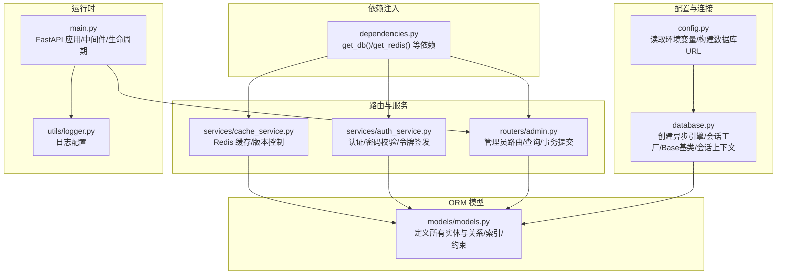
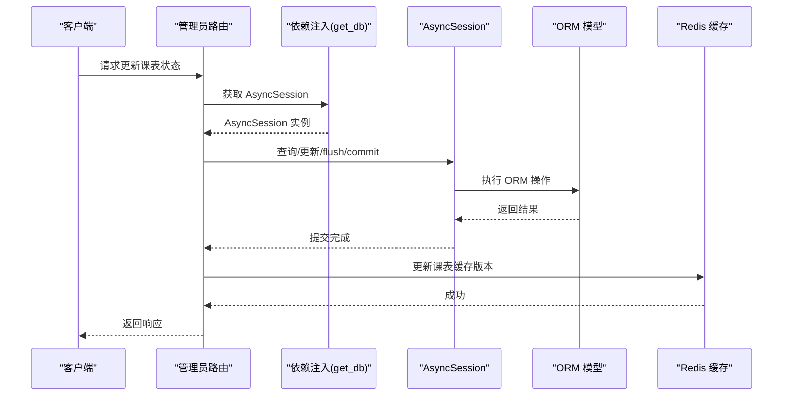
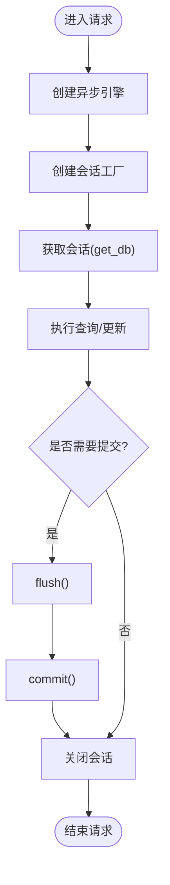
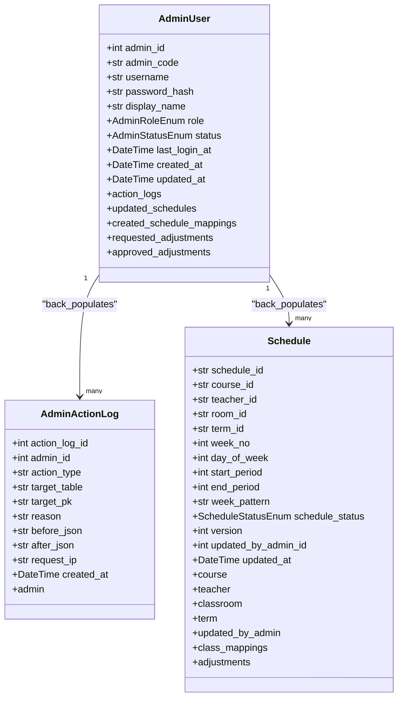
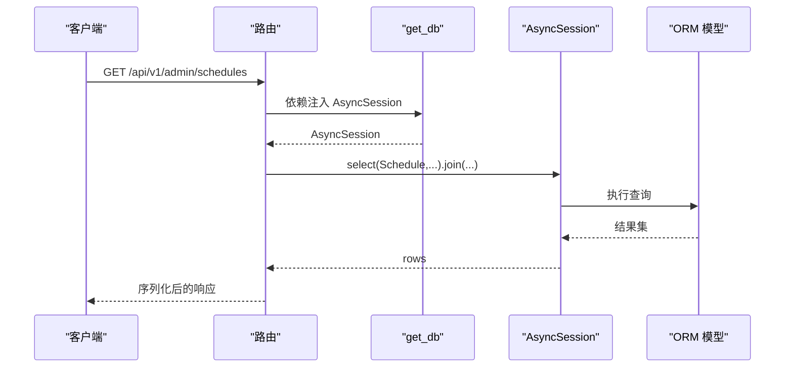
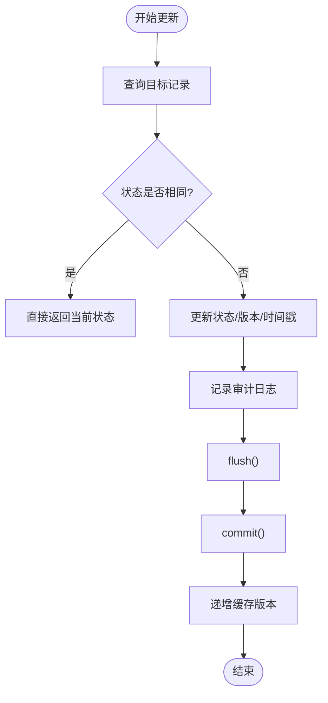
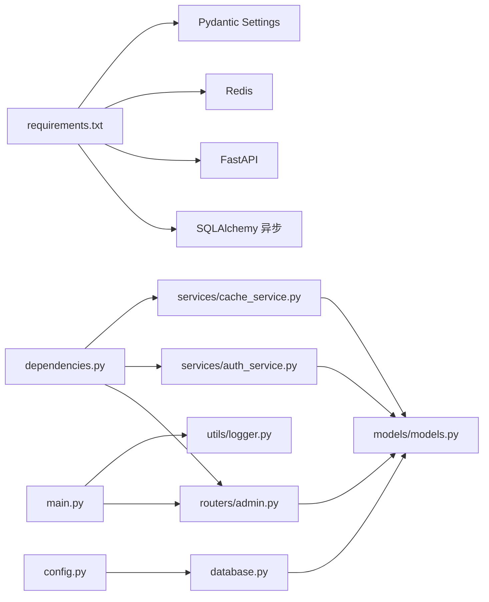

# 数据访问层

<cite>
**本文引用的文件**
- [database.py](file://service/ai_assistant/app/database.py)
- [models.py](file://service/ai_assistant/app/models/models.py)
- [config.py](file://service/ai_assistant/app/config.py)
- [dependencies.py](file://service/ai_assistant/app/dependencies.py)
- [admin.py](file://service/ai_assistant/app/routers/admin.py)
- [auth_service.py](file://service/ai_assistant/app/services/auth_service.py)
- [cache_service.py](file://service/ai_assistant/app/services/cache_service.py)
- [logger.py](file://service/ai_assistant/app/utils/logger.py)
- [main.py](file://service/ai_assistant/app/main.py)
- [requirements.txt](file://service/ai_assistant/requirements.txt)
</cite>

## 目录
1. [简介](#简介)
2. [项目结构](#项目结构)
3. [核心组件](#核心组件)
4. [架构总览](#架构总览)
5. [详细组件分析](#详细组件分析)
6. [依赖分析](#依赖分析)
7. [性能考量](#性能考量)
8. [故障排查指南](#故障排查指南)
9. [结论](#结论)
10. [附录](#附录)

## 简介
本文件系统化梳理 AI 校园助手项目的“数据访问层”，重点覆盖以下方面：
- ORM 模型设计与 SQLAlchemy 配置
- 数据库连接管理与会话生命周期
- 事务处理与并发控制策略
- 查询优化（懒加载、急加载、批量查询）
- 数据模型生命周期（创建、更新、删除、查询）
- 连接池配置、性能监控与错误处理
- 使用示例与最佳实践

## 项目结构
数据访问层主要由以下模块组成：
- 配置与连接：config.py、database.py
- ORM 模型：models/models.py
- 依赖注入与会话：dependencies.py
- 路由与业务：routers/admin.py
- 服务层：services/*（如缓存、认证）
- 日志与应用入口：utils/logger.py、main.py
- 依赖清单：requirements.txt

图表来源
- [config.py:85-91](file://service/ai_assistant/app/config.py#L85-L91)
- [database.py:7-20](file://service/ai_assistant/app/database.py#L7-L20)
- [models.py:41-84](file://service/ai_assistant/app/models/models.py#L41-L84)
- [dependencies.py:27-50](file://service/ai_assistant/app/dependencies.py#L27-L50)
- [admin.py:57-82](file://service/ai_assistant/app/routers/admin.py#L57-L82)
- [auth_service.py:212-252](file://service/ai_assistant/app/services/auth_service.py#L212-L252)
- [cache_service.py:78-82](file://service/ai_assistant/app/services/cache_service.py#L78-L82)
- [main.py:52-86](file://service/ai_assistant/app/main.py#L52-L86)
- [logger.py:17-47](file://service/ai_assistant/app/utils/logger.py#L17-L47)

章节来源
- [config.py:85-91](file://service/ai_assistant/app/config.py#L85-L91)
- [database.py:7-20](file://service/ai_assistant/app/database.py#L7-L20)
- [models.py:41-84](file://service/ai_assistant/app/models/models.py#L41-L84)
- [dependencies.py:27-50](file://service/ai_assistant/app/dependencies.py#L27-L50)
- [admin.py:57-82](file://service/ai_assistant/app/routers/admin.py#L57-L82)
- [auth_service.py:212-252](file://service/ai_assistant/app/services/auth_service.py#L212-L252)
- [cache_service.py:78-82](file://service/ai_assistant/app/services/cache_service.py#L78-L82)
- [main.py:52-86](file://service/ai_assistant/app/main.py#L52-L86)
- [logger.py:17-47](file://service/ai_assistant/app/utils/logger.py#L17-L47)

## 核心组件
- 异步数据库引擎与会话工厂：通过异步引擎与会话工厂创建会话，支持连接池、预检与回收策略，并提供异步上下文管理器以确保会话正确关闭。
- ORM 基类与模型：基于 DeclarativeBase 的 Base 类，所有模型继承该基类；模型间通过 relationship 建立关联，配合索引与约束提升查询与一致性。
- 依赖注入：get_db 提供异步会话依赖，get_redis 提供 Redis 客户端依赖；路由层通过 Depends 注入会话与缓存。
- 事务与并发：路由层在更新操作中显式 flush/commit，结合唯一约束与索引减少并发冲突；缓存版本控制用于避免脏读。
- 查询与优化：路由层采用 join 批量查询并聚合结果，避免 N+1；模型层定义复合索引与检查约束，降低查询成本。
- 错误处理与日志：统一日志配置，路由层对异常进行标准化响应；服务层对认证失败、权限不足等进行明确抛错。

章节来源
- [database.py:7-35](file://service/ai_assistant/app/database.py#L7-L35)
- [models.py:41-660](file://service/ai_assistant/app/models/models.py#L41-L660)
- [dependencies.py:27-109](file://service/ai_assistant/app/dependencies.py#L27-L109)
- [admin.py:204-302](file://service/ai_assistant/app/routers/admin.py#L204-L302)
- [auth_service.py:212-252](file://service/ai_assistant/app/services/auth_service.py#L212-L252)
- [cache_service.py:78-82](file://service/ai_assistant/app/services/cache_service.py#L78-L82)
- [logger.py:17-47](file://service/ai_assistant/app/utils/logger.py#L17-L47)

## 架构总览
数据访问层围绕“异步 SQLAlchemy + FastAPI 依赖注入”展开，遵循“路由层负责编排，服务层负责业务，数据层负责持久化”的分层原则。

图表来源
- [admin.py:309-387](file://service/ai_assistant/app/routers/admin.py#L309-L387)
- [dependencies.py:27-31](file://service/ai_assistant/app/dependencies.py#L27-L31)
- [cache_service.py:78-82](file://service/ai_assistant/app/services/cache_service.py#L78-L82)

## 详细组件分析

### 组件一：数据库引擎与会话管理
- 引擎配置：使用异步驱动创建引擎，开启 pool_pre_ping 与 pool_recycle，echo 受 DEBUG 控制，便于调试。
- 会话工厂：AsyncSessionLocal 提供 AsyncSession，关闭时自动清理；expire_on_commit=False 有利于延迟属性访问；autoflush=False 与 autocommit=False 保证手动控制。
- Base 基类：所有模型继承，统一元数据与反射能力。
- 会话上下文：get_db 提供异步上下文管理器，确保异常时也能正确关闭会话。

图表来源
- [database.py:7-35](file://service/ai_assistant/app/database.py#L7-L35)
- [dependencies.py:27-31](file://service/ai_assistant/app/dependencies.py#L27-L31)

章节来源
- [database.py:7-35](file://service/ai_assistant/app/database.py#L7-L35)
- [dependencies.py:27-31](file://service/ai_assistant/app/dependencies.py#L27-L31)

### 组件二：ORM 模型设计与关系
- 模型继承：所有模型继承自 Base，统一元数据。
- 关系建模：使用 relationship 建立一对多/多对多，部分关系通过 foreign_keys 指定区分不同外键。
- 索引与约束：大量使用 Index 与 UniqueConstraint/CheckConstraint，覆盖常用查询字段与业务约束。
- 枚举类型：角色、状态等使用枚举，保证数据一致性与可读性。

图表来源
- [models.py:41-84](file://service/ai_assistant/app/models/models.py#L41-L84)
- [models.py:86-112](file://service/ai_assistant/app/models/models.py#L86-L112)
- [models.py:412-480](file://service/ai_assistant/app/models/models.py#L412-L480)

章节来源
- [models.py:41-84](file://service/ai_assistant/app/models/models.py#L41-L84)
- [models.py:86-112](file://service/ai_assistant/app/models/models.py#L86-L112)
- [models.py:412-480](file://service/ai_assistant/app/models/models.py#L412-L480)

### 组件三：依赖注入与路由集成
- get_db：异步依赖，为每个请求提供独立会话，确保线程安全与资源回收。
- 路由层：通过 Depends(get_db) 注入会话，执行查询、更新、flush/commit，最后返回响应。
- 认证与鉴权：get_current_admin 从 JWT 中解析管理员信息并校验状态，失败抛出 HTTP 异常。

图表来源
- [admin.py:204-251](file://service/ai_assistant/app/routers/admin.py#L204-L251)
- [dependencies.py:27-31](file://service/ai_assistant/app/dependencies.py#L27-L31)

章节来源
- [admin.py:204-251](file://service/ai_assistant/app/routers/admin.py#L204-L251)
- [dependencies.py:27-31](file://service/ai_assistant/app/dependencies.py#L27-L31)

### 组件四：事务处理与并发控制
- 显式事务：路由层在更新状态后调用 flush/commit，确保数据持久化。
- 并发控制：模型层通过唯一约束与索引减少竞态条件；路由层通过状态判断避免重复提交。
- 缓存版本控制：管理员改课后递增缓存版本，避免学生侧读到旧缓存。

图表来源
- [admin.py:309-387](file://service/ai_assistant/app/routers/admin.py#L309-L387)
- [cache_service.py:78-82](file://service/ai_assistant/app/services/cache_service.py#L78-L82)

章节来源
- [admin.py:309-387](file://service/ai_assistant/app/routers/admin.py#L309-L387)
- [cache_service.py:78-82](file://service/ai_assistant/app/services/cache_service.py#L78-L82)

### 组件五：查询优化策略
- 急加载（Join 批量查询）：路由层在查询课表时通过 join 将多个实体一次性拉取，减少多次往返。
- 索引优化：模型层为高频查询字段建立索引（如 idx_schedule_term_status_time），显著降低排序与过滤成本。
- 批量聚合：将多条记录按主键聚合，避免重复对象与 N+1 问题。
- 懒加载：ORM 默认懒加载，可通过 relationship 的 lazy 策略调整（本项目未显式覆盖，保持默认）。

章节来源
- [admin.py:215-251](file://service/ai_assistant/app/routers/admin.py#L215-L251)
- [models.py:443-465](file://service/ai_assistant/app/models/models.py#L443-L465)

### 组件六：数据模型生命周期
- 创建：通过 ORM 构造函数实例化对象，调用 db.add() 后 flush/commit。
- 更新：修改对象属性，flush/commit 提交；审计日志记录前后状态。
- 删除：通过 db.delete() 删除对象，flush/commit 提交。
- 查询：使用 select() + where() + join() + order_by() + limit/offset 组合查询。

章节来源
- [admin.py:352-367](file://service/ai_assistant/app/routers/admin.py#L352-L367)
- [models.py:412-480](file://service/ai_assistant/app/models/models.py#L412-L480)

### 组件七：连接池配置与性能监控
- 连接池参数：pool_pre_ping=true，pool_recycle=3600，echo=DEBUG，有助于连接健康检查与回收。
- Redis 连接：单例 Redis 客户端，生命周期与 FastAPI 应用绑定，关闭时统一释放。
- 日志：统一日志配置，包含控制台与文件输出，便于性能与错误追踪。

章节来源
- [database.py:7-20](file://service/ai_assistant/app/database.py#L7-L20)
- [main.py:36-49](file://service/ai_assistant/app/main.py#L36-L49)
- [logger.py:17-47](file://service/ai_assistant/app/utils/logger.py#L17-L47)

### 组件八：错误处理机制
- 路由层：对认证失败、权限不足、资源不存在等情况抛出 HTTP 异常，统一响应。
- 服务层：认证与密码变更过程中的异常分类处理，便于定位问题。
- 数据层：flush/commit 失败时由框架抛出异常，路由层捕获并转换为 HTTP 响应。

章节来源
- [admin.py:57-82](file://service/ai_assistant/app/routers/admin.py#L57-L82)
- [admin.py:316-335](file://service/ai_assistant/app/routers/admin.py#L316-L335)
- [auth_service.py:212-252](file://service/ai_assistant/app/services/auth_service.py#L212-L252)

## 依赖分析
- 外部依赖：SQLAlchemy 2.x 异步、aiomysql、FastAPI、Redis、Pydantic Settings、Loguru 等。
- 内部依赖：config 提供数据库 URL；database 基于 config 构建引擎；models 依赖 database.Base；routers 依赖 models 与 dependencies；services 依赖 models 与 dependencies；main 聚合路由与中间件。

图表来源
- [requirements.txt:1-22](file://service/ai_assistant/requirements.txt#L1-L22)
- [config.py:85-91](file://service/ai_assistant/app/config.py#L85-L91)
- [database.py:7-20](file://service/ai_assistant/app/database.py#L7-L20)
- [models.py:41-84](file://service/ai_assistant/app/models/models.py#L41-L84)
- [dependencies.py:27-50](file://service/ai_assistant/app/dependencies.py#L27-L50)
- [admin.py:204-251](file://service/ai_assistant/app/routers/admin.py#L204-L251)
- [auth_service.py:212-252](file://service/ai_assistant/app/services/auth_service.py#L212-L252)
- [cache_service.py:78-82](file://service/ai_assistant/app/services/cache_service.py#L78-L82)
- [main.py:52-86](file://service/ai_assistant/app/main.py#L52-L86)
- [logger.py:17-47](file://service/ai_assistant/app/utils/logger.py#L17-L47)

章节来源
- [requirements.txt:1-22](file://service/ai_assistant/requirements.txt#L1-L22)
- [config.py:85-91](file://service/ai_assistant/app/config.py#L85-L91)
- [database.py:7-20](file://service/ai_assistant/app/database.py#L7-L20)
- [models.py:41-84](file://service/ai_assistant/app/models/models.py#L41-L84)
- [dependencies.py:27-50](file://service/ai_assistant/app/dependencies.py#L27-L50)
- [admin.py:204-251](file://service/ai_assistant/app/routers/admin.py#L204-L251)
- [auth_service.py:212-252](file://service/ai_assistant/app/services/auth_service.py#L212-L252)
- [cache_service.py:78-82](file://service/ai_assistant/app/services/cache_service.py#L78-L82)
- [main.py:52-86](file://service/ai_assistant/app/main.py#L52-L86)
- [logger.py:17-47](file://service/ai_assistant/app/utils/logger.py#L17-L47)

## 性能考量
- 连接池与回收：pool_pre_ping 与 pool_recycle 降低连接失效风险；echo=DEBUG 仅在开发启用。
- 索引与约束：模型层大量索引与检查约束，显著提升查询效率与数据一致性。
- 批量查询：路由层通过 join 一次性拉取多实体，减少往返次数。
- 缓存版本控制：管理员改课后递增版本，避免缓存污染。
- 日志开销：统一日志配置，生产环境建议降低日志级别以减少 IO。

## 故障排查指南
- 连接失败：检查数据库 URL 与凭据，确认 pool_pre_ping 与 pool_recycle 设置。
- 事务异常：确认 flush/commit 是否在更新后调用，路由层是否捕获并转换为 HTTP 异常。
- 缓存脏读：管理员改课后必须调用递增缓存版本，否则学生侧可能读到旧结果。
- 认证失败：检查 JWT 解析与角色校验，确认管理员状态为 active。
- 日志定位：通过统一日志配置查看请求链路与错误堆栈。

章节来源
- [database.py:7-20](file://service/ai_assistant/app/database.py#L7-L20)
- [admin.py:366-367](file://service/ai_assistant/app/routers/admin.py#L366-L367)
- [auth_service.py:212-252](file://service/ai_assistant/app/services/auth_service.py#L212-L252)
- [logger.py:17-47](file://service/ai_assistant/app/utils/logger.py#L17-L47)

## 结论
本数据访问层以 SQLAlchemy 异步 ORM 为核心，结合 FastAPI 依赖注入与 Pydantic Schema，实现了高内聚、低耦合的数据持久化方案。通过合理的索引与约束、批量化查询与缓存版本控制，兼顾了性能与一致性。建议在生产环境关闭 echo，合理设置日志级别，并持续优化热点查询路径。

## 附录
- 使用示例与最佳实践
  - 获取会话：在路由中通过 Depends(get_db) 注入 AsyncSession。
  - 执行查询：使用 select() + join() + where() + order_by() 组合查询，必要时使用 limit/offset。
  - 更新流程：修改对象属性 → db.add() → flush() → commit()，并在成功后记录审计日志。
  - 缓存控制：管理员改课后调用递增缓存版本，避免学生侧读到旧缓存。
  - 错误处理：统一抛出 HTTP 异常，路由层捕获并返回标准响应。

章节来源
- [dependencies.py:27-31](file://service/ai_assistant/app/dependencies.py#L27-L31)
- [admin.py:204-251](file://service/ai_assistant/app/routers/admin.py#L204-L251)
- [admin.py:352-367](file://service/ai_assistant/app/routers/admin.py#L352-L367)
- [cache_service.py:78-82](file://service/ai_assistant/app/services/cache_service.py#L78-L82)