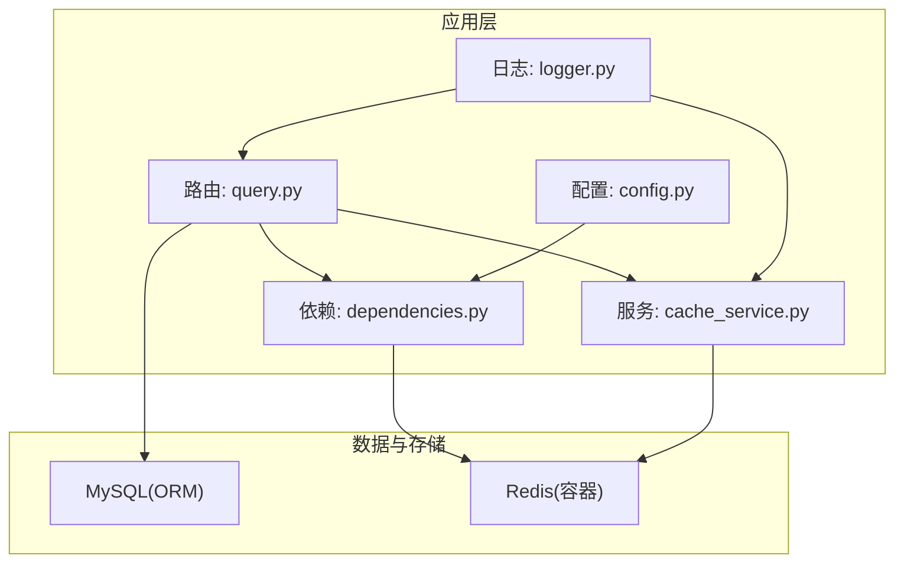
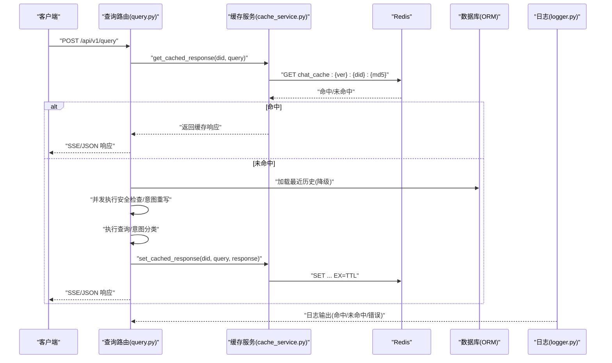
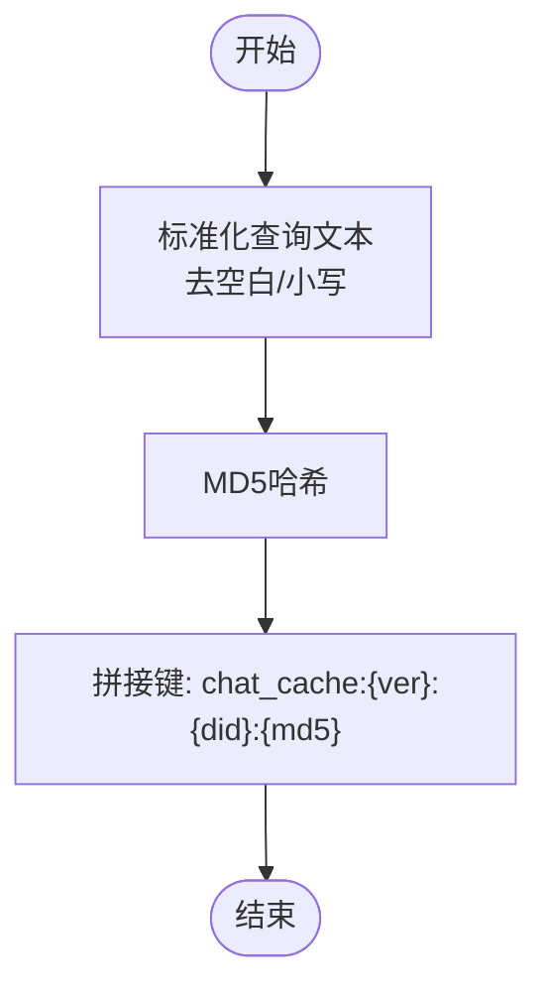
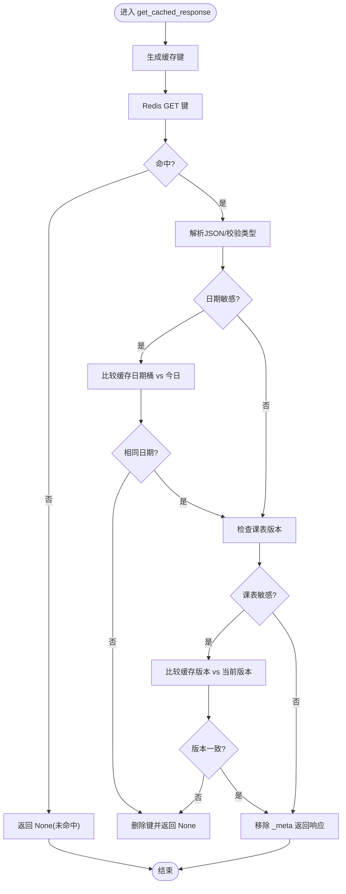
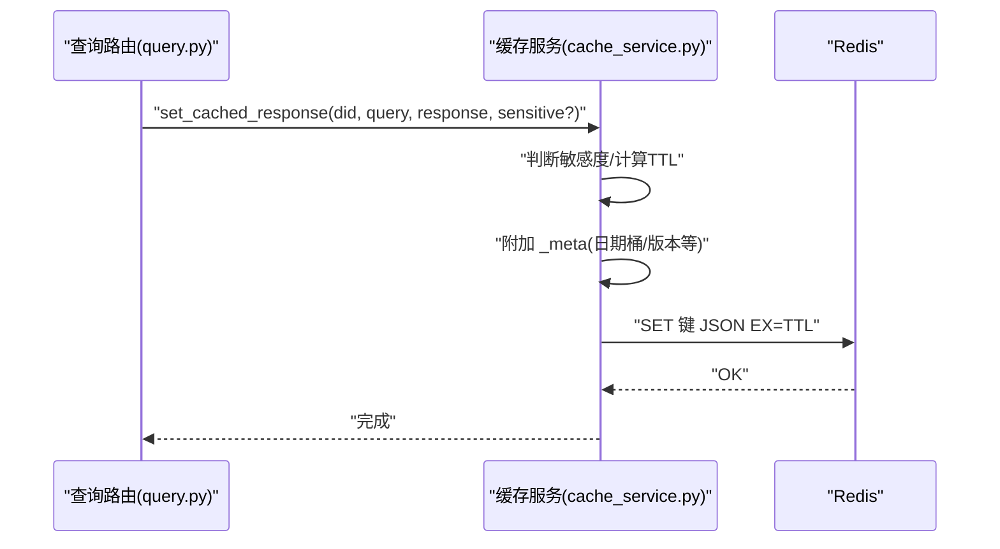
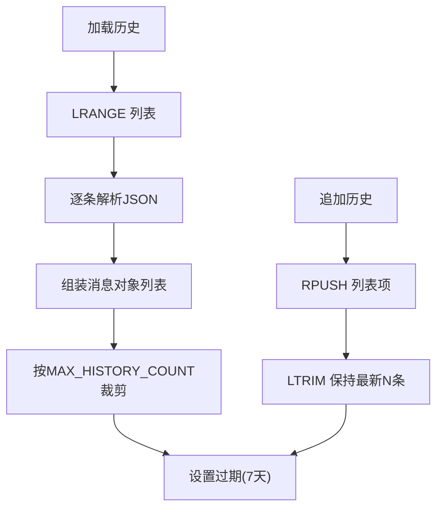
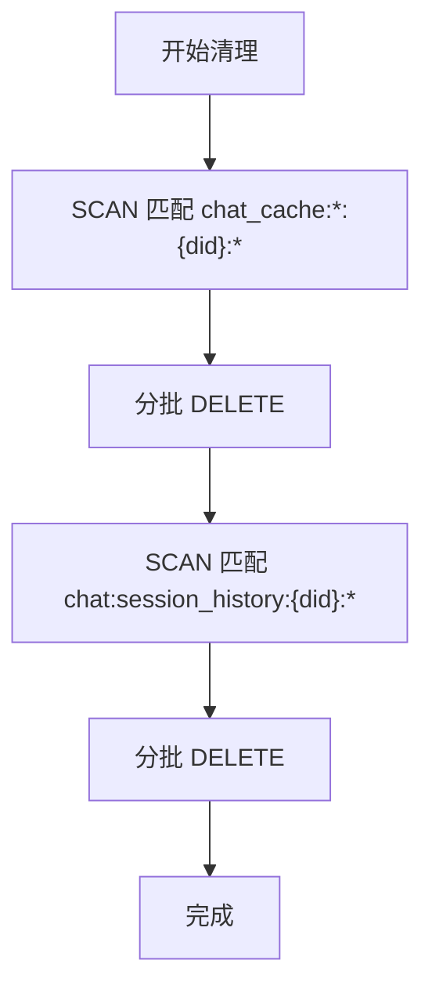
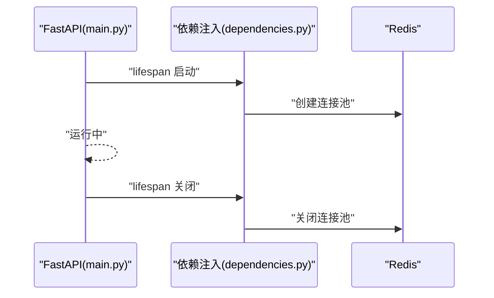
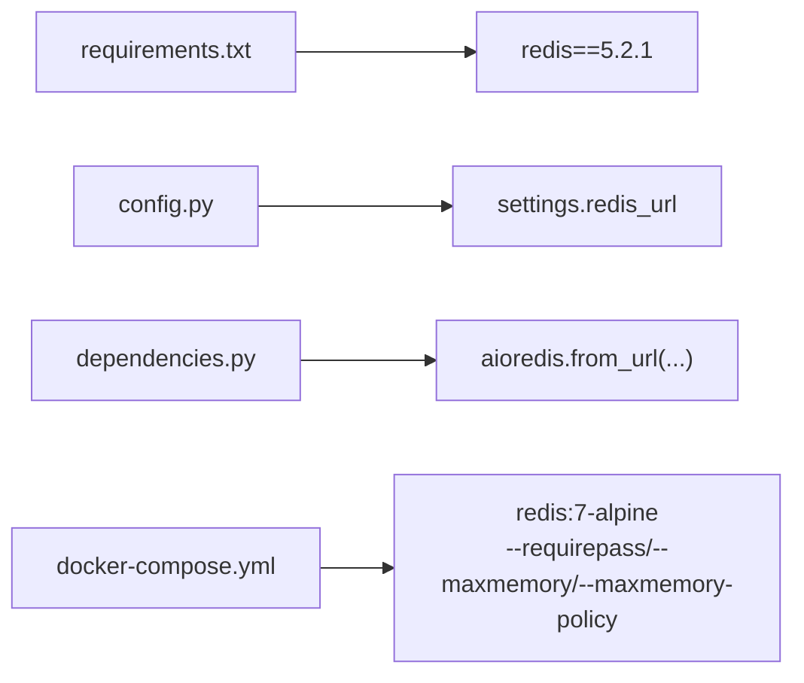

# 缓存系统

<cite>
**本文引用的文件**
- [cache_service.py](file://service/ai_assistant/app/services/cache_service.py)
- [config.py](file://service/ai_assistant/app/config.py)
- [dependencies.py](file://service/ai_assistant/app/dependencies.py)
- [query.py](file://service/ai_assistant/app/routers/query.py)
- [main.py](file://service/ai_assistant/app/main.py)
- [docker-compose.yml](file://service/ai_assistant/docker-compose.yml)
- [requirements.txt](file://service/ai_assistant/requirements.txt)
- [logger.py](file://service/ai_assistant/app/utils/logger.py)
- [chat_log_service.py](file://service/ai_assistant/app/services/chat_log_service.py)
</cite>

## 目录
1. [简介](#简介)
2. [项目结构](#项目结构)
3. [核心组件](#核心组件)
4. [架构总览](#架构总览)
5. [详细组件分析](#详细组件分析)
6. [依赖分析](#依赖分析)
7. [性能考虑](#性能考虑)
8. [故障排查指南](#故障排查指南)
9. [结论](#结论)
10. [附录](#附录)

## 简介
本文件面向“AI校园助手”项目的缓存系统，聚焦Redis缓存架构的设计与实现，涵盖缓存策略选择、键设计原则、失效机制、读写流程、并发控制与性能优化。文档同时给出不同数据类型的缓存策略（查询结果、会话历史、配置数据等）、命中率优化、内存管理与缓存穿透防护、配置参数与过期时间设置、缓存清理策略，以及架构图与性能监控指标，帮助开发者理解并持续优化缓存系统。

## 项目结构
缓存系统主要分布在以下模块：
- 配置层：集中管理Redis连接参数与缓存TTL配置
- 依赖注入层：提供Redis客户端单例与生命周期管理
- 缓存服务层：封装缓存键生成、读取、写入、失效策略
- 查询路由层：在业务主链路中集成缓存读写与会话历史
- 运行时与容器：Redis容器化部署与内存策略
- 日志与监控：统一日志输出，便于缓存命中/失效追踪

图表来源
- [query.py](file://service/ai_assistant/app/routers/query.py)
- [cache_service.py](file://service/ai_assistant/app/services/cache_service.py)
- [dependencies.py](file://service/ai_assistant/app/dependencies.py)
- [config.py](file://service/ai_assistant/app/config.py)
- [docker-compose.yml](file://service/ai_assistant/docker-compose.yml)

章节来源
- [main.py:36-49](file://service/ai_assistant/app/main.py#L36-L49)
- [dependencies.py:36-50](file://service/ai_assistant/app/dependencies.py#L36-L50)
- [config.py:26-100](file://service/ai_assistant/app/config.py#L26-L100)
- [docker-compose.yml:5-24](file://service/ai_assistant/docker-compose.yml#L5-L24)

## 核心组件
- 缓存键设计：采用“版本:设备标识:查询哈希”的复合键，确保查询一致性与版本隔离
- 缓存策略：按敏感度区分TTL；对日期敏感与课表敏感查询增加额外失效条件
- 会话历史：基于DID与会话ID的列表结构，限制长度并设置过期
- 清理策略：按DID维度批量扫描删除缓存与历史
- 连接管理：FastAPI生命周期内统一创建/关闭Redis连接池

章节来源
- [cache_service.py:49-90](file://service/ai_assistant/app/services/cache_service.py#L49-L90)
- [query.py:153-196](file://service/ai_assistant/app/routers/query.py#L153-L196)
- [query.py:748-786](file://service/ai_assistant/app/routers/query.py#L748-L786)
- [dependencies.py:36-50](file://service/ai_assistant/app/dependencies.py#L36-L50)
- [main.py:43-48](file://service/ai_assistant/app/main.py#L43-L48)

## 架构总览
缓存系统在查询主流程中的位置如下：

图表来源
- [query.py:207-745](file://service/ai_assistant/app/routers/query.py#L207-L745)
- [cache_service.py:92-176](file://service/ai_assistant/app/services/cache_service.py#L92-L176)
- [logger.py:17-46](file://service/ai_assistant/app/utils/logger.py#L17-L46)

## 详细组件分析

### 缓存键设计与版本控制
- 键格式：chat_cache:{版本}:{did}:{查询MD5}
- 版本号：用于在查询/总结逻辑升级时隔离旧缓存，避免脏数据复用
- 设备标识：结合DID与会话ID，实现用户级隔离
- 查询哈希：对标准化后的查询文本进行MD5，保证同问不同表达命中同一缓存

图表来源
- [cache_service.py:49-52](file://service/ai_assistant/app/services/cache_service.py#L49-L52)
- [cache_service.py:40-41](file://service/ai_assistant/app/services/cache_service.py#L40-L41)

章节来源
- [cache_service.py:39-52](file://service/ai_assistant/app/services/cache_service.py#L39-L52)

### 缓存读取与失效策略
- 基础TTL：普通查询1天，敏感查询30分钟
- 日期敏感：对包含相对日期/周/学期等语义的查询，按“日期桶”每日失效
- 课表敏感：管理员修改课表后递增版本号，按版本号失效旧缓存
- 元数据：缓存体包含_meta字段，记录日期桶与课表版本，读取时校验并必要时删除

图表来源
- [cache_service.py:92-146](file://service/ai_assistant/app/services/cache_service.py#L92-L146)
- [cache_service.py:70-82](file://service/ai_assistant/app/services/cache_service.py#L70-L82)

章节来源
- [cache_service.py:55-67](file://service/ai_assistant/app/services/cache_service.py#L55-L67)
- [cache_service.py:85-89](file://service/ai_assistant/app/services/cache_service.py#L85-L89)
- [cache_service.py:114-142](file://service/ai_assistant/app/services/cache_service.py#L114-L142)

### 缓存写入与元数据
- 写入前检测敏感度，决定TTL
- 写入时附加_meta：日期敏感标记、日期桶、课表敏感标记、当前课表版本
- 写入后记录日志，便于监控与排障

图表来源
- [cache_service.py:149-176](file://service/ai_assistant/app/services/cache_service.py#L149-L176)
- [query.py:605-615](file://service/ai_assistant/app/routers/query.py#L605-L615)
- [query.py:709-714](file://service/ai_assistant/app/routers/query.py#L709-L714)

章节来源
- [cache_service.py:149-176](file://service/ai_assistant/app/services/cache_service.py#L149-L176)
- [query.py:605-615](file://service/ai_assistant/app/routers/query.py#L605-L615)
- [query.py:709-714](file://service/ai_assistant/app/routers/query.py#L709-L714)

### 会话历史缓存
- 键格式：chat:session_history:{did}:{session_id}
- 存储结构：列表，按时间顺序追加
- 限制与过期：限制长度，设置7天过期，避免无限增长
- 用途：为意图重写与总结提供上下文，减少重复查询

图表来源
- [query.py:157-196](file://service/ai_assistant/app/routers/query.py#L157-L196)

章节来源
- [query.py:153-196](file://service/ai_assistant/app/routers/query.py#L153-L196)

### 清理策略与批量删除
- 按DID维度清理：删除缓存键与会话历史键
- 扫描与批删：使用scan_iter迭代匹配键，分批删除，避免阻塞

图表来源
- [query.py:748-786](file://service/ai_assistant/app/routers/query.py#L748-L786)

章节来源
- [query.py:748-786](file://service/ai_assistant/app/routers/query.py#L748-L786)

### Redis连接与生命周期管理
- 单例客户端：依赖注入层提供Redis单例，避免重复连接
- 生命周期：应用启动时初始化，关闭时统一释放连接池
- 容器化部署：Redis容器设置密码、最大内存与LRU淘汰策略

图表来源
- [main.py:36-49](file://service/ai_assistant/app/main.py#L36-L49)
- [dependencies.py:36-50](file://service/ai_assistant/app/dependencies.py#L36-L50)
- [docker-compose.yml:5-24](file://service/ai_assistant/docker-compose.yml#L5-L24)

章节来源
- [main.py:36-49](file://service/ai_assistant/app/main.py#L36-L49)
- [dependencies.py:36-50](file://service/ai_assistant/app/dependencies.py#L36-L50)
- [docker-compose.yml:5-24](file://service/ai_assistant/docker-compose.yml#L5-L24)

## 依赖分析
- Redis客户端：使用redis.asyncio作为异步客户端
- 配置来源：从环境变量读取Redis连接参数与缓存TTL
- 容器化：Redis使用Alpine镜像，设置密码、最大内存与LRU策略
- 日志：统一使用Loguru输出，便于缓存命中/失效与异常追踪

图表来源
- [requirements.txt](file://service/ai_assistant/requirements.txt#L5)
- [config.py:94-100](file://service/ai_assistant/app/config.py#L94-L100)
- [dependencies.py:40-44](file://service/ai_assistant/app/dependencies.py#L40-L44)
- [docker-compose.yml:5-15](file://service/ai_assistant/docker-compose.yml#L5-L15)

章节来源
- [requirements.txt](file://service/ai_assistant/requirements.txt#L5)
- [config.py:26-100](file://service/ai_assistant/app/config.py#L26-L100)
- [docker-compose.yml:5-15](file://service/ai_assistant/docker-compose.yml#L5-L15)

## 性能考虑
- 命中率优化
  - 优先缓存高频查询：对常见问题与标准表述进行缓存
  - 合理TTL：敏感数据短TTL，通用信息长TTL
  - 日期敏感与课表敏感失效：避免跨天/课表变更导致的陈旧结果
- 并发控制
  - 异步Redis客户端：避免阻塞主线程
  - 会话历史列表：原子操作RPUSH/LTRIM，避免并发覆盖
- 内存管理
  - Redis容器设置最大内存与LRU策略，防止OOM
  - 会话历史限制长度与过期，控制键数量
- 网络与序列化
  - JSON序列化简洁可靠，避免复杂对象
  - SSE流式输出：尽早释放数据库连接，降低延迟

章节来源
- [cache_service.py:85-89](file://service/ai_assistant/app/services/cache_service.py#L85-L89)
- [query.py:157-196](file://service/ai_assistant/app/routers/query.py#L157-L196)
- [docker-compose.yml:14-15](file://service/ai_assistant/docker-compose.yml#L14-L15)

## 故障排查指南
- 缓存未命中
  - 检查键格式与版本号是否匹配
  - 核对敏感度判断与TTL设置
  - 查看日志中“Cache miss/parse failed/invalidate key”等信息
- 缓存陈旧
  - 日期敏感：确认日期桶是否跨日
  - 课表敏感：确认版本号是否递增
- Redis异常
  - 检查连接池是否正确创建/关闭
  - 查看容器健康检查与密码配置
- 日志定位
  - 使用统一日志输出，定位缓存读写与异常路径

章节来源
- [cache_service.py:92-146](file://service/ai_assistant/app/services/cache_service.py#L92-L146)
- [logger.py:17-46](file://service/ai_assistant/app/utils/logger.py#L17-L46)
- [main.py:43-48](file://service/ai_assistant/app/main.py#L43-L48)
- [docker-compose.yml:18-22](file://service/ai_assistant/docker-compose.yml#L18-L22)

## 结论
本缓存系统通过明确的键设计、差异化TTL、日期与课表敏感失效策略，实现了高命中率与低风险的查询缓存；配合会话历史缓存与批量清理能力，兼顾了上下文质量与资源控制。在容器化部署与异步Redis客户端加持下，系统具备良好的扩展性与稳定性。建议在生产中结合日志与监控指标持续优化TTL与键策略，进一步提升命中率与用户体验。

## 附录

### 缓存配置参数与过期时间
- Redis连接参数：主机、端口、密码、数据库
- 缓存TTL：敏感查询30分钟，普通查询1天
- 会话历史：最多N条，7天过期

章节来源
- [config.py:26-100](file://service/ai_assistant/app/config.py#L26-L100)
- [config.py:81-84](file://service/ai_assistant/app/config.py#L81-L84)
- [query.py:153-196](file://service/ai_assistant/app/routers/query.py#L153-L196)

### 缓存键与元数据字段
- 键示例：chat_cache:v3:{did}:{md5}
- 元数据字段：date_sensitive、date_bucket、schedule_sensitive、schedule_cache_version

章节来源
- [cache_service.py:49-52](file://service/ai_assistant/app/services/cache_service.py#L49-L52)
- [cache_service.py:167-172](file://service/ai_assistant/app/services/cache_service.py#L167-L172)

### 性能监控指标建议
- 缓存命中率：(命中次数)/(命中+未命中)
- 平均响应时间：含缓存与不含缓存对比
- Redis内存使用率与键数量趋势
- 日志统计：未命中原因分布（敏感/日期/版本/解析失败）

章节来源
- [logger.py:17-46](file://service/ai_assistant/app/utils/logger.py#L17-L46)