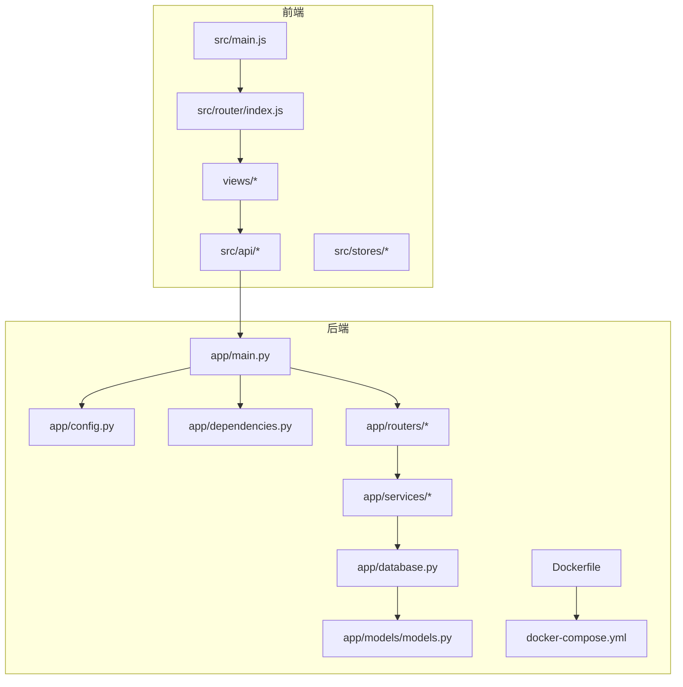
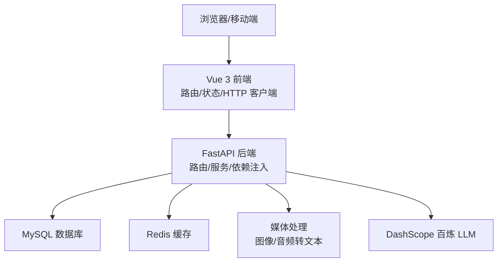
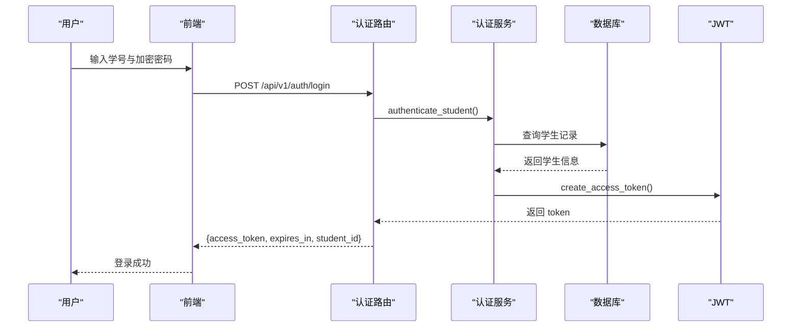
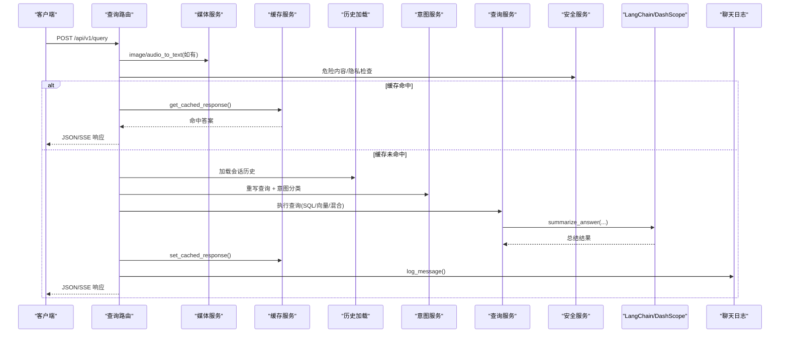
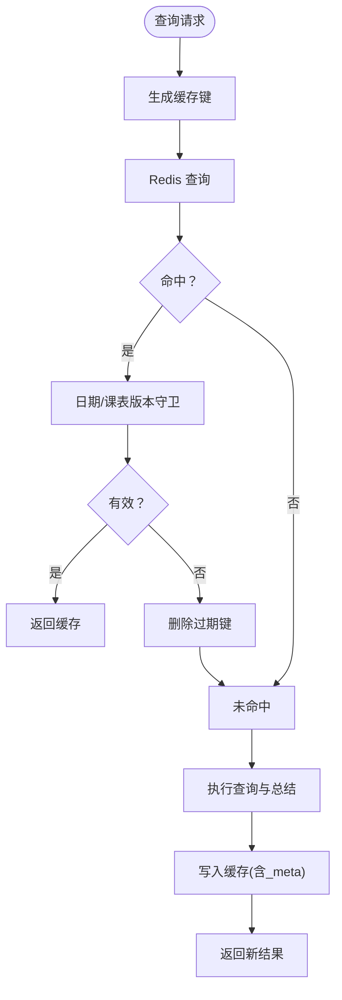
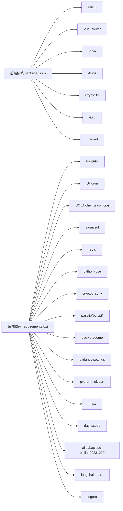

# 架构设计

<cite>
**本文档引用的文件**
- [service/ai_assistant/app/main.py](file://service/ai_assistant/app/main.py)
- [service/ai_assistant/app/config.py](file://service/ai_assistant/app/config.py)
- [service/ai_assistant/app/routers/auth.py](file://service/ai_assistant/app/routers/auth.py)
- [service/ai_assistant/app/routers/query.py](file://service/ai_assistant/app/routers/query.py)
- [service/ai_assistant/app/services/langchain_service.py](file://service/ai_assistant/app/services/langchain_service.py)
- [service/ai_assistant/app/services/cache_service.py](file://service/ai_assistant/app/services/cache_service.py)
- [service/ai_assistant/app/dependencies.py](file://service/ai_assistant/app/dependencies.py)
- [service/ai_assistant/app/database.py](file://service/ai_assistant/app/database.py)
- [service/ai_assistant/app/models/models.py](file://service/ai_assistant/app/models/models.py)
- [service/ai_assistant/docker-compose.yml](file://service/ai_assistant/docker-compose.yml)
- [service/ai_assistant/Dockerfile](file://service/ai_assistant/Dockerfile)
- [service/ai_assistant/requirements.txt](file://service/ai_assistant/requirements.txt)
- [frontend/ai_assistant/package.json](file://frontend/ai_assistant/package.json)
- [frontend/ai_assistant/src/main.js](file://frontend/ai_assistant/src/main.js)
- [frontend/ai_assistant/src/router/index.js](file://frontend/ai_assistant/src/router/index.js)
</cite>

## 目录
1. [引言](#引言)
2. [项目结构](#项目结构)
3. [核心组件](#核心组件)
4. [架构总览](#架构总览)
5. [详细组件分析](#详细组件分析)
6. [依赖分析](#依赖分析)
7. [性能考量](#性能考量)
8. [故障排查指南](#故障排查指南)
9. [结论](#结论)
10. [附录](#附录)

## 引言
本项目为“AI校园助手”，采用前后端分离架构，后端基于 FastAPI 构建，提供统一的多模态查询接口与认证体系；前端基于 Vue 3 + Pinia + Vue Router 构建，提供学生端与管理员端的交互界面。系统通过 MySQL 存储结构化校园数据，Redis 提供缓存与会话历史，DashScope（阿里云百炼）作为大模型推理后端，集成安全与隐私保护机制，并通过 Docker 与 docker-compose 实现容器化部署。

## 项目结构
- 后端服务位于 service/ai_assistant，采用分层组织：
  - app/main.py：应用入口与生命周期、CORS、路由注册
  - app/config.py：集中配置（数据库、Redis、JWT、DashScope、缓存 TTL 等）
  - app/routers/*：路由层（认证、查询、系统、管理）
  - app/services/*：业务服务层（缓存、安全、意图、查询、媒体、LangChain 适配等）
  - app/models/models.py：ORM 模型（学生、课程、成绩、课表、管理员、聊天日志等）
  - app/database.py：数据库引擎与会话管理
  - app/dependencies.py：依赖注入（数据库、Redis、鉴权）
  - docker-compose.yml 与 Dockerfile：容器化与运行时配置
- 前端位于 frontend/ai_assistant，采用 Vue 3 单页应用：
  - src/main.js：应用初始化（Pinia、Router、App）
  - src/router/index.js：路由与导航守卫
  - src/stores/*：状态管理（认证、管理员、聊天）
  - src/api/*：HTTP 客户端封装
  - src/views/*：页面视图（登录、聊天、资料、管理员面板等）



**图表来源**
- [service/ai_assistant/app/main.py:1-86](file://service/ai_assistant/app/main.py#L1-L86)
- [service/ai_assistant/app/config.py:1-113](file://service/ai_assistant/app/config.py#L1-L113)
- [service/ai_assistant/app/dependencies.py:1-109](file://service/ai_assistant/app/dependencies.py#L1-L109)
- [service/ai_assistant/app/database.py:1-35](file://service/ai_assistant/app/database.py#L1-L35)
- [service/ai_assistant/app/models/models.py:1-660](file://service/ai_assistant/app/models/models.py#L1-L660)
- [service/ai_assistant/Dockerfile:1-49](file://service/ai_assistant/Dockerfile#L1-L49)
- [service/ai_assistant/docker-compose.yml:1-31](file://service/ai_assistant/docker-compose.yml#L1-L31)
- [frontend/ai_assistant/src/main.js:1-10](file://frontend/ai_assistant/src/main.js#L1-L10)
- [frontend/ai_assistant/src/router/index.js:1-75](file://frontend/ai_assistant/src/router/index.js#L1-L75)

**章节来源**
- [service/ai_assistant/app/main.py:1-86](file://service/ai_assistant/app/main.py#L1-L86)
- [service/ai_assistant/app/config.py:1-113](file://service/ai_assistant/app/config.py#L1-L113)
- [service/ai_assistant/Dockerfile:1-49](file://service/ai_assistant/Dockerfile#L1-L49)
- [service/ai_assistant/docker-compose.yml:1-31](file://service/ai_assistant/docker-compose.yml#L1-L31)
- [frontend/ai_assistant/src/main.js:1-10](file://frontend/ai_assistant/src/main.js#L1-L10)
- [frontend/ai_assistant/src/router/index.js:1-75](file://frontend/ai_assistant/src/router/index.js#L1-L75)

## 核心组件
- 应用入口与生命周期：初始化 FastAPI、设置日志、CORS、注册路由、生命周期钩子（启动/关闭时清理 Redis 连接池）
- 配置中心：集中管理数据库、Redis、JWT、AES、DashScope、百炼检索、缓存 TTL、CORS 源等
- 路由层：认证路由（登录、改密）、查询路由（统一多模态入口）、系统与管理路由
- 业务服务层：
  - 缓存服务：基于 Redis 的键空间设计、敏感度与日期/课表版本失效策略
  - 安全与隐私：危险内容检测、隐私违规拦截、DID 隐私标识
  - 意图与查询：意图分类、查询改写、结构化/向量/混合检索、总结生成
  - LangChain 适配：DashScope 调用、消息裁剪、流式/非流式生成
  - 媒体服务：图像/音频转文本
  - 聊天日志：持久化对话历史与系统动作
- 数据访问层：SQLAlchemy 异步 ORM、模型定义、索引与约束
- 依赖注入：数据库会话、Redis 客户端、JWT 校验、管理员鉴权
- 容器化：Python 运行时镜像、MySQL 客户端与 ffmpeg、非 root 用户、Uvicorn 启动

**章节来源**
- [service/ai_assistant/app/main.py:1-86](file://service/ai_assistant/app/main.py#L1-L86)
- [service/ai_assistant/app/config.py:1-113](file://service/ai_assistant/app/config.py#L1-L113)
- [service/ai_assistant/app/routers/auth.py:1-102](file://service/ai_assistant/app/routers/auth.py#L1-L102)
- [service/ai_assistant/app/routers/query.py:1-788](file://service/ai_assistant/app/routers/query.py#L1-L788)
- [service/ai_assistant/app/services/cache_service.py:1-177](file://service/ai_assistant/app/services/cache_service.py#L1-L177)
- [service/ai_assistant/app/services/langchain_service.py:1-278](file://service/ai_assistant/app/services/langchain_service.py#L1-L278)
- [service/ai_assistant/app/dependencies.py:1-109](file://service/ai_assistant/app/dependencies.py#L1-L109)
- [service/ai_assistant/app/database.py:1-35](file://service/ai_assistant/app/database.py#L1-L35)
- [service/ai_assistant/app/models/models.py:1-660](file://service/ai_assistant/app/models/models.py#L1-L660)

## 架构总览
系统采用前后端分离与微服务集成模式：
- 表现层：Vue 3 前端，负责用户交互、状态管理与路由控制
- 业务层：FastAPI 后端，统一认证、多模态查询、意图与检索、安全与隐私、缓存与日志
- 数据访问层：MySQL + SQLAlchemy 异步 ORM，存储结构化校园数据
- 外部集成：DashScope（百炼）提供多模态与对话能力；Redis 提供缓存与会话历史；ffmpeg 支持音频处理
- 部署：Docker 镜像 + docker-compose，后端服务与 Redis 容器编排



**图表来源**
- [service/ai_assistant/app/main.py:1-86](file://service/ai_assistant/app/main.py#L1-L86)
- [service/ai_assistant/app/config.py:1-113](file://service/ai_assistant/app/config.py#L1-L113)
- [service/ai_assistant/app/services/langchain_service.py:1-278](file://service/ai_assistant/app/services/langchain_service.py#L1-L278)
- [service/ai_assistant/app/services/cache_service.py:1-177](file://service/ai_assistant/app/services/cache_service.py#L1-L177)
- [service/ai_assistant/docker-compose.yml:1-31](file://service/ai_assistant/docker-compose.yml#L1-L31)
- [frontend/ai_assistant/package.json:1-24](file://frontend/ai_assistant/package.json#L1-L24)

## 详细组件分析

### 认证与授权流程
- 登录：接收加密密码，校验学生身份，签发 JWT
- 修改密码：校验旧密码与权限，更新加密密码
- 鉴权：Bearer Token 校验，区分学生与管理员



**图表来源**
- [service/ai_assistant/app/routers/auth.py:1-102](file://service/ai_assistant/app/routers/auth.py#L1-L102)
- [service/ai_assistant/app/dependencies.py:56-72](file://service/ai_assistant/app/dependencies.py#L56-L72)

**章节来源**
- [service/ai_assistant/app/routers/auth.py:1-102](file://service/ai_assistant/app/routers/auth.py#L1-L102)
- [service/ai_assistant/app/dependencies.py:56-72](file://service/ai_assistant/app/dependencies.py#L56-L72)

### 多模态统一查询流程
- 输入：文本/图像/音频三模态组合
- 处理：图像/音频转文本、安全检查、缓存命中、历史加载、意图分类、查询执行、总结生成、缓存写入、日志持久化
- 输出：JSON 或 SSE 流式响应



**图表来源**
- [service/ai_assistant/app/routers/query.py:1-788](file://service/ai_assistant/app/routers/query.py#L1-L788)
- [service/ai_assistant/app/services/cache_service.py:1-177](file://service/ai_assistant/app/services/cache_service.py#L1-L177)
- [service/ai_assistant/app/services/langchain_service.py:1-278](file://service/ai_assistant/app/services/langchain_service.py#L1-L278)

**章节来源**
- [service/ai_assistant/app/routers/query.py:1-788](file://service/ai_assistant/app/routers/query.py#L1-L788)
- [service/ai_assistant/app/services/cache_service.py:1-177](file://service/ai_assistant/app/services/cache_service.py#L1-L177)
- [service/ai_assistant/app/services/langchain_service.py:1-278](file://service/ai_assistant/app/services/langchain_service.py#L1-L278)

### 缓存策略与失效机制
- 键空间：chat_cache:{version}:{did}:{md5(query)}
- TTL：敏感/普通两类；日期敏感查询按“日”桶失效；课表敏感查询通过版本号失效
- 版本控制：管理员调整课表后递增版本，强制失效相关缓存



**图表来源**
- [service/ai_assistant/app/services/cache_service.py:1-177](file://service/ai_assistant/app/services/cache_service.py#L1-L177)

**章节来源**
- [service/ai_assistant/app/services/cache_service.py:1-177](file://service/ai_assistant/app/services/cache_service.py#L1-L177)

### 数据模型与关系
- 核心实体：管理员、部门、专业、班级、教师、学期、课程、教室、学生、选课、成绩、课表、排课-班级映射、调课单、聊天日志
- 关系：一对多/多对多、外键约束、索引优化
- 场景化枚举：角色、状态、课程类型、日程状态、操作类型、发送方、系统动作

```mermaid
erDiagram
ADMIN_USER {
bigint admin_id PK
string admin_code UK
string username UK
string password_hash
string display_name
enum role
enum status
datetime last_login_at
datetime created_at
datetime updated_at
}
DEPARTMENT {
string dept_id PK
string name UK
}
MAJOR {
string major_id PK
string name
string dept_id FK
}
CLASS {
string class_id PK
string name
string major_id FK
int grade
}
TEACHER {
string teacher_id PK
string name
string title
string dept_id FK
string phone
string email
string office_hours
string office_room
}
TERM {
string term_id PK
date start_date
date end_date
}
COURSE {
string course_id PK
string course_name
int credit
enum course_type
}
CLASSROOM {
string room_id PK
enum room_type
string location
int capacity
}
STUDENT {
string student_id PK
string name
string gender
date date_of_birth
int enroll_year
string class_id FK
string phone
string email
enum status
string password_hash
}
ENROLLMENT {
int enrollment_id PK
string student_id FK
string course_id FK
string term_id FK
}
SCORE {
int score_id PK
string student_id FK
string course_id FK
string term_id FK
int score
boolean credit_earned
boolean cheating
}
SCHEDULE {
string schedule_id PK
string course_id FK
string teacher_id FK
string room_id FK
string term_id FK
int week_no
int day_of_week
int start_period
int end_period
string week_pattern
enum schedule_status
int version
bigint updated_by_admin_id FK
datetime updated_at
}
SCHEDULE_CLASS_MAP {
string schedule_id PK
string class_id PK
datetime created_at
bigint created_by_admin_id FK
}
SCHEDULE_ADJUSTMENT {
bigint adjustment_id PK
string schedule_id FK
string term_id FK
enum operation_type
string reason
enum status
int expected_schedule_version
int old_week_no
int old_day_of_week
int old_start_period
int old_end_period
string old_room_id
string old_teacher_id
int new_week_no
int new_day_of_week
int new_start_period
int new_end_period
string new_room_id
string new_teacher_id
bigint requested_by_admin_id FK
bigint approved_by_admin_id FK
datetime requested_at
datetime approved_at
datetime applied_at
bigint rollback_of_adjustment_id FK
text conflict_snapshot
}
CHAT_LOG {
bigint log_id PK
string did
string student_id
datetime timestamp
enum sender
text message_content
enum system_action
int response_time_ms
}
ADMIN_USER ||--o{ ADMIN_ACTION_LOG : "action_logs"
DEPARTMENT ||--o{ MAJOR : "majors"
MAJOR ||--o{ CLASS : "classes"
DEPARTMENT ||--o{ TEACHER : "teachers"
CLASS ||--o{ STUDENT : "students"
STUDENT ||--o{ ENROLLMENT : "enrollments"
COURSE ||--o{ ENROLLMENT : "enrollments"
TERM ||--o{ ENROLLMENT : "enrollments"
STUDENT ||--o{ SCORE : "scores"
COURSE ||--o{ SCORE : "scores"
TERM ||--o{ SCORE : "scores"
COURSE ||--o{ SCHEDULE : "schedules"
TEACHER ||--o{ SCHEDULE : "schedules"
CLASSROOM ||--o{ SCHEDULE : "schedules"
TERM ||--o{ SCHEDULE : "schedules"
SCHEDULE ||--o{ SCHEDULE_CLASS_MAP : "class_mappings"
CLASS ||--o{ SCHEDULE_CLASS_MAP : "schedule_mappings"
ADMIN_USER ||--o{ SCHEDULE : "updated_schedules"
ADMIN_USER ||--o{ SCHEDULE_CLASS_MAP : "created_schedule_mappings"
ADMIN_USER ||--o{ SCHEDULE_ADJUSTMENT : "requested_adjustments"
ADMIN_USER ||--o{ SCHEDULE_ADJUSTMENT : "approved_adjustments"
SCHEDULE ||--o{ SCHEDULE_ADJUSTMENT : "adjustments"
TERM ||--o{ SCHEDULE_ADJUSTMENT : "adjustments"
SCHEDULE ||--o{ CHAT_LOG : "chat_log"
```

**图表来源**
- [service/ai_assistant/app/models/models.py:1-660](file://service/ai_assistant/app/models/models.py#L1-L660)

**章节来源**
- [service/ai_assistant/app/models/models.py:1-660](file://service/ai_assistant/app/models/models.py#L1-L660)

### 安全与隐私机制
- JWT：学生与管理员双通道鉴权，超时与签名算法配置
- AES：传输加密密钥与盐值，前后端一致
- 隐私：DID 唯一标识，会话历史隔离，隐私违规拦截
- 安全：危险内容检测，干预提示与记录

**章节来源**
- [service/ai_assistant/app/config.py:32-44](file://service/ai_assistant/app/config.py#L32-L44)
- [service/ai_assistant/app/routers/query.py:350-470](file://service/ai_assistant/app/routers/query.py#L350-L470)

### 前后端交互与路由
- 前端：Vue 3 + Pinia + Router，路由守卫实现登录态与页面权限控制
- 后端：FastAPI 路由注册，CORS 配置，依赖注入与生命周期管理

**章节来源**
- [frontend/ai_assistant/src/main.js:1-10](file://frontend/ai_assistant/src/main.js#L1-L10)
- [frontend/ai_assistant/src/router/index.js:1-75](file://frontend/ai_assistant/src/router/index.js#L1-L75)
- [service/ai_assistant/app/main.py:70-86](file://service/ai_assistant/app/main.py#L70-L86)

## 依赖分析
- 技术栈选择与优势
  - FastAPI：高性能 ASGI 框架，自动生成 OpenAPI 文档，类型安全与异步支持
  - Vue 3：响应式与 Composition API，生态成熟，适合交互密集型应用
  - MySQL + SQLAlchemy：成熟的关系型数据库与 ORM，事务与索引优化
  - Redis：低延迟缓存与会话历史，支持 TTL 与键扫描清理
  - DashScope（百炼）：多模态与对话能力，适配 LangChain，支持流式输出
  - Docker：标准化构建与部署，便于横向扩展
- 外部依赖关系
  - 后端依赖：FastAPI、SQLAlchemy、aiomysql、redis、DashScope SDK、LangChain Core、ffmpeg
  - 前端依赖：Vue 3、Vue Router、Pinia、Axios、CryptoJS、UUID、Marked



**图表来源**
- [frontend/ai_assistant/package.json:1-24](file://frontend/ai_assistant/package.json#L1-L24)
- [service/ai_assistant/requirements.txt:1-22](file://service/ai_assistant/requirements.txt#L1-L22)

**章节来源**
- [frontend/ai_assistant/package.json:1-24](file://frontend/ai_assistant/package.json#L1-L24)
- [service/ai_assistant/requirements.txt:1-22](file://service/ai_assistant/requirements.txt#L1-L22)

## 性能考量
- 异步与并发
  - SQLAlchemy 异步引擎与会话，避免阻塞
  - 查询路由中并行执行安全检查与查询重写，缩短端到端延迟
- 缓存优化
  - Redis 缓存键空间与 TTL 策略，敏感/日期/课表版本失效，减少重复计算
  - 流式输出使用 SSE，边生成边返回，降低首字节延迟
- I/O 与资源
  - ffmpeg 支持音频转文本，媒体处理异步化
  - Docker 镜像分阶段构建，减少体积与安装时间
- 数据库与索引
  - 模型定义包含索引与约束，查询路径优化

**章节来源**
- [service/ai_assistant/app/routers/query.py:347-352](file://service/ai_assistant/app/routers/query.py#L347-L352)
- [service/ai_assistant/app/services/cache_service.py:85-89](file://service/ai_assistant/app/services/cache_service.py#L85-L89)
- [service/ai_assistant/Dockerfile:1-49](file://service/ai_assistant/Dockerfile#L1-L49)
- [service/ai_assistant/app/models/models.py:1-660](file://service/ai_assistant/app/models/models.py#L1-L660)

## 故障排查指南
- 启动与安全警告
  - 检测不安全默认配置（JWT/AES/DID），生产环境务必替换
- Redis 连接与缓存
  - 缓存读取异常时降级回数据库历史；清理会话缓存与历史键
- LLM 调用
  - DashScope 调用失败或输入过长时的日志与错误映射
- 数据库连接
  - 异常时检查连接池参数与超时设置
- 前端路由
  - 登录态与页面权限校验，确保正确重定向

**章节来源**
- [service/ai_assistant/app/main.py:25-33](file://service/ai_assistant/app/main.py#L25-L33)
- [service/ai_assistant/app/routers/query.py:752-786](file://service/ai_assistant/app/routers/query.py#L752-L786)
- [service/ai_assistant/app/services/langchain_service.py:189-203](file://service/ai_assistant/app/services/langchain_service.py#L189-L203)
- [service/ai_assistant/app/database.py:7-12](file://service/ai_assistant/app/database.py#L7-L12)
- [frontend/ai_assistant/src/router/index.js:58-73](file://frontend/ai_assistant/src/router/index.js#L58-L73)

## 结论
本架构以 FastAPI 为核心，结合 Vue 3 前端、MySQL/Redis 数据层与 DashScope 大模型服务，实现了高可用、可扩展、可维护的校园智能问答系统。通过严格的分层设计、完善的缓存与安全策略、以及容器化部署，系统在性能与稳定性方面具备良好基础。后续可在模型路由、检索增强与可观测性方面进一步优化。

## 附录
- 系统边界与集成点
  - 前端：Vue 3 SPA，通过 Axios 调用后端 REST API
  - 后端：FastAPI REST API，内部通过服务层解耦
  - 数据：MySQL 存储结构化数据，Redis 存储缓存与会话
  - 外部：DashScope 百炼提供多模态与对话能力
- 部署与运行
  - Dockerfile 定义运行时镜像与非 root 用户
  - docker-compose 编排 Redis 容器，暴露端口并健康检查

**章节来源**
- [service/ai_assistant/Dockerfile:1-49](file://service/ai_assistant/Dockerfile#L1-L49)
- [service/ai_assistant/docker-compose.yml:1-31](file://service/ai_assistant/docker-compose.yml#L1-L31)
- [frontend/ai_assistant/package.json:1-24](file://frontend/ai_assistant/package.json#L1-L24)