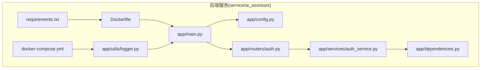
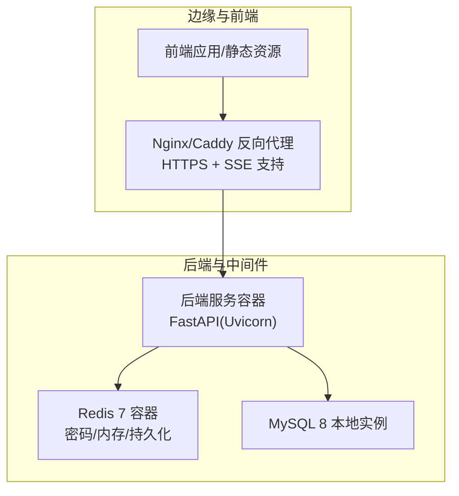
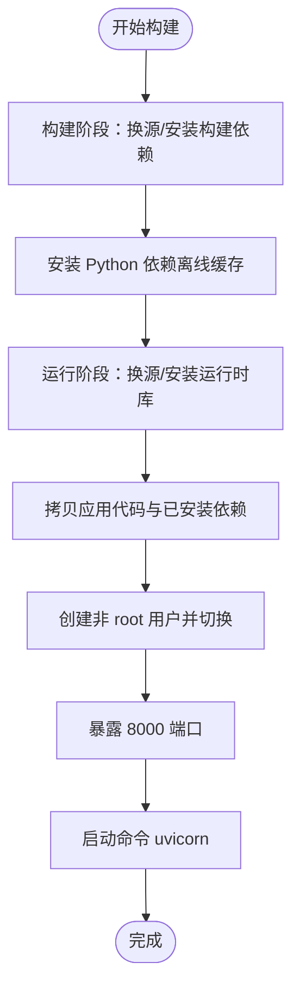
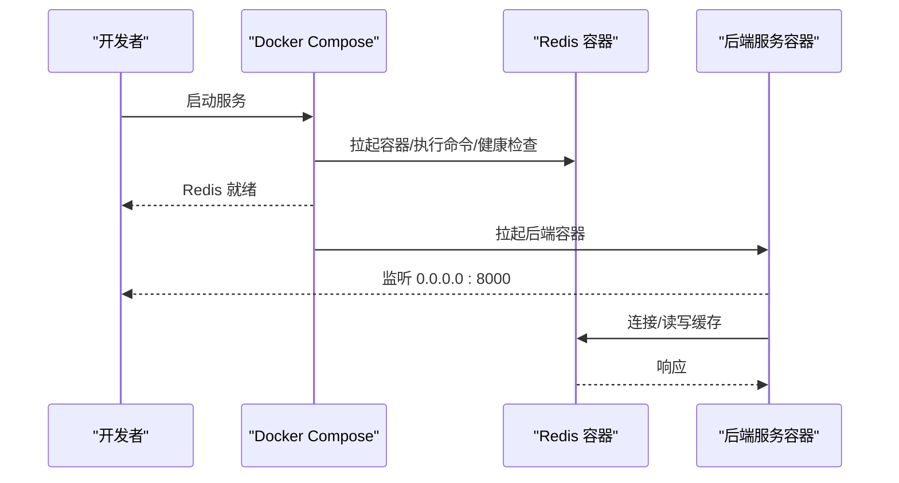
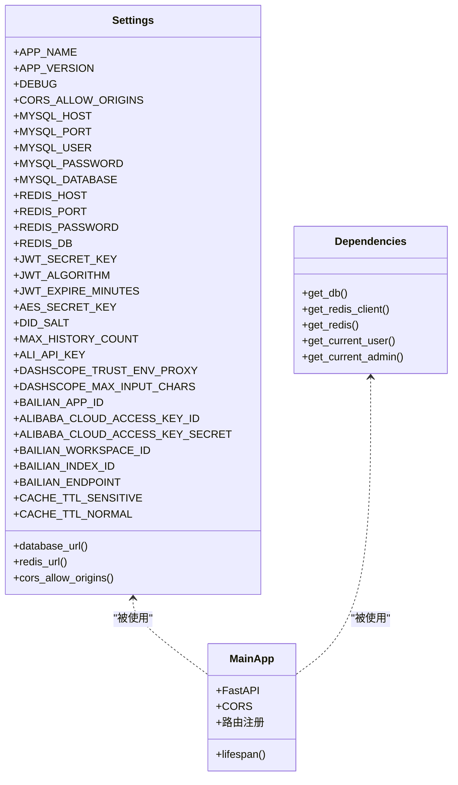
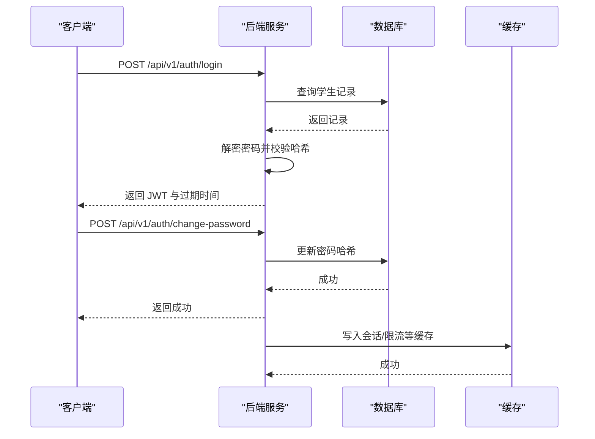
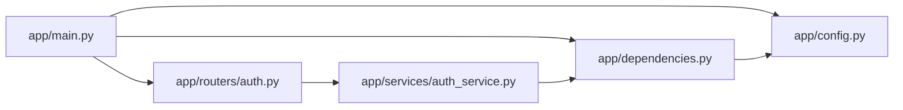

# 部署架构

<cite>
**本文引用的文件**
- [Dockerfile](file://service/ai_assistant/Dockerfile)
- [docker-compose.yml](file://service/ai_assistant/docker-compose.yml)
- [requirements.txt](file://service/ai_assistant/requirements.txt)
- [app/main.py](file://service/ai_assistant/app/main.py)
- [app/config.py](file://service/ai_assistant/app/config.py)
- [app/dependencies.py](file://service/ai_assistant/app/dependencies.py)
- [app/utils/logger.py](file://service/ai_assistant/app/utils/logger.py)
- [app/routers/auth.py](file://service/ai_assistant/app/routers/auth.py)
- [app/services/auth_service.py](file://service/ai_assistant/app/services/auth_service.py)
- [README.md（根）](file://README.md)
- [README.md（服务端）](file://service/ai_assistant/README.md)
</cite>

## 目录
1. [简介](#简介)
2. [项目结构](#项目结构)
3. [核心组件](#核心组件)
4. [架构总览](#架构总览)
5. [详细组件分析](#详细组件分析)
6. [依赖关系分析](#依赖关系分析)
7. [性能考量](#性能考量)
8. [故障排查指南](#故障排查指南)
9. [结论](#结论)
10. [附录](#附录)

## 简介
本文件面向AI校园助手项目的部署与运维团队，系统化阐述容器化部署的整体架构与实施策略，覆盖镜像构建、服务编排、微服务部署要点、环境配置管理、监控与日志、部署流水线与回滚机制，并提供可操作的配置文件与运维脚本路径，帮助快速落地生产级部署。

## 项目结构
- 后端服务位于 service/ai_assistant，包含：
  - Dockerfile：Python 3.11 运行时镜像，分阶段构建，内置依赖安装与非 root 用户运行。
  - docker-compose.yml：当前仅编排 Redis 缓存服务，MySQL 仍由本地实例提供。
  - requirements.txt：后端依赖清单（FastAPI、Uvicorn、SQLAlchemy、aiomysql、Redis、DashScope、LangChain、Loguru 等）。
  - app/：后端应用入口、配置、依赖注入、工具与路由/服务层。
- 顶层 README.md 与服务端 README.md 提供部署步骤、反向代理与 HTTPS 配置要点。

**图表来源**
- [Dockerfile:1-49](file://service/ai_assistant/Dockerfile#L1-L49)
- [docker-compose.yml:1-31](file://service/ai_assistant/docker-compose.yml#L1-L31)
- [requirements.txt:1-22](file://service/ai_assistant/requirements.txt#L1-L22)
- [app/main.py:1-86](file://service/ai_assistant/app/main.py#L1-L86)
- [app/config.py:1-113](file://service/ai_assistant/app/config.py#L1-L113)
- [app/dependencies.py:1-109](file://service/ai_assistant/app/dependencies.py#L1-L109)
- [app/utils/logger.py:1-53](file://service/ai_assistant/app/utils/logger.py#L1-L53)
- [app/routers/auth.py:1-102](file://service/ai_assistant/app/routers/auth.py#L1-L102)
- [app/services/auth_service.py:1-253](file://service/ai_assistant/app/services/auth_service.py#L1-L253)

**章节来源**
- [README.md（根）:1-104](file://README.md#L1-L104)
- [README.md（服务端）:1-230](file://service/ai_assistant/README.md#L1-L230)

## 核心组件
- 容器镜像与运行时
  - 基于 Python 3.11 slim，分阶段构建：构建阶段安装 MySQL 客户端与构建依赖，运行阶段仅保留运行时库与依赖，降低镜像体积与攻击面。
  - 镜像暴露 8000 端口，使用非 root 用户运行，提升安全性。
- 服务编排
  - 当前 Compose 仅编排 Redis 服务，MySQL 由本地实例提供；未来可扩展为完整栈编排。
- 应用配置与依赖
  - Pydantic Settings 管理环境变量，支持从 .env 文件加载，提供数据库、Redis、JWT、AES、DashScope、百炼检索等配置项。
  - 依赖注入集中于 dependencies.py，提供数据库会话、Redis 客户端与认证依赖。
- 日志与健康检查
  - Loguru 统一日志输出与落盘，支持滚动与保留策略。
  - Redis 服务配置健康检查，便于编排层感知状态。

**章节来源**
- [Dockerfile:1-49](file://service/ai_assistant/Dockerfile#L1-L49)
- [docker-compose.yml:1-31](file://service/ai_assistant/docker-compose.yml#L1-L31)
- [requirements.txt:1-22](file://service/ai_assistant/requirements.txt#L1-L22)
- [app/config.py:1-113](file://service/ai_assistant/app/config.py#L1-L113)
- [app/dependencies.py:1-109](file://service/ai_assistant/app/dependencies.py#L1-L109)
- [app/utils/logger.py:1-53](file://service/ai_assistant/app/utils/logger.py#L1-L53)

## 架构总览
- 容器化与编排
  - 后端服务容器：运行 FastAPI 应用，监听 0.0.0.0:8000。
  - 缓存服务容器：Redis 7，启用密码、内存上限与淘汰策略，挂载持久化卷。
  - 数据库：当前使用本地 MySQL 实例，建议在生产中也纳入 Compose 管理。
- 微服务与网络
  - 后端服务通过 Compose 网络与 Redis 互通；前端通过反向代理访问后端 API。
- 反向代理与 HTTPS
  - 建议使用 Nginx/Caddy 提供 HTTPS 与 SSE 流式支持，关闭代理缓冲以保证实时性。

**图表来源**
- [README.md（根）:67-104](file://README.md#L67-L104)
- [README.md（服务端）:47-104](file://service/ai_assistant/README.md#L47-L104)
- [docker-compose.yml:1-31](file://service/ai_assistant/docker-compose.yml#L1-L31)
- [app/main.py:1-86](file://service/ai_assistant/app/main.py#L1-L86)

## 详细组件分析

### 容器镜像与构建策略
- 分阶段构建
  - 构建阶段：替换 APT 源与 pip 源，安装 gcc、libmariadbclient、pkg-config 等构建依赖，加速依赖下载。
  - 运行阶段：仅安装运行时库（libmariadb3、ffmpeg），拷贝构建产物与应用代码，创建非 root 用户运行。
- 运行参数
  - 暴露 8000 端口，使用 uvicorn 启动应用，绑定 0.0.0.0。
- 依赖管理
  - requirements.txt 明确列出 FastAPI、Uvicorn、SQLAlchemy、aiomysql、Redis、DashScope、LangChain、Loguru 等依赖。

**图表来源**
- [Dockerfile:1-49](file://service/ai_assistant/Dockerfile#L1-L49)
- [requirements.txt:1-22](file://service/ai_assistant/requirements.txt#L1-L22)

**章节来源**
- [Dockerfile:1-49](file://service/ai_assistant/Dockerfile#L1-L49)
- [requirements.txt:1-22](file://service/ai_assistant/requirements.txt#L1-L22)

### 服务编排与网络
- Redis 服务
  - 镜像：redis:7-alpine
  - 端口映射：6379:6379
  - 命令参数：设置密码、最大内存与淘汰策略
  - 健康检查：通过 redis-cli ping，间隔与超时可配置
  - 卷：redis_data 持久化
  - 网络：backend 桥接网络
- MySQL
  - 当前由本地实例提供；建议在生产中纳入 Compose，统一管理与备份。

**图表来源**
- [docker-compose.yml:1-31](file://service/ai_assistant/docker-compose.yml#L1-L31)

**章节来源**
- [docker-compose.yml:1-31](file://service/ai_assistant/docker-compose.yml#L1-L31)

### 应用配置与依赖注入
- 配置中心
  - 通过 Pydantic Settings 从 .env 加载配置，支持数据库、Redis、JWT、AES、DashScope、百炼检索等。
  - 提供数据库 URL 与 Redis URL 工厂属性，简化连接串拼接。
- 依赖注入
  - 数据库会话：异步 SessionLocal，按请求提供。
  - Redis 客户端：单例模式，延迟初始化，支持连接池复用。
  - 认证依赖：Bearer Token 校验，支持学生与管理员两种角色。
- 应用入口
  - FastAPI 应用注册路由、CORS 中间件与生命周期钩子，启动时检查不安全默认值并发出告警。

**图表来源**
- [app/config.py:1-113](file://service/ai_assistant/app/config.py#L1-L113)
- [app/dependencies.py:1-109](file://service/ai_assistant/app/dependencies.py#L1-L109)
- [app/main.py:1-86](file://service/ai_assistant/app/main.py#L1-L86)

**章节来源**
- [app/config.py:1-113](file://service/ai_assistant/app/config.py#L1-L113)
- [app/dependencies.py:1-109](file://service/ai_assistant/app/dependencies.py#L1-L109)
- [app/main.py:1-86](file://service/ai_assistant/app/main.py#L1-L86)

### 认证流程与安全
- 登录与密码变更
  - 登录接口接收加密密码，后端解密后与数据库存储的哈希比对，签发 JWT。
  - 密码变更接口要求携带有效 Bearer Token，校验旧密码后更新新密码。
- 安全要点
  - 不安全默认值检查：若使用示例默认密钥，启动时发出告警。
  - JWT 角色校验：学生端与管理员端分别解码并校验角色。
  - AES 密钥一致性：需与前端 CryptoJS 使用的密钥一致。

**图表来源**
- [app/routers/auth.py:1-102](file://service/ai_assistant/app/routers/auth.py#L1-L102)
- [app/services/auth_service.py:1-253](file://service/ai_assistant/app/services/auth_service.py#L1-L253)
- [app/dependencies.py:1-109](file://service/ai_assistant/app/dependencies.py#L1-L109)

**章节来源**
- [app/routers/auth.py:1-102](file://service/ai_assistant/app/routers/auth.py#L1-L102)
- [app/services/auth_service.py:1-253](file://service/ai_assistant/app/services/auth_service.py#L1-L253)

### 日志与健康检查
- 日志
  - 使用 Loguru 输出到控制台与文件，文件滚动大小与保留天数可配置，便于问题定位。
- 健康检查
  - Redis 服务通过 redis-cli ping 健康探针，支持间隔、超时与重试次数配置。

**章节来源**
- [app/utils/logger.py:1-53](file://service/ai_assistant/app/utils/logger.py#L1-L53)
- [docker-compose.yml:18-22](file://service/ai_assistant/docker-compose.yml#L18-L22)

## 依赖关系分析
- 组件耦合
  - app/main.py 依赖 app/config.py 与 app/dependencies.py，负责应用初始化、路由注册与生命周期。
  - 认证路由与服务层通过依赖注入获取数据库与 Redis 客户端，形成清晰的职责边界。
- 外部依赖
  - MySQL 与 Redis 通过配置中心统一管理连接参数；DashScope 与百炼检索通过环境变量配置。
- 可能的循环依赖
  - 代码结构采用依赖注入与模块化组织，未见明显循环依赖迹象。

**图表来源**
- [app/main.py:1-86](file://service/ai_assistant/app/main.py#L1-L86)
- [app/config.py:1-113](file://service/ai_assistant/app/config.py#L1-L113)
- [app/dependencies.py:1-109](file://service/ai_assistant/app/dependencies.py#L1-L109)
- [app/routers/auth.py:1-102](file://service/ai_assistant/app/routers/auth.py#L1-L102)
- [app/services/auth_service.py:1-253](file://service/ai_assistant/app/services/auth_service.py#L1-L253)

**章节来源**
- [app/main.py:1-86](file://service/ai_assistant/app/main.py#L1-L86)
- [app/dependencies.py:1-109](file://service/ai_assistant/app/dependencies.py#L1-L109)

## 性能考量
- 连接与资源
  - Redis 使用连接池与单例模式，减少连接开销；数据库使用异步会话，提高并发吞吐。
  - Dockerfile 中的运行时库与 ffmpeg 仅在需要时加载，避免不必要的资源占用。
- 缓存策略
  - 通过配置项区分敏感与普通缓存的 TTL，结合 Redis 内存上限与淘汰策略，平衡命中率与内存压力。
- 反向代理
  - 建议关闭代理缓冲与启用分块传输编码，保障 SSE 流式输出的实时性。

[本节为通用指导，无需特定文件引用]

## 故障排查指南
- 启动与健康
  - 检查 Redis 健康检查是否通过，确认密码、端口与网络连通性。
  - 访问后端健康检查接口，确认服务就绪。
- 认证与权限
  - 若出现“无效凭据”或“角色不匹配”，检查 JWT 密钥、算法与角色声明。
  - 确认 AES 密钥与前端一致，避免解密失败。
- 日志定位
  - 查看服务日志文件，关注认证、数据库与 Redis 访问的关键节点。
- 反向代理
  - 若 SSE 输出阻塞，检查代理缓冲与分块传输配置。

**章节来源**
- [docker-compose.yml:18-22](file://service/ai_assistant/docker-compose.yml#L18-L22)
- [app/services/auth_service.py:78-123](file://service/ai_assistant/app/services/auth_service.py#L78-L123)
- [app/utils/logger.py:1-53](file://service/ai_assistant/app/utils/logger.py#L1-L53)
- [README.md（根）:67-104](file://README.md#L67-L104)

## 结论
本部署架构以 Docker 容器化为核心，结合分阶段镜像构建与 Compose 编排，实现后端服务与缓存的快速上线。当前 MySQL 仍由本地实例提供，建议在生产中纳入 Compose 以统一管理。通过严格的配置中心、依赖注入与日志策略，系统具备良好的可维护性与可观测性。配合反向代理的 HTTPS 与 SSE 支持，可满足生产环境的安全与实时性需求。

[本节为总结，无需特定文件引用]

## 附录

### 环境配置管理（开发/测试/生产）
- 开发环境
  - 使用本地 MySQL 与 Redis 容器，后端通过本地 uvicorn 启动。
  - 配置文件：复制 .env.example 并设置 MYSQL_HOST/REDIS_HOST 为 127.0.0.1。
- 测试/生产环境
  - 建议将 MySQL 也纳入 Compose，统一管理网络与卷。
  - 通过环境变量覆盖敏感配置，避免硬编码。

**章节来源**
- [README.md（服务端）:51-66](file://service/ai_assistant/README.md#L51-L66)
- [app/config.py:1-113](file://service/ai_assistant/app/config.py#L1-L113)

### 监控与日志
- 容器监控
  - 使用 Compose 健康检查与日志采集，结合外部监控平台（如 Prometheus/Grafana）。
- 应用日志
  - Loguru 落盘与滚动策略，建议集中采集到 ELK/Fluentd 等平台。
- 性能指标
  - 可在应用内埋点关键链路耗时与缓存命中率，上报至监控系统。

**章节来源**
- [app/utils/logger.py:1-53](file://service/ai_assistant/app/utils/logger.py#L1-L53)
- [README.md（根）:67-104](file://README.md#L67-L104)

### 部署流水线与回滚
- 流水线建议
  - 触发条件：代码合并到主分支或打标签。
  - 步骤：构建镜像 → 推送镜像 → 拉起新版本容器 → 健康检查 → 切换流量 → 清理旧版本。
- 回滚机制
  - 通过镜像标签区分版本，回滚时拉起上一个稳定版本镜像并执行相同流程。

[本节为通用指导，无需特定文件引用]

### 关键配置文件与运维脚本路径
- 镜像与编排
  - [Dockerfile](file://service/ai_assistant/Dockerfile)
  - [docker-compose.yml](file://service/ai_assistant/docker-compose.yml)
- 依赖与配置
  - [requirements.txt](file://service/ai_assistant/requirements.txt)
  - [app/config.py](file://service/ai_assistant/app/config.py)
- 应用与日志
  - [app/main.py](file://service/ai_assistant/app/main.py)
  - [app/utils/logger.py](file://service/ai_assistant/app/utils/logger.py)
- 认证与服务
  - [app/routers/auth.py](file://service/ai_assistant/app/routers/auth.py)
  - [app/services/auth_service.py](file://service/ai_assistant/app/services/auth_service.py)
- 部署与反向代理
  - [README.md（根）:47-104](file://README.md#L47-L104)
  - [README.md（服务端）:47-104](file://service/ai_assistant/README.md#L47-L104)