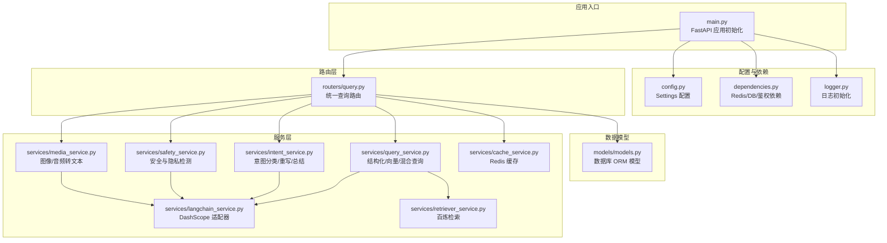
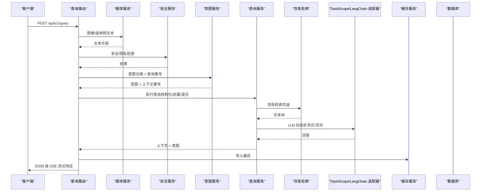
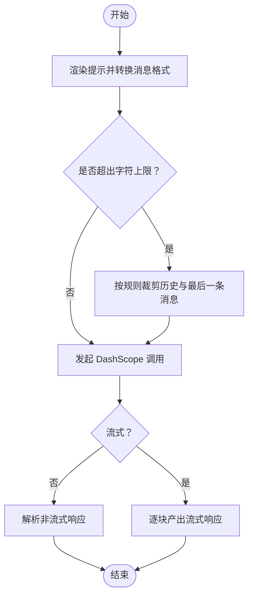
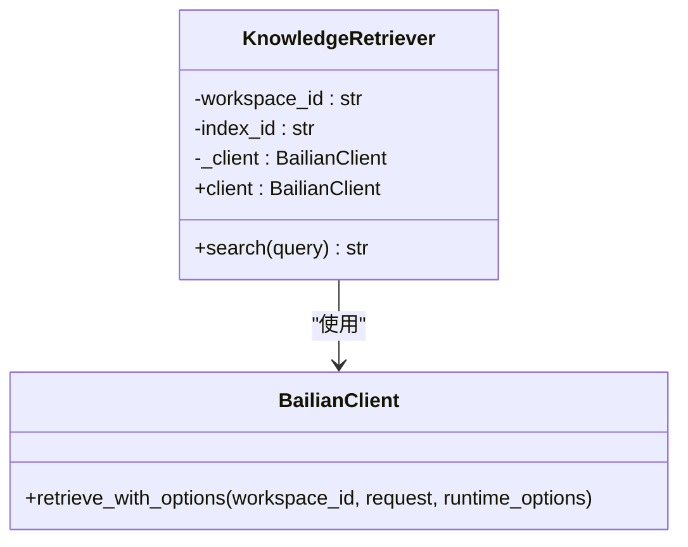
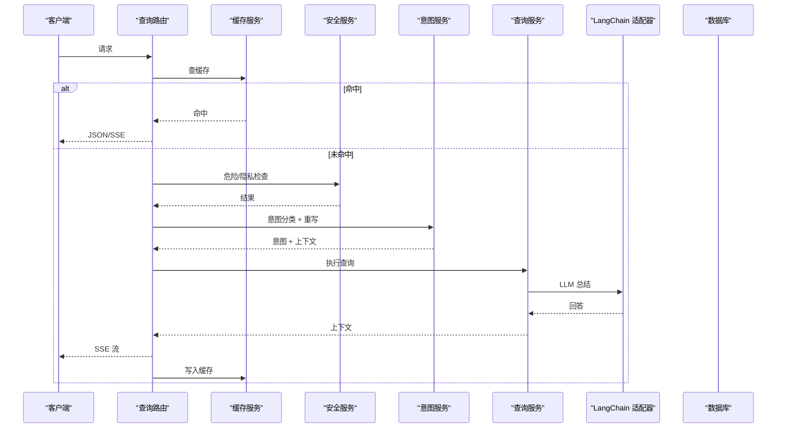
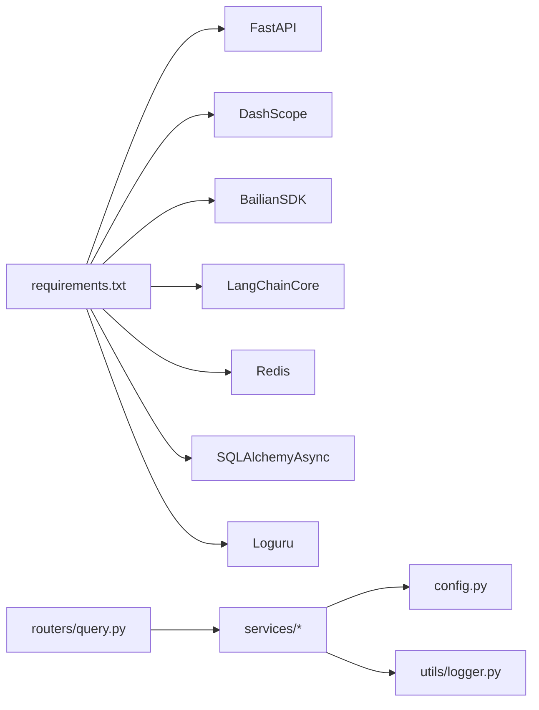

# AI服务集成

<cite>
**本文档引用的文件**
- [main.py](file://service/ai_assistant/app/main.py)
- [config.py](file://service/ai_assistant/app/config.py)
- [langchain_service.py](file://service/ai_assistant/app/services/langchain_service.py)
- [retriever_service.py](file://service/ai_assistant/app/services/retriever_service.py)
- [query.py](file://service/ai_assistant/app/routers/query.py)
- [intent_service.py](file://service/ai_assistant/app/services/intent_service.py)
- [query_service.py](file://service/ai_assistant/app/services/query_service.py)
- [media_service.py](file://service/ai_assistant/app/services/media_service.py)
- [safety_service.py](file://service/ai_assistant/app/services/safety_service.py)
- [cache_service.py](file://service/ai_assistant/app/services/cache_service.py)
- [models.py](file://service/ai_assistant/app/models/models.py)
- [dependencies.py](file://service/ai_assistant/app/dependencies.py)
- [logger.py](file://service/ai_assistant/app/utils/logger.py)
- [requirements.txt](file://service/ai_assistant/requirements.txt)
- [query.py](file://service/ai_assistant/app/schemas/query.py)
</cite>

## 目录
1. [简介](#简介)
2. [项目结构](#项目结构)
3. [核心组件](#核心组件)
4. [架构总览](#架构总览)
5. [详细组件分析](#详细组件分析)
6. [依赖分析](#依赖分析)
7. [性能考虑](#性能考虑)
8. [故障排查指南](#故障排查指南)
9. [结论](#结论)
10. [附录](#附录)

## 简介
本项目为“AI校园助手”的后端服务，围绕多模态输入（文本、图像、音频）与统一查询接口，构建了完整的AI服务集成体系。系统集成了阿里云 DashScope 的多模态与对话能力，以及百炼检索（阿里云 Bailian）的知识检索能力，采用 LangChain 适配器封装第三方模型调用，提供异步与流式响应能力，并通过缓存、安全与隐私策略保障稳定性与合规性。

## 项目结构
后端采用 FastAPI 应用入口，按功能模块组织服务层与路由层，配置集中于 Settings 类，日志统一由 Loguru 管理，数据库与缓存通过依赖注入提供。

图表来源
- [main.py:1-86](file://service/ai_assistant/app/main.py#L1-L86)
- [config.py:1-113](file://service/ai_assistant/app/config.py#L1-L113)
- [dependencies.py:1-109](file://service/ai_assistant/app/dependencies.py#L1-L109)
- [query.py:1-788](file://service/ai_assistant/app/routers/query.py#L1-L788)
- [media_service.py:1-246](file://service/ai_assistant/app/services/media_service.py#L1-L246)
- [safety_service.py:1-163](file://service/ai_assistant/app/services/safety_service.py#L1-L163)
- [intent_service.py:1-346](file://service/ai_assistant/app/services/intent_service.py#L1-L346)
- [query_service.py:1-800](file://service/ai_assistant/app/services/query_service.py#L1-L800)
- [retriever_service.py:1-168](file://service/ai_assistant/app/services/retriever_service.py#L1-L168)
- [langchain_service.py:1-278](file://service/ai_assistant/app/services/langchain_service.py#L1-L278)
- [cache_service.py:1-177](file://service/ai_assistant/app/services/cache_service.py#L1-L177)
- [models.py:1-660](file://service/ai_assistant/app/models/models.py#L1-L660)

章节来源
- [main.py:1-86](file://service/ai_assistant/app/main.py#L1-L86)
- [config.py:1-113](file://service/ai_assistant/app/config.py#L1-L113)

## 核心组件
- 配置与环境
  - Settings 类集中管理应用、数据库、Redis、JWT、AES、隐私盐值、DashScope 与百炼检索配置、模型名称、缓存 TTL 等。
- LangChain 适配器
  - 封装 DashScope Generation 与多模态调用，提供非流式与流式两类调用，内置消息格式转换与字符限制处理。
- 百炼检索适配器
  - 基于 Bailian SDK 的检索客户端，支持混合相似度与重排，返回标准化文本块。
- 媒体服务
  - 图像理解与音频识别，前置图像尺寸/体积优化与音频格式转换，调用 DashScope 多模态与 ASR。
- 安全与隐私
  - 基于 LLM 的危险内容检测与正则兜底，隐私违规（查询他人学号）拦截。
- 意图与总结
  - 意图分类（structured/vector/hybrid/smalltalk），查询重写，回答生成与流式输出。
- 查询执行
  - 结构化 SQL 查询、向量检索、混合检索与重排，工具规划与执行。
- 缓存
  - Redis 缓存键空间与 TTL 策略，敏感/日期/课表版本失效控制。
- 日志
  - Loguru 统一日志，控制台与文件双通道，便于问题追踪。

章节来源
- [config.py:48-84](file://service/ai_assistant/app/config.py#L48-L84)
- [langchain_service.py:139-278](file://service/ai_assistant/app/services/langchain_service.py#L139-L278)
- [retriever_service.py:23-168](file://service/ai_assistant/app/services/retriever_service.py#L23-L168)
- [media_service.py:115-246](file://service/ai_assistant/app/services/media_service.py#L115-L246)
- [safety_service.py:84-163](file://service/ai_assistant/app/services/safety_service.py#L84-L163)
- [intent_service.py:218-346](file://service/ai_assistant/app/services/intent_service.py#L218-L346)
- [query_service.py:150-238](file://service/ai_assistant/app/services/query_service.py#L150-L238)
- [cache_service.py:92-177](file://service/ai_assistant/app/services/cache_service.py#L92-L177)
- [logger.py:17-53](file://service/ai_assistant/app/utils/logger.py#L17-L53)

## 架构总览
系统以统一查询路由为核心，串联多模态预处理、安全与隐私检查、意图分类、查询执行、LLM 总结与缓存持久化，形成闭环。

图表来源
- [query.py:207-745](file://service/ai_assistant/app/routers/query.py#L207-L745)
- [media_service.py:115-246](file://service/ai_assistant/app/services/media_service.py#L115-L246)
- [safety_service.py:84-163](file://service/ai_assistant/app/services/safety_service.py#L84-L163)
- [intent_service.py:218-346](file://service/ai_assistant/app/services/intent_service.py#L218-L346)
- [query_service.py:150-238](file://service/ai_assistant/app/services/query_service.py#L150-L238)
- [retriever_service.py:46-135](file://service/ai_assistant/app/services/retriever_service.py#L46-L135)
- [langchain_service.py:139-278](file://service/ai_assistant/app/services/langchain_service.py#L139-L278)
- [cache_service.py:149-177](file://service/ai_assistant/app/services/cache_service.py#L149-L177)

## 详细组件分析

### LangChain 适配器（DashScope）
- 设计模式
  - 适配器模式：将 DashScope API 调用封装为 LangChain 友好的提示渲染、调用与流式处理接口。
  - 线程池异步：通过 asyncio.to_thread 在线程池中执行阻塞式 HTTP 调用，避免阻塞事件循环。
- 消息格式转换
  - 将 LangChain 的 System/Human/AI 消息转换为 DashScope 的 role/content 格式。
- API 调用策略
  - 支持非流式与增量流式两种模式；可选自定义 HTTP 会话（忽略环境代理变量）。
- 字符限制与截断
  - 输入消息按总字符数裁剪，优先丢弃旧历史，最后一条消息按阈值截断，保证不超过最大输入字符限制。
- 异步与流式
  - 非流式：在独立线程中发起调用，解析响应后返回。
  - 流式：迭代响应块，按块输出，适合 SSE 场景。

图表来源
- [langchain_service.py:128-204](file://service/ai_assistant/app/services/langchain_service.py#L128-L204)
- [langchain_service.py:206-278](file://service/ai_assistant/app/services/langchain_service.py#L206-L278)

章节来源
- [langchain_service.py:19-278](file://service/ai_assistant/app/services/langchain_service.py#L19-L278)

### 百炼检索（阿里云 Bailian）
- 客户端与配置
  - 基于 OpenAPI 配置创建 BailianClient，endpoint 来自配置。
- 检索策略
  - 同时启用稠密与稀疏相似度检索，开启重排，限制返回数量，过滤低分项。
- 响应归一化
  - 统一处理 SDK 返回体，兼容不同版本字段，提取 Nodes 或回退到旧结构。
- 文本块过滤
  - 过滤过短文本块，避免噪声影响。

图表来源
- [retriever_service.py:23-168](file://service/ai_assistant/app/services/retriever_service.py#L23-L168)

章节来源
- [retriever_service.py:1-168](file://service/ai_assistant/app/services/retriever_service.py#L1-L168)

### 统一路由与工作流（/api/v1/query）
- 多模态输入
  - 支持文本、Base64 图像、Base64 音频；图像与音频经媒体服务转文本。
- 缓存优先
  - 先查 Redis 缓存，命中则直接返回 JSON 或模拟 SSE 流。
- 并发与降级
  - 安全检查与查询重写并行；Redis 异常时降级至数据库历史。
- 意图与执行
  - 意图分类后，结构化/向量/混合路径分别执行；必要时修正意图。
- 流式输出
  - 使用 SSE，分块发送，最后发送完成包；流结束后写入缓存与日志。
- 错误映射
  - 将内部错误映射为用户可见的友好提示。

图表来源
- [query.py:207-745](file://service/ai_assistant/app/routers/query.py#L207-L745)
- [cache_service.py:92-177](file://service/ai_assistant/app/services/cache_service.py#L92-L177)
- [safety_service.py:84-163](file://service/ai_assistant/app/services/safety_service.py#L84-L163)
- [intent_service.py:218-346](file://service/ai_assistant/app/services/intent_service.py#L218-L346)
- [query_service.py:150-238](file://service/ai_assistant/app/services/query_service.py#L150-L238)

章节来源
- [query.py:1-788](file://service/ai_assistant/app/routers/query.py#L1-L788)

### 媒体服务（图像/音频）
- 图像理解
  - 前置尺寸与体积优化，转换为 JPEG；调用多模态对话模型提取描述与文字。
- 音频识别
  - 使用 ffmpeg 转换为 16kHz 单声道 WAV；调用 ASR 模型识别文本；对静音/无效场景进行保护性报错。

章节来源
- [media_service.py:115-246](file://service/ai_assistant/app/services/media_service.py#L115-L246)

### 安全与隐私服务
- 危险内容检测
  - LLM 判断 + 正则兜底；公共服务联系方式查询放行。
- 隐私违规
  - 检测他人学号查询意图，拦截并提示。

章节来源
- [safety_service.py:84-163](file://service/ai_assistant/app/services/safety_service.py#L84-L163)

### 意图分类与回答生成
- 意图分类
  - 基于提示模板与 LLM，输出 structured/vector/hybrid/smalltalk。
- 查询重写
  - 结合历史上下文，补齐缺失信息，限制长度。
- 回答生成
  - 非流式与流式两种路径，均进行上下文与历史的截断与归一化。

章节来源
- [intent_service.py:218-346](file://service/ai_assistant/app/services/intent_service.py#L218-L346)

### 查询执行（结构化/向量/混合）
- 结构化查询
  - 基于 SQLAlchemy 异步 ORM，按意图调用对应工具函数。
- 向量检索
  - 使用 BailianLangChainRetriever 包装现有检索器，返回 LangChain Document。
- 混合检索
  - 结合结构化与向量结果，执行重排与去重。

章节来源
- [query_service.py:150-238](file://service/ai_assistant/app/services/query_service.py#L150-L238)

### 缓存服务
- 键空间与版本
  - 使用 DID + 查询哈希生成键；版本号隔离升级。
- TTL 策略
  - 敏感/日期/课表相关查询采用不同 TTL 与失效策略。
- 日期与课表守卫
  - 日期敏感查询按“当日桶”失效；课表版本变更时失效。

章节来源
- [cache_service.py:92-177](file://service/ai_assistant/app/services/cache_service.py#L92-L177)

### 配置管理与环境变量
- 应用与中间件
  - CORS、JWT、AES、隐私盐值、对话历史上限。
- DashScope
  - API Key、代理信任开关、最大输入字符、模型名称。
- 百炼检索
  - AccessKey、Secret、WorkspaceId、IndexId、Endpoint。
- 缓存 TTL
  - 敏感与普通查询的过期时间。

章节来源
- [config.py:13-113](file://service/ai_assistant/app/config.py#L13-L113)

## 依赖分析
- 外部依赖
  - FastAPI、DashScope、阿里云百炼 SDK、LangChain Core、Redis、SQLAlchemy 异步、Loguru。
- 内部耦合
  - 路由层依赖服务层；服务层依赖配置与日志；查询服务依赖检索与适配器；安全与媒体服务贯穿多路径。

图表来源
- [requirements.txt:1-22](file://service/ai_assistant/requirements.txt#L1-L22)
- [query.py:1-788](file://service/ai_assistant/app/routers/query.py#L1-L788)

章节来源
- [requirements.txt:1-22](file://service/ai_assistant/requirements.txt#L1-L22)

## 性能考虑
- 异步与线程池
  - 所有外部 HTTP 调用通过 asyncio.to_thread 在线程池执行，避免阻塞事件循环。
- 并发执行
  - 安全检查与查询重写并行，缩短端到端延迟。
- 流式输出
  - SSE 分块推送，降低首字节延迟与内存占用。
- 缓存策略
  - 针对敏感/日期/课表场景的差异化 TTL 与失效策略，平衡一致性与性能。
- 输入裁剪
  - 消息总字符数与最后一条消息字符数双重限制，避免超限导致的失败与重试。

## 故障排查指南
- DashScope 调用失败
  - 检查 API Key 与代理配置；查看日志中的状态码与消息；确认模型名称与字符限制。
- 百炼检索异常
  - 核对 AccessKey、Secret、WorkspaceId、IndexId 与 Endpoint；查看响应体结构与 Success 字段。
- 媒体服务错误
  - 图像：确认 Base64 与尺寸/体积优化；音频：确认 ffmpeg 可用与格式转换。
- 安全/隐私拦截
  - 检查危险内容与隐私违规正则；公共服务联系方式查询会被放行。
- 缓存异常
  - 检查 Redis 连接与键空间；敏感/日期/课表守卫是否触发。
- 日志定位
  - 使用 Loguru 文件与控制台输出，结合请求 ID 与模块定位问题。

章节来源
- [logger.py:17-53](file://service/ai_assistant/app/utils/logger.py#L17-L53)
- [langchain_service.py:183-200](file://service/ai_assistant/app/services/langchain_service.py#L183-L200)
- [retriever_service.py:84-135](file://service/ai_assistant/app/services/retriever_service.py#L84-L135)
- [media_service.py:149-156](file://service/ai_assistant/app/services/media_service.py#L149-L156)
- [safety_service.py:117-144](file://service/ai_assistant/app/services/safety_service.py#L117-L144)
- [cache_service.py:92-177](file://service/ai_assistant/app/services/cache_service.py#L92-L177)

## 结论
本项目通过 LangChain 适配器与百炼检索的组合，实现了对 DashScope 与阿里云知识库的统一接入；配合媒体服务、安全与隐私、缓存与流式输出，构建了稳定、可扩展、可维护的 AI 服务集成方案。建议在生产环境完善密钥轮换、代理白名单与监控告警，持续优化输入裁剪与缓存策略以提升用户体验。

## 附录
- 集成示例
  - 统一查询端点：POST /api/v1/query，支持文本、图像、音频输入；返回 JSON 或 SSE 流。
  - 模型配置：在配置中设置各环节模型名称，如意图分类、查询重写、最终回答、安全检测、图像理解、语音识别等。
- 错误处理与故障转移
  - 缓存失败降级数据库历史；Redis 异常降级；LLM 调用失败正则兜底；SSE 异常映射为用户友好提示。
- 最佳实践
  - 使用线程池执行外部调用；合理设置字符限制与历史长度；对敏感/日期/课表场景采用差异化缓存策略；统一日志与错误映射。