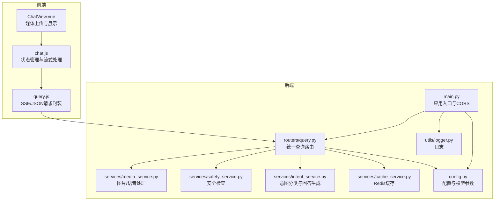
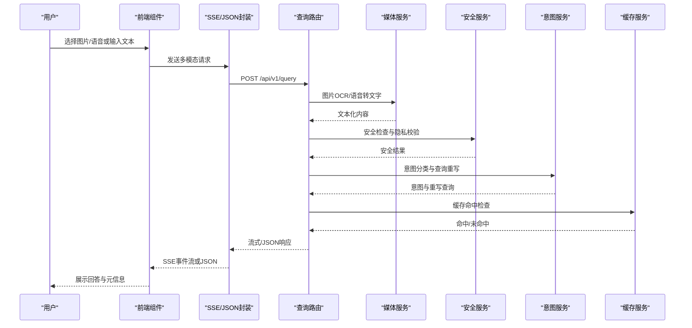
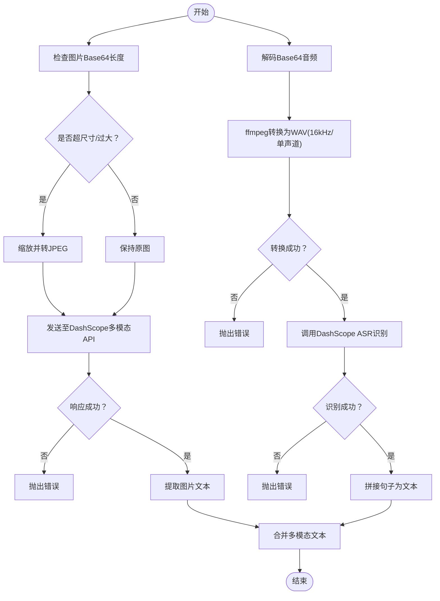
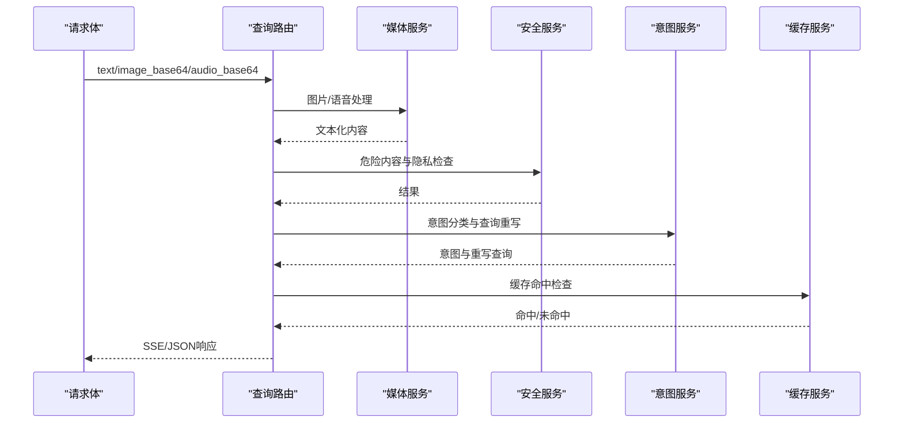
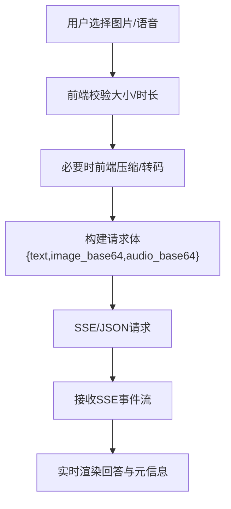
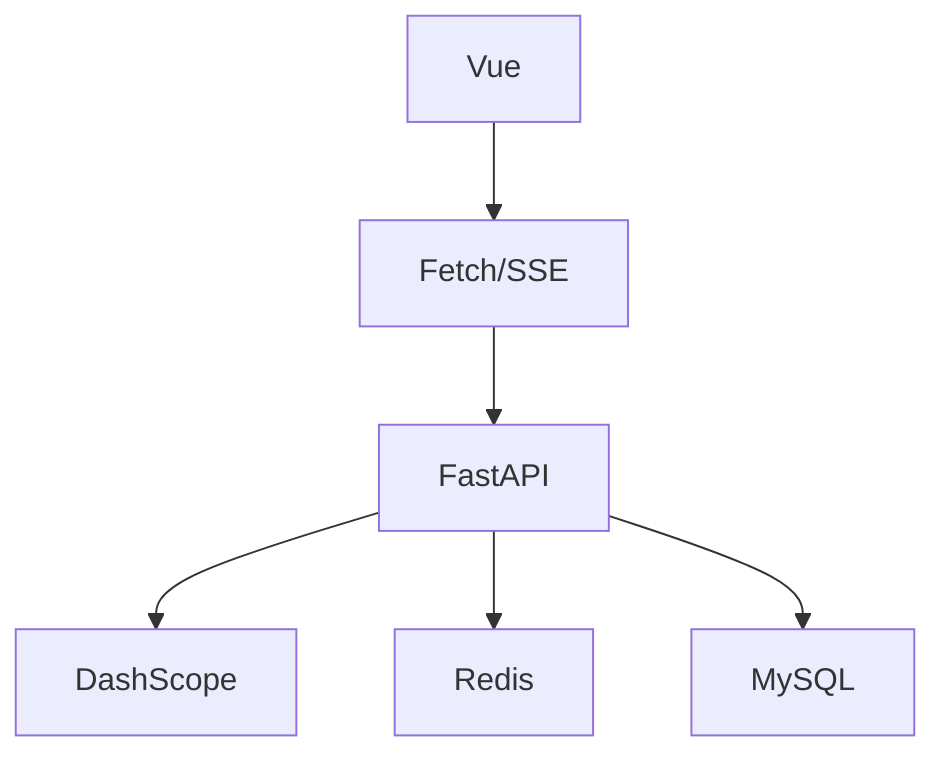

# 媒体处理集成

<cite>
**本文档引用的文件**
- [main.py](file://service/ai_assistant/app/main.py)
- [media_service.py](file://service/ai_assistant/app/services/media_service.py)
- [query.py](file://service/ai_assistant/app/routers/query.py)
- [query.py](file://service/ai_assistant/app/schemas/query.py)
- [ChatView.vue](file://frontend/ai_assistant/src/views/ChatView.vue)
- [chat.js](file://frontend/ai_assistant/src/stores/chat.js)
- [query.js](file://frontend/ai_assistant/src/api/query.js)
- [config.py](file://service/ai_assistant/app/config.py)
- [logger.py](file://service/ai_assistant/app/utils/logger.py)
- [cache_service.py](file://service/ai_assistant/app/services/cache_service.py)
- [safety_service.py](file://service/ai_assistant/app/services/safety_service.py)
- [intent_service.py](file://service/ai_assistant/app/services/intent_service.py)
- [requirements.txt](file://service/ai_assistant/requirements.txt)
</cite>

## 目录
1. [简介](#简介)
2. [项目结构](#项目结构)
3. [核心组件](#核心组件)
4. [架构总览](#架构总览)
5. [详细组件分析](#详细组件分析)
6. [依赖关系分析](#依赖关系分析)
7. [性能考虑](#性能考虑)
8. [故障排查指南](#故障排查指南)
9. [结论](#结论)
10. [附录](#附录)

## 简介
本项目为“校园AI助手”的媒体处理集成方案，围绕多模态输入（文本、图片、语音）构建统一的查询处理流水线。后端采用FastAPI提供REST接口，前端基于Vue实现多模态交互界面。媒体处理能力通过DashScope平台实现：图片OCR与视觉理解、语音转文字（ASR），并结合安全检查、意图分类、缓存与流式响应等模块，形成完整的端到端处理链路。

## 项目结构
后端服务位于 service/ai_assistant，前端位于 frontend/ai_assistant。整体采用前后端分离架构，后端提供统一的查询接口，前端负责媒体采集与展示，并通过API层与后端交互。

图表来源
- [main.py:1-86](file://service/ai_assistant/app/main.py#L1-L86)
- [query.py:1-788](file://service/ai_assistant/app/routers/query.py#L1-L788)
- [media_service.py:1-246](file://service/ai_assistant/app/services/media_service.py#L1-L246)
- [chat.js:1-278](file://frontend/ai_assistant/src/stores/chat.js#L1-L278)
- [query.js:1-141](file://frontend/ai_assistant/src/api/query.js#L1-L141)

章节来源
- [main.py:1-86](file://service/ai_assistant/app/main.py#L1-L86)
- [requirements.txt:1-22](file://service/ai_assistant/requirements.txt#L1-L22)

## 核心组件
- 媒体服务：负责图片与语音的预处理与转换，调用DashScope API完成OCR与ASR。
- 查询路由：统一入口，串联媒体处理、安全检查、意图分类、缓存、回答生成与流式输出。
- 前端组件：提供图片上传、语音录制、SSE流式接收与错误提示。
- 配置与日志：集中管理模型参数、缓存策略与运行日志。

章节来源
- [media_service.py:1-246](file://service/ai_assistant/app/services/media_service.py#L1-L246)
- [query.py:1-788](file://service/ai_assistant/app/routers/query.py#L1-L788)
- [ChatView.vue:1-800](file://frontend/ai_assistant/src/views/ChatView.vue#L1-L800)
- [chat.js:1-278](file://frontend/ai_assistant/src/stores/chat.js#L1-L278)
- [config.py:1-113](file://service/ai_assistant/app/config.py#L1-L113)
- [logger.py:1-53](file://service/ai_assistant/app/utils/logger.py#L1-L53)

## 架构总览
媒体处理集成遵循“前端采集 → 后端统一处理 → 多模态预处理 → 安全与意图 → 缓存与检索 → 流式回答”的闭环。

图表来源
- [query.py:198-745](file://service/ai_assistant/app/routers/query.py#L198-L745)
- [media_service.py:115-246](file://service/ai_assistant/app/services/media_service.py#L115-L246)
- [safety_service.py:84-163](file://service/ai_assistant/app/services/safety_service.py#L84-L163)
- [intent_service.py:218-346](file://service/ai_assistant/app/services/intent_service.py#L218-L346)
- [cache_service.py:92-177](file://service/ai_assistant/app/services/cache_service.py#L92-L177)
- [query.js:28-141](file://frontend/ai_assistant/src/api/query.js#L28-L141)

## 详细组件分析

### 媒体服务（图片OCR与语音转文字）
- 图片处理：对Base64图像进行尺寸与体积优化，必要时转换为JPEG，避免DashScope负载过大；随后通过多模态对话API提取文本与关键信息。
- 语音处理：将Base64音频解码并通过ffmpeg转换为WAV（单声道、16kHz），调用ASR识别，兼容多种输入格式；对静音或无效内容进行显式错误处理。
- 异步执行：使用线程池包装SDK调用，避免阻塞事件循环，提升吞吐。

图表来源
- [media_service.py:23-246](file://service/ai_assistant/app/services/media_service.py#L23-L246)

章节来源
- [media_service.py:1-246](file://service/ai_assistant/app/services/media_service.py#L1-L246)

### 查询路由（统一多模态处理）
- 输入聚合：从请求体中提取文本、图片Base64与语音Base64，构建统一查询文本。
- 并发执行：安全检查、隐私校验与查询重写并行，缩短端到端延迟。
- 缓存策略：基于DID与查询哈希的Redis缓存，支持敏感/普通查询不同TTL，以及日期/课表版本失效控制。
- 意图分类：根据重写后的查询进行structured/vector/hybrid/smalltalk分类，并在执行后根据上下文修正意图。
- 流式输出：SSE事件流逐字节推送，前端实时渲染；JSON模式下一次性返回。
- 会话历史：基于Redis的会话隔离历史，避免并发会话串话。

图表来源
- [query.py:207-745](file://service/ai_assistant/app/routers/query.py#L207-L745)
- [cache_service.py:92-177](file://service/ai_assistant/app/services/cache_service.py#L92-L177)
- [safety_service.py:84-163](file://service/ai_assistant/app/services/safety_service.py#L84-L163)
- [intent_service.py:218-346](file://service/ai_assistant/app/services/intent_service.py#L218-L346)

章节来源
- [query.py:1-788](file://service/ai_assistant/app/routers/query.py#L1-L788)
- [query.py:1-33](file://service/ai_assistant/app/schemas/query.py#L1-L33)

### 前端媒体上传组件与后端集成
- 图片上传：限制5MB，前端对较大图片进行压缩与尺寸适配，避免Nginx上传限制；Base64直接传给后端。
- 语音录制：使用MediaRecorder录制WebM，前端进行静音与时长检测，再转Base64发送。
- 流式接收：SSE事件流逐块推送，前端实时拼接；兼容JSON返回，避免长时间“正在思考”。

图表来源
- [ChatView.vue:335-525](file://frontend/ai_assistant/src/views/ChatView.vue#L335-L525)
- [chat.js:133-230](file://frontend/ai_assistant/src/stores/chat.js#L133-L230)
- [query.js:28-141](file://frontend/ai_assistant/src/api/query.js#L28-L141)

章节来源
- [ChatView.vue:1-800](file://frontend/ai_assistant/src/views/ChatView.vue#L1-L800)
- [chat.js:1-278](file://frontend/ai_assistant/src/stores/chat.js#L1-L278)
- [query.js:1-141](file://frontend/ai_assistant/src/api/query.js#L1-L141)

### 安全处理策略
- 危险内容检测：基于LLM与正则双重策略，优先使用LLM语义判断，正则作为降级；对公共服务联系方式查询进行豁免。
- 隐私保护：检测并阻止查询他人学号的行为，返回合规提示。
- 危机干预：对疑似危险信号触发人工干预提示，记录并上报。

章节来源
- [safety_service.py:1-163](file://service/ai_assistant/app/services/safety_service.py#L1-L163)
- [query.py:347-471](file://service/ai_assistant/app/routers/query.py#L347-L471)

### 缓存与会话管理
- 缓存键：chat_cache:{version}:{did}:{md5(query)}，支持敏感/普通不同TTL。
- 失效策略：日期敏感查询按自然日失效；课表相关查询通过版本号失效。
- 会话历史：Redis按会话隔离存储，避免并发污染；支持清理接口。

章节来源
- [cache_service.py:1-177](file://service/ai_assistant/app/services/cache_service.py#L1-L177)
- [query.py:153-196](file://service/ai_assistant/app/routers/query.py#L153-L196)

## 依赖关系分析
后端依赖主要集中在FastAPI、DashScope、Redis与MySQL，前端通过fetch与SSE消费后端接口。

图表来源
- [requirements.txt:1-22](file://service/ai_assistant/requirements.txt#L1-L22)
- [query.js:34-71](file://frontend/ai_assistant/src/api/query.js#L34-L71)

章节来源
- [requirements.txt:1-22](file://service/ai_assistant/requirements.txt#L1-L22)

## 性能考虑
- 并发处理：安全检查、隐私校验与查询重写并行，减少端到端延迟。
- 异步执行：媒体处理与LLM调用通过线程池包装，避免阻塞事件循环。
- 缓存策略：高频查询命中缓存，敏感/普通查询分别设置TTL，降低数据库与外部API压力。
- 前端优化：图片压缩与尺寸适配，避免超大文件上传；SSE流式渲染，用户体验更佳。
- 日志与监控：统一日志落盘，便于定位性能瓶颈与异常。

章节来源
- [query.py:347-352](file://service/ai_assistant/app/routers/query.py#L347-L352)
- [media_service.py:141-148](file://service/ai_assistant/app/services/media_service.py#L141-L148)
- [logger.py:1-53](file://service/ai_assistant/app/utils/logger.py#L1-L53)

## 故障排查指南
- 图片处理失败：检查Base64格式与文件大小，确认DashScope API可用性与模型配置。
- 语音识别失败：确认音频时长与音量，避免静音；检查ffmpeg安装与权限。
- SSE流中断：检查反向代理配置，确保不缓冲/改写SSE；前端兜底逻辑会尝试解析JSON。
- 缓存异常：Redis连接失败时自动降级；检查键空间与TTL设置。
- 安全拦截：若误判，检查关键词规则与LLM输出格式；必要时调整阈值。

章节来源
- [media_service.py:66-113](file://service/ai_assistant/app/services/media_service.py#L66-L113)
- [query.py:233-260](file://service/ai_assistant/app/routers/query.py#L233-L260)
- [query.js:69-141](file://frontend/ai_assistant/src/api/query.js#L69-L141)
- [cache_service.py:92-147](file://service/ai_assistant/app/services/cache_service.py#L92-L147)

## 结论
本集成方案通过统一的查询路由与媒体服务，实现了多模态输入的标准化处理与高效响应。前端提供直观的媒体采集与流式展示，后端通过并发、缓存与安全策略保障稳定性与安全性。整体架构具备良好的扩展性，可进一步引入更多模态与外部服务。

## 附录

### 配置模板（.env）
- 应用基础：APP_NAME、APP_VERSION、DEBUG、CORS_ALLOW_ORIGINS
- 数据库：MYSQL_HOST、MYSQL_PORT、MYSQL_USER、MYSQL_PASSWORD、MYSQL_DATABASE
- Redis：REDIS_HOST、REDIS_PORT、REDIS_PASSWORD、REDIS_DB
- JWT/AES/DID：JWT_SECRET_KEY、JWT_ALGORITHM、JWT_EXPIRE_MINUTES、AES_SECRET_KEY、DID_SALT
- DashScope：ALI_API_KEY、BAILIAN_APP_ID、DASHSCOPE_TRUST_ENV_PROXY、DASHSCOPE_MAX_INPUT_CHARS
- 模型配置：LLM_MODEL_*（意图分类、查询重写、最终回答、工具规划、向量拆解、混合重排、安全检测、图像理解、语音识别）
- 百炼检索：ALIBABA_CLOUD_ACCESS_KEY_ID、ALIBABA_CLOUD_ACCESS_KEY_SECRET、BAILIAN_WORKSPACE_ID、BAILIAN_INDEX_ID、BAILIAN_ENDPOINT
- 缓存TTL：CACHE_TTL_SENSITIVE、CACHE_TTL_NORMAL

章节来源
- [config.py:1-113](file://service/ai_assistant/app/config.py#L1-L113)

### API定义
- POST /api/v1/query
  - 请求体：text、image_base64、audio_base64、session_id、output_type(json/空)
  - 响应：SSE事件流或JSON对象（answer、intent、session_id、response_time_ms、cached）

章节来源
- [query.py:198-206](file://service/ai_assistant/app/routers/query.py#L198-L206)
- [query.py:15-32](file://service/ai_assistant/app/schemas/query.py#L15-L32)