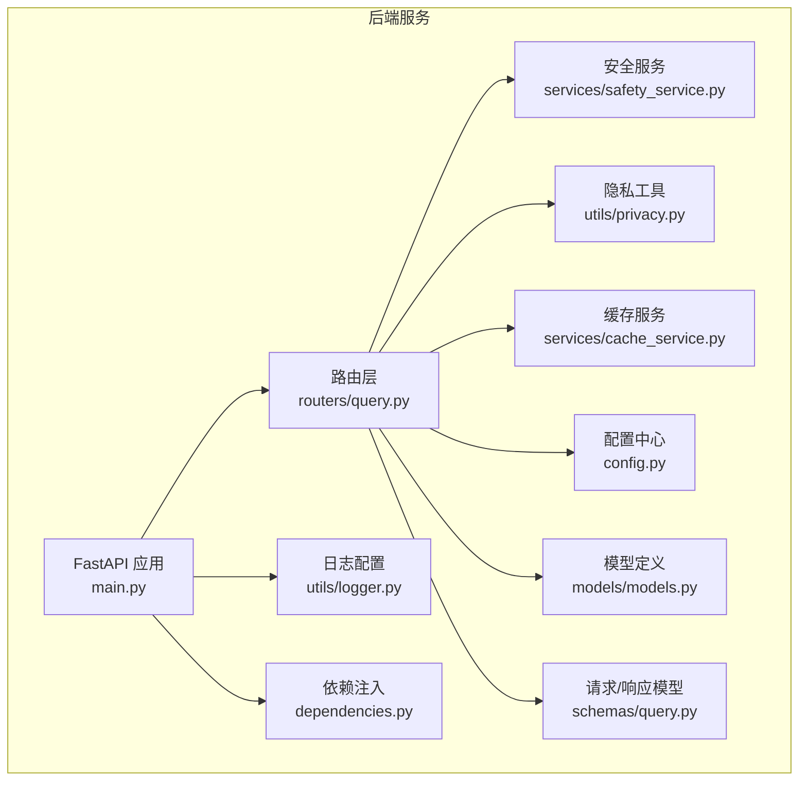
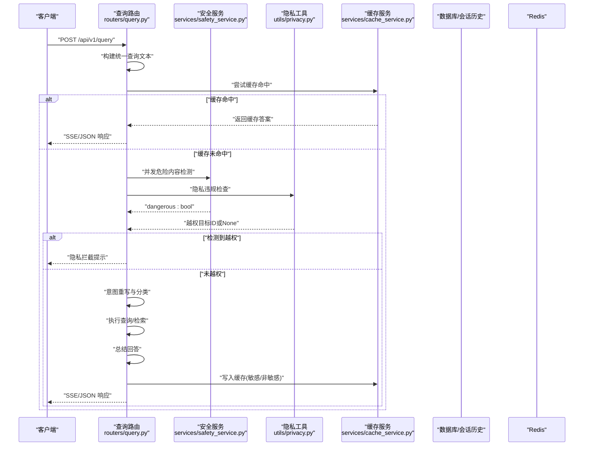
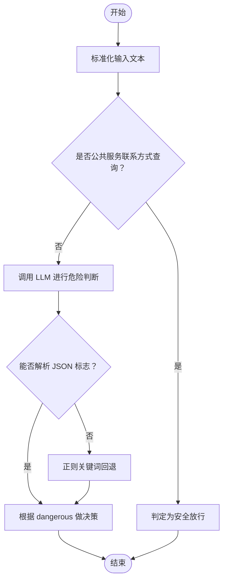
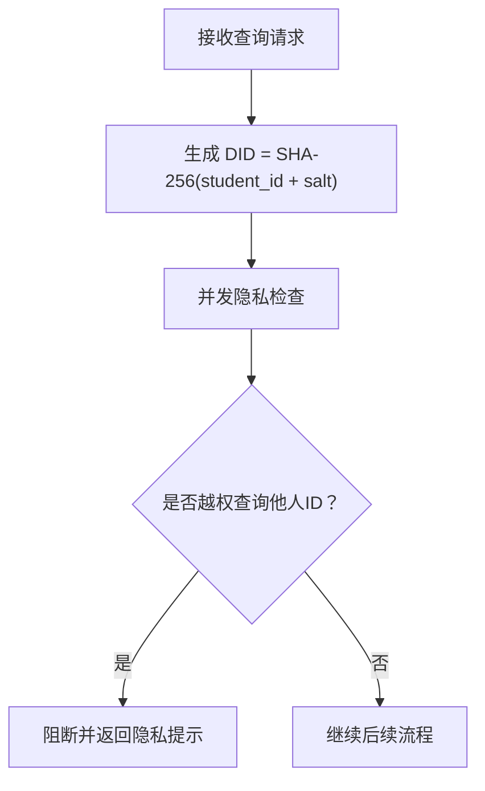
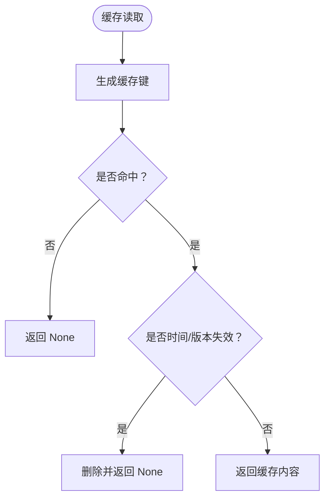
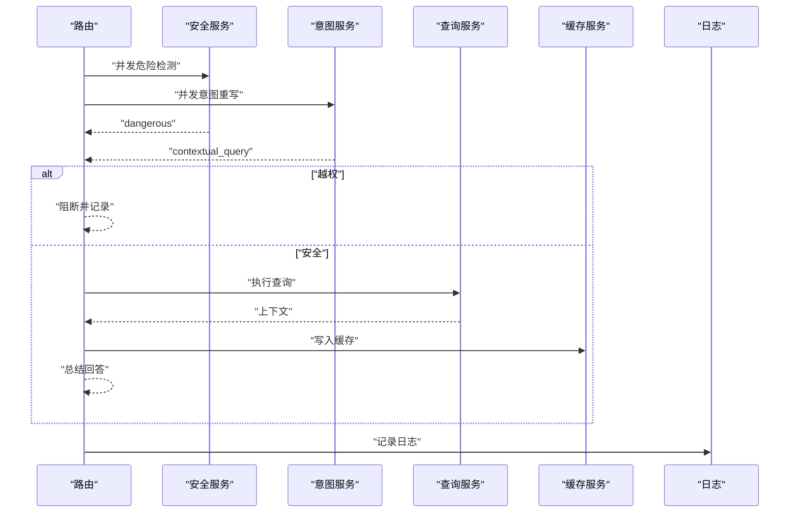
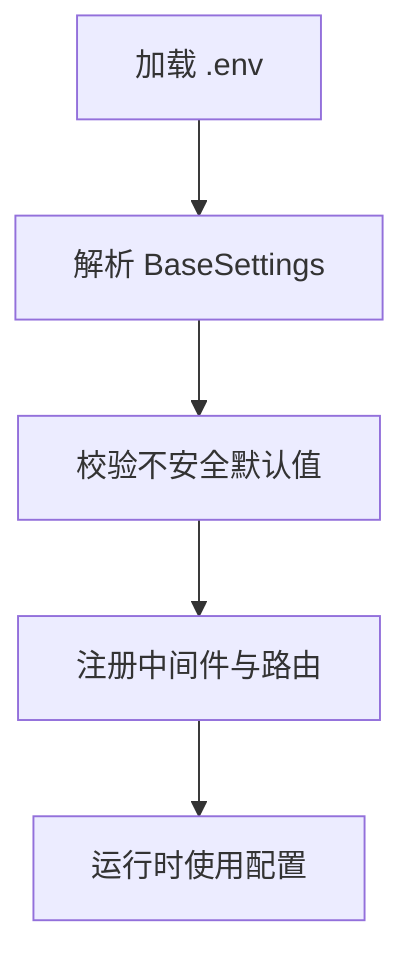
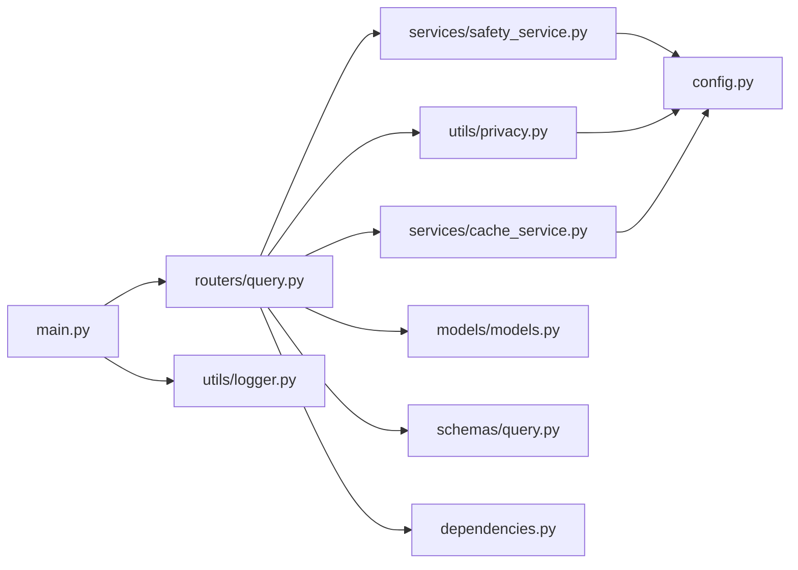

# 安全服务集成

<cite>
**本文引用的文件**
- [safety_service.py](file://service/ai_assistant/app/services/safety_service.py)
- [privacy.py](file://service/ai_assistant/app/utils/privacy.py)
- [config.py](file://service/ai_assistant/app/config.py)
- [main.py](file://service/ai_assistant/app/main.py)
- [query.py](file://service/ai_assistant/app/routers/query.py)
- [cache_service.py](file://service/ai_assistant/app/services/cache_service.py)
- [logger.py](file://service/ai_assistant/app/utils/logger.py)
- [dependencies.py](file://service/ai_assistant/app/dependencies.py)
- [models.py](file://service/ai_assistant/app/models/models.py)
- [query.py (schema)](file://service/ai_assistant/app/schemas/query.py)
- [requirements.txt](file://service/ai_assistant/requirements.txt)
- [README.md](file://README.md)
</cite>

## 目录
1. [简介](#简介)
2. [项目结构](#项目结构)
3. [核心组件](#核心组件)
4. [架构总览](#架构总览)
5. [详细组件分析](#详细组件分析)
6. [依赖分析](#依赖分析)
7. [性能考虑](#性能考虑)
8. [故障排查指南](#故障排查指南)
9. [结论](#结论)
10. [附录](#附录)

## 简介
本文件面向安全服务集成，系统性阐述内容安全检查、隐私数据过滤与危险内容检测的实现与集成方式。文档覆盖安全服务的调用机制（API集成、响应处理、错误处理）、隐私保护的数据处理流程（敏感信息识别、数据脱敏、访问控制）、配置管理（阈值、白名单、动态更新）以及安全集成示例、威胁检测策略与合规性检查方案，帮助开发者全面理解系统的安全集成架构与实现细节。

## 项目结构
后端采用 FastAPI + 异步服务，安全相关能力集中在安全服务模块与查询路由中，并通过配置中心集中管理密钥与模型参数。日志统一落地，依赖注入提供 Redis、数据库与认证能力。

**图表来源**
- [main.py:1-86](file://service/ai_assistant/app/main.py#L1-L86)
- [query.py:1-788](file://service/ai_assistant/app/routers/query.py#L1-L788)
- [safety_service.py:1-163](file://service/ai_assistant/app/services/safety_service.py#L1-L163)
- [privacy.py:1-23](file://service/ai_assistant/app/utils/privacy.py#L1-L23)
- [cache_service.py:1-177](file://service/ai_assistant/app/services/cache_service.py#L1-L177)
- [config.py:1-113](file://service/ai_assistant/app/config.py#L1-L113)
- [logger.py:1-53](file://service/ai_assistant/app/utils/logger.py#L1-L53)
- [dependencies.py:1-109](file://service/ai_assistant/app/dependencies.py#L1-L109)
- [models.py:1-200](file://service/ai_assistant/app/models/models.py#L1-L200)
- [query.py (schema):1-33](file://service/ai_assistant/app/schemas/query.py#L1-L33)

**章节来源**
- [main.py:1-86](file://service/ai_assistant/app/main.py#L1-L86)
- [README.md:1-104](file://README.md#L1-L104)

## 核心组件
- 安全服务：负责危险内容检测与隐私违规检查，结合 LLM 与正则回退策略，确保安全边界。
- 隐私工具：基于盐值的稳定哈希生成 DID，用于替代真实学号，实现匿名化与历史关联。
- 缓存服务：按敏感度与时间维度控制缓存版本与过期策略，支撑安全与性能平衡。
- 配置中心：集中管理密钥、模型名称、缓存 TTL、CORS 等，支持环境变量注入。
- 日志与依赖：统一日志落盘与 Redis/数据库连接池管理，保障可观测性与稳定性。

**章节来源**
- [safety_service.py:1-163](file://service/ai_assistant/app/services/safety_service.py#L1-L163)
- [privacy.py:1-23](file://service/ai_assistant/app/utils/privacy.py#L1-L23)
- [cache_service.py:1-177](file://service/ai_assistant/app/services/cache_service.py#L1-L177)
- [config.py:1-113](file://service/ai_assistant/app/config.py#L1-L113)
- [logger.py:1-53](file://service/ai_assistant/app/utils/logger.py#L1-L53)
- [dependencies.py:1-109](file://service/ai_assistant/app/dependencies.py#L1-L109)

## 架构总览
安全服务集成贯穿查询路由的关键路径：多模态输入统一、并发安全检查与隐私检查、意图重写、查询执行、总结与缓存。危险内容检测通过 LLM 判断并回退正则；隐私检查拦截越权查询；缓存按敏感度与时间维度失效；日志记录与错误降级确保可追溯与可用性。

**图表来源**
- [query.py:198-745](file://service/ai_assistant/app/routers/query.py#L198-L745)
- [safety_service.py:84-144](file://service/ai_assistant/app/services/safety_service.py#L84-L144)
- [privacy.py:9-22](file://service/ai_assistant/app/utils/privacy.py#L9-L22)
- [cache_service.py:92-176](file://service/ai_assistant/app/services/cache_service.py#L92-L176)

## 详细组件分析

### 安全服务：危险内容与隐私检查
- 危险内容检测
  - 使用 LLM 对用户消息进行语义判断，优先解析 JSON 输出中的布尔标志；若格式异常则回退到正则关键词匹配，确保安全边界不被绕过。
  - 特殊场景：公共服务联系方式查询（如急诊、心理热线）会被识别并放行，避免误伤正常求助。
- 隐私违规检查
  - 识别学号/工号等敏感标识的越权查询，若发现非本人 ID 则阻断并提示。
- 错误处理
  - LLM 调用异常时自动回退至正则匹配，保证系统可用性与安全性。

**图表来源**
- [safety_service.py:84-144](file://service/ai_assistant/app/services/safety_service.py#L84-L144)
- [safety_service.py:68-82](file://service/ai_assistant/app/services/safety_service.py#L68-L82)

**章节来源**
- [safety_service.py:14-163](file://service/ai_assistant/app/services/safety_service.py#L14-L163)

### 隐私保护：DID 生成与访问控制
- DID 生成
  - 基于真实学号与盐值生成固定长度哈希，作为匿名标识存储于聊天日志与缓存键中，实现历史关联与隐私保护。
- 访问控制
  - 查询路由在并发任务中执行隐私检查，一旦发现越权查询，立即返回提示并记录交互，不进入后续检索与生成流程。

**图表来源**
- [privacy.py:9-22](file://service/ai_assistant/app/utils/privacy.py#L9-L22)
- [query.py:354-414](file://service/ai_assistant/app/routers/query.py#L354-L414)

**章节来源**
- [privacy.py:1-23](file://service/ai_assistant/app/utils/privacy.py#L1-L23)
- [query.py:354-414](file://service/ai_assistant/app/routers/query.py#L354-L414)

### 缓存与敏感度控制
- 缓存键与版本
  - 缓存键包含版本号、DID 与查询哈希；课表缓存引入版本号，管理员调整课表后递增版本，确保旧缓存失效。
- 敏感度与过期
  - 敏感查询（涉及成绩、联系方式等）使用较短 TTL；普通查询使用较长 TTL；时间敏感查询按“日桶”失效，避免跨天语义陈旧。
- 写入与读取
  - 读取时进行负载与类型校验，异常即清理；写入时附带元信息（日期桶、版本号等）。

**图表来源**
- [cache_service.py:49-146](file://service/ai_assistant/app/services/cache_service.py#L49-L146)

**章节来源**
- [cache_service.py:1-177](file://service/ai_assistant/app/services/cache_service.py#L1-L177)

### 查询路由：并发安全与错误降级
- 并发策略
  - 安全检查与意图重写并行执行，缩短端到端延迟。
- 错误降级
  - LLM 调用失败时回退正则；Redis 异常时降级到数据库历史；异常统一封装为友好提示。
- 日志与审计
  - 关键路径均记录日志，危险内容与隐私拦截均有明确标记，便于审计与追踪。

**图表来源**
- [query.py:347-471](file://service/ai_assistant/app/routers/query.py#L347-L471)
- [query.py:659-745](file://service/ai_assistant/app/routers/query.py#L659-L745)

**章节来源**
- [query.py:198-745](file://service/ai_assistant/app/routers/query.py#L198-L745)

### 配置管理：密钥、模型与阈值
- 配置来源
  - 通过环境变量注入，支持密钥、模型名称、缓存 TTL、CORS 等集中管理。
- 安全密钥检查
  - 启动时检测默认密钥，发出安全警告，提示在生产环境替换。
- 模型与阈值
  - 安全检测模型、意图分类模型、向量检索模型等均在配置中声明，便于统一管理与切换。

**图表来源**
- [config.py:6-113](file://service/ai_assistant/app/config.py#L6-L113)
- [main.py:25-41](file://service/ai_assistant/app/main.py#L25-L41)

**章节来源**
- [config.py:1-113](file://service/ai_assistant/app/config.py#L1-L113)
- [main.py:18-41](file://service/ai_assistant/app/main.py#L18-L41)

## 依赖分析
- 组件耦合
  - 查询路由依赖安全服务、隐私工具、缓存服务与数据库/Redis；安全服务依赖配置中心与外部 LLM；隐私工具依赖配置盐值；缓存服务依赖 Redis。
- 外部依赖
  - LLM 服务（DashScope）、百炼检索 API、Redis、MySQL、JWT 解析库等。
- 循环依赖
  - 未见循环依赖迹象，模块职责清晰。

**图表来源**
- [query.py:35-42](file://service/ai_assistant/app/routers/query.py#L35-L42)
- [safety_service.py:9-12](file://service/ai_assistant/app/services/safety_service.py#L9-L12)
- [privacy.py:6-22](file://service/ai_assistant/app/utils/privacy.py#L6-L22)
- [cache_service.py:18-19](file://service/ai_assistant/app/services/cache_service.py#L18-L19)
- [dependencies.py:13-16](file://service/ai_assistant/app/dependencies.py#L13-L16)
- [main.py:12-16](file://service/ai_assistant/app/main.py#L12-L16)
- [logger.py:17-46](file://service/ai_assistant/app/utils/logger.py#L17-L46)

**章节来源**
- [requirements.txt:1-22](file://service/ai_assistant/requirements.txt#L1-L22)
- [query.py:35-42](file://service/ai_assistant/app/routers/query.py#L35-L42)

## 性能考虑
- 并发优化
  - 安全检查与意图重写并行执行，减少端到端延迟。
- 缓存策略
  - 按敏感度与时间维度控制 TTL，热点查询快速命中；课表缓存版本化，管理员改课后即时失效。
- I/O 降压
  - 流式输出阶段提前归还数据库连接，避免长时间占用；Redis 异常时降级到数据库历史，保障可用性。
- 日志与可观测性
  - 统一日志落盘，关键路径打点，便于定位性能瓶颈与异常。

[本节为通用性能讨论，无需特定文件来源]

## 故障排查指南
- LLM 调用失败
  - 现象：安全检测回退正则；日志记录异常信息。
  - 处理：检查密钥与模型配置；确认网络可达；查看日志定位具体异常。
- Redis 异常
  - 现象：缓存读取失败，降级到数据库历史；会话历史写入失败。
  - 处理：检查 Redis 连接与权限；确认键空间与容量。
- 越权隐私拦截
  - 现象：返回隐私提示；日志记录越权目标ID。
  - 处理：确认用户身份与查询意图；必要时引导用户正确表达需求。
- SSE 输出异常
  - 现象：前端卡顿或一次性输出。
  - 处理：检查反向代理配置（禁用缓冲、保持连接）；确认路由与中间件设置。

**章节来源**
- [safety_service.py:134-144](file://service/ai_assistant/app/services/safety_service.py#L134-L144)
- [query.py:282-286](file://service/ai_assistant/app/routers/query.py#L282-L286)
- [query.py:354-414](file://service/ai_assistant/app/routers/query.py#L354-L414)
- [query.py:115-125](file://service/ai_assistant/app/routers/query.py#L115-L125)
- [README.md:67-104](file://README.md#L67-L104)

## 结论
本系统通过“LLM 主判 + 正则回退 + 并发安全检查 + 隐私拦截 + 缓存治理 + 统一日志”的组合拳，实现了高可用、可审计、可扩展的安全集成。配置中心集中管理密钥与模型，确保生产环境安全与灵活性；隐私工具与访问控制贯穿全链路，满足最小披露原则；错误降级与可观测性保障系统韧性。建议在生产环境完善密钥轮换、模型监控与缓存版本治理，持续提升安全与性能表现。

[本节为总结，无需特定文件来源]

## 附录
- 安全集成示例
  - 危险内容检测：对“我想结束生命”等语句进行 LLM 判断，必要时回退正则；公共服务联系方式查询放行。
  - 隐私拦截：对“查询张三学号”进行越权拦截，返回隐私提示。
  - 缓存失效：管理员调整课表后递增版本，旧缓存自动失效。
- 威胁检测策略
  - 多层防护：语义判断 + 关键词回退 + 白名单放行（公共服务）。
  - 动态更新：通过缓存版本与敏感度策略，实现内容变更的快速生效。
- 合规性检查方案
  - 数据最小化：使用 DID 替代真实 ID；仅记录匿名化日志。
  - 可追溯性：关键动作（危险标记、隐私拦截、缓存版本变更）均有日志记录。
  - 审计与告警：结合日志与监控，建立异常行为告警机制。

[本节为概念性内容，无需特定文件来源]