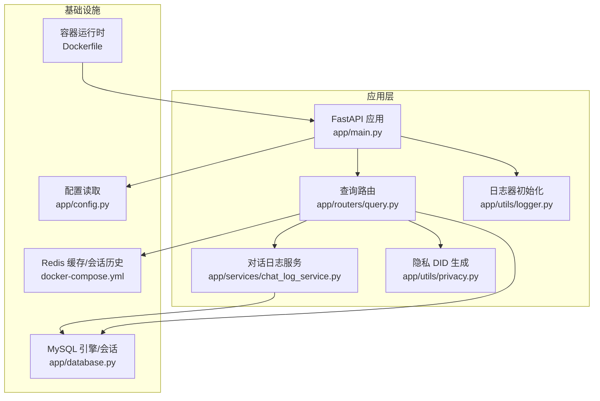
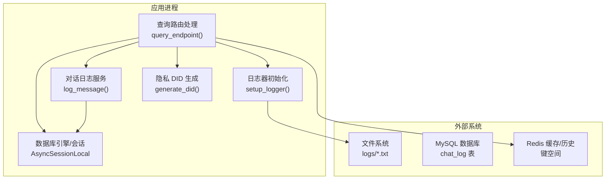
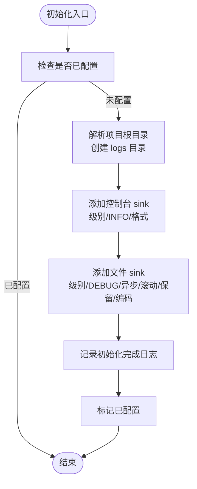
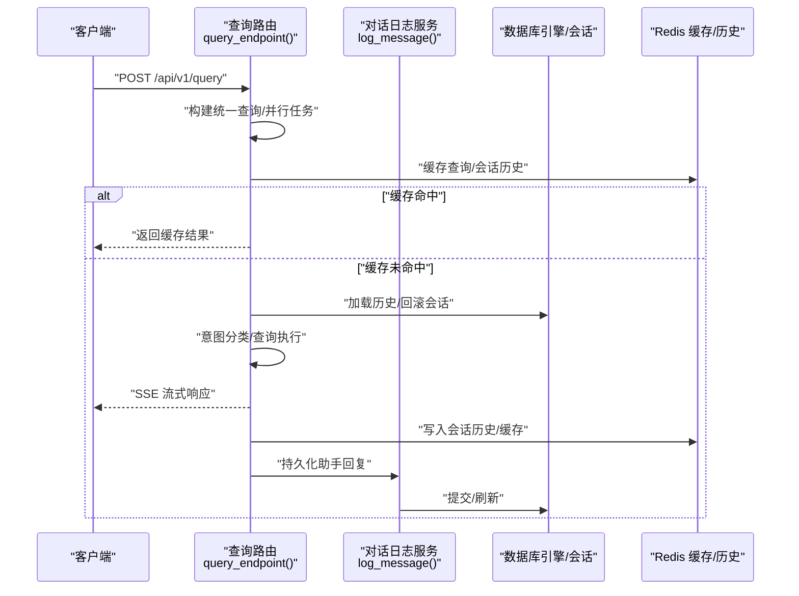
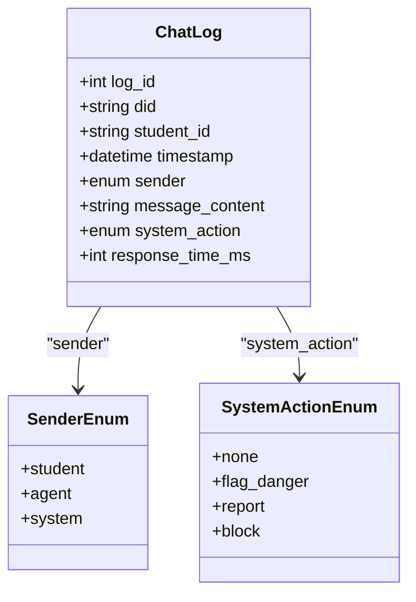
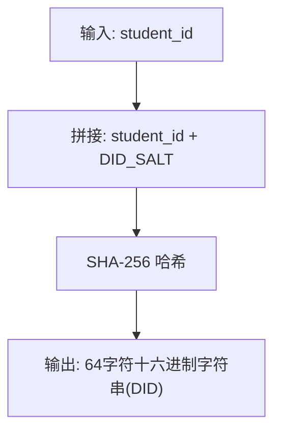
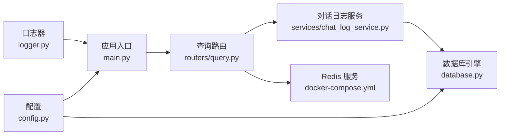

# 日志监控集成

<cite>
**本文引用的文件**
- [service/ai_assistant/app/utils/logger.py](file://service/ai_assistant/app/utils/logger.py)
- [service/ai_assistant/app/main.py](file://service/ai_assistant/app/main.py)
- [service/ai_assistant/app/config.py](file://service/ai_assistant/app/config.py)
- [service/ai_assistant/app/routers/query.py](file://service/ai_assistant/app/routers/query.py)
- [service/ai_assistant/app/services/chat_log_service.py](file://service/ai_assistant/app/services/chat_log_service.py)
- [service/ai_assistant/app/models/models.py](file://service/ai_assistant/app/models/models.py)
- [service/ai_assistant/app/utils/privacy.py](file://service/ai_assistant/app/utils/privacy.py)
- [service/ai_assistant/app/database.py](file://service/ai_assistant/app/database.py)
- [service/ai_assistant/Dockerfile](file://service/ai_assistant/Dockerfile)
- [service/ai_assistant/docker-compose.yml](file://service/ai_assistant/docker-compose.yml)
- [service/ai_assistant/requirements.txt](file://service/ai_assistant/requirements.txt)
</cite>

## 目录
1. [引言](#引言)
2. [项目结构](#项目结构)
3. [核心组件](#核心组件)
4. [架构总览](#架构总览)
5. [详细组件分析](#详细组件分析)
6. [依赖分析](#依赖分析)
7. [性能考虑](#性能考虑)
8. [故障排查指南](#故障排查指南)
9. [结论](#结论)
10. [附录](#附录)

## 引言
本文件面向“日志监控集成”的目标，系统化梳理并解释本项目的结构化日志记录、异步写入、日志聚合与分析、实时监控与告警、分布式追踪、日志存储与归档策略，并给出可操作的集成示例、监控配置与故障诊断方法。文档以代码为依据，辅以可视化图示，帮助开发者快速理解并落地日志监控体系。

## 项目结构
本项目采用后端服务（FastAPI + SQLAlchemy + Redis）与前端（Vue）分离的架构。日志子系统围绕统一的日志器初始化、结构化格式、异步落盘与滚动策略展开；对话日志通过数据库持久化实现可追溯与审计；运行时日志与业务日志并行，便于后续接入 ELK/日志平台进行集中采集与分析。

图表来源
- [service/ai_assistant/app/main.py:1-86](file://service/ai_assistant/app/main.py#L1-L86)
- [service/ai_assistant/app/routers/query.py:1-788](file://service/ai_assistant/app/routers/query.py#L1-L788)
- [service/ai_assistant/app/services/chat_log_service.py:1-76](file://service/ai_assistant/app/services/chat_log_service.py#L1-L76)
- [service/ai_assistant/app/utils/logger.py:1-53](file://service/ai_assistant/app/utils/logger.py#L1-L53)
- [service/ai_assistant/app/utils/privacy.py:1-23](file://service/ai_assistant/app/utils/privacy.py#L1-L23)
- [service/ai_assistant/app/database.py:1-35](file://service/ai_assistant/app/database.py#L1-L35)
- [service/ai_assistant/docker-compose.yml:1-31](file://service/ai_assistant/docker-compose.yml#L1-L31)
- [service/ai_assistant/Dockerfile:1-49](file://service/ai_assistant/Dockerfile#L1-L49)

章节来源
- [service/ai_assistant/app/main.py:1-86](file://service/ai_assistant/app/main.py#L1-L86)
- [service/ai_assistant/app/routers/query.py:1-788](file://service/ai_assistant/app/routers/query.py#L1-L788)
- [service/ai_assistant/app/utils/logger.py:1-53](file://service/ai_assistant/app/utils/logger.py#L1-L53)
- [service/ai_assistant/app/database.py:1-35](file://service/ai_assistant/app/database.py#L1-L35)
- [service/ai_assistant/docker-compose.yml:1-31](file://service/ai_assistant/docker-compose.yml#L1-L31)
- [service/ai_assistant/Dockerfile:1-49](file://service/ai_assistant/Dockerfile#L1-L49)

## 核心组件
- 统一日志器与异步写入
  - 使用统一日志器初始化，控制台与文件双通道输出，异步队列写盘，避免阻塞请求。
  - 文件落盘路径与命名遵循约定，格式包含时间戳、级别、位置与消息体。
  - 滚动策略按大小与保留天数配置，编码统一为 UTF-8。
- 结构化日志记录
  - 业务日志围绕查询流程的关键节点打点，包含输入参数、中间结果、意图分类、缓存命中/未命中、错误与异常等。
  - 对话日志服务负责将学生与助手的对话持久化，含时间戳、发送方、系统动作标记、响应耗时等。
- 隐私与脱敏
  - 使用稳定哈希生成 DID 替代真实学号，既满足审计与关联需求，又保护隐私。
- 数据库与会话管理
  - 异步 SQLAlchemy 引擎与会话工厂，结合路由中的回滚与短生命周期会话，减少长连接占用。
- 缓存与会话历史
  - Redis 用于缓存查询结果与会话历史，提升响应速度并隔离不同会话。

章节来源
- [service/ai_assistant/app/utils/logger.py:17-46](file://service/ai_assistant/app/utils/logger.py#L17-L46)
- [service/ai_assistant/app/routers/query.py:207-745](file://service/ai_assistant/app/routers/query.py#L207-L745)
- [service/ai_assistant/app/services/chat_log_service.py:14-75](file://service/ai_assistant/app/services/chat_log_service.py#L14-L75)
- [service/ai_assistant/app/utils/privacy.py:9-22](file://service/ai_assistant/app/utils/privacy.py#L9-L22)
- [service/ai_assistant/app/database.py:7-20](file://service/ai_assistant/app/database.py#L7-L20)

## 架构总览
下图展示日志与监控集成的整体视图：应用启动时初始化日志器；路由处理过程中记录结构化业务日志；对话日志通过服务持久化至数据库；运行时日志与业务日志分别落盘与入库，为后续 ELK/日志平台采集与分析提供基础。

图表来源
- [service/ai_assistant/app/utils/logger.py:17-46](file://service/ai_assistant/app/utils/logger.py#L17-L46)
- [service/ai_assistant/app/routers/query.py:207-745](file://service/ai_assistant/app/routers/query.py#L207-L745)
- [service/ai_assistant/app/services/chat_log_service.py:14-75](file://service/ai_assistant/app/services/chat_log_service.py#L14-L75)
- [service/ai_assistant/app/database.py:7-20](file://service/ai_assistant/app/database.py#L7-L20)

## 详细组件分析

### 组件A：统一日志器与异步写入
- 初始化策略
  - 幂等初始化，避免重复配置。
  - 移除默认 sink，显式添加控制台与文件 sink，分别设置级别与格式。
  - 文件 sink 启用异步队列，避免 IO 阻塞。
- 格式标准化
  - 统一包含时间、级别、模块名:函数:行号、消息体。
- 滚动与保留
  - 按大小滚动与按天保留，编码统一为 UTF-8。
- 入口与生命周期
  - 应用启动时调用初始化；FastAPI 生命周期钩子中记录启动/关闭事件。

图表来源
- [service/ai_assistant/app/utils/logger.py:17-46](file://service/ai_assistant/app/utils/logger.py#L17-L46)
- [service/ai_assistant/app/main.py:36-49](file://service/ai_assistant/app/main.py#L36-L49)

章节来源
- [service/ai_assistant/app/utils/logger.py:17-46](file://service/ai_assistant/app/utils/logger.py#L17-L46)
- [service/ai_assistant/app/main.py:16-49](file://service/ai_assistant/app/main.py#L16-L49)

### 组件B：查询路由中的结构化日志记录
- 关键打点
  - 请求接收、多模态输入处理、缓存命中/未命中、历史加载降级、意图分类、查询执行、流式生成、缓存与日志落盘等。
- 异常与错误
  - 对异常进行结构化记录，必要时对外返回友好提示。
- 流式输出
  - SSE 流式生成器中分批记录进度，最终汇总耗时与意图信息。
- 会话隔离
  - Redis 中按 DID+会话 ID 维度隔离历史，避免并发会话串话。

图表来源
- [service/ai_assistant/app/routers/query.py:207-745](file://service/ai_assistant/app/routers/query.py#L207-L745)
- [service/ai_assistant/app/services/chat_log_service.py:14-75](file://service/ai_assistant/app/services/chat_log_service.py#L14-L75)

章节来源
- [service/ai_assistant/app/routers/query.py:207-745](file://service/ai_assistant/app/routers/query.py#L207-L745)
- [service/ai_assistant/app/services/chat_log_service.py:14-75](file://service/ai_assistant/app/services/chat_log_service.py#L14-L75)

### 组件C：对话日志服务与数据库模型
- 服务职责
  - 保存单条对话记录，支持危险内容标记与响应耗时记录。
  - 加载最近对话，按时间倒序返回，便于构建上下文。
- 隐私策略
  - 普通消息仅存储 DID；危险消息才存储原始学号。
- 数据模型
  - ChatLog 表包含 did、student_id、timestamp、sender、message_content、system_action、response_time_ms 等字段，并建立索引以支撑查询与审计。

图表来源
- [service/ai_assistant/app/models/models.py:641-659](file://service/ai_assistant/app/models/models.py#L641-L659)

章节来源
- [service/ai_assistant/app/services/chat_log_service.py:14-75](file://service/ai_assistant/app/services/chat_log_service.py#L14-L75)
- [service/ai_assistant/app/models/models.py:626-659](file://service/ai_assistant/app/models/models.py#L626-L659)

### 组件D：隐私 DID 生成与配置
- DID 生成
  - 基于真实学号与盐值生成稳定哈希，作为脱敏标识符。
- 配置项
  - 通过配置类读取环境变量，包含数据库、Redis、JWT、LLM 模型等参数。

图表来源
- [service/ai_assistant/app/utils/privacy.py:9-22](file://service/ai_assistant/app/utils/privacy.py#L9-L22)
- [service/ai_assistant/app/config.py:6-112](file://service/ai_assistant/app/config.py#L6-L112)

章节来源
- [service/ai_assistant/app/utils/privacy.py:9-22](file://service/ai_assistant/app/utils/privacy.py#L9-L22)
- [service/ai_assistant/app/config.py:6-112](file://service/ai_assistant/app/config.py#L6-L112)

## 依赖分析
- 日志器依赖
  - 日志器初始化依赖路径解析与文件系统权限，确保日志目录存在且可写。
- 应用依赖
  - FastAPI 应用依赖配置类与日志器；路由依赖服务、数据库与 Redis。
- 数据库依赖
  - 异步引擎与会话工厂依赖配置类提供的数据库连接串。
- 缓存依赖
  - Redis 服务由 docker-compose 提供，应用通过依赖注入获取连接。

图表来源
- [service/ai_assistant/app/utils/logger.py:17-46](file://service/ai_assistant/app/utils/logger.py#L17-L46)
- [service/ai_assistant/app/main.py:12-86](file://service/ai_assistant/app/main.py#L12-L86)
- [service/ai_assistant/app/config.py:6-112](file://service/ai_assistant/app/config.py#L6-L112)
- [service/ai_assistant/app/database.py:7-20](file://service/ai_assistant/app/database.py#L7-L20)
- [service/ai_assistant/app/routers/query.py:207-745](file://service/ai_assistant/app/routers/query.py#L207-L745)
- [service/ai_assistant/app/services/chat_log_service.py:14-75](file://service/ai_assistant/app/services/chat_log_service.py#L14-L75)
- [service/ai_assistant/docker-compose.yml:5-24](file://service/ai_assistant/docker-compose.yml#L5-L24)

章节来源
- [service/ai_assistant/app/main.py:12-86](file://service/ai_assistant/app/main.py#L12-L86)
- [service/ai_assistant/app/routers/query.py:207-745](file://service/ai_assistant/app/routers/query.py#L207-L745)
- [service/ai_assistant/app/services/chat_log_service.py:14-75](file://service/ai_assistant/app/services/chat_log_service.py#L14-L75)
- [service/ai_assistant/app/database.py:7-20](file://service/ai_assistant/app/database.py#L7-L20)
- [service/ai_assistant/docker-compose.yml:5-24](file://service/ai_assistant/docker-compose.yml#L5-L24)

## 性能考虑
- 异步写盘
  - 日志器启用异步队列，避免 IO 阻塞请求线程，适合高并发场景。
- 滚动与保留
  - 基于大小滚动与保留天数，平衡磁盘占用与历史留存。
- 数据库连接管理
  - 路由中对长连接进行回滚与短生命周期会话复用，减少连接池压力。
- 流式输出
  - SSE 流式生成器分批产出，降低一次性内存占用与延迟。
- 缓存与历史
  - Redis 缓存热点查询与会话历史，显著降低数据库与 LLM 调用开销。

章节来源
- [service/ai_assistant/app/utils/logger.py:28-43](file://service/ai_assistant/app/utils/logger.py#L28-L43)
- [service/ai_assistant/app/routers/query.py:654-744](file://service/ai_assistant/app/routers/query.py#L654-L744)
- [service/ai_assistant/app/database.py:7-20](file://service/ai_assistant/app/database.py#L7-L20)

## 故障排查指南
- 启动与安全告警
  - 应用启动时检查是否存在不安全默认配置，若发现则记录告警并抛出警告。
- 日志定位
  - 利用统一格式中的时间戳、模块名:函数:行号快速定位问题。
- 数据库连接问题
  - 若数据库连接异常，检查连接串与池参数；路由中对异常进行捕获并回滚会话。
- Redis 可用性
  - 当 Redis 不可用时，路由自动降级到数据库历史加载与缓存跳过，保障基本功能。
- 对话日志缺失
  - 检查服务调用链是否在流式结束后仍执行持久化；确认短生命周期会话是否成功提交。
- 容器运行
  - 确认容器内用户权限与端口映射；查看容器标准输出日志以定位启动失败原因。

章节来源
- [service/ai_assistant/app/main.py:25-33](file://service/ai_assistant/app/main.py#L25-L33)
- [service/ai_assistant/app/routers/query.py:283-286](file://service/ai_assistant/app/routers/query.py#L283-L286)
- [service/ai_assistant/app/routers/query.py:328-342](file://service/ai_assistant/app/routers/query.py#L328-L342)
- [service/ai_assistant/app/routers/query.py:717-738](file://service/ai_assistant/app/routers/query.py#L717-L738)
- [service/ai_assistant/Dockerfile:42-48](file://service/ai_assistant/Dockerfile#L42-L48)

## 结论
本项目已具备完善的结构化日志记录与异步写入能力，结合对话日志的数据库持久化与隐私 DID 脱敏策略，为后续接入 ELK/日志平台提供了清晰的数据基础。通过缓存与会话历史的优化，系统在性能与可用性方面表现良好。建议在此基础上补充统一的指标采集与告警策略，以实现更全面的可观测性。

## 附录

### 日志格式与字段说明
- 时间戳：精确到毫秒
- 级别：INFO/DEBUG/WARNING/ERROR 等
- 位置：模块名:函数:行号
- 消息体：结构化键值对或语义化描述

章节来源
- [service/ai_assistant/app/utils/logger.py:29-42](file://service/ai_assistant/app/utils/logger.py#L29-L42)

### 日志聚合与分析集成策略（概念性）
- 数据采集
  - 将应用容器的标准输出与日志文件纳入采集范围，确保控制台与文件 sink 的一致性。
- 标准化
  - 使用正则或解析器提取统一字段（如 did、session_id、意图、耗时、错误码等）。
- 存储与索引
  - 基于时间分区与关键字索引，支持快速检索与聚合分析。
- 实时监控与告警
  - 基于错误级别阈值、响应时延分布、缓存命中率等指标设置告警规则。
- 可视化
  - 通过仪表板展示趋势、热力图与异常事件。

[本节为概念性说明，无需图表来源]

### 分布式追踪实现方案（概念性）
- 链路追踪
  - 为每个请求生成唯一 TraceId，贯穿查询路由、服务调用、数据库与缓存访问。
- 性能监控
  - 记录各阶段耗时（缓存、意图分类、查询执行、流式生成），形成瀑布图。
- 错误追踪
  - 对异常进行标注与归因，结合堆栈信息定位根因。
- 与日志联动
  - 在日志中注入 TraceId，实现日志与链路的双向关联。

[本节为概念性说明，无需图表来源]

### 日志存储与归档策略（概念性）
- 滚动策略
  - 基于大小滚动（如 10MB）与按天保留（如 14 天），避免无限增长。
- 压缩存储
  - 对过期日志进行压缩归档，降低冷数据占用。
- 长期保留
  - 审计与合规要求的日志可按月/季度归档至对象存储，设置生命周期策略。

[本节为概念性说明，无需图表来源]

### 监控配置与集成示例（概念性）
- 配置清单
  - 日志采集器：采集 stdout 与 logs/*.txt
  - 解析规则：提取时间、级别、模块、函数、行号、消息体、did、session_id、意图、耗时等
  - 指标：错误率、P95/P99 延迟、缓存命中率、数据库慢查询
  - 告警：错误率突增、延迟超阈、缓存失效、数据库连接异常
- 示例
  - 在查询路由中增加关键阶段耗时埋点，统一上报至监控系统。
  - 对对话日志表建立物化视图或索引，支撑审计报表与异常检索。

[本节为概念性说明，无需图表来源]