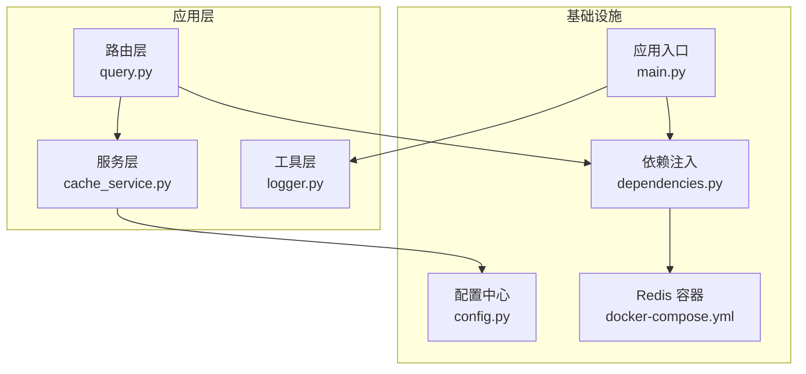
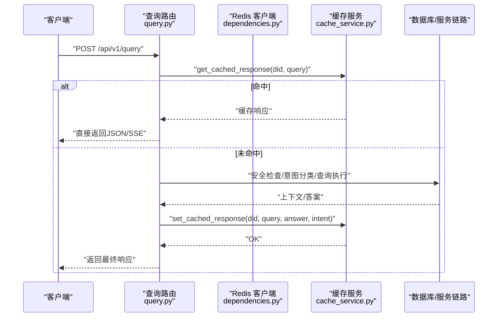
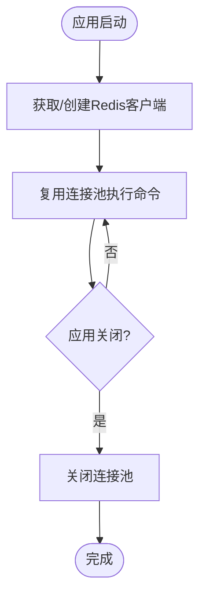
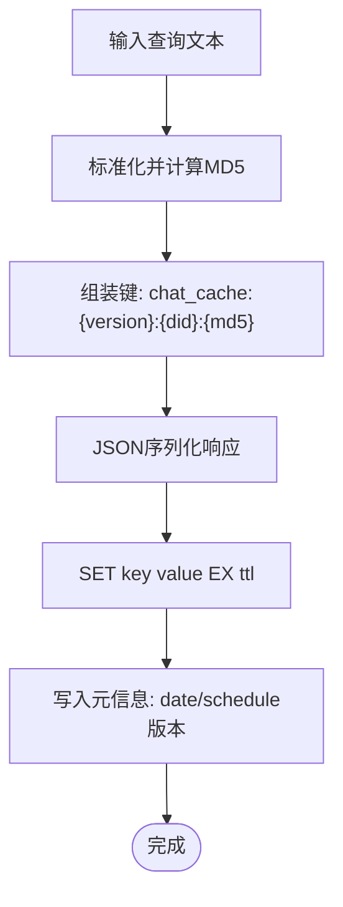
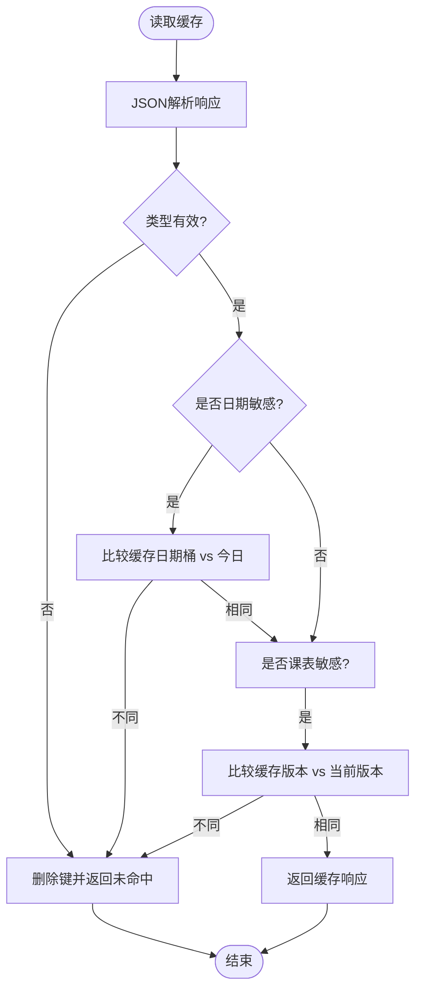
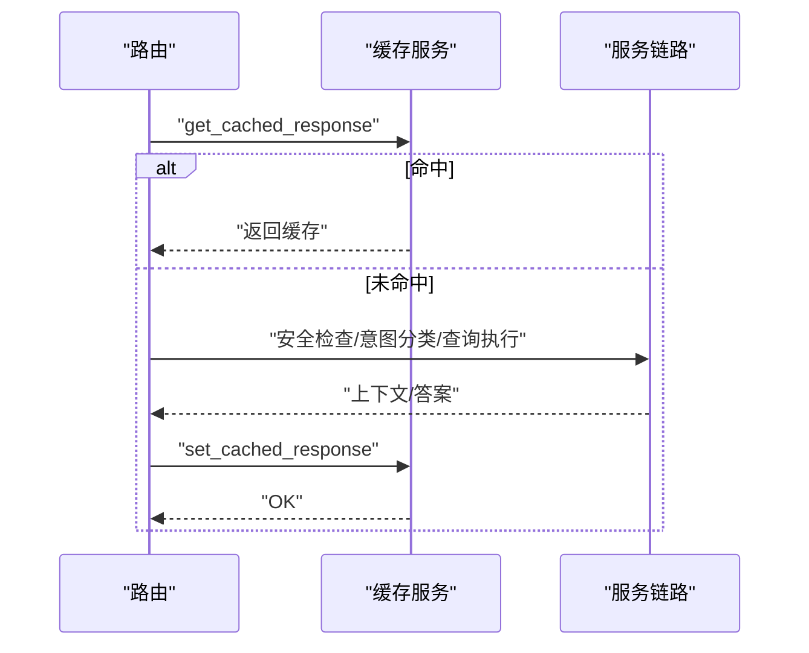
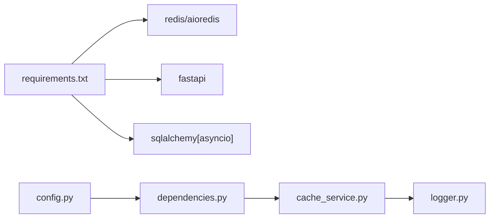

# 缓存系统集成

<cite>
**本文引用的文件**
- [cache_service.py](file://service/ai_assistant/app/services/cache_service.py)
- [config.py](file://service/ai_assistant/app/config.py)
- [main.py](file://service/ai_assistant/app/main.py)
- [dependencies.py](file://service/ai_assistant/app/dependencies.py)
- [query.py](file://service/ai_assistant/app/routers/query.py)
- [logger.py](file://service/ai_assistant/app/utils/logger.py)
- [requirements.txt](file://service/ai_assistant/requirements.txt)
- [Dockerfile](file://service/ai_assistant/Dockerfile)
- [docker-compose.yml](file://service/ai_assistant/docker-compose.yml)
</cite>

## 目录
1. [引言](#引言)
2. [项目结构](#项目结构)
3. [核心组件](#核心组件)
4. [架构总览](#架构总览)
5. [详细组件分析](#详细组件分析)
6. [依赖分析](#依赖分析)
7. [性能考虑](#性能考虑)
8. [故障排查指南](#故障排查指南)
9. [结论](#结论)
10. [附录](#附录)

## 引言
本文件面向开发者与运维工程师，系统化阐述本项目中Redis缓存系统的集成架构与实现要点。内容涵盖连接池管理、键值设计、数据序列化策略、缓存策略（含LRU淘汰与TTL管理）、缓存穿透防护、跨天一致性与版本控制、分布式一致性保障思路、性能优化（批量操作、预热、监控指标）、集成示例与配置模板，以及故障恢复机制。

## 项目结构
后端采用FastAPI应用，缓存服务集中于独立模块，通过依赖注入在路由层按需使用。Redis作为外部依赖，通过Docker Compose提供，具备内存上限与LRU淘汰策略。日志统一由Loguru落地到文件，便于定位缓存行为与异常。

图表来源
- [query.py:198-746](file://service/ai_assistant/app/routers/query.py#L198-L746)
- [cache_service.py:1-177](file://service/ai_assistant/app/services/cache_service.py#L1-L177)
- [dependencies.py:36-51](file://service/ai_assistant/app/dependencies.py#L36-L51)
- [config.py:6-113](file://service/ai_assistant/app/config.py#L6-L113)
- [main.py:36-49](file://service/ai_assistant/app/main.py#L36-L49)
- [docker-compose.yml:5-24](file://service/ai_assistant/docker-compose.yml#L5-L24)

章节来源
- [main.py:1-86](file://service/ai_assistant/app/main.py#L1-L86)
- [dependencies.py:1-109](file://service/ai_assistant/app/dependencies.py#L1-L109)
- [config.py:1-113](file://service/ai_assistant/app/config.py#L1-L113)
- [docker-compose.yml:1-31](file://service/ai_assistant/docker-compose.yml#L1-L31)

## 核心组件
- Redis连接池与客户端
  - 单例客户端通过依赖注入提供，应用生命周期内复用，避免频繁创建销毁。
  - 连接URL由配置中心动态拼装，支持密码与DB索引。
- 缓存服务
  - 键空间设计：包含版本号、DID与查询哈希，确保不同用户与查询变更的隔离。
  - TTL策略：区分敏感/非敏感查询，分别设置不同的过期时间。
  - 元数据保护：在响应体中嵌入缓存元信息，用于跨天与版本一致性校验。
  - 序列化策略：统一使用JSON序列化，异常解析时自动清理键，防止脏数据。
- 路由层集成
  - 查询路由在请求早期尝试缓存命中，命中即直接返回；未命中再进入后续处理链路。
  - 支持JSON与SSE两种输出，均在最终阶段写入缓存。
- 日志与监控
  - 统一日志落盘，包含缓存命中/未命中、解析失败、跨天/版本失效等关键事件，便于审计与告警。

章节来源
- [dependencies.py:36-51](file://service/ai_assistant/app/dependencies.py#L36-L51)
- [config.py:94-100](file://service/ai_assistant/app/config.py#L94-L100)
- [cache_service.py:49-177](file://service/ai_assistant/app/services/cache_service.py#L49-L177)
- [query.py:275-313](file://service/ai_assistant/app/routers/query.py#L275-L313)
- [logger.py:17-47](file://service/ai_assistant/app/utils/logger.py#L17-L47)

## 架构总览
下图展示缓存系统在整体请求处理中的位置与交互：

图表来源
- [query.py:275-313](file://service/ai_assistant/app/routers/query.py#L275-L313)
- [cache_service.py:92-177](file://service/ai_assistant/app/services/cache_service.py#L92-L177)
- [dependencies.py:36-51](file://service/ai_assistant/app/dependencies.py#L36-L51)

## 详细组件分析

### 连接池管理与生命周期
- 单例客户端
  - 通过依赖注入创建单例Redis客户端，避免重复建立连接。
  - 应用关闭时显式关闭连接池，确保资源释放。
- 连接URL
  - 由配置中心拼装，支持带密码与DB索引，便于多租户隔离。
- Docker部署
  - Redis容器启用内存上限与LRU策略，满足轻量缓存需求。

图表来源
- [dependencies.py:36-51](file://service/ai_assistant/app/dependencies.py#L36-L51)
- [main.py:36-49](file://service/ai_assistant/app/main.py#L36-L49)
- [docker-compose.yml:11-16](file://service/ai_assistant/docker-compose.yml#L11-L16)

章节来源
- [dependencies.py:36-51](file://service/ai_assistant/app/dependencies.py#L36-L51)
- [main.py:36-49](file://service/ai_assistant/app/main.py#L36-L49)
- [docker-compose.yml:5-24](file://service/ai_assistant/docker-compose.yml#L5-L24)

### 键值设计与数据序列化
- 键空间设计
  - 格式包含版本号、DID与查询MD5哈希，确保跨版本隔离与用户隔离。
  - 会话历史键采用独立命名空间，便于按用户维度清理。
- 元数据嵌入
  - 在响应体中嵌入缓存元信息，用于跨天与版本一致性校验。
- 序列化策略
  - 统一使用JSON序列化；解析失败或类型异常时自动删除键，避免脏数据。

图表来源
- [cache_service.py:49-53](file://service/ai_assistant/app/services/cache_service.py#L49-L53)
- [cache_service.py:164-174](file://service/ai_assistant/app/services/cache_service.py#L164-L174)

章节来源
- [cache_service.py:3-8](file://service/ai_assistant/app/services/cache_service.py#L3-L8)
- [cache_service.py:49-53](file://service/ai_assistant/app/services/cache_service.py#L49-L53)
- [cache_service.py:164-174](file://service/ai_assistant/app/services/cache_service.py#L164-L174)

### TTL管理与一致性策略
- TTL规则
  - 敏感/隐私查询：短TTL，降低泄露风险。
  - 普通查询：较长TTL，提升命中率。
- 跨天一致性
  - 对包含相对时间语义的查询，缓存元信息记录日期桶；跨天后自动失效。
- 版本一致性
  - 课表相关查询引入版本号，管理员修改课表后递增版本，旧缓存失效。
- 缓存穿透防护
  - 通过DID+查询哈希构建稳定键，避免因参数顺序/空白差异导致的穿透。
  - 对解析失败的键自动清理，降低脏键影响。

图表来源
- [cache_service.py:92-147](file://service/ai_assistant/app/services/cache_service.py#L92-L147)
- [cache_service.py:70-83](file://service/ai_assistant/app/services/cache_service.py#L70-L83)

章节来源
- [cache_service.py:5-8](file://service/ai_assistant/app/services/cache_service.py#L5-L8)
- [cache_service.py:85-89](file://service/ai_assistant/app/services/cache_service.py#L85-L89)
- [cache_service.py:114-142](file://service/ai_assistant/app/services/cache_service.py#L114-L142)
- [cache_service.py:70-83](file://service/ai_assistant/app/services/cache_service.py#L70-L83)

### 路由层集成与写入时机
- 早期命中优先
  - 在进入复杂处理链路前先查缓存，显著降低延迟与成本。
- 写入时机
  - JSON输出与SSE流式输出均在最终阶段写入缓存，避免中间态污染。
- 会话历史隔离
  - 使用独立键空间存储会话历史，避免并发会话串话。

图表来源
- [query.py:275-313](file://service/ai_assistant/app/routers/query.py#L275-L313)
- [query.py:605-616](file://service/ai_assistant/app/routers/query.py#L605-L616)
- [query.py:709-715](file://service/ai_assistant/app/routers/query.py#L709-L715)

章节来源
- [query.py:275-313](file://service/ai_assistant/app/routers/query.py#L275-L313)
- [query.py:605-616](file://service/ai_assistant/app/routers/query.py#L605-L616)
- [query.py:709-715](file://service/ai_assistant/app/routers/query.py#L709-L715)

### 分布式一致性与版本控制
- 一致性现状
  - 本项目为单实例Redis，未实现分布式锁与跨节点版本广播。
- 版本控制
  - 课表版本键用于跨版本失效，管理员修改课表后递增版本，避免脏缓存。
- 建议扩展
  - 若扩展为多实例/集群，建议引入分布式锁（如基于Redis SET NX EX）与版本发布机制，确保跨节点一致性。

章节来源
- [cache_service.py:70-83](file://service/ai_assistant/app/services/cache_service.py#L70-L83)
- [cache_service.py:78-83](file://service/ai_assistant/app/services/cache_service.py#L78-L83)

### 性能优化方案
- 批量操作
  - 提供按用户维度批量清理接口，支持扫描与批量删除，降低运维成本。
- 预热策略
  - 对热点查询（如常用课表/成绩查询）可在业务低峰期预热，提升命中率。
- 监控指标
  - 建议采集：缓存命中率、平均响应时间、Redis内存使用率、LRU淘汰计数、解析失败次数。
  - 日志中已包含关键事件，可作为基础监控来源。

章节来源
- [query.py:748-787](file://service/ai_assistant/app/routers/query.py#L748-L787)
- [logger.py:17-47](file://service/ai_assistant/app/utils/logger.py#L17-L47)

## 依赖分析
- 外部依赖
  - Redis客户端：异步Redis库，支持连接池与异步操作。
  - FastAPI：提供路由与依赖注入能力。
  - SQLAlchemy：数据库访问（与缓存并行使用）。
- 内部依赖
  - 配置中心提供Redis连接URL与TTL参数。
  - 依赖注入模块提供Redis客户端单例。
  - 缓存服务封装键空间、TTL与元数据逻辑。

图表来源
- [requirements.txt:1-22](file://service/ai_assistant/requirements.txt#L1-L22)
- [config.py:94-100](file://service/ai_assistant/app/config.py#L94-L100)
- [dependencies.py:36-51](file://service/ai_assistant/app/dependencies.py#L36-L51)
- [cache_service.py:1-20](file://service/ai_assistant/app/services/cache_service.py#L1-L20)

章节来源
- [requirements.txt:1-22](file://service/ai_assistant/requirements.txt#L1-L22)
- [config.py:94-100](file://service/ai_assistant/app/config.py#L94-L100)
- [dependencies.py:36-51](file://service/ai_assistant/app/dependencies.py#L36-L51)
- [cache_service.py:1-20](file://service/ai_assistant/app/services/cache_service.py#L1-L20)

## 性能考虑
- 连接池复用
  - 单例客户端避免频繁握手与资源消耗。
- TTL与LRU
  - Redis容器配置LRU与内存上限，适合中小规模缓存场景。
- 写入时机
  - 在最终阶段写入缓存，避免中间态污染，同时减少不必要的写入。
- 日志与可观测性
  - 统一日志落盘，便于追踪缓存行为与异常。

章节来源
- [dependencies.py:36-51](file://service/ai_assistant/app/dependencies.py#L36-L51)
- [docker-compose.yml:11-16](file://service/ai_assistant/docker-compose.yml#L11-L16)
- [logger.py:17-47](file://service/ai_assistant/app/utils/logger.py#L17-L47)

## 故障排查指南
- 缓存未命中
  - 检查键空间是否正确（版本/DID/MD5），确认TTL是否过短。
- 缓存解析失败
  - 查看日志中关于解析失败与自动删除键的记录，确认序列化一致性。
- 跨天结果异常
  - 确认日期桶逻辑与当前日期，必要时手动清理相关键。
- 版本不一致
  - 管理员修改课表后需递增版本，否则旧缓存不会失效。
- Redis连接异常
  - 检查连接URL、密码与容器健康状态；应用关闭时确保连接池关闭。

章节来源
- [cache_service.py:92-147](file://service/ai_assistant/app/services/cache_service.py#L92-L147)
- [cache_service.py:70-83](file://service/ai_assistant/app/services/cache_service.py#L70-L83)
- [main.py:36-49](file://service/ai_assistant/app/main.py#L36-L49)
- [docker-compose.yml:18-22](file://service/ai_assistant/docker-compose.yml#L18-L22)

## 结论
本项目在轻量Redis缓存基础上，实现了清晰的键空间设计、TTL与跨天/版本一致性策略，并通过依赖注入与统一日志提供了良好的可维护性。对于更大规模的部署，建议引入分布式锁与版本发布机制，进一步强化一致性与可靠性。

## 附录

### 集成示例与配置模板
- Redis容器配置（Docker Compose）
  - 设置密码、内存上限与LRU策略，挂载数据卷，健康检查。
- 应用配置（.env）
  - 提供Redis主机、端口、密码与DB索引，以及TTL参数。
- 依赖注入
  - 在路由中通过依赖注入获取Redis客户端，按需使用缓存服务。

章节来源
- [docker-compose.yml:5-24](file://service/ai_assistant/docker-compose.yml#L5-L24)
- [config.py:26-31](file://service/ai_assistant/app/config.py#L26-L31)
- [config.py:81-84](file://service/ai_assistant/app/config.py#L81-L84)
- [dependencies.py:36-51](file://service/ai_assistant/app/dependencies.py#L36-L51)