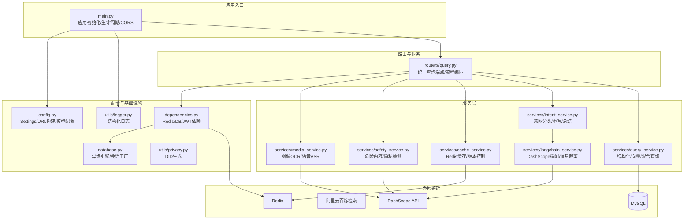
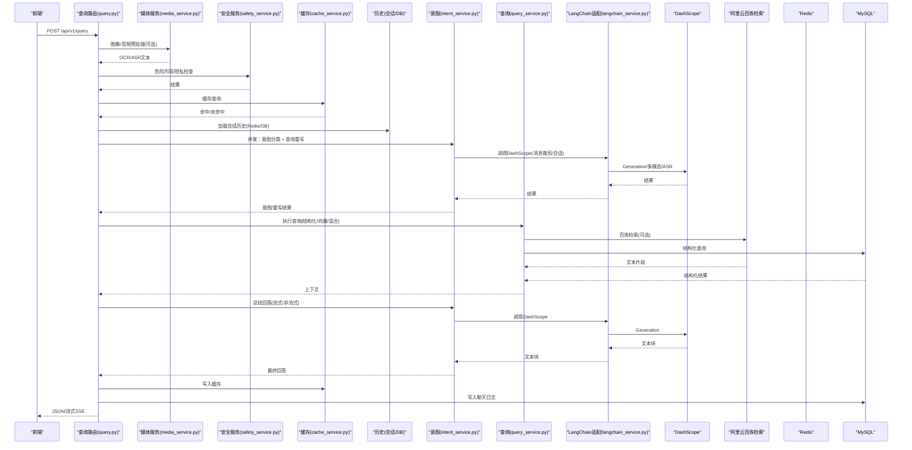
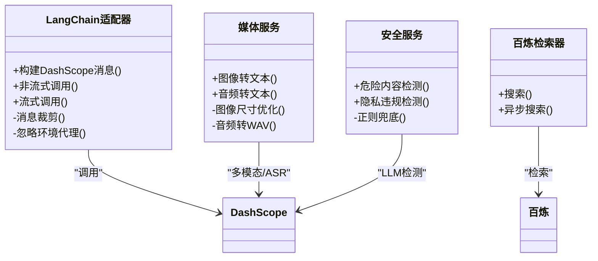
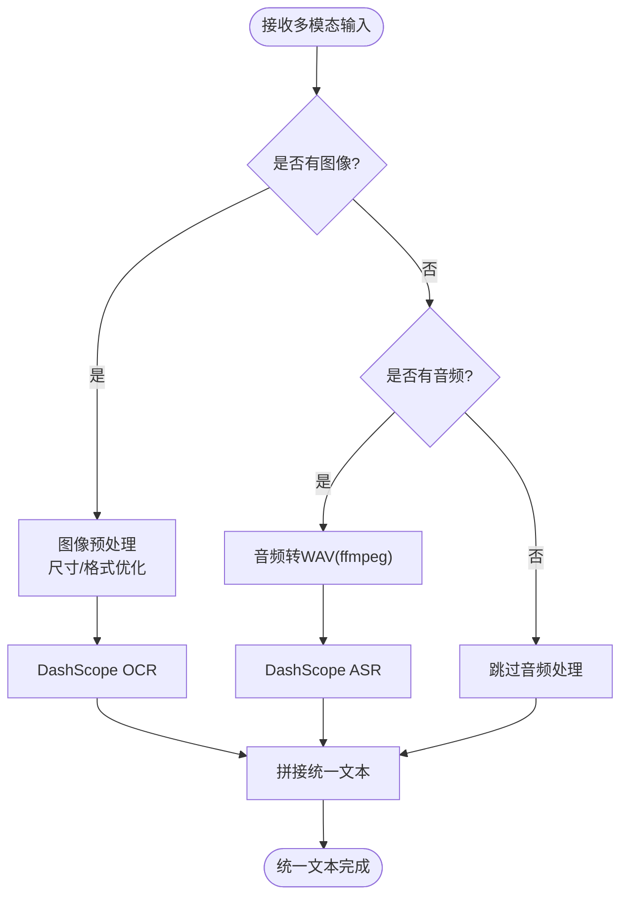
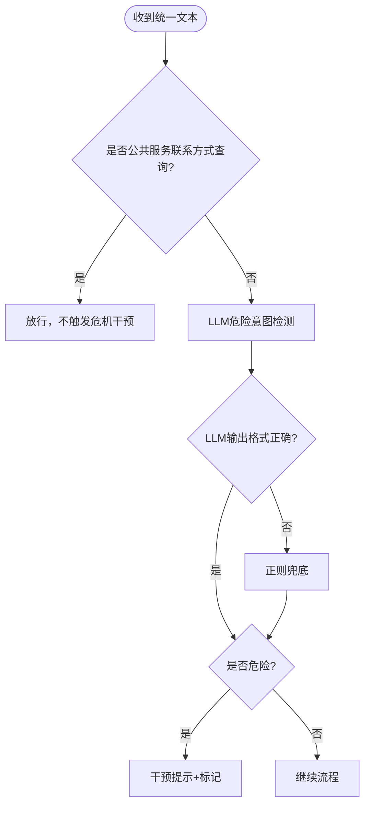
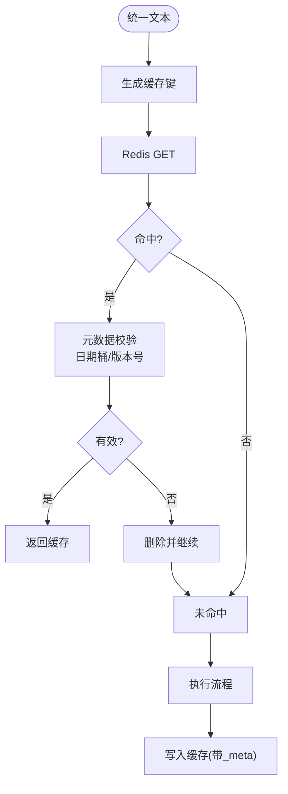
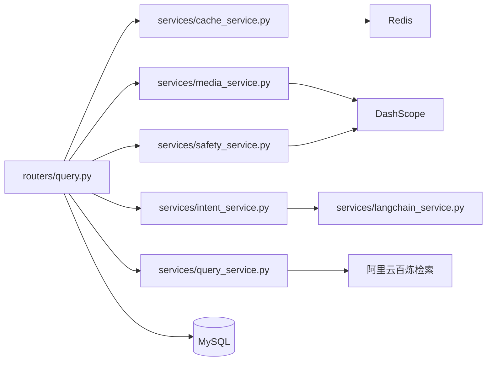

# 集成架构

<cite>
**本文档引用的文件**
- [service/ai_assistant/app/main.py](file://service/ai_assistant/app/main.py)
- [service/ai_assistant/app/config.py](file://service/ai_assistant/app/config.py)
- [service/ai_assistant/app/database.py](file://service/ai_assistant/app/database.py)
- [service/ai_assistant/app/utils/logger.py](file://service/ai_assistant/app/utils/logger.py)
- [service/ai_assistant/app/utils/privacy.py](file://service/ai_assistant/app/utils/privacy.py)
- [service/ai_assistant/app/dependencies.py](file://service/ai_assistant/app/dependencies.py)
- [service/ai_assistant/app/routers/query.py](file://service/ai_assistant/app/routers/query.py)
- [service/ai_assistant/app/services/cache_service.py](file://service/ai_assistant/app/services/cache_service.py)
- [service/ai_assistant/app/services/safety_service.py](file://service/ai_assistant/app/services/safety_service.py)
- [service/ai_assistant/app/services/media_service.py](file://service/ai_assistant/app/services/media_service.py)
- [service/ai_assistant/app/services/langchain_service.py](file://service/ai_assistant/app/services/langchain_service.py)
- [service/ai_assistant/app/services/intent_service.py](file://service/ai_assistant/app/services/intent_service.py)
- [service/ai_assistant/app/services/query_service.py](file://service/ai_assistant/app/services/query_service.py)
- [service/ai_assistant/docker-compose.yml](file://service/ai_assistant/docker-compose.yml)
- [service/ai_assistant/Dockerfile](file://service/ai_assistant/Dockerfile)
</cite>

## 目录
1. [简介](#简介)
2. [项目结构](#项目结构)
3. [核心组件](#核心组件)
4. [架构总览](#架构总览)
5. [详细组件分析](#详细组件分析)
6. [依赖关系分析](#依赖关系分析)
7. [性能考量](#性能考量)
8. [故障排查指南](#故障排查指南)
9. [结论](#结论)
10. [附录](#附录)

## 简介
本文件面向“AI校园助手”项目的集成架构，聚焦系统与外部AI服务（DashScope、阿里云百炼检索）的集成模式与API调用策略，多模态数据处理（图像OCR、语音转文字、文本预处理）的设计，安全服务（内容安全检查、隐私数据过滤、危险内容检测）的集成策略，缓存系统（Redis）的集成设计与一致性保障，日志系统（结构化日志、落盘与聚合）的集成方式，以及第三方服务的配置管理、API密钥管理与故障转移机制。文档提供端到端流程图、关键组件类图与序列图，帮助开发者快速理解整体设计与实现细节。

## 项目结构
后端采用FastAPI应用，按功能域划分模块：
- 应用入口与生命周期：main.py
- 配置中心：config.py
- 数据库引擎与会话：database.py
- 日志与隐私工具：utils/logger.py、utils/privacy.py
- 依赖注入：dependencies.py
- 路由层：routers/query.py
- 服务层：cache_service、safety_service、media_service、langchain_service、intent_service、query_service
- 部署与运行：docker-compose.yml、Dockerfile

图表来源
- [service/ai_assistant/app/main.py:1-86](file://service/ai_assistant/app/main.py#L1-L86)
- [service/ai_assistant/app/config.py:1-113](file://service/ai_assistant/app/config.py#L1-L113)
- [service/ai_assistant/app/database.py:1-35](file://service/ai_assistant/app/database.py#L1-L35)
- [service/ai_assistant/app/dependencies.py:1-109](file://service/ai_assistant/app/dependencies.py#L1-L109)
- [service/ai_assistant/app/routers/query.py:1-788](file://service/ai_assistant/app/routers/query.py#L1-L788)
- [service/ai_assistant/app/services/cache_service.py:1-177](file://service/ai_assistant/app/services/cache_service.py#L1-L177)
- [service/ai_assistant/app/services/safety_service.py:1-163](file://service/ai_assistant/app/services/safety_service.py#L1-L163)
- [service/ai_assistant/app/services/media_service.py:1-246](file://service/ai_assistant/app/services/media_service.py#L1-L246)
- [service/ai_assistant/app/services/langchain_service.py:1-278](file://service/ai_assistant/app/services/langchain_service.py#L1-L278)
- [service/ai_assistant/app/services/intent_service.py:1-346](file://service/ai_assistant/app/services/intent_service.py#L1-L346)
- [service/ai_assistant/app/services/query_service.py:1-800](file://service/ai_assistant/app/services/query_service.py#L1-L800)

章节来源
- [service/ai_assistant/app/main.py:1-86](file://service/ai_assistant/app/main.py#L1-L86)
- [service/ai_assistant/app/config.py:1-113](file://service/ai_assistant/app/config.py#L1-L113)

## 核心组件
- 应用入口与生命周期：初始化FastAPI、CORS、日志、路由注册与生命周期钩子（启动检查不安全默认值、关闭释放Redis连接池）。
- 配置中心：集中管理数据库、Redis、JWT、AES、隐私盐、模型与第三方API密钥、缓存TTL等。
- 数据库：异步SQLAlchemy引擎与会话工厂，支持连接池预热与回收。
- 依赖注入：提供Redis客户端单例、数据库会话、JWT用户解析、管理员鉴权。
- 日志：Loguru统一配置，控制台+文件落盘，支持旋转与保留策略。
- 隐私：基于学生ID与盐生成稳定DID，用于脱敏存储与历史关联。
- 路由与编排：统一查询端点，串联多模态预处理、安全检查、缓存、意图分类、查询执行、总结与持久化。
- 服务层：缓存、安全、媒体、LangChain适配、意图与查询服务。

章节来源
- [service/ai_assistant/app/main.py:1-86](file://service/ai_assistant/app/main.py#L1-L86)
- [service/ai_assistant/app/config.py:1-113](file://service/ai_assistant/app/config.py#L1-L113)
- [service/ai_assistant/app/database.py:1-35](file://service/ai_assistant/app/database.py#L1-L35)
- [service/ai_assistant/app/utils/logger.py:1-53](file://service/ai_assistant/app/utils/logger.py#L1-L53)
- [service/ai_assistant/app/utils/privacy.py:1-23](file://service/ai_assistant/app/utils/privacy.py#L1-L23)
- [service/ai_assistant/app/dependencies.py:1-109](file://service/ai_assistant/app/dependencies.py#L1-L109)

## 架构总览
系统围绕“统一查询端点”进行编排，核心流程如下：
- 输入多模态（文本/图像/音频）→ 预处理（图像OCR、语音ASR）→ 统一文本
- 安全检查（危险内容、隐私违规）→ 缓存命中/降级 → 历史加载（Redis/DB）
- 并发执行：意图分类、查询重写 → 执行查询（结构化/向量/混合）→ 总结回答
- 流式/JSON输出、缓存写入、聊天日志持久化

图表来源
- [service/ai_assistant/app/routers/query.py:198-745](file://service/ai_assistant/app/routers/query.py#L198-L745)
- [service/ai_assistant/app/services/media_service.py:115-246](file://service/ai_assistant/app/services/media_service.py#L115-L246)
- [service/ai_assistant/app/services/safety_service.py:84-163](file://service/ai_assistant/app/services/safety_service.py#L84-L163)
- [service/ai_assistant/app/services/cache_service.py:92-177](file://service/ai_assistant/app/services/cache_service.py#L92-L177)
- [service/ai_assistant/app/services/intent_service.py:218-346](file://service/ai_assistant/app/services/intent_service.py#L218-L346)
- [service/ai_assistant/app/services/query_service.py:212-800](file://service/ai_assistant/app/services/query_service.py#L212-L800)
- [service/ai_assistant/app/services/langchain_service.py:139-278](file://service/ai_assistant/app/services/langchain_service.py#L139-L278)

## 详细组件分析

### 外部AI服务集成：DashScope与阿里云百炼检索
- DashScope集成
  - API密钥与模型配置：通过配置中心集中管理，服务内统一注入。
  - 多模态与ASR：图像OCR使用多模态对话API，语音识别使用ASR API，均在服务内封装调用与错误处理。
  - LangChain适配：提供消息格式转换、输入裁剪、会话控制与流式输出。
- 阿里云百炼检索
  - 通过LangChain检索器包装器对接现有检索后端，支持异步检索与文档对象转换。
  - 配置项包含工作空间、索引、访问凭证与Endpoint。

图表来源
- [service/ai_assistant/app/services/langchain_service.py:1-278](file://service/ai_assistant/app/services/langchain_service.py#L1-L278)
- [service/ai_assistant/app/services/media_service.py:1-246](file://service/ai_assistant/app/services/media_service.py#L1-L246)
- [service/ai_assistant/app/services/safety_service.py:1-163](file://service/ai_assistant/app/services/safety_service.py#L1-L163)
- [service/ai_assistant/app/services/query_service.py:212-238](file://service/ai_assistant/app/services/query_service.py#L212-L238)

章节来源
- [service/ai_assistant/app/services/langchain_service.py:1-278](file://service/ai_assistant/app/services/langchain_service.py#L1-L278)
- [service/ai_assistant/app/services/media_service.py:1-246](file://service/ai_assistant/app/services/media_service.py#L1-L246)
- [service/ai_assistant/app/services/safety_service.py:1-163](file://service/ai_assistant/app/services/safety_service.py#L1-L163)
- [service/ai_assistant/app/services/query_service.py:212-238](file://service/ai_assistant/app/services/query_service.py#L212-L238)

### 多模态数据处理集成设计
- 图像OCR
  - 输入：Base64图像（JPEG/PNG）。
  - 预处理：按最大边阈值缩放、必要时转JPEG并压缩，避免API负载过大。
  - 调用：DashScope多模态对话API，返回自然语言描述与文本抽取。
- 语音转文字
  - 输入：Base64音频（WAV/MP3）。
  - 预处理：使用ffmpeg转为16kHz单声道WAV，避免Python音频库复杂度。
  - 调用：DashScope ASR识别，兼容不同SDK输出结构，严格校验有效文本。
- 文本预处理
  - 统一文本拼接：图像/音频转文本与原始文本合并，形成统一查询。
  - 图片问答分流：根据关键词与上下文决定是否直接回答或进入检索。

图表来源
- [service/ai_assistant/app/routers/query.py:228-273](file://service/ai_assistant/app/routers/query.py#L228-L273)
- [service/ai_assistant/app/services/media_service.py:23-113](file://service/ai_assistant/app/services/media_service.py#L23-L113)
- [service/ai_assistant/app/services/media_service.py:115-246](file://service/ai_assistant/app/services/media_service.py#L115-L246)

章节来源
- [service/ai_assistant/app/routers/query.py:228-273](file://service/ai_assistant/app/routers/query.py#L228-L273)
- [service/ai_assistant/app/services/media_service.py:1-246](file://service/ai_assistant/app/services/media_service.py#L1-L246)

### 安全服务集成架构
- 内容安全检查
  - LLM危险意图检测：基于定制Prompt与温度控制，优先LLM判断，失败时回退正则。
  - 公共服务联系方式查询豁免：避免将“急诊电话”等纳入危机干预。
- 隐私数据过滤
  - 正则匹配学号查询：检测非本人学号，阻断并提示合规边界。
- 集成策略
  - 并发执行危险检查与查询重写，缩短端到端延迟。
  - 危险内容触发干预提示与系统动作标记，保障学生安全。

图表来源
- [service/ai_assistant/app/services/safety_service.py:84-163](file://service/ai_assistant/app/services/safety_service.py#L84-L163)
- [service/ai_assistant/app/routers/query.py:344-471](file://service/ai_assistant/app/routers/query.py#L344-L471)

章节来源
- [service/ai_assistant/app/services/safety_service.py:1-163](file://service/ai_assistant/app/services/safety_service.py#L1-L163)
- [service/ai_assistant/app/routers/query.py:344-471](file://service/ai_assistant/app/routers/query.py#L344-L471)

### 缓存系统集成设计
- 键空间与版本控制
  - 键格式：chat_cache:{version}:{did}:{query_md5}，版本号用于升级时隔离旧缓存。
  - 课表敏感版本：独立版本号，管理员改课后递增，命中旧缓存即失效。
- 敏感性与TTL
  - 敏感关键词匹配：30分钟TTL；普通查询：1天TTL。
  - 日期敏感查询：按当日日期桶校验，跨日自动失效。
  - 课表敏感查询：按版本号校验，管理员改课后失效。
- 写入与读取
  - 读取：命中返回，否则为空；解析失败或类型异常自动清理。
  - 写入：携带_meta元数据（日期桶、版本号、敏感标记），按敏感性设置TTL。
- 会话历史隔离
  - Redis列表存储会话历史，按会话ID隔离，限制长度并设置过期。
- 清理接口
  - 支持按学生DID批量删除缓存与会话历史。

图表来源
- [service/ai_assistant/app/services/cache_service.py:49-177](file://service/ai_assistant/app/services/cache_service.py#L49-L177)
- [service/ai_assistant/app/routers/query.py:153-196](file://service/ai_assistant/app/routers/query.py#L153-L196)

章节来源
- [service/ai_assistant/app/services/cache_service.py:1-177](file://service/ai_assistant/app/services/cache_service.py#L1-L177)
- [service/ai_assistant/app/routers/query.py:153-196](file://service/ai_assistant/app/routers/query.py#L153-L196)

### 日志系统集成架构
- 结构化日志
  - Loguru统一配置，控制台INFO级别输出，文件DEBUG级别落盘。
  - 文件滚动大小10MB，保留14天，格式包含时间、级别、模块与行号。
- 日志落盘与聚合
  - 默认输出至项目根目录logs目录下的运行日志文件，便于运维收集与分析。
- 监控集成
  - 建议在容器/平台侧将stdout/stderr接入日志采集系统，实现集中聚合与告警。

章节来源
- [service/ai_assistant/app/utils/logger.py:1-53](file://service/ai_assistant/app/utils/logger.py#L1-L53)
- [service/ai_assistant/app/main.py:16-16](file://service/ai_assistant/app/main.py#L16-L16)

### 第三方服务配置管理与API密钥管理
- 配置中心
  - Settings集中管理数据库、Redis、JWT、AES、隐私盐、模型与第三方密钥、缓存TTL。
  - URL构建：数据库URL与Redis URL自动拼装，支持带/不带密码。
- API密钥管理
  - DashScope：通过配置项注入，服务内统一使用。
  - 百炼检索：AccessKey、Secret、WorkspaceId、IndexId、Endpoint集中配置。
- 安全建议
  - 生产环境务必替换不安全默认值，使用环境变量注入密钥与敏感配置。
  - 建议启用密钥轮换与最小权限策略。

章节来源
- [service/ai_assistant/app/config.py:1-113](file://service/ai_assistant/app/config.py#L1-L113)

### 故障转移与降级策略
- Redis故障降级
  - 缓存查询异常：记录警告并继续DB回退；会话历史加载异常：降级到DB历史。
- LLM调用降级
  - 安全检测LLM失败：回退正则匹配；意图分类失败：回退为向量意图。
- 媒体处理异常
  - 图像/音频处理失败：返回502并提示具体错误；ASR无有效文本：抛出明确异常。
- 网络代理
  - DashScope会话可忽略环境代理，避免误走代理导致超时。

章节来源
- [service/ai_assistant/app/routers/query.py:280-342](file://service/ai_assistant/app/routers/query.py#L280-L342)
- [service/ai_assistant/app/services/safety_service.py:134-144](file://service/ai_assistant/app/services/safety_service.py#L134-L144)
- [service/ai_assistant/app/services/langchain_service.py:99-108](file://service/ai_assistant/app/services/langchain_service.py#L99-L108)

## 依赖关系分析
- 组件耦合
  - 路由层依赖服务层与依赖注入；服务层彼此低耦合，通过配置中心共享第三方密钥。
  - LangChain适配器与DashScope紧密耦合，便于统一消息格式与调用策略。
- 外部依赖
  - DashScope：多模态、ASR、Generation。
  - 阿里云百炼检索：知识库检索。
  - Redis：缓存与会话历史。
  - MySQL：结构化数据查询。
- 循环依赖
  - 未发现循环依赖，模块职责清晰。

图表来源
- [service/ai_assistant/app/routers/query.py:35-42](file://service/ai_assistant/app/routers/query.py#L35-L42)
- [service/ai_assistant/app/services/langchain_service.py:1-278](file://service/ai_assistant/app/services/langchain_service.py#L1-L278)
- [service/ai_assistant/app/services/query_service.py:212-238](file://service/ai_assistant/app/services/query_service.py#L212-L238)

章节来源
- [service/ai_assistant/app/routers/query.py:35-42](file://service/ai_assistant/app/routers/query.py#L35-L42)

## 性能考量
- 并发优化
  - 安全检查与查询重写并发执行，减少端到端延迟。
  - 流式回答使用增量输出，降低首字节延迟。
- 输入裁剪
  - LangChain适配器对消息进行字符数裁剪，优先丢弃旧历史，再裁剪最后一条，避免超限。
- 缓存策略
  - 敏感/普通查询差异化TTL；日期敏感与课表敏感按策略失效，避免陈旧结果。
- I/O优化
  - Redis连接池单例化；数据库连接池预热与回收；ffmpeg本地转换避免Python音频库开销。

## 故障排查指南
- 常见错误定位
  - 图像/音频处理失败：查看媒体服务日志与异常栈，确认Base64与文件大小。
  - LLM调用失败：检查DashScope密钥、模型ID与网络代理配置。
  - 缓存异常：检查Redis连通性与键空间；查看缓存清理与版本号更新。
  - 安全检测异常：确认LLM输出格式，必要时回退正则。
- 运维建议
  - 启用健康检查与日志滚动；容器侧接入集中日志；监控关键指标（响应时间、错误率、缓存命中率）。

章节来源
- [service/ai_assistant/app/services/media_service.py:177-246](file://service/ai_assistant/app/services/media_service.py#L177-L246)
- [service/ai_assistant/app/services/safety_service.py:134-144](file://service/ai_assistant/app/services/safety_service.py#L134-L144)
- [service/ai_assistant/app/services/cache_service.py:92-177](file://service/ai_assistant/app/services/cache_service.py#L92-L177)
- [service/ai_assistant/app/utils/logger.py:1-53](file://service/ai_assistant/app/utils/logger.py#L1-L53)

## 结论
本集成架构以统一查询端点为核心，通过服务层解耦第三方AI能力与内部数据查询，结合缓存、安全与日志体系，实现了高性能、可扩展、可维护的校园智能问答系统。通过并发执行、输入裁剪、差异化缓存与降级策略，系统在复杂多模态场景下仍能保持稳定与高效。

## 附录
- 部署与运行
  - Dockerfile：构建阶段安装编译依赖与Python包，运行阶段安装MySQL客户端与ffmpeg，暴露8000端口。
  - docker-compose：Redis单节点服务，健康检查与内存策略配置。
- 配置模板
  - .env示例（字段说明见配置中心）：数据库、Redis、JWT、AES、隐私盐、模型ID、第三方密钥、缓存TTL等。

章节来源
- [service/ai_assistant/Dockerfile:1-49](file://service/ai_assistant/Dockerfile#L1-L49)
- [service/ai_assistant/docker-compose.yml:1-31](file://service/ai_assistant/docker-compose.yml#L1-L31)
- [service/ai_assistant/app/config.py:1-113](file://service/ai_assistant/app/config.py#L1-L113)