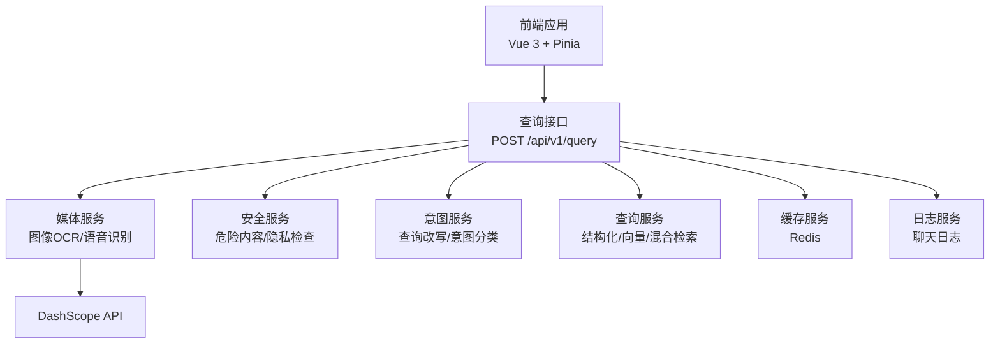
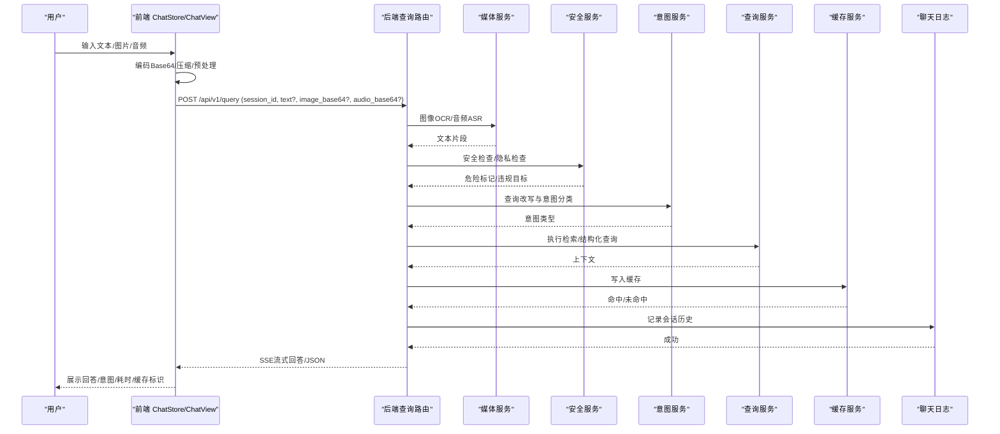
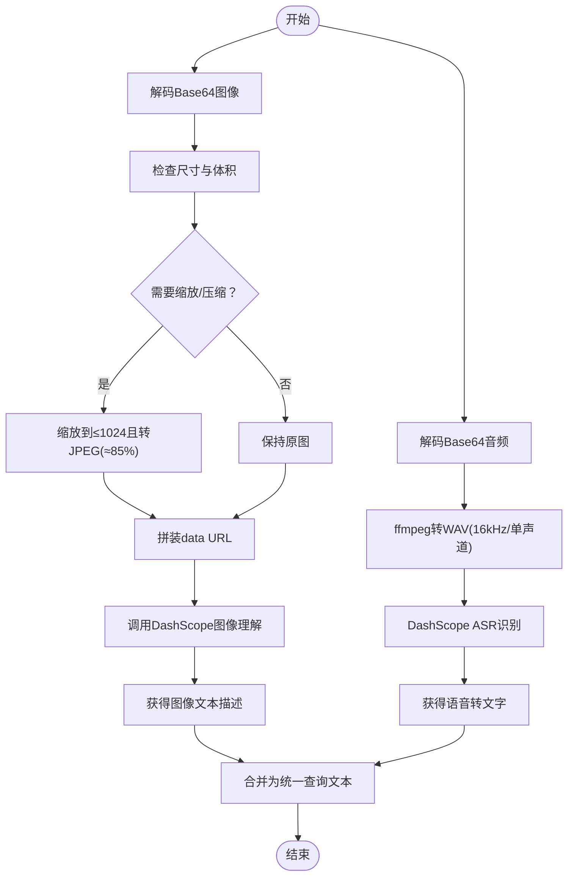
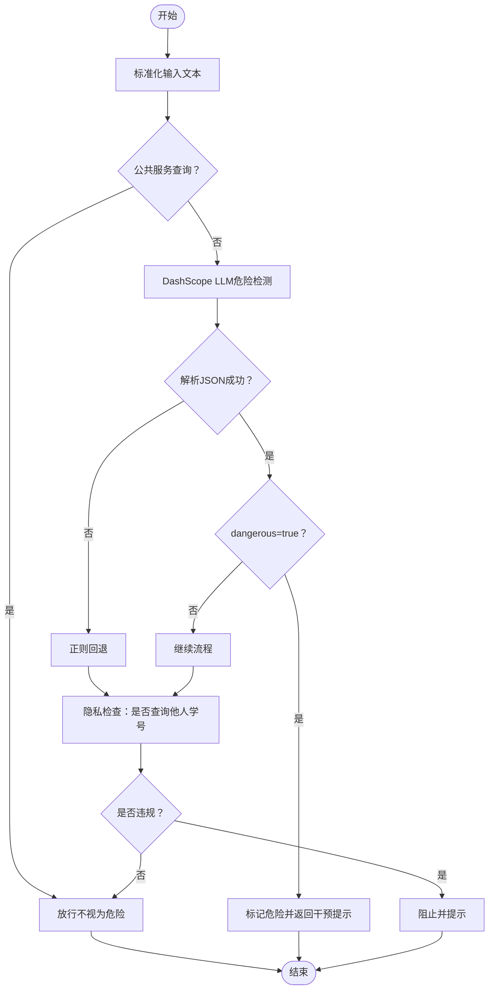
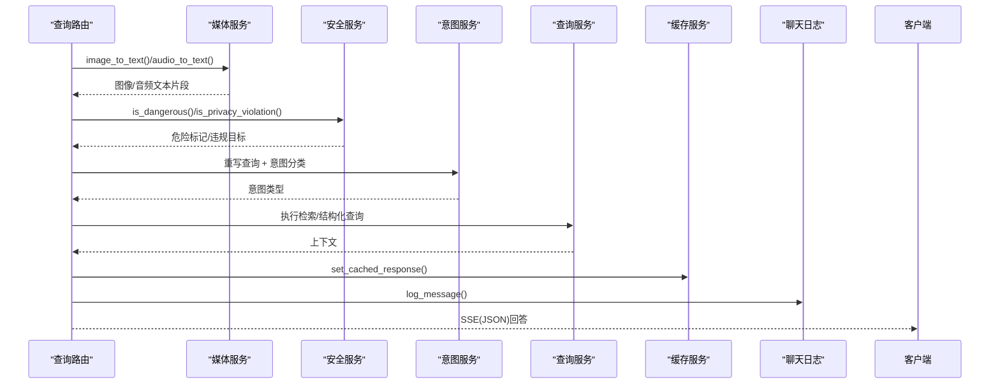
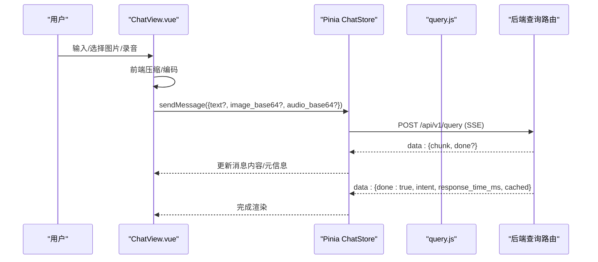
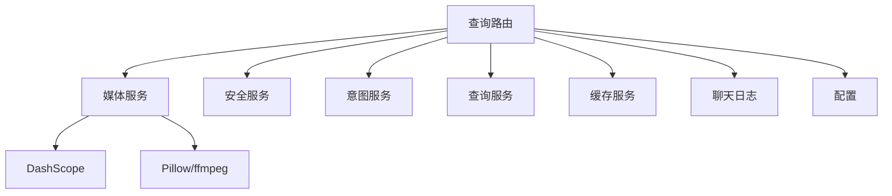

# 多模态输入处理

<cite>
**本文引用的文件**
- [media_service.py](file://service/ai_assistant/app/services/media_service.py)
- [safety_service.py](file://service/ai_assistant/app/services/safety_service.py)
- [query.py](file://service/ai_assistant/app/routers/query.py)
- [chat.js](file://frontend/ai_assistant/src/stores/chat.js)
- [ChatView.vue](file://frontend/ai_assistant/src/views/ChatView.vue)
- [query.js](file://frontend/ai_assistant/src/api/query.js)
- [config.py](file://service/ai_assistant/app/config.py)
- [query.py（schema）](file://service/ai_assistant/app/schemas/query.py)
- [main.py](file://service/ai_assistant/app/main.py)
- [requirements.txt](file://service/ai_assistant/requirements.txt)
</cite>

## 目录
1. [简介](#简介)
2. [项目结构](#项目结构)
3. [核心组件](#核心组件)
4. [架构总览](#架构总览)
5. [详细组件分析](#详细组件分析)
6. [依赖分析](#依赖分析)
7. [性能考虑](#性能考虑)
8. [故障排查指南](#故障排查指南)
9. [结论](#结论)
10. [附录](#附录)

## 简介
本文件面向“AI校园助手”的多模态输入处理能力，系统支持文本、图像与音频三类输入，通过统一的查询接口将多模态数据融合为自然语言查询，再经意图分类、检索与总结生成最终回答。后端使用 DashScope 提供的图像理解与语音识别能力，前端负责多模态数据采集、编码与流式展示。文档涵盖媒体服务实现原理（Base64解码、图像预处理、语音识别流程）、安全检查与隐私保护、错误处理策略、性能优化建议及常见问题解决方案。

## 项目结构
后端采用 FastAPI + SQLAlchemy + Redis + DashScope 的架构，前端使用 Vue 3 + Pinia + Vite。多模态输入的关键链路如下：
- 前端：采集文本、图片、音频，进行本地压缩与编码，通过 SSE 流式接收后端回答。
- 后端：统一路由接收多模态输入，调用媒体服务进行 OCR 与 ASR，组合查询文本，执行安全检查与意图分类，最终生成回答并缓存。

图表来源
- [query.py:198-745](file://service/ai_assistant/app/routers/query.py#L198-L745)
- [media_service.py:115-245](file://service/ai_assistant/app/services/media_service.py#L115-L245)
- [safety_service.py:84-144](file://service/ai_assistant/app/services/safety_service.py#L84-L144)

章节来源
- [main.py:52-86](file://service/ai_assistant/app/main.py#L52-L86)
- [requirements.txt:1-22](file://service/ai_assistant/requirements.txt#L1-L22)

## 核心组件
- 媒体服务（media_service）：负责图像OCR与音频ASR，包含Base64解码、图像尺寸/体积优化、音频格式转换（ffmpeg）与DashScope调用。
- 安全服务（safety_service）：对统一查询文本进行危险内容与隐私违规检测，支持LLM与正则双重策略。
- 查询路由（query.py）：统一入口，串联媒体处理、安全检查、意图分类、检索与回答生成，支持SSE流式输出与JSON直返。
- 前端聊天存储（chat.js）与视图（ChatView.vue）：负责多模态采集、编码、发送与流式渲染。
- 配置（config.py）：集中管理DashScope模型、缓存TTL、CORS等运行参数。

章节来源
- [media_service.py:115-245](file://service/ai_assistant/app/services/media_service.py#L115-L245)
- [safety_service.py:84-144](file://service/ai_assistant/app/services/safety_service.py#L84-L144)
- [query.py:198-745](file://service/ai_assistant/app/routers/query.py#L198-L745)
- [chat.js:133-230](file://frontend/ai_assistant/src/stores/chat.js#L133-L230)
- [ChatView.vue:312-482](file://frontend/ai_assistant/src/views/ChatView.vue#L312-L482)
- [config.py:48-78](file://service/ai_assistant/app/config.py#L48-L78)

## 架构总览
下图展示了从前端采集到后端处理再到回答生成的端到端流程，重点标注多模态融合、安全检查与缓存策略。

图表来源
- [query.py:207-745](file://service/ai_assistant/app/routers/query.py#L207-L745)
- [media_service.py:115-245](file://service/ai_assistant/app/services/media_service.py#L115-L245)
- [safety_service.py:84-144](file://service/ai_assistant/app/services/safety_service.py#L84-L144)

## 详细组件分析

### 媒体服务：图像OCR与音频ASR
媒体服务负责将Base64编码的图像与音频转换为文本，作为统一查询的一部分。核心流程包括：
- 图像处理：Base64解码 → 尺寸/体积优化（最长边>1024缩放、>1MB转JPEG）→ DashScope多模态对话API调用。
- 音频处理：Base64解码 → ffmpeg转WAV（单声道、16kHz）→ DashScope ASR识别 → 提取文本片段。

图表来源
- [media_service.py:23-63](file://service/ai_assistant/app/services/media_service.py#L23-L63)
- [media_service.py:66-113](file://service/ai_assistant/app/services/media_service.py#L66-L113)
- [media_service.py:115-156](file://service/ai_assistant/app/services/media_service.py#L115-L156)
- [media_service.py:159-245](file://service/ai_assistant/app/services/media_service.py#L159-L245)

章节来源
- [media_service.py:23-63](file://service/ai_assistant/app/services/media_service.py#L23-L63)
- [media_service.py:66-113](file://service/ai_assistant/app/services/media_service.py#L66-L113)
- [media_service.py:115-156](file://service/ai_assistant/app/services/media_service.py#L115-L156)
- [media_service.py:159-245](file://service/ai_assistant/app/services/media_service.py#L159-L245)

### 安全服务：危险内容与隐私检查
安全服务在统一查询文本上执行两层检查：
- LLM危险意图检测：对文本进行JSON格式输出的危险标记判断，失败时回退正则匹配。
- 隐私检查：检测是否尝试查询他人学号，若命中则阻止并返回提示。

图表来源
- [safety_service.py:84-144](file://service/ai_assistant/app/services/safety_service.py#L84-L144)
- [safety_service.py:147-163](file://service/ai_assistant/app/services/safety_service.py#L147-L163)

章节来源
- [safety_service.py:84-144](file://service/ai_assistant/app/services/safety_service.py#L84-L144)
- [safety_service.py:147-163](file://service/ai_assistant/app/services/safety_service.py#L147-L163)

### 查询路由：统一入口与多模态融合
查询路由负责：
- 解析请求体（文本、图像Base64、音频Base64、会话ID、输出类型）。
- 调用媒体服务进行OCR与ASR，构建统一查询文本。
- 并发执行安全检查与查询改写，随后意图分类与检索执行。
- 生成回答并支持SSE流式输出或JSON直返，同时写入缓存与聊天日志。

图表来源
- [query.py:207-745](file://service/ai_assistant/app/routers/query.py#L207-L745)

章节来源
- [query.py:198-745](file://service/ai_assistant/app/routers/query.py#L198-L745)
- [query.py（schema）:15-32](file://service/ai_assistant/app/schemas/query.py#L15-L32)

### 前端：多模态采集、编码与流式渲染
前端负责：
- 文本输入与自动高度适配。
- 图片上传与前端压缩（控制体积，避免网关限制）。
- 语音录制（WebRTC MediaRecorder），前端基础校验（时长、音量）。
- 通过 SSE 流式接收后端回答，渲染意图、耗时、缓存标识等元信息。

图表来源
- [ChatView.vue:312-482](file://frontend/ai_assistant/src/views/ChatView.vue#L312-L482)
- [chat.js:133-230](file://frontend/ai_assistant/src/stores/chat.js#L133-L230)
- [query.js:28-141](file://frontend/ai_assistant/src/api/query.js#L28-L141)

章节来源
- [ChatView.vue:312-482](file://frontend/ai_assistant/src/views/ChatView.vue#L312-L482)
- [chat.js:133-230](file://frontend/ai_assistant/src/stores/chat.js#L133-L230)
- [query.js:28-141](file://frontend/ai_assistant/src/api/query.js#L28-L141)

## 依赖分析
- 外部依赖：FastAPI、DashScope、Pillow、ffmpeg（音频转换）、Redis、MySQL（聊天日志）。
- 模块耦合：查询路由聚合媒体、安全、意图、查询与缓存服务；前端通过统一API与后端交互。
- 配置集中：DashScope模型名称、缓存TTL、CORS等均在配置文件中集中管理。

图表来源
- [query.py:35-42](file://service/ai_assistant/app/routers/query.py#L35-L42)
- [config.py:48-83](file://service/ai_assistant/app/config.py#L48-L83)
- [requirements.txt:13-20](file://service/ai_assistant/requirements.txt#L13-L20)

章节来源
- [requirements.txt:1-22](file://service/ai_assistant/requirements.txt#L1-L22)
- [config.py:48-83](file://service/ai_assistant/app/config.py#L48-L83)

## 性能考虑
- 图像预处理：在进入DashScope前进行尺寸与体积优化，避免超限与带宽浪费。
- 音频预处理：ffmpeg转WAV（单声道、16kHz）减少模型输入复杂度与网络传输体积。
- 并发执行：安全检查与查询改写并行，缩短端到端延迟。
- 缓存策略：针对敏感与普通查询设置不同TTL，命中后可直接返回SSE模拟流或JSON。
- SSE优化：设置必要的响应头避免反向代理缓冲，提升流式体验。
- 数据库连接：在流式阶段及时回滚请求会话，释放连接给后续写入使用。

章节来源
- [media_service.py:23-63](file://service/ai_assistant/app/services/media_service.py#L23-L63)
- [media_service.py:66-113](file://service/ai_assistant/app/services/media_service.py#L66-L113)
- [query.py:347-352](file://service/ai_assistant/app/routers/query.py#L347-L352)
- [query.py:115-125](file://service/ai_assistant/app/routers/query.py#L115-L125)
- [query.py:654-657](file://service/ai_assistant/app/routers/query.py#L654-L657)

## 故障排查指南
- 图像/音频处理失败（502）：检查DashScope API密钥与模型配置，确认图像尺寸/体积与音频格式符合要求。
- 语音静音/无内容：前端已对极短录音与极小音频进行提示；后端在无有效语音内容时会抛出明确错误，前端已做友好封装。
- 参数缺失：当未提供文本、图像或音频时，后端返回400并提示至少提供一项。
- 安全拦截：若检测到危险内容或隐私违规，将返回相应提示并记录日志。
- 缓存异常：Redis不可用时流程会降级，不影响基本功能；可通过清理会话缓存接口重置。

章节来源
- [query.py:233-260](file://service/ai_assistant/app/routers/query.py#L233-L260)
- [chat.js:240-257](file://frontend/ai_assistant/src/stores/chat.js#L240-L257)
- [query.py:748-787](file://service/ai_assistant/app/routers/query.py#L748-L787)

## 结论
本系统通过统一的查询接口实现了文本、图像与音频的多模态融合，借助DashScope完成OCR与ASR，结合安全与隐私检查保障校园场景下的合规与安全。前端提供良好的多模态采集与流式渲染体验，后端通过并发与缓存策略提升性能与稳定性。建议在生产环境完善CORS白名单、强化密钥与模型配置管理，并持续监控DashScope与Redis健康状况。

## 附录

### 前端多模态数据编码示例（路径指引）
- 文本与图片发送：参见 [chat.js:133-187](file://frontend/ai_assistant/src/stores/chat.js#L133-L187)
- 语音录制与发送：参见 [ChatView.vue:400-455](file://frontend/ai_assistant/src/views/ChatView.vue#L400-L455)
- SSE流式接收：参见 [query.js:28-141](file://frontend/ai_assistant/src/api/query.js#L28-L141)

### 后端多模态解码与处理示例（路径指引）
- 图像OCR：参见 [media_service.py:115-156](file://service/ai_assistant/app/services/media_service.py#L115-L156)
- 音频ASR：参见 [media_service.py:159-245](file://service/ai_assistant/app/services/media_service.py#L159-L245)
- 统一查询构建与路由：参见 [query.py:207-273](file://service/ai_assistant/app/routers/query.py#L207-L273)

### 安全与隐私检查示例（路径指引）
- 危险内容检测：参见 [safety_service.py:84-144](file://service/ai_assistant/app/services/safety_service.py#L84-L144)
- 隐私违规检测：参见 [safety_service.py:147-163](file://service/ai_assistant/app/services/safety_service.py#L147-L163)

### 配置项与模型映射（路径指引）
- DashScope模型配置：参见 [config.py:54-78](file://service/ai_assistant/app/config.py#L54-L78)
- CORS与缓存TTL：参见 [config.py:17-83](file://service/ai_assistant/app/config.py#L17-L83)