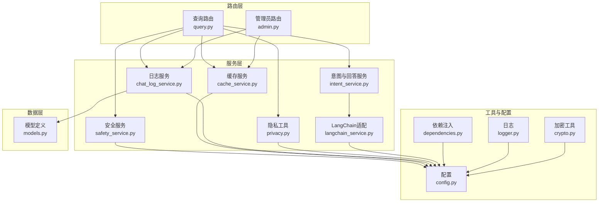
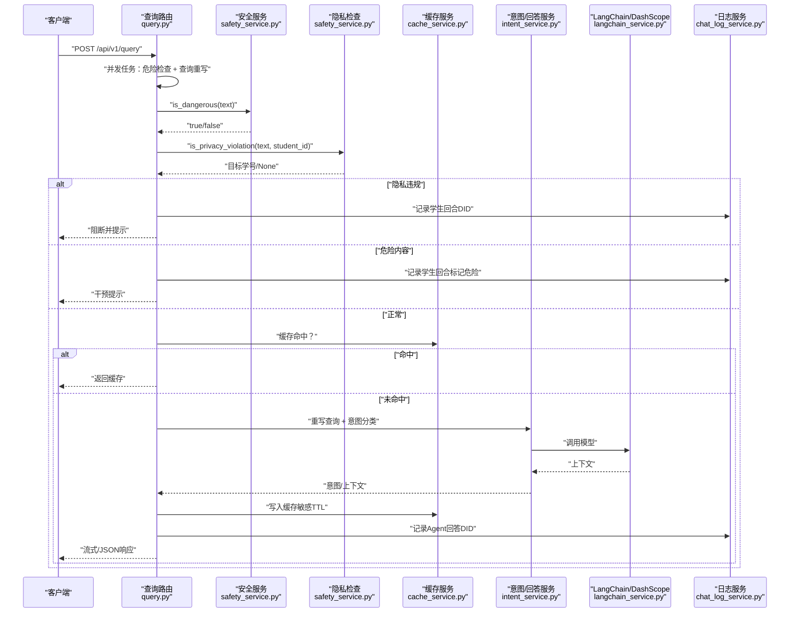
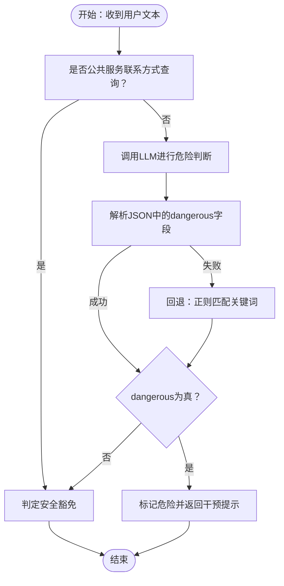
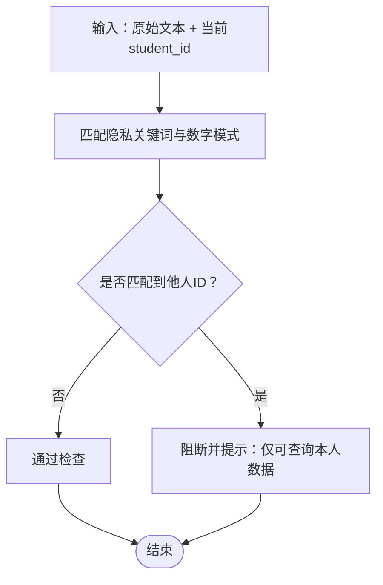
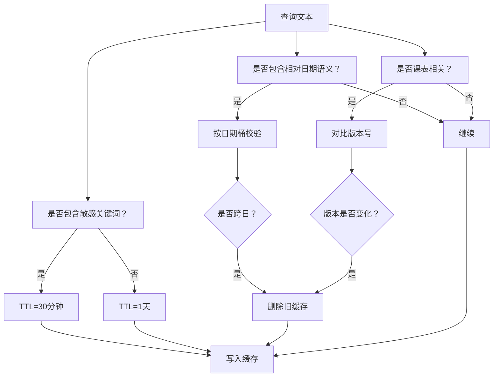
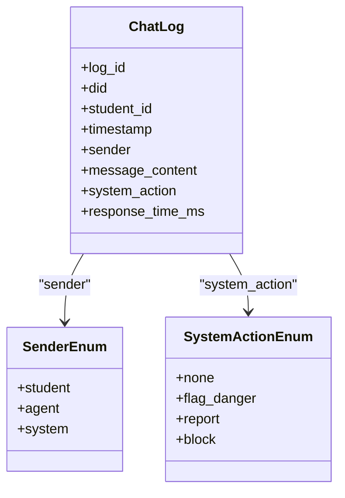
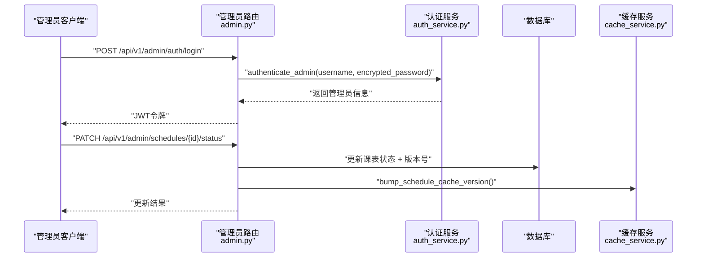
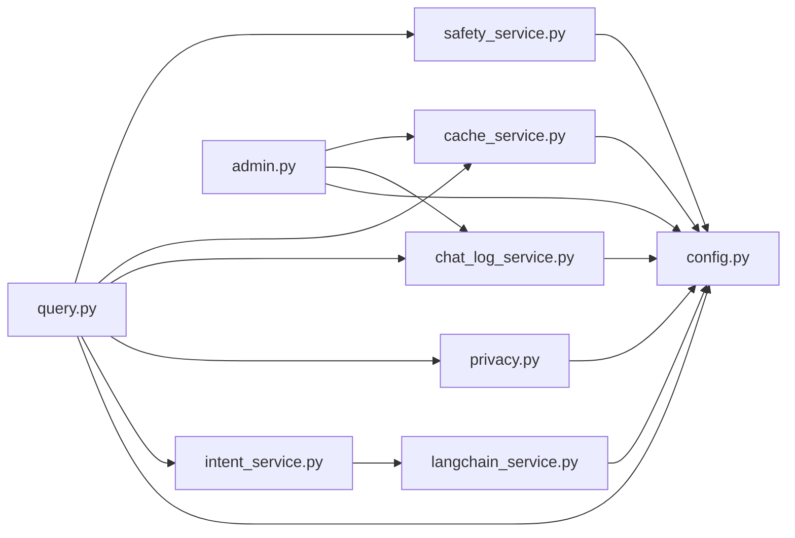

# 安全保护机制

<cite>
**本文档引用的文件**
- [safety_service.py](file://service/ai_assistant/app/services/safety_service.py)
- [privacy.py](file://service/ai_assistant/app/utils/privacy.py)
- [query.py](file://service/ai_assistant/app/routers/query.py)
- [chat_log_service.py](file://service/ai_assistant/app/services/chat_log_service.py)
- [cache_service.py](file://service/ai_assistant/app/services/cache_service.py)
- [models.py](file://service/ai_assistant/app/models/models.py)
- [config.py](file://service/ai_assistant/app/config.py)
- [dependencies.py](file://service/ai_assistant/app/dependencies.py)
- [logger.py](file://service/ai_assistant/app/utils/logger.py)
- [admin.py](file://service/ai_assistant/app/routers/admin.py)
- [langchain_service.py](file://service/ai_assistant/app/services/langchain_service.py)
- [crypto.py](file://service/ai_assistant/app/utils/crypto.py)
</cite>

## 目录
1. [引言](#引言)
2. [项目结构](#项目结构)
3. [核心组件](#核心组件)
4. [架构总览](#架构总览)
5. [详细组件分析](#详细组件分析)
6. [依赖分析](#依赖分析)
7. [性能考虑](#性能考虑)
8. [故障排查指南](#故障排查指南)
9. [结论](#结论)
10. [附录](#附录)

## 引言
本文件面向AI校园助手的安全保护机制，系统化阐述内容安全检查、隐私保护、危险内容检测、安全策略配置、威胁检测与应急响应、合规性与数据保护最佳实践。文档以代码为依据，结合流程图与序列图，帮助开发者与运维人员快速理解并落地安全能力。

## 项目结构
后端采用FastAPI + SQLAlchemy + Redis + DashScope LLM的分层架构。安全相关能力主要分布在以下模块：
- 路由层：统一入口负责鉴权、并发安全检查、隐私拦截、危险内容干预与缓存控制
- 服务层：意图分类、查询改写、LLM调用、缓存、日志、隐私脱敏
- 工具层：日志、加密、隐私DID生成
- 配置层：安全相关模型、密钥、缓存TTL、代理与输入长度限制
- 模型层：日志与审计字段枚举

图表来源
- [query.py:198-745](file://service/ai_assistant/app/routers/query.py#L198-L745)
- [safety_service.py:1-163](file://service/ai_assistant/app/services/safety_service.py#L1-L163)
- [cache_service.py:1-177](file://service/ai_assistant/app/services/cache_service.py#L1-L177)
- [chat_log_service.py:1-76](file://service/ai_assistant/app/services/chat_log_service.py#L1-L76)
- [privacy.py:1-23](file://service/ai_assistant/app/utils/privacy.py#L1-L23)
- [config.py:1-113](file://service/ai_assistant/app/config.py#L1-L113)
- [dependencies.py:1-109](file://service/ai_assistant/app/dependencies.py#L1-L109)
- [logger.py:1-53](file://service/ai_assistant/app/utils/logger.py#L1-L53)
- [admin.py:1-388](file://service/ai_assistant/app/routers/admin.py#L1-L388)
- [langchain_service.py:1-278](file://service/ai_assistant/app/services/langchain_service.py#L1-L278)
- [crypto.py:1-73](file://service/ai_assistant/app/utils/crypto.py#L1-L73)
- [models.py:625-660](file://service/ai_assistant/app/models/models.py#L625-L660)

章节来源
- [query.py:198-745](file://service/ai_assistant/app/routers/query.py#L198-L745)
- [config.py:1-113](file://service/ai_assistant/app/config.py#L1-L113)

## 核心组件
- 内容安全检查与危险内容检测：基于正则与LLM双重策略，识别自杀/自残/暴力倾向；对公共服务联系方式查询进行放行豁免
- 隐私保护：学号脱敏（DID）、仅在危险场景记录原始ID、缓存敏感查询TTL更短
- 缓存安全：敏感/日期敏感/课表敏感缓存版本控制与失效策略
- 审计与日志：统一日志落盘、危险标记、系统动作枚举
- 管理员安全：AES密码解密、JWT鉴权、操作审计
- LLM调用安全：输入长度裁剪、代理隔离、温度降噪

章节来源
- [safety_service.py:84-144](file://service/ai_assistant/app/services/safety_service.py#L84-L144)
- [privacy.py:9-22](file://service/ai_assistant/app/utils/privacy.py#L9-L22)
- [cache_service.py:55-177](file://service/ai_assistant/app/services/cache_service.py#L55-L177)
- [chat_log_service.py:14-55](file://service/ai_assistant/app/services/chat_log_service.py#L14-L55)
- [crypto.py:39-72](file://service/ai_assistant/app/utils/crypto.py#L39-L72)
- [langchain_service.py:139-278](file://service/ai_assistant/app/services/langchain_service.py#L139-L278)

## 架构总览
下图展示一次查询请求在安全链路中的关键节点与决策分支。

图表来源
- [query.py:347-470](file://service/ai_assistant/app/routers/query.py#L347-L470)
- [safety_service.py:84-144](file://service/ai_assistant/app/services/safety_service.py#L84-L144)
- [safety_service.py:147-162](file://service/ai_assistant/app/services/safety_service.py#L147-L162)
- [cache_service.py:92-177](file://service/ai_assistant/app/services/cache_service.py#L92-L177)
- [chat_log_service.py:14-55](file://service/ai_assistant/app/services/chat_log_service.py#L14-L55)
- [langchain_service.py:139-278](file://service/ai_assistant/app/services/langchain_service.py#L139-L278)

## 详细组件分析

### 内容安全检查与危险内容检测
- 危险意图关键词：涵盖自杀、自残、暴力伤害等高频词
- 公共服务联系方式查询豁免：当同时出现“联系方式/热线”与“校医院/心理中心/报警”等目标时，视为公共服务查询，绕过危机干预
- LLM综合判断：构造带上下文的Prompt，要求仅输出JSON，包含dangerous布尔值；若格式异常或调用失败，回退到正则匹配
- 日志与降级：记录LLM响应、回退原因与最终结果，确保安全优先

图表来源
- [safety_service.py:68-144](file://service/ai_assistant/app/services/safety_service.py#L68-L144)

章节来源
- [safety_service.py:14-28](file://service/ai_assistant/app/services/safety_service.py#L14-L28)
- [safety_service.py:84-144](file://service/ai_assistant/app/services/safety_service.py#L84-L144)

### 隐私保护机制
- DID脱敏：基于student_id与盐值生成固定长度哈希，替换真实学号存储于聊天日志
- 日志隐私策略：普通消息仅存DID；危险消息才存原始student_id，便于干预
- 隐私违规拦截：检测“学号/工号/ID”后跟随连续数字，若与当前用户ID不同则阻断并提示

图表来源
- [safety_service.py:147-162](file://service/ai_assistant/app/services/safety_service.py#L147-L162)
- [privacy.py:9-22](file://service/ai_assistant/app/utils/privacy.py#L9-L22)
- [chat_log_service.py:14-55](file://service/ai_assistant/app/services/chat_log_service.py#L14-L55)

章节来源
- [privacy.py:9-22](file://service/ai_assistant/app/utils/privacy.py#L9-L22)
- [chat_log_service.py:14-55](file://service/ai_assistant/app/services/chat_log_service.py#L14-L55)
- [safety_service.py:147-162](file://service/ai_assistant/app/services/safety_service.py#L147-L162)

### 缓存安全与敏感性控制
- 敏感关键词：成绩、分数、挂科、作弊、学籍、处分、奖学金、家庭、联系方式、手机、邮箱、生日、身份证
- 日期敏感：今天/明天/本周/学期等相对时间，按“日期桶”每日失效
- 课表敏感：管理员改课后递增版本号，旧缓存失效
- TTL策略：敏感查询30分钟，普通1天

图表来源
- [cache_service.py:21-83](file://service/ai_assistant/app/services/cache_service.py#L21-L83)
- [cache_service.py:92-177](file://service/ai_assistant/app/services/cache_service.py#L92-L177)

章节来源
- [cache_service.py:21-83](file://service/ai_assistant/app/services/cache_service.py#L21-L83)
- [cache_service.py:92-177](file://service/ai_assistant/app/services/cache_service.py#L92-L177)

### 审计与日志
- 统一日志：控制台与文件双通道，落盘至logs目录
- 日志字段：时间、级别、模块、函数、行号、消息
- 安全日志：危险检测、LLM调用、缓存命中/失效、Redis异常、错误回退
- 数据模型：ChatLog包含sender、system_action、response_time_ms等

图表来源
- [models.py:641-660](file://service/ai_assistant/app/models/models.py#L641-L660)

章节来源
- [logger.py:17-53](file://service/ai_assistant/app/utils/logger.py#L17-L53)
- [models.py:625-660](file://service/ai_assistant/app/models/models.py#L625-L660)

### 管理员安全与合规
- AES密码解密：前端使用CryptoJS加密密码，后端按IV与密钥解密
- JWT鉴权：学生与管理员分别验证，管理员状态校验
- 操作审计：管理员修改课表状态后递增缓存版本，记录AdminActionLog

图表来源
- [admin.py:57-82](file://service/ai_assistant/app/routers/admin.py#L57-L82)
- [admin.py:309-387](file://service/ai_assistant/app/routers/admin.py#L309-L387)
- [crypto.py:39-72](file://service/ai_assistant/app/utils/crypto.py#L39-L72)
- [dependencies.py:75-109](file://service/ai_assistant/app/dependencies.py#L75-L109)

章节来源
- [crypto.py:39-72](file://service/ai_assistant/app/utils/crypto.py#L39-L72)
- [dependencies.py:75-109](file://service/ai_assistant/app/dependencies.py#L75-L109)
- [admin.py:57-82](file://service/ai_assistant/app/routers/admin.py#L57-L82)
- [admin.py:309-387](file://service/ai_assistant/app/routers/admin.py#L309-L387)

### LLM调用安全与输入治理
- 输入裁剪：优先丢弃旧历史，再裁剪最后一条消息，保证总长度不超过阈值
- 代理隔离：可选择忽略环境代理，避免误路由
- 温度降噪：安全检测模型温度=0，提高稳定性
- 流式与非流式：统一封装，异常时返回统一错误信息

章节来源
- [langchain_service.py:20-96](file://service/ai_assistant/app/services/langchain_service.py#L20-L96)
- [langchain_service.py:99-108](file://service/ai_assistant/app/services/langchain_service.py#L99-L108)
- [langchain_service.py:139-203](file://service/ai_assistant/app/services/langchain_service.py#L139-L203)
- [langchain_service.py:206-278](file://service/ai_assistant/app/services/langchain_service.py#L206-L278)

## 依赖分析
- 组件耦合
  - 路由层对安全、缓存、日志、隐私、意图服务存在强依赖
  - 安全服务依赖配置与日志
  - 缓存服务依赖Redis与配置
  - 日志服务依赖模型与隐私工具
- 外部依赖
  - DashScope LLM、Redis、MySQL、JWT、Crypto库
- 循环依赖
  - 未发现循环导入；各模块职责清晰

图表来源
- [query.py:35-42](file://service/ai_assistant/app/routers/query.py#L35-L42)
- [safety_service.py:9-12](file://service/ai_assistant/app/services/safety_service.py#L9-L12)
- [cache_service.py:18](file://service/ai_assistant/app/services/cache_service.py#L18)
- [chat_log_service.py:9-11](file://service/ai_assistant/app/services/chat_log_service.py#L9-L11)
- [privacy.py:6](file://service/ai_assistant/app/utils/privacy.py#L6)
- [langchain_service.py:16-17](file://service/ai_assistant/app/services/langchain_service.py#L16-L17)
- [admin.py:45](file://service/ai_assistant/app/routers/admin.py#L45)

章节来源
- [query.py:35-42](file://service/ai_assistant/app/routers/query.py#L35-L42)
- [admin.py:45](file://service/ai_assistant/app/routers/admin.py#L45)

## 性能考虑
- 并发优化：危险检查与查询重写并行执行，缩短端到端延迟
- 缓存命中：敏感查询TTL较短，避免隐私数据长期驻留；普通查询TTL较长，提升响应速度
- 输入裁剪：在LLM调用前进行消息裁剪，避免超长输入导致失败与资源浪费
- 流式输出：SSE流式生成，尽早释放数据库连接，降低长会话压力

章节来源
- [query.py:347-352](file://service/ai_assistant/app/routers/query.py#L347-L352)
- [cache_service.py:85-89](file://service/ai_assistant/app/services/cache_service.py#L85-L89)
- [langchain_service.py:20-96](file://service/ai_assistant/app/services/langchain_service.py#L20-L96)
- [query.py:659-744](file://service/ai_assistant/app/routers/query.py#L659-L744)

## 故障排查指南
- LLM调用失败
  - 现象：安全检查回退到正则，记录警告日志
  - 处理：检查API密钥、模型名称、网络连通性
- 缓存异常
  - 现象：Redis不可用时降级，记录异常并继续服务
  - 处理：检查Redis连接、容量与TTL配置
- 隐私违规拦截
  - 现象：提示“仅可查询本人数据”
  - 处理：确认用户意图与关键词匹配规则
- 审计与日志
  - 现象：日志未落盘或格式异常
  - 处理：确认日志初始化与文件权限

章节来源
- [safety_service.py:134-144](file://service/ai_assistant/app/services/safety_service.py#L134-L144)
- [query.py:280-286](file://service/ai_assistant/app/routers/query.py#L280-L286)
- [logger.py:17-53](file://service/ai_assistant/app/utils/logger.py#L17-L53)

## 结论
本项目通过“LLM+正则”的双重危险检测、“DID脱敏+最小化记录”的隐私策略、以及“敏感/日期/课表”多维缓存治理，构建了面向校园场景的闭环安全体系。配合严格的管理员认证与审计、统一日志落盘与错误收敛，确保系统在可用性与安全性之间取得平衡。

## 附录

### 安全策略配置清单
- 模型配置：安全检测模型、意图分类模型、最终回答模型等
- 缓存TTL：敏感/普通缓存过期时间
- 输入长度：DashScope最大输入字符数
- 代理设置：是否信任环境代理
- AES密钥：密码传输加密密钥
- JWT配置：密钥、算法、过期时间

章节来源
- [config.py:48-110](file://service/ai_assistant/app/config.py#L48-L110)

### 威胁检测与应急响应
- 威胁检测
  - 关键词匹配 + LLM语义判断
  - 公共服务查询豁免
  - 危险标记与干预提示
- 应急响应
  - LLM失败回退正则
  - Redis异常降级
  - 日志记录与告警
  - 管理员课表变更后缓存版本递增

章节来源
- [safety_service.py:84-144](file://service/ai_assistant/app/services/safety_service.py#L84-L144)
- [admin.py:370-387](file://service/ai_assistant/app/routers/admin.py#L370-L387)

### 合规性与数据保护最佳实践
- 数据最小化：仅在危险场景记录原始student_id
- 用户同意与透明：隐私提示与拦截说明
- 数据保留期限：敏感数据TTL更短
- 审计追踪：管理员操作日志与系统动作标记
- 加密传输：前端AES加密、后端解密

章节来源
- [chat_log_service.py:26-34](file://service/ai_assistant/app/services/chat_log_service.py#L26-L34)
- [crypto.py:39-72](file://service/ai_assistant/app/utils/crypto.py#L39-L72)
- [models.py:634-639](file://service/ai_assistant/app/models/models.py#L634-L639)