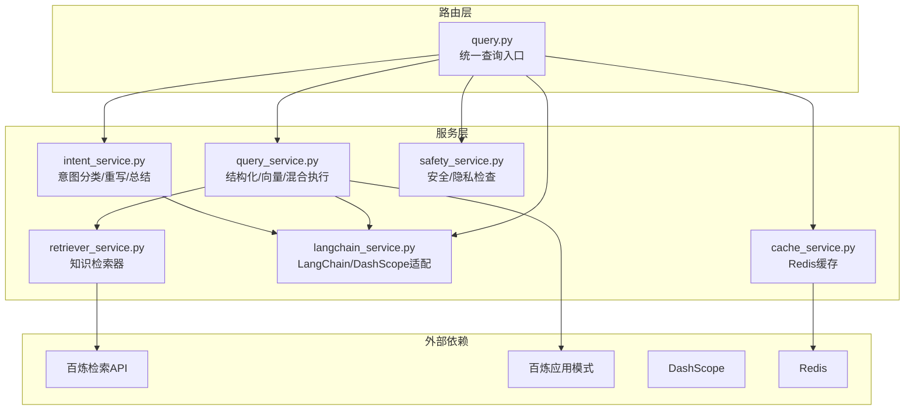
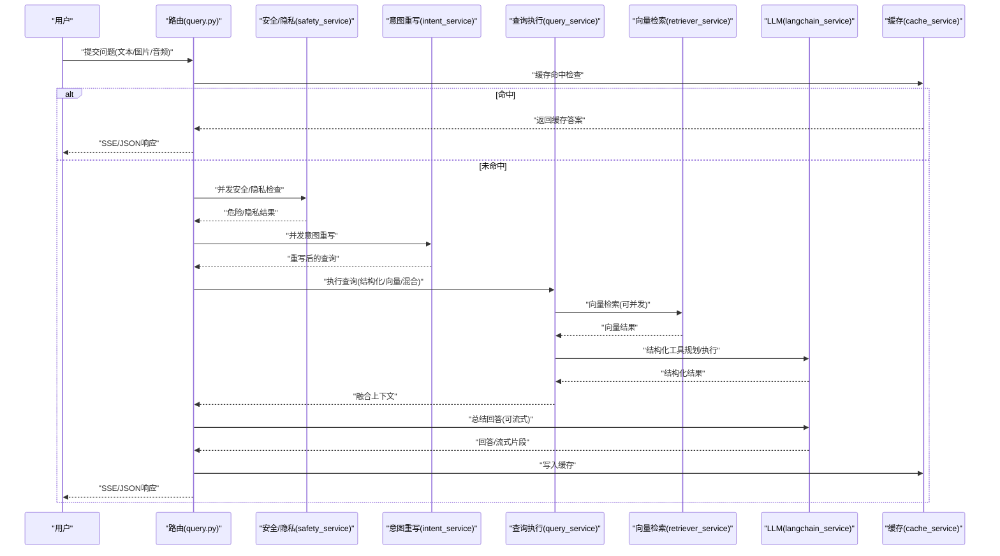
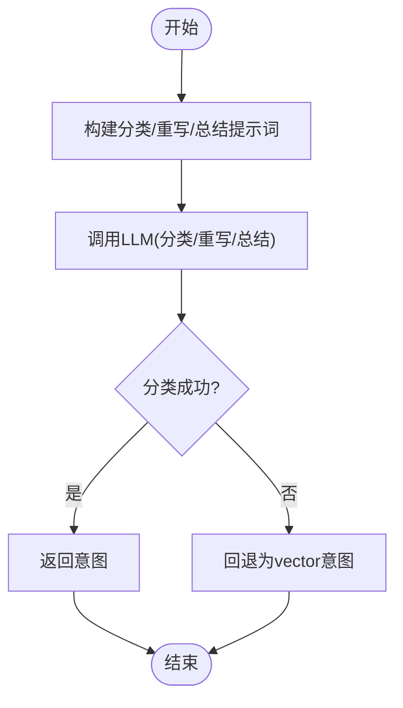
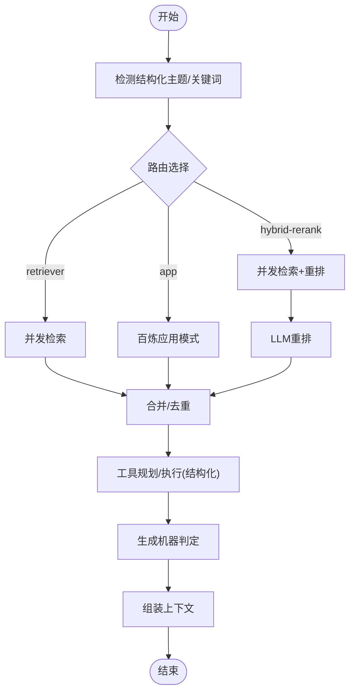
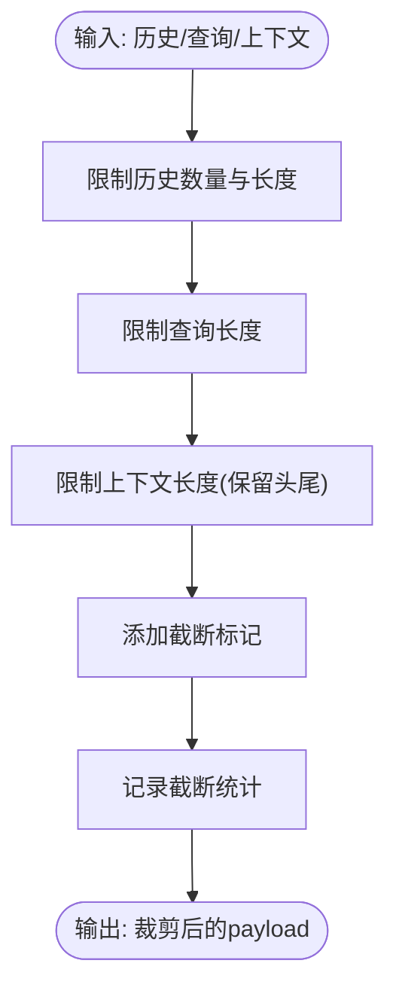
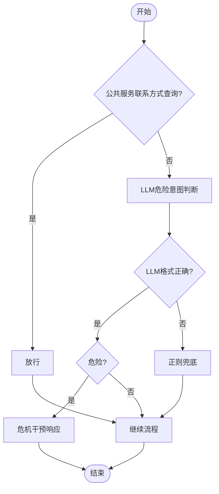
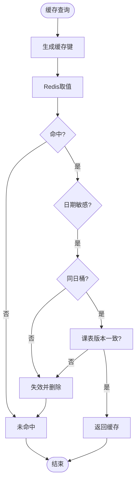
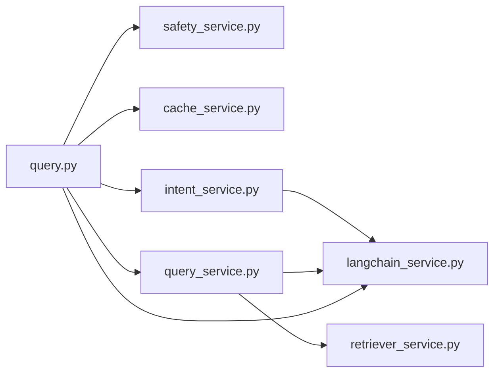

# 智能查询处理

<cite>
**本文档引用的文件**
- [intent_service.py](file://service/ai_assistant/app/services/intent_service.py)
- [query_service.py](file://service/ai_assistant/app/services/query_service.py)
- [retriever_service.py](file://service/ai_assistant/app/services/retriever_service.py)
- [langchain_service.py](file://service/ai_assistant/app/services/langchain_service.py)
- [query.py](file://service/ai_assistant/app/routers/query.py)
- [query.py（schema）](file://service/ai_assistant/app/schemas/query.py)
- [config.py](file://service/ai_assistant/app/config.py)
- [cache_service.py](file://service/ai_assistant/app/services/cache_service.py)
- [safety_service.py](file://service/ai_assistant/app/services/safety_service.py)
- [logger.py](file://service/ai_assistant/app/utils/logger.py)
</cite>

## 目录
1. [简介](#简介)
2. [项目结构](#项目结构)
3. [核心组件](#核心组件)
4. [架构总览](#架构总览)
5. [详细组件分析](#详细组件分析)
6. [依赖关系分析](#依赖关系分析)
7. [性能考量](#性能考量)
8. [故障排查指南](#故障排查指南)
9. [结论](#结论)
10. [附录](#附录)

## 简介
本文件面向AI校园助手的“智能查询处理”能力，系统性阐述查询意图分类、查询重写、上下文构建与融合、结构化/向量/混合检索、以及最终回答生成的完整链路。重点包括：
- 意图分类服务如何使用大语言模型识别 smalltalk、structured、vector、hybrid 等意图，并在异常时进行稳健回退。
- 查询重写机制如何结合历史对话与上下文信息，提升检索与结构化查询的准确性。
- 查询执行层如何并发执行安全检查、意图重写、结构化工具规划与向量检索，并在执行后动态修正意图。
- 上下文构建与总结阶段如何进行内容截断、字段美化、周次与停课等业务规则约束，保障回答一致性与合规性。

## 项目结构
围绕“查询处理”的核心模块分布如下：
- 路由层：统一入口负责多模态输入解码、缓存命中、并发安全检查与意图重写、调用查询执行与回答生成、持久化会话与缓存。
- 服务层：
  - 意图分类与回答生成：LangChain链式调用，封装分类、重写、总结与流式输出。
  - 查询执行：结构化工具规划与执行、向量检索（百炼检索API与百炼应用模式）、混合重排。
  - 知识检索：百炼检索器包装，支持并发检索与重排。
  - 安全与缓存：危险内容检测、隐私检查、缓存键与TTL策略。
  - LangChain适配：消息裁剪、DashScope调用与流式输出。
- 配置与Schema：模型与外部服务参数、意图枚举、请求/响应结构。

图表来源
- [query.py:198-745](file://service/ai_assistant/app/routers/query.py#L198-L745)
- [intent_service.py:218-346](file://service/ai_assistant/app/services/intent_service.py#L218-L346)
- [query_service.py:1807-1913](file://service/ai_assistant/app/services/query_service.py#L1807-L1913)
- [retriever_service.py:23-168](file://service/ai_assistant/app/services/retriever_service.py#L23-L168)
- [langchain_service.py:139-278](file://service/ai_assistant/app/services/langchain_service.py#L139-L278)
- [cache_service.py:92-177](file://service/ai_assistant/app/services/cache_service.py#L92-L177)
- [safety_service.py:84-163](file://service/ai_assistant/app/services/safety_service.py#L84-L163)

章节来源
- [query.py:1-788](file://service/ai_assistant/app/routers/query.py#L1-L788)
- [config.py:1-113](file://service/ai_assistant/app/config.py#L1-L113)

## 核心组件
- 意图分类与重写
  - 分类：基于系统提示词与LLM，输出 smalltalk/structured/vector/hybrid 四类之一。
  - 重写：结合最近3轮历史，将用户最新问题补全为独立、完整的查询。
  - 总结：根据上下文与历史，生成自然、合规的回答。
- 查询执行
  - 结构化：基于工具规划与SQL查询，返回结构化上下文。
  - 向量：并发检索百炼检索与百炼应用，或混合重排。
  - 混合：融合结构化与向量结果，动态修正意图。
- 上下文构建与截断
  - 历史与查询、结构化与向量内容分别截断，避免输入超限。
  - 字段名与学期ID美化，周次与停课等业务规则约束。
- 安全与缓存
  - 安全检查：自杀/暴力倾向与公共服务查询豁免。
  - 缓存：按敏感度与日期/课表版本控制TTL与失效策略。

章节来源
- [intent_service.py:218-346](file://service/ai_assistant/app/services/intent_service.py#L218-L346)
- [query_service.py:1807-1913](file://service/ai_assistant/app/services/query_service.py#L1807-L1913)
- [retriever_service.py:23-168](file://service/ai_assistant/app/services/retriever_service.py#L23-L168)
- [cache_service.py:92-177](file://service/ai_assistant/app/services/cache_service.py#L92-L177)
- [safety_service.py:84-163](file://service/ai_assistant/app/services/safety_service.py#L84-L163)

## 架构总览
整体处理流程如下：

图表来源
- [query.py:207-745](file://service/ai_assistant/app/routers/query.py#L207-L745)
- [intent_service.py:251-296](file://service/ai_assistant/app/services/intent_service.py#L251-L296)
- [query_service.py:1807-1913](file://service/ai_assistant/app/services/query_service.py#L1807-L1913)
- [retriever_service.py:46-135](file://service/ai_assistant/app/services/retriever_service.py#L46-L135)
- [langchain_service.py:139-278](file://service/ai_assistant/app/services/langchain_service.py#L139-L278)
- [cache_service.py:149-177](file://service/ai_assistant/app/services/cache_service.py#L149-L177)

## 详细组件分析

### 意图分类与重写
- 意图分类
  - 使用系统提示词限定输出集合，温度=0，最大token受限，确保稳定输出。
  - 若LLM调用异常，回退为 vector 意图并记录警告。
- 查询重写
  - 限制最近3轮历史，结合MessagesPlaceholder进行指代消解。
  - 输出长度上限截断，异常时回退为原查询。
- 上下文总结
  - 构建总结提示词，包含当前日期、回答规范与历史/上下文截断策略。
  - 支持同步与流式两种回答生成。

图表来源
- [intent_service.py:218-248](file://service/ai_assistant/app/services/intent_service.py#L218-L248)
- [intent_service.py:251-296](file://service/ai_assistant/app/services/intent_service.py#L251-L296)
- [intent_service.py:298-346](file://service/ai_assistant/app/services/intent_service.py#L298-L346)

章节来源
- [intent_service.py:218-346](file://service/ai_assistant/app/services/intent_service.py#L218-L346)

### 查询执行：结构化/向量/混合
- 结构化工具规划
  - 基于问题主题与关键词检测首选工具，支持多意图联合查询。
  - LLM规划失败时，采用规则兜底生成工具调用序列。
  - 执行后对结果进行字段名与学期ID美化，并生成“机器判定”约束。
- 向量检索
  - 路由选择：仅检索器、仅应用模式、或混合重排。
  - 查询分解：将问题拆分为1-3个关键词短语，提高召回。
  - 并发检索：对每个片段并发检索，合并去重后返回。
  - 混合重排：当两侧均有结果时，使用LLM对两者进行去重与重排。
- 混合意图修正
  - 执行完成后根据上下文是否包含结构化/向量内容，动态修正意图。

图表来源
- [query_service.py:1034-1067](file://service/ai_assistant/app/services/query_service.py#L1034-L1067)
- [query_service.py:894-917](file://service/ai_assistant/app/services/query_service.py#L894-L917)
- [query_service.py:934-1031](file://service/ai_assistant/app/services/query_service.py#L934-L1031)
- [query_service.py:1638-1744](file://service/ai_assistant/app/services/query_service.py#L1638-L1744)
- [query_service.py:1807-1913](file://service/ai_assistant/app/services/query_service.py#L1807-L1913)

章节来源
- [query_service.py:894-1031](file://service/ai_assistant/app/services/query_service.py#L894-L1031)
- [query_service.py:1034-1067](file://service/ai_assistant/app/services/query_service.py#L1034-L1067)
- [query_service.py:1638-1744](file://service/ai_assistant/app/services/query_service.py#L1638-L1744)
- [query_service.py:1807-1913](file://service/ai_assistant/app/services/query_service.py#L1807-L1913)

### 上下文构建与截断策略
- 历史与查询截断
  - 历史消息与查询分别设置最大长度，采用尾部截断策略，必要时中部截断保留关键信息。
- 结构化上下文截断
  - 保留头尾，避免关键字段丢失。
- 截断标记与告警
  - 截断时添加标记并在日志中记录统计信息，便于监控与优化。

图表来源
- [intent_service.py:163-209](file://service/ai_assistant/app/services/intent_service.py#L163-L209)
- [intent_service.py:116-161](file://service/ai_assistant/app/services/intent_service.py#L116-L161)

章节来源
- [intent_service.py:104-209](file://service/ai_assistant/app/services/intent_service.py#L104-L209)

### 安全与隐私检查
- 危险内容检测
  - LLM判断是否存在自杀/自残或暴力倾向；公共服务联系方式查询豁免。
  - LLM格式异常时回退正则匹配，确保安全基线。
- 隐私检查
  - 检测是否试图查询他人学号，若发现则阻断并提示合规边界。

图表来源
- [safety_service.py:84-144](file://service/ai_assistant/app/services/safety_service.py#L84-L144)
- [query.py:350-471](file://service/ai_assistant/app/routers/query.py#L350-L471)

章节来源
- [safety_service.py:84-163](file://service/ai_assistant/app/services/safety_service.py#L84-L163)
- [query.py:350-471](file://service/ai_assistant/app/routers/query.py#L350-L471)

### 缓存与会话历史
- 缓存键
  - 格式：chat_cache:{version}:{did}:{md5(查询文本)}，版本号随查询/总结逻辑升级而提升。
- TTL策略
  - 敏感/隐私查询：30分钟；普通查询：1天。
  - 日期敏感与课表敏感查询按日期桶与版本号失效，避免过期语义与管理员调整影响。
- 会话历史
  - Redis按会话隔离存储最近N轮消息，支持SSE流式输出与总结阶段的历史截断。

图表来源
- [cache_service.py:92-177](file://service/ai_assistant/app/services/cache_service.py#L92-L177)
- [query.py:153-196](file://service/ai_assistant/app/routers/query.py#L153-L196)

章节来源
- [cache_service.py:92-177](file://service/ai_assistant/app/services/cache_service.py#L92-L177)
- [query.py:153-196](file://service/ai_assistant/app/routers/query.py#L153-L196)

## 依赖关系分析
- 组件耦合
  - 路由层依赖安全、缓存、意图重写、查询执行与LLM适配。
  - 查询执行层依赖结构化工具、向量检索与LLM适配。
  - 意图重写与总结依赖LangChain与LLM适配。
- 外部依赖
  - 百炼检索API、百炼应用模式、DashScope、Redis。
- 循环依赖
  - 未见循环依赖，模块职责清晰。

图表来源
- [query.py:35-44](file://service/ai_assistant/app/routers/query.py#L35-L44)
- [query_service.py:46-47](file://service/ai_assistant/app/services/query_service.py#L46-L47)
- [intent_service.py:20-21](file://service/ai_assistant/app/services/intent_service.py#L20-L21)
- [retriever_service.py:16-17](file://service/ai_assistant/app/services/retriever_service.py#L16-L17)
- [langchain_service.py:16-17](file://service/ai_assistant/app/services/langchain_service.py#L16-L17)

章节来源
- [query.py:35-44](file://service/ai_assistant/app/routers/query.py#L35-L44)
- [query_service.py:46-47](file://service/ai_assistant/app/services/query_service.py#L46-L47)
- [intent_service.py:20-21](file://service/ai_assistant/app/services/intent_service.py#L20-L21)
- [retriever_service.py:16-17](file://service/ai_assistant/app/services/retriever_service.py#L16-L17)
- [langchain_service.py:16-17](file://service/ai_assistant/app/services/langchain_service.py#L16-L17)

## 性能考量
- 并发优化
  - 路由层并发执行安全检查与查询重写，缩短端到端延迟。
  - 向量检索对关键词片段并发执行，提升召回效率。
- 输入裁剪
  - LangChain适配器按总字符数裁剪消息，优先丢弃旧历史与最后一条消息，避免超限。
- 模型参数
  - 分类与重写使用低温度与较小max_tokens，保证稳定性与可控输出长度。
- 缓存策略
  - 敏感/日期/课表相关查询采用更短TTL或版本控制，平衡性能与正确性。
- 日志与监控
  - 关键路径记录截断统计、路由耗时与异常，便于定位瓶颈。

章节来源
- [query.py:347-353](file://service/ai_assistant/app/routers/query.py#L347-L353)
- [query_service.py:934-954](file://service/ai_assistant/app/services/query_service.py#L934-L954)
- [langchain_service.py:46-97](file://service/ai_assistant/app/services/langchain_service.py#L46-L97)
- [config.py:54-73](file://service/ai_assistant/app/config.py#L54-L73)
- [cache_service.py:85-90](file://service/ai_assistant/app/services/cache_service.py#L85-L90)

## 故障排查指南
- 意图分类失败
  - 现象：分类异常或输出不确定，回退为vector。
  - 排查：查看LLM调用日志与异常栈，确认模型参数与提示词格式。
  - 参考
    - [intent_service.py:233-248](file://service/ai_assistant/app/services/intent_service.py#L233-L248)
- 查询重写失败
  - 现象：重写异常，回退为原查询。
  - 排查：检查历史消息长度与截断策略，确认模型输入字符限制。
  - 参考
    - [intent_service.py:289-295](file://service/ai_assistant/app/services/intent_service.py#L289-L295)
- 向量检索异常
  - 现象：检索API错误或异常，返回“未找到相关信息”。
  - 排查：检查百炼工作区/索引配置、鉴权信息与网络连通性。
  - 参考
    - [retriever_service.py:132-135](file://service/ai_assistant/app/services/retriever_service.py#L132-L135)
- 结构化工具执行失败
  - 现象：工具调用异常或规划JSON解析失败，回退规则工具。
  - 排查：确认数据库连接、学期ID有效性与工具参数。
  - 参考
    - [query_service.py:1673-1682](file://service/ai_assistant/app/services/query_service.py#L1673-L1682)
    - [query_service.py:1722-1727](file://service/ai_assistant/app/services/query_service.py#L1722-L1727)
- 安全/隐私拦截
  - 现象：检测到危险或隐私违规，返回干预或提示。
  - 排查：核对关键词匹配与豁免规则。
  - 参考
    - [safety_service.py:147-163](file://service/ai_assistant/app/services/safety_service.py#L147-L163)
    - [query.py:355-414](file://service/ai_assistant/app/routers/query.py#L355-L414)
- 缓存命中异常
  - 现象：缓存解析失败或过期策略异常。
  - 排查：检查缓存键格式、meta字段与日期桶/版本号。
  - 参考
    - [cache_service.py:102-146](file://service/ai_assistant/app/services/cache_service.py#L102-L146)

章节来源
- [intent_service.py:233-295](file://service/ai_assistant/app/services/intent_service.py#L233-L295)
- [retriever_service.py:132-135](file://service/ai_assistant/app/services/retriever_service.py#L132-L135)
- [query_service.py:1673-1727](file://service/ai_assistant/app/services/query_service.py#L1673-L1727)
- [safety_service.py:147-163](file://service/ai_assistant/app/services/safety_service.py#L147-L163)
- [cache_service.py:102-146](file://service/ai_assistant/app/services/cache_service.py#L102-L146)

## 结论
本系统通过“意图分类-查询重写-结构化/向量/混合检索-上下文总结”的流水线，实现了对校园查询的智能化处理。LangChain与DashScope的结合提供了稳定的提示渲染与调用能力；并发与裁剪策略保障了性能；安全与缓存机制提升了可靠性与用户体验。建议在生产环境中持续监控截断统计、路由耗时与缓存命中率，以进一步优化参数与策略。

## 附录
- 模型与参数配置
  - 意图分类：qwen-turbo，温度=0，max_tokens≤10
  - 查询重写：qwen-turbo，温度=0
  - 最终回答：qwen-plus，温度=0.2，max_tokens=4096
  - 工具规划：qwen-plus，温度=0，max_tokens=1024
  - 向量分解：qwen-turbo，温度=0，max_tokens=128
  - 混合重排：qwen-turbo，温度=0，max_tokens=2048
  - 安全检测：qwen-turbo，温度=0
  - 图像理解：qwen-vl-plus
  - 语音识别：paraformer-realtime-v1
  - 参考
    - [config.py:54-73](file://service/ai_assistant/app/config.py#L54-L73)

章节来源
- [config.py:54-73](file://service/ai_assistant/app/config.py#L54-L73)