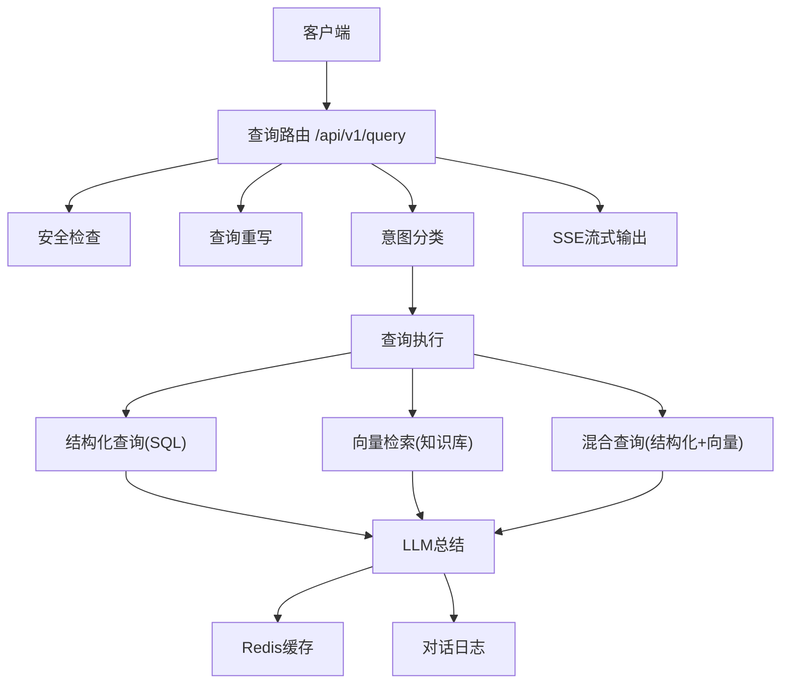
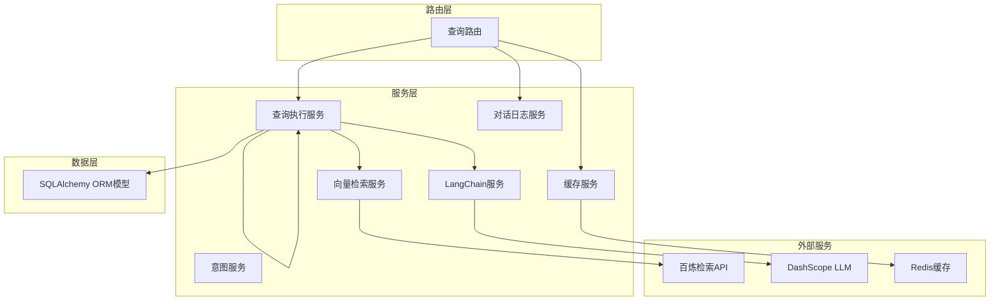
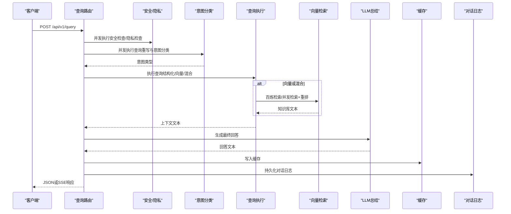
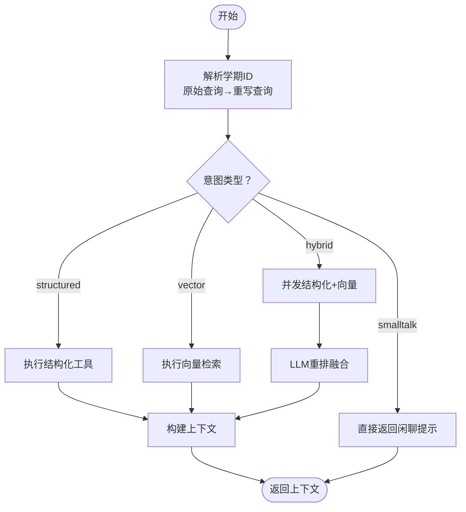
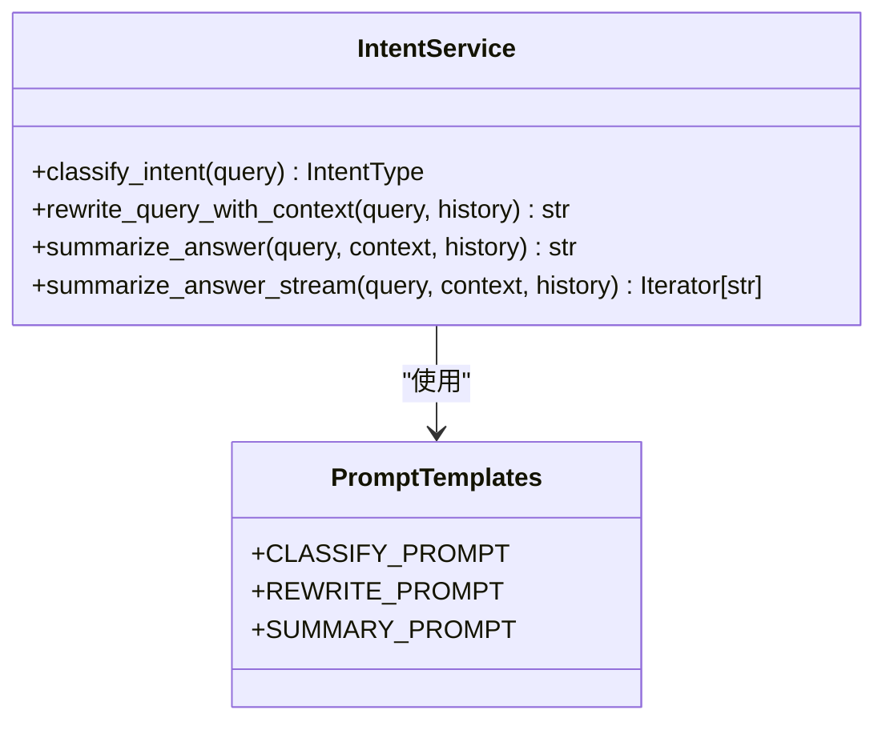
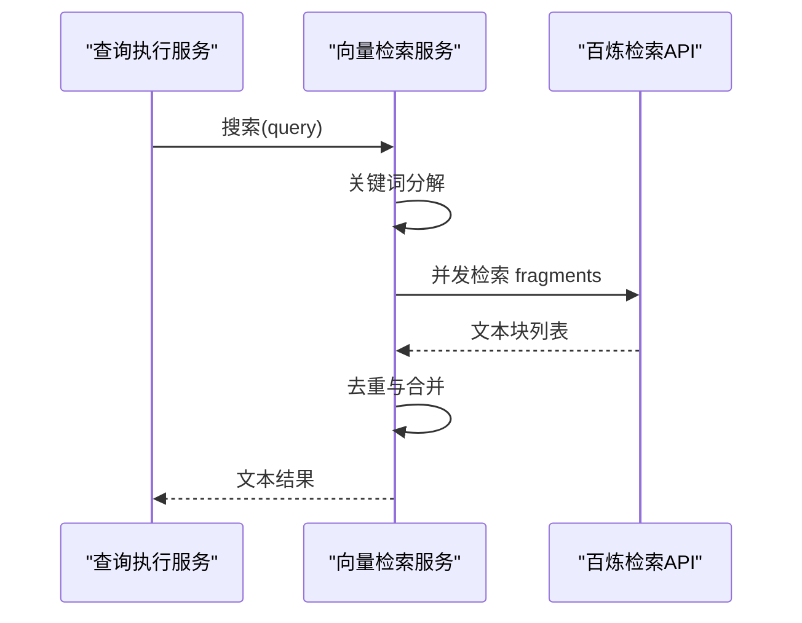
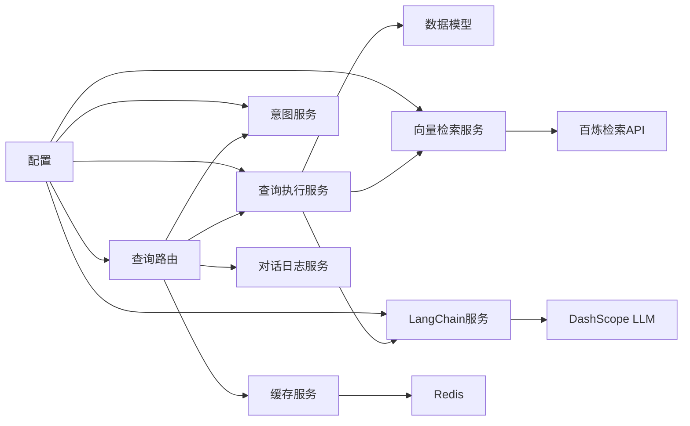

# 查询执行系统

<cite>
**本文档引用的文件**
- [query_service.py](file://service/ai_assistant/app/services/query_service.py)
- [query.py](file://service/ai_assistant/app/routers/query.py)
- [intent_service.py](file://service/ai_assistant/app/services/intent_service.py)
- [retriever_service.py](file://service/ai_assistant/app/services/retriever_service.py)
- [langchain_service.py](file://service/ai_assistant/app/services/langchain_service.py)
- [cache_service.py](file://service/ai_assistant/app/services/cache_service.py)
- [models.py](file://service/ai_assistant/app/models/models.py)
- [config.py](file://service/ai_assistant/app/config.py)
- [chat_log_service.py](file://service/ai_assistant/app/services/chat_log_service.py)
- [main.py](file://service/ai_assistant/app/main.py)
- [query.py](file://service/ai_assistant/app/schemas/query.py)
</cite>

## 目录
1. [简介](#简介)
2. [项目结构](#项目结构)
3. [核心组件](#核心组件)
4. [架构总览](#架构总览)
5. [详细组件分析](#详细组件分析)
6. [依赖关系分析](#依赖关系分析)
7. [性能考虑](#性能考虑)
8. [故障排除指南](#故障排除指南)
9. [结论](#结论)

## 简介
本系统为AI校园助手的查询执行引擎，提供统一的多模态查询入口，支持结构化查询（SQL）、向量检索（知识库）与混合查询（结构化+向量）三种执行路径。系统通过意图分类决定查询策略，结合缓存、安全检查、隐私保护与LLM总结，为用户提供准确、自然的校园信息服务。

## 项目结构
后端采用FastAPI框架，查询执行相关代码主要位于服务层与路由层：
- 路由层：统一入口 `/api/v1/query`，负责多模态输入预处理、缓存、意图分类、并发执行与流式输出。
- 服务层：查询执行核心（query_service）、意图分类（intent_service）、向量检索（retriever_service）、LangChain适配（langchain_service）、缓存（cache_service）、对话日志（chat_log_service）。
- 模型层：定义数据库ORM模型（学生、课程、成绩、课表等）。
- 配置层：集中管理LLM模型、缓存TTL、百炼检索API等配置。

**图表来源**
- [query.py:198-745](file://service/ai_assistant/app/routers/query.py#L198-L745)
- [query_service.py:1807-1913](file://service/ai_assistant/app/services/query_service.py#L1807-L1913)
- [intent_service.py:218-346](file://service/ai_assistant/app/services/intent_service.py#L218-L346)
- [retriever_service.py:23-168](file://service/ai_assistant/app/services/retriever_service.py#L23-L168)
- [cache_service.py:92-177](file://service/ai_assistant/app/services/cache_service.py#L92-L177)
- [chat_log_service.py:14-76](file://service/ai_assistant/app/services/chat_log_service.py#L14-L76)

**章节来源**
- [main.py:52-86](file://service/ai_assistant/app/main.py#L52-L86)
- [query.py:1-788](file://service/ai_assistant/app/routers/query.py#L1-L788)

## 核心组件
- 查询路由：统一入口，处理多模态输入、缓存、意图分类、并发执行、流式输出与错误恢复。
- 查询服务：根据意图选择执行路径，协调结构化查询、向量检索与混合查询，生成上下文供LLM总结。
- 意图服务：负责意图分类、查询重写与最终回答生成。
- 向量检索服务：封装阿里云百炼检索API，支持并发检索与重排。
- LangChain服务：适配DashScope，提供提示渲染、调用与流式处理。
- 缓存服务：基于Redis的查询缓存，支持敏感性与时间维度的TTL控制。
- 对话日志服务：持久化对话记录，支持隐私脱敏与危险内容标记。
- 数据模型：定义学生、课程、成绩、课表等核心实体与关系。

**章节来源**
- [query_service.py:1-1913](file://service/ai_assistant/app/services/query_service.py#L1-L1913)
- [intent_service.py:1-346](file://service/ai_assistant/app/services/intent_service.py#L1-L346)
- [retriever_service.py:1-168](file://service/ai_assistant/app/services/retriever_service.py#L1-L168)
- [langchain_service.py:1-278](file://service/ai_assistant/app/services/langchain_service.py#L1-L278)
- [cache_service.py:1-177](file://service/ai_assistant/app/services/cache_service.py#L1-L177)
- [chat_log_service.py:1-76](file://service/ai_assistant/app/services/chat_log_service.py#L1-L76)
- [models.py:1-660](file://service/ai_assistant/app/models/models.py#L1-L660)
- [config.py:1-113](file://service/ai_assistant/app/config.py#L1-L113)

## 架构总览
系统采用“路由-服务-模型-外部服务”的分层架构：
- 路由层负责输入预处理与并发控制。
- 服务层实现业务逻辑与策略选择。
- 模型层提供数据访问抽象。
- 外部服务包括百炼检索API、DashScope LLM与Redis缓存。

**图表来源**
- [query.py:198-745](file://service/ai_assistant/app/routers/query.py#L198-L745)
- [query_service.py:1807-1913](file://service/ai_assistant/app/services/query_service.py#L1807-L1913)
- [intent_service.py:218-346](file://service/ai_assistant/app/services/intent_service.py#L218-L346)
- [retriever_service.py:23-168](file://service/ai_assistant/app/services/retriever_service.py#L23-L168)
- [langchain_service.py:139-278](file://service/ai_assistant/app/services/langchain_service.py#L139-L278)
- [cache_service.py:92-177](file://service/ai_assistant/app/services/cache_service.py#L92-L177)
- [models.py:303-480](file://service/ai_assistant/app/models/models.py#L303-L480)

## 详细组件分析

### 查询路由（统一入口）
- 多模态输入处理：支持文本、Base64图像与音频，图像与音频通过媒体服务转为文本后合并。
- 缓存查找：基于DID与查询哈希命中Redis缓存，命中则直接返回或流式输出。
- 并发执行：安全检查、隐私检查与查询重写并行，缩短总延迟。
- 意图分类：基于重写后的查询进行意图分类（structured/vector/hybrid/smalltalk）。
- 图片纯问答：对特定图片问答场景跳过检索，直接基于图片描述回答。
- 查询执行：根据意图调用查询执行服务，支持结构化、向量或混合路径。
- LLM总结：将上下文与历史传入LLM生成最终回答，支持JSON与SSE两种输出。
- 缓存与日志：将最终回答写入缓存并持久化对话日志。

**图表来源**
- [query.py:207-745](file://service/ai_assistant/app/routers/query.py#L207-L745)
- [query_service.py:1807-1913](file://service/ai_assistant/app/services/query_service.py#L1807-L1913)
- [intent_service.py:218-346](file://service/ai_assistant/app/services/intent_service.py#L218-L346)
- [retriever_service.py:46-135](file://service/ai_assistant/app/services/retriever_service.py#L46-L135)
- [cache_service.py:149-177](file://service/ai_assistant/app/services/cache_service.py#L149-L177)
- [chat_log_service.py:14-56](file://service/ai_assistant/app/services/chat_log_service.py#L14-L56)

**章节来源**
- [query.py:198-745](file://service/ai_assistant/app/routers/query.py#L198-L745)

### 查询执行服务（策略选择与执行）
- 学期解析：优先从原始查询解析相对学期（上/下/本学期），其次显式学期ID，最后从重写查询解析。
- 意图修正：根据查询主题与实际执行结果动态修正意图（vector→structured/hybrid）。
- 结构化查询：基于工具规划器（工具名称与参数）执行SQL查询，支持多意图联合查询与学期参数补齐。
- 向量检索：支持retriever/app/hybrid-rerank三种路由，自动选择最优路径。
- 混合查询：并发获取结构化与向量结果，经LLM重排融合。
- 上下文构建：将结构化结果与向量文本组合，生成最终上下文供LLM总结。

**图表来源**
- [query_service.py:1807-1913](file://service/ai_assistant/app/services/query_service.py#L1807-L1913)
- [query_service.py:1034-1068](file://service/ai_assistant/app/services/query_service.py#L1034-L1068)
- [query_service.py:1075-1251](file://service/ai_assistant/app/services/query_service.py#L1075-L1251)

**章节来源**
- [query_service.py:1807-1913](file://service/ai_assistant/app/services/query_service.py#L1807-L1913)

### 意图分类与回答生成
- 意图分类：将用户查询分为structured、vector、hybrid、smalltalk四类，基于规则与LLM综合判断。
- 查询重写：结合最近历史，将问题重写为独立、完整的查询，补充缺失信息。
- 回答生成：构建总结提示，裁剪历史与上下文长度，避免超出LLM输入限制，支持流式与非流式输出。

**图表来源**
- [intent_service.py:218-346](file://service/ai_assistant/app/services/intent_service.py#L218-L346)

**章节来源**
- [intent_service.py:1-346](file://service/ai_assistant/app/services/intent_service.py#L1-L346)

### 向量检索服务（百炼检索API）
- 并发检索：对查询进行关键词分解，对每个片段并发检索，去重合并。
- 路由选择：根据配置自动选择retriever、app或hybrid-rerank路径。
- 重排融合：当两侧均有结果时，使用LLM对向量与应用结果进行重排融合。
- 错误降级：API异常或无命中时返回固定提示，避免影响主流程。

**图表来源**
- [retriever_service.py:46-135](file://service/ai_assistant/app/services/retriever_service.py#L46-L135)
- [query_service.py:1034-1068](file://service/ai_assistant/app/services/query_service.py#L1034-L1068)

**章节来源**
- [retriever_service.py:1-168](file://service/ai_assistant/app/services/retriever_service.py#L1-L168)
- [query_service.py:1034-1068](file://service/ai_assistant/app/services/query_service.py#L1034-L1068)

### LangChain服务（DashScope适配）
- 提示渲染：将ChatPromptTemplate渲染为DashScope消息格式。
- 输入裁剪：按最大字符限制裁剪消息，优先丢弃旧历史，再裁剪最后一条。
- 非流式与流式调用：支持一次性调用与增量输出，便于SSE流式响应。
- 错误处理：捕获HTTP状态码与错误消息，抛出统一异常。

**章节来源**
- [langchain_service.py:1-278](file://service/ai_assistant/app/services/langchain_service.py#L1-L278)

### 缓存服务（Redis）
- 缓存键：`chat_cache:{version}:{did}:{query_md5}`，支持版本隔离。
- TTL策略：敏感查询（含成绩、联系方式等）30分钟，普通查询1天。
- 时间敏感：对包含相对日期/周/学期的查询按当日桶失效，避免过期语义。
- 课表敏感：管理员调整课表后递增版本号，使旧缓存失效。

**章节来源**
- [cache_service.py:1-177](file://service/ai_assistant/app/services/cache_service.py#L1-L177)

### 对话日志服务
- 隐私规则：普通消息仅存储DID（脱敏学号），危险消息存储原始学号。
- 历史加载：按DID与时间倒序加载最近N条消息，逆序返回构建上下文。
- 持久化：记录发送方、内容、系统动作与响应耗时。

**章节来源**
- [chat_log_service.py:1-76](file://service/ai_assistant/app/services/chat_log_service.py#L1-L76)

### 数据模型（核心实体）
- 学生、班级、专业、学院、课程、成绩、课表、教室、教师、学期等核心实体。
- 关系与索引：定义主外键、唯一约束与复合索引，支撑查询性能。
- 状态枚举：如课程状态、学生状态、管理员角色等。

**章节来源**
- [models.py:303-480](file://service/ai_assistant/app/models/models.py#L303-L480)

## 依赖关系分析
- 路由依赖服务层：查询路由依赖查询执行、意图分类、缓存与日志服务。
- 查询执行依赖：结构化查询依赖SQLAlchemy模型与数据库会话；向量检索依赖百炼检索API；LLM总结依赖LangChain服务。
- 配置依赖：模型名称、API密钥、缓存TTL等集中配置于Settings。

**图表来源**
- [query.py:198-745](file://service/ai_assistant/app/routers/query.py#L198-L745)
- [query_service.py:1807-1913](file://service/ai_assistant/app/services/query_service.py#L1807-L1913)
- [config.py:48-84](file://service/ai_assistant/app/config.py#L48-L84)

**章节来源**
- [config.py:1-113](file://service/ai_assistant/app/config.py#L1-L113)

## 性能考虑
- 并发优化：路由层对安全检查、隐私检查与查询重写并行执行；向量检索对关键词片段并发检索。
- 缓存策略：针对敏感与普通查询采用不同TTL；时间敏感与课表敏感查询按策略失效，确保数据新鲜度。
- 输入裁剪：LangChain服务对消息进行裁剪，避免LLM输入超限。
- 数据库索引：模型定义了关键查询的复合索引，如课表按学期、教师、教室、时间等建立索引。
- 流式输出：SSE流式输出避免长时间占用数据库连接，提高吞吐量。

[本节为通用性能讨论，不直接分析具体文件]

## 故障排除指南
- 缓存异常：Redis不可用时路由层降级，继续执行查询但跳过缓存。
- 意图分类失败：分类器异常时回退为向量意图。
- LLM调用失败：LangChain服务捕获HTTP状态码与错误消息，抛出统一异常；路由层转换为可读错误信息。
- 向量检索失败：百炼API异常或无命中时返回固定提示，不影响主流程。
- 安全与隐私：检测到危险内容或隐私违规时，记录并返回干预提示，必要时存储原始学号以便干预。

**章节来源**
- [query.py:347-471](file://service/ai_assistant/app/routers/query.py#L347-L471)
- [query.py:495-500](file://service/ai_assistant/app/routers/query.py#L495-L500)
- [langchain_service.py:189-203](file://service/ai_assistant/app/services/langchain_service.py#L189-L203)
- [retriever_service.py:132-135](file://service/ai_assistant/app/services/retriever_service.py#L132-L135)

## 结论
本查询执行系统通过“路由-服务-模型-外部服务”的清晰分层，实现了多模态输入的统一处理与多种查询策略的灵活切换。系统在性能、可用性与安全性方面均做了充分设计：并发执行缩短响应时间、缓存与TTL策略平衡性能与新鲜度、安全与隐私检查保障数据安全、LLM总结提供自然语言输出。混合查询策略结合结构化数据与知识库语义，满足复杂校园查询需求。