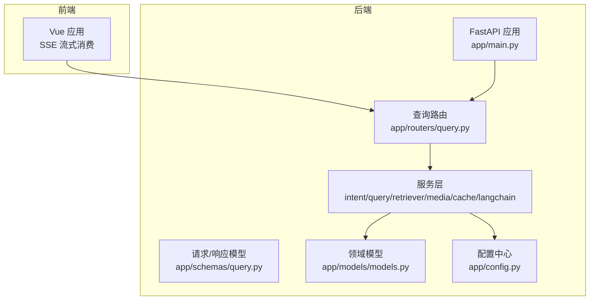
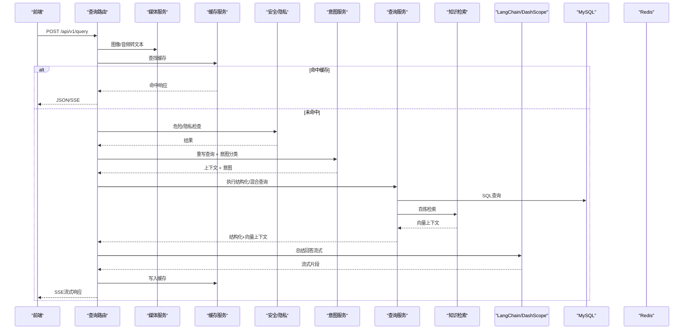
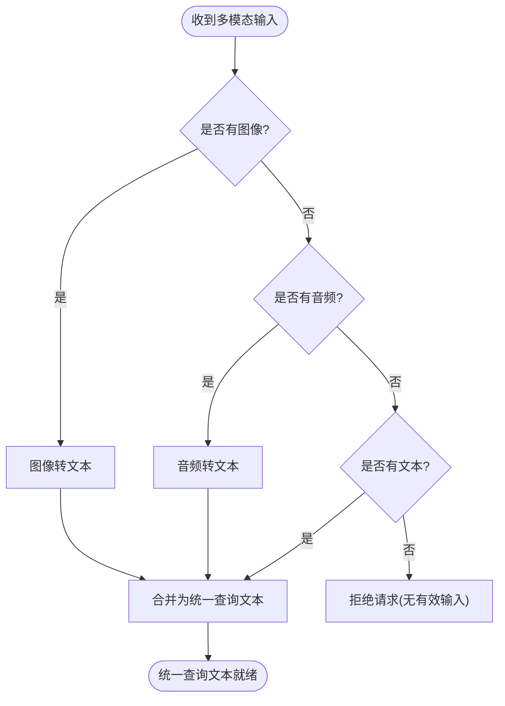
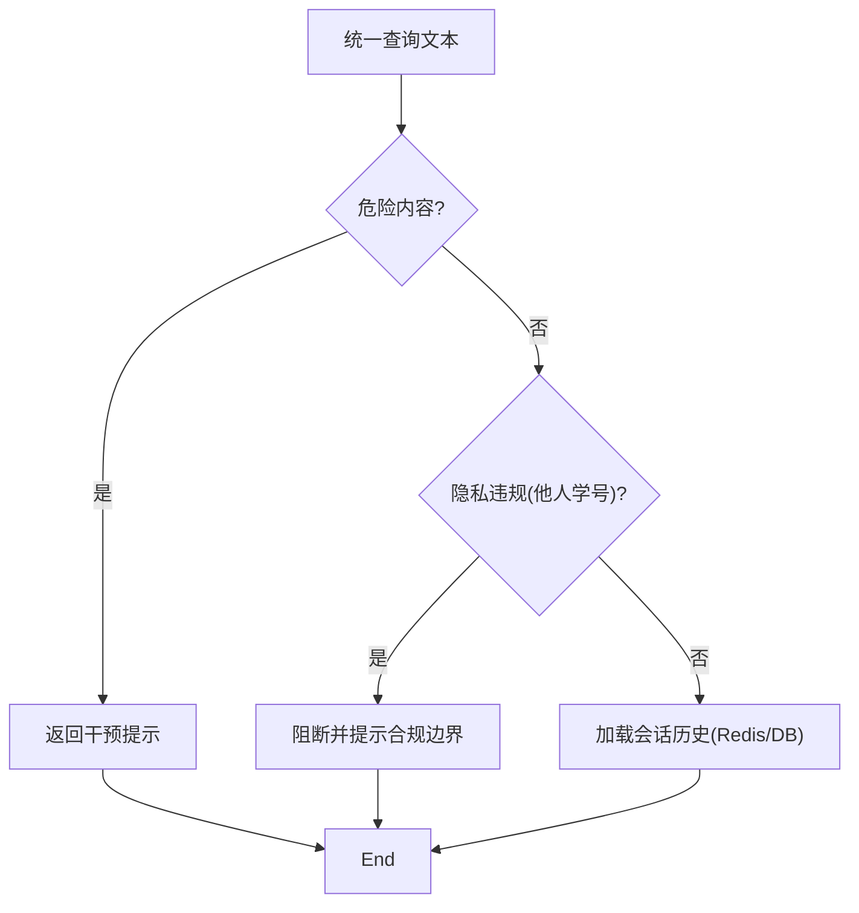
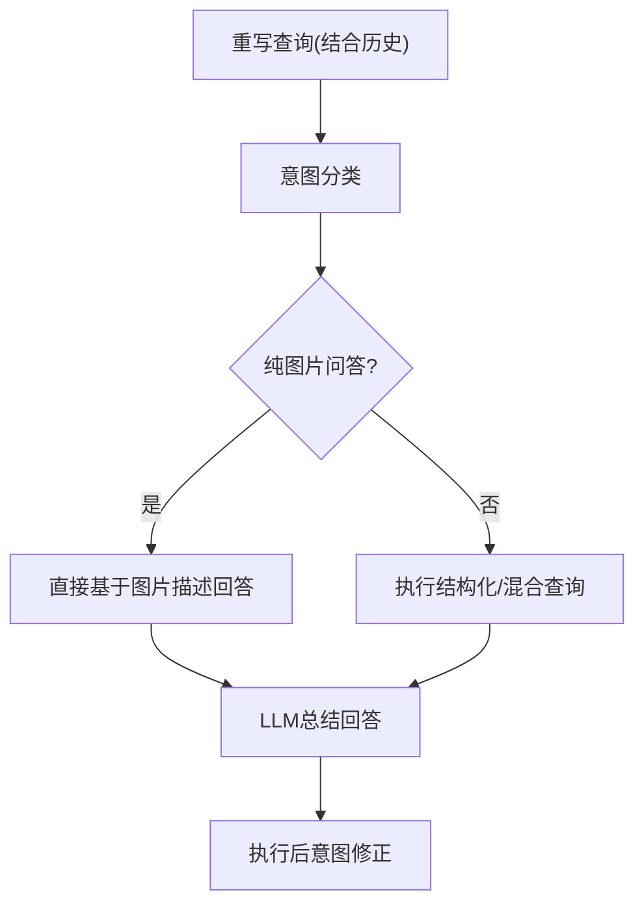
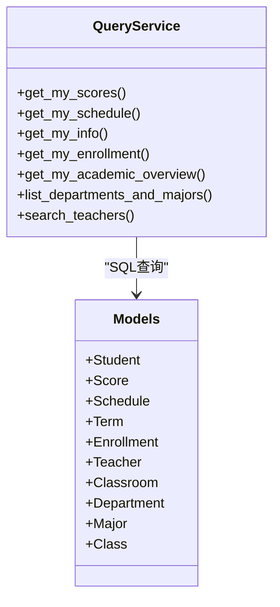
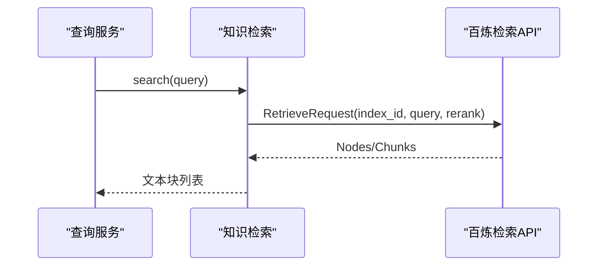
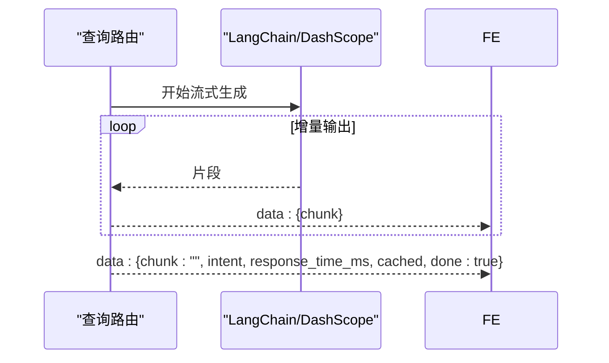
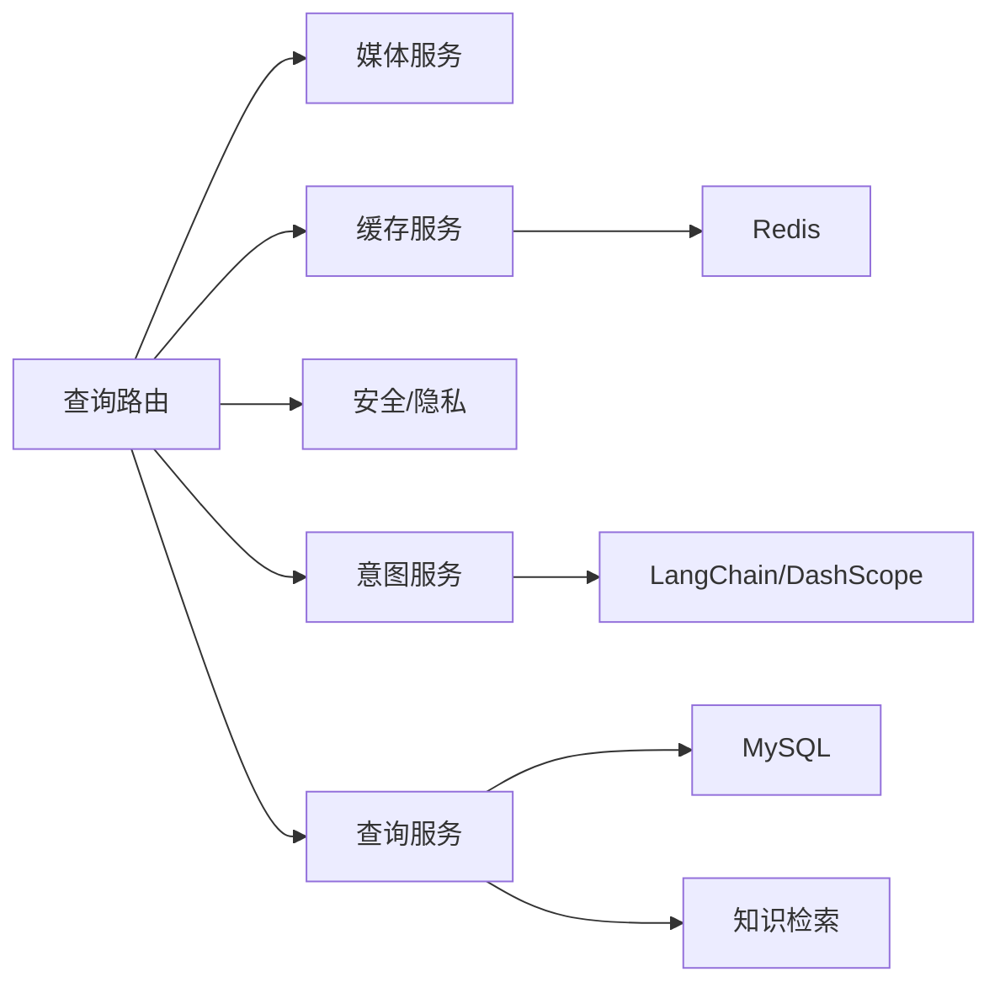

# 核心功能

<cite>
**本文引用的文件**
- [app/main.py](file://service/ai_assistant/app/main.py)
- [app/routers/query.py](file://service/ai_assistant/app/routers/query.py)
- [app/schemas/query.py](file://service/ai_assistant/app/schemas/query.py)
- [app/services/query_service.py](file://service/ai_assistant/app/services/query_service.py)
- [app/services/intent_service.py](file://service/ai_assistant/app/services/intent_service.py)
- [app/services/retriever_service.py](file://service/ai_assistant/app/services/retriever_service.py)
- [app/services/langchain_service.py](file://service/ai_assistant/app/services/langchain_service.py)
- [app/services/media_service.py](file://service/ai_assistant/app/services/media_service.py)
- [app/services/cache_service.py](file://service/ai_assistant/app/services/cache_service.py)
- [app/models/models.py](file://service/ai_assistant/app/models/models.py)
- [app/config.py](file://service/ai_assistant/app/config.py)
- [frontend/ai_assistant/src/api/query.js](file://frontend/ai_assistant/src/api/query.js)
</cite>

## 目录
1. [简介](#简介)
2. [项目结构](#项目结构)
3. [核心组件](#核心组件)
4. [架构总览](#架构总览)
5. [详细组件分析](#详细组件分析)
6. [依赖分析](#依赖分析)
7. [性能考量](#性能考量)
8. [故障排查指南](#故障排查指南)
9. [结论](#结论)
10. [附录](#附录)

## 简介
本文件面向AI校园助手的核心功能，系统性阐述多模态输入处理、智能意图分类、结构化查询执行、向量检索与RAG、混合查询处理、SSE流式响应等能力的工作原理、实现逻辑、使用场景与协作关系。文档同时提供API调用示例、参数说明、返回值格式、性能特征、限制条件与扩展建议，帮助开发者快速理解与二次开发。

## 项目结构
后端采用FastAPI + SQLAlchemy + Redis + DashScope（百炼）的组合，前端通过SSE与后端进行流式交互。核心路由位于统一查询端点，服务层按职责拆分，模型层定义校园业务实体，配置集中于settings。

图表来源
- [app/main.py:1-86](file://service/ai_assistant/app/main.py#L1-L86)
- [app/routers/query.py:1-788](file://service/ai_assistant/app/routers/query.py#L1-L788)
- [app/schemas/query.py:1-33](file://service/ai_assistant/app/schemas/query.py#L1-L33)
- [app/services/intent_service.py:1-346](file://service/ai_assistant/app/services/intent_service.py#L1-L346)
- [app/services/query_service.py:1-800](file://service/ai_assistant/app/services/query_service.py#L1-L800)
- [app/services/retriever_service.py:1-168](file://service/ai_assistant/app/services/retriever_service.py#L1-L168)
- [app/services/media_service.py:1-246](file://service/ai_assistant/app/services/media_service.py#L1-L246)
- [app/services/cache_service.py:1-177](file://service/ai_assistant/app/services/cache_service.py#L1-L177)
- [app/models/models.py:1-660](file://service/ai_assistant/app/models/models.py#L1-L660)
- [app/config.py:1-113](file://service/ai_assistant/app/config.py#L1-L113)

章节来源
- [app/main.py:1-86](file://service/ai_assistant/app/main.py#L1-L86)
- [app/routers/query.py:1-788](file://service/ai_assistant/app/routers/query.py#L1-L788)
- [app/config.py:1-113](file://service/ai_assistant/app/config.py#L1-L113)

## 核心组件
- 多模态输入处理：图像理解（Qwen-VL）、语音识别（ASR），统一转为文本查询。
- 意图分类：基于LLM对查询进行structured/vector/hybrid/smalltalk分类。
- 结构化查询执行：SQL查询与工具规划，返回结构化数据上下文。
- 向量检索与RAG：百炼知识库检索，结合重排与去重，形成向量上下文。
- 混合查询处理：融合结构化与向量上下文，动态修正意图。
- SSE流式响应：流式输出回答片段，最终附带元数据与完成标志。
- 缓存与隐私：按敏感度与日期/课表版本策略缓存，DID隔离与隐私检查。

章节来源
- [app/routers/query.py:198-745](file://service/ai_assistant/app/routers/query.py#L198-L745)
- [app/services/media_service.py:115-246](file://service/ai_assistant/app/services/media_service.py#L115-L246)
- [app/services/intent_service.py:218-346](file://service/ai_assistant/app/services/intent_service.py#L218-L346)
- [app/services/query_service.py:575-800](file://service/ai_assistant/app/services/query_service.py#L575-L800)
- [app/services/retriever_service.py:46-168](file://service/ai_assistant/app/services/retriever_service.py#L46-L168)
- [app/services/cache_service.py:92-177](file://service/ai_assistant/app/services/cache_service.py#L92-L177)

## 架构总览
统一查询端点负责多模态预处理、缓存命中、安全与隐私检查、意图分类、查询执行、总结与缓存写回，并通过SSE返回流式结果。服务层通过LangChain适配DashScope，实现提示模板渲染、调用与流式输出。

图表来源
- [app/routers/query.py:207-745](file://service/ai_assistant/app/routers/query.py#L207-L745)
- [app/services/media_service.py:115-246](file://service/ai_assistant/app/services/media_service.py#L115-L246)
- [app/services/cache_service.py:92-177](file://service/ai_assistant/app/services/cache_service.py#L92-L177)
- [app/services/intent_service.py:298-346](file://service/ai_assistant/app/services/intent_service.py#L298-L346)
- [app/services/query_service.py:575-800](file://service/ai_assistant/app/services/query_service.py#L575-L800)
- [app/services/retriever_service.py:46-168](file://service/ai_assistant/app/services/retriever_service.py#L46-L168)
- [app/services/langchain_service.py:139-278](file://service/ai_assistant/app/services/langchain_service.py#L139-L278)

## 详细组件分析

### 多模态输入处理
- 图像理解：将Base64图像优化后通过DashScope多模态模型抽取文字与关键信息，作为统一查询的一部分。
- 语音识别：将Base64音频解码并通过ffmpeg转为WAV，再调用ASR模型转录为文本。
- 输入校验：至少需提供文本、图像或音频之一；否则拒绝请求。
- 统一文本构建：将图像/音频转文本与原始文本合并，形成统一查询。

图表来源
- [app/routers/query.py:230-273](file://service/ai_assistant/app/routers/query.py#L230-L273)
- [app/services/media_service.py:115-246](file://service/ai_assistant/app/services/media_service.py#L115-L246)

章节来源
- [app/routers/query.py:230-273](file://service/ai_assistant/app/routers/query.py#L230-L273)
- [app/services/media_service.py:115-246](file://service/ai_assistant/app/services/media_service.py#L115-L246)

### 安全与隐私检查
- 危险内容检测：对统一查询进行危险性评估，必要时返回干预提示。
- 隐私检查：识别是否试图查询他人学号，若发现则阻断并提示合规边界。
- 历史隔离：使用DID + session_id隔离会话历史，避免并发会话串话。

图表来源
- [app/routers/query.py:350-471](file://service/ai_assistant/app/routers/query.py#L350-L471)
- [app/routers/query.py:317-342](file://service/ai_assistant/app/routers/query.py#L317-L342)

章节来源
- [app/routers/query.py:350-471](file://service/ai_assistant/app/routers/query.py#L350-L471)
- [app/routers/query.py:317-342](file://service/ai_assistant/app/routers/query.py#L317-L342)

### 意图分类与查询重写
- 查询重写：结合最近N轮历史，将最新问题重写为完整、独立的查询，补齐缺失信息。
- 意图分类：将查询归类为structured、vector、hybrid或smalltalk。
- 图片纯问答：若检测到纯图片问答意图，直接基于图片描述回答，跳过检索。

图表来源
- [app/services/intent_service.py:251-296](file://service/ai_assistant/app/services/intent_service.py#L251-L296)
- [app/services/intent_service.py:218-248](file://service/ai_assistant/app/services/intent_service.py#L218-L248)
- [app/routers/query.py:505-573](file://service/ai_assistant/app/routers/query.py#L505-L573)

章节来源
- [app/services/intent_service.py:251-296](file://service/ai_assistant/app/services/intent_service.py#L251-L296)
- [app/services/intent_service.py:218-248](file://service/ai_assistant/app/services/intent_service.py#L218-L248)
- [app/routers/query.py:505-573](file://service/ai_assistant/app/routers/query.py#L505-L573)

### 结构化查询执行
- 工具规划：根据意图与问题，规划调用工具（如查询成绩、课表、个人信息、教师通讯录等）。
- SQL执行：针对结构化数据查询，使用SQLAlchemy异步ORM执行，返回结构化结果。
- 上下文美化：将英文字段名翻译为中文，格式化学期ID与布尔值，增强可读性。

图表来源
- [app/services/query_service.py:575-800](file://service/ai_assistant/app/services/query_service.py#L575-L800)
- [app/models/models.py:303-480](file://service/ai_assistant/app/models/models.py#L303-L480)

章节来源
- [app/services/query_service.py:575-800](file://service/ai_assistant/app/services/query_service.py#L575-L800)
- [app/models/models.py:303-480](file://service/ai_assistant/app/models/models.py#L303-L480)

### 向量检索与RAG
- 百炼检索：调用阿里云百炼检索API，返回候选文本块，进行去重与重排。
- LangChain包装：提供异步检索器，便于与链路集成。
- 上下文拼接：将检索结果与结构化上下文合并，供LLM总结。

图表来源
- [app/services/retriever_service.py:46-168](file://service/ai_assistant/app/services/retriever_service.py#L46-L168)
- [app/services/query_service.py:212-238](file://service/ai_assistant/app/services/query_service.py#L212-L238)

章节来源
- [app/services/retriever_service.py:46-168](file://service/ai_assistant/app/services/retriever_service.py#L46-L168)
- [app/services/query_service.py:212-238](file://service/ai_assistant/app/services/query_service.py#L212-L238)

### 混合查询处理与意图修正
- 混合路径：同时包含结构化与向量上下文时，意图修正为hybrid。
- 执行后修正：根据实际返回的上下文内容，动态调整意图类型，确保呈现准确。

章节来源
- [app/routers/query.py:551-573](file://service/ai_assistant/app/routers/query.py#L551-L573)

### SSE流式响应
- 流式生成：通过LangChain适配器进行增量输出，前端逐段接收。
- 元数据附带：流式结束包携带意图、耗时、缓存标记与完成标志。
- 容错处理：兼容部分网关可能改写流格式，前端具备容错解析。

图表来源
- [app/routers/query.py:659-745](file://service/ai_assistant/app/routers/query.py#L659-L745)
- [app/services/langchain_service.py:206-278](file://service/ai_assistant/app/services/langchain_service.py#L206-L278)
- [frontend/ai_assistant/src/api/query.js:28-141](file://frontend/ai_assistant/src/api/query.js#L28-L141)

章节来源
- [app/routers/query.py:659-745](file://service/ai_assistant/app/routers/query.py#L659-L745)
- [app/services/langchain_service.py:206-278](file://service/ai_assistant/app/services/langchain_service.py#L206-L278)
- [frontend/ai_assistant/src/api/query.js:28-141](file://frontend/ai_assistant/src/api/query.js#L28-L141)

### 缓存与隐私
- 缓存键：chat_cache:{version}:{did}:{md5(查询文本)}。
- TTL策略：敏感查询30分钟，普通查询1天；日期敏感查询按日失效；课表敏感查询按版本失效。
- 会话历史：Redis按did:session隔离存储，避免并发污染。

章节来源
- [app/services/cache_service.py:92-177](file://service/ai_assistant/app/services/cache_service.py#L92-L177)
- [app/routers/query.py:153-196](file://service/ai_assistant/app/routers/query.py#L153-L196)

## 依赖分析
- 路由依赖服务层：查询路由集中编排多模态、缓存、安全、意图、执行与总结。
- 服务层依赖配置：模型名称、百炼参数、DashScope限制等均来自settings。
- 服务层依赖外部：DashScope（多模态、ASR、LLM）、阿里云百炼检索、MySQL、Redis。
- 前后端交互：前端通过SSE消费后端流式输出，兼容JSON回退。

图表来源
- [app/routers/query.py:198-745](file://service/ai_assistant/app/routers/query.py#L198-L745)
- [app/services/media_service.py:115-246](file://service/ai_assistant/app/services/media_service.py#L115-L246)
- [app/services/cache_service.py:92-177](file://service/ai_assistant/app/services/cache_service.py#L92-L177)
- [app/services/intent_service.py:298-346](file://service/ai_assistant/app/services/intent_service.py#L298-L346)
- [app/services/query_service.py:575-800](file://service/ai_assistant/app/services/query_service.py#L575-L800)
- [app/services/retriever_service.py:46-168](file://service/ai_assistant/app/services/retriever_service.py#L46-L168)
- [app/services/langchain_service.py:139-278](file://service/ai_assistant/app/services/langchain_service.py#L139-L278)

章节来源
- [app/routers/query.py:198-745](file://service/ai_assistant/app/routers/query.py#L198-L745)
- [app/services/langchain_service.py:139-278](file://service/ai_assistant/app/services/langchain_service.py#L139-L278)

## 性能考量
- 并发优化：安全检查与查询重写并行执行，缩短端到端延迟。
- 连接池与回滚：流式阶段提前回滚数据库会话，避免长时间占用连接。
- 缓存命中：热点查询直接返回缓存，显著降低延迟与外部调用。
- 输入裁剪：LangChain适配器对消息进行尾部裁剪与历史丢弃，控制输入长度。
- 模型选择：不同阶段使用不同模型（turbo/turbo-plus），平衡速度与质量。

章节来源
- [app/routers/query.py:347-352](file://service/ai_assistant/app/routers/query.py#L347-L352)
- [app/routers/query.py:654-658](file://service/ai_assistant/app/routers/query.py#L654-L658)
- [app/services/langchain_service.py:46-97](file://service/ai_assistant/app/services/langchain_service.py#L46-L97)

## 故障排查指南
- SSE解析失败：前端需正确处理data:行与结尾包，兼容部分网关改写格式。
- LLM调用异常：捕获Generation API错误并转化为统一提示，避免泄露内部错误。
- 缓存异常：Redis失败时降级至DB历史，不影响主流程。
- 图像/音频处理：图像过大或音频无效时抛出明确错误，前端提示重试或更换格式。
- 意图分类失败：分类器异常时回退为向量意图，保证可用性。

章节来源
- [frontend/ai_assistant/src/api/query.js:78-141](file://frontend/ai_assistant/src/api/query.js#L78-L141)
- [app/routers/query.py:142-151](file://service/ai_assistant/app/routers/query.py#L142-L151)
- [app/routers/query.py:282-287](file://service/ai_assistant/app/routers/query.py#L282-L287)
- [app/services/media_service.py:149-156](file://service/ai_assistant/app/services/media_service.py#L149-L156)
- [app/services/intent_service.py:233-248](file://service/ai_assistant/app/services/intent_service.py#L233-L248)

## 结论
AI校园助手通过统一查询端点整合多模态输入、意图分类、结构化与向量检索、混合查询与LLM总结，并以SSE提供流畅体验。服务层清晰分离，配置集中管理，具备良好的可扩展性与稳定性。开发者可在现有框架上扩展工具、优化检索策略、增强隐私与安全策略，或引入新的多模态能力。

## 附录

### API定义与调用示例

- 统一查询端点
  - 方法：POST
  - 路径：/api/v1/query
  - 认证：Bearer Token
  - 请求体：见QueryRequest
  - 响应：JSON或SSE流式

- 请求体字段
  - text: 文本问题
  - image_base64: Base64图像
  - audio_base64: Base64音频
  - session_id: 会话ID（可选）
  - output_type: 输出类型（仅当值为"json"时返回结构化JSON）

- 响应体字段（JSON）
  - answer: 回答
  - intent: 意图类型（structured/vector/hybrid/smalltalk）
  - session_id: 本次会话ID
  - response_time_ms: 耗时（毫秒）
  - cached: 是否来自缓存

- 响应体字段（SSE流）
  - chunk: 回答片段
  - intent: 意图类型
  - response_time_ms: 耗时（毫秒）
  - cached: 是否来自缓存
  - done: 是否结束

- 清除会话缓存
  - 方法：DELETE
  - 路径：/api/v1/sessions
  - 响应：{message, deleted_keys_count}

章节来源
- [app/schemas/query.py:15-33](file://service/ai_assistant/app/schemas/query.py#L15-L33)
- [app/routers/query.py:198-788](file://service/ai_assistant/app/routers/query.py#L198-L788)
- [frontend/ai_assistant/src/api/query.js:11-20](file://frontend/ai_assistant/src/api/query.js#L11-L20)

### 配置项与参数说明
- 模型配置（LLM_MODEL_*）
  - 意图分类：qwen-turbo
  - 查询重写：qwen-turbo
  - 最终回答：qwen-plus
  - 工具规划：qwen-plus
  - 向量拆解：qwen-turbo
  - 混合重排：qwen-turbo
  - 安全检测：qwen-turbo
  - 图像理解：qwen-vl-plus
  - 语音识别：paraformer-realtime-v1

- 百炼检索配置
  - ALIBABA_CLOUD_ACCESS_KEY_ID/SECRET
  - BAILIAN_WORKSPACE_ID
  - BAILIAN_INDEX_ID
  - BAILIAN_ENDPOINT

- 缓存TTL
  - CACHE_TTL_SENSITIVE: 30分钟
  - CACHE_TTL_NORMAL: 1天

章节来源
- [app/config.py:54-84](file://service/ai_assistant/app/config.py#L54-L84)
- [app/config.py:75-80](file://service/ai_assistant/app/config.py#L75-L80)
- [app/config.py:82-83](file://service/ai_assistant/app/config.py#L82-L83)

### 返回值格式与示例
- JSON响应：包含answer、intent、session_id、response_time_ms、cached。
- SSE响应：多次data: {chunk: ...}，最后一条data: {chunk:"", intent, response_time_ms, cached, done:true}。

章节来源
- [app/schemas/query.py:26-33](file://service/ai_assistant/app/schemas/query.py#L26-L33)
- [app/routers/query.py:699-706](file://service/ai_assistant/app/routers/query.py#L699-L706)

### 性能特征与限制
- 输入长度限制：LangChain适配器对消息进行裁剪，避免超出模型输入上限。
- 并发与延迟：并行执行安全检查与查询重写，流式阶段提前释放数据库连接。
- 缓存命中率：敏感与日期敏感查询按策略失效，课表相关查询按版本失效。

章节来源
- [app/services/langchain_service.py:46-97](file://service/ai_assistant/app/services/langchain_service.py#L46-L97)
- [app/routers/query.py:347-352](file://service/ai_assistant/app/routers/query.py#L347-L352)
- [app/routers/query.py:654-658](file://service/ai_assistant/app/routers/query.py#L654-L658)
- [app/services/cache_service.py:85-147](file://service/ai_assistant/app/services/cache_service.py#L85-L147)

### 扩展与定制化建议
- 新增工具：在查询服务中添加新的结构化查询工具，并在意图规划提示中加入对应工具描述。
- 检索优化：调整百炼检索参数（top_k、rerank、阈值），或引入本地嵌入检索作为补充。
- 意图规则：在意图分类与重写提示中增加领域规则，提升准确性。
- 流式体验：前端可增加“正在思考”占位与错误重试机制，改善用户体验。
- 安全策略：扩展隐私检查规则，支持更细粒度的访问控制与审计。

章节来源
- [app/services/query_service.py:178-209](file://service/ai_assistant/app/services/query_service.py#L178-L209)
- [app/services/retriever_service.py:56-69](file://service/ai_assistant/app/services/retriever_service.py#L56-L69)
- [frontend/ai_assistant/src/api/query.js:28-141](file://frontend/ai_assistant/src/api/query.js#L28-L141)