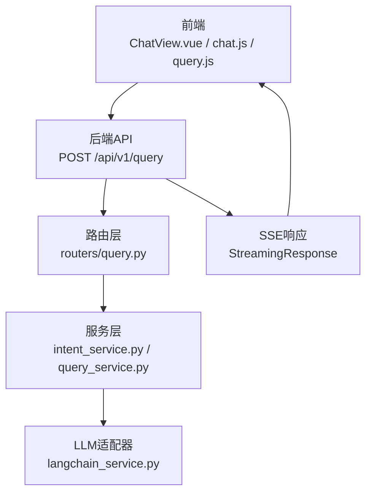
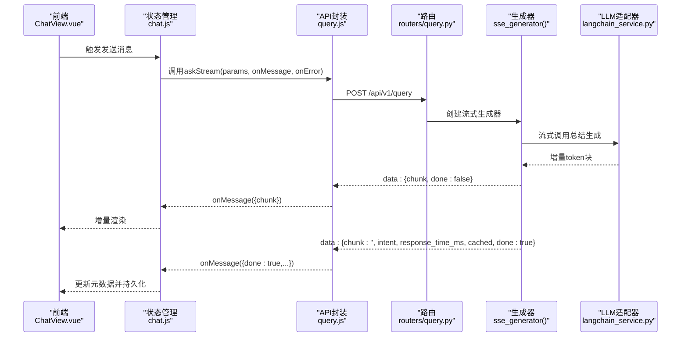
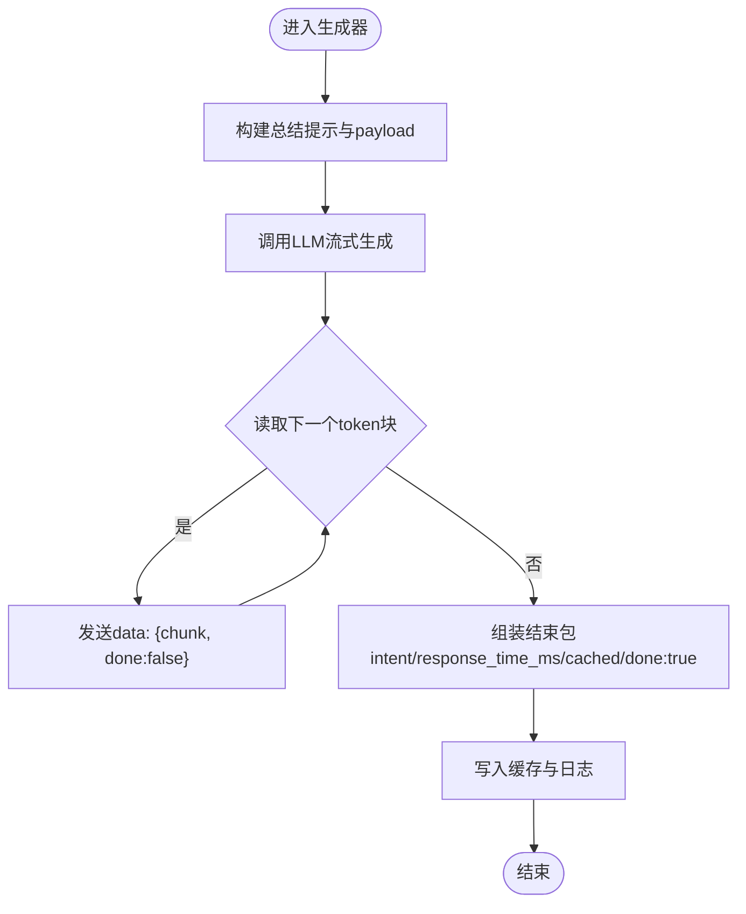
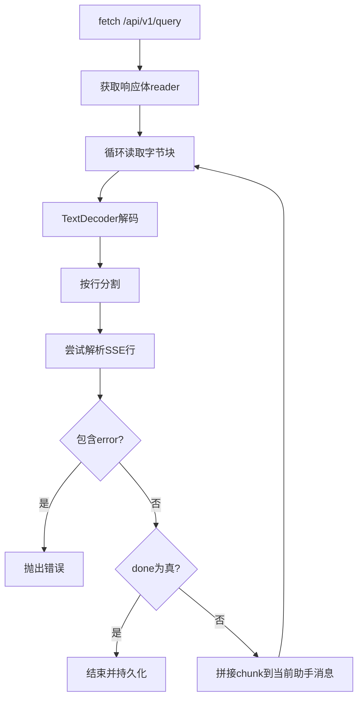
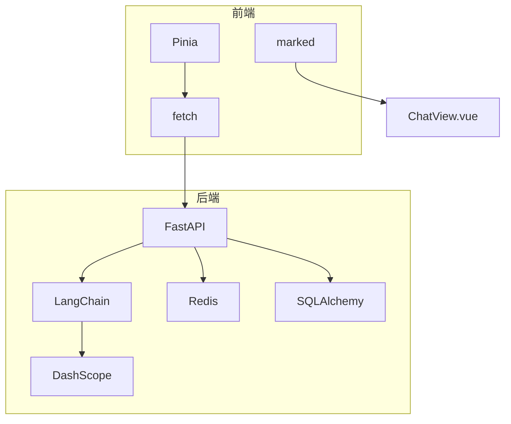

# 流式响应系统

<cite>
**本文引用的文件**
- [main.py](file://service/ai_assistant/app/main.py)
- [query.py](file://service/ai_assistant/app/routers/query.py)
- [intent_service.py](file://service/ai_assistant/app/services/intent_service.py)
- [langchain_service.py](file://service/ai_assistant/app/services/langchain_service.py)
- [query.js](file://frontend/ai_assistant/src/api/query.js)
- [chat.js](file://frontend/ai_assistant/src/stores/chat.js)
- [ChatView.vue](file://frontend/ai_assistant/src/views/ChatView.vue)
- [config.py](file://service/ai_assistant/app/config.py)
- [query.py](file://service/ai_assistant/app/schemas/query.py)
</cite>

## 目录
1. [简介](#简介)
2. [项目结构](#项目结构)
3. [核心组件](#核心组件)
4. [架构总览](#架构总览)
5. [详细组件分析](#详细组件分析)
6. [依赖分析](#依赖分析)
7. [性能考量](#性能考量)
8. [故障排查指南](#故障排查指南)
9. [结论](#结论)
10. [附录](#附录)

## 简介
本文件面向AI校园助手的流式响应系统，围绕SSE（Server-Sent Events）实现原理、生成器机制、数据包格式与客户端处理逻辑展开，提供后端生成流式数据与前端接收处理的实践路径，并总结异步处理、内存管理、连接池优化、错误处理与断线重连等性能与可靠性最佳实践。

## 项目结构
后端采用FastAPI，前端采用Vue 3 + Pinia，二者通过SSE进行流式通信。核心链路如下：
- 前端通过fetch向后端POST /api/v1/query发起请求
- 后端路由解析请求，构建统一查询文本，执行安全检查、意图分类、检索与总结
- 后端以StreamingResponse返回SSE流，前端逐块解析并增量渲染
- 流结束后，后端写入缓存与日志，前端更新最终元数据

图表来源
- [query.py:198-745](file://service/ai_assistant/app/routers/query.py#L198-L745)
- [query.js:28-140](file://frontend/ai_assistant/src/api/query.js#L28-L140)
- [chat.js:133-230](file://frontend/ai_assistant/src/stores/chat.js#L133-L230)
- [intent_service.py:326-346](file://service/ai_assistant/app/services/intent_service.py#L326-L346)
- [langchain_service.py:206-278](file://service/ai_assistant/app/services/langchain_service.py#L206-L278)

章节来源
- [main.py:52-86](file://service/ai_assistant/app/main.py#L52-L86)
- [query.py:198-745](file://service/ai_assistant/app/routers/query.py#L198-L745)

## 核心组件
- 后端路由与SSE封装
  - 路由层负责多模态输入解码、缓存命中、并发任务、意图分类、查询执行、总结与缓存写入，并通过统一的SSE响应封装返回流式数据。
  - SSE响应头设置防止反向代理缓冲/改写，媒体类型为text/event-stream。
- 生成器机制
  - 后端在流式生成器中，将LLM流式输出按块拼接，周期性发送chunk，最后发送包含intent、耗时、缓存标记与done标志的结束包。
- 前端SSE解析
  - 前端通过fetch获取响应体reader，按行解析SSE数据包，将chunk增量拼接到当前助手消息，done为真时结束并持久化。
- LLM适配器
  - 通过LangChain模板渲染与DashScope API调用，提供非流式与流式两种调用方式，流式输出按块返回。

章节来源
- [query.py:115-125](file://service/ai_assistant/app/routers/query.py#L115-L125)
- [query.py:659-745](file://service/ai_assistant/app/routers/query.py#L659-L745)
- [query.js:28-140](file://frontend/ai_assistant/src/api/query.js#L28-L140)
- [chat.js:133-230](file://frontend/ai_assistant/src/stores/chat.js#L133-L230)
- [intent_service.py:326-346](file://service/ai_assistant/app/services/intent_service.py#L326-L346)
- [langchain_service.py:206-278](file://service/ai_assistant/app/services/langchain_service.py#L206-L278)

## 架构总览
SSE流式响应的关键在于“生成器-解析器-渲染器”的闭环：
- 生成器：后端在流式生成器中，将LLM增量输出包装为SSE数据包，周期性发送chunk，最后发送done包。
- 解析器：前端按行解析SSE数据包，容错处理不同网关改写格式，解析JSON负载。
- 渲染器：前端将增量内容拼接到当前助手消息，完成后更新intent、耗时、缓存标记等元数据。

图表来源
- [query.py:659-745](file://service/ai_assistant/app/routers/query.py#L659-L745)
- [query.js:28-140](file://frontend/ai_assistant/src/api/query.js#L28-L140)
- [chat.js:133-230](file://frontend/ai_assistant/src/stores/chat.js#L133-L230)
- [langchain_service.py:206-278](file://service/ai_assistant/app/services/langchain_service.py#L206-L278)

## 详细组件分析

### 后端SSE封装与生成器
- SSE封装
  - 统一封装StreamingResponse，设置媒体类型为text/event-stream，并通过Cache-Control、Connection、X-Accel-Buffering等头部降低被反向代理缓冲/改写的概率。
- 生成器逻辑
  - 生成器在流式期间释放数据库连接，避免长时间占用连接池。
  - 通过LangChain模板与DashScope流式调用获取增量token，周期性发送chunk，最后发送包含intent、耗时、缓存标记与done标志的结束包。
  - 生成器结束后，写入缓存与日志，确保一致性与可观测性。

图表来源
- [query.py:659-745](file://service/ai_assistant/app/routers/query.py#L659-L745)
- [intent_service.py:326-346](file://service/ai_assistant/app/services/intent_service.py#L326-L346)
- [langchain_service.py:206-278](file://service/ai_assistant/app/services/langchain_service.py#L206-L278)

章节来源
- [query.py:115-125](file://service/ai_assistant/app/routers/query.py#L115-L125)
- [query.py:659-745](file://service/ai_assistant/app/routers/query.py#L659-L745)

### 前端SSE解析与渲染
- fetch获取响应体
  - 前端通过fetch向后端发起POST请求，获取响应体reader。
- SSE解析
  - 按行解析，支持标准SSE格式data: {...}与部分网关改写格式，解析JSON负载。
  - 收到done为真时结束；若服务端未发送done包，前端兜底发送done包。
- 渲染与持久化
  - 将增量chunk拼接到当前助手消息，完成后更新intent、耗时、缓存标记等元数据并持久化。

图表来源
- [query.js:28-140](file://frontend/ai_assistant/src/api/query.js#L28-L140)
- [chat.js:133-230](file://frontend/ai_assistant/src/stores/chat.js#L133-L230)

章节来源
- [query.js:28-140](file://frontend/ai_assistant/src/api/query.js#L28-L140)
- [chat.js:133-230](file://frontend/ai_assistant/src/stores/chat.js#L133-L230)

### LLM适配器与流式输出
- 非流式与流式调用
  - 提供ainvoke_chat_prompt与stream_chat_prompt两类调用，分别返回完整回答与增量token块。
- 输入裁剪与日志
  - 对消息进行字符数裁剪，优先丢弃旧历史，再裁剪最后一条，保证输入长度在模型限制内。
- 流式进度与异常处理
  - 流式过程中定期记录进度，遇到非200状态码抛出异常，确保前端能感知错误。

章节来源
- [langchain_service.py:139-204](file://service/ai_assistant/app/services/langchain_service.py#L139-L204)
- [langchain_service.py:206-278](file://service/ai_assistant/app/services/langchain_service.py#L206-L278)

### 数据包格式与元数据
- SSE数据包
  - 标准格式：data: { ... }\n\n，其中JSON包含chunk、done字段；结束包包含intent、response_time_ms、cached、done等。
- JSON回退兼容
  - 若后端返回application/json（兼容线上仍返回JSON），前端解析answer作为一次性完整回答，并模拟结束包。
- 元数据字段
  - intent：意图类型（structured/vector/hybrid/smalltalk）
  - response_time_ms：后端耗时（毫秒）
  - cached：是否来自缓存
  - done：是否结束

章节来源
- [query.py:699-706](file://service/ai_assistant/app/routers/query.py#L699-L706)
- [query.js:54-66](file://frontend/ai_assistant/src/api/query.js#L54-L66)
- [query.py:8-32](file://service/ai_assistant/app/schemas/query.py#L8-L32)

## 依赖分析
- 后端依赖
  - FastAPI：路由与StreamingResponse
  - LangChain/DashScope：提示模板与LLM调用
  - Redis：会话历史与缓存
  - SQLAlchemy：数据库连接与事务
- 前端依赖
  - fetch：SSE响应体读取
  - Pinia：状态管理
  - marked：Markdown渲染

图表来源
- [main.py:52-86](file://service/ai_assistant/app/main.py#L52-L86)
- [query.py:198-745](file://service/ai_assistant/app/routers/query.py#L198-L745)
- [query.js:28-140](file://frontend/ai_assistant/src/api/query.js#L28-L140)
- [chat.js:133-230](file://frontend/ai_assistant/src/stores/chat.js#L133-L230)

章节来源
- [config.py:6-113](file://service/ai_assistant/app/config.py#L6-L113)
- [query.py:198-745](file://service/ai_assistant/app/routers/query.py#L198-L745)

## 性能考量
- 异步与并发
  - 后端在路由层并发执行安全检查与查询重写，缩短整体延迟。
  - 流式生成器在生成期间释放数据库连接，避免长时间占用连接池。
- 内存与输入裁剪
  - LLM适配器对消息进行字符数裁剪，优先丢弃旧历史，再裁剪最后一条，避免超出模型输入上限。
- 缓存与降级
  - Redis缓存命中时直接返回，减少LLM调用与数据库查询。
  - Redis异常时降级至数据库历史，保证可用性。
- 网关与反向代理
  - SSE响应头设置防止缓冲/改写，提升跨网关稳定性。
- 前端渲染优化
  - 增量拼接与局部更新，避免整屏重绘。
  - Markdown渲染与图片/语音预览优化用户体验。

章节来源
- [query.py:347-352](file://service/ai_assistant/app/routers/query.py#L347-L352)
- [query.py:654-657](file://service/ai_assistant/app/routers/query.py#L654-L657)
- [langchain_service.py:46-96](file://service/ai_assistant/app/services/langchain_service.py#L46-L96)
- [query.py:115-125](file://service/ai_assistant/app/routers/query.py#L115-L125)

## 故障排查指南
- 常见错误与处理
  - LLM流式调用失败：状态码非200时抛出异常，前端捕获并显示友好错误。
  - SSE解析失败：前端容错解析不同网关改写格式，若解析失败记录错误并终止。
  - 服务端异常：后端生成器捕获异常，发送包含error字段的结束包，前端识别并显示。
- 断线重连与兜底
  - 前端在读取完成后若未收到done包，会兜底发送done包，避免前端长期处于“正在思考”状态。
  - 前端根据HTTP状态码解析错误信息，提供用户可读提示。
- 日志与可观测性
  - 后端记录SSE生成进度、LLM调用统计、缓存命中与写入、数据库事务回滚等关键事件，便于定位问题。

章节来源
- [langchain_service.py:254-277](file://service/ai_assistant/app/services/langchain_service.py#L254-L277)
- [query.py:740-744](file://service/ai_assistant/app/routers/query.py#L740-L744)
- [query.js:132-135](file://frontend/ai_assistant/src/api/query.js#L132-L135)
- [chat.js:235-257](file://frontend/ai_assistant/src/stores/chat.js#L235-L257)

## 结论
本系统通过SSE实现了低延迟、高体验的流式响应：后端以生成器驱动LLM增量输出，前端按块解析并渲染，配合缓存、并发与输入裁剪等策略，兼顾性能与可靠性。建议在生产环境中进一步完善断线重连策略、监控告警与日志聚合，持续优化LLM调用与数据库访问路径。

## 附录
- 后端生成流式数据示例（路径）
  - [后端SSE封装:115-125](file://service/ai_assistant/app/routers/query.py#L115-L125)
  - [后端流式生成器:659-745](file://service/ai_assistant/app/routers/query.py#L659-L745)
  - [LLM流式调用:206-278](file://service/ai_assistant/app/services/langchain_service.py#L206-L278)
- 前端接收处理示例（路径）
  - [前端SSE解析与回调:28-140](file://frontend/ai_assistant/src/api/query.js#L28-L140)
  - [前端状态管理与渲染:133-230](file://frontend/ai_assistant/src/stores/chat.js#L133-L230)
  - [前端视图渲染:1-800](file://frontend/ai_assistant/src/views/ChatView.vue#L1-L800)