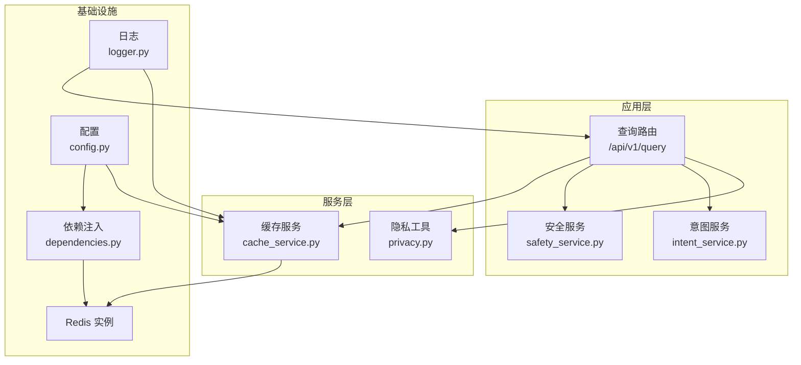
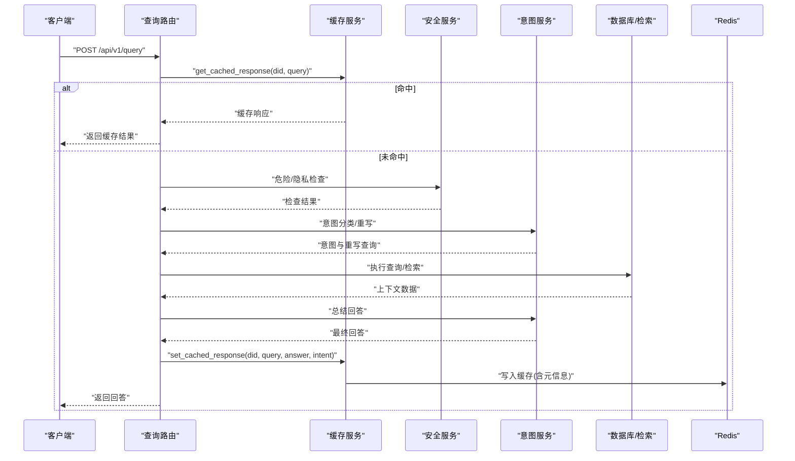
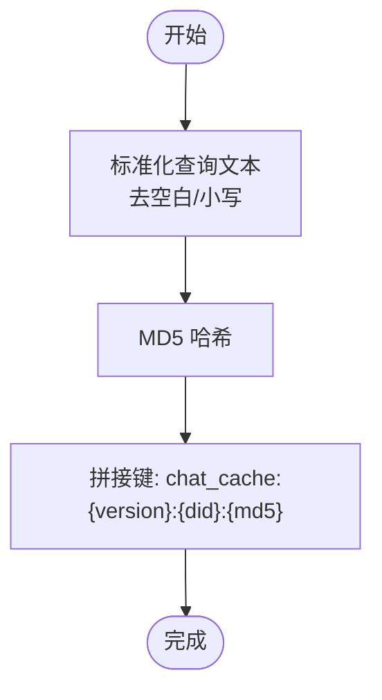
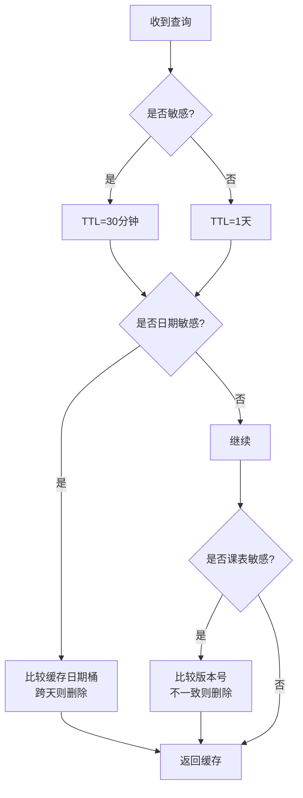
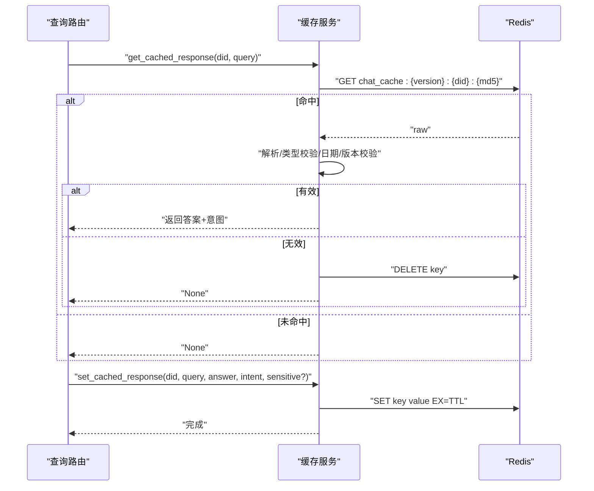
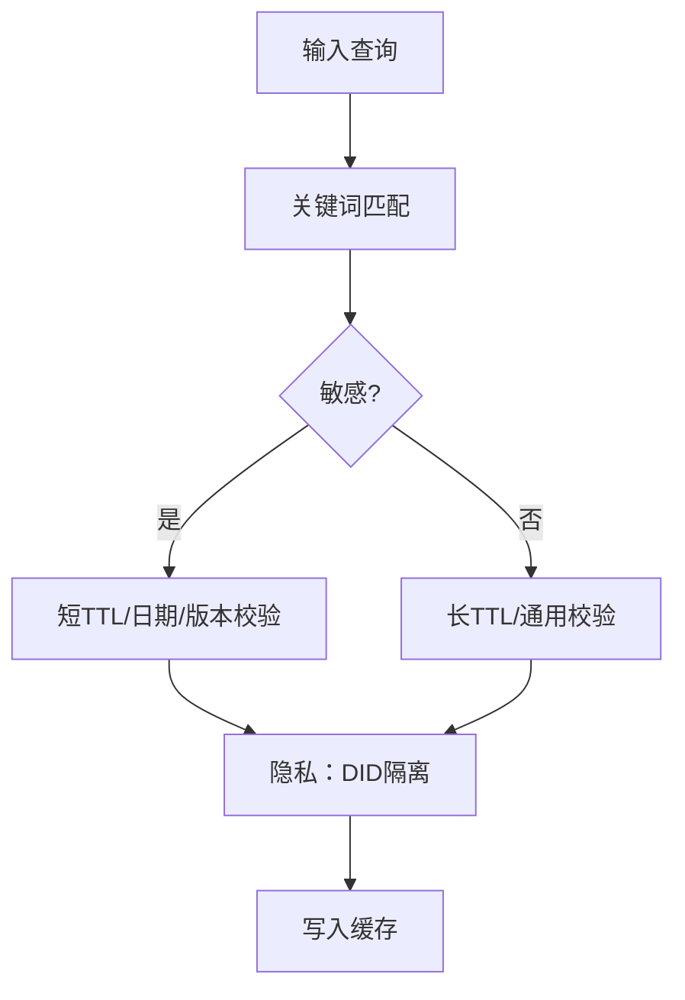
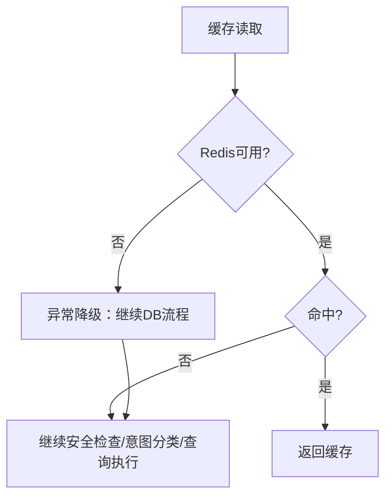
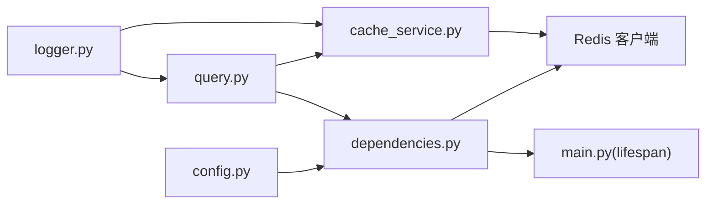

# 缓存机制

<cite>
**本文档引用的文件**
- [cache_service.py](file://service/ai_assistant/app/services/cache_service.py)
- [query.py](file://service/ai_assistant/app/routers/query.py)
- [dependencies.py](file://service/ai_assistant/app/dependencies.py)
- [config.py](file://service/ai_assistant/app/config.py)
- [privacy.py](file://service/ai_assistant/app/utils/privacy.py)
- [logger.py](file://service/ai_assistant/app/utils/logger.py)
- [main.py](file://service/ai_assistant/app/main.py)
- [safety_service.py](file://service/ai_assistant/app/services/safety_service.py)
- [intent_service.py](file://service/ai_assistant/app/services/intent_service.py)
</cite>

## 目录
1. [简介](#简介)
2. [项目结构](#项目结构)
3. [核心组件](#核心组件)
4. [架构总览](#架构总览)
5. [详细组件分析](#详细组件分析)
6. [依赖分析](#依赖分析)
7. [性能考量](#性能考量)
8. [故障排查指南](#故障排查指南)
9. [结论](#结论)
10. [附录](#附录)

## 简介
本文件面向AI校园助手的缓存机制，系统性阐述Redis缓存架构设计、缓存键设计原则、失效策略与穿透防护、敏感与非敏感数据的差异化处理、隐私保护与安全考虑，并提供读取、写入、更新的代码路径示例与性能优化、内存管理、故障恢复的实践建议。

## 项目结构
缓存相关能力主要分布在以下模块：
- 路由层：统一查询入口负责缓存读取、安全检查、意图分类、查询执行、回答生成与缓存写入
- 服务层：缓存服务封装Redis访问、键生成、TTL控制、跨天与课表版本失效
- 依赖注入：提供Redis客户端单例与连接池管理
- 配置：集中管理Redis连接、缓存TTL、DID盐值等
- 工具：隐私工具生成DID，避免直接使用真实学号
- 日志：统一日志配置，便于追踪缓存命中/失效与异常

图表来源
- [query.py](file://service/ai_assistant/app/routers/query.py)
- [cache_service.py](file://service/ai_assistant/app/services/cache_service.py)
- [dependencies.py](file://service/ai_assistant/app/dependencies.py)
- [config.py](file://service/ai_assistant/app/config.py)
- [privacy.py](file://service/ai_assistant/app/utils/privacy.py)
- [logger.py](file://service/ai_assistant/app/utils/logger.py)

章节来源
- [query.py:198-745](file://service/ai_assistant/app/routers/query.py#L198-L745)
- [cache_service.py:1-177](file://service/ai_assistant/app/services/cache_service.py#L1-L177)
- [dependencies.py:36-51](file://service/ai_assistant/app/dependencies.py#L36-L51)
- [config.py:26-100](file://service/ai_assistant/app/config.py#L26-L100)
- [privacy.py:9-22](file://service/ai_assistant/app/utils/privacy.py#L9-L22)
- [logger.py:17-46](file://service/ai_assistant/app/utils/logger.py#L17-L46)

## 核心组件
- 缓存键设计：采用“版本:学生标识:查询哈希”的命名空间隔离，避免跨版本与跨用户污染
- TTL策略：敏感查询短TTL，普通查询长TTL；支持动态调整
- 失效策略：日期敏感（跨天失效）、课表敏感（版本号失效）
- 穿透防护：缓存异常时快速降级，不影响主流程
- 隐私保护：使用DID替代真实学号，保障用户身份匿名性
- 安全考虑：缓存数据不包含敏感字段，仅存储必要摘要与元信息

章节来源
- [cache_service.py:3-8](file://service/ai_assistant/app/services/cache_service.py#L3-L8)
- [cache_service.py:49-52](file://service/ai_assistant/app/services/cache_service.py#L49-L52)
- [cache_service.py:85-89](file://service/ai_assistant/app/services/cache_service.py#L85-L89)
- [cache_service.py:114-142](file://service/ai_assistant/app/services/cache_service.py#L114-L142)
- [cache_service.py:167-172](file://service/ai_assistant/app/services/cache_service.py#L167-L172)
- [privacy.py:9-22](file://service/ai_assistant/app/utils/privacy.py#L9-L22)

## 架构总览
缓存贯穿查询链路：路由层先查缓存，命中则直接返回；未命中再进行安全检查、意图分类、查询执行与回答生成，最后写入缓存并持久化会话历史。

图表来源
- [query.py:207-745](file://service/ai_assistant/app/routers/query.py#L207-L745)
- [cache_service.py:92-176](file://service/ai_assistant/app/services/cache_service.py#L92-L176)
- [safety_service.py:84-144](file://service/ai_assistant/app/services/safety_service.py#L84-L144)
- [intent_service.py:218-345](file://service/ai_assistant/app/services/intent_service.py#L218-L345)

## 详细组件分析

### 缓存键设计与生成
- 键格式：chat_cache:{版本}:{did}:{query_md5}
- 版本：v3，升级时可隔离旧缓存，避免脏数据复用
- did：使用隐私工具生成的稳定哈希，替代真实学号
- 查询哈希：对标准化后的查询文本取MD5，保证同问不同表述命中同一键

图表来源
- [cache_service.py:49-52](file://service/ai_assistant/app/services/cache_service.py#L49-L52)
- [privacy.py:9-22](file://service/ai_assistant/app/utils/privacy.py#L9-L22)

章节来源
- [cache_service.py:3-8](file://service/ai_assistant/app/services/cache_service.py#L3-L8)
- [cache_service.py:49-52](file://service/ai_assistant/app/services/cache_service.py#L49-L52)
- [privacy.py:9-22](file://service/ai_assistant/app/utils/privacy.py#L9-L22)

### TTL与失效策略
- TTL规则：敏感查询30分钟，普通查询1天
- 日期敏感：跨天后强制失效，避免“昨天/今天”等相对时间语义导致的过期语义错误
- 课表敏感：管理员改课后递增版本号，缓存携带版本元信息，版本不一致则失效

图表来源
- [cache_service.py:85-89](file://service/ai_assistant/app/services/cache_service.py#L85-L89)
- [cache_service.py:114-142](file://service/ai_assistant/app/services/cache_service.py#L114-L142)
- [cache_service.py:70-82](file://service/ai_assistant/app/services/cache_service.py#L70-L82)

章节来源
- [config.py:81-83](file://service/ai_assistant/app/config.py#L81-L83)
- [cache_service.py:85-89](file://service/ai_assistant/app/services/cache_service.py#L85-L89)
- [cache_service.py:114-142](file://service/ai_assistant/app/services/cache_service.py#L114-L142)
- [cache_service.py:70-82](file://service/ai_assistant/app/services/cache_service.py#L70-L82)

### 缓存读取、写入与更新
- 读取：生成键→Redis GET→解析JSON→校验类型→日期/版本校验→剔除元信息→返回
- 写入：生成键→判定敏感→选择TTL→写入JSON并设置EX→记录日志
- 更新：版本号变更或查询文本变化会生成新键，旧键自然过期或被清理

图表来源
- [cache_service.py:92-146](file://service/ai_assistant/app/services/cache_service.py#L92-L146)
- [cache_service.py:149-176](file://service/ai_assistant/app/services/cache_service.py#L149-L176)

章节来源
- [cache_service.py:92-176](file://service/ai_assistant/app/services/cache_service.py#L92-L176)

### 敏感数据与非敏感数据的差异化处理
- 敏感数据：关键词匹配（成绩、处分、隐私等）→短TTL → 日期敏感/课表敏感校验 → 仅缓存必要摘要
- 非敏感数据：长TTL → 通用缓存策略
- 隐私保护：DID替代真实学号；缓存键与日志均不存储真实ID

图表来源
- [cache_service.py:22-37](file://service/ai_assistant/app/services/cache_service.py#L22-L37)
- [cache_service.py:85-89](file://service/ai_assistant/app/services/cache_service.py#L85-L89)
- [privacy.py:9-22](file://service/ai_assistant/app/utils/privacy.py#L9-L22)

章节来源
- [cache_service.py:22-37](file://service/ai_assistant/app/services/cache_service.py#L22-L37)
- [cache_service.py:85-89](file://service/ai_assistant/app/services/cache_service.py#L85-L89)
- [privacy.py:9-22](file://service/ai_assistant/app/utils/privacy.py#L9-L22)

### 缓存穿透防护与降级
- 缓存异常：路由层捕获异常，标记跳过缓存，继续DB回退流程
- 会话历史降级：Redis异常时回退至数据库历史，保证上下文可用
- 安全检查前置：隐私违规与危险内容拦截，避免无效缓存

图表来源
- [query.py:281-312](file://service/ai_assistant/app/routers/query.py#L281-L312)
- [query.py:320-342](file://service/ai_assistant/app/routers/query.py#L320-L342)

章节来源
- [query.py:281-312](file://service/ai_assistant/app/routers/query.py#L281-L312)
- [query.py:320-342](file://service/ai_assistant/app/routers/query.py#L320-L342)
- [safety_service.py:147-162](file://service/ai_assistant/app/services/safety_service.py#L147-L162)

### 会话历史与缓存协同
- 会话历史键：chat:session_history:{did}:{session_id}
- 作用：隔离不同会话的历史，避免并发串话
- TTL：7天；长度限制：MAX_HISTORY_COUNT
- 与缓存的关系：历史读写与缓存读写并行，异常时相互降级

章节来源
- [query.py:153-196](file://service/ai_assistant/app/routers/query.py#L153-L196)
- [config.py:46](file://service/ai_assistant/app/config.py#L46)

## 依赖分析
- Redis客户端：依赖注入提供单例与连接池，应用生命周期内复用
- 配置：集中管理Redis连接URL、TTL、DID盐值
- 日志：统一落盘，便于审计缓存行为与异常

图表来源
- [dependencies.py:36-51](file://service/ai_assistant/app/dependencies.py#L36-L51)
- [main.py:36-49](file://service/ai_assistant/app/main.py#L36-L49)
- [config.py:26-100](file://service/ai_assistant/app/config.py#L26-L100)
- [cache_service.py:16-19](file://service/ai_assistant/app/services/cache_service.py#L16-L19)
- [logger.py:17-46](file://service/ai_assistant/app/utils/logger.py#L17-L46)

章节来源
- [dependencies.py:36-51](file://service/ai_assistant/app/dependencies.py#L36-L51)
- [main.py:36-49](file://service/ai_assistant/app/main.py#L36-L49)
- [config.py:26-100](file://service/ai_assistant/app/config.py#L26-L100)
- [logger.py:17-46](file://service/ai_assistant/app/utils/logger.py#L17-L46)

## 性能考量
- 键设计：短键名+MD5哈希，降低存储与网络开销
- TTL策略：敏感数据短TTL，减少陈旧数据占用；普通数据长TTL，提升命中率
- 日期/版本校验：在内存中快速过滤，避免无效解析
- 并发与降级：缓存异常不影响主流程；会话历史异常回退数据库
- 日志与监控：通过日志统计命中/未命中与异常，辅助容量与TTL调优

## 故障排查指南
- 缓存未命中
  - 检查键是否正确生成（did、查询标准化、MD5）
  - 检查TTL是否过短或被版本/日期校验提前失效
  - 查看日志中“Cache miss/Cache stale by date guard/Cache stale by schedule version”
- 缓存解析失败
  - 检查缓存值是否为合法JSON
  - 查看日志中“Cache payload parse failed/invalidate key”
- Redis异常
  - 路由层已捕获异常并降级；查看日志定位具体异常
  - 检查Redis连接URL、密码、DB索引
- 清理缓存
  - 提供按学生维度的批量清理接口，支持扫描与删除

章节来源
- [cache_service.py:102-112](file://service/ai_assistant/app/services/cache_service.py#L102-L112)
- [query.py:281-312](file://service/ai_assistant/app/routers/query.py#L281-L312)
- [config.py:94-100](file://service/ai_assistant/app/config.py#L94-L100)
- [query.py:752-786](file://service/ai_assistant/app/routers/query.py#L752-L786)

## 结论
本缓存体系以“键隔离+TTL+元信息校验”为核心，结合隐私与安全策略，实现了高命中率与低风险的缓存服务。通过版本与日期校验，有效规避了语义过期与数据陈旧问题；通过DID与最小化缓存内容，兼顾性能与隐私。配合完善的降级与日志机制，可在Redis异常时保持系统可用性。

## 附录
- 代码示例路径（不展示具体代码内容）
  - 读取缓存：[get_cached_response:92-146](file://service/ai_assistant/app/services/cache_service.py#L92-L146)
  - 写入缓存：[set_cached_response:149-176](file://service/ai_assistant/app/services/cache_service.py#L149-L176)
  - 生成DID：[generate_did:9-22](file://service/ai_assistant/app/utils/privacy.py#L9-L22)
  - Redis连接：[get_redis_client:36-50](file://service/ai_assistant/app/dependencies.py#L36-L50)
  - 应用生命周期关闭Redis：[lifespan:36-49](file://service/ai_assistant/app/main.py#L36-L49)
  - 配置项（TTL/Redis URL）：[Settings:81-100](file://service/ai_assistant/app/config.py#L81-L100)
  - 清理缓存接口：[clear_cache_endpoint:752-786](file://service/ai_assistant/app/routers/query.py#L752-L786)