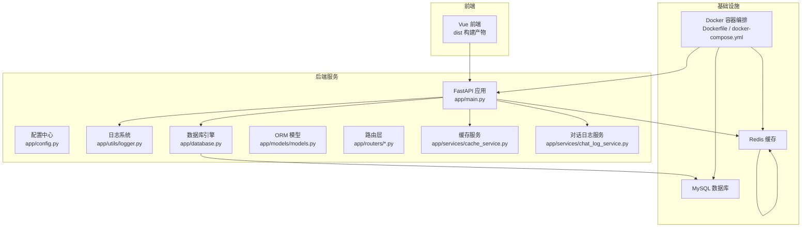
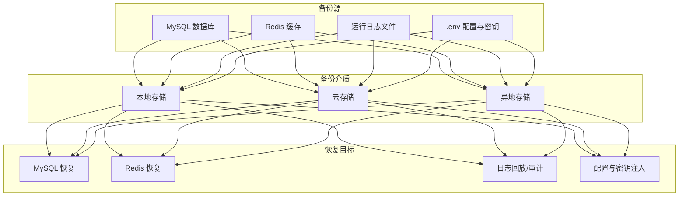
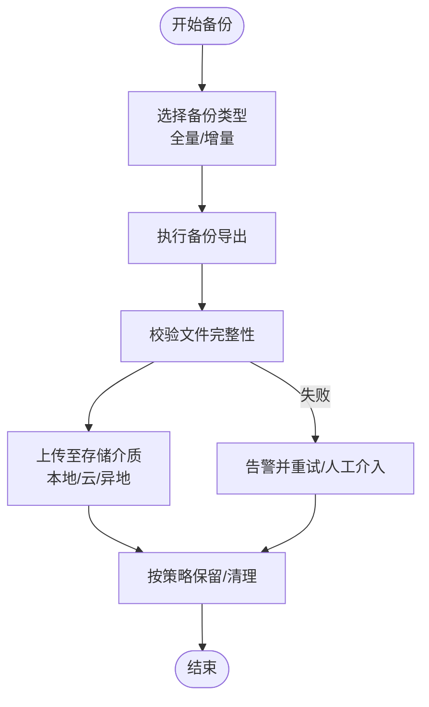
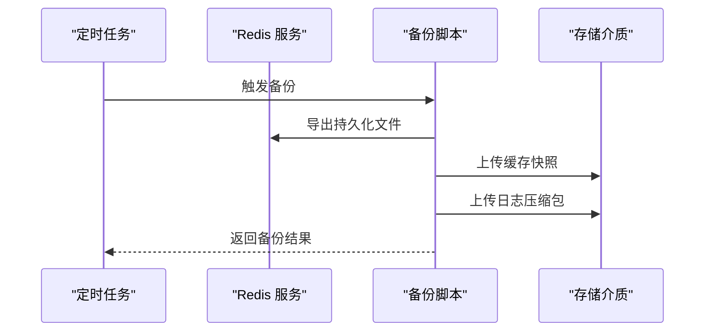
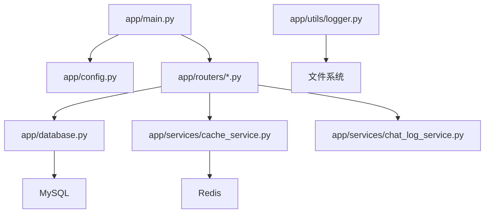

# 备份与恢复

<cite>
**本文引用的文件**
- [service/ai_assistant/app/main.py](file://service/ai_assistant/app/main.py)
- [service/ai_assistant/app/config.py](file://service/ai_assistant/app/config.py)
- [service/ai_assistant/app/database.py](file://service/ai_assistant/app/database.py)
- [service/ai_assistant/docker-compose.yml](file://service/ai_assistant/docker-compose.yml)
- [service/ai_assistant/Dockerfile](file://service/ai_assistant/Dockerfile)
- [service/ai_assistant/app/utils/logger.py](file://service/ai_assistant/app/utils/logger.py)
- [service/ai_assistant/app/models/models.py](file://service/ai_assistant/app/models/models.py)
- [service/ai_assistant/app/routers/admin.py](file://service/ai_assistant/app/routers/admin.py)
- [service/ai_assistant/app/services/cache_service.py](file://service/ai_assistant/app/services/cache_service.py)
- [service/ai_assistant/app/services/chat_log_service.py](file://service/ai_assistant/app/services/chat_log_service.py)
- [service/ai_assistant/app/utils/crypto.py](file://service/ai_assistant/app/utils/crypto.py)
</cite>

## 目录
1. [引言](#引言)
2. [项目结构](#项目结构)
3. [核心组件](#核心组件)
4. [架构总览](#架构总览)
5. [详细组件分析](#详细组件分析)
6. [依赖分析](#依赖分析)
7. [性能考虑](#性能考虑)
8. [故障排查指南](#故障排查指南)
9. [结论](#结论)
10. [附录](#附录)

## 引言
本文件面向“AI校园助手”系统，提供一套完整的备份与恢复策略文档。内容覆盖数据库备份、缓存与日志备份、配置与密钥备份、自动化脚本与调度、增量与全量备份组合、本地/云/异地存储策略、灾难恢复计划与演练、数据恢复流程与验证、备份安全与访问控制、以及备份监控与告警配置。目标是帮助运维团队建立可执行、可验证、可审计的备份体系，保障业务连续性与数据安全。

## 项目结构
AI校园助手采用前后端分离架构，后端基于FastAPI，使用MySQL作为主数据库，Redis作为缓存，日志落盘到服务端文件系统。容器化部署通过Docker与docker-compose编排，数据库与缓存以独立服务运行并持久化数据卷。

图表来源
- [service/ai_assistant/app/main.py:1-86](file://service/ai_assistant/app/main.py#L1-L86)
- [service/ai_assistant/app/config.py:1-113](file://service/ai_assistant/app/config.py#L1-L113)
- [service/ai_assistant/app/database.py:1-35](file://service/ai_assistant/app/database.py#L1-L35)
- [service/ai_assistant/docker-compose.yml:1-31](file://service/ai_assistant/docker-compose.yml#L1-L31)
- [service/ai_assistant/Dockerfile:1-49](file://service/ai_assistant/Dockerfile#L1-L49)

章节来源
- [service/ai_assistant/app/main.py:1-86](file://service/ai_assistant/app/main.py#L1-L86)
- [service/ai_assistant/app/config.py:1-113](file://service/ai_assistant/app/config.py#L1-L113)
- [service/ai_assistant/app/database.py:1-35](file://service/ai_assistant/app/database.py#L1-L35)
- [service/ai_assistant/docker-compose.yml:1-31](file://service/ai_assistant/docker-compose.yml#L1-L31)
- [service/ai_assistant/Dockerfile:1-49](file://service/ai_assistant/Dockerfile#L1-L49)

## 核心组件
- 应用入口与生命周期：负责应用启动、关闭、CORS配置与路由注册，便于在生命周期钩子中扩展备份任务。
- 配置中心：集中管理数据库、Redis、JWT、AES、缓存TTL等配置项，决定备份范围与参数。
- 数据库引擎：基于SQLAlchemy异步引擎连接MySQL，提供事务与会话管理，是备份与恢复的核心对象。
- 日志系统：统一落盘日志，便于审计与问题定位，亦可作为备份对象之一。
- 缓存服务：基于Redis，提供查询缓存与版本控制，需纳入备份与恢复范围。
- ORM模型：定义业务数据结构，是备份与恢复的对象集合。
- 路由与服务：暴露管理与查询接口，支撑备份数据的读取与校验。

章节来源
- [service/ai_assistant/app/main.py:1-86](file://service/ai_assistant/app/main.py#L1-L86)
- [service/ai_assistant/app/config.py:1-113](file://service/ai_assistant/app/config.py#L1-L113)
- [service/ai_assistant/app/database.py:1-35](file://service/ai_assistant/app/database.py#L1-L35)
- [service/ai_assistant/app/utils/logger.py:1-53](file://service/ai_assistant/app/utils/logger.py#L1-L53)
- [service/ai_assistant/app/services/cache_service.py:1-177](file://service/ai_assistant/app/services/cache_service.py#L1-L177)
- [service/ai_assistant/app/models/models.py:1-660](file://service/ai_assistant/app/models/models.py#L1-L660)

## 架构总览
下图展示备份与恢复在系统中的位置与交互关系，强调数据库、缓存、日志与配置四类数据的备份路径与恢复顺序。

图表来源
- [service/ai_assistant/app/config.py:19-100](file://service/ai_assistant/app/config.py#L19-L100)
- [service/ai_assistant/docker-compose.yml:5-24](file://service/ai_assistant/docker-compose.yml#L5-L24)
- [service/ai_assistant/app/utils/logger.py:17-46](file://service/ai_assistant/app/utils/logger.py#L17-L46)

## 详细组件分析

### 数据库备份策略
- 备份对象
  - MySQL数据库：包含管理员、课表、学生、成绩、聊天日志等业务表。
  - 备份粒度：按库或按表，结合业务变更频率选择全量/增量。
- 备份类型与组合
  - 全量备份：每周一次，用于基准快照；建议在低峰时段执行。
  - 增量备份：每日一次，基于binlog或逻辑导出差异数据。
  - 组合策略：全量+增量，缩短RTO/RPO，降低单次备份窗口压力。
- 自动化与调度
  - 使用定时任务（如cron）触发备份脚本，脚本内调用数据库客户端工具执行导出。
  - 备份完成后校验文件完整性与可用性，失败告警。
- 存储与保留
  - 本地归档：短期保留，快速恢复。
  - 云存储：长期保留，支持跨区域冗余。
  - 异地存储：满足灾难恢复需求，物理隔离风险。
- 恢复流程
  - 选择最近的全量备份作为基线，依次应用增量备份。
  - 校验一致性与数据完整性，修复异常后再对外提供服务。
- 安全与访问控制
  - 备份文件加密存储；最小权限原则访问备份介质。
  - 定期轮换密钥与访问凭证，审计访问日志。

图表来源
- [service/ai_assistant/app/config.py:86-91](file://service/ai_assistant/app/config.py#L86-L91)
- [service/ai_assistant/app/models/models.py:41-660](file://service/ai_assistant/app/models/models.py#L41-L660)

章节来源
- [service/ai_assistant/app/config.py:19-100](file://service/ai_assistant/app/config.py#L19-L100)
- [service/ai_assistant/app/models/models.py:41-660](file://service/ai_assistant/app/models/models.py#L41-L660)

### 缓存与日志备份策略
- 缓存备份
  - Redis持久化：利用容器编排中的数据卷实现持久化，定期导出RDB快照或BGGAZ持久化文件作为备份。
  - 版本控制：缓存服务内置课表版本键，管理员变更后递增版本，配合缓存失效策略，确保恢复后缓存一致性。
- 日志备份
  - 运行日志落盘到固定目录，按大小滚动与时间保留，可纳入备份范围。
  - 建议保留至少14天的日志，满足审计与问题追踪需求。
- 自动化与调度
  - 将缓存快照导出与日志打包纳入同一备份脚本，统一调度与告警。
- 存储与保留
  - 与数据库备份相同的三段式存储策略。
- 恢复流程
  - 恢复缓存：先恢复RDB/BGGAZ，再启动服务；确认版本键与业务一致性。
  - 恢复日志：按时间线回放，核对关键事件与错误堆栈。
- 安全与访问控制
  - 缓存与日志备份文件同样遵循加密与最小权限原则。

图表来源
- [service/ai_assistant/docker-compose.yml:16-17](file://service/ai_assistant/docker-compose.yml#L16-L17)
- [service/ai_assistant/app/services/cache_service.py:70-83](file://service/ai_assistant/app/services/cache_service.py#L70-L83)
- [service/ai_assistant/app/utils/logger.py:17-46](file://service/ai_assistant/app/utils/logger.py#L17-L46)

章节来源
- [service/ai_assistant/docker-compose.yml:16-17](file://service/ai_assistant/docker-compose.yml#L16-L17)
- [service/ai_assistant/app/services/cache_service.py:70-83](file://service/ai_assistant/app/services/cache_service.py#L70-L83)
- [service/ai_assistant/app/utils/logger.py:17-46](file://service/ai_assistant/app/utils/logger.py#L17-L46)

### 配置与密钥备份策略
- 备份对象
  - .env配置文件：包含数据库、Redis、JWT、AES、LLM等敏感配置。
  - 应用密钥：AES密钥、JWT密钥、盐值等。
- 备份方式
  - 配置文件与密钥单独加密备份，密钥与配置分离存储。
  - 采用硬件/软件密钥管理服务（KMS）进行密钥轮换与访问控制。
- 恢复流程
  - 恢复配置：解密后写入对应路径，重启应用使配置生效。
  - 恢复密钥：按版本恢复密钥材料，确保历史数据可解密。
- 安全与访问控制
  - 严格限制密钥访问权限，审计所有密钥操作。

章节来源
- [service/ai_assistant/app/config.py:6-113](file://service/ai_assistant/app/config.py#L6-L113)
- [service/ai_assistant/app/utils/crypto.py:17-73](file://service/ai_assistant/app/utils/crypto.py#L17-L73)

### 自动化备份脚本与调度
- 脚本设计要点
  - 统一入口：接收参数（备份类型、目标介质、是否加密）。
  - 并行处理：数据库、缓存、日志、配置并行导出，最后合并校验。
  - 失败重试：单个组件失败自动重试，超限后告警。
  - 结果上报：记录元数据（时间戳、大小、校验值、介质路径）。
- 调度配置
  - cron示例：每日凌晨2点执行增量备份；每周日凌晨3点执行全量备份。
  - 与容器编排集成：在容器内或宿主机上配置定时任务。
- 监控与告警
  - 监控指标：备份成功率、耗时、文件大小、校验失败次数。
  - 告警渠道：邮件/IM/短信，分级处理。

章节来源
- [service/ai_assistant/app/config.py:86-100](file://service/ai_assistant/app/config.py#L86-L100)
- [service/ai_assistant/app/utils/logger.py:17-46](file://service/ai_assistant/app/utils/logger.py#L17-L46)

### 增量备份与全量备份的选择与组合
- 选择依据
  - 全量备份：数据量适中、恢复简单、占用空间大。
  - 增量备份：节省空间与时间、恢复链较长、复杂度高。
- 组合策略
  - 以周为单位的全量+以日为单位的增量，形成“全量+N个增量”的恢复链。
  - 增量备份失败不影响全量基线，便于快速恢复。
- 恢复验证
  - 恢复链完整性校验，确保顺序正确与数据一致。

章节来源
- [service/ai_assistant/app/config.py:86-91](file://service/ai_assistant/app/config.py#L86-L91)

### 备份数据的存储与管理
- 本地备份：快速恢复、低延迟，适合短期保留。
- 云备份：弹性扩容、跨区域冗余，适合长期归档。
- 异地备份：物理隔离，应对区域性灾难。
- 策略建议
  - 本地保留7天，云上保留90天，异地保留180天以上。
  - 定期轮转与清理过期备份，避免资源浪费。

章节来源
- [service/ai_assistant/app/utils/logger.py:39-42](file://service/ai_assistant/app/utils/logger.py#L39-L42)

### 灾难恢复计划与演练
- DRP组成
  - 恢复目标：RTO/RPO指标、恢复优先级、职责分工。
  - 恢复策略：多介质并行恢复、分阶段验证。
  - 恢复流程：应急响应、数据恢复、服务验证、回切与复盘。
- 演练方法
  - 定期组织桌面推演与实机演练，覆盖网络中断、机房断电、数据损坏等场景。
  - 演练后形成报告，持续优化流程与工具。

章节来源
- [service/ai_assistant/app/main.py:36-49](file://service/ai_assistant/app/main.py#L36-L49)

### 数据恢复流程与验证
- 流程
  - 评估灾情与影响范围，确定恢复目标与介质来源。
  - 恢复数据库与缓存，启动应用并进行健康检查。
  - 执行数据一致性校验与功能回归测试。
  - 发布服务并持续监控。
- 验证步骤
  - 关键业务数据抽样比对。
  - 用户登录、课表查询、聊天日志等核心功能验证。
  - 日志与审计记录核对。

章节来源
- [service/ai_assistant/app/services/cache_service.py:70-83](file://service/ai_assistant/app/services/cache_service.py#L70-L83)
- [service/ai_assistant/app/services/chat_log_service.py:14-76](file://service/ai_assistant/app/services/chat_log_service.py#L14-L76)

### 备份数据的安全保护与访问控制
- 加密
  - 备份文件与密钥材料均需加密存储，采用强对称加密算法。
- 访问控制
  - 最小权限原则，基于角色的访问控制（RBAC）。
  - 审计所有访问与修改操作，保留不可抵赖日志。
- 密钥管理
  - 使用KMS或HSM进行密钥生成、轮换与销毁。
  - 密钥与配置分离，避免单点泄露。

章节来源
- [service/ai_assistant/app/utils/crypto.py:17-73](file://service/ai_assistant/app/utils/crypto.py#L17-L73)

### 备份监控与告警
- 指标
  - 备份成功率、耗时、失败原因分布、存储用量、校验失败数。
- 告警
  - 多级告警：轻微（邮件）、严重（IM）、紧急（电话）。
  - 自动化处置：部分失败自动重试，超限后人工接管。
- 可视化
  - 面板展示备份健康度与趋势，支持告警聚合与根因分析。

章节来源
- [service/ai_assistant/app/utils/logger.py:17-46](file://service/ai_assistant/app/utils/logger.py#L17-L46)

## 依赖分析
- 组件耦合
  - 应用入口依赖配置中心与路由模块，路由依赖数据库与缓存服务。
  - 缓存服务依赖Redis与配置中心，日志服务依赖文件系统。
- 外部依赖
  - MySQL与Redis作为外部服务，通过docker-compose进行编排与持久化。
- 循环依赖
  - 代码层面未发现循环导入，整体结构清晰。

图表来源
- [service/ai_assistant/app/main.py:12-86](file://service/ai_assistant/app/main.py#L12-L86)
- [service/ai_assistant/app/config.py:6-113](file://service/ai_assistant/app/config.py#L6-L113)
- [service/ai_assistant/app/database.py:1-35](file://service/ai_assistant/app/database.py#L1-L35)
- [service/ai_assistant/app/services/cache_service.py:1-177](file://service/ai_assistant/app/services/cache_service.py#L1-L177)
- [service/ai_assistant/app/services/chat_log_service.py:1-76](file://service/ai_assistant/app/services/chat_log_service.py#L1-L76)
- [service/ai_assistant/app/utils/logger.py:17-46](file://service/ai_assistant/app/utils/logger.py#L17-L46)

章节来源
- [service/ai_assistant/app/main.py:12-86](file://service/ai_assistant/app/main.py#L12-L86)
- [service/ai_assistant/app/config.py:6-113](file://service/ai_assistant/app/config.py#L6-L113)
- [service/ai_assistant/app/database.py:1-35](file://service/ai_assistant/app/database.py#L1-L35)
- [service/ai_assistant/app/services/cache_service.py:1-177](file://service/ai_assistant/app/services/cache_service.py#L1-L177)
- [service/ai_assistant/app/services/chat_log_service.py:1-76](file://service/ai_assistant/app/services/chat_log_service.py#L1-L76)
- [service/ai_assistant/app/utils/logger.py:17-46](file://service/ai_assistant/app/utils/logger.py#L17-L46)

## 性能考虑
- 备份窗口
  - 全量备份尽量安排在业务低峰时段，避免影响在线服务。
- 并行与压缩
  - 多介质并行导出，启用压缩减少存储占用。
- I/O与网络
  - 控制并发度，避免IO与网络拥塞；云存储采用分片上传与断点续传。
- 恢复效率
  - 通过版本化与索引优化恢复速度，缩短RTO。

## 故障排查指南
- 常见问题
  - 备份失败：检查磁盘空间、网络连通性、权限与密钥有效性。
  - 校验失败：重新导出或更换介质，核对哈希值。
  - 恢复异常：确认恢复链顺序与介质可用性，逐项验证。
- 工具与日志
  - 利用日志系统定位错误上下文，结合审计记录进行根因分析。
- 回滚与复盘
  - 失败回滚到上一个稳定版本，形成复盘报告并改进流程。

章节来源
- [service/ai_assistant/app/utils/logger.py:17-46](file://service/ai_assistant/app/utils/logger.py#L17-L46)

## 结论
通过建立“全量+增量”的备份组合、三段式存储策略、完善的自动化与监控体系，以及严格的灾难恢复计划与演练机制，AI校园助手能够在保障业务连续性的前提下，有效降低数据丢失风险，提升系统的可靠性与安全性。建议尽快落地备份脚本与调度，并持续优化流程与工具。

## 附录
- 关键配置参考
  - 数据库URL构造与Redis连接URL，用于备份脚本连接与恢复。
  - 缓存TTL与敏感查询判定，辅助恢复后缓存一致性校验。
- 建议的备份清单
  - MySQL数据库全量与增量备份文件
  - Redis持久化文件与版本键
  - 运行日志文件
  - .env配置与密钥材料
  - 备份元数据与校验文件

章节来源
- [service/ai_assistant/app/config.py:86-100](file://service/ai_assistant/app/config.py#L86-L100)
- [service/ai_assistant/app/services/cache_service.py:85-90](file://service/ai_assistant/app/services/cache_service.py#L85-L90)