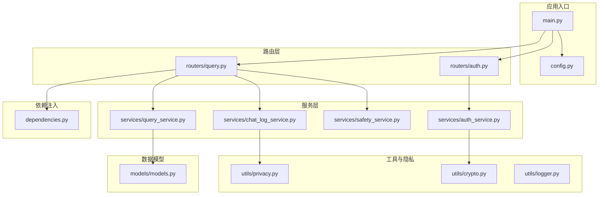
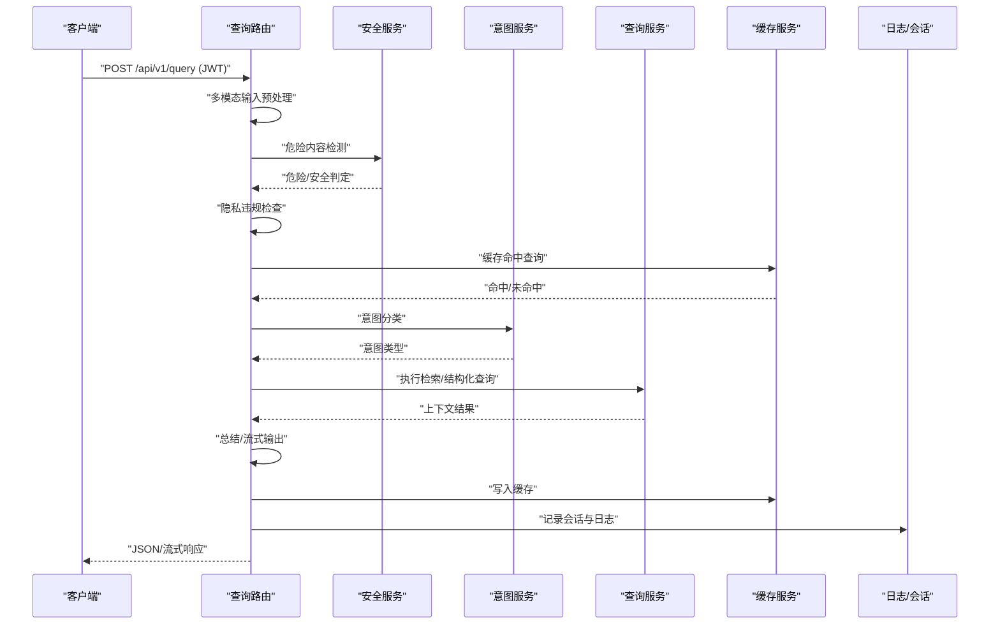
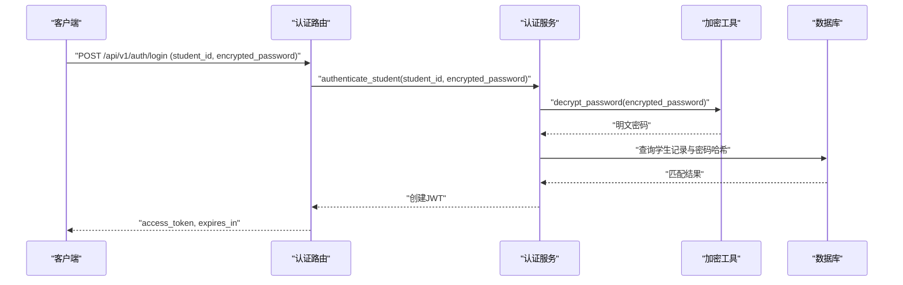
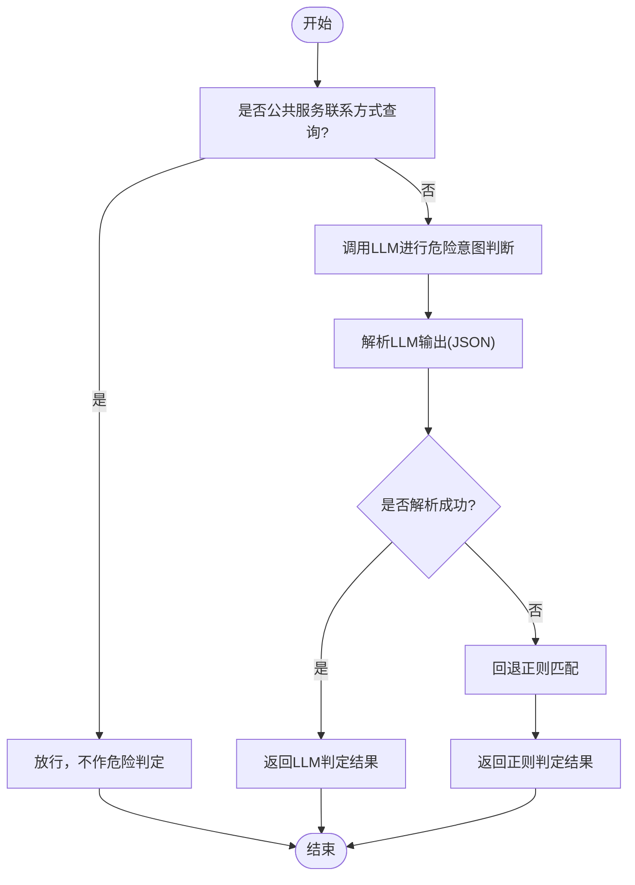
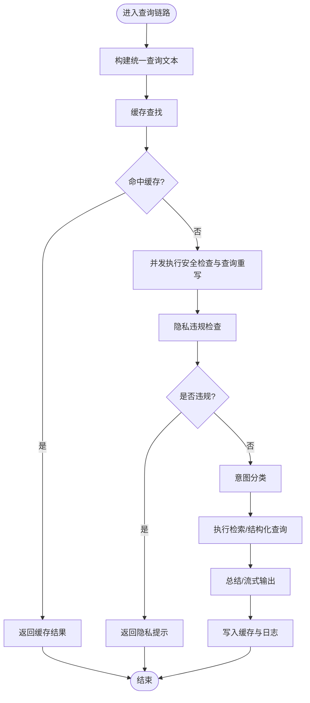
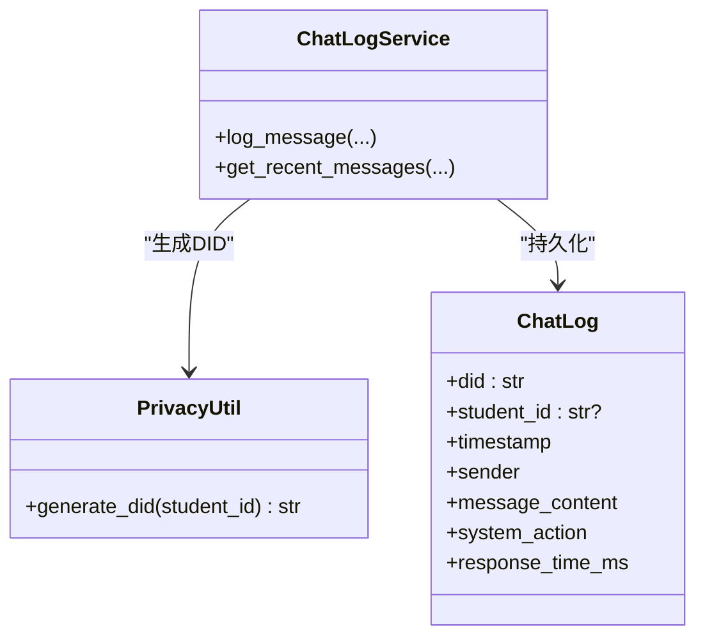
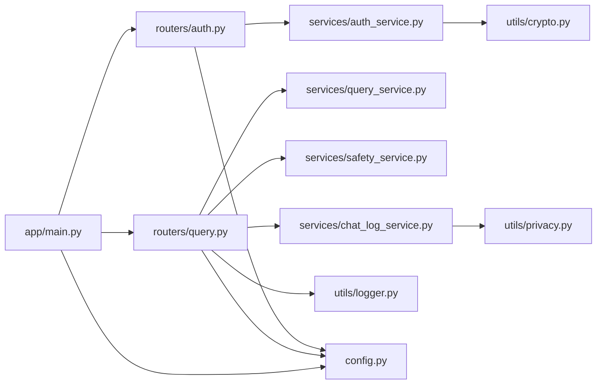

# AI服务安全

<cite>
**本文档引用的文件**
- [main.py](file://service/ai_assistant/app/main.py)
- [config.py](file://service/ai_assistant/app/config.py)
- [auth.py](file://service/ai_assistant/app/routers/auth.py)
- [auth_service.py](file://service/ai_assistant/app/services/auth_service.py)
- [crypto.py](file://service/ai_assistant/app/utils/crypto.py)
- [privacy.py](file://service/ai_assistant/app/utils/privacy.py)
- [logger.py](file://service/ai_assistant/app/utils/logger.py)
- [query.py](file://service/ai_assistant/app/routers/query.py)
- [query_service.py](file://service/ai_assistant/app/services/query_service.py)
- [safety_service.py](file://service/ai_assistant/app/services/safety_service.py)
- [chat_log_service.py](file://service/ai_assistant/app/services/chat_log_service.py)
- [models.py](file://service/ai_assistant/app/models/models.py)
- [dependencies.py](file://service/ai_assistant/app/dependencies.py)
</cite>

## 目录
1. [引言](#引言)
2. [项目结构](#项目结构)
3. [核心组件](#核心组件)
4. [架构总览](#架构总览)
5. [详细组件分析](#详细组件分析)
6. [依赖分析](#依赖分析)
7. [性能考量](#性能考量)
8. [故障排查指南](#故障排查指南)
9. [结论](#结论)
10. [附录](#附录)

## 引言
本文件聚焦于AI校园助手的AI服务集成安全，围绕外部AI服务的API密钥管理、请求安全验证、内容安全检查、调用超时与错误处理、数据隐私保护以及服务可用性与故障转移等方面，提供系统化的安全设计与实践说明。文档以代码为依据，结合架构图与流程图，帮助开发者与运维人员建立可落地的安全基线。

## 项目结构
后端采用FastAPI应用，按功能域划分路由、服务、工具与配置层，AI服务调用集中在查询链路中，配合安全与隐私工具完成端到端的安全保障。

**图表来源**
- [main.py:1-86](file://service/ai_assistant/app/main.py#L1-L86)
- [config.py:1-113](file://service/ai_assistant/app/config.py#L1-L113)
- [auth.py:1-102](file://service/ai_assistant/app/routers/auth.py#L1-L102)
- [query.py:1-788](file://service/ai_assistant/app/routers/query.py#L1-L788)
- [auth_service.py:1-253](file://service/ai_assistant/app/services/auth_service.py#L1-L253)
- [query_service.py:1-800](file://service/ai_assistant/app/services/query_service.py#L1-L800)
- [safety_service.py:1-163](file://service/ai_assistant/app/services/safety_service.py#L1-L163)
- [chat_log_service.py:1-76](file://service/ai_assistant/app/services/chat_log_service.py#L1-L76)
- [privacy.py:1-23](file://service/ai_assistant/app/utils/privacy.py#L1-L23)
- [crypto.py:1-73](file://service/ai_assistant/app/utils/crypto.py#L1-L73)
- [logger.py:1-53](file://service/ai_assistant/app/utils/logger.py#L1-L53)
- [models.py:1-660](file://service/ai_assistant/app/models/models.py#L1-L660)
- [dependencies.py:1-109](file://service/ai_assistant/app/dependencies.py#L1-L109)

**章节来源**
- [main.py:1-86](file://service/ai_assistant/app/main.py#L1-L86)
- [config.py:1-113](file://service/ai_assistant/app/config.py#L1-L113)

## 核心组件
- 配置与密钥管理：集中于配置类，包含JWT密钥、AES密钥、DID盐、阿里云DashScope与百炼API密钥、模型名称等。
- 认证与授权：JWT签发与校验、密码解密与哈希验证、管理员与学生角色分离。
- 安全检查：危险内容检测与隐私违规检测，支持LLM与正则双轨降级。
- 隐私保护：DID脱敏、会话历史隔离、日志字段策略。
- 查询链路：多模态输入预处理、意图分类、检索与结构化查询、总结与缓存、SSE流式输出。
- 日志与审计：统一日志落盘、关键事件记录、会话历史与聊天日志。

**章节来源**
- [config.py:6-113](file://service/ai_assistant/app/config.py#L6-L113)
- [auth_service.py:16-123](file://service/ai_assistant/app/services/auth_service.py#L16-L123)
- [safety_service.py:14-163](file://service/ai_assistant/app/services/safety_service.py#L14-L163)
- [privacy.py:9-23](file://service/ai_assistant/app/utils/privacy.py#L9-L23)
- [query.py:198-745](file://service/ai_assistant/app/routers/query.py#L198-L745)
- [chat_log_service.py:14-76](file://service/ai_assistant/app/services/chat_log_service.py#L14-L76)
- [logger.py:17-53](file://service/ai_assistant/app/utils/logger.py#L17-L53)

## 架构总览
AI服务集成安全贯穿认证、输入预处理、意图与检索、内容安全、输出与缓存、日志审计等环节。外部AI服务密钥通过配置类集中管理，调用路径中不暴露密钥明文；安全检查与隐私检查在查询链路早期执行，确保低风险流量直达缓存与总结；日志与会话历史采用DID与最小化字段策略，兼顾可追溯与隐私保护。

**图表来源**
- [query.py:207-745](file://service/ai_assistant/app/routers/query.py#L207-L745)
- [safety_service.py:84-144](file://service/ai_assistant/app/services/safety_service.py#L84-L144)
- [query_service.py:1-800](file://service/ai_assistant/app/services/query_service.py#L1-L800)

## 详细组件分析

### API密钥安全管理
- 集中式配置：密钥与模型参数统一在配置类中管理，避免硬编码与分散泄露。
- 环境变量加载：通过环境文件注入，生产环境务必禁用默认值并启用强密钥。
- 外部服务调用：AI服务调用通过配置类提供的模型名称与密钥常量，不暴露在路由或请求体中。

最佳实践
- 生产环境必须覆盖默认密钥与盐值，定期轮换。
- 为不同AI能力分配独立密钥与工作空间，便于审计与限权。
- 使用只读权限的最小授权原则，避免在配置中存放过长有效期的凭据。

**章节来源**
- [config.py:6-113](file://service/ai_assistant/app/config.py#L6-L113)
- [main.py:18-34](file://service/ai_assistant/app/main.py#L18-L34)

### 请求安全验证与访问控制
- JWT认证：路由依赖注入获取当前用户，解码并校验JWT，拒绝无效或过期令牌。
- 角色分离：学生端点仅允许student角色，管理员端点仅允许admin角色。
- 密码传输加密：前端使用AES-CBC加密密码，后端使用共享密钥解密，避免明文在网络传输。

**图表来源**
- [auth.py:24-52](file://service/ai_assistant/app/routers/auth.py#L24-L52)
- [auth_service.py:125-169](file://service/ai_assistant/app/services/auth_service.py#L125-L169)
- [crypto.py:39-73](file://service/ai_assistant/app/utils/crypto.py#L39-L73)

**章节来源**
- [auth.py:1-102](file://service/ai_assistant/app/routers/auth.py#L1-L102)
- [auth_service.py:16-123](file://service/ai_assistant/app/services/auth_service.py#L16-L123)
- [crypto.py:17-73](file://service/ai_assistant/app/utils/crypto.py#L17-L73)
- [dependencies.py:56-108](file://service/ai_assistant/app/dependencies.py#L56-L108)

### AI请求安全验证机制
- 时间戳与重放防护：当前实现未内置时间戳与签名机制。建议在网关或边缘层增加请求签名（如HMAC）与时间窗口校验，防止重放。
- 速率限制与熔断：建议在网关层引入限流与熔断策略，避免AI服务抖动影响整体稳定性。
- 超时控制：查询链路中对AI服务调用应设置明确超时阈值，失败时快速降级。

注意
- 当前代码未实现请求签名与时间戳校验，应在上游网关或API层补齐。

**章节来源**
- [query.py:142-151](file://service/ai_assistant/app/routers/query.py#L142-L151)

### 内容安全检查
- 危险内容检测：使用LLM进行危险意图判断，若LLM不可用则回退至正则匹配，确保安全不降级。
- 公共服务查询豁免：对公共服务联系方式查询进行豁免，避免误判。
- 隐私违规检测：检测是否尝试查询他人学号，发现后阻断并提示。

**图表来源**
- [safety_service.py:84-144](file://service/ai_assistant/app/services/safety_service.py#L84-L144)

**章节来源**
- [safety_service.py:14-163](file://service/ai_assistant/app/services/safety_service.py#L14-L163)

### AI输出的内容安全与合规
- 输出前拦截：对危险内容直接返回干预提示，不进入总结与缓存。
- 隐私保护：对隐私违规查询，仅返回合规提示，不泄露他人数据。
- 日志策略：危险内容与干预动作在日志中标记，非危险内容使用DID存储，避免明文ID落盘。

**章节来源**
- [query.py:354-471](file://service/ai_assistant/app/routers/query.py#L354-L471)
- [chat_log_service.py:14-55](file://service/ai_assistant/app/services/chat_log_service.py#L14-L55)

### 超时控制与错误处理策略
- 流式输出：使用SSE流式输出，尽早释放数据库连接，避免长时间占用。
- 错误映射：将底层异常映射为友好的公共错误提示，避免泄露内部细节。
- 缓存降级：Redis异常时降级到数据库历史，保证可用性。

**图表来源**
- [query.py:207-745](file://service/ai_assistant/app/routers/query.py#L207-L745)

**章节来源**
- [query.py:115-126](file://service/ai_assistant/app/routers/query.py#L115-L126)
- [query.py:142-151](file://service/ai_assistant/app/routers/query.py#L142-L151)
- [query.py:654-744](file://service/ai_assistant/app/routers/query.py#L654-L744)

### 数据隐私保护
- DID脱敏：使用稳定的哈希生成DID，替代真实学号存储于聊天日志，实现匿名化与可追溯性。
- 最小化日志：非危险内容不存储原始学号，仅存储DID；危险内容才保留原始ID以便干预。
- 会话隔离：Redis按会话维度隔离历史，避免并发会话串话。

**图表来源**
- [privacy.py:9-23](file://service/ai_assistant/app/utils/privacy.py#L9-L23)
- [chat_log_service.py:14-76](file://service/ai_assistant/app/services/chat_log_service.py#L14-L76)
- [models.py:641-660](file://service/ai_assistant/app/models/models.py#L641-L660)

**章节来源**
- [privacy.py:9-23](file://service/ai_assistant/app/utils/privacy.py#L9-L23)
- [chat_log_service.py:14-55](file://service/ai_assistant/app/services/chat_log_service.py#L14-L55)
- [models.py:641-660](file://service/ai_assistant/app/models/models.py#L641-L660)

### AI模型使用的数据隐私与训练数据脱敏
- 推理数据保护：查询链路中仅传递必要的上下文与查询文本，避免携带原始学号；日志中使用DID。
- 训练数据脱敏：项目未直接涉及训练数据管理，建议在知识库与检索数据中实施脱敏策略（如去除学号、姓名等标识信息）。

**章节来源**
- [query.py:227-274](file://service/ai_assistant/app/routers/query.py#L227-L274)
- [chat_log_service.py:26-34](file://service/ai_assistant/app/services/chat_log_service.py#L26-L34)

### AI服务可用性与故障转移
- 缓存降级：Redis异常时降级到数据库历史，保证会话可用性。
- 意图分类降级：意图分类失败时回退到向量检索，避免阻塞主流程。
- 错误映射：将底层异常映射为通用提示，避免泄露内部细节。

**章节来源**
- [query.py:281-342](file://service/ai_assistant/app/routers/query.py#L281-L342)
- [query.py:495-499](file://service/ai_assistant/app/routers/query.py#L495-L499)

## 依赖分析
- 组件耦合：路由依赖服务层，服务层依赖工具与配置；日志与隐私工具被广泛使用。
- 外部依赖：DashScope、百炼检索、LangChain、Redis、SQLAlchemy。
- 循环依赖：未见循环导入；各模块职责清晰。

**图表来源**
- [auth.py:1-102](file://service/ai_assistant/app/routers/auth.py#L1-L102)
- [query.py:1-788](file://service/ai_assistant/app/routers/query.py#L1-L788)
- [auth_service.py:1-253](file://service/ai_assistant/app/services/auth_service.py#L1-L253)
- [query_service.py:1-800](file://service/ai_assistant/app/services/query_service.py#L1-L800)
- [safety_service.py:1-163](file://service/ai_assistant/app/services/safety_service.py#L1-L163)
- [chat_log_service.py:1-76](file://service/ai_assistant/app/services/chat_log_service.py#L1-L76)
- [crypto.py:1-73](file://service/ai_assistant/app/utils/crypto.py#L1-L73)
- [privacy.py:1-23](file://service/ai_assistant/app/utils/privacy.py#L1-L23)
- [logger.py:1-53](file://service/ai_assistant/app/utils/logger.py#L1-L53)
- [config.py:1-113](file://service/ai_assistant/app/config.py#L1-L113)
- [main.py:1-86](file://service/ai_assistant/app/main.py#L1-L86)

**章节来源**
- [dependencies.py:1-109](file://service/ai_assistant/app/dependencies.py#L1-L109)

## 性能考量
- 并发优化：安全检查与查询重写并行执行，缩短端到端延迟。
- 缓存策略：针对敏感与普通查询设置不同TTL，提升热点命中率。
- 流式输出：SSE流式输出避免一次性拼接大文本，降低内存峰值。
- 数据库连接：在流式阶段主动回滚会话，尽快归还连接池。

**章节来源**
- [query.py:347-353](file://service/ai_assistant/app/routers/query.py#L347-L353)
- [query.py:654-658](file://service/ai_assistant/app/routers/query.py#L654-L658)
- [config.py:81-84](file://service/ai_assistant/app/config.py#L81-L84)

## 故障排查指南
- 密钥与配置
  - 检查环境变量是否正确注入，确认未使用默认密钥。
  - 核对模型名称与外部服务端点配置。
- 认证失败
  - 核对JWT签名算法与密钥一致性。
  - 检查密码加密格式与解密密钥长度。
- 内容安全拦截
  - 若误判危险内容，检查LLM提示词与温度参数；必要时调整正则规则。
  - 隐私违规提示频繁出现，检查用户输入是否包含学号关键词。
- 查询链路异常
  - 查看SSE错误映射与公共提示，定位底层异常类型。
  - Redis异常时观察历史降级路径是否生效。
- 日志审计
  - 关注危险标记与干预动作的日志条目，核对DID与会话ID。

**章节来源**
- [main.py:25-34](file://service/ai_assistant/app/main.py#L25-L34)
- [auth_service.py:125-169](file://service/ai_assistant/app/services/auth_service.py#L125-L169)
- [safety_service.py:117-144](file://service/ai_assistant/app/services/safety_service.py#L117-L144)
- [query.py:142-151](file://service/ai_assistant/app/routers/query.py#L142-L151)
- [logger.py:17-53](file://service/ai_assistant/app/utils/logger.py#L17-L53)

## 结论
本项目在AI服务集成安全方面建立了较为完善的基线：集中式密钥管理、JWT认证与密码传输加密、危险内容与隐私违规的双重检查、DID脱敏与最小化日志、并发优化与缓存降级。建议进一步在网关层补充请求签名与时序校验，完善超时与熔断策略，并持续优化安全规则与日志审计，以满足更严格的合规与安全要求。

## 附录
- 关键配置项
  - JWT密钥与算法、AES密钥、DID盐、外部AI服务密钥与端点、模型名称、缓存TTL。
- 建议增强
  - 请求签名与时间戳校验（网关层）。
  - 速率限制与熔断策略。
  - 更细粒度的访问控制与审计日志。

**章节来源**
- [config.py:6-113](file://service/ai_assistant/app/config.py#L6-L113)