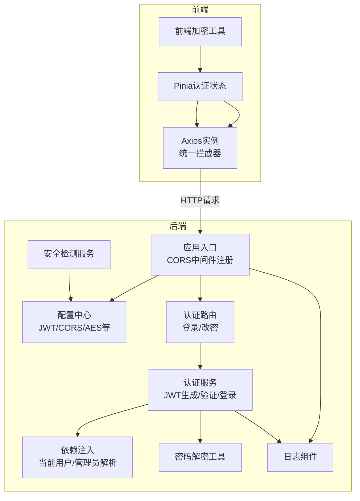
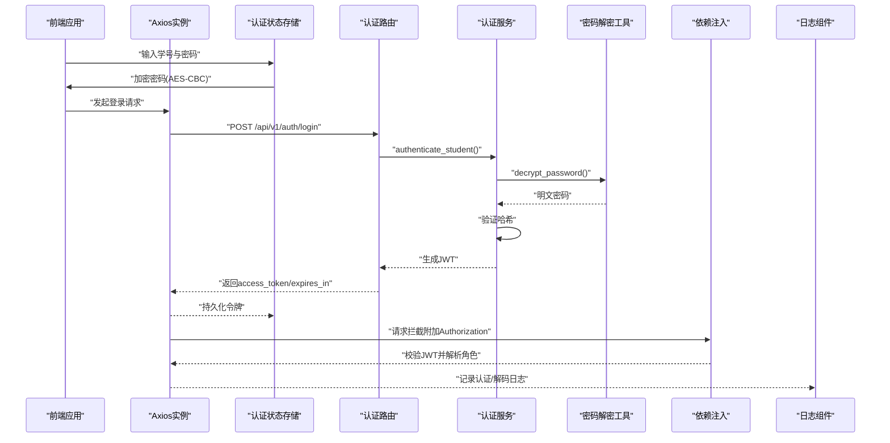
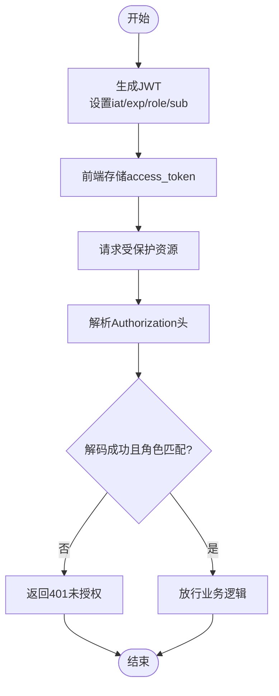
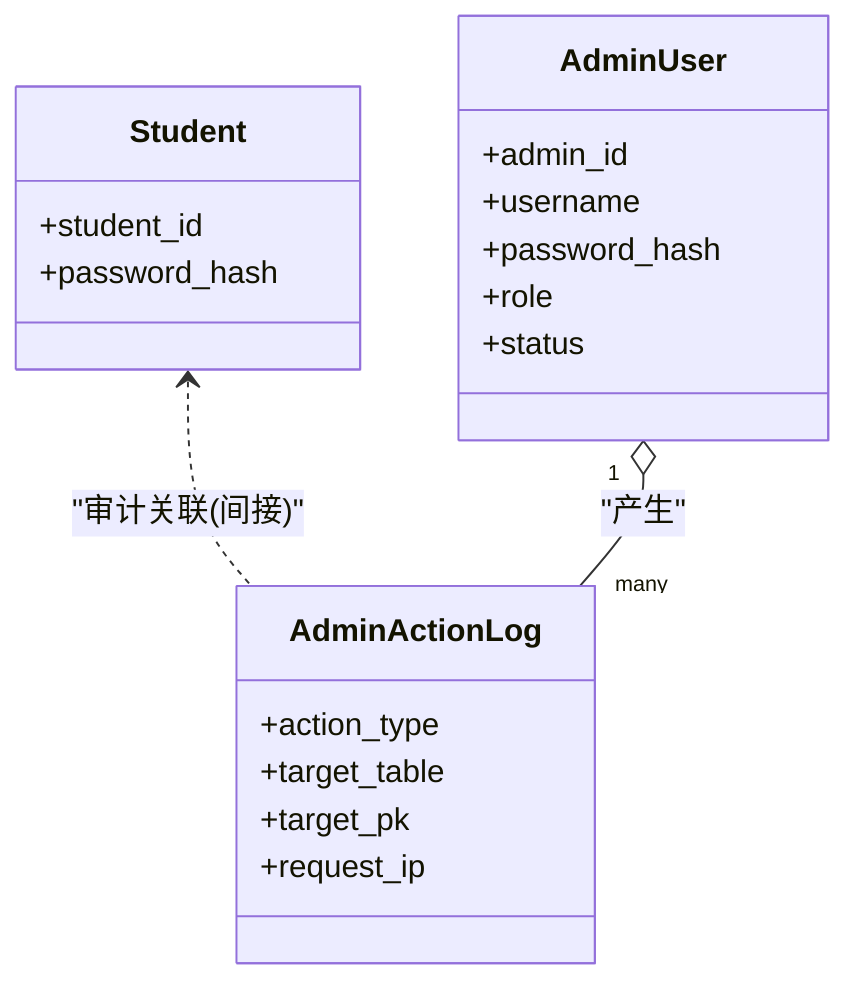
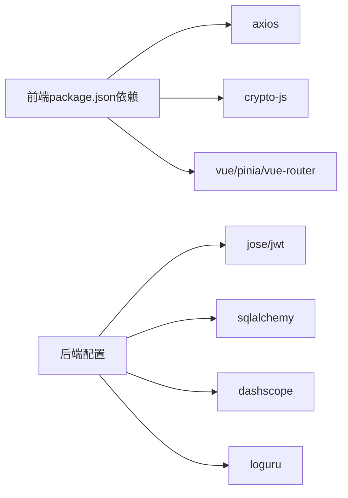

# API安全

<cite>
**本文引用的文件**
- [service/ai_assistant/app/main.py](file://service/ai_assistant/app/main.py)
- [service/ai_assistant/app/config.py](file://service/ai_assistant/app/config.py)
- [service/ai_assistant/app/routers/auth.py](file://service/ai_assistant/app/routers/auth.py)
- [service/ai_assistant/app/services/auth_service.py](file://service/ai_assistant/app/services/auth_service.py)
- [service/ai_assistant/app/utils/crypto.py](file://service/ai_assistant/app/utils/crypto.py)
- [service/ai_assistant/app/dependencies.py](file://service/ai_assistant/app/dependencies.py)
- [service/ai_assistant/app/models/models.py](file://service/ai_assistant/app/models/models.py)
- [service/ai_assistant/app/schemas/auth.py](file://service/ai_assistant/app/schemas/auth.py)
- [service/ai_assistant/app/utils/logger.py](file://service/ai_assistant/app/utils/logger.py)
- [service/ai_assistant/app/services/safety_service.py](file://service/ai_assistant/app/services/safety_service.py)
- [frontend/ai_assistant/src/utils/crypto.js](file://frontend/ai_assistant/src/utils/crypto.js)
- [frontend/ai_assistant/src/stores/auth.js](file://frontend/ai_assistant/src/stores/auth.js)
- [frontend/ai_assistant/src/api/http.js](file://frontend/ai_assistant/src/api/http.js)
- [frontend/ai_assistant/package.json](file://frontend/ai_assistant/package.json)
</cite>

## 目录
1. [引言](#引言)
2. [项目结构](#项目结构)
3. [核心组件](#核心组件)
4. [架构总览](#架构总览)
5. [详细组件分析](#详细组件分析)
6. [依赖分析](#依赖分析)
7. [性能考量](#性能考量)
8. [故障排查指南](#故障排查指南)
9. [结论](#结论)
10. [附录](#附录)

## 引言
本文件面向AI校园助手的API安全，系统化梳理并解释以下方面：
- JWT令牌认证机制：生成、验证与访问控制策略
- API访问控制：基于角色的权限控制与资源访问限制
- CORS跨域资源共享的安全配置
- API安全最佳实践：请求频率限制、IP白名单、请求签名验证等
- API版本控制与向后兼容性的安全考虑
- API监控与审计日志、异常请求的自动防护机制

## 项目结构
后端采用FastAPI框架，按功能模块组织路由与服务层；前端使用Vue 3 + Pinia + Axios，统一通过Axios拦截器附加认证头并处理401自动登出。

图表来源
- [service/ai_assistant/app/main.py:52-86](file://service/ai_assistant/app/main.py#L52-L86)
- [service/ai_assistant/app/config.py:6-113](file://service/ai_assistant/app/config.py#L6-L113)
- [service/ai_assistant/app/routers/auth.py:21-102](file://service/ai_assistant/app/routers/auth.py#L21-L102)
- [service/ai_assistant/app/services/auth_service.py:45-123](file://service/ai_assistant/app/services/auth_service.py#L45-L123)
- [service/ai_assistant/app/utils/crypto.py:39-73](file://service/ai_assistant/app/utils/crypto.py#L39-L73)
- [service/ai_assistant/app/dependencies.py:56-108](file://service/ai_assistant/app/dependencies.py#L56-L108)
- [service/ai_assistant/app/utils/logger.py:17-53](file://service/ai_assistant/app/utils/logger.py#L17-L53)
- [service/ai_assistant/app/services/safety_service.py:84-144](file://service/ai_assistant/app/services/safety_service.py#L84-L144)
- [frontend/ai_assistant/src/api/http.js:10-49](file://frontend/ai_assistant/src/api/http.js#L10-L49)
- [frontend/ai_assistant/src/stores/auth.js:17-77](file://frontend/ai_assistant/src/stores/auth.js#L17-L77)
- [frontend/ai_assistant/src/utils/crypto.js:26-40](file://frontend/ai_assistant/src/utils/crypto.js#L26-L40)

章节来源
- [service/ai_assistant/app/main.py:52-86](file://service/ai_assistant/app/main.py#L52-L86)
- [service/ai_assistant/app/config.py:6-113](file://service/ai_assistant/app/config.py#L6-L113)
- [frontend/ai_assistant/src/api/http.js:10-49](file://frontend/ai_assistant/src/api/http.js#L10-L49)
- [frontend/ai_assistant/src/stores/auth.js:17-77](file://frontend/ai_assistant/src/stores/auth.js#L17-L77)
- [frontend/ai_assistant/src/utils/crypto.js:26-40](file://frontend/ai_assistant/src/utils/crypto.js#L26-L40)

## 核心组件
- JWT与认证
  - 令牌生成：后端根据配置生成JWT，包含子(subject)、角色(role)、签发时间(iat)与过期时间(exp)等声明。
  - 令牌验证：依赖注入层解析Authorization Bearer头，调用认证服务进行解码与校验，并区分学生与管理员角色。
  - 密码传输安全：前端使用AES-CBC加密密码，后端解密后再做哈希验证，避免明文密码在网络中传输。
- CORS配置
  - 后端通过CORS中间件允许特定来源、凭证、方法与头部；生产环境建议显式限定allow_origins。
- 日志与审计
  - 统一日志组件落盘，记录认证、令牌解码、安全检测等关键事件，便于审计与追踪。
- 安全检测
  - 提供危险内容检测与隐私违规检测，支持公共服务查询放行与正则/LLM双重降级策略。

章节来源
- [service/ai_assistant/app/services/auth_service.py:45-123](file://service/ai_assistant/app/services/auth_service.py#L45-L123)
- [service/ai_assistant/app/dependencies.py:56-108](file://service/ai_assistant/app/dependencies.py#L56-L108)
- [service/ai_assistant/app/utils/crypto.py:39-73](file://service/ai_assistant/app/utils/crypto.py#L39-L73)
- [service/ai_assistant/app/main.py:70-76](file://service/ai_assistant/app/main.py#L70-L76)
- [service/ai_assistant/app/utils/logger.py:17-53](file://service/ai_assistant/app/utils/logger.py#L17-L53)
- [service/ai_assistant/app/services/safety_service.py:84-144](file://service/ai_assistant/app/services/safety_service.py#L84-L144)

## 架构总览
下图展示从前端到后端的关键交互路径，包括认证、令牌传递与安全检测。

图表来源
- [service/ai_assistant/app/routers/auth.py:24-52](file://service/ai_assistant/app/routers/auth.py#L24-L52)
- [service/ai_assistant/app/services/auth_service.py:125-169](file://service/ai_assistant/app/services/auth_service.py#L125-L169)
- [service/ai_assistant/app/utils/crypto.py:39-73](file://service/ai_assistant/app/utils/crypto.py#L39-L73)
- [service/ai_assistant/app/dependencies.py:56-72](file://service/ai_assistant/app/dependencies.py#L56-L72)
- [frontend/ai_assistant/src/stores/auth.js:29-43](file://frontend/ai_assistant/src/stores/auth.js#L29-L43)
- [frontend/ai_assistant/src/api/http.js:19-34](file://frontend/ai_assistant/src/api/http.js#L19-L34)

## 详细组件分析

### JWT令牌认证机制
- 令牌生成
  - 学生令牌：包含subject为学号、role为student、iat/exp等声明，使用配置的算法与密钥签名。
  - 管理员令牌：包含admin_id、username、role为admin等声明。
- 令牌验证
  - 通用依赖注入解析Authorization Bearer头，分别调用学生/管理员解码函数，校验role与subject有效性。
  - 解码失败或角色不匹配时返回401未授权。
- 刷新流程
  - 当前实现未提供标准的refresh token刷新接口；建议新增独立刷新端点，签发新的短期访问令牌，并使旧令牌失效（结合黑名单或短过期时间策略）。

图表来源
- [service/ai_assistant/app/services/auth_service.py:45-96](file://service/ai_assistant/app/services/auth_service.py#L45-L96)
- [service/ai_assistant/app/dependencies.py:56-72](file://service/ai_assistant/app/dependencies.py#L56-L72)

章节来源
- [service/ai_assistant/app/services/auth_service.py:45-123](file://service/ai_assistant/app/services/auth_service.py#L45-L123)
- [service/ai_assistant/app/dependencies.py:56-108](file://service/ai_assistant/app/dependencies.py#L56-L108)

### API访问控制策略（RBAC与资源限制）
- 角色与权限
  - 学生端点：依赖注入解析学生令牌，校验role为student，禁止非学生令牌访问。
  - 管理端点：依赖注入解析管理员令牌，校验role为admin，且管理员账户状态为active。
- 资源访问限制
  - 当前路由层未显式实现细粒度资源级权限（如仅允许修改本人密码），但业务层已在密码修改端点强制校验student_id一致性，防止越权。
- 建议增强
  - 引入装饰器或中间件统一标注资源访问规则（如@require_role、@require_owner）。
  - 对敏感操作增加审计日志记录（含请求IP、目标主键等）。

图表来源
- [service/ai_assistant/app/models/models.py:41-112](file://service/ai_assistant/app/models/models.py#L41-L112)

章节来源
- [service/ai_assistant/app/routers/auth.py:61-101](file://service/ai_assistant/app/routers/auth.py#L61-L101)
- [service/ai_assistant/app/dependencies.py:75-108](file://service/ai_assistant/app/dependencies.py#L75-L108)
- [service/ai_assistant/app/models/models.py:41-112](file://service/ai_assistant/app/models/models.py#L41-L112)

### CORS跨域资源共享的安全配置
- 当前配置
  - 允许origins来自配置项，允许凭证与通配方法/头部。
- 生产建议
  - 将allow_origins限定为具体域名，避免使用通配。
  - 显式列出允许的方法与头部，减少预检开销。
  - 结合HTTPS与SameSite Cookie策略，进一步降低CSRF风险。

章节来源
- [service/ai_assistant/app/main.py:70-76](file://service/ai_assistant/app/main.py#L70-L76)
- [service/ai_assistant/app/config.py:103-110](file://service/ai_assistant/app/config.py#L103-L110)

### API安全最佳实践
- 请求频率限制
  - 建议在网关或中间件层引入速率限制（如基于IP或令牌维度），防止暴力破解与滥用。
- IP白名单
  - 可在反向代理或WAF层配置可信来源IP列表，仅放行白名单内请求。
- 请求签名验证
  - 对关键接口可引入时间戳+随机nonce+签名的机制，结合服务端重放窗口与密钥验证。
- 传输加密
  - 强制HTTPS，TLS版本与套件按安全基线配置。
- 输入校验与清理
  - 对所有输入参数进行严格校验与最小权限原则，避免注入与越权。
- 令牌安全
  - 短有效期、定期轮换密钥、启用HTTPS-only SameSite Cookie（若使用Cookie存储）。

[本节为通用指导，无需特定文件引用]

### API版本控制与向后兼容性
- 版本策略
  - 路由前缀采用/v1，便于未来扩展/v2而不破坏现有客户端。
- 向后兼容
  - 字段变更遵循兼容性原则（新增字段保持默认值、避免删除必要字段），并在schema层保留兼容转换逻辑。
- 安全考虑
  - 旧版本接口下线前保留可观测与告警，逐步迁移客户端至新版本。

章节来源
- [service/ai_assistant/app/routers/auth.py:21](file://service/ai_assistant/app/routers/auth.py#L21)
- [service/ai_assistant/app/schemas/auth.py:14-42](file://service/ai_assistant/app/schemas/auth.py#L14-L42)

### API监控与审计日志、异常防护
- 日志与审计
  - 统一日志组件落盘，记录认证、令牌解码、安全检测等关键事件，便于审计与追踪。
  - 管理员行为可通过AdminActionLog表记录，包含操作类型、目标表与主键、请求IP等。
- 异常请求防护
  - 危险内容检测：结合LLM与正则，支持公共服务查询放行与降级策略。
  - 隐私违规检测：识别试图查询他人学号的行为并阻断。
- 建议增强
  - 引入实时告警（如异常登录、频繁失败、高危关键词触发）。
  - 对异常IP与异常用户行为建立临时封禁或二次验证机制。

章节来源
- [service/ai_assistant/app/utils/logger.py:17-53](file://service/ai_assistant/app/utils/logger.py#L17-L53)
- [service/ai_assistant/app/models/models.py:86-112](file://service/ai_assistant/app/models/models.py#L86-L112)
- [service/ai_assistant/app/services/safety_service.py:84-144](file://service/ai_assistant/app/services/safety_service.py#L84-L144)

## 依赖分析
- 前端依赖
  - Axios用于HTTP请求与拦截器，CryptoJS用于AES加密，Pinia用于状态管理。
- 后端依赖
  - FastAPI提供路由与中间件；Pydantic Settings管理配置；JWKS用于JWT编解码；SQLAlchemy用于ORM；DashScope用于安全检测LLM。

图表来源
- [frontend/ai_assistant/package.json:11-23](file://frontend/ai_assistant/package.json#L11-L23)
- [service/ai_assistant/app/config.py:6-113](file://service/ai_assistant/app/config.py#L6-L113)

章节来源
- [frontend/ai_assistant/package.json:11-23](file://frontend/ai_assistant/package.json#L11-L23)
- [service/ai_assistant/app/config.py:6-113](file://service/ai_assistant/app/config.py#L6-L113)

## 性能考量
- JWT解码成本低，适合高频认证场景；建议缩短令牌有效期并配合快速重试策略。
- AES解密在后端执行，前端仅负责加密，整体延迟可控。
- 日志落盘采用异步队列，避免阻塞请求处理。
- 安全检测LLM调用建议缓存命中与降级策略，减少超时影响。

[本节为通用指导，无需特定文件引用]

## 故障排查指南
- 常见问题
  - 401未授权：检查Authorization头是否正确附加、令牌是否过期、角色是否匹配。
  - 密码错误：确认前端加密密钥与后端一致、加密格式符合“iv_base64:ciphertext_base64”。
  - CORS失败：核对CORS allow_origins配置，生产环境避免通配。
  - 安全检测误报：调整正则阈值或提示LLM更准确的prompt。
- 定位手段
  - 查看运行日志文件，定位认证、解码与安全检测关键步骤。
  - 在依赖注入层增加更详细的异常堆栈记录，便于快速定位。

章节来源
- [service/ai_assistant/app/dependencies.py:56-108](file://service/ai_assistant/app/dependencies.py#L56-L108)
- [service/ai_assistant/app/utils/crypto.py:39-73](file://service/ai_assistant/app/utils/crypto.py#L39-L73)
- [service/ai_assistant/app/main.py:70-76](file://service/ai_assistant/app/main.py#L70-L76)
- [service/ai_assistant/app/utils/logger.py:17-53](file://service/ai_assistant/app/utils/logger.py#L17-L53)

## 结论
本项目在认证与传输安全方面具备良好基础：JWT令牌、AES密码传输、CORS配置与统一日志。建议下一步完善令牌刷新、细粒度RBAC、速率限制与IP白名单、请求签名验证，并强化安全检测的可观测与告警能力，以满足生产环境的安全要求。

[本节为总结性内容，无需特定文件引用]

## 附录
- 前端加密与拦截器
  - 前端使用CryptoJS进行AES-CBC加密，格式为URL安全Base64拼接的iv与密文。
  - Axios请求拦截器自动附加Authorization头，响应拦截器处理401自动登出。
- 配置要点
  - JWT密钥、算法、过期时间与AES密钥均来自配置中心，生产环境务必替换默认值。

章节来源
- [frontend/ai_assistant/src/utils/crypto.js:26-40](file://frontend/ai_assistant/src/utils/crypto.js#L26-L40)
- [frontend/ai_assistant/src/api/http.js:19-47](file://frontend/ai_assistant/src/api/http.js#L19-L47)
- [service/ai_assistant/app/config.py:32-43](file://service/ai_assistant/app/config.py#L32-L43)