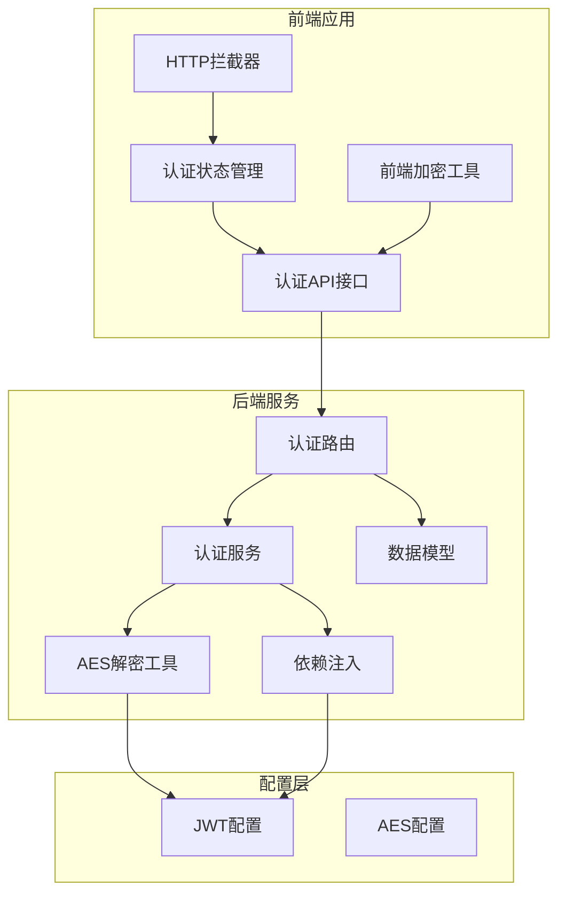
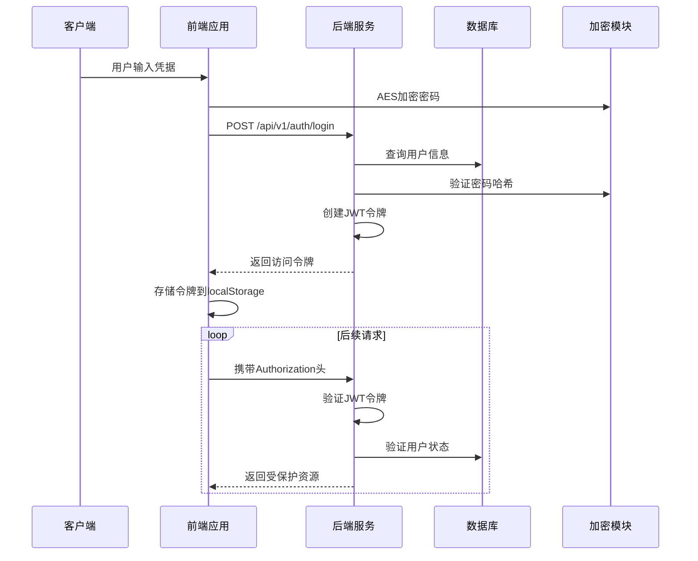
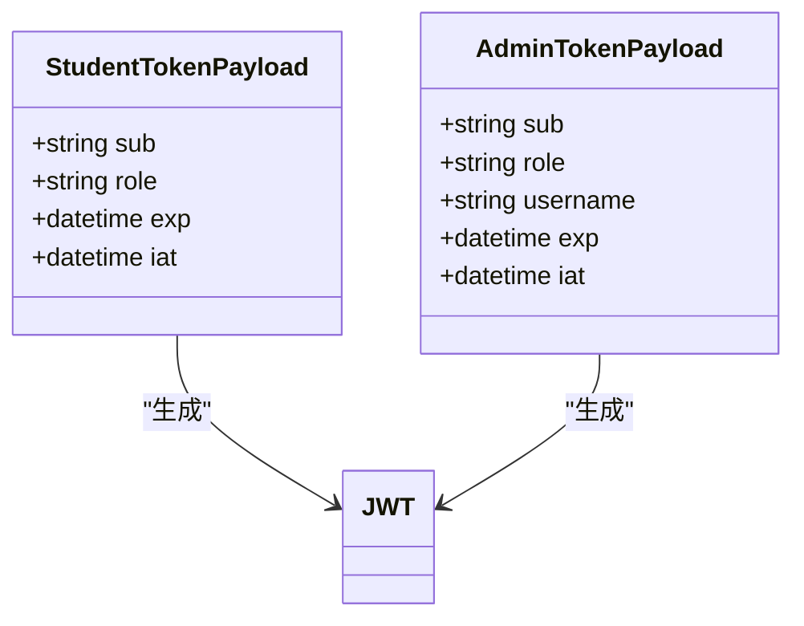
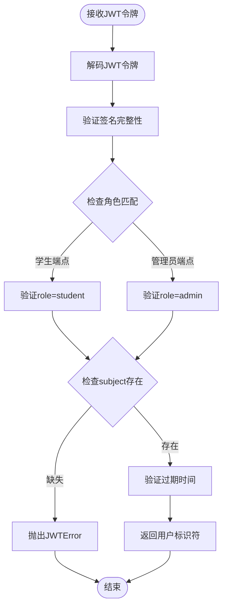
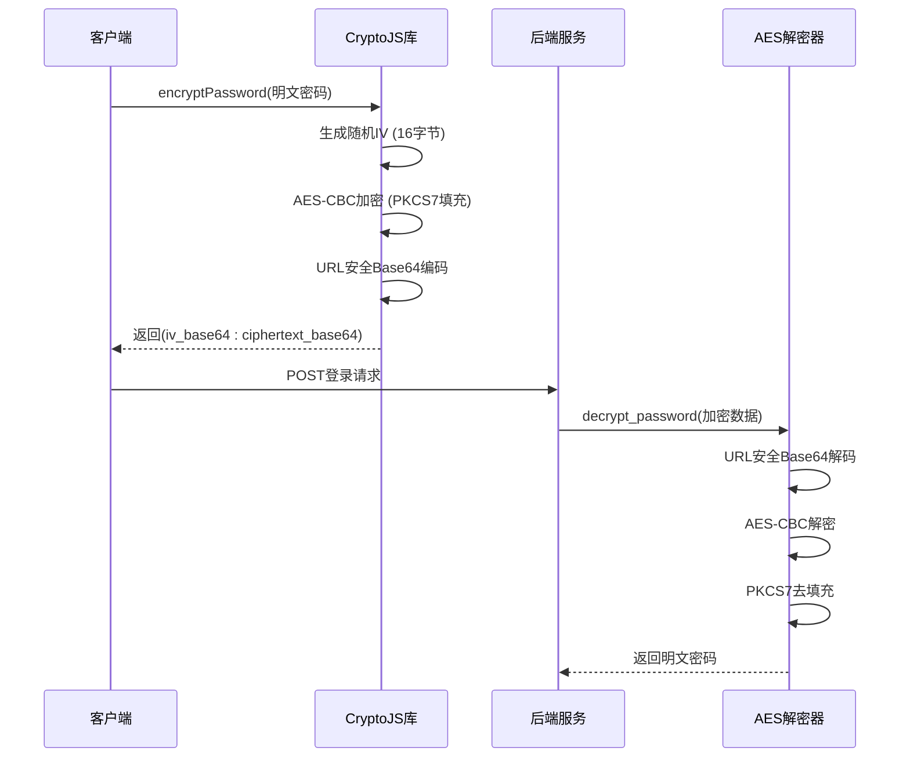
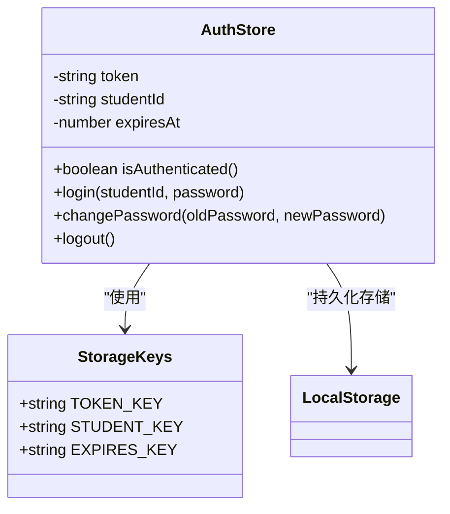
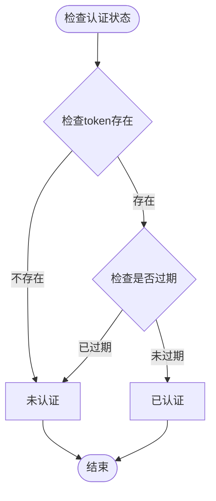
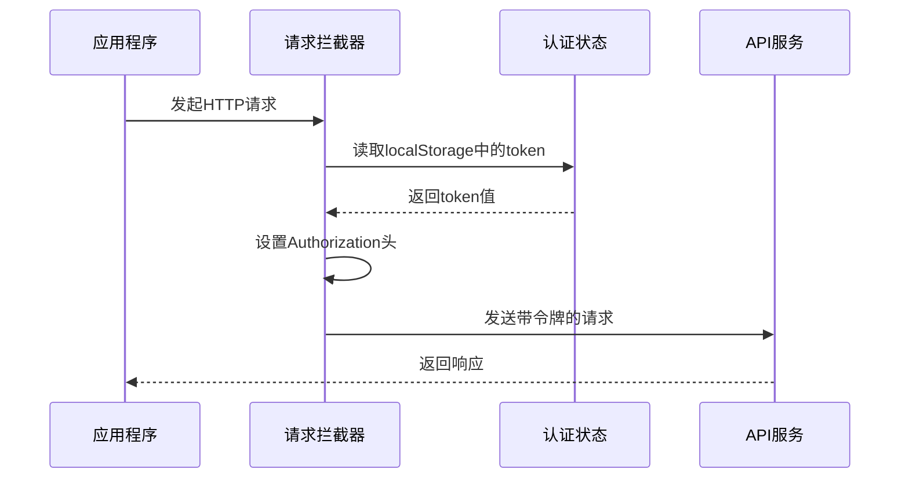
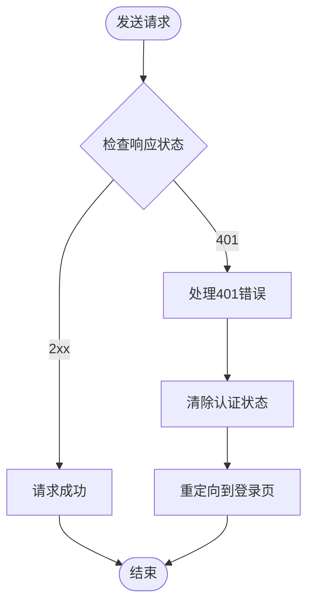
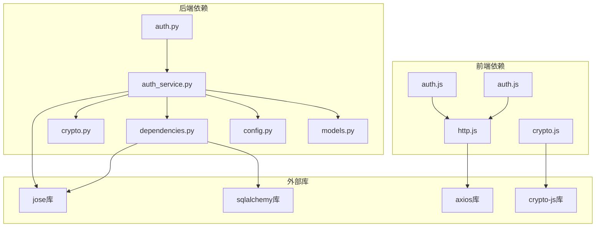

# JWT认证机制

<cite>
**本文档引用的文件**
- [auth.py](file://service/ai_assistant/app/routers/auth.py)
- [auth_service.py](file://service/ai_assistant/app/services/auth_service.py)
- [auth.js](file://frontend/ai_assistant/src/stores/auth.js)
- [auth.js](file://frontend/ai_assistant/src/api/auth.js)
- [crypto.py](file://service/ai_assistant/app/utils/crypto.py)
- [crypto.js](file://frontend/ai_assistant/src/utils/crypto.js)
- [config.py](file://service/ai_assistant/app/config.py)
- [dependencies.py](file://service/ai_assistant/app/dependencies.py)
- [http.js](file://frontend/ai_assistant/src/api/http.js)
- [auth.py](file://service/ai_assistant/app/schemas/auth.py)
- [models.py](file://service/ai_assistant/app/models/models.py)
</cite>

## 目录
1. [简介](#简介)
2. [项目结构](#项目结构)
3. [核心组件](#核心组件)
4. [架构概览](#架构概览)
5. [详细组件分析](#详细组件分析)
6. [依赖关系分析](#依赖关系分析)
7. [性能考虑](#性能考虑)
8. [故障排除指南](#故障排除指南)
9. [结论](#结论)

## 简介

AI校园助手采用JWT（JSON Web Token）认证机制来确保系统的安全性。该系统实现了完整的认证流程，包括令牌生成、验证、过期管理和安全存储策略。系统支持两种用户角色：学生用户和管理员用户，每种角色都有相应的令牌结构和权限控制。

JWT认证机制的核心优势在于无状态性和跨域支持，使得前后端分离的应用架构更加灵活和可扩展。

## 项目结构

AI校园助手的JWT认证机制分布在前后端两个主要部分：



**图表来源**
- [auth.py:1-102](file://service/ai_assistant/app/routers/auth.py#L1-L102)
- [auth.js:1-77](file://frontend/ai_assistant/src/stores/auth.js#L1-L77)
- [config.py:32-41](file://service/ai_assistant/app/config.py#L32-L41)

**章节来源**
- [auth.py:1-102](file://service/ai_assistant/app/routers/auth.py#L1-L102)
- [auth.js:1-77](file://frontend/ai_assistant/src/stores/auth.js#L1-L77)
- [config.py:1-113](file://service/ai_assistant/app/config.py#L1-L113)

## 核心组件

### JWT配置参数

系统使用以下JWT配置参数：

| 配置项 | 默认值 | 描述 |
|--------|--------|------|
| JWT_SECRET_KEY | 必需 | JWT签名密钥，必须保密存储 |
| JWT_ALGORITHM | HS256 | 签名算法，默认使用HS256 |
| JWT_EXPIRE_MINUTES | 1440 | 令牌过期时间（分钟），默认1天 |

### AES加密配置

密码传输采用AES-CBC加密：

| 配置项 | 默认值 | 描述 |
|--------|--------|------|
| AES_SECRET_KEY | 必需 | AES加密密钥，必须与前端一致 |
| 加密模式 | CBC | 使用CBC模式进行加密 |
| 填充方式 | PKCS7 | 使用PKCS7填充标准 |

**章节来源**
- [config.py:32-41](file://service/ai_assistant/app/config.py#L32-L41)
- [crypto.py:17-23](file://service/ai_assistant/app/utils/crypto.py#L17-L23)

## 架构概览

AI校园助手的JWT认证架构采用分层设计，确保了安全性和可维护性：



**图表来源**
- [auth.py:24-52](file://service/ai_assistant/app/routers/auth.py#L24-L52)
- [auth_service.py:125-169](file://service/ai_assistant/app/services/auth_service.py#L125-L169)
- [auth.js:18-34](file://frontend/ai_assistant/src/api/http.js#L18-L34)

## 详细组件分析

### JWT令牌生成机制

#### 令牌负载结构

系统为不同角色生成不同的JWT负载结构：

**学生令牌负载**：


**图表来源**
- [auth_service.py:45-75](file://service/ai_assistant/app/services/auth_service.py#L45-L75)

**令牌字段说明**：

| 字段名 | 类型 | 必填 | 描述 |
|--------|------|------|------|
| sub | string | 是 | 用户标识符（学生ID或管理员ID） |
| role | string | 是 | 用户角色（student/admin） |
| username | string | 否 | 管理员用户名（仅管理员令牌） |
| exp | datetime | 是 | 过期时间戳 |
| iat | datetime | 是 | 发布时间戳 |

#### 令牌生成流程

```mermaid
flowchart TD
Start([开始生成令牌]) --> GetTime[获取当前UTC时间]
GetTime --> CalcExp[计算过期时间<br/>当前时间 + 过期分钟数]
CalcExp --> BuildPayload[构建JWT负载]
BuildPayload --> SignToken[使用JWT_SECRET_KEY签名]
SignToken --> LogInfo[记录日志信息]
LogInfo --> ReturnToken[返回(令牌, 过期秒数)]
ReturnToken --> End([结束])
```

**图表来源**
- [auth_service.py:45-60](file://service/ai_assistant/app/services/auth_service.py#L45-L60)

**章节来源**
- [auth_service.py:45-75](file://service/ai_assistant/app/services/auth_service.py#L45-L75)

### 令牌验证流程

#### 解码和验证步骤

令牌验证过程包含多个安全检查：



**图表来源**
- [auth_service.py:78-95](file://service/ai_assistant/app/services/auth_service.py#L78-L95)
- [auth_service.py:98-122](file://service/ai_assistant/app/services/auth_service.py#L98-L122)

#### 角色特定验证

系统为不同角色实现专门的验证逻辑：

**学生令牌验证**：
- 验证role字段必须为"student"
- 提取sub字段作为学生ID
- 检查令牌是否过期

**管理员令牌验证**：
- 验证role字段必须为"admin"
- 提取sub字段并转换为整数管理员ID
- 验证username字段存在性

**章节来源**
- [auth_service.py:78-122](file://service/ai_assistant/app/services/auth_service.py#L78-L122)

### 密码传输安全机制

#### AES-CBC加密流程

系统采用AES-CBC模式对密码进行加密传输：



**图表来源**
- [crypto.js:26-40](file://frontend/ai_assistant/src/utils/crypto.js#L26-L40)
- [crypto.py:39-73](file://service/ai_assistant/app/utils/crypto.py#L39-L73)

#### 安全特性

**前端加密特性**：
- 使用随机初始化向量(IV)，确保相同密码每次加密结果不同
- 采用URL安全的Base64编码，便于HTTP传输
- 支持多种AES密钥长度（16/24/32字节）

**后端解密特性**：
- 严格的格式验证（必须包含":"分隔符）
- IV长度验证（必须为16字节）
- 异常处理和错误恢复

**章节来源**
- [crypto.js:1-40](file://frontend/ai_assistant/src/utils/crypto.js#L1-L40)
- [crypto.py:1-73](file://service/ai_assistant/app/utils/crypto.py#L1-L73)

### 前端认证状态管理

#### 本地存储策略

前端使用localStorage安全存储认证信息：



**图表来源**
- [auth.js:17-77](file://frontend/ai_assistant/src/stores/auth.js#L17-L77)

#### 认证状态检查



**图表来源**
- [auth.js:24-26](file://frontend/ai_assistant/src/stores/auth.js#L24-L26)

**章节来源**
- [auth.js:1-77](file://frontend/ai_assistant/src/stores/auth.js#L1-L77)

### HTTP请求拦截器

#### 自动令牌附加

系统使用Axios拦截器自动处理认证令牌：



**图表来源**
- [http.js:18-34](file://frontend/ai_assistant/src/api/http.js#L18-L34)

#### 401错误处理



**图表来源**
- [http.js:36-47](file://frontend/ai_assistant/src/api/http.js#L36-L47)

**章节来源**
- [http.js:1-49](file://frontend/ai_assistant/src/api/http.js#L1-L49)

## 依赖关系分析

### 组件依赖图



**图表来源**
- [auth.js:1-77](file://frontend/ai_assistant/src/stores/auth.js#L1-L77)
- [auth.py:1-102](file://service/ai_assistant/app/routers/auth.py#L1-L102)
- [auth_service.py:1-253](file://service/ai_assistant/app/services/auth_service.py#L1-L253)

### 关键依赖关系

**JWT库依赖**：
- 使用jose库处理JWT的编码、解码和验证
- 支持HS256算法签名验证

**数据库依赖**：
- SQLAlchemy ORM用于用户信息查询
- 异步数据库连接池管理

**加密库依赖**：
- CryptoJS前端加密库
- pycryptodome后端解密库

**章节来源**
- [auth_service.py:7-14](file://service/ai_assistant/app/services/auth_service.py#L7-L14)
- [dependencies.py:6-16](file://service/ai_assistant/app/dependencies.py#L6-L16)

## 性能考虑

### 令牌过期策略

系统采用固定时间间隔的令牌过期机制：

- **默认过期时间**：1440分钟（24小时）
- **过期检查**：客户端和服务器端双重验证
- **内存优化**：只在内存中保存当前令牌，避免缓存攻击

### 加密性能优化

**前端加密优化**：
- 使用浏览器原生Web Crypto API进行加密操作
- 异步加密处理，避免阻塞UI线程

**后端解密优化**：
- 单例模式管理AES解密器实例
- 连接池复用减少资源开销

### 缓存策略

系统采用多层缓存策略：

- **Redis缓存**：用于会话状态和频繁访问的数据
- **浏览器缓存**：本地存储令牌和用户信息
- **数据库缓存**：SQLAlchemy查询缓存

## 故障排除指南

### 常见认证错误及解决方案

#### 令牌验证失败

**错误类型**：JWTError
**可能原因**：
- 令牌被篡改或损坏
- 签名密钥不匹配
- 令牌格式不正确

**解决方法**：
1. 检查JWT_SECRET_KEY配置是否正确
2. 验证令牌是否被意外修改
3. 确认使用相同的签名算法

#### 用户名或密码错误

**错误类型**：ValueError
**可能原因**：
- 学生ID不存在
- 密码验证失败
- AES解密异常

**解决方法**：
1. 验证学生ID格式和存在性
2. 检查AES密钥配置一致性
3. 确认密码哈希算法兼容性

#### 权限不足

**错误类型**：HTTP 403
**可能原因**：
- 管理员账户被禁用
- 角色权限不匹配
- 令牌角色与端点不匹配

**解决方法**：
1. 检查管理员账户状态
2. 验证用户角色权限
3. 确认令牌包含正确的角色声明

#### 令牌过期

**错误类型**：HTTP 401
**可能原因**：
- 令牌超过过期时间
- 客户端时间不同步
- 服务器时间配置错误

**解决方法**：
1. 检查系统时间和时区配置
2. 验证JWT_EXPIRE_MINUTES设置
3. 实现令牌自动刷新机制

### 调试技巧

#### 前端调试

**令牌存储检查**：
```javascript
// 检查localStorage中的令牌
console.log('Token:', localStorage.getItem('campus_ai_token'));
console.log('Student ID:', localStorage.getItem('campus_ai_student_id'));
console.log('Expires At:', localStorage.getItem('campus_ai_expires_at'));
```

**网络请求监控**：
- 使用浏览器开发者工具查看请求头
- 检查Authorization头是否正确设置
- 监控响应状态码和错误信息

#### 后端调试

**日志分析**：
- 查看JWT生成和验证的日志
- 监控认证失败的详细原因
- 跟踪数据库查询性能

**配置验证**：
- 检查JWT_SECRET_KEY是否正确配置
- 验证AES_SECRET_KEY长度和格式
- 确认环境变量加载顺序

**章节来源**
- [auth_service.py:78-95](file://service/ai_assistant/app/services/auth_service.py#L78-L95)
- [auth_service.py:98-122](file://service/ai_assistant/app/services/auth_service.py#L98-L122)
- [http.js:36-47](file://frontend/ai_assistant/src/api/http.js#L36-L47)

## 结论

AI校园助手的JWT认证机制提供了完整、安全且高效的用户身份验证解决方案。系统通过以下关键特性确保了安全性：

1. **多层安全防护**：JWT令牌、AES加密传输、角色权限控制
2. **灵活的配置管理**：支持动态配置JWT和AES参数
3. **完善的错误处理**：详细的错误分类和用户友好的错误信息
4. **现代化的架构**：前后端分离，支持RESTful API设计

该认证机制为AI校园助手提供了可靠的身份验证基础，支持未来的功能扩展和安全增强。建议在生产环境中定期审查安全配置，实施更严格的访问控制策略，并考虑实现令牌刷新机制以提升用户体验。