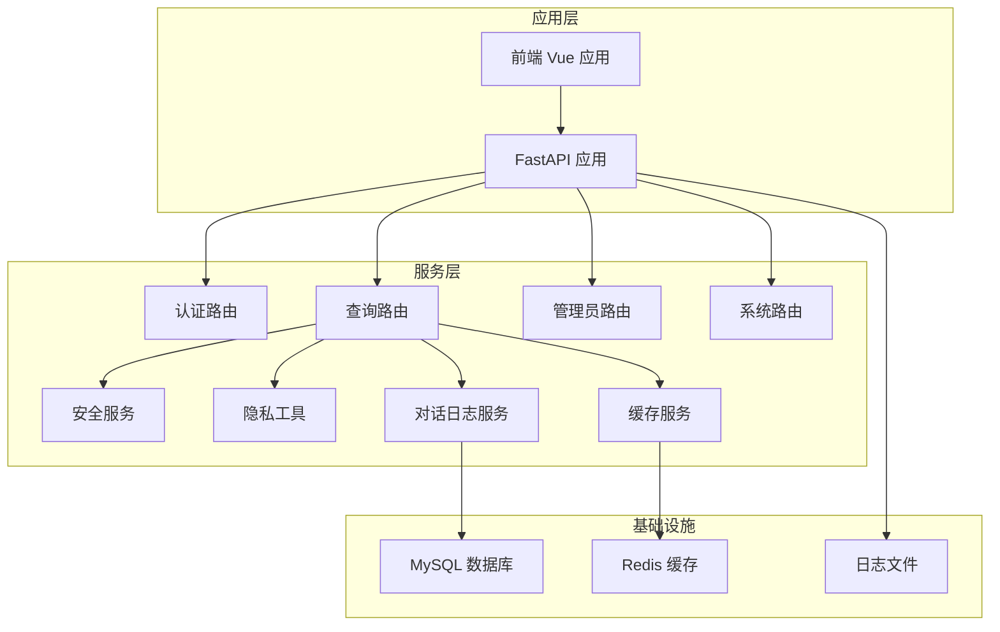
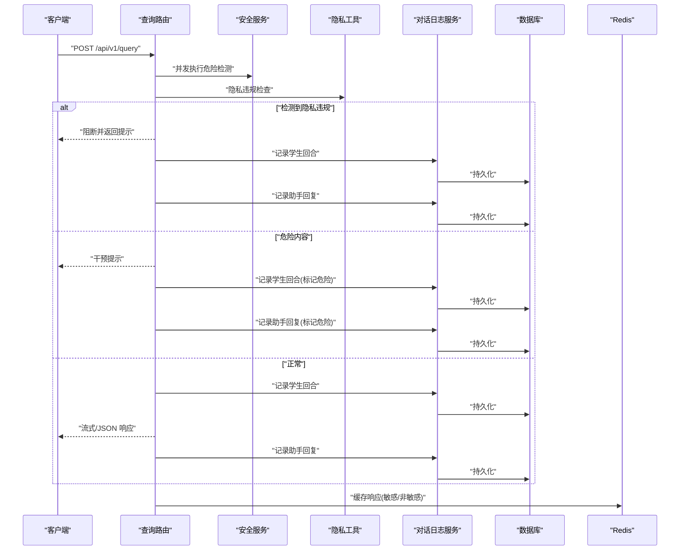
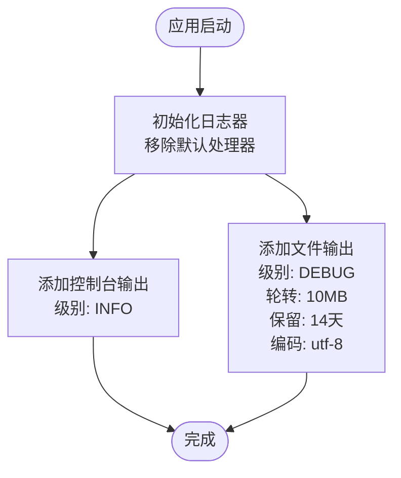
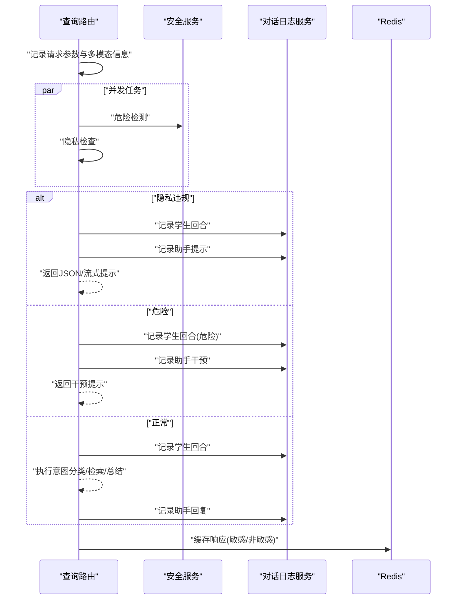
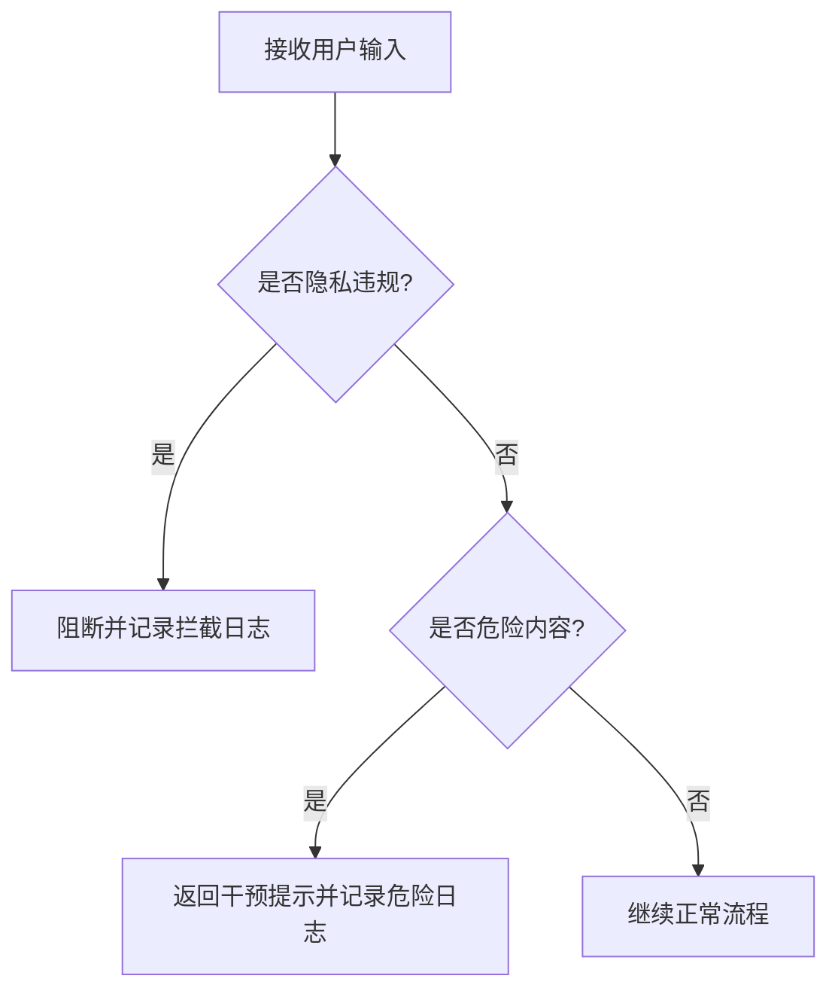
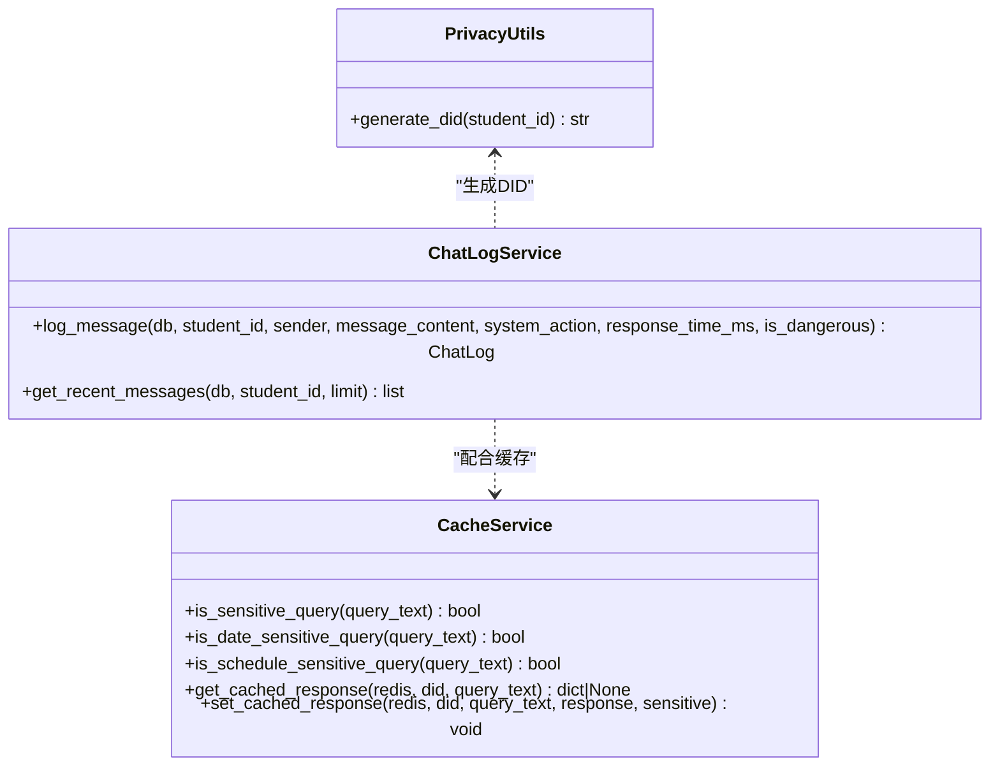
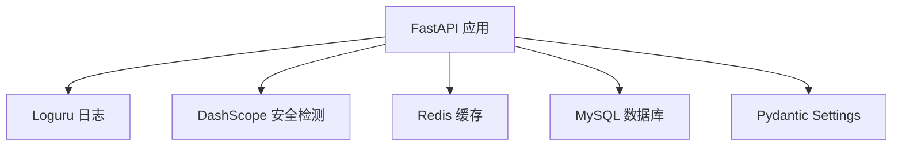

# 安全监控与审计

<cite>
**本文引用的文件**
- [logger.py](file://service/ai_assistant/app/utils/logger.py)
- [config.py](file://service/ai_assistant/app/config.py)
- [main.py](file://service/ai_assistant/app/main.py)
- [safety_service.py](file://service/ai_assistant/app/services/safety_service.py)
- [privacy.py](file://service/ai_assistant/app/utils/privacy.py)
- [query.py](file://service/ai_assistant/app/routers/query.py)
- [admin.py](file://service/ai_assistant/app/routers/admin.py)
- [system.py](file://service/ai_assistant/app/routers/system.py)
- [chat_log_service.py](file://service/ai_assistant/app/services/chat_log_service.py)
- [cache_service.py](file://service/ai_assistant/app/services/cache_service.py)
- [models.py](file://service/ai_assistant/app/models/models.py)
- [requirements.txt](file://service/ai_assistant/requirements.txt)
</cite>

## 目录
1. [简介](#简介)
2. [项目结构](#项目结构)
3. [核心组件](#核心组件)
4. [架构总览](#架构总览)
5. [详细组件分析](#详细组件分析)
6. [依赖分析](#依赖分析)
7. [性能考虑](#性能考虑)
8. [故障排查指南](#故障排查指南)
9. [结论](#结论)
10. [附录](#附录)

## 简介
本文件面向“AI校园助手”的安全监控与审计，围绕日志系统配置、API调用审计、异常行为检测与安全事件告警、性能与安全指标采集、日志分析与安全平台集成、以及数据泄露预防与敏感信息保护等方面，提供系统化的说明与实操建议。文档基于仓库现有实现进行提炼，并给出可落地的优化与扩展方向。

## 项目结构
后端采用 FastAPI + SQLAlchemy + Redis + MySQL 架构，安全相关能力主要分布在日志、安全服务、隐私脱敏、缓存与对话审计、管理员操作审计等模块中。前端为 Vue 应用，通过统一 API 与后端交互。

图表来源
- [main.py:1-86](file://service/ai_assistant/app/main.py#L1-L86)
- [query.py:1-788](file://service/ai_assistant/app/routers/query.py#L1-L788)
- [admin.py:1-388](file://service/ai_assistant/app/routers/admin.py#L1-L388)
- [system.py:1-38](file://service/ai_assistant/app/routers/system.py#L1-L38)
- [chat_log_service.py:1-76](file://service/ai_assistant/app/services/chat_log_service.py#L1-L76)
- [cache_service.py:1-177](file://service/ai_assistant/app/services/cache_service.py#L1-L177)
- [safety_service.py:1-163](file://service/ai_assistant/app/services/safety_service.py#L1-L163)
- [privacy.py:1-23](file://service/ai_assistant/app/utils/privacy.py#L1-L23)
- [logger.py:1-53](file://service/ai_assistant/app/utils/logger.py#L1-L53)

章节来源
- [main.py:1-86](file://service/ai_assistant/app/main.py#L1-L86)
- [requirements.txt:1-22](file://service/ai_assistant/requirements.txt#L1-L22)

## 核心组件
- 日志系统：统一使用 Loguru，控制台与文件双通道输出，文件按大小轮转与保留策略配置，便于审计与问题定位。
- 安全服务：基于规则与大模型双重策略进行危险内容检测与隐私违规拦截，具备降级与回退机制。
- 隐私脱敏：基于学生ID与盐值生成稳定DID，用于对话日志与缓存键，避免明文ID泄露。
- 对话审计：将学生与助手对话持久化至数据库，区分普通与危险场景，记录响应时延与系统动作。
- 缓存与敏感度：对敏感/时间敏感/课表敏感查询设置不同TTL与失效策略，保障数据新鲜度与安全性。
- 管理员审计：记录管理员关键操作，包含变更前后状态与目标主键，便于追踪与审计。

章节来源
- [logger.py:1-53](file://service/ai_assistant/app/utils/logger.py#L1-L53)
- [safety_service.py:1-163](file://service/ai_assistant/app/services/safety_service.py#L1-L163)
- [privacy.py:1-23](file://service/ai_assistant/app/utils/privacy.py#L1-L23)
- [chat_log_service.py:1-76](file://service/ai_assistant/app/services/chat_log_service.py#L1-L76)
- [cache_service.py:1-177](file://service/ai_assistant/app/services/cache_service.py#L1-L177)
- [models.py:625-660](file://service/ai_assistant/app/models/models.py#L625-L660)

## 架构总览
下图展示安全监控与审计的关键路径：请求进入后经认证与路由，执行安全与隐私检查，记录对话日志，必要时触发干预，最终返回响应并持久化。

图表来源
- [query.py:207-745](file://service/ai_assistant/app/routers/query.py#L207-L745)
- [safety_service.py:84-144](file://service/ai_assistant/app/services/safety_service.py#L84-L144)
- [chat_log_service.py:14-55](file://service/ai_assistant/app/services/chat_log_service.py#L14-L55)
- [cache_service.py:92-177](file://service/ai_assistant/app/services/cache_service.py#L92-L177)

## 详细组件分析

### 日志系统与日志级别
- 初始化策略：首次导入即初始化，控制台输出 INFO 级别，文件输出 DEBUG 级别，文件路径位于项目根目录 logs 目录，文件名固定。
- 输出格式：包含时间、级别、模块名、函数名、行号与消息体，便于快速定位。
- 文件轮转与保留：按 10MB 轮转，保留 14 天，编码 utf-8，避免单文件过大影响读取与备份。
- 全局生效：通过模块导入即执行初始化，确保应用各模块日志均落盘。

图表来源
- [logger.py:17-46](file://service/ai_assistant/app/utils/logger.py#L17-L46)

章节来源
- [logger.py:17-46](file://service/ai_assistant/app/utils/logger.py#L17-L46)

### API 调用审计与日志格式
- 请求入口：统一在应用入口注册路由，启动时打印应用名称与版本，生命周期内记录启动与关闭信息。
- 安全检查：在查询路由中并发执行危险内容检测与意图重写，记录开始与完成信息，便于审计与性能分析。
- 隐私拦截：若检测到查询他人学号，记录拦截原因与双方ID，返回提示并记录完整交互。
- 危险干预：若判定危险，记录学生与助手对话并标记危险，返回干预提示。
- 正常流程：记录学生与助手对话，区分小语聊场景隐藏意图，记录响应时延。
- 缓存与会话：记录缓存命中/未命中、会话历史加载与写入，便于审计与问题复盘。

图表来源
- [query.py:212-745](file://service/ai_assistant/app/routers/query.py#L212-L745)
- [chat_log_service.py:14-55](file://service/ai_assistant/app/services/chat_log_service.py#L14-L55)
- [cache_service.py:92-177](file://service/ai_assistant/app/services/cache_service.py#L92-L177)

章节来源
- [main.py:36-64](file://service/ai_assistant/app/main.py#L36-L64)
- [query.py:212-745](file://service/ai_assistant/app/routers/query.py#L212-L745)

### 异常行为检测与安全事件告警
- 危险内容检测：基于规则与大模型双重策略，优先使用大模型进行语境理解，失败时回退到规则匹配，确保安全边界。
- 隐私违规拦截：检测学号查询意图，若目标ID非当前用户则阻断并记录。
- 危险干预：当判定危险时，返回干预提示并记录学生与助手对话，标记危险状态，便于后续人工介入。
- 管理员审计：管理员操作记录变更前后状态与目标主键，便于追踪与审计。

图表来源
- [safety_service.py:84-144](file://service/ai_assistant/app/services/safety_service.py#L84-L144)
- [query.py:354-470](file://service/ai_assistant/app/routers/query.py#L354-L470)
- [admin.py:314-387](file://service/ai_assistant/app/routers/admin.py#L314-L387)

章节来源
- [safety_service.py:84-144](file://service/ai_assistant/app/services/safety_service.py#L84-L144)
- [query.py:354-470](file://service/ai_assistant/app/routers/query.py#L354-L470)
- [admin.py:314-387](file://service/ai_assistant/app/routers/admin.py#L314-L387)

### 性能监控指标与安全指标
- 性能指标
  - 响应时延：记录请求到响应的总时延，区分缓存命中与未命中场景。
  - 流式进度：记录流式生成的分片数量，便于观察生成吞吐。
  - 缓存命中率：通过缓存命中/未命中日志统计，评估缓存效果。
  - Redis可用性：记录Redis异常降级与恢复，便于容量与稳定性评估。
- 安全指标
  - 危险内容检测次数与结果分布。
  - 隐私违规拦截次数与拦截详情。
  - 管理员操作变更次数与类型分布。
  - 敏感查询占比与TTL策略有效性。

章节来源
- [query.py:213-745](file://service/ai_assistant/app/routers/query.py#L213-L745)
- [cache_service.py:85-177](file://service/ai_assistant/app/services/cache_service.py#L85-L177)
- [admin.py:314-387](file://service/ai_assistant/app/routers/admin.py#L314-L387)

### 日志分析工具与安全监控平台集成
- 日志落盘：日志文件位于 logs 目录，按大小轮转与保留，便于接入集中式日志平台（如 ELK、Loki、Splunk）。
- 建议集成方案
  - 采集：在生产环境部署日志采集器，将 logs 目录纳入采集范围。
  - 结构化解析：基于日志格式字段（时间、级别、模块、函数、行号、消息）建立索引。
  - 告警：针对危险内容检测、隐私拦截、Redis异常、数据库错误等关键事件建立告警规则。
  - 可视化：在监控平台中创建仪表板，展示安全事件趋势、性能指标与缓存命中率。

章节来源
- [logger.py:23-46](file://service/ai_assistant/app/utils/logger.py#L23-L46)

### 数据泄露预防与敏感信息保护
- 隐私脱敏：使用学生ID与盐值生成稳定DID，存储于对话日志与缓存键中，避免明文ID泄露。
- 对话日志策略：普通消息仅存储DID，危险消息存储原始ID以便干预；记录系统动作与响应时延。
- 缓存敏感度：对敏感/时间敏感/课表敏感查询设置不同TTL，避免泄露与过期语义导致的误判。
- 管理员审计：记录管理员操作的前后状态与目标主键，便于追溯与审计。

图表来源
- [privacy.py:9-22](file://service/ai_assistant/app/utils/privacy.py#L9-L22)
- [chat_log_service.py:14-55](file://service/ai_assistant/app/services/chat_log_service.py#L14-L55)
- [cache_service.py:55-177](file://service/ai_assistant/app/services/cache_service.py#L55-L177)

章节来源
- [privacy.py:9-22](file://service/ai_assistant/app/utils/privacy.py#L9-L22)
- [chat_log_service.py:14-55](file://service/ai_assistant/app/services/chat_log_service.py#L14-L55)
- [cache_service.py:55-177](file://service/ai_assistant/app/services/cache_service.py#L55-L177)

## 依赖分析
- 应用依赖：FastAPI、Uvicorn、SQLAlchemy、aiomysql、Redis、DashScope、Pydantic Settings、Loguru 等。
- 安全与监控：Loguru 提供统一日志；DashScope 用于安全检测；Redis 用于缓存与会话历史；MySQL 用于对话与管理员审计数据持久化。

图表来源
- [requirements.txt:1-22](file://service/ai_assistant/requirements.txt#L1-L22)
- [main.py:12-16](file://service/ai_assistant/app/main.py#L12-L16)

章节来源
- [requirements.txt:1-22](file://service/ai_assistant/requirements.txt#L1-L22)

## 性能考虑
- 并发与异步：查询路由中并发执行危险检测与意图重写，缩短端到端时延。
- 缓存策略：对敏感/非敏感查询设置不同TTL，结合时间敏感与课表敏感策略，平衡性能与准确性。
- 流式输出：使用SSE流式输出，降低反向代理缓冲与改写风险，提升用户体验。
- 连接池管理：在流式阶段及时释放数据库连接，避免长时间占用连接池。

章节来源
- [query.py:347-352](file://service/ai_assistant/app/routers/query.py#L347-L352)
- [query.py:654-657](file://service/ai_assistant/app/routers/query.py#L654-L657)
- [cache_service.py:85-89](file://service/ai_assistant/app/services/cache_service.py#L85-L89)

## 故障排查指南
- 日志定位：利用日志格式中的模块名、函数名、行号快速定位问题；关注 DEBUG/INFO/WARNING/ERROR 级别差异。
- 安全异常：若安全检测失败，系统回退到规则匹配；检查大模型调用异常与回退日志。
- 缓存异常：Redis异常时自动降级到数据库历史；关注缓存未命中与TTL失效日志。
- 数据库异常：对话日志与管理员审计均依赖数据库；关注连接释放与事务回滚日志。
- 配置检查：应用启动时检查不安全默认配置并发出告警；确认 .env 中密钥与敏感参数。

章节来源
- [logger.py:33-42](file://service/ai_assistant/app/utils/logger.py#L33-L42)
- [safety_service.py:134-143](file://service/ai_assistant/app/services/safety_service.py#L134-L143)
- [query.py:283-286](file://service/ai_assistant/app/routers/query.py#L283-L286)
- [main.py:25-33](file://service/ai_assistant/app/main.py#L25-L33)

## 结论
本项目在安全监控与审计方面具备较为完善的基线能力：统一日志、危险内容与隐私拦截、DID脱敏、对话与管理员审计、缓存敏感度策略与并发优化。建议在生产环境中进一步完善集中式日志采集与可视化、建立安全事件告警规则、定期审查敏感策略与缓存TTL，并持续优化大模型回退与异常处理流程。

## 附录
- 配置项要点
  - 日志：文件路径、轮转大小、保留天数、级别。
  - 安全模型：危险检测模型名称。
  - 缓存：敏感/普通TTL、版本控制键。
  - 数据库与Redis：URL与凭据。
- 建议的审计字段
  - 请求ID/会话ID、学生ID/DID、请求时间、响应时延、是否危险、是否隐私违规、缓存命中、系统动作、管理员操作详情。

章节来源
- [config.py:48-110](file://service/ai_assistant/app/config.py#L48-L110)
- [models.py:86-112](file://service/ai_assistant/app/models/models.py#L86-L112)