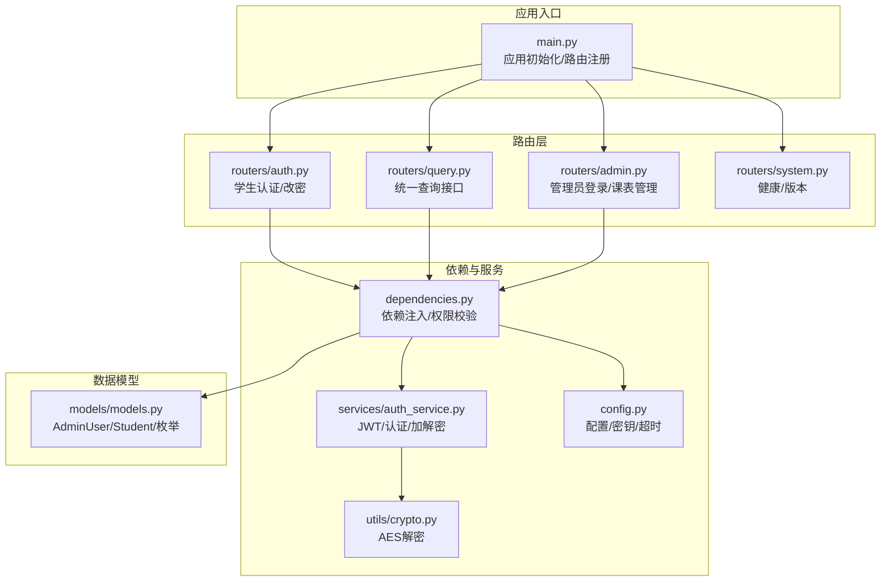
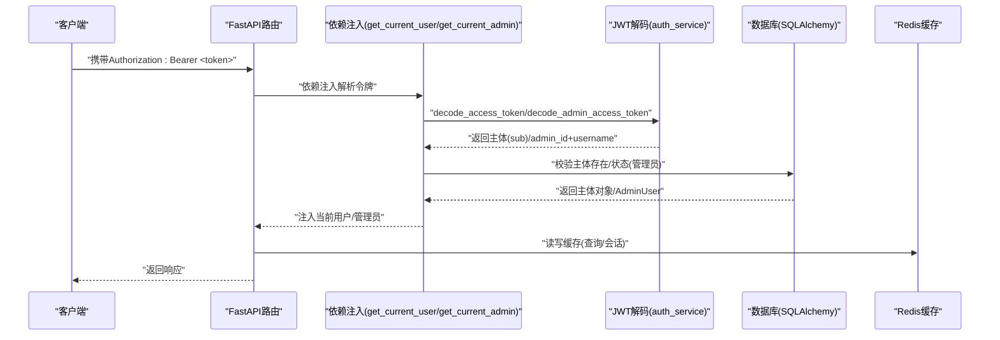
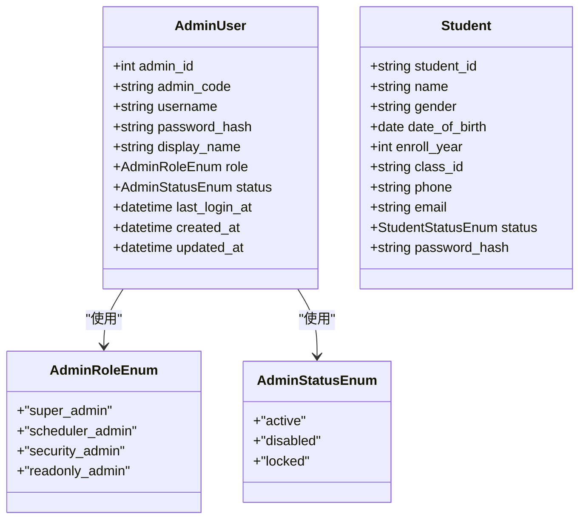
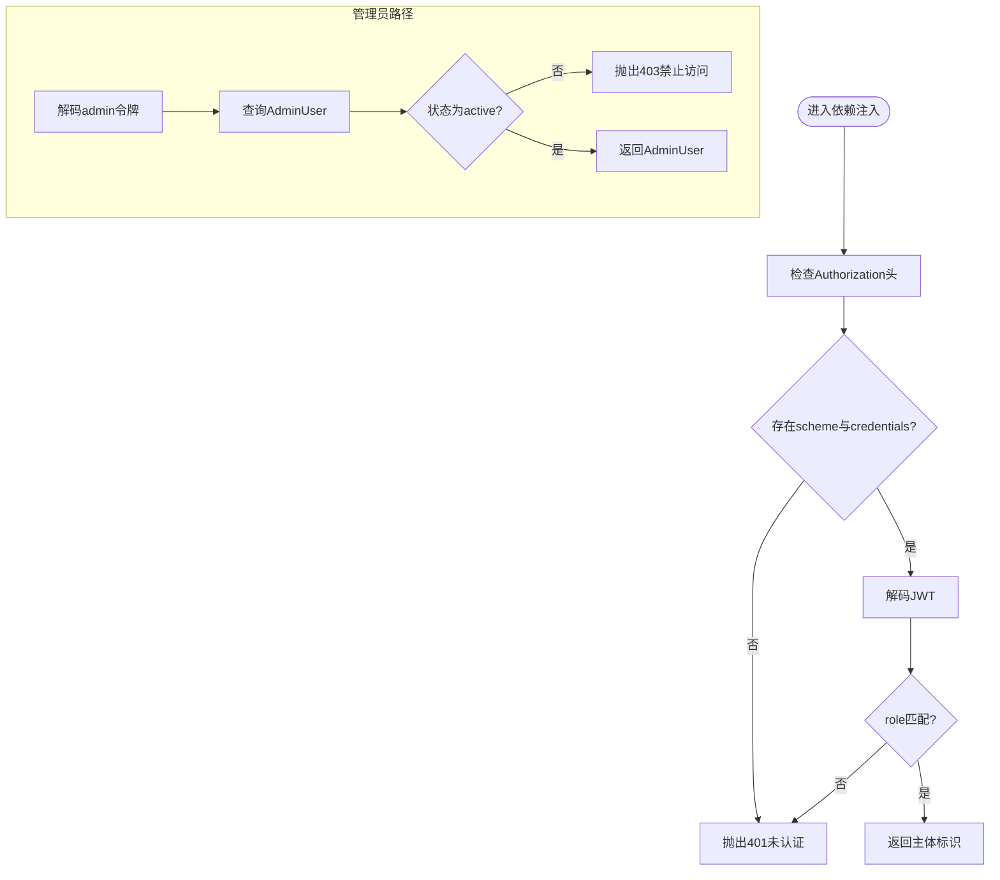
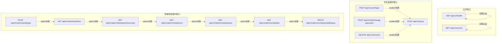
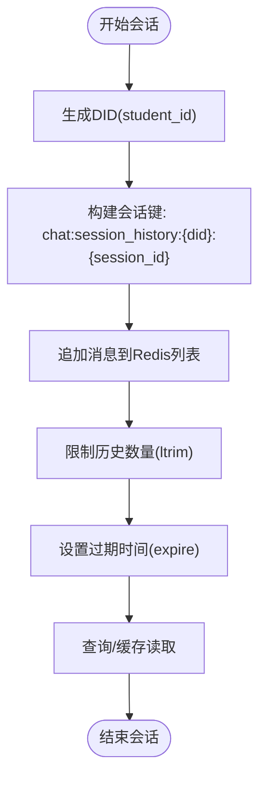
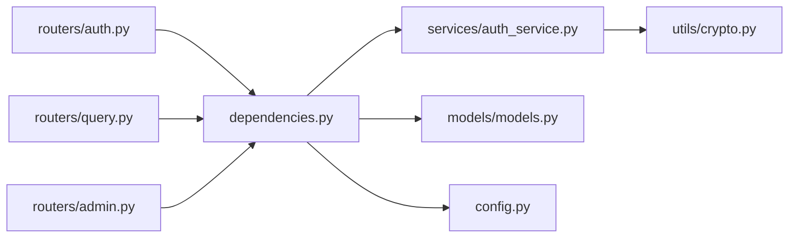

# 访问控制策略

<cite>
**本文引用的文件**
- [main.py](file://service/ai_assistant/app/main.py)
- [dependencies.py](file://service/ai_assistant/app/dependencies.py)
- [auth.py](file://service/ai_assistant/app/routers/auth.py)
- [admin.py](file://service/ai_assistant/app/routers/admin.py)
- [query.py](file://service/ai_assistant/app/routers/query.py)
- [system.py](file://service/ai_assistant/app/routers/system.py)
- [auth_service.py](file://service/ai_assistant/app/services/auth_service.py)
- [models.py](file://service/ai_assistant/app/models/models.py)
- [config.py](file://service/ai_assistant/app/config.py)
- [crypto.py](file://service/ai_assistant/app/utils/crypto.py)
- [auth.py(schema)](file://service/ai_assistant/app/schemas/auth.py)
- [admin.py(schema)](file://service/ai_assistant/app/schemas/admin.py)
- [query.py(schema)](file://service/ai_assistant/app/schemas/query.py)
</cite>

## 目录
1. [引言](#引言)
2. [项目结构](#项目结构)
3. [核心组件](#核心组件)
4. [架构总览](#架构总览)
5. [详细组件分析](#详细组件分析)
6. [依赖关系分析](#依赖关系分析)
7. [性能考量](#性能考量)
8. [故障排查指南](#故障排查指南)
9. [结论](#结论)
10. [附录](#附录)

## 引言
本文件面向AI校园助手的访问控制策略，聚焦基于角色的权限控制（RBAC）实现，涵盖学生与管理员两类主体的权限边界、依赖注入中的权限验证机制（get_current_user/get_current_admin）、API端点级别的访问控制划分、权限继承与组合的最佳实践、权限验证失败的错误处理与用户体验优化，以及会话管理与并发访问控制。文档旨在帮助开发者与运维人员快速理解并正确实施访问控制，确保系统在功能完备的同时满足安全与合规要求。

## 项目结构
后端采用FastAPI + SQLAlchemy AsyncIO + Redis的异步架构，路由按功能域拆分，依赖注入集中于dependencies模块，认证与授权逻辑分布在路由层与服务层，模型定义清晰区分学生与管理员角色。

**图表来源**
- [main.py:52-86](file://service/ai_assistant/app/main.py#L52-L86)
- [auth.py:21-102](file://service/ai_assistant/app/routers/auth.py#L21-L102)
- [query.py:46-788](file://service/ai_assistant/app/routers/query.py#L46-L788)
- [admin.py:48-388](file://service/ai_assistant/app/routers/admin.py#L48-L388)
- [system.py:9-38](file://service/ai_assistant/app/routers/system.py#L9-L38)
- [dependencies.py:1-109](file://service/ai_assistant/app/dependencies.py#L1-L109)
- [auth_service.py:1-253](file://service/ai_assistant/app/services/auth_service.py#L1-L253)
- [models.py:28-84](file://service/ai_assistant/app/models/models.py#L28-L84)
- [config.py:6-113](file://service/ai_assistant/app/config.py#L6-L113)
- [crypto.py:1-73](file://service/ai_assistant/app/utils/crypto.py#L1-L73)

**章节来源**
- [main.py:52-86](file://service/ai_assistant/app/main.py#L52-L86)
- [dependencies.py:1-109](file://service/ai_assistant/app/dependencies.py#L1-L109)

## 核心组件
- 应用入口与CORS：初始化FastAPI应用、注册路由、配置CORS与生命周期钩子。
- 依赖注入与权限校验：get_current_user（学生）、get_current_admin（管理员）负责令牌解析与主体校验。
- 认证服务：JWT签发与解码、AES解密、学生/管理员认证与改密。
- 数据模型：AdminUser（含角色枚举）、Student等，支撑RBAC与行级隔离。
- 路由层：按功能域划分，明确公开与受保护接口。

**章节来源**
- [main.py:52-86](file://service/ai_assistant/app/main.py#L52-L86)
- [dependencies.py:56-109](file://service/ai_assistant/app/dependencies.py#L56-L109)
- [auth_service.py:45-123](file://service/ai_assistant/app/services/auth_service.py#L45-L123)
- [models.py:28-84](file://service/ai_assistant/app/models/models.py#L28-L84)

## 架构总览
下图展示了访问控制在系统中的关键交互：客户端携带JWT Bearer令牌访问受保护接口，依赖注入层解析令牌并校验主体与角色，随后进入业务路由与服务层执行具体操作。

**图表来源**
- [dependencies.py:56-109](file://service/ai_assistant/app/dependencies.py#L56-L109)
- [auth_service.py:78-122](file://service/ai_assistant/app/services/auth_service.py#L78-L122)
- [auth.py:33-52](file://service/ai_assistant/app/routers/auth.py#L33-L52)
- [admin.py:57-82](file://service/ai_assistant/app/routers/admin.py#L57-L82)
- [query.py:207-212](file://service/ai_assistant/app/routers/query.py#L207-L212)

## 详细组件分析

### 基于角色的权限控制（RBAC）实现
- 角色与状态
  - 学生：通过学生ID作为JWT sub，角色固定为student，用于端点级访问控制。
  - 管理员：AdminUser包含role与status枚举，支持多种角色（如超级管理员、排课管理员、安全管理员、只读管理员）与状态（active/disabled/locked）。
- 端点级角色绑定
  - 学生端点：仅get_current_user依赖注入，确保只有有效student令牌可访问。
  - 管理员端点：仅get_current_admin依赖注入，确保只有有效admin令牌且账户状态为active可访问。
- 行级隔离
  - 查询接口在执行结构化查询时，会自动限定当前学生ID，防止越权访问他人数据。

**图表来源**
- [models.py:28-84](file://service/ai_assistant/app/models/models.py#L28-L84)
- [models.py:305-340](file://service/ai_assistant/app/models/models.py#L305-L340)

**章节来源**
- [models.py:28-84](file://service/ai_assistant/app/models/models.py#L28-L84)
- [auth.py:61-70](file://service/ai_assistant/app/routers/auth.py#L61-L70)
- [admin.py:90-99](file://service/ai_assistant/app/routers/admin.py#L90-L99)
- [query.py:207-212](file://service/ai_assistant/app/routers/query.py#L207-L212)

### 依赖注入中的权限验证机制
- get_current_user
  - 解析Authorization头Bearer令牌，解码JWT并校验role为student。
  - 返回student_id，供路由层进行业务校验（如修改密码时校验student_id一致性）。
- get_current_admin
  - 解析admin令牌，校验role为admin。
  - 从数据库查询AdminUser，校验状态为active，否则返回403。
  - 返回AdminUser对象，供管理员端点使用。

**图表来源**
- [dependencies.py:56-109](file://service/ai_assistant/app/dependencies.py#L56-L109)
- [auth_service.py:78-122](file://service/ai_assistant/app/services/auth_service.py#L78-L122)

**章节来源**
- [dependencies.py:56-109](file://service/ai_assistant/app/dependencies.py#L56-L109)
- [auth_service.py:78-122](file://service/ai_assistant/app/services/auth_service.py#L78-L122)

### API端点级别的访问控制
- 公开接口
  - /api/v1/health：健康检查，无需认证。
  - /api/v1/version：版本信息，无需认证。
- 受保护接口
  - 学生端点
    - POST /api/v1/auth/login：学生登录，返回JWT。
    - POST /api/v1/auth/change-password：修改密码，需携带student令牌。
    - POST /api/v1/query：统一查询接口，需携带student令牌。
    - DELETE /api/v1/sessions：清理当前学生会话缓存与历史，需携带student令牌。
  - 管理员端点
    - POST /api/v1/admin/auth/login：管理员登录，返回admin令牌。
    - GET /api/v1/admin/auth/me：获取当前管理员信息，需携带admin令牌。
    - GET /api/v1/admin/dashboard/summary：管理员概览统计，需携带admin令牌。
    - GET /api/v1/admin/meta/terms：获取学期列表，需携带admin令牌。
    - GET /api/v1/admin/meta/classes：获取班级列表，需携带admin令牌。
    - GET /api/v1/admin/schedules：管理员课表列表，需携带admin令牌。
    - PATCH /api/v1/admin/schedules/{schedule_id}/status：更新课表状态，需携带admin令牌。

**图表来源**
- [system.py:22-37](file://service/ai_assistant/app/routers/system.py#L22-L37)
- [auth.py:24-101](file://service/ai_assistant/app/routers/auth.py#L24-L101)
- [query.py:198-787](file://service/ai_assistant/app/routers/query.py#L198-L787)
- [admin.py:51-387](file://service/ai_assistant/app/routers/admin.py#L51-L387)

**章节来源**
- [system.py:22-37](file://service/ai_assistant/app/routers/system.py#L22-L37)
- [auth.py:24-101](file://service/ai_assistant/app/routers/auth.py#L24-L101)
- [query.py:198-787](file://service/ai_assistant/app/routers/query.py#L198-L787)
- [admin.py:51-387](file://service/ai_assistant/app/routers/admin.py#L51-L387)

### 权限继承与权限组合的最佳实践
- 角色继承
  - 管理员角色枚举定义了四种角色，可在业务层通过角色组合实现继承语义（如超级管理员拥有更广权限，调度管理员专注于课表，安全管理员负责审计与风控，只读管理员仅允许查看）。
- 权限组合
  - 在管理员端点内部，可基于AdminUser.role进行细粒度授权控制，例如将“更新课表状态”与“批量导入课表”等敏感操作绑定到特定角色。
- 行为审计
  - 管理员操作记录在AdminActionLog中，便于追踪与审计，支持权限变更与违规行为的回溯。

**章节来源**
- [models.py:28-84](file://service/ai_assistant/app/models/models.py#L28-L84)
- [admin.py:314-387](file://service/ai_assistant/app/routers/admin.py#L314-L387)

### 会话管理与并发访问控制
- 会话隔离
  - 使用DID（去标识化ID）与会话ID组合构建Redis键空间，确保不同会话间的历史与缓存互不干扰。
- 并发安全
  - 会话历史采用Redis列表结构，配合ltrim与expire，避免无限增长；缓存写入与聊天日志写入在SSE完成后异步执行，减少阻塞。
- 令牌与超时
  - JWT过期时间由配置决定，默认1天；Redis缓存区分敏感与普通查询的TTL，兼顾性能与隐私。

**图表来源**
- [query.py:153-196](file://service/ai_assistant/app/routers/query.py#L153-L196)
- [query.py:752-787](file://service/ai_assistant/app/routers/query.py#L752-L787)
- [config.py:81-84](file://service/ai_assistant/app/config.py#L81-L84)

**章节来源**
- [query.py:153-196](file://service/ai_assistant/app/routers/query.py#L153-L196)
- [query.py:752-787](file://service/ai_assistant/app/routers/query.py#L752-L787)
- [config.py:81-84](file://service/ai_assistant/app/config.py#L81-L84)

## 依赖关系分析
- 路由依赖
  - 所有受保护路由均依赖依赖注入函数（get_current_user或get_current_admin），形成统一的权限入口。
- 服务依赖
  - 认证服务依赖配置与加解密工具，负责JWT签发与校验、AES解密。
- 数据模型依赖
  - 管理员模型包含角色与状态枚举，支撑RBAC与状态控制。

**图表来源**
- [auth.py:7-19](file://service/ai_assistant/app/routers/auth.py#L7-L19)
- [query.py:32-44](file://service/ai_assistant/app/routers/query.py#L32-L44)
- [admin.py:12-46](file://service/ai_assistant/app/routers/admin.py#L12-L46)
- [dependencies.py:13-16](file://service/ai_assistant/app/dependencies.py#L13-L16)
- [auth_service.py:11-14](file://service/ai_assistant/app/services/auth_service.py#L11-L14)
- [crypto.py:14-14](file://service/ai_assistant/app/utils/crypto.py#L14-L14)
- [models.py:22-22](file://service/ai_assistant/app/models/models.py#L22-L22)
- [config.py:6-11](file://service/ai_assistant/app/config.py#L6-L11)

**章节来源**
- [auth.py:7-19](file://service/ai_assistant/app/routers/auth.py#L7-L19)
- [query.py:32-44](file://service/ai_assistant/app/routers/query.py#L32-L44)
- [admin.py:12-46](file://service/ai_assistant/app/routers/admin.py#L12-L46)
- [dependencies.py:13-16](file://service/ai_assistant/app/dependencies.py#L13-L16)
- [auth_service.py:11-14](file://service/ai_assistant/app/services/auth_service.py#L11-L14)
- [crypto.py:14-14](file://service/ai_assistant/app/utils/crypto.py#L14-L14)
- [models.py:22-22](file://service/ai_assistant/app/models/models.py#L22-L22)
- [config.py:6-11](file://service/ai_assistant/app/config.py#L6-L11)

## 性能考量
- 令牌解码与数据库查询
  - 依赖注入层仅进行令牌解码与必要校验，避免在路由层重复校验。
- 缓存与降级
  - Redis缓存命中优先返回，失败时降级到数据库历史；SSE流式输出在生成器结束后再写入缓存与日志，减少长连接占用。
- 并发与异步
  - 使用async/await与异步Redis/数据库，提升高并发下的吞吐能力。

[本节为通用性能讨论，不直接分析具体文件]

## 故障排查指南
- 401未认证
  - 检查Authorization头是否存在、scheme是否为Bearer、令牌是否有效。
  - 学生端点若携带非student角色令牌，将被拒绝。
- 403禁止访问
  - 管理员令牌有效但账户状态非active。
- 密码修改失败
  - 旧密码不正确、新旧密码相同、加密数据无效等错误将返回相应HTTP状态码与错误信息。
- 查询失败
  - 图像/音频处理失败、意图分类失败、查询执行失败等将返回502状态码与详细信息。

**章节来源**
- [dependencies.py:60-72](file://service/ai_assistant/app/dependencies.py#L60-L72)
- [dependencies.py:80-107](file://service/ai_assistant/app/dependencies.py#L80-L107)
- [auth.py:80-99](file://service/ai_assistant/app/routers/auth.py#L80-L99)
- [query.py:239-260](file://service/ai_assistant/app/routers/query.py#L239-L260)
- [query.py:544-549](file://service/ai_assistant/app/routers/query.py#L544-L549)

## 结论
本系统通过明确的角色划分与依赖注入的统一权限入口，实现了清晰的RBAC控制；在API层面，公开与受保护接口边界分明；在会话与并发方面，采用DID+会话ID隔离与异步写入策略，兼顾性能与安全性。建议在生产环境中强化角色与权限的细粒度控制，并持续审计管理员操作日志，确保系统安全稳定运行。

[本节为总结性内容，不直接分析具体文件]

## 附录
- 配置要点
  - JWT密钥、算法与过期时间；AES密钥；Redis与MySQL连接；缓存TTL等。
- 数据模型要点
  - AdminUser与Student的关键字段与索引，支撑权限与行级隔离。

**章节来源**
- [config.py:32-40](file://service/ai_assistant/app/config.py#L32-L40)
- [config.py:81-84](file://service/ai_assistant/app/config.py#L81-L84)
- [models.py:41-84](file://service/ai_assistant/app/models/models.py#L41-L84)
- [models.py:312-340](file://service/ai_assistant/app/models/models.py#L312-L340)