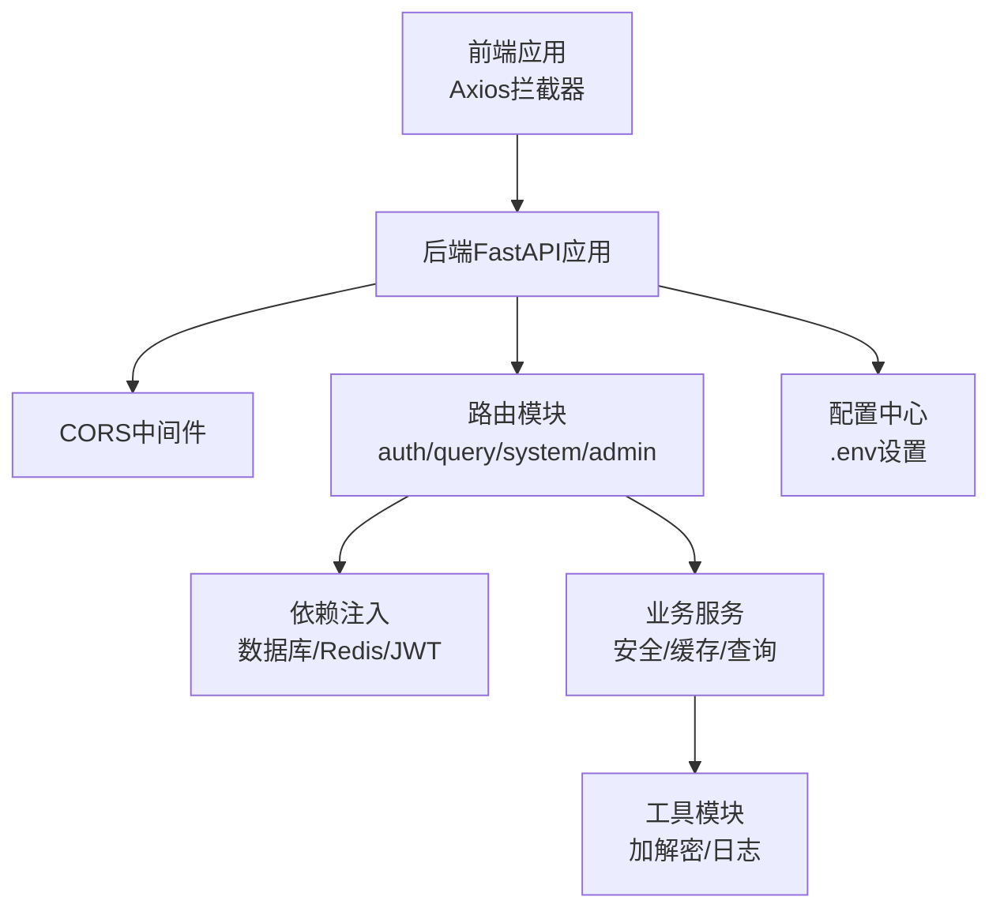
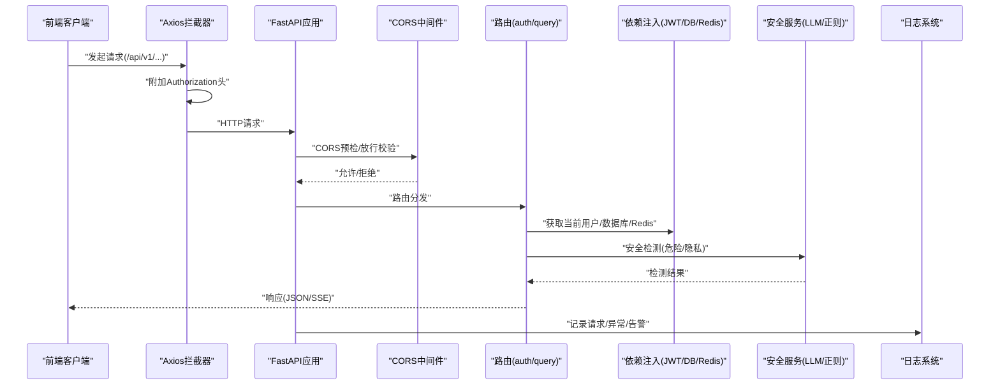
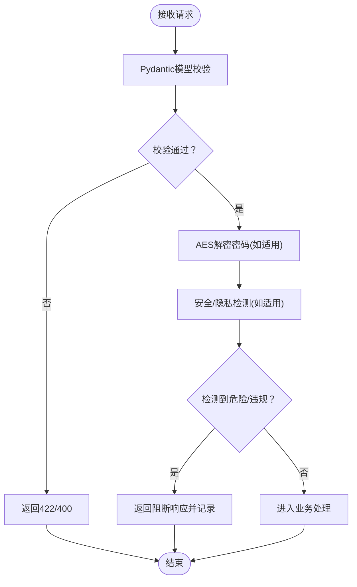
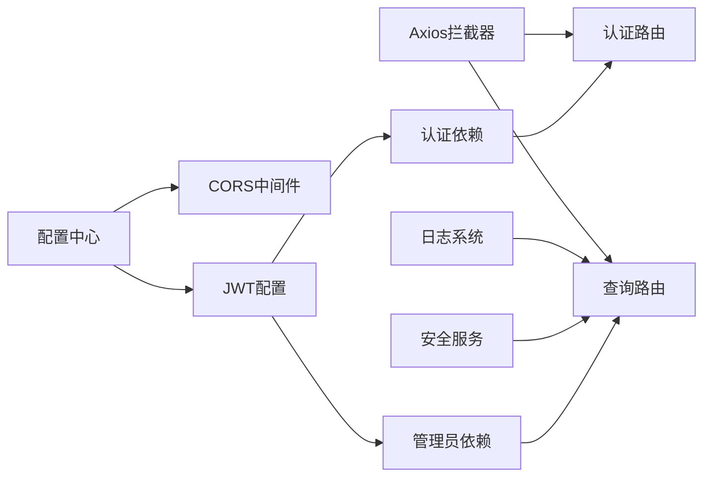

# 请求安全防护

<cite>
**本文档引用的文件**
- [main.py](file://service/ai_assistant/app/main.py)
- [config.py](file://service/ai_assistant/app/config.py)
- [dependencies.py](file://service/ai_assistant/app/dependencies.py)
- [auth.py](file://service/ai_assistant/app/routers/auth.py)
- [query.py](file://service/ai_assistant/app/routers/query.py)
- [auth_service.py](file://service/ai_assistant/app/services/auth_service.py)
- [safety_service.py](file://service/ai_assistant/app/services/safety_service.py)
- [crypto.py](file://service/ai_assistant/app/utils/crypto.py)
- [logger.py](file://service/ai_assistant/app/utils/logger.py)
- [http.js](file://frontend/ai_assistant/src/api/http.js)
</cite>

## 目录
1. [简介](#简介)
2. [项目结构](#项目结构)
3. [核心组件](#核心组件)
4. [架构总览](#架构总览)
5. [详细组件分析](#详细组件分析)
6. [依赖分析](#依赖分析)
7. [性能考量](#性能考量)
8. [故障排查指南](#故障排查指南)
9. [结论](#结论)

## 简介
本文件聚焦于AI校园助手的请求安全防护体系，覆盖跨域资源共享(CORS)配置、请求频率限制与防刷机制现状、请求参数验证与输入清理策略、API版本控制与向后兼容性、请求签名与时间戳校验机制现状、以及异常请求检测与自动防护的实施方法。文档旨在帮助开发者与运维人员全面理解现有安全实现，并提出可落地的加固建议。

## 项目结构
后端采用FastAPI框架，按功能模块组织：路由层(routers)、服务层(services)、工具层(utils)、配置(config)与依赖注入(dependencies)。前端通过Axios统一拦截器发起请求，路径前缀为/api/v1，便于后端版本化管理。

图表来源
- [main.py:52-86](file://service/ai_assistant/app/main.py#L52-L86)
- [config.py:13-113](file://service/ai_assistant/app/config.py#L13-L113)
- [dependencies.py:1-109](file://service/ai_assistant/app/dependencies.py#L1-L109)
- [auth.py:1-102](file://service/ai_assistant/app/routers/auth.py#L1-L102)
- [query.py:1-788](file://service/ai_assistant/app/routers/query.py#L1-L788)

章节来源
- [main.py:52-86](file://service/ai_assistant/app/main.py#L52-L86)
- [config.py:13-113](file://service/ai_assistant/app/config.py#L13-L113)

## 核心组件
- CORS跨域配置：通过CORSMiddleware限制允许来源、凭证、方法与头字段，支持从配置读取动态来源列表。
- 认证与授权：基于JWT的Bearer Token，提供学生与管理员两类令牌，路由依赖注入获取当前用户/管理员。
- 输入验证与清理：Pydantic模型对请求体进行结构化校验；AES-CBC解密用于密码字段；安全服务对敏感内容与隐私违规进行检测。
- 日志与审计：统一Loguru日志配置，记录关键事件与异常，便于追踪与审计。
- 前端Axios拦截器：统一添加Authorization头，处理401自动登出。

章节来源
- [main.py:66-76](file://service/ai_assistant/app/main.py#L66-L76)
- [dependencies.py:56-108](file://service/ai_assistant/app/dependencies.py#L56-L108)
- [auth.py:24-52](file://service/ai_assistant/app/routers/auth.py#L24-L52)
- [query.py:198-212](file://service/ai_assistant/app/routers/query.py#L198-L212)
- [crypto.py:39-73](file://service/ai_assistant/app/utils/crypto.py#L39-L73)
- [logger.py:17-53](file://service/ai_assistant/app/utils/logger.py#L17-L53)
- [http.js:10-49](file://frontend/ai_assistant/src/api/http.js#L10-L49)

## 架构总览
下图展示从前端到后端的关键安全交互链路，包括CORS、认证、安全检测与日志记录。

图表来源
- [http.js:10-49](file://frontend/ai_assistant/src/api/http.js#L10-L49)
- [main.py:66-76](file://service/ai_assistant/app/main.py#L66-L76)
- [auth.py:24-52](file://service/ai_assistant/app/routers/auth.py#L24-L52)
- [query.py:198-212](file://service/ai_assistant/app/routers/query.py#L198-L212)
- [dependencies.py:56-108](file://service/ai_assistant/app/dependencies.py#L56-L108)
- [safety_service.py:84-144](file://service/ai_assistant/app/services/safety_service.py#L84-L144)
- [logger.py:17-53](file://service/ai_assistant/app/utils/logger.py#L17-L53)

## 详细组件分析

### CORS跨域资源共享安全配置
- 允许来源(allowed_origins)：从配置项CORS_ALLOW_ORIGINS读取，支持逗号分隔的多来源，支持通配符“*”，并提供解析为列表的属性。
- 凭证(allow_credentials)：开启，允许携带Cookie与Authorization头。
- 方法(allowed_methods)：默认“*”，允许所有HTTP方法。
- 头字段(allowed_headers)：默认“*”，允许所有请求头。
- 生产建议：将“*”替换为明确的前端域名，避免过度宽松；若仅GET/POST等有限方法，建议显式限定；对自定义头进行白名单管理。

章节来源
- [config.py:17](file://service/ai_assistant/app/config.py#L17)
- [config.py:103-109](file://service/ai_assistant/app/config.py#L103-L109)
- [main.py:70-76](file://service/ai_assistant/app/main.py#L70-L76)

### 请求频率限制与防刷机制现状
- 现状：未发现内置速率限制中间件或Redis限流实现。
- 建议：引入基于Redis的滑动窗口/漏桶算法限流；对登录/查询端点分别设置阈值；对异常IP进行临时封禁；记录限流事件到日志。

[本节为通用建议，无需特定文件引用]

### 请求参数验证与输入清理策略
- Pydantic模型校验：登录与查询请求体均使用Pydantic模型，自动进行字段存在性、类型与命名兼容性校验。
- 密码字段清理：登录密码采用AES-CBC解密，格式校验与长度约束，失败时抛出异常。
- 安全检测：查询端点集成安全服务，对危险内容与隐私违规进行检测，必要时阻断并记录。
- 前端拦截器：统一添加Authorization头，避免手动拼接错误。

图表来源
- [auth.py:4-21](file://service/ai_assistant/app/routers/auth.py#L4-L21)
- [query.py:15-24](file://service/ai_assistant/app/routers/query.py#L15-L24)
- [crypto.py:39-73](file://service/ai_assistant/app/utils/crypto.py#L39-L73)
- [safety_service.py:84-144](file://service/ai_assistant/app/services/safety_service.py#L84-L144)

章节来源
- [auth.py:4-21](file://service/ai_assistant/app/routers/auth.py#L4-L21)
- [query.py:15-24](file://service/ai_assistant/app/routers/query.py#L15-L24)
- [crypto.py:39-73](file://service/ai_assistant/app/utils/crypto.py#L39-L73)
- [safety_service.py:84-144](file://service/ai_assistant/app/services/safety_service.py#L84-L144)

### API版本控制与向后兼容性
- 版本化路径：前端基础URL为/api/v1，路由前缀统一为/api/v1，便于未来扩展v2。
- 向后兼容：Pydantic模型支持字段别名与迁移，如登录请求兼容旧字段名映射。
- 建议：新增字段采用可选；删除字段保留别名；变更枚举值时提供兼容映射；发布变更前提供迁移指南。

章节来源
- [http.js:10-16](file://frontend/ai_assistant/src/api/http.js#L10-L16)
- [auth.py:14-21](file://service/ai_assistant/app/routers/auth.py#L14-L21)
- [query.py:46](file://service/ai_assistant/app/routers/query.py#L46)

### 请求签名验证与时间戳校验机制现状
- 现状：未发现对请求体或头部进行签名验证与时间戳校验的实现。
- 建议：对关键端点启用签名(如HMAC-SHA256)，要求客户端附加签名与时间戳；服务端校验时间窗口(如±5分钟)与签名有效性；失败时拒绝请求并记录。

[本节为通用建议，无需特定文件引用]

### 异常请求检测与自动防护
- 内容安全：安全服务通过LLM与正则双重策略检测危险内容，支持降级与日志记录。
- 隐私保护：检测学号查询等隐私违规行为，阻断并提示。
- 日志审计：统一日志落盘，记录请求详情、异常与告警，便于溯源。
- 建议：增加异常行为统计(如连续失败次数、异常关键词占比)与自动化封禁阈值；对高频异常IP进行临时限速或封禁。

章节来源
- [safety_service.py:84-144](file://service/ai_assistant/app/services/safety_service.py#L84-L144)
- [logger.py:17-53](file://service/ai_assistant/app/utils/logger.py#L17-L53)

## 依赖分析
- CORS依赖配置：CORS中间件依赖配置中心的来源列表。
- 认证依赖：路由依赖JWT解码与数据库/Redis连接。
- 安全依赖：查询端点依赖安全服务与日志系统。
- 前端依赖：Axios实例依赖本地存储的令牌。

图表来源
- [config.py:17](file://service/ai_assistant/app/config.py#L17)
- [main.py:70-76](file://service/ai_assistant/app/main.py#L70-L76)
- [dependencies.py:56-108](file://service/ai_assistant/app/dependencies.py#L56-L108)
- [auth.py:24-52](file://service/ai_assistant/app/routers/auth.py#L24-L52)
- [query.py:198-212](file://service/ai_assistant/app/routers/query.py#L198-L212)
- [safety_service.py:84-144](file://service/ai_assistant/app/services/safety_service.py#L84-L144)
- [logger.py:17-53](file://service/ai_assistant/app/utils/logger.py#L17-L53)
- [http.js:10-49](file://frontend/ai_assistant/src/api/http.js#L10-L49)

章节来源
- [config.py:17](file://service/ai_assistant/app/config.py#L17)
- [main.py:70-76](file://service/ai_assistant/app/main.py#L70-L76)
- [dependencies.py:56-108](file://service/ai_assistant/app/dependencies.py#L56-L108)
- [auth.py:24-52](file://service/ai_assistant/app/routers/auth.py#L24-L52)
- [query.py:198-212](file://service/ai_assistant/app/routers/query.py#L198-L212)
- [safety_service.py:84-144](file://service/ai_assistant/app/services/safety_service.py#L84-L144)
- [logger.py:17-53](file://service/ai_assistant/app/utils/logger.py#L17-L53)
- [http.js:10-49](file://frontend/ai_assistant/src/api/http.js#L10-L49)

## 性能考量
- CORS宽泛配置：允许所有方法与头可能增加预检开销，建议在生产环境收紧。
- 安全检测：LLM调用与正则回退均可能带来延迟，建议对高频端点进行缓存与降级策略。
- 流式响应：SSE流式输出避免长连接占用数据库会话，提升吞吐。
- 日志级别：生产环境建议调整日志级别与轮转策略，平衡可观测性与磁盘IO。

[本节为通用指导，无需特定文件引用]

## 故障排查指南
- CORS相关问题：检查CORS_ALLOW_ORIGINS配置是否包含前端域名；确认allow_credentials与allowed_methods/headers设置。
- 认证失败：确认Authorization头格式为Bearer Token；检查JWT密钥与算法；查看401响应与后端日志。
- 安全拦截：若频繁被阻断，检查安全服务日志与正则规则；确认是否误伤公共服务查询。
- 日志定位：通过日志文件定位异常请求与堆栈信息，结合请求ID与会话ID进行回溯。

章节来源
- [main.py:66-76](file://service/ai_assistant/app/main.py#L66-L76)
- [dependencies.py:56-108](file://service/ai_assistant/app/dependencies.py#L56-L108)
- [safety_service.py:84-144](file://service/ai_assistant/app/services/safety_service.py#L84-L144)
- [logger.py:17-53](file://service/ai_assistant/app/utils/logger.py#L17-L53)

## 结论
当前系统在CORS、JWT认证、输入验证与安全检测方面具备基础能力，但在请求频率限制、请求签名与时间戳校验、API版本演进的严格向后兼容等方面尚有改进空间。建议尽快引入限流与签名校验机制，完善版本化策略与日志审计，以进一步提升整体安全性与稳定性。