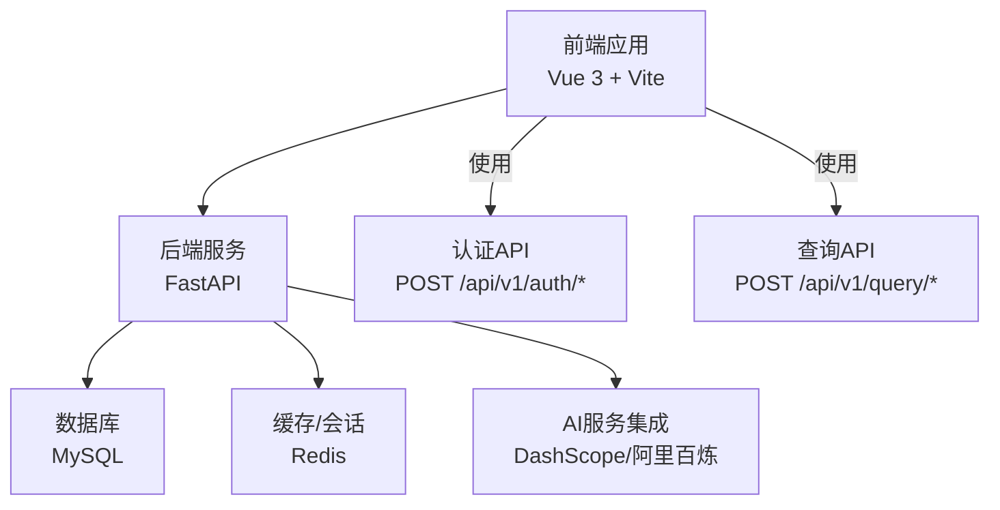
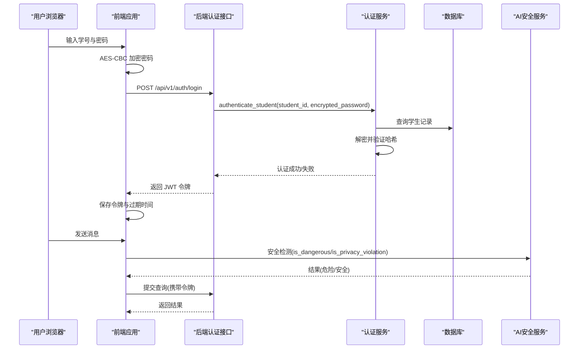
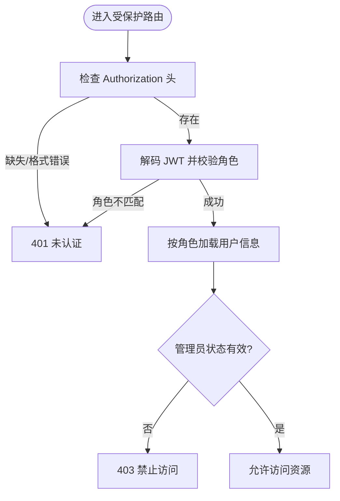
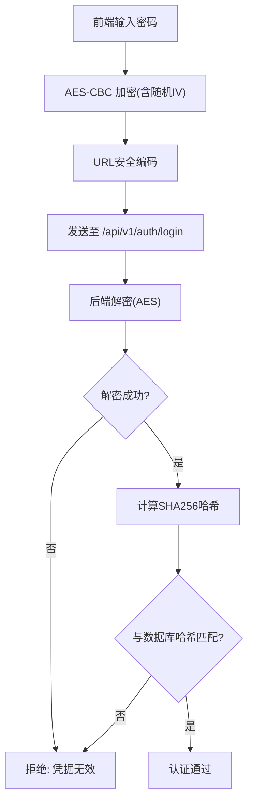
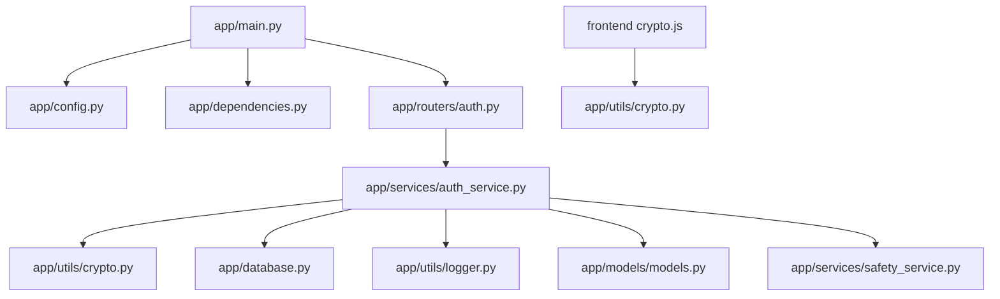

# 安全加固

<cite>
**本文引用的文件**
- [service/ai_assistant/app/main.py](file://service/ai_assistant/app/main.py)
- [service/ai_assistant/app/config.py](file://service/ai_assistant/app/config.py)
- [service/ai_assistant/app/database.py](file://service/ai_assistant/app/database.py)
- [service/ai_assistant/app/routers/auth.py](file://service/ai_assistant/app/routers/auth.py)
- [service/ai_assistant/app/services/auth_service.py](file://service/ai_assistant/app/services/auth_service.py)
- [service/ai_assistant/app/utils/crypto.py](file://service/ai_assistant/app/utils/crypto.py)
- [service/ai_assistant/app/utils/logger.py](file://service/ai_assistant/app/utils/logger.py)
- [service/ai_assistant/app/utils/privacy.py](file://service/ai_assistant/app/utils/privacy.py)
- [service/ai_assistant/app/services/safety_service.py](file://service/ai_assistant/app/services/safety_service.py)
- [service/ai_assistant/app/models/models.py](file://service/ai_assistant/app/models/models.py)
- [service/ai_assistant/app/dependencies.py](file://service/ai_assistant/app/dependencies.py)
- [frontend/ai_assistant/src/utils/crypto.js](file://frontend/ai_assistant/src/utils/crypto.js)
- [frontend/ai_assistant/src/utils/session.js](file://frontend/ai_assistant/src/utils/session.js)
- [frontend/ai_assistant/src/stores/auth.js](file://frontend/ai_assistant/src/stores/auth.js)
- [frontend/ai_assistant/src/api/auth.js](file://frontend/ai_assistant/src/api/auth.js)
</cite>

## 目录
1. [简介](#简介)
2. [项目结构](#项目结构)
3. [核心组件](#核心组件)
4. [架构总览](#架构总览)
5. [详细组件分析](#详细组件分析)
6. [依赖分析](#依赖分析)
7. [性能考量](#性能考量)
8. [故障排查指南](#故障排查指南)
9. [结论](#结论)
10. [附录](#附录)

## 简介
本文件面向“AI校园助手”项目，提供一套系统化的安全加固方案。内容覆盖数据加密、访问控制、输入验证、API安全（JWT、CORS）、数据库安全、AI服务集成安全、网络安全配置、安全审计与漏洞扫描、以及应急响应流程。文档在技术深度与可操作性之间取得平衡，既适用于开发者也便于运维人员落地执行。

## 项目结构
项目采用前后端分离架构：
- 前端：基于 Vue 3 + Vite 的单页应用，负责用户交互、本地会话与敏感数据加密。
- 后端：基于 FastAPI 的异步服务，提供认证授权、业务接口、AI安全检测与日志审计。

图表来源
- [service/ai_assistant/app/main.py:52-86](file://service/ai_assistant/app/main.py#L52-L86)
- [service/ai_assistant/app/config.py:85-110](file://service/ai_assistant/app/config.py#L85-L110)
- [service/ai_assistant/app/database.py:7-20](file://service/ai_assistant/app/database.py#L7-L20)

章节来源
- [service/ai_assistant/app/main.py:1-86](file://service/ai_assistant/app/main.py#L1-L86)
- [service/ai_assistant/app/config.py:1-113](file://service/ai_assistant/app/config.py#L1-L113)
- [service/ai_assistant/app/database.py:1-35](file://service/ai_assistant/app/database.py#L1-L35)

## 核心组件
- 认证与授权：基于 JWT 的学生与管理员双角色体系，配合 Bearer 令牌与依赖注入校验。
- 传输加密：前端使用 AES-CBC 对密码进行加密，后端使用相同密钥解密并进行哈希验证。
- 数据库与缓存：异步 SQLAlchemy 连接池与 Redis 客户端，支持连接复用与超时回收。
- AI 安全：内置危险内容检测与隐私违规检测，支持 LLM 判定与正则回退。
- 日志与审计：统一日志落盘与保留策略，聊天日志含 DID 隐私保护字段。

章节来源
- [service/ai_assistant/app/routers/auth.py:1-102](file://service/ai_assistant/app/routers/auth.py#L1-L102)
- [service/ai_assistant/app/services/auth_service.py:1-253](file://service/ai_assistant/app/services/auth_service.py#L1-L253)
- [service/ai_assistant/app/utils/crypto.py:1-73](file://service/ai_assistant/app/utils/crypto.py#L1-L73)
- [service/ai_assistant/app/utils/logger.py:1-53](file://service/ai_assistant/app/utils/logger.py#L1-L53)
- [service/ai_assistant/app/services/safety_service.py:1-163](file://service/ai_assistant/app/services/safety_service.py#L1-L163)
- [service/ai_assistant/app/models/models.py:625-660](file://service/ai_assistant/app/models/models.py#L625-L660)

## 架构总览
下图展示认证与安全相关的关键交互路径，包括令牌签发、解密与校验、AI 安全检测与日志记录。

图表来源
- [frontend/ai_assistant/src/stores/auth.js:28-43](file://frontend/ai_assistant/src/stores/auth.js#L28-L43)
- [frontend/ai_assistant/src/api/auth.js:15-20](file://frontend/ai_assistant/src/api/auth.js#L15-L20)
- [service/ai_assistant/app/routers/auth.py:24-52](file://service/ai_assistant/app/routers/auth.py#L24-L52)
- [service/ai_assistant/app/services/auth_service.py:125-169](file://service/ai_assistant/app/services/auth_service.py#L125-L169)
- [service/ai_assistant/app/services/safety_service.py:84-144](file://service/ai_assistant/app/services/safety_service.py#L84-L144)

## 详细组件分析

### 认证与访问控制
- 双角色令牌：学生端与管理员端分别签发不同载荷的 JWT，并在解码时严格校验角色字段。
- 依赖注入校验：通过依赖函数自动解析 Bearer 令牌，缺失或无效时统一返回未认证错误。
- 管理员状态校验：管理员令牌解码后还会查询数据库确认账户状态为激活。

图表来源
- [service/ai_assistant/app/dependencies.py:56-108](file://service/ai_assistant/app/dependencies.py#L56-L108)
- [service/ai_assistant/app/services/auth_service.py:78-122](file://service/ai_assistant/app/services/auth_service.py#L78-L122)

章节来源
- [service/ai_assistant/app/routers/auth.py:1-102](file://service/ai_assistant/app/routers/auth.py#L1-L102)
- [service/ai_assistant/app/dependencies.py:1-109](file://service/ai_assistant/app/dependencies.py#L1-L109)
- [service/ai_assistant/app/services/auth_service.py:1-253](file://service/ai_assistant/app/services/auth_service.py#L1-L253)

### 传输加密与密码处理
- 前端加密：使用 CryptoJS 对密码进行 AES-CBC 加密，输出格式为 iv_base64:ciphertext_base64，并进行 URL 安全编码。
- 后端解密：使用配置中的共享密钥进行解密，校验 PKCS7 填充，失败则拒绝认证。
- 哈希验证：明文密码与数据库存储的哈希进行对比，兼容多种格式。

图表来源
- [frontend/ai_assistant/src/utils/crypto.js:26-40](file://frontend/ai_assistant/src/utils/crypto.js#L26-L40)
- [service/ai_assistant/app/utils/crypto.py:39-72](file://service/ai_assistant/app/utils/crypto.py#L39-L72)
- [service/ai_assistant/app/services/auth_service.py:125-169](file://service/ai_assistant/app/services/auth_service.py#L125-L169)

章节来源
- [frontend/ai_assistant/src/utils/crypto.js:1-40](file://frontend/ai_assistant/src/utils/crypto.js#L1-L40)
- [service/ai_assistant/app/utils/crypto.py:1-73](file://service/ai_assistant/app/utils/crypto.py#L1-L73)
- [service/ai_assistant/app/services/auth_service.py:1-253](file://service/ai_assistant/app/services/auth_service.py#L1-L253)

### CORS 与 CSRF 防护
- CORS 配置：通过配置项控制允许来源，建议在生产环境限定为具体域名，避免通配符。
- CSRF 防护：当前未见显式的 CSRF 令牌机制。建议在表单提交场景引入 SameSite Cookie、CSRF Token 或前端白名单策略，确保跨站请求受限。

章节来源
- [service/ai_assistant/app/main.py:66-76](file://service/ai_assistant/app/main.py#L66-L76)
- [service/ai_assistant/app/config.py:17](file://service/ai_assistant/app/config.py#L17)

### 数据库安全配置
- 连接与池化：启用 pre_ping 与 recycle，提升连接稳定性；在 DEBUG 关闭时避免 SQL 泄露。
- 权限控制：数据库凭据通过环境变量注入，建议最小权限原则与只读副本策略。
- 审计日志：聊天日志表包含 did、student_id、system_action 等字段，可用于追踪与审计。

章节来源
- [service/ai_assistant/app/database.py:7-20](file://service/ai_assistant/app/database.py#L7-L20)
- [service/ai_assistant/app/models/models.py:625-660](file://service/ai_assistant/app/models/models.py#L625-L660)

### AI 服务集成安全
- API 密钥保护：通过配置项注入，建议使用只读密钥与最小权限策略。
- 请求签名与速率限制：当前未见签名与限流实现。建议在网关层或中间件增加 HMAC 签名与基于令牌的限流策略。
- 内容安全：内置危险内容与隐私违规检测，支持 LLM 判定与正则回退，异常时降级保障安全。

章节来源
- [service/ai_assistant/app/services/safety_service.py:1-163](file://service/ai_assistant/app/services/safety_service.py#L1-L163)
- [service/ai_assistant/app/config.py:48-80](file://service/ai_assistant/app/config.py#L48-L80)

### 网络安全配置
- 防火墙：仅开放必要端口（如 80/443），内网访问数据库与缓存。
- VPN：内部服务间通信建议通过内网或 VPN，避免公网直连。
- DDoS 防护：建议在边缘层启用 WAF 与限速策略，结合 CDN 与云厂商 DDoS 抗性能力。

（本节为通用指导，无需特定文件引用）

### 安全审计与漏洞扫描
- 日志审计：统一日志落盘，保留 14 天；建议开启敏感操作审计与异常告警。
- 漏洞扫描：定期对依赖包进行 SCA 扫描，对前端与后端进行静态与动态安全测试。

章节来源
- [service/ai_assistant/app/utils/logger.py:17-46](file://service/ai_assistant/app/utils/logger.py#L17-L46)

### 应急响应与事件处理
- 事件分类：凭证泄露、令牌滥用、AI 检测误报/漏报、数据库异常、DDoS 攻击。
- 处置流程：隔离受影响账户、撤销密钥、回滚变更、恢复服务、复盘总结与修复发布。

（本节为通用指导，无需特定文件引用）

## 依赖分析
后端主要外部依赖与职责：
- FastAPI：Web 框架与路由注册。
- SQLAlchemy Async：异步 ORM 与连接池。
- Redis：异步客户端用于缓存与会话。
- Pydantic Settings：配置管理。
- Loguru：统一日志。
- DashScope：AI 安全检测与模型调用。

图表来源
- [service/ai_assistant/app/main.py:12-14](file://service/ai_assistant/app/main.py#L12-L14)
- [service/ai_assistant/app/routers/auth.py:7-19](file://service/ai_assistant/app/routers/auth.py#L7-L19)
- [service/ai_assistant/app/services/auth_service.py:11-14](file://service/ai_assistant/app/services/auth_service.py#L11-L14)
- [frontend/ai_assistant/src/utils/crypto.js:9](file://frontend/ai_assistant/src/utils/crypto.js#L9)

章节来源
- [service/ai_assistant/app/main.py:1-86](file://service/ai_assistant/app/main.py#L1-L86)
- [service/ai_assistant/app/routers/auth.py:1-102](file://service/ai_assistant/app/routers/auth.py#L1-L102)
- [service/ai_assistant/app/services/auth_service.py:1-253](file://service/ai_assistant/app/services/auth_service.py#L1-L253)
- [frontend/ai_assistant/src/utils/crypto.js:1-40](file://frontend/ai_assistant/src/utils/crypto.js#L1-L40)

## 性能考量
- 连接池与回收：数据库与 Redis 连接池参数合理配置，避免频繁重建。
- 日志级别：生产环境建议 INFO 级别，避免过多 DEBUG 输出影响性能。
- AI 调用：LLM 调用异步化并降级回退，减少阻塞风险。

（本节为通用指导，无需特定文件引用）

## 故障排查指南
- 认证失败
  - 检查前端是否正确加密密码并按约定格式传输。
  - 核对后端 AES 密钥长度与配置项一致性。
  - 查看日志中“解密失败/哈希不匹配”的记录。
- 令牌无效
  - 确认请求头 Authorization 是否为 Bearer 令牌。
  - 校验 JWT_SECRET_KEY 与前端/后端配置一致。
  - 检查令牌过期时间与服务器时区。
- CORS 错误
  - 校验 CORS_ALLOW_ORIGINS 配置，生产环境避免通配符。
- 数据库连接问题
  - 检查主机、端口、用户名与密码，确认网络可达。
- AI 安全检测异常
  - 检查 API Key 与模型名称配置，查看降级回退日志。

章节来源
- [service/ai_assistant/app/utils/crypto.py:17-22](file://service/ai_assistant/app/utils/crypto.py#L17-L22)
- [service/ai_assistant/app/services/auth_service.py:78-95](file://service/ai_assistant/app/services/auth_service.py#L78-L95)
- [service/ai_assistant/app/main.py:66-76](file://service/ai_assistant/app/main.py#L66-L76)
- [service/ai_assistant/app/database.py:7-12](file://service/ai_assistant/app/database.py#L7-L12)
- [service/ai_assistant/app/services/safety_service.py:117-144](file://service/ai_assistant/app/services/safety_service.py#L117-L144)

## 结论
本项目在认证与数据传输方面具备基础安全能力，但在 CORS 限制、CSRF 防护、AI 服务签名与限流、以及网络安全边界等方面仍有改进空间。建议优先完成密钥与配置加固、CORS 与 CSRF 防护完善、以及网关层限流与 WAF 部署，随后逐步引入更严格的审计与自动化漏洞扫描，形成闭环的安全运营体系。

## 附录

### 配置清单与加固要点
- 环境变量与密钥
  - JWT_SECRET_KEY：高强度随机字符串，定期轮换。
  - AES_SECRET_KEY：16/24/32 字符，前后端一致。
  - DID_SALT：随机盐值，增强 DID 不可逆性。
  - 数据库与 Redis 密码：最小权限与定期轮换。
- CORS
  - 生产环境仅允许受信域名，避免通配符。
- CSRF
  - 引入 CSRF Token 或 SameSite Cookie 策略。
- AI 服务
  - 配置只读 API Key，接入签名与限流。
- 日志
  - 保留 14 天，分级输出，敏感字段脱敏。

章节来源
- [service/ai_assistant/app/config.py:32-44](file://service/ai_assistant/app/config.py#L32-L44)
- [service/ai_assistant/app/utils/privacy.py:9-22](file://service/ai_assistant/app/utils/privacy.py#L9-L22)
- [service/ai_assistant/app/main.py:66-76](file://service/ai_assistant/app/main.py#L66-L76)
- [service/ai_assistant/app/utils/logger.py:28-43](file://service/ai_assistant/app/utils/logger.py#L28-L43)