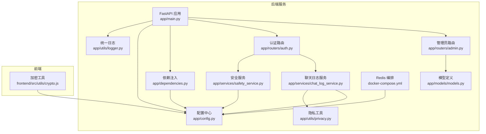
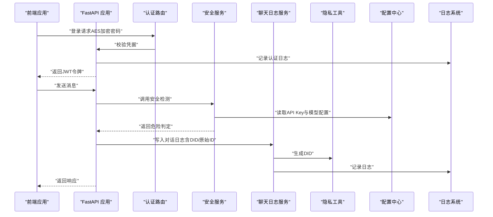
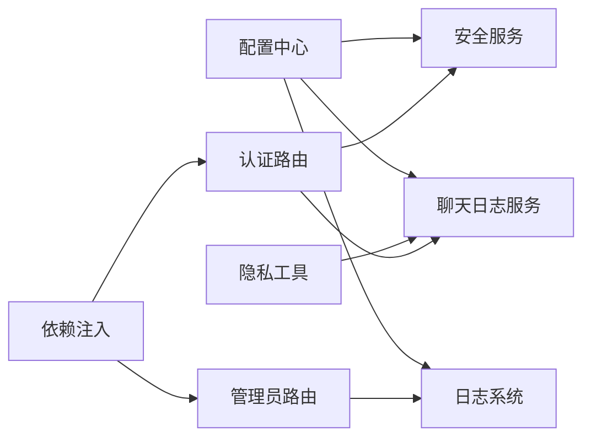

# 安全审计

<cite>
**本文引用的文件**
- [service/ai_assistant/app/utils/logger.py](file://service/ai_assistant/app/utils/logger.py)
- [service/ai_assistant/app/main.py](file://service/ai_assistant/app/main.py)
- [service/ai_assistant/app/config.py](file://service/ai_assistant/app/config.py)
- [service/ai_assistant/app/services/safety_service.py](file://service/ai_assistant/app/services/safety_service.py)
- [service/ai_assistant/app/routers/auth.py](file://service/ai_assistant/app/routers/auth.py)
- [service/ai_assistant/app/routers/admin.py](file://service/ai_assistant/app/routers/admin.py)
- [service/ai_assistant/app/utils/privacy.py](file://service/ai_assistant/app/utils/privacy.py)
- [service/ai_assistant/app/services/chat_log_service.py](file://service/ai_assistant/app/services/chat_log_service.py)
- [service/ai_assistant/docker-compose.yml](file://service/ai_assistant/docker-compose.yml)
- [service/ai_assistant/app/models/models.py](file://service/ai_assistant/app/models/models.py)
- [service/ai_assistant/app/dependencies.py](file://service/ai_assistant/app/dependencies.py)
- [frontend/ai_assistant/src/utils/crypto.js](file://frontend/ai_assistant/src/utils/crypto.js)
</cite>

## 目录
1. [引言](#引言)
2. [项目结构](#项目结构)
3. [核心组件](#核心组件)
4. [架构总览](#架构总览)
5. [详细组件分析](#详细组件分析)
6. [依赖分析](#依赖分析)
7. [性能考虑](#性能考虑)
8. [故障排查指南](#故障排查指南)
9. [结论](#结论)
10. [附录](#附录)

## 引言
本指南面向AI校园助手项目的安全审计，围绕日志采集与存储、安全事件监控与告警、漏洞扫描与渗透测试、安全基线检查、合规性审计以及安全事件响应与恢复等方面，提供可落地的实施建议。文档基于仓库现有实现进行分析，并结合最佳实践给出补充方案。

## 项目结构
后端采用FastAPI + SQLAlchemy + Redis + MySQL，前端采用Vue + Vite。安全相关的关键实现集中在日志、配置、认证、隐私与安全检测模块，以及容器编排配置。

图表来源
- [service/ai_assistant/app/main.py:1-86](file://service/ai_assistant/app/main.py#L1-L86)
- [service/ai_assistant/app/utils/logger.py:1-53](file://service/ai_assistant/app/utils/logger.py#L1-L53)
- [service/ai_assistant/app/config.py:1-113](file://service/ai_assistant/app/config.py#L1-L113)
- [service/ai_assistant/app/services/safety_service.py:1-163](file://service/ai_assistant/app/services/safety_service.py#L1-L163)
- [service/ai_assistant/app/services/chat_log_service.py:1-76](file://service/ai_assistant/app/services/chat_log_service.py#L1-L76)
- [service/ai_assistant/app/utils/privacy.py:1-23](file://service/ai_assistant/app/utils/privacy.py#L1-L23)
- [service/ai_assistant/app/routers/auth.py:1-102](file://service/ai_assistant/app/routers/auth.py#L1-L102)
- [service/ai_assistant/app/routers/admin.py:1-388](file://service/ai_assistant/app/routers/admin.py#L1-L388)
- [service/ai_assistant/app/dependencies.py:1-109](file://service/ai_assistant/app/dependencies.py#L1-L109)
- [service/ai_assistant/docker-compose.yml:1-31](file://service/ai_assistant/docker-compose.yml#L1-L31)
- [frontend/ai_assistant/src/utils/crypto.js:1-40](file://frontend/ai_assistant/src/utils/crypto.js#L1-L40)

章节来源
- [service/ai_assistant/app/main.py:1-86](file://service/ai_assistant/app/main.py#L1-L86)
- [service/ai_assistant/app/config.py:1-113](file://service/ai_assistant/app/config.py#L1-L113)

## 核心组件
- 日志系统：统一使用Loguru，控制台与文件双输出，文件按大小轮转并保留14天。
- 安全检测：基于阿里DashScope的LLM进行危险内容检测，同时保留正则回退。
- 隐私保护：使用DID对学号进行稳定哈希脱敏，危险消息保留原始ID。
- 认证与授权：JWT令牌签发与校验，管理员角色与状态校验。
- 管理员审计：记录管理员关键操作日志，支持状态变更审计。
- 前端加密：前端使用CryptoJS对密码进行AES-CBC加密，编码格式与后端一致。

章节来源
- [service/ai_assistant/app/utils/logger.py:17-53](file://service/ai_assistant/app/utils/logger.py#L17-L53)
- [service/ai_assistant/app/services/safety_service.py:84-144](file://service/ai_assistant/app/services/safety_service.py#L84-L144)
- [service/ai_assistant/app/utils/privacy.py:9-22](file://service/ai_assistant/app/utils/privacy.py#L9-L22)
- [service/ai_assistant/app/routers/auth.py:24-52](file://service/ai_assistant/app/routers/auth.py#L24-L52)
- [service/ai_assistant/app/routers/admin.py:352-387](file://service/ai_assistant/app/routers/admin.py#L352-L387)
- [frontend/ai_assistant/src/utils/crypto.js:26-40](file://frontend/ai_assistant/src/utils/crypto.js#L26-L40)

## 架构总览
下图展示运行时关键安全相关组件的交互关系与数据流。

图表来源
- [service/ai_assistant/app/routers/auth.py:24-52](file://service/ai_assistant/app/routers/auth.py#L24-L52)
- [service/ai_assistant/app/services/safety_service.py:84-144](file://service/ai_assistant/app/services/safety_service.py#L84-L144)
- [service/ai_assistant/app/services/chat_log_service.py:14-55](file://service/ai_assistant/app/services/chat_log_service.py#L14-L55)
- [service/ai_assistant/app/utils/privacy.py:9-22](file://service/ai_assistant/app/utils/privacy.py#L9-L22)
- [service/ai_assistant/app/utils/logger.py:17-53](file://service/ai_assistant/app/utils/logger.py#L17-L53)
- [service/ai_assistant/app/config.py:12-112](file://service/ai_assistant/app/config.py#L12-L112)

## 详细组件分析

### 日志系统与存储策略
- 统一日志：控制台INFO级别与文件DEBUG级别输出，文件路径位于服务根目录logs目录，文件名固定。
- 文件轮转：单文件最大10MB，保留14天。
- 日志格式：包含时间戳、级别、模块名:函数:行号、消息。
- 初始化：应用启动时自动初始化，确保全局日志落盘。

建议
- 访问日志：在网关或中间件层增加请求/响应摘要日志，记录IP、URL、方法、状态码、耗时。
- 操作日志：管理员操作日志已覆盖关键动作，建议补充字段如request_ip、user_agent等。
- 错误日志：错误堆栈与敏感参数需脱敏，避免泄露。

章节来源
- [service/ai_assistant/app/utils/logger.py:17-53](file://service/ai_assistant/app/utils/logger.py#L17-L53)
- [service/ai_assistant/app/main.py:36-49](file://service/ai_assistant/app/main.py#L36-L49)

### 安全检测与隐私保护
- 危险内容检测：使用LLM进行语义判断，若格式异常或调用失败则回退至正则匹配。
- 公共服务查询放行：对“查询公共服务联系方式”的场景放行，避免误伤。
- 隐私保护：普通消息仅存储DID，危险消息保留原始ID以便干预；DID基于salt与ID组合的哈希，保证稳定性与不可逆性。

建议
- 异常登录检测：在认证路由中增加登录失败计数与封禁逻辑，结合IP与UA维度。
- API调用异常：对高频请求、异常状态码、超长输入进行阈值监控。
- 系统资源异常：监控CPU、内存、磁盘、连接池使用率，设置告警阈值。

章节来源
- [service/ai_assistant/app/services/safety_service.py:84-144](file://service/ai_assistant/app/services/safety_service.py#L84-L144)
- [service/ai_assistant/app/utils/privacy.py:9-22](file://service/ai_assistant/app/utils/privacy.py#L9-L22)
- [service/ai_assistant/app/services/chat_log_service.py:14-55](file://service/ai_assistant/app/services/chat_log_service.py#L14-L55)

### 认证与授权
- 登录流程：前端使用AES-CBC加密密码，后端校验并通过JWT签发令牌。
- 权限校验：依赖注入中对Bearer令牌进行解码，管理员状态校验。
- 不安全默认：应用启动时检测JWT、AES、盐值是否为默认值，发出安全警告。

建议
- 强制HTTPS与安全头：生产环境启用HTTPS、CORS白名单、安全Cookie属性。
- 令牌安全：缩短过期时间、支持刷新令牌、黑名单机制。
- 管理员权限：最小权限原则，分角色与职责分离。

章节来源
- [service/ai_assistant/app/routers/auth.py:24-52](file://service/ai_assistant/app/routers/auth.py#L24-L52)
- [service/ai_assistant/app/dependencies.py:56-107](file://service/ai_assistant/app/dependencies.py#L56-L107)
- [service/ai_assistant/app/main.py:25-33](file://service/ai_assistant/app/main.py#L25-L33)
- [frontend/ai_assistant/src/utils/crypto.js:26-40](file://frontend/ai_assistant/src/utils/crypto.js#L26-L40)

### 管理员审计与操作日志
- 审计范围：管理员状态变更、关键数据更新等。
- 审计字段：操作类型、目标表与主键、变更前后JSON、记录时间。
- 缓存一致性：状态变更后尝试提升缓存版本，失败时记录异常。

建议
- 完整审计：补充请求IP、User-Agent、请求体摘要等字段。
- 审计查询：建立索引与查询视图，支持按管理员、时间、目标对象过滤。

章节来源
- [service/ai_assistant/app/routers/admin.py:352-387](file://service/ai_assistant/app/routers/admin.py#L352-L387)
- [service/ai_assistant/app/models/models.py:86-112](file://service/ai_assistant/app/models/models.py#L86-L112)

### 配置与密钥管理
- 配置来源：.env文件，包含数据库、Redis、JWT、AES、DID、模型等。
- 生产风险：应用启动时检测不安全默认值，提示更换。

建议
- 密钥轮换：定期轮换JWT、AES、DID盐值，使用密钥管理服务。
- 环境隔离：开发/测试/生产环境配置严格分离。

章节来源
- [service/ai_assistant/app/config.py:12-112](file://service/ai_assistant/app/config.py#L12-L112)
- [service/ai_assistant/app/main.py:25-33](file://service/ai_assistant/app/main.py#L25-L33)

### 前端加密与传输安全
- 加密格式：iv_base64:ciphertext_base64，URL安全Base64编码。
- 密钥来源：VITE_AES_SECRET_KEY，需与后端一致。

建议
- 强制HTTPS：防止中间人攻击与密钥泄露。
- 输入校验：前后端均进行长度、格式与字符集校验。

章节来源
- [frontend/ai_assistant/src/utils/crypto.js:9-40](file://frontend/ai_assistant/src/utils/crypto.js#L9-L40)

### 容器与基础设施
- Redis：设置密码、内存上限与淘汰策略，健康检查。
- 网络：桥接网络，便于服务间通信。

建议
- 网络隔离：生产环境使用独立子网与防火墙策略。
- 备份与快照：定期备份Redis与MySQL数据卷。

章节来源
- [service/ai_assistant/docker-compose.yml:5-24](file://service/ai_assistant/docker-compose.yml#L5-L24)

## 依赖分析
- 组件耦合：日志、配置、安全服务、聊天日志服务、隐私工具之间存在直接依赖；认证与依赖注入模块贯穿各路由。
- 外部依赖：阿里DashScope API、Redis、MySQL。
- 潜在风险：LLM调用失败时的回退逻辑、DID生成的唯一性与稳定性。

图表来源
- [service/ai_assistant/app/config.py:12-112](file://service/ai_assistant/app/config.py#L12-L112)
- [service/ai_assistant/app/utils/logger.py:17-53](file://service/ai_assistant/app/utils/logger.py#L17-L53)
- [service/ai_assistant/app/services/safety_service.py:84-144](file://service/ai_assistant/app/services/safety_service.py#L84-L144)
- [service/ai_assistant/app/services/chat_log_service.py:14-55](file://service/ai_assistant/app/services/chat_log_service.py#L14-L55)
- [service/ai_assistant/app/utils/privacy.py:9-22](file://service/ai_assistant/app/utils/privacy.py#L9-L22)
- [service/ai_assistant/app/routers/auth.py:24-52](file://service/ai_assistant/app/routers/auth.py#L24-L52)
- [service/ai_assistant/app/routers/admin.py:352-387](file://service/ai_assistant/app/routers/admin.py#L352-L387)
- [service/ai_assistant/app/dependencies.py:56-107](file://service/ai_assistant/app/dependencies.py#L56-L107)

## 性能考虑
- 日志写入：异步队列与批量刷盘，避免阻塞请求。
- LLM调用：异步线程池调用，失败回退正则，减少延迟。
- 缓存：Redis用于会话与热点数据，注意内存策略与持久化。
- 数据库：合理索引与查询优化，避免N+1问题。

## 故障排查指南
常见问题与定位思路
- 认证失败：检查AES密钥一致性、JWT签名算法与过期时间、.env配置项。
- 安全检测异常：确认阿里DashScope API Key有效、模型名称正确、网络可达。
- 日志未落盘：确认日志目录权限、文件轮转与保留策略。
- 管理员状态异常：确认管理员状态为active，令牌有效。

章节来源
- [service/ai_assistant/app/main.py:25-33](file://service/ai_assistant/app/main.py#L25-L33)
- [service/ai_assistant/app/services/safety_service.py:117-143](file://service/ai_assistant/app/services/safety_service.py#L117-L143)
- [service/ai_assistant/app/utils/logger.py:23-46](file://service/ai_assistant/app/utils/logger.py#L23-L46)
- [service/ai_assistant/app/dependencies.py:93-107](file://service/ai_assistant/app/dependencies.py#L93-L107)

## 结论
本项目在日志、安全检测、隐私保护与认证方面具备基础能力，建议在生产环境中进一步完善访问/操作/错误日志的完整性与保留策略、引入异常登录与API调用异常监控、加强密钥与配置管理、完善合规性与事件响应流程，以满足更严格的安全部署要求。

## 附录

### 安全日志收集与存储策略（建议）
- 访问日志：记录请求时间、客户端IP、User-Agent、URL、方法、状态码、耗时；保留90天。
- 操作日志：管理员操作摘要、变更前后对比、请求IP、时间戳；保留180天。
- 错误日志：错误时间、模块、堆栈摘要、上下文参数（脱敏）；保留30天。
- 存储：集中化日志收集（如ELK/OTel），按天/月归档，保留期限与合规要求一致。

### 安全事件监控与告警（建议）
- 异常登录：失败次数阈值、IP/UA异常、短时间内多账户尝试。
- API异常：异常状态码占比、超时率、输入长度异常、频繁访问。
- 资源异常：CPU/内存/磁盘/连接池使用率、慢查询、队列积压。

### 漏洞扫描与渗透测试（建议）
- 定期扫描：DAST/SAST工具（如OWASP ZAP、SonarQube）按季度执行。
- 手动测试：业务逻辑高危点（认证绕过、越权、敏感信息泄露）专项测试。
- 自动化测试：CI集成静态扫描与API安全测试脚本。

### 安全基线检查清单（建议）
- 系统配置：最小权限、禁用默认账户、强制密码复杂度、自动锁屏。
- 权限审计：RBAC最小权限、定期权限复查、特权操作双因子。
- 补丁管理：操作系统与依赖库定期更新，漏洞修复时限。

### 合规性审计（建议）
- 数据保护：个人信息处理目的明确、数据最小化、数据主体权利保障。
- 行业标准：等保/ISO 27001/数据安全法等，形成审计报告与整改闭环。

### 安全事件响应与恢复（建议）
- 响应流程：分级分类、快速隔离、取证分析、修复与验证、复盘改进。
- 恢复策略：备份策略、RTO/RPO目标、演练与验证。
- 文档化：事件处置手册、应急预案、培训与演练记录。