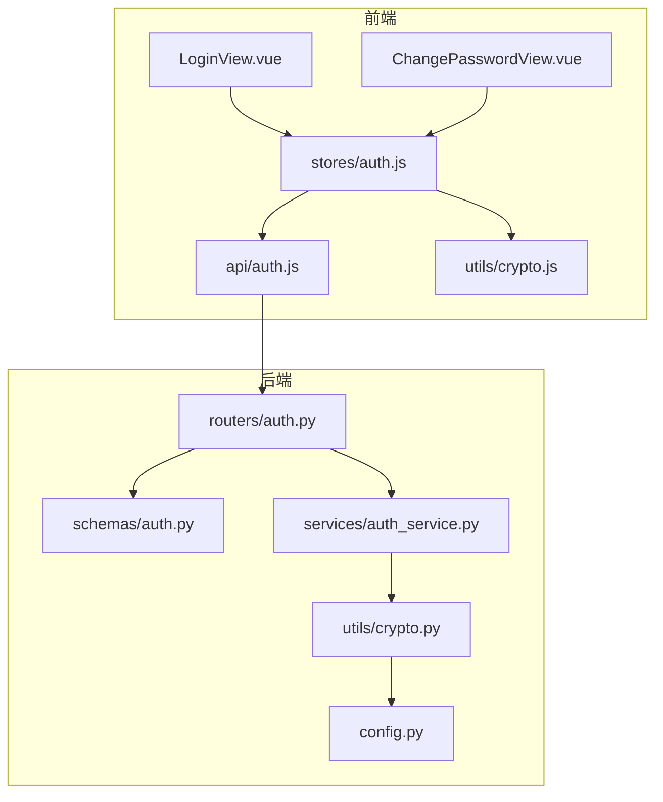
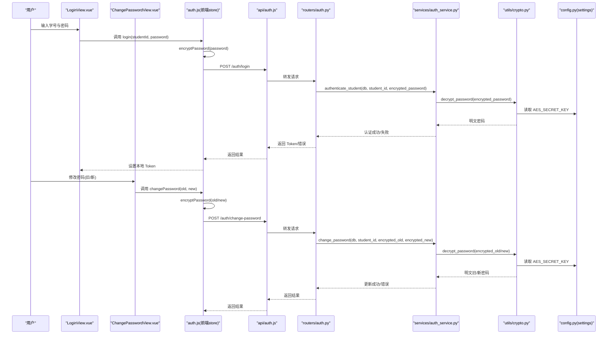
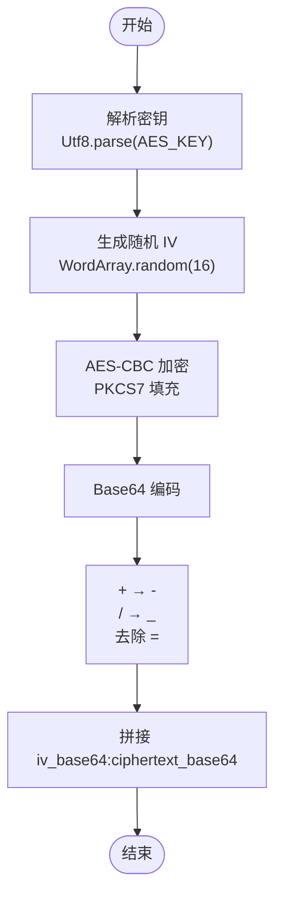
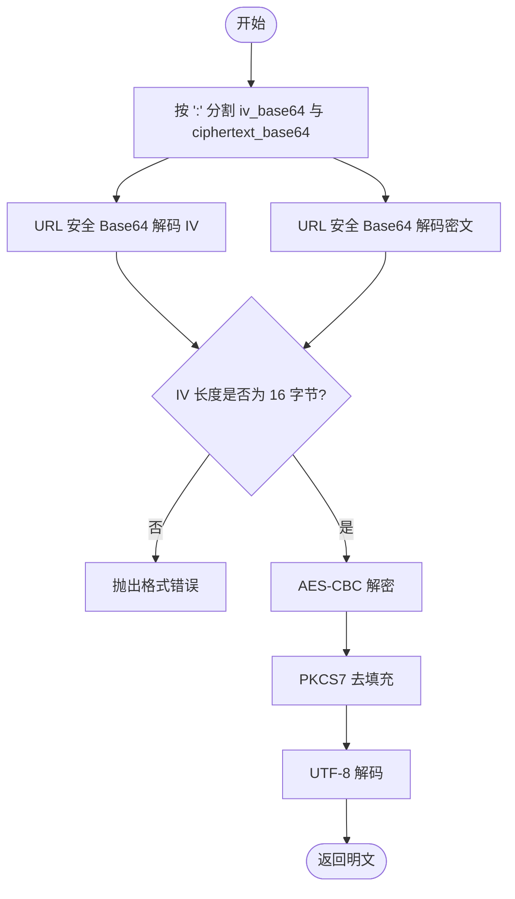
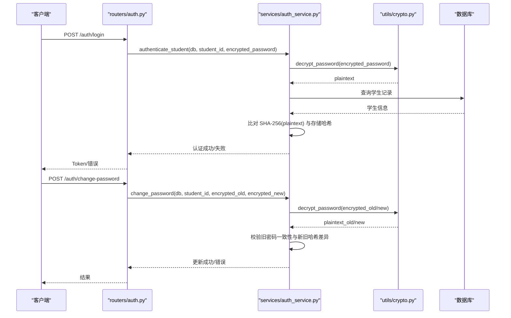
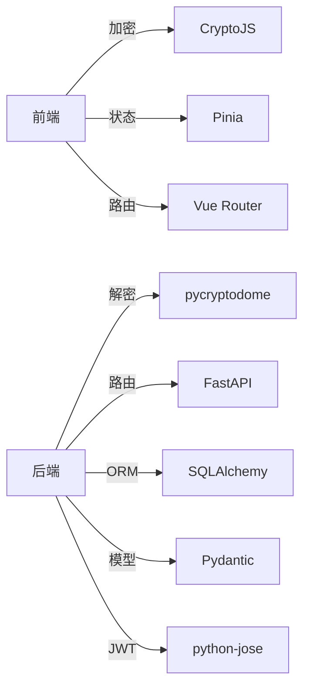

# 密码加密机制

<cite>
**本文引用的文件**
- [crypto.js](file://frontend/ai_assistant/src/utils/crypto.js)
- [crypto.py](file://service/ai_assistant/app/utils/crypto.py)
- [privacy.py](file://service/ai_assistant/app/utils/privacy.py)
- [config.py](file://service/ai_assistant/app/config.py)
- [auth.js](file://frontend/ai_assistant/src/stores/auth.js)
- [auth.py](file://service/ai_assistant/app/routers/auth.py)
- [auth_service.py](file://service/ai_assistant/app/services/auth_service.py)
- [auth.py](file://service/ai_assistant/app/schemas/auth.py)
- [auth.js](file://frontend/ai_assistant/src/api/auth.js)
- [LoginView.vue](file://frontend/ai_assistant/src/views/LoginView.vue)
- [ChangePasswordView.vue](file://frontend/ai_assistant/src/views/ChangePasswordView.vue)
</cite>

## 目录
1. [简介](#简介)
2. [项目结构](#项目结构)
3. [核心组件](#核心组件)
4. [架构总览](#架构总览)
5. [详细组件分析](#详细组件分析)
6. [依赖关系分析](#依赖关系分析)
7. [性能考量](#性能考量)
8. [故障排查指南](#故障排查指南)
9. [结论](#结论)
10. [附录](#附录)

## 简介
本文件系统性阐述 AI 校园助手的密码加密机制，重点覆盖以下方面：
- AES-CBC 对称加密的实现原理与流程（密钥管理、IV 生成、加密过程）
- 前后端密码加密的完整链路（前端 CryptoJS 加密到后端 Python 解密）
- URL 安全 Base64 编码的处理机制（字符替换与填充规则）
- 加密配置最佳实践（密钥长度要求与安全性建议）
- 错误处理与异常场景的处理方法

## 项目结构
围绕密码加密的关键文件分布如下：
- 前端：加密工具与调用链
  - utils/crypto.js：前端 AES-CBC 加密与 URL 安全 Base64 编码
  - stores/auth.js：登录与修改密码时的加密调用
  - api/auth.js：封装登录与修改密码的 HTTP 请求
  - views/LoginView.vue、views/ChangePasswordView.vue：用户界面与交互
- 后端：解密与业务逻辑
  - utils/crypto.py：后端 AES-CBC 解密与 URL 安全 Base64 解码
  - services/auth_service.py：认证与改密流程（调用解密与哈希验证）
  - routers/auth.py：认证与改密接口定义
  - schemas/auth.py：请求体模型（兼容字段名）
  - config.py：密钥与运行参数配置

图表来源
- [crypto.js:1-40](file://frontend/ai_assistant/src/utils/crypto.js#L1-L40)
- [auth.js:1-77](file://frontend/ai_assistant/src/stores/auth.js#L1-L77)
- [auth.js:1-36](file://frontend/ai_assistant/src/api/auth.js#L1-L36)
- [auth.py:1-102](file://service/ai_assistant/app/routers/auth.py#L1-L102)
- [auth.py:1-56](file://service/ai_assistant/app/schemas/auth.py#L1-L56)
- [auth_service.py:1-253](file://service/ai_assistant/app/services/auth_service.py#L1-L253)
- [crypto.py:1-73](file://service/ai_assistant/app/utils/crypto.py#L1-L73)
- [config.py:1-113](file://service/ai_assistant/app/config.py#L1-L113)

章节来源
- [crypto.js:1-40](file://frontend/ai_assistant/src/utils/crypto.js#L1-L40)
- [auth.js:1-77](file://frontend/ai_assistant/src/stores/auth.js#L1-L77)
- [auth.js:1-36](file://frontend/ai_assistant/src/api/auth.js#L1-L36)
- [auth.py:1-102](file://service/ai_assistant/app/routers/auth.py#L1-L102)
- [auth.py:1-56](file://service/ai_assistant/app/schemas/auth.py#L1-L56)
- [auth_service.py:1-253](file://service/ai_assistant/app/services/auth_service.py#L1-L253)
- [crypto.py:1-73](file://service/ai_assistant/app/utils/crypto.py#L1-L73)
- [config.py:1-113](file://service/ai_assistant/app/config.py#L1-L113)

## 核心组件
- 前端加密工具
  - AES-CBC 加密：使用随机 16 字节 IV，PKCS7 填充，输出 iv_base64:ciphertext_base64
  - URL 安全 Base64：将 +/ 替换为 -/_，去除尾部 =，便于 URL 传输
  - 密钥来源：VITE_AES_SECRET_KEY 环境变量（未设置时使用默认值）
- 后端解密工具
  - URL 安全 Base64 解码：还原 -/_ 为 +/，补齐 =，再进行标准 Base64 解码
  - AES-CBC 解密：按 16 字节 IV 校验，PKCS7 去填充，UTF-8 输出
  - 密钥来源：settings.AES_SECRET_KEY（16/24/32 字节）
- 认证与改密服务
  - 登录：解密前端加密密码，与数据库中 SHA-256 哈希比对
  - 改密：解密旧密码与新密码，验证旧密码一致性，更新为新 SHA-256 哈希

章节来源
- [crypto.js:1-40](file://frontend/ai_assistant/src/utils/crypto.js#L1-L40)
- [crypto.py:1-73](file://service/ai_assistant/app/utils/crypto.py#L1-L73)
- [auth_service.py:125-210](file://service/ai_assistant/app/services/auth_service.py#L125-L210)
- [config.py:37-41](file://service/ai_assistant/app/config.py#L37-L41)

## 架构总览
下图展示从前端到后端的密码加密与解密端到端流程。

图表来源
- [LoginView.vue:94-121](file://frontend/ai_assistant/src/views/LoginView.vue#L94-L121)
- [ChangePasswordView.vue:191-232](file://frontend/ai_assistant/src/views/ChangePasswordView.vue#L191-L232)
- [auth.js:28-56](file://frontend/ai_assistant/src/stores/auth.js#L28-L56)
- [auth.js:15-35](file://frontend/ai_assistant/src/api/auth.js#L15-L35)
- [auth.py:24-52](file://service/ai_assistant/app/routers/auth.py#L24-L52)
- [auth_service.py:125-210](file://service/ai_assistant/app/services/auth_service.py#L125-L210)
- [crypto.py:39-72](file://service/ai_assistant/app/utils/crypto.py#L39-L72)
- [config.py:37-41](file://service/ai_assistant/app/config.py#L37-L41)

## 详细组件分析

### 前端加密组件（CryptoJS）
- 密钥与 IV
  - 密钥：从 VITE_AES_SECRET_KEY 读取；若未设置则使用默认值（仅用于演示）
  - IV：每次加密随机生成 16 字节
- 加密算法与填充
  - AES-CBC + PKCS7 填充
- Base64 编码与 URL 安全化
  - 先进行标准 Base64 编码，再将 + 替换为 -，/ 替换为 _，去除尾部 =，形成 URL 安全字符串
- 输出格式
  - iv_base64:ciphertext_base64

图表来源
- [crypto.js:26-40](file://frontend/ai_assistant/src/utils/crypto.js#L26-L40)

章节来源
- [crypto.js:1-40](file://frontend/ai_assistant/src/utils/crypto.js#L1-L40)

### 后端解密组件（Python）
- 密钥加载
  - 从 settings.AES_SECRET_KEY 读取 UTF-8 字符串，长度必须为 16/24/32 字节
- URL 安全 Base64 解码
  - 将 - 还原为 +，_ 还原为 /，补齐 =，再进行标准 Base64 解码
- AES-CBC 解密与去填充
  - 校验 IV 长度为 16 字节
  - 使用密钥与 IV 执行 AES-CBC 解密，PKCS7 去填充，UTF-8 输出
- 异常处理
  - 格式错误、IV 长度不符、解密失败均抛出 ValueError

图表来源
- [crypto.py:39-72](file://service/ai_assistant/app/utils/crypto.py#L39-L72)

章节来源
- [crypto.py:1-73](file://service/ai_assistant/app/utils/crypto.py#L1-L73)
- [config.py:37-41](file://service/ai_assistant/app/config.py#L37-L41)

### 认证与改密服务
- 登录流程
  - 根据 student_id 查询学生记录
  - 解密前端加密密码，与数据库中 SHA-256 哈希比对
  - 成功则签发 JWT，失败返回 401
- 改密流程
  - 校验 student_id 与当前用户一致
  - 解密旧密码与新密码，验证旧密码一致性
  - 新旧密码哈希不同才允许更新
  - 失败时根据原因映射为 400/403/404

图表来源
- [auth.py:24-101](file://service/ai_assistant/app/routers/auth.py#L24-L101)
- [auth_service.py:125-210](file://service/ai_assistant/app/services/auth_service.py#L125-L210)
- [crypto.py:39-72](file://service/ai_assistant/app/utils/crypto.py#L39-L72)

章节来源
- [auth.py:1-102](file://service/ai_assistant/app/routers/auth.py#L1-L102)
- [auth_service.py:125-210](file://service/ai_assistant/app/services/auth_service.py#L125-L210)

### 前后端调用链与数据流
- 登录
  - LoginView.vue 触发登录，auth.js 调用 encryptPassword，api/auth.js 发送加密密码
  - 后端 routers/auth.py 接收并转发至 services/auth_service.py
  - services/auth_service.py 调用 utils/crypto.py 解密，再与数据库哈希比对
- 修改密码
  - ChangePasswordView.vue 触发改密，auth.js 同时加密旧/新密码并发送
  - 后端校验旧密码一致性与新旧哈希差异，成功则更新

章节来源
- [LoginView.vue:94-121](file://frontend/ai_assistant/src/views/LoginView.vue#L94-L121)
- [ChangePasswordView.vue:191-232](file://frontend/ai_assistant/src/views/ChangePasswordView.vue#L191-L232)
- [auth.js:28-56](file://frontend/ai_assistant/src/stores/auth.js#L28-L56)
- [auth.js:15-35](file://frontend/ai_assistant/src/api/auth.js#L15-L35)
- [auth.py:55-101](file://service/ai_assistant/app/routers/auth.py#L55-L101)
- [auth_service.py:173-210](file://service/ai_assistant/app/services/auth_service.py#L173-L210)

## 依赖关系分析
- 前端依赖
  - CryptoJS：AES-CBC 与 Base64 编解码
  - Pinia：状态管理（token、studentId、expiresAt）
  - Vue Router：页面跳转
- 后端依赖
  - pycryptodome：AES-CBC 与 PKCS7 去填充
  - fastapi：路由与响应模型
  - SQLAlchemy：数据库访问
  - Pydantic：请求体模型与校验
  - python-jose：JWT 编解码

图表来源
- [crypto.js:7-7](file://frontend/ai_assistant/src/utils/crypto.js#L7-L7)
- [auth.js:8-11](file://frontend/ai_assistant/src/stores/auth.js#L8-L11)
- [auth_service.py:7-14](file://service/ai_assistant/app/services/auth_service.py#L7-L14)

章节来源
- [auth_service.py:1-253](file://service/ai_assistant/app/services/auth_service.py#L1-L253)

## 性能考量
- 加密/解密开销
  - AES-CBC 与 PKCS7 处理为轻量级操作，对用户体验影响可忽略
- Base64 编解码
  - URL 安全 Base64 仅做字符替换与填充补齐，开销极小
- 建议
  - 前端仅在登录与改密时执行一次加密，避免重复加密
  - 后端解密与哈希验证均为 O(1)，无需额外优化

[本节为通用指导，不直接分析具体文件]

## 故障排查指南
- 常见错误与定位
  - 无效的加密格式（缺少分隔符或格式不匹配）
    - 前端：检查加密输出格式是否为 iv_base64:ciphertext_base64
    - 后端：decrypt_password 在分割与 IV 长度校验阶段抛出异常
  - IV 长度不符（非 16 字节）
    - 后端：decrypt_password 对 IV 长度进行严格校验
  - 解密失败（密钥不一致或密文损坏）
    - 后端：AES.new 或 decrypt 抛出异常，统一包装为 ValueError
  - 旧密码错误或新旧密码相同
    - 后端：change_password 根据原因映射为 400/403/404
- 建议排查步骤
  - 确认前后端 AES_SECRET_KEY 一致且长度为 16/24/32 字节
  - 确认前端 URL 安全 Base64 编码与后端 URL 安全 Base64 解码一致
  - 检查网络传输是否丢失或截断（尤其是 : 分隔符）

章节来源
- [crypto.py:52-72](file://service/ai_assistant/app/utils/crypto.py#L52-L72)
- [auth_service.py:189-209](file://service/ai_assistant/app/services/auth_service.py#L189-L209)
- [auth.py:86-99](file://service/ai_assistant/app/routers/auth.py#L86-L99)

## 结论
本项目采用 AES-CBC 对称加密配合 URL 安全 Base64 编码，实现了从前端到后端的安全密码传输。通过严格的密钥长度校验、IV 长度校验与异常处理，保证了流程的健壮性。建议在生产环境中：
- 使用强随机源生成密钥，妥善保管并定期轮换
- 通过 HTTPS 传输，防止中间人攻击
- 在网关层限制请求频率，降低暴力破解风险
- 对敏感操作增加二次校验（如短信验证码）

[本节为总结性内容，不直接分析具体文件]

## 附录

### URL 安全 Base64 处理机制
- 前端
  - 标准 Base64 编码后，将 + 替换为 -，/ 替换为 _，去除尾部 =
- 后端
  - 将 - 还原为 +，_ 还原为 /，补齐 =，再进行标准 Base64 解码

章节来源
- [crypto.js:14-19](file://frontend/ai_assistant/src/utils/crypto.js#L14-L19)
- [crypto.py:25-36](file://service/ai_assistant/app/utils/crypto.py#L25-L36)

### 加密配置最佳实践
- 密钥长度
  - 前端：VITE_AES_SECRET_KEY（建议与后端一致）
  - 后端：settings.AES_SECRET_KEY，支持 16/24/32 字节（对应 AES-128/192/256）
- 安全性建议
  - 密钥必须保密，避免硬编码在客户端
  - 建议使用环境变量注入，避免泄露
  - 定期轮换密钥，更新前后端配置
  - 传输层使用 TLS，防止中间人攻击
  - 对密码进行一次性哈希（SHA-256）存储，不存储明文

章节来源
- [config.py:37-41](file://service/ai_assistant/app/config.py#L37-L41)
- [auth_service.py:29-43](file://service/ai_assistant/app/services/auth_service.py#L29-L43)