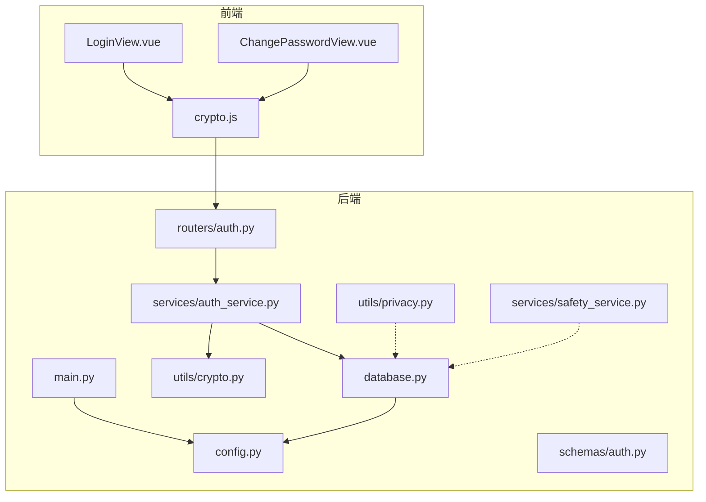
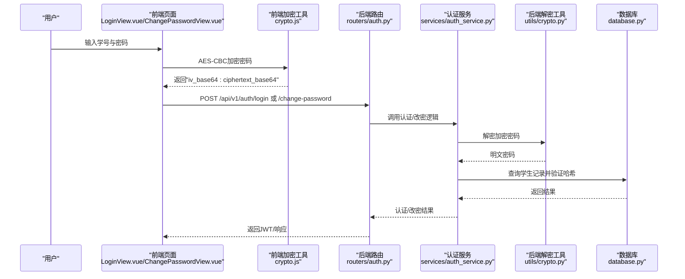
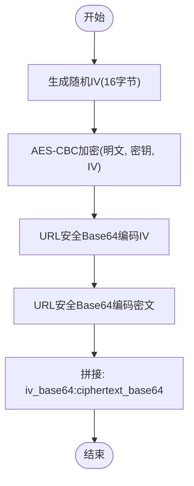
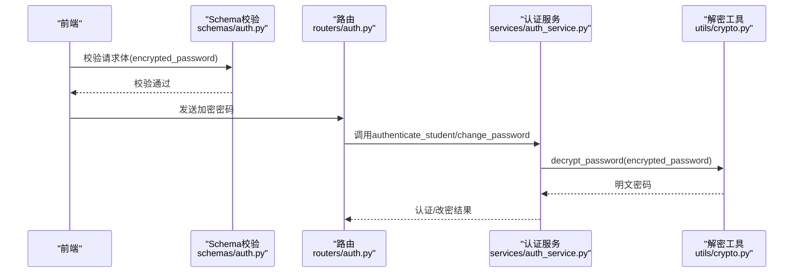
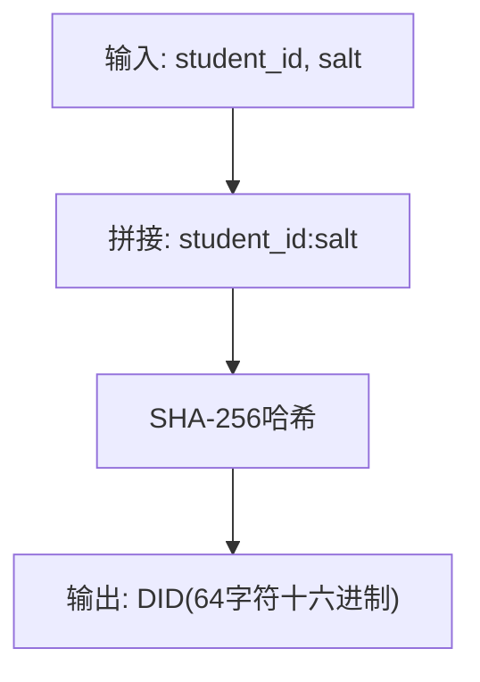
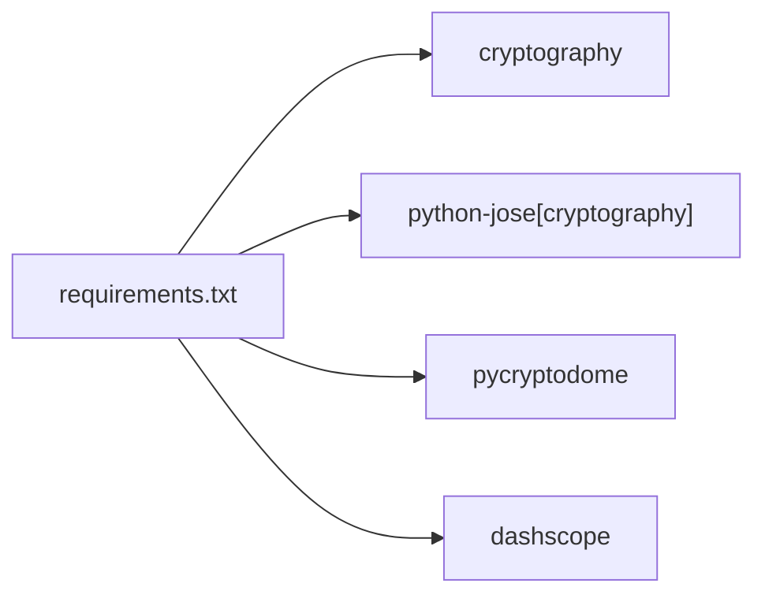

# 数据安全

<cite>
**本文引用的文件**
- [frontend/ai_assistant/src/utils/crypto.js](file://frontend/ai_assistant/src/utils/crypto.js)
- [service/ai_assistant/app/utils/crypto.py](file://service/ai_assistant/app/utils/crypto.py)
- [service/ai_assistant/app/schemas/auth.py](file://service/ai_assistant/app/schemas/auth.py)
- [service/ai_assistant/app/services/auth_service.py](file://service/ai_assistant/app/services/auth_service.py)
- [service/ai_assistant/app/routers/auth.py](file://service/ai_assistant/app/routers/auth.py)
- [service/ai_assistant/app/main.py](file://service/ai_assistant/app/main.py)
- [service/ai_assistant/app/config.py](file://service/ai_assistant/app/config.py)
- [service/ai_assistant/app/database.py](file://service/ai_assistant/app/database.py)
- [service/ai_assistant/app/utils/privacy.py](file://service/ai_assistant/app/utils/privacy.py)
- [service/ai_assistant/app/services/safety_service.py](file://service/ai_assistant/app/services/safety_service.py)
- [frontend/ai_assistant/src/views/LoginView.vue](file://frontend/ai_assistant/src/views/LoginView.vue)
- [frontend/ai_assistant/src/views/ChangePasswordView.vue](file://frontend/ai_assistant/src/views/ChangePasswordView.vue)
- [service/ai_assistant/requirements.txt](file://service/ai_assistant/requirements.txt)
</cite>

## 目录
1. [引言](#引言)
2. [项目结构](#项目结构)
3. [核心组件](#核心组件)
4. [架构总览](#架构总览)
5. [详细组件分析](#详细组件分析)
6. [依赖分析](#依赖分析)
7. [性能考量](#性能考量)
8. [故障排查指南](#故障排查指南)
9. [结论](#结论)
10. [附录](#附录)

## 引言
本文件面向AI校园助手项目，系统化阐述数据安全设计与实现，覆盖以下方面：
- 对称加密机制：AES-CBC对称加密的实现原理与前后端协同流程
- 密码加密与传输：从前端CryptoJS加密到后端解密的完整链路
- 隐私数据保护：敏感信息过滤、数据脱敏技术与隐私合规要点
- 数据库连接安全：SSL/TLS与连接池安全配置建议
- 数据传输安全：HTTPS与数据完整性校验的最佳实践
- 数据备份与恢复：安全策略与生命周期管理

## 项目结构
项目采用前后端分离架构，前端使用Vue 3 + Vite，后端基于FastAPI + SQLAlchemy异步ORM，安全相关逻辑分布在前端加密工具、后端解密与认证服务、隐私与安全检测模块中。

图表来源
- [frontend/ai_assistant/src/utils/crypto.js:1-40](file://frontend/ai_assistant/src/utils/crypto.js#L1-L40)
- [service/ai_assistant/app/utils/crypto.py:1-73](file://service/ai_assistant/app/utils/crypto.py#L1-L73)
- [service/ai_assistant/app/schemas/auth.py:1-56](file://service/ai_assistant/app/schemas/auth.py#L1-L56)
- [service/ai_assistant/app/services/auth_service.py:1-253](file://service/ai_assistant/app/services/auth_service.py#L1-L253)
- [service/ai_assistant/app/routers/auth.py:1-102](file://service/ai_assistant/app/routers/auth.py#L1-L102)
- [service/ai_assistant/app/main.py:1-86](file://service/ai_assistant/app/main.py#L1-L86)
- [service/ai_assistant/app/config.py:1-113](file://service/ai_assistant/app/config.py#L1-L113)
- [service/ai_assistant/app/database.py:1-35](file://service/ai_assistant/app/database.py#L1-L35)
- [service/ai_assistant/app/utils/privacy.py:1-23](file://service/ai_assistant/app/utils/privacy.py#L1-L23)
- [service/ai_assistant/app/services/safety_service.py:1-163](file://service/ai_assistant/app/services/safety_service.py#L1-L163)

章节来源
- [frontend/ai_assistant/src/utils/crypto.js:1-40](file://frontend/ai_assistant/src/utils/crypto.js#L1-L40)
- [service/ai_assistant/app/utils/crypto.py:1-73](file://service/ai_assistant/app/utils/crypto.py#L1-L73)
- [service/ai_assistant/app/schemas/auth.py:1-56](file://service/ai_assistant/app/schemas/auth.py#L1-L56)
- [service/ai_assistant/app/services/auth_service.py:1-253](file://service/ai_assistant/app/services/auth_service.py#L1-L253)
- [service/ai_assistant/app/routers/auth.py:1-102](file://service/ai_assistant/app/routers/auth.py#L1-L102)
- [service/ai_assistant/app/main.py:1-86](file://service/ai_assistant/app/main.py#L1-L86)
- [service/ai_assistant/app/config.py:1-113](file://service/ai_assistant/app/config.py#L1-L113)
- [service/ai_assistant/app/database.py:1-35](file://service/ai_assistant/app/database.py#L1-L35)
- [service/ai_assistant/app/utils/privacy.py:1-23](file://service/ai_assistant/app/utils/privacy.py#L1-L23)
- [service/ai_assistant/app/services/safety_service.py:1-163](file://service/ai_assistant/app/services/safety_service.py#L1-L163)

## 核心组件
- 前端加密工具：提供AES-CBC加密与URL安全Base64编码，输出格式为“iv_base64:ciphertext_base64”
- 后端解密工具：与前端保持一致的密钥长度与编码规范，执行解密与PKCS7去填充
- 认证服务：负责登录与改密流程，调用解密工具验证口令哈希
- 隐私工具：基于学生ID与盐值生成稳定DID，用于替代真实ID进行日志关联
- 安全检测：对用户消息进行危险内容与隐私违规检测，支持公共查询放行与正则回退
- 配置与数据库：集中管理密钥、JWT、CORS、数据库URL与连接池参数

章节来源
- [frontend/ai_assistant/src/utils/crypto.js:26-40](file://frontend/ai_assistant/src/utils/crypto.js#L26-L40)
- [service/ai_assistant/app/utils/crypto.py:39-73](file://service/ai_assistant/app/utils/crypto.py#L39-L73)
- [service/ai_assistant/app/services/auth_service.py:125-170](file://service/ai_assistant/app/services/auth_service.py#L125-L170)
- [service/ai_assistant/app/utils/privacy.py:9-23](file://service/ai_assistant/app/utils/privacy.py#L9-L23)
- [service/ai_assistant/app/services/safety_service.py:84-144](file://service/ai_assistant/app/services/safety_service.py#L84-L144)
- [service/ai_assistant/app/config.py:37-43](file://service/ai_assistant/app/config.py#L37-L43)
- [service/ai_assistant/app/database.py:7-20](file://service/ai_assistant/app/database.py#L7-L20)

## 架构总览
下图展示从用户登录到认证完成的端到端数据流，重点标注加密与解密环节。

图表来源
- [frontend/ai_assistant/src/views/LoginView.vue:94-121](file://frontend/ai_assistant/src/views/LoginView.vue#L94-L121)
- [frontend/ai_assistant/src/views/ChangePasswordView.vue:190-232](file://frontend/ai_assistant/src/views/ChangePasswordView.vue#L190-L232)
- [frontend/ai_assistant/src/utils/crypto.js:26-40](file://frontend/ai_assistant/src/utils/crypto.js#L26-L40)
- [service/ai_assistant/app/routers/auth.py:24-52](file://service/ai_assistant/app/routers/auth.py#L24-L52)
- [service/ai_assistant/app/services/auth_service.py:125-170](file://service/ai_assistant/app/services/auth_service.py#L125-L170)
- [service/ai_assistant/app/utils/crypto.py:39-73](file://service/ai_assistant/app/utils/crypto.py#L39-L73)
- [service/ai_assistant/app/database.py:27-35](file://service/ai_assistant/app/database.py#L27-L35)

## 详细组件分析

### AES-CBC对称加密与解密
- 实现原理
  - 前端使用CryptoJS进行AES-CBC加密，PKCS7填充，IV长度16字节
  - 将IV与密文分别进行URL安全Base64编码，并以“iv_base64:ciphertext_base64”拼接
  - 后端使用PyCryptodome解密，先还原URL安全编码，再执行CBC解密与去填充
- 关键点
  - 密钥长度必须为16/24/32字符，与后端一致
  - IV长度固定为16字节，且每次加密随机生成
  - 编码统一采用URL安全字符集，避免传输问题

图表来源
- [frontend/ai_assistant/src/utils/crypto.js:26-40](file://frontend/ai_assistant/src/utils/crypto.js#L26-L40)

章节来源
- [frontend/ai_assistant/src/utils/crypto.js:1-40](file://frontend/ai_assistant/src/utils/crypto.js#L1-L40)
- [service/ai_assistant/app/utils/crypto.py:17-73](file://service/ai_assistant/app/utils/crypto.py#L17-L73)

### 密码加密流程（前端到后端）
- 前端
  - 登录与改密页面收集学号与密码，调用加密工具生成“iv_base64:ciphertext_base64”
  - 将该字符串随请求体发送至后端
- 后端
  - 路由接收加密密码字段，调用认证服务
  - 认证服务解密后与数据库中存储的哈希进行比对
  - 成功后签发JWT，失败返回相应HTTP状态码

图表来源
- [service/ai_assistant/app/schemas/auth.py:4-21](file://service/ai_assistant/app/schemas/auth.py#L4-L21)
- [service/ai_assistant/app/routers/auth.py:24-52](file://service/ai_assistant/app/routers/auth.py#L24-L52)
- [service/ai_assistant/app/services/auth_service.py:125-170](file://service/ai_assistant/app/services/auth_service.py#L125-L170)
- [service/ai_assistant/app/utils/crypto.py:39-73](file://service/ai_assistant/app/utils/crypto.py#L39-L73)

章节来源
- [service/ai_assistant/app/schemas/auth.py:4-21](file://service/ai_assistant/app/schemas/auth.py#L4-L21)
- [service/ai_assistant/app/routers/auth.py:24-52](file://service/ai_assistant/app/routers/auth.py#L24-L52)
- [service/ai_assistant/app/services/auth_service.py:125-170](file://service/ai_assistant/app/services/auth_service.py#L125-L170)

### 隐私数据保护与脱敏
- DID生成
  - 基于学生ID与盐值生成稳定的SHA-256哈希作为DID
  - 同一学生始终生成相同DID，便于日志关联但不暴露真实ID
- 隐私检测
  - 对消息进行危险内容与隐私违规检测
  - 放行公共服务联系方式查询，避免误判
  - 正则回退与异常降级，保证安全边界

图表来源
- [service/ai_assistant/app/utils/privacy.py:9-23](file://service/ai_assistant/app/utils/privacy.py#L9-L23)

章节来源
- [service/ai_assistant/app/utils/privacy.py:9-23](file://service/ai_assistant/app/utils/privacy.py#L9-L23)
- [service/ai_assistant/app/services/safety_service.py:84-144](file://service/ai_assistant/app/services/safety_service.py#L84-L144)

### 数据库连接加密与连接池安全
- 连接URL
  - 使用SQLAlchemy异步引擎，数据库URL由配置类动态拼装
- 连接池参数
  - 开启pool_pre_ping提升连接可用性
  - 设置pool_recycle控制连接生命周期
- SSL/TLS建议
  - MySQL侧启用TLS（本仓库未直接配置，建议在生产环境开启）
  - 使用强密码与最小权限账户

章节来源
- [service/ai_assistant/app/config.py:86-91](file://service/ai_assistant/app/config.py#L86-L91)
- [service/ai_assistant/app/database.py:7-20](file://service/ai_assistant/app/database.py#L7-L20)

### 数据传输安全最佳实践
- HTTPS
  - 生产环境必须启用HTTPS，防止中间人攻击与明文泄露
- CORS
  - 严格限制allow_origins为可信域名，避免跨域风险
- 请求校验
  - 使用Pydantic模型对请求体进行字段校验与兼容处理
- 敏感字段
  - 密码始终以加密形式传输，后端不记录明文

章节来源
- [service/ai_assistant/app/main.py:70-76](file://service/ai_assistant/app/main.py#L70-L76)
- [service/ai_assistant/app/schemas/auth.py:4-21](file://service/ai_assistant/app/schemas/auth.py#L4-L21)

### 数据备份与恢复安全策略
- 备份
  - 定期导出数据库快照，加密存储于受控介质
  - 限制备份文件访问权限，遵循最小权限原则
- 恢复
  - 仅在隔离环境验证备份完整性与可用性
  - 恢复后进行安全扫描与权限审计
- 生命周期
  - 设定备份保留周期，到期自动销毁
  - 日志与敏感数据按法规要求定期清理

[本节为通用指导，无需特定文件引用]

### 数据生命周期管理的安全考虑
- 创建：仅采集必要信息，启用输入校验与脱敏
- 使用：最小授权访问，记录审计日志
- 存储：敏感字段加密存储，定期轮换密钥
- 变更：变更操作需二次验证，记录变更轨迹
- 删除：支持数据最小化删除，满足“被遗忘权”

[本节为通用指导，无需特定文件引用]

## 依赖分析
后端依赖中包含加密与安全相关库，确保解密与签名能力。

图表来源
- [service/ai_assistant/requirements.txt:7-13](file://service/ai_assistant/requirements.txt#L7-L13)

章节来源
- [service/ai_assistant/requirements.txt:1-22](file://service/ai_assistant/requirements.txt#L1-L22)

## 性能考量
- 前端加密
  - AES-CBC加解密开销较小，适合浏览器端实时处理
- 后端解密
  - 单次解密与哈希验证，性能瓶颈不在加密路径
- 数据库
  - 异步引擎与连接池参数已优化，建议结合监控指标持续评估

[本节为通用指导，无需特定文件引用]

## 故障排查指南
- “无效的加密格式/IV分隔符缺失”
  - 检查前端是否正确生成“iv_base64:ciphertext_base64”
  - 确认URL安全编码还原逻辑
- “AES解密失败”
  - 核对密钥长度与后端一致
  - 确认IV长度为16字节
- “学号或密码无效”
  - 检查后端日志与认证服务异常分支
  - 确认数据库中哈希存储格式与验证逻辑
- “不安全默认值警告”
  - 部署前务必在环境变量中替换默认密钥与盐值

章节来源
- [service/ai_assistant/app/utils/crypto.py:52-73](file://service/ai_assistant/app/utils/crypto.py#L52-L73)
- [service/ai_assistant/app/services/auth_service.py:156-169](file://service/ai_assistant/app/services/auth_service.py#L156-L169)
- [service/ai_assistant/app/main.py:25-34](file://service/ai_assistant/app/main.py#L25-L34)

## 结论
本项目在数据安全方面实现了端到端的密码加密与解密、隐私数据脱敏与安全检测，配合严格的配置与连接池参数，形成较为完整的安全基线。建议在生产环境进一步强化HTTPS、数据库TLS与密钥轮换策略，持续完善安全监控与事件响应机制。

## 附录
- 前端加密工具与后端解密工具的密钥长度与编码规范需保持一致
- 认证流程中所有密码均以加密形式传输，后端仅做一次性解密与哈希验证
- 隐私检测模块支持公共查询放行与正则回退，确保安全与可用性的平衡