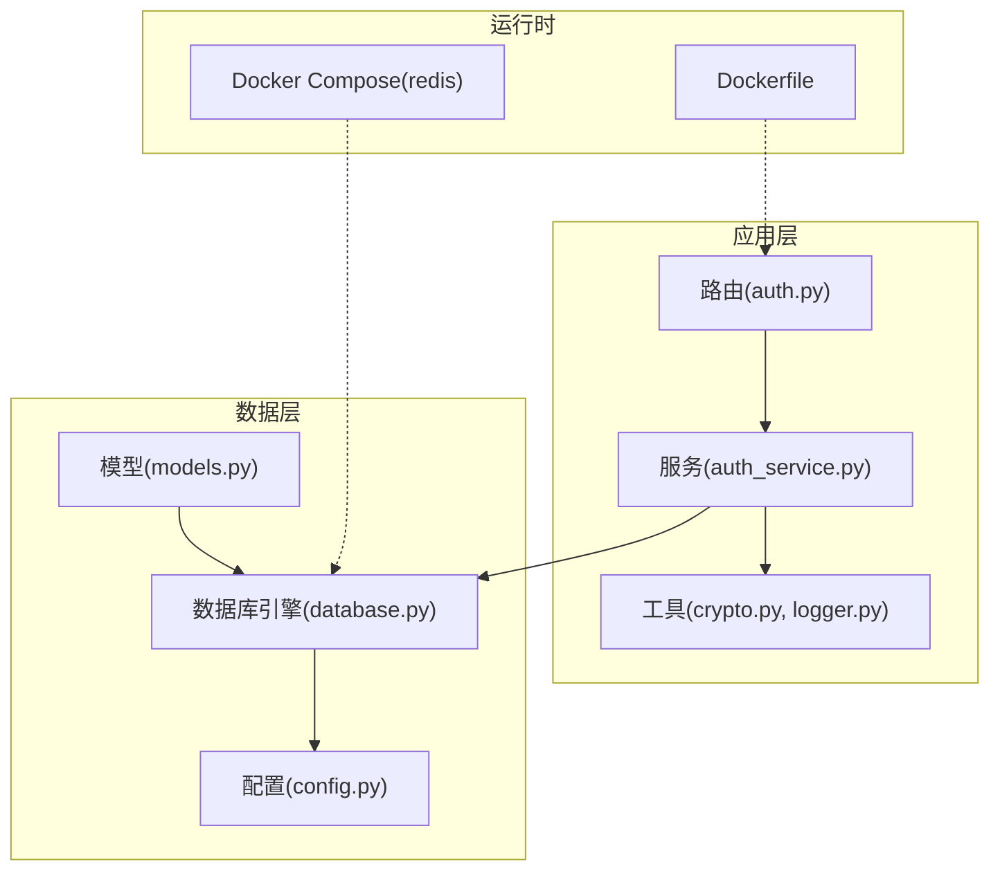
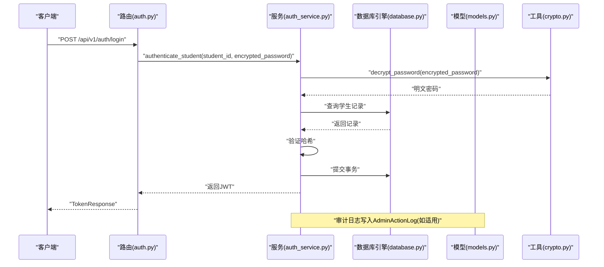
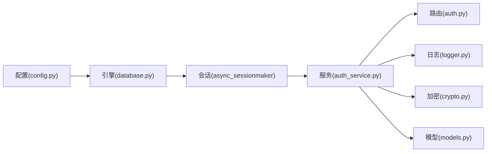

# 数据库安全配置

<cite>
**本文引用的文件**
- [database.py](file://service/ai_assistant/app/database.py)
- [config.py](file://service/ai_assistant/app/config.py)
- [models.py](file://service/ai_assistant/app/models/models.py)
- [auth_service.py](file://service/ai_assistant/app/services/auth_service.py)
- [crypto.py](file://service/ai_assistant/app/utils/crypto.py)
- [logger.py](file://service/ai_assistant/app/utils/logger.py)
- [auth.py](file://service/ai_assistant/app/routers/auth.py)
- [docker-compose.yml](file://service/ai_assistant/docker-compose.yml)
- [Dockerfile](file://service/ai_assistant/Dockerfile)
- [main.py](file://service/ai_assistant/app/main.py)
</cite>

## 目录
1. [简介](#简介)
2. [项目结构](#项目结构)
3. [核心组件](#核心组件)
4. [架构总览](#架构总览)
5. [详细组件分析](#详细组件分析)
6. [依赖分析](#依赖分析)
7. [性能考虑](#性能考虑)
8. [故障排查指南](#故障排查指南)
9. [结论](#结论)
10. [附录](#附录)

## 简介
本文件面向“AI校园助手”的数据库安全配置，聚焦以下方面：
- 数据库连接加密：当前实现未启用SSL/TLS，建议在生产环境增加SSL/TLS配置与证书管理。
- 连接池安全：基于现有连接池参数，给出连接超时、最大连接数与连接复用的安全策略建议。
- 行级数据安全：通过角色权限控制与审计日志实现最小授权与可追溯性。
- 凭据管理：基于环境变量的配置与密钥轮换最佳实践。
- 审计与监控：结合现有日志系统与审计表设计，提出审计与监控配置思路。
- 备份与存储：提出备份数据的安全存储要求与流程建议。

## 项目结构
后端采用FastAPI + SQLAlchemy Async + aiomysql驱动，数据库连接与会话管理集中在应用层，模型定义覆盖业务实体与审计日志表。

图表来源
- [auth.py:1-102](file://service/ai_assistant/app/routers/auth.py#L1-L102)
- [auth_service.py:1-253](file://service/ai_assistant/app/services/auth_service.py#L1-L253)
- [database.py:1-35](file://service/ai_assistant/app/database.py#L1-L35)
- [config.py:1-113](file://service/ai_assistant/app/config.py#L1-L113)
- [models.py:1-660](file://service/ai_assistant/app/models/models.py#L1-L660)
- [docker-compose.yml:1-31](file://service/ai_assistant/docker-compose.yml#L1-L31)
- [Dockerfile:1-49](file://service/ai_assistant/Dockerfile#L1-L49)

章节来源
- [database.py:1-35](file://service/ai_assistant/app/database.py#L1-L35)
- [config.py:1-113](file://service/ai_assistant/app/config.py#L1-L113)
- [docker-compose.yml:1-31](file://service/ai_assistant/docker-compose.yml#L1-L31)
- [Dockerfile:1-49](file://service/ai_assistant/Dockerfile#L1-L49)

## 核心组件
- 数据库引擎与会话
  - 使用异步引擎与会话工厂，开启连接预热与回收策略，便于长连接场景下的稳定性与资源复用。
  - 提供异步上下文管理器以确保会话生命周期可控。
- 配置与凭据
  - 通过Pydantic Settings从环境文件读取数据库凭据，支持敏感字段按需注入。
  - 提供数据库URL拼装属性，便于集中管理连接参数。
- 模型与审计
  - 定义管理员与操作审计表，包含目标表、主键、变更前后快照、请求IP等字段，支撑审计追踪。
- 认证与安全
  - 登录流程使用AES-CBC解密前端加密密码，再与数据库哈希对比，避免明文密码落地。
  - 日志系统统一落盘，便于审计与问题定位。

章节来源
- [database.py:1-35](file://service/ai_assistant/app/database.py#L1-L35)
- [config.py:85-91](file://service/ai_assistant/app/config.py#L85-L91)
- [models.py:86-112](file://service/ai_assistant/app/models/models.py#L86-L112)
- [auth_service.py:125-170](file://service/ai_assistant/app/services/auth_service.py#L125-L170)
- [crypto.py:1-73](file://service/ai_assistant/app/utils/crypto.py#L1-L73)
- [logger.py:1-53](file://service/ai_assistant/app/utils/logger.py#L1-L53)

## 架构总览
下图展示数据库安全相关的关键交互路径：路由接收请求，服务层执行认证与业务逻辑，数据库层负责持久化与审计。

图表来源
- [auth.py:24-52](file://service/ai_assistant/app/routers/auth.py#L24-L52)
- [auth_service.py:125-170](file://service/ai_assistant/app/services/auth_service.py#L125-L170)
- [crypto.py:39-73](file://service/ai_assistant/app/utils/crypto.py#L39-L73)
- [database.py:27-35](file://service/ai_assistant/app/database.py#L27-L35)
- [models.py:86-112](file://service/ai_assistant/app/models/models.py#L86-L112)

## 详细组件分析

### 数据库连接加密（SSL/TLS）
现状
- 当前数据库URL未显式启用SSL/TLS参数，连接默认为明文。
- 未见证书文件挂载或CA证书配置。

建议与实现要点
- 在生产环境为MySQL连接启用SSL/TLS，强制加密通道，防止中间人攻击与窃听。
- 将服务器证书与客户端证书/私钥以安全方式挂载至容器或主机，避免明文存储。
- 在数据库URL中添加SSL参数（如ssl_mode、ssl_ca、ssl_cert、ssl_key），并与后端配置项对接。
- 对于容器部署，通过卷挂载或密钥管理服务注入证书文件，避免硬编码。

章节来源
- [config.py:85-91](file://service/ai_assistant/app/config.py#L85-L91)
- [database.py:7-12](file://service/ai_assistant/app/database.py#L7-L12)

### 连接池安全配置
现状
- 已启用连接预热与回收策略，有助于保持连接活性与避免长时间占用。
- 未设置连接超时、最大连接数等参数，存在资源耗尽风险。

建议与实现要点
- 设置连接超时（如连接获取超时、SQL执行超时），避免阻塞与资源泄漏。
- 限制最大连接数，结合业务并发峰值评估，防止数据库过载。
- 启用连接复用与健康检查，定期清理异常连接，提升稳定性。
- 在容器编排中，结合资源限制与健康检查，确保连接池行为可预测。

章节来源
- [database.py:7-20](file://service/ai_assistant/app/database.py#L7-L20)

### 行级数据安全与权限控制
现状
- 通过角色枚举与状态枚举实现管理员权限分级与账户状态控制。
- 审计日志表记录管理员操作轨迹，便于事后审计。

建议与实现要点
- 强制最小权限原则：不同角色仅能访问与其职责相关的数据范围。
- 在查询层加入动态过滤条件，基于当前用户角色与数据范围限制可见数据集。
- 对敏感字段（如密码哈希）仅在必要范围内暴露，避免泄露。
- 审计日志保留完整上下文（操作者、目标、前后快照、IP、时间戳），满足合规要求。

章节来源
- [models.py:28-84](file://service/ai_assistant/app/models/models.py#L28-L84)
- [models.py:86-112](file://service/ai_assistant/app/models/models.py#L86-L112)

### 数据库凭据管理与密钥轮换
现状
- 数据库凭据通过环境变量注入，符合安全基线。
- 未见密钥轮换流程与自动刷新机制。

建议与实现要点
- 使用环境变量或密钥管理服务（如KMS、Vault）注入数据库凭据，避免硬编码。
- 实施密钥轮换：定期更换数据库密码，配合应用重启或动态刷新，确保平滑过渡。
- 对外暴露的凭据（如Redis）同样遵循最小权限与轮换策略。
- 在容器编排中，通过Secrets或环境变量挂载，避免镜像携带敏感信息。

章节来源
- [config.py:19-24](file://service/ai_assistant/app/config.py#L19-L24)
- [docker-compose.yml:13-19](file://service/ai_assistant/docker-compose.yml#L13-L19)

### 审计与监控
现状
- 使用统一日志系统落盘，便于问题定位与审计。
- 审计日志表记录管理员操作，支持按时间与目标聚合。

建议与实现要点
- 结合数据库慢查询日志与连接数统计，建立数据库侧监控指标。
- 将应用日志与数据库日志关联，形成端到端审计链路。
- 对高风险操作（如批量删除、权限变更）增加告警阈值与人工确认流程。
- 审计日志长期归档与访问控制，满足合规要求。

章节来源
- [logger.py:17-47](file://service/ai_assistant/app/utils/logger.py#L17-L47)
- [models.py:86-112](file://service/ai_assistant/app/models/models.py#L86-L112)

### 备份与安全存储
建议与实现要点
- 备份策略：定期全量+增量备份，保留至少7天的恢复点。
- 加密存储：备份文件在传输与存储阶段均需加密，密钥与数据分离管理。
- 访问控制：备份介质仅限授权人员访问，定期轮换访问权限。
- 恢复演练：定期进行备份恢复演练，验证完整性与可用性。

## 依赖分析
数据库相关组件之间的耦合关系如下：

图表来源
- [config.py:85-91](file://service/ai_assistant/app/config.py#L85-L91)
- [database.py:1-35](file://service/ai_assistant/app/database.py#L1-L35)
- [auth_service.py:1-253](file://service/ai_assistant/app/services/auth_service.py#L1-L253)
- [auth.py:1-102](file://service/ai_assistant/app/routers/auth.py#L1-L102)
- [logger.py:1-53](file://service/ai_assistant/app/utils/logger.py#L1-L53)
- [crypto.py:1-73](file://service/ai_assistant/app/utils/crypto.py#L1-L73)
- [models.py:1-660](file://service/ai_assistant/app/models/models.py#L1-L660)

章节来源
- [config.py:1-113](file://service/ai_assistant/app/config.py#L1-L113)
- [database.py:1-35](file://service/ai_assistant/app/database.py#L1-L35)
- [auth_service.py:1-253](file://service/ai_assistant/app/services/auth_service.py#L1-L253)
- [auth.py:1-102](file://service/ai_assistant/app/routers/auth.py#L1-L102)
- [logger.py:1-53](file://service/ai_assistant/app/utils/logger.py#L1-L53)
- [crypto.py:1-73](file://service/ai_assistant/app/utils/crypto.py#L1-L73)
- [models.py:1-660](file://service/ai_assistant/app/models/models.py#L1-L660)

## 性能考虑
- 连接池参数调优：根据QPS与并发连接峰值调整最大连接数与超时，避免抖动。
- 查询优化：为高频查询字段建立索引，减少全表扫描；对复杂查询使用分页与LIMIT。
- 缓存策略：对热点数据引入缓存，降低数据库压力；注意缓存与数据库一致性。
- 日志级别：生产环境建议INFO以上级别，避免过多DEBUG日志影响IO。

## 故障排查指南
常见问题与定位步骤
- 连接失败
  - 检查数据库URL拼装与凭据是否正确。
  - 确认网络连通与防火墙策略。
  - 参考连接池参数与超时设置，避免误判为服务不可用。
- 认证失败
  - 核对前端加密格式与后端解密逻辑是否一致。
  - 检查哈希算法兼容性与存储格式。
- 审计缺失
  - 确认审计表DDL与索引是否完整。
  - 检查日志落盘路径与权限。
- 性能瓶颈
  - 关注慢查询日志与连接池使用率。
  - 评估索引与查询计划，必要时重构SQL。

章节来源
- [config.py:85-91](file://service/ai_assistant/app/config.py#L85-L91)
- [auth_service.py:125-170](file://service/ai_assistant/app/services/auth_service.py#L125-L170)
- [crypto.py:39-73](file://service/ai_assistant/app/utils/crypto.py#L39-L73)
- [logger.py:17-47](file://service/ai_assistant/app/utils/logger.py#L17-L47)
- [models.py:86-112](file://service/ai_assistant/app/models/models.py#L86-L112)

## 结论
- 当前实现具备基础的凭据注入与日志落盘能力，但缺少数据库连接加密与完善的连接池安全参数。
- 建议在生产环境补充SSL/TLS与证书管理，完善连接池超时与容量控制，并强化行级权限与审计。
- 通过密钥轮换与备份加密存储，构建完整的数据生命周期安全体系。

## 附录
- 环境变量与配置项
  - 数据库：MYSQL_HOST、MYSQL_PORT、MYSQL_USER、MYSQL_PASSWORD、MYSQL_DATABASE
  - JWT：JWT_SECRET_KEY、JWT_ALGORITHM、JWT_EXPIRE_MINUTES
  - AES：AES_SECRET_KEY
  - Redis：REDIS_HOST、REDIS_PORT、REDIS_PASSWORD、REDIS_DB
- 容器与编排
  - Redis服务通过环境变量设置密码并限制内存，建议为数据库容器同样设置资源限制与健康检查。
- 安全基线
  - 所有敏感凭据通过环境变量或密钥管理服务注入。
  - 生产环境强制启用TLS，证书由可信CA签发并定期轮换。
  - 审计日志与数据库日志联动，确保可追溯性与合规性。

章节来源
- [config.py:19-50](file://service/ai_assistant/app/config.py#L19-L50)
- [docker-compose.yml:13-22](file://service/ai_assistant/docker-compose.yml#L13-L22)
- [main.py:17-39](file://service/ai_assistant/app/main.py#L17-L39)