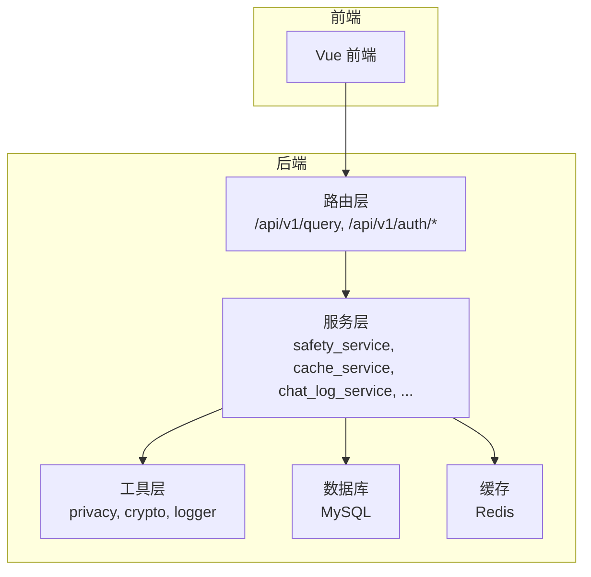
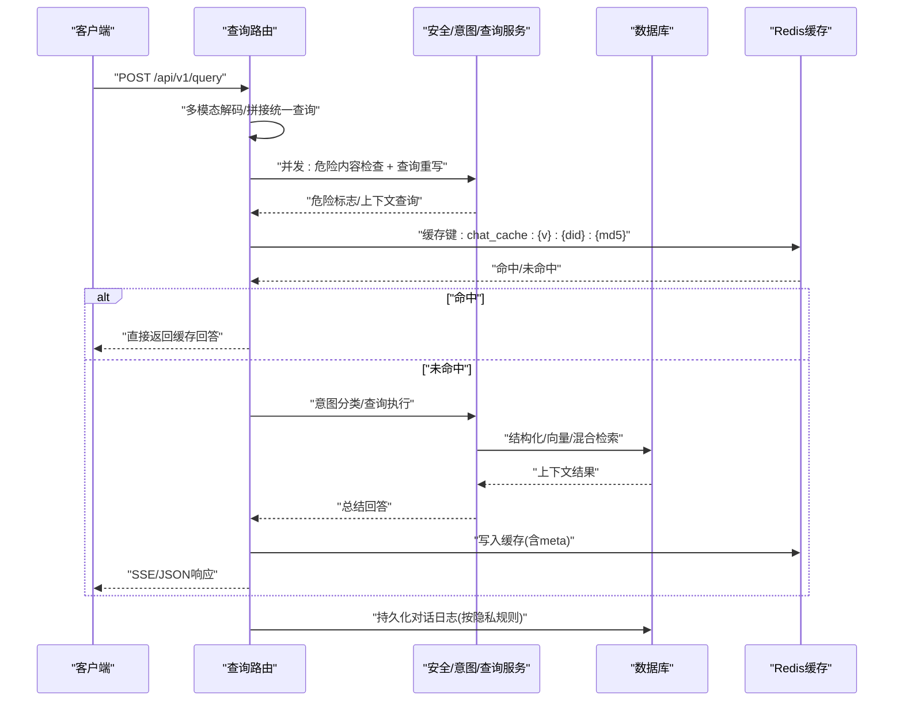
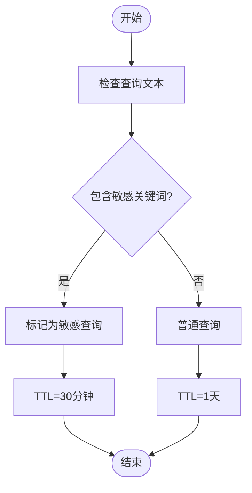
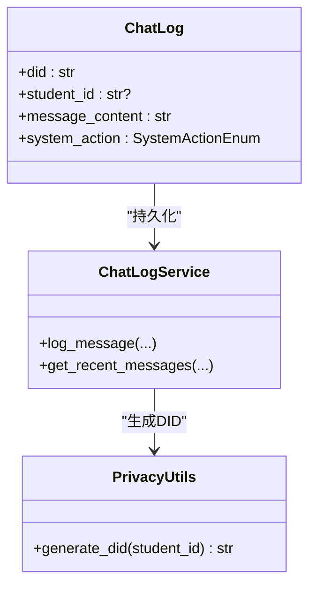
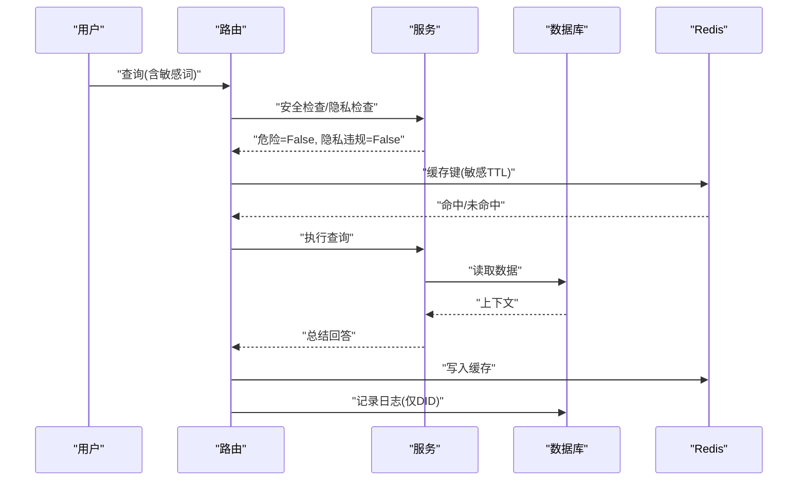
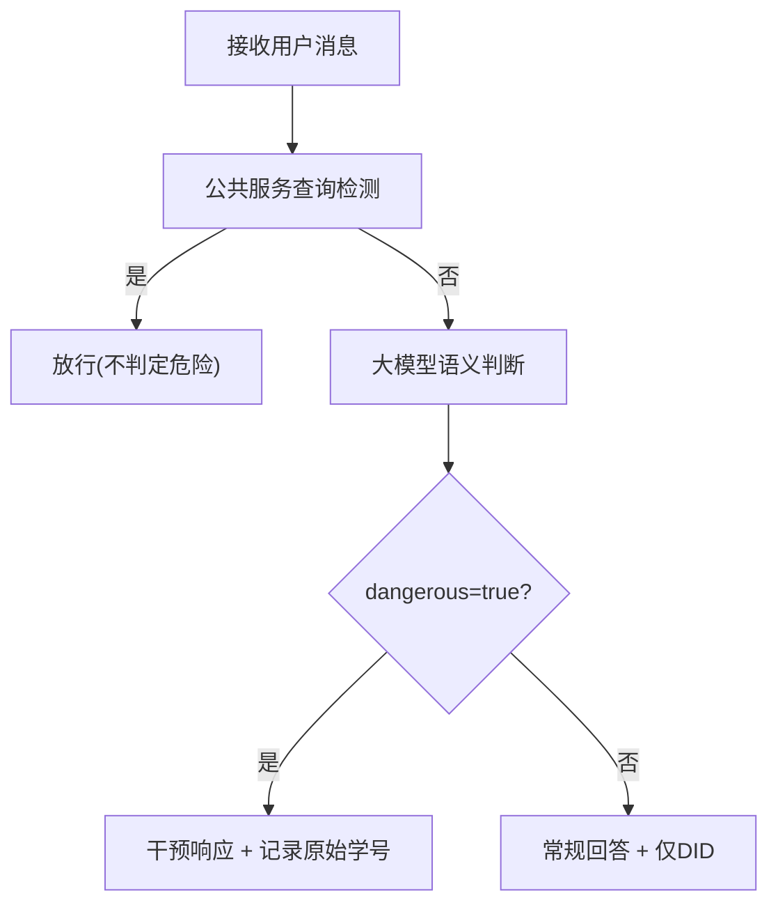
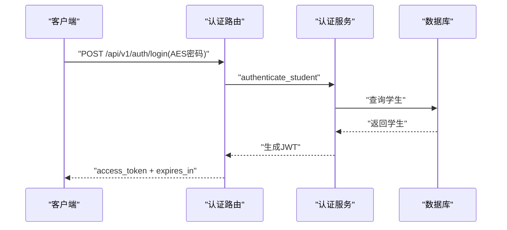
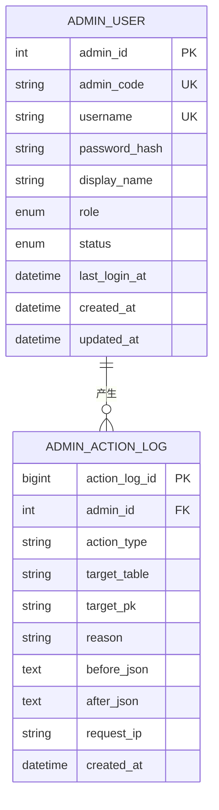
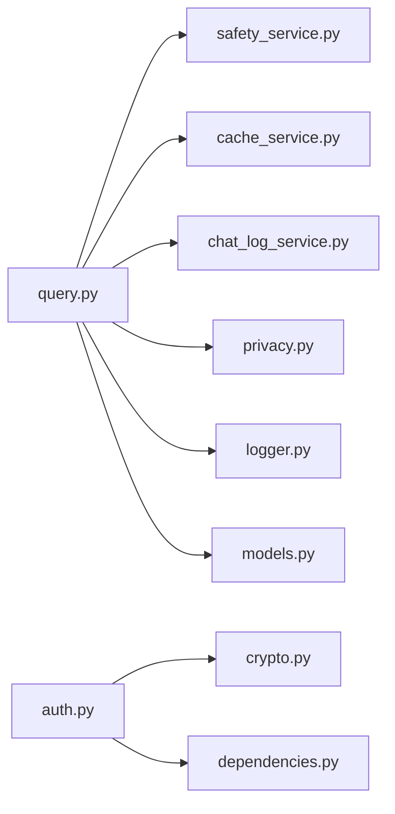

# 隐私数据保护

<cite>
**本文档引用的文件**
- [privacy.py](file://service/ai_assistant/app/utils/privacy.py)
- [safety_service.py](file://service/ai_assistant/app/services/safety_service.py)
- [config.py](file://service/ai_assistant/app/config.py)
- [models.py](file://service/ai_assistant/app/models/models.py)
- [chat_log_service.py](file://service/ai_assistant/app/services/chat_log_service.py)
- [query.py](file://service/ai_assistant/app/routers/query.py)
- [auth.py](file://service/ai_assistant/app/routers/auth.py)
- [crypto.py](file://service/ai_assistant/app/utils/crypto.py)
- [cache_service.py](file://service/ai_assistant/app/services/cache_service.py)
- [logger.py](file://service/ai_assistant/app/utils/logger.py)
- [dependencies.py](file://service/ai_assistant/app/dependencies.py)
- [query.py](file://service/ai_assistant/app/schemas/query.py)
</cite>

## 目录
1. [简介](#简介)
2. [项目结构](#项目结构)
3. [核心组件](#核心组件)
4. [架构总览](#架构总览)
5. [详细组件分析](#详细组件分析)
6. [依赖分析](#依赖分析)
7. [性能考虑](#性能考虑)
8. [故障排查指南](#故障排查指南)
9. [结论](#结论)
10. [附录](#附录)

## 简介
本文件聚焦于AI校园助手系统的隐私数据保护机制，围绕以下目标展开：
- 敏感信息过滤与识别：学生个人信息、成绩数据、教师隐私的识别与处理规则
- 数据脱敏技术：部分隐藏、随机化、泛化等方法的实现与应用
- 隐私合规：数据最小化原则与用户同意机制
- 内容安全检查：敏感词汇过滤与危险内容检测
- 访问控制与审计日志：权限控制与日志配置方法

## 项目结构
后端采用FastAPI + SQLAlchemy + Redis + MySQL的分层架构，隐私保护相关能力分布在工具层、服务层与路由层：
- 工具层：隐私标识生成、密码解密、日志配置
- 服务层：安全检查、缓存策略、对话日志、意图与检索
- 路由层：统一查询入口、认证入口、会话清理

图表来源
- [query.py:198-745](file://service/ai_assistant/app/routers/query.py#L198-L745)
- [auth.py:24-101](file://service/ai_assistant/app/routers/auth.py#L24-L101)
- [dependencies.py:27-109](file://service/ai_assistant/app/dependencies.py#L27-L109)

章节来源
- [query.py:1-788](file://service/ai_assistant/app/routers/query.py#L1-L788)
- [auth.py:1-102](file://service/ai_assistant/app/routers/auth.py#L1-L102)
- [dependencies.py:1-109](file://service/ai_assistant/app/dependencies.py#L1-L109)

## 核心组件
- 隐私标识生成：基于学生ID与盐值生成稳定、单向的DID，用于替代真实学号存储
- 内容安全检查：结合正则与大模型双重策略，识别自杀/自残/暴力倾向与隐私违规行为
- 缓存策略：按敏感度设定TTL，时间敏感与课表敏感查询具备动态失效机制
- 对话日志：按隐私规则存储，危险内容保留原始学号以便干预
- 认证与密码传输：JWT令牌与AES-CBC密码解密，保障传输与存储安全
- 日志与审计：统一日志落盘与审计日志表结构，便于追踪与合规

章节来源
- [privacy.py:9-22](file://service/ai_assistant/app/utils/privacy.py#L9-L22)
- [safety_service.py:84-144](file://service/ai_assistant/app/services/safety_service.py#L84-L144)
- [cache_service.py:85-176](file://service/ai_assistant/app/services/cache_service.py#L85-L176)
- [chat_log_service.py:14-55](file://service/ai_assistant/app/services/chat_log_service.py#L14-L55)
- [crypto.py:39-72](file://service/ai_assistant/app/utils/crypto.py#L39-L72)
- [logger.py:17-52](file://service/ai_assistant/app/utils/logger.py#L17-L52)
- [models.py:86-112](file://service/ai_assistant/app/models/models.py#L86-L112)

## 架构总览
统一查询流程在路由层完成多模态输入解码、安全检查、缓存命中、意图分类、查询执行与回答生成，并在服务层完成日志与缓存持久化。

图表来源
- [query.py:207-745](file://service/ai_assistant/app/routers/query.py#L207-L745)
- [chat_log_service.py:14-55](file://service/ai_assistant/app/services/chat_log_service.py#L14-L55)
- [cache_service.py:92-176](file://service/ai_assistant/app/services/cache_service.py#L92-L176)

## 详细组件分析

### 敏感信息过滤与识别
- 学生个人信息：姓名、性别、出生日期、入学年份、班级、手机号、邮箱、状态等字段均属于敏感信息，系统通过DID替代真实学号存储，避免直接暴露
- 成绩数据：成绩表包含分数、学分获得标记、作弊标记等，查询与缓存策略针对敏感关键词进行识别与TTL控制
- 教师隐私：教师联系方式、办公时间、房间等信息在查询中严格限制返回范围，避免泄露

图表来源
- [cache_service.py:55-89](file://service/ai_assistant/app/services/cache_service.py#L55-L89)

章节来源
- [models.py:303-402](file://service/ai_assistant/app/models/models.py#L303-L402)
- [cache_service.py:21-37](file://service/ai_assistant/app/services/cache_service.py#L21-L37)

### 数据脱敏技术实现
- 部分隐藏：在回答中对学号、手机号等关键字段进行部分遮蔽，避免完整信息泄露
- 随机化：DID生成使用盐值与哈希算法，同一学生始终生成相同标识，但无法反推出真实学号
- 泛化：对时间、地点等信息进行抽象化表达，减少可识别性

图表来源
- [privacy.py:9-22](file://service/ai_assistant/app/utils/privacy.py#L9-L22)
- [chat_log_service.py:14-55](file://service/ai_assistant/app/services/chat_log_service.py#L14-L55)
- [models.py:641-660](file://service/ai_assistant/app/models/models.py#L641-L660)

章节来源
- [privacy.py:9-22](file://service/ai_assistant/app/utils/privacy.py#L9-L22)
- [chat_log_service.py:14-55](file://service/ai_assistant/app/services/chat_log_service.py#L14-L55)

### 隐私合规与最小化原则
- 数据最小化：对话日志仅存储必要信息，普通消息不保留原始学号；危险内容才保留原始学号以便干预
- 用户同意：系统通过JWT令牌与会话机制确保只有授权用户可访问自身数据；会话清理接口允许用户主动删除缓存与历史
- 动态失效：时间敏感与课表敏感查询在跨天或管理员调整课表后自动失效，避免过期信息被误用

图表来源
- [query.py:344-474](file://service/ai_assistant/app/routers/query.py#L344-L474)
- [cache_service.py:85-176](file://service/ai_assistant/app/services/cache_service.py#L85-L176)
- [chat_log_service.py:14-55](file://service/ai_assistant/app/services/chat_log_service.py#L14-L55)

章节来源
- [query.py:344-474](file://service/ai_assistant/app/routers/query.py#L344-L474)
- [cache_service.py:85-176](file://service/ai_assistant/app/services/cache_service.py#L85-L176)

### 内容安全检查与危险内容检测
- 危险内容检测：使用大模型进行语义判断，结合正则回退，识别自杀/自残/暴力倾向
- 公共服务查询放行：对“急诊/热线/地址/联系方式”等公共服务信息查询进行放行，避免误判
- 隐私违规拦截：检测“学号/工号/ID”等关键词并阻止查询他人信息的行为

图表来源
- [safety_service.py:84-144](file://service/ai_assistant/app/services/safety_service.py#L84-L144)

章节来源
- [safety_service.py:14-37](file://service/ai_assistant/app/services/safety_service.py#L14-L37)
- [safety_service.py:84-144](file://service/ai_assistant/app/services/safety_service.py#L84-L144)

### 认证与密码传输安全
- JWT令牌：登录成功后颁发令牌，路由层通过依赖注入获取当前用户
- 密码传输：前端使用CryptoJS AES-CBC加密，后端使用相同密钥解密，避免明文传输
- 管理员权限：管理员登录与操作需额外校验角色与状态

图表来源
- [auth.py:33-52](file://service/ai_assistant/app/routers/auth.py#L33-L52)
- [crypto.py:39-72](file://service/ai_assistant/app/utils/crypto.py#L39-L72)
- [dependencies.py:56-72](file://service/ai_assistant/app/dependencies.py#L56-L72)

章节来源
- [auth.py:24-101](file://service/ai_assistant/app/routers/auth.py#L24-L101)
- [crypto.py:17-72](file://service/ai_assistant/app/utils/crypto.py#L17-L72)
- [dependencies.py:56-109](file://service/ai_assistant/app/dependencies.py#L56-L109)

### 访问控制与审计日志
- 访问控制：JWT Bearer令牌校验，路由层依赖注入获取当前用户学号，确保资源隔离
- 审计日志：管理员操作记录包含操作类型、目标表、主键、变更前后JSON、请求IP等，便于审计
- 运行日志：统一落盘至logs目录，包含时间、级别、模块、函数、行号与消息

图表来源
- [models.py:41-112](file://service/ai_assistant/app/models/models.py#L41-L112)

章节来源
- [models.py:28-112](file://service/ai_assistant/app/models/models.py#L28-L112)
- [logger.py:17-52](file://service/ai_assistant/app/utils/logger.py#L17-L52)

## 依赖分析
- 路由层依赖服务层与工具层，服务层依赖配置与日志，形成清晰的分层耦合
- 安全检查与缓存策略相互配合，既保证性能又确保安全
- 认证与依赖注入贯穿整个系统，提供统一的访问控制

图表来源
- [query.py:35-44](file://service/ai_assistant/app/routers/query.py#L35-L44)
- [auth.py:14-19](file://service/ai_assistant/app/routers/auth.py#L14-L19)
- [dependencies.py:13-16](file://service/ai_assistant/app/dependencies.py#L13-L16)

章节来源
- [query.py:1-788](file://service/ai_assistant/app/routers/query.py#L1-L788)
- [auth.py:1-102](file://service/ai_assistant/app/routers/auth.py#L1-L102)
- [dependencies.py:1-109](file://service/ai_assistant/app/dependencies.py#L1-L109)

## 性能考虑
- 缓存命中优先：对重复查询快速返回，降低数据库与LLM调用压力
- 异步与并发：安全检查与查询重写并行执行，缩短端到端延迟
- 会话隔离：Redis按会话键隔离历史，避免并发污染
- 日志分级：INFO落盘控制频率，DEBUG用于问题定位

## 故障排查指南
- 安全检查异常：若大模型调用失败，系统回退到正则匹配，确保安全不降级
- 缓存异常：Redis不可用时自动降级到数据库历史，不影响核心功能
- 日志定位：统一日志落盘，按时间、级别、模块定位问题
- 权限错误：401/403错误通常源于令牌缺失、格式错误或账户状态异常

章节来源
- [safety_service.py:134-143](file://service/ai_assistant/app/services/safety_service.py#L134-L143)
- [query.py:280-342](file://service/ai_assistant/app/routers/query.py#L280-L342)
- [logger.py:17-52](file://service/ai_assistant/app/utils/logger.py#L17-L52)
- [dependencies.py:56-109](file://service/ai_assistant/app/dependencies.py#L56-L109)

## 结论
本系统通过DID脱敏、敏感关键词识别、危险内容检测、缓存动态失效与严格的访问控制，构建了面向校园场景的隐私保护闭环。在保证用户体验的同时，遵循数据最小化与可追溯性原则，满足基本的隐私合规要求。

## 附录
- 配置项要点
  - 隐私盐值：用于DID生成的盐值
  - 缓存TTL：敏感查询30分钟，普通查询1天
  - LLM模型：安全检测使用专用模型
- 建议
  - 定期审查敏感关键词与正则规则
  - 对管理员操作增加二次确认与审批
  - 增加用户隐私政策展示与同意记录